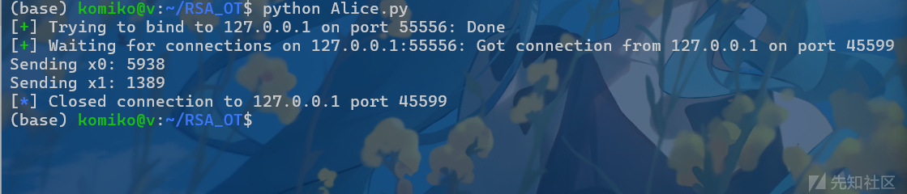
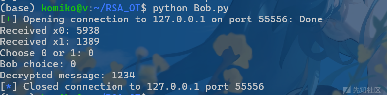
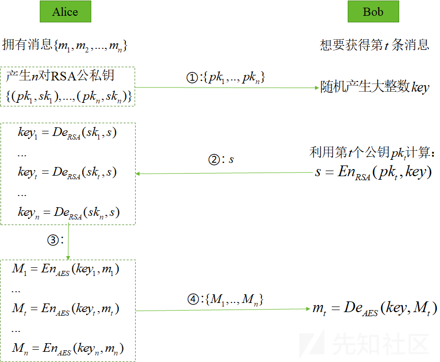

# 什么是Oblivious Transfer协议-先知社区

> **来源**: https://xz.aliyun.com/news/17468  
> **文章ID**: 17468

---

# Oblivious Transfer

# 简述：OT能做什么

想象你走进了一家神秘的魔法商店，店主拥有两本神秘魔法书 **A** 和 **B**，但你只能获得其中一本的内容，而店主不会知道你选的是哪一本。这时，店主提供了一种特殊的交易方式，让你在**不泄露你的选择**的情况下，安全地拿到你想要的魔法书。

神秘的交易规则

* 你向店主提供一张特殊的魔法卷轴，这张卷轴含有一些神秘符文，使得**店主可以给你一本书的内容，但他不知道你想要的是 A 还是 B**。
* 店主在你的卷轴上施展魔法，让它承载**一本书的内容**，但他**无法知道你的选择**。
* 你拿到卷轴后，使用你的魔法解读它，成功获得**你想要的那本书**，但你无法解读另一种书的信息。

这个神秘的交易规则也就是OT协议的核心思想，**加密魔法卷轴** = OT 协议，可以在密码学中用于保护选择的隐私，同时确保数据安全

可供选择两条信息的OT协议记为 ，可供选择n条消息的OT协议记为

OT的实现方式不止一种，本文主要介绍的是基于RSA的OT协议的实现方式

# Oblivious Transfer by RSA

## 定义：

definition from [WIKI](https://en.wikipedia.org/wiki/Oblivious_transfer)

1. A有两条消息 ，A想要发送其中一条给B。B不希望A知道他收到的是哪一条。
2. A生成一个 RSA 密钥对，包括模数N, 公钥指数e 和私钥指数d。
3. A还生成两个随机值 并将其与她的公钥模数和指数一起发送给B。
4. B选择b为 0 or 1，并选择 。
5. B 生成一个随机值k ，用它来盲化，通过计算 ,然后将其发送给A。
6. 爱丽丝将 v 与她的两个随机值相结合，生成：  和 。现在 将等于 ,另一个将是一个无意义的随机值。然而，由于A不知道B选择的 的值，她无法确定 和 中哪一个等于 。
7. 她将两个秘密信息与每个可能的密钥 和 相结合，并将它们都发送给B。
8. B 知道 k，因此他能够计算出 。然而，由于他不知道 ,他无法计算出 ,因此无法确定 。

## 实验：

根据以上的定义，下面给出我基于python 的 pwntools库写的A，B端完整的协议流程代码，希望可以帮助读者更清晰的了解整个协议过程。

```
#Alice.py
from pwn import *
import logging
import random as rd
from Crypto.Util.number import *
def rsa():
    p = getPrime(512)
    q = getPrime(512)
    n = p * q
    phi = (p - 1)*(q - 1)
    e = 65537
    d = pow(e,-1,phi)
    return n, e, d

logging.basicConfig(filename='server_log.txt', level=logging.INFO, format='%(asctime)s - %(message)s')

server = listen(55556, bindaddr="127.0.0.1")  # 强制绑定到 127.0.0.1
logging.info('Server started on 127.0.0.1')

m0 = 1234
m1 = 5678

# Generate RSA key pair
N, e, d = rsa()
server.send(f"{str(N)}
".encode())
server.send(f"{str(e)}
".encode())
logging.info('RSA key pair generated')

# Generate random values
x0 = getRandomInteger(13)
print(f"Sending x0: {x0}")
x1 = getRandomInteger(13)
print(f"Sending x1: {x1}")
server.send(f"{x0},{x1}
".encode()) 

logging.info('Random values generated')

# Receive encrypted choice
v = int(server.recvline().strip().decode()) 
logging.info(f'v value received: {v}')

k0 = pow(v - x0, d, N)
k1 = pow(v - x1, d, N)

m0_enc = (m0 + k0) % N
m1_enc = (m1 + k1) % N
server.send(f"{str(m0_enc)}
".encode())
server.send(f"{str(m1_enc)}
".encode())
logging.info('Encrypted messages sent')

server.close()
#Bob.py
from pwn import *
import logging
import random as rd

logging.basicConfig(filename='client_log.txt', level=logging.INFO, format='%(asctime)s - %(message)s')

client = remote('127.0.0.1', 55556)
logging.info('Client started')

# Receive RSA public key
N = int(client.recvline().decode())
e = int(client.recvline().decode())
logging.info(f'N value received: {N}')
logging.info(f'e value received: {e}')

# Receive random values
data = client.recvline().decode()
x0, x1 = map(int, data.split(',')) 
print(f"Received x0: {x0}")
print(f"Received x1: {x1}")
logging.info(f' value received')

# Bob chooses 0 or 1
choice = input('Choose 0 or 1: ')
print(f"Bob choice: {choice}")
logging.info(f'Bob choice: {choice}')

if choice == '0':
    x_b = x0
else:
    x_b = x1
logging.info(f"x value: {x_b}")

# Generate random k
k = rd.randint(1000, 10000)
logging.info(f'Random value generated: {k}')

# Compute v and send it
v = (x_b + pow(k, e, N)) % N 
client.send(f"{str(v)}
".encode()) #time out
client.shutdown('send') 
logging.info(f'v value sent: {v}')

# Receive encrypted messages
m0_enc = int(client.recvline().decode())
m1_enc = int(client.recvline().decode())
logging.info('Encrypted messages received')

# Decrypt chosen message
if choice == '0':
    m = (m0_enc - k) % N
else:
    m = (m1_enc - k) % N

print(f"Decrypted message: {m}")
logging.info(f'Decrypted message: {m}')
client.close()
```

## 实验结果如下：





我们可以看到B成功可以获得指定索引的消息，而A不会泄露B不需要的消息。

基于RSA公钥算法实现的 n 选 1的OT协议流程可以由下图清晰的呈现出来



# ctf challenge

下面我们来看下OT在CTF中的实战，通常题目设置不会单一考察OT这一个知识点，且对OT的考察也不局限于基本概念，会更加的灵活。

## OK - zer0pts CTF 2022

关键考点：OT-RSA，最低位翻转

### 题目：

```
from Crypto.Util.number import isPrime, getPrime, getRandomRange, inverse
import os
import signal

signal.alarm(300)

flag = os.environ.get("FLAG", "0nepoint{GOLDEN SMILE & SILVER TEARS}")
flag = int(flag.encode().hex(), 16)

P = 2 ** 1000 - 1
while not isPrime(P): P -= 2

p = getPrime(512)
q = getPrime(512)
e = 65537
phi = (p-1)*(q-1)
d = inverse(e, phi)
n = p*q

key = getRandomRange(0, n)
ciphertext = pow(flag, e, P) ^ key

x1 = getRandomRange(0, n)
x2 = getRandomRange(0, n)

print("P = {}".format(P))
print("n = {}".format(n))
print("e = {}".format(e))
print("x1 = {}".format(x1))
print("x2 = {}".format(x2))

# pick a random number k and compute v = k**e + (x1|x2)
# if you add x1, you can get key = c1 - k mod n
# elif you add x2, you can get ciphertext = c2 - k mod n
v = int(input("v: "))

k1 = pow(v - x1, d, n)
k2 = pow(v - x2, d, n)

print("c1 = {}".format((k1 + key) % n))
print("c2 = {}".format((k2 + ciphertext) % n))
```

### 分析：

首先分析一下题目，主程序加密逻辑：

* 并取它最近的素数（即 )
* 以 为单模数 计算
* 生成随机 key，并计算：

* 生成随机数 x1、x2，要求输入 v
* 计算：

* 打印：

* 要求还原 flag

比较明显的是一个Oblivisous Tran,sfer by RSA，我们通过构造不同的 输入，会得到 返回

假设我们想得到key，就需要构造 （k是随机数） ,这样可以就得到 （ciphertext同理），我们只能传递一次参数v，所以这样的构造只能key和ciphertext二选一。但是我们需要计算  ，所以只能选其他的构造方式

### step1:构造v

我们希望构造的v 满足：

化简为：

将 带入 ，再将其带入 ，计算 的和

这样可以得到：

### step2：解M

为了描述方便，这里统一设 为 ，设 为 ，

为 。

由题：

所以 的和可以表示为：

我们得到的 有一个 干扰，我们想办法把它去掉

我们发现 ，所以 ，假设当 为奇数（即最低位为1）的时候, 一定是奇数，所以如果 也是奇数，那么可以得出：

反之当 不是奇数：

然后我们可以来恢复 的比特，根据真值表\*（简单枚举四种情况便可以得出这个结论成立）可以得出如果 ，那么有 ，也就是说 必须成立，否则 .这样就可以恢复出

最后解一个单模数的RSA( )便可以得到flag的值

### exp:

```
from Crypto.Util.number import inverse, isPrime
from ptrlib import Socket

P = 2 ** 1000 - 1
while not isPrime(P): P -= 2
e = 65537

oracles_0 = []
oracles_1 = []
for i in range(15):
    sock = Socket("localhost", 9999)
    assert P == int(sock.recvlineafter("P = "))
    n = int(sock.recvlineafter("n = "))
    assert e == int(sock.recvlineafter("e = "))
    x1 = int(sock.recvlineafter("x1 = "))
    x2 = int(sock.recvlineafter("x2 = "))

    v = (x1 + x2) * inverse(2, n) % n
    sock.sendlineafter("v: ", str(v))

    c1 = int(sock.recvlineafter("c1 = "))
    c2 = int(sock.recvlineafter("c2 = "))
    x = (c1 + c2) % n
    oracles_0.append(x if x % 2 == 0 else x + n)
    oracles_1.append(x if x % 2 == 1 else x + n)

assert len(set([o % 2 for o in oracles_0])) == 1
assert len(set([o % 2 for o in oracles_1])) == 1

def solve(oracles):
    BIT = 1024
    AVG = 2 ** BIT - 1
    l = [abs(AVG - o) for o in oracles]

    res = AVG
    while not all([d == 0 for d in l]):
        msb = 1 << (max(l).bit_length() - 1)
        res -= msb
        l = [abs(d - msb) for d in l]
    if res == 0: return
    flag = pow(res, inverse(e, P - 1), P)
    print(flag.to_bytes((flag.bit_length() + 7) // 8, "big"))

solve(oracles_0)
solve(oracles_1)
```

## \*\*Decidophobia-\*\*idekCTF 2022

### 题目：

```
#!/usr/bin/env python3

from Crypto.Util.number import *
import random
import signal

class Pool():

    def __init__(self):
    
        self.p, self.q, self.r = None, None, None

class PrimeMan():

    def __init__(self):

        self.p, self.q, self.r = None, None, None

    def gen(self, nbits, ticket):

        self.p = getPrime(nbits)
        self.q = getPrime(nbits)
        self.r = getPrime(nbits)

        self.n = self.p * self.q * self.r
        
        self.enc = pow(ticket, 0x10001, self.n)

        print("You: Integer factoring is hard! No one can steal my ticket now :D.")

    def throw_primes(self, pool):

        print("Today, you go to the forest to cut down trees as usual. You see a good tree to cut down. The tree is near a pool. But you already worked hard all day. You could not hold your ax and primes very well. The primes slip out of your hands. They go in to the pool.")

        pool.p, pool.q, pool.r = self.p, self.q, self.r
        self.p, self.q, self.r = None, None, None

    def print_backpack(self):

        print("")
        print(f"n = {self.n}")
        print(f"enc = {self.enc}")

class Mercury():

    def __init__(self):

        self.p, self.q, self.r = None, None, None
        
    def welcome_msg(self):

        print("")
        print("Mercury: What happened? Why are you crying?")

        print("")
        print("[1] I lost my primes in the pool. It is the only thing I have, I cannot recover the key without it.")
        print("[2] Ignore Mercury")

        op = int(input(">>> "))
        if op == 2:
            print("")
            print("No, you cannot ignore me <3.")

    def find_primes(self, pool):

        print("")
        print("Mercury jumps into the pool ... ") 
        self.p, self.q, self.r = pool.p, pool.q, pool.r
        pool.p, pool.q, pool.r = None, None, None
        print("He comes up with a good prime, a silver prime and a bronze prime!")

    def oblivious(self):

        P = getPrime(384)
        Q = getPrime(384)

        N = P * Q
        d = pow(0x10001, -1, (P-1)*(Q-1))

        x1 = random.randint(0, N-1)
        x2 = random.randint(0, N-1)
        x3 = random.randint(0, N-1)

        print("Mercury: It's boring to directly give you prime back, I'll give you the prime thrugh oblivious transfer! Here are the parameters: ")
        print("")
        print(f"N = {N}")
        print(f"x1 = {x1}")
        print(f"x2 = {x2}")
        print(f"x3 = {x3}")

        """
            Pick a random r and compute v = r**65537 + x1/x2/x3
            If you added x1/x2/x3, then you can retrieve p/q/r by calculating c1/c2/c3 - k % n
        """

        v = int(input("Which one is your prime? Gimme your response: "))

        k1 = pow(v-x1, d, N)
        k2 = pow(v-x2, d, N)
        k3 = pow(v-x3, d, N)

        c1 = (k1+self.p) % N
        c2 = (k2+self.q) % N
        c3 = (k3+self.r) % N

        print("")
        print(f"c1 = {c1}")
        print(f"c2 = {c2}")
        print(f"c3 = {c3}")
    
class Story():

    def __init__(self):

        self.primeman = PrimeMan()
        self.pool = Pool()
        self.mercury = Mercury()

    def prologue(self):

        print("Yesterday, you received a ticket to the royal party from PrimeKing. You were afraid that someone would steal the ticket, so you encrpyted the ticket by unbreakable RSA!")
        self.ticket = random.randint(0, 1 << 1500)
        self.primeman.gen(512, self.ticket)
        self.primeman.throw_primes(self.pool)

    def menu(self):

        print("")
        print("[1] Look in your backpack")
        print("[2] Cry")
        print("[3] Jump into the pool")
        print("[4] Go to the party")
        print("[5] Exit")

        op = int(input(">>> "))
        return op

    def loop(self, n):

        for _ in range(n):

            op = self.menu()
            if op == 1:
                self.primeman.print_backpack()
            elif op == 2:
                if self.mercury:
                    self.mercury.welcome_msg()
                    self.mercury.find_primes(self.pool)
                    self.mercury.oblivious()                
                    self.mercury = None
                else:
                    print("")
                    print("Mercury went back to the heaven ... ")
            elif op == 3:
                print("")
                print("Find nothing ...")
            elif op == 4:
                inp = int(input("Guard: Give me your ticket. "))

                if inp == self.ticket:
                    with open("FLAG.txt", "r") as f:
                        print("")
                        print(f.read())
                else:
                    print("")
                    print("Go away!")
            elif op == 5:
                print("")
                print("Bye!")
                break

if __name__ == '__main__':

    signal.alarm(120)
    s = Story()
    s.prologue()
    s.loop(1337)
```

### 分析：

### step1：构造v （lv2）

题目很长，但是读一读就能发现这其实是个比较有意思的小故事啦，提炼一下有效信息有：

Oblivious Transfer 生成 三个随机数，需要传回一个 ，计算并返回：

还有：

n需要被分解，但是传入 只能得到 中的一个，没有办法完全分解 。

类比上一题的思想，也就是利用 ，通过发送两个相应随机数的中间值求和的思想，应用到这道题来说，就是 ，上一题由分类讨论消去模 的作用，这里由于 ，所以模 直接不作用了。但是我们明显没有办法只通过 和 就分解n。

改进：

从上一道题可以得出更广义的结论：当 和 成线性关系的时候，可以得到秘密消息的线性关系。

我们假设：

可以有：

这里也要不让 ，我们只需取 就可以获得一个 的 位信息

### step2：Coppersmith

很明显需要需要用到Coppersmith来解了，

我们有了 的值，还可以写作：

我们考虑多项式 ：

用Coppersmith求解就可以了

### exp：

```
from pwn import *

server = process("./server.py")
# server = remote("127.0.0.1", 1337)

"""
    Get RSA-encrypted ticket `enc` and the modulus `n`
"""
server.sendlineafter(">>>", "1")
server.recvuntil("n = ")
n = int(server.recvline().decode().strip())
server.recvuntil("enc = ")
enc = int(server.recvline().decode().strip())

"""
    Get information provided by RSA-based OT, notice that we don't need to know `x3` 
"""
server.sendlineafter(">>>", "2")
server.sendlineafter(">>>", "2") # Ignore Mercury for sure
server.recvuntil("N = ")
N = int(server.recvline().decode().strip())
server.recvuntil("x1 = ")
x1 = int(server.recvline().decode().strip())
server.recvuntil("x2 = ")
x2 = int(server.recvline().decode().strip())

"""
    Compute the cool value `v` so that the linear combination `hint` of p and q can be revealed
"""
nbits, mbits = 512, 384
k = 2 * mbits - nbits
a = -2**k
ae = int(pow(a, 0x10001, N))
v = (ae * x2 - x1) * inverse_mod(ae - 1, N) % N

server.sendlineafter("Gimme your response: ", str(int(v)))
server.recvuntil("c1 = ")
c1 = int(server.recvline().decode().strip())
server.recvuntil("c2 = ")
c2 = int(server.recvline().decode().strip())

"""
    Calculate the coefficients, which will be used later
        `q_h`: higher bits of q
        `p_l`: lower bits of p
        `s`  : the sum of lower bits of q and higher bits of p
"""
hint = (c1 - a * c2) % N
q_h = hint >> nbits
p_l = hint % 2**k
s = (hint >> k) % 2**(nbits-k)

"""
    Construct the polynomial and run Coopersmith with suitable parameters
"""
PR.<x> = PolynomialRing(Zmod(n))
f = (q_h * 2**(nbits-k) + (s-x)) * (x * 2**k + p_l)
f = f.monic()
x = f.small_roots(X = 2^(nbits-k), beta = 0.6, epsilon = 0.36 - (nbits-k)/(3*nbits-1))
for xx in x:
    p = int(xx) * 2**k + p_l
    if n % p == 0:
        q = (hint - p) // 2**k
        r = n // p // q
        d = int(pow(0x10001, -1, (p-1)*(q-1)*(r-1)))
        ticket = pow(enc, d, n)

        server.sendlineafter(">>>", "4")
        server.sendlineafter("Give me your ticket. ", str(int(ticket)))
        _ = server.recvline() 
        flag = server.recvline()
        print(flag)
        exit(0)
exit(1)
```
