# Golang项目cmall-go代码审计-先知社区

> **来源**: https://xz.aliyun.com/news/17473  
> **文章ID**: 17473

---

# 壹 项目介绍

## 1.1 前言

项目地址：[cmall-go](https://github.com/congz666/cmall-go)

|  |  |
| --- | --- |
| **技术** | **版本** |
| Gin | v1.5.0 |
| gorm | v1.9.10 |

该项目主要用到了golang主流的web框架Gin，这一点直接可以通过go.mod看出：

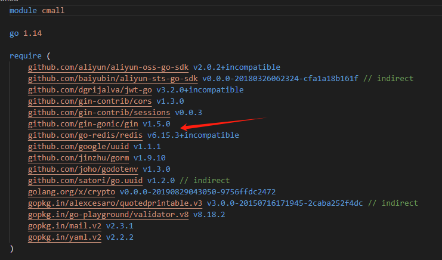

## 1.2 环境搭建

首先修改配置文件.env.example为.env，然后修改数据库信息：

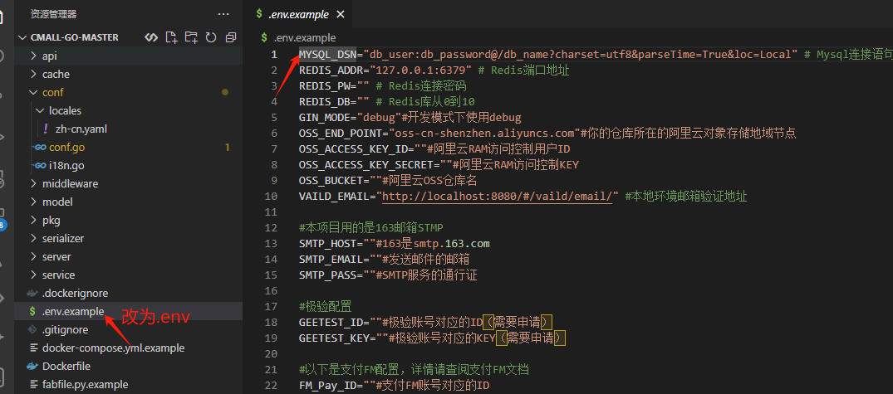

接着在main.go下运行go mod tidy命令，下载对应的依赖信息：

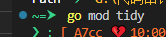

然后就可以运行项目了，用go run main.go即可。

## 1.3 路由分析

首先进入main.go，进入server.NewRouter()方法：

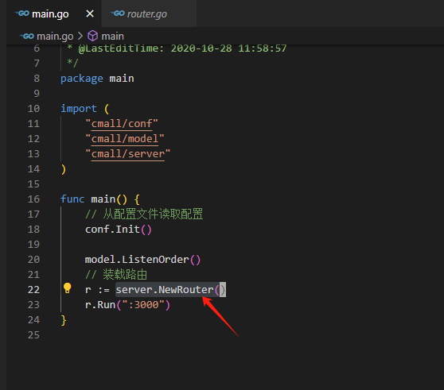

跳转到router.go文件中，到这里我们可以看到路由的基本情况了，如果我们要访问登录，那么就构造/api/v1/user/login路由即可进入登录页面：

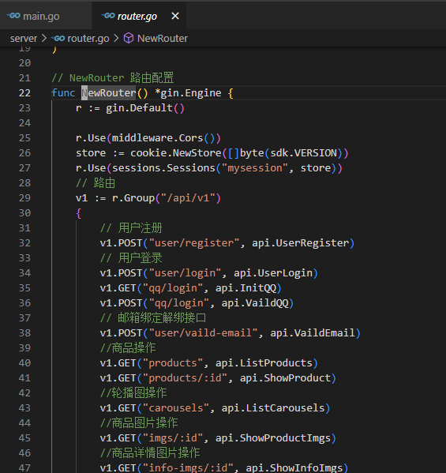

参数的获取，这里以用户登录为例子：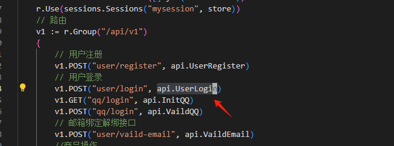进入api.UserLogin方法，前面是通过session获取对应的信息，然后创建一个service.UserLoginService变量，接着使用c.ShouldBind绑定，基本上看到这里，我们就可以通过这个绑定方法确认需要传入的参数，就是service.UserLoginService变量：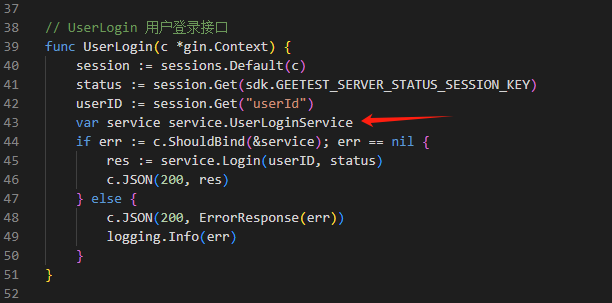查看service.UserLoginService变量有什么参数，共有5个，我们只需要用json设置参数名即可构造：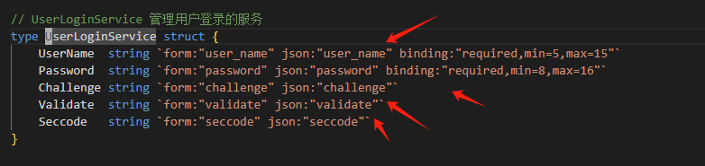最后得到的请求为：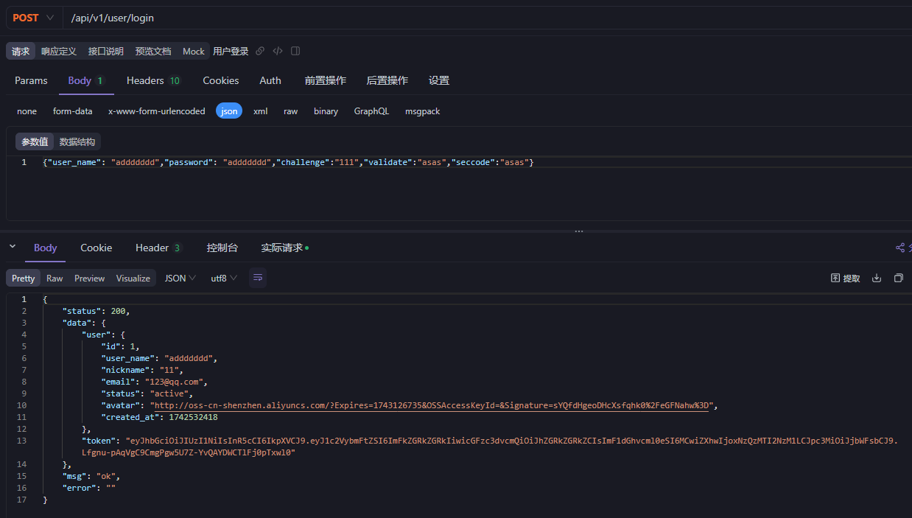

# 贰 代码审计

## 2.1 用户名枚举

进入登录接口：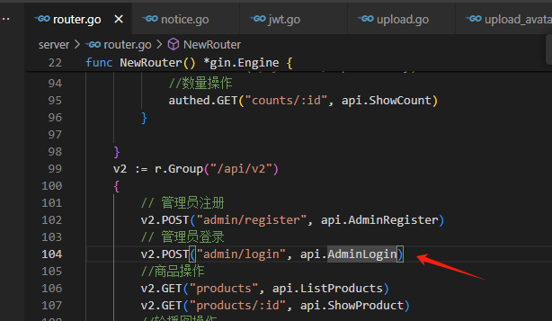跟进Login方法：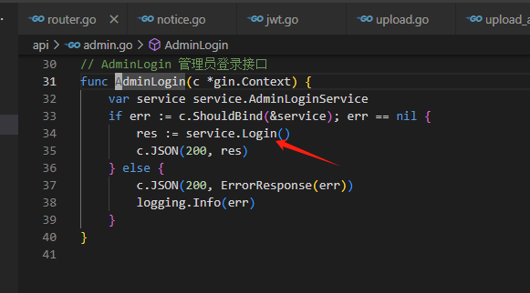查询用户，如果用户不存在，设置code为ERROR\_NOT\_EXIST\_USER，并返回用户不存在（管理员和普通用户登录处均有）：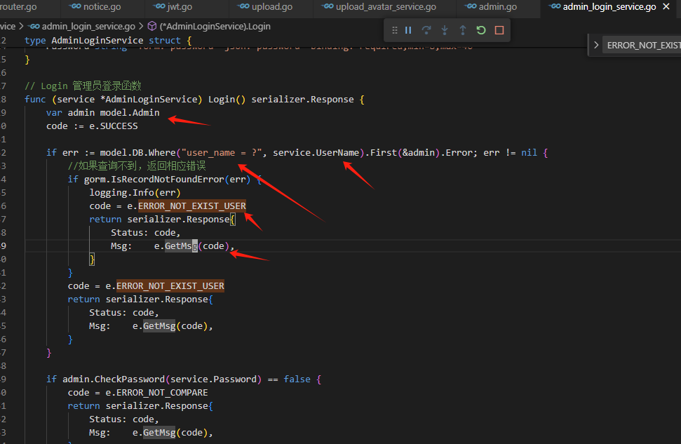

## 2.2 水平越权修改用户信息

在v1接口组下的user接口处，这里需要登录一个账号，进入UserUpdate方法：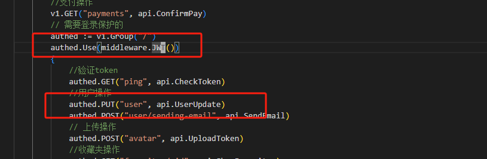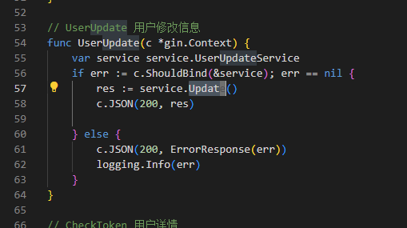

接着进入Update方法，通过ID查找用户信息，然后将前端获取的其他信息进行赋值，即可修改成功，这里没有做任何的当前用户校验，导致水平越权：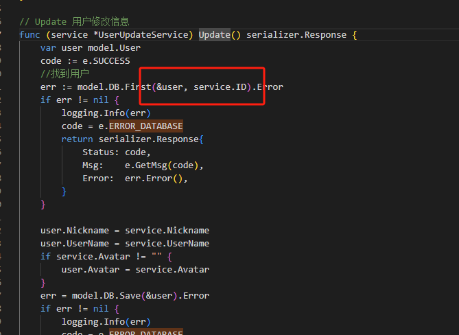

## 2.3 水平越权添加用户购物车

在v1接口组下的user接口处，这里需要登录一个账号，进入carts方法，跟进service.Create()：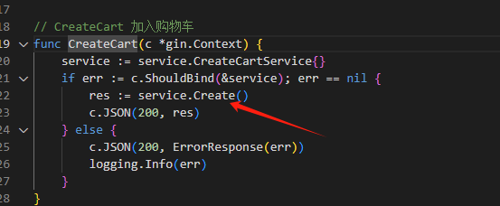

可以发现，只是通过用户id和产品进行绑定，但是没有验证用户是否为当前用户，后面的代码也仅仅只是做一些用户是否有购物记录的判断，所以该系统存在水平越权修改用户购物车：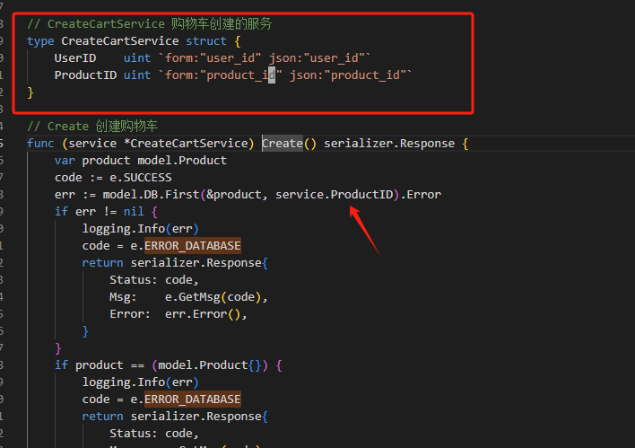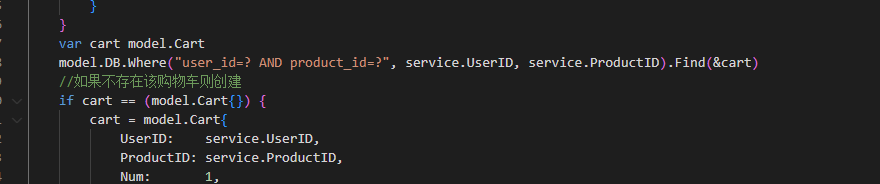

## 2.4 水平越权添加其他用户地址

进入api.CreateAddress方法，调用service.Create方法创建收货地址：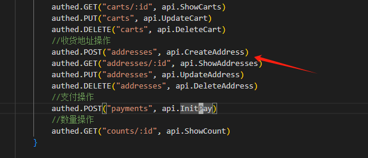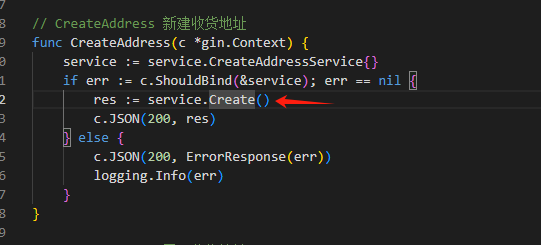

这里我们可以看一下需要传递的参数，用户id、名字、电话号码和地址，这些参数都是可以从客户端获取的：

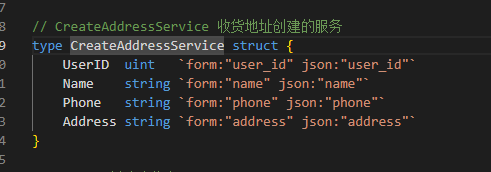

可以发现直接获取客户端信息创建地址信息，并没有对当前用户做任何的鉴权操作：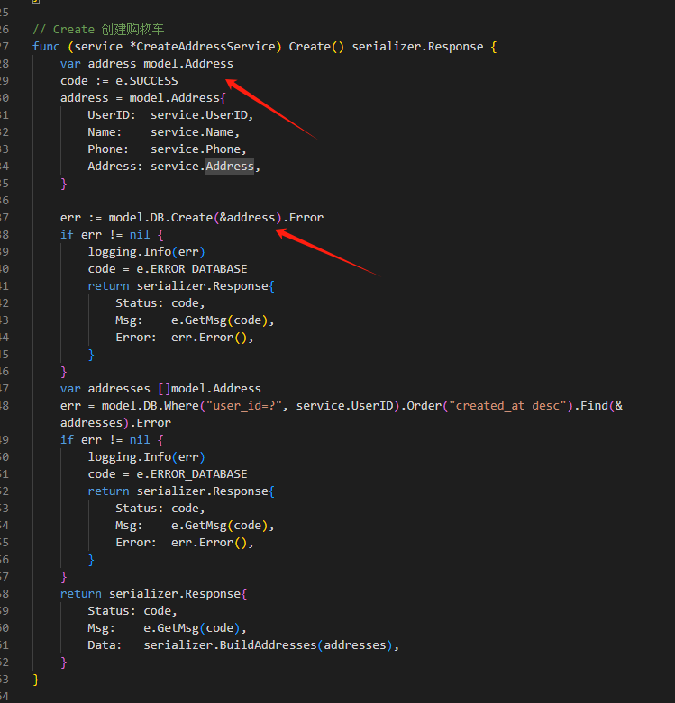

# 叁 复现

## 3.1 用户名枚举image-20250321123143137.pngimage-20250321123201120.png

## 3.2 水平越权修改用户信息

首先查看数据库中用户信息：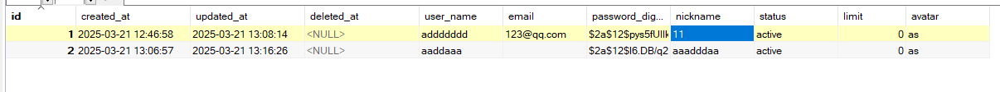登录普通用户：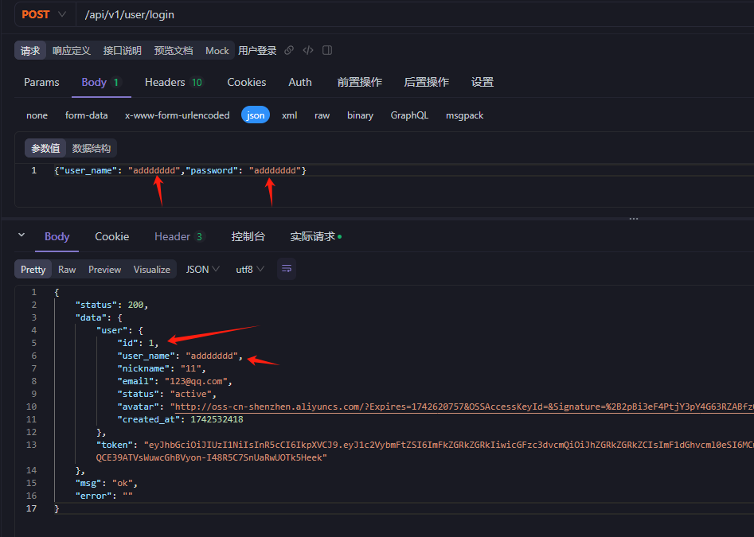获取token，放到接口/api/v1/user中，并设置其他用户id和信息，这里我们设置用户id为2的用户，修改成功：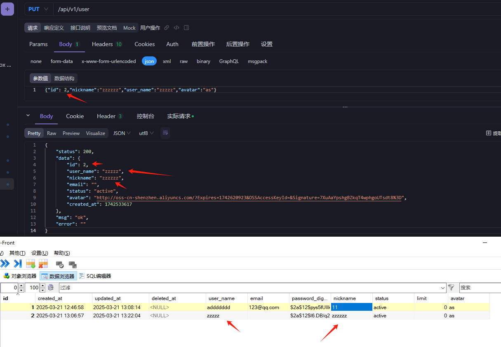

## 3.3 水平越权添加用户购物车

直接登录A用户添加b用户的购物车：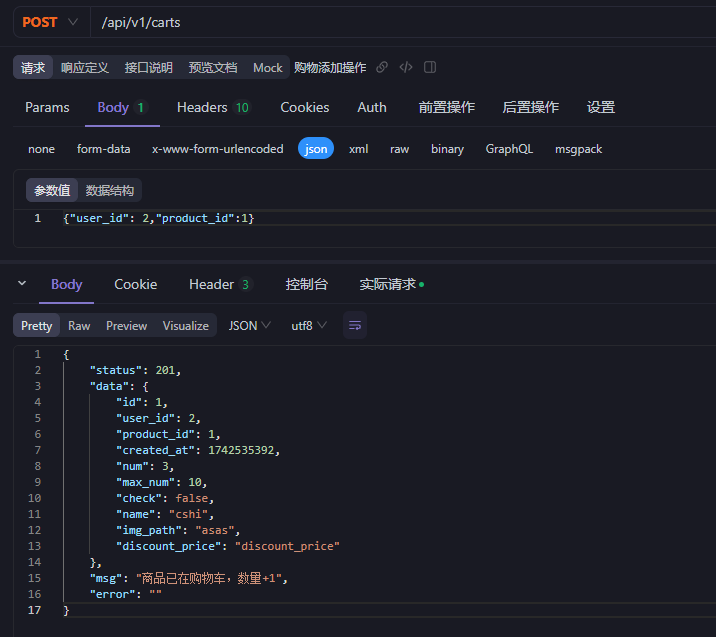

## 3.4 水平越权添加其他用户地址

直接登录A用户添加b用户的地址：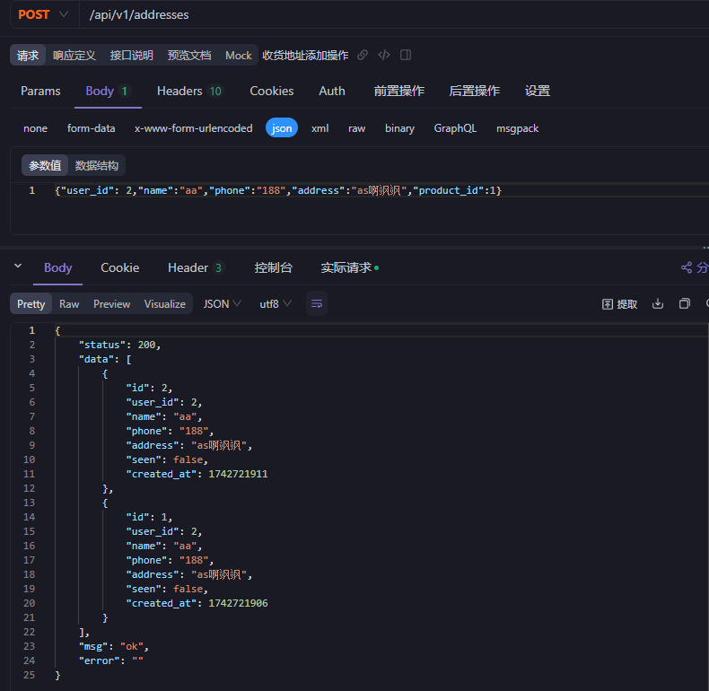

# 肆 收尾

该系统存在大量的水平越权漏洞，还有上传漏洞（这里没有本人没有设置环境变量就没有复现），0元购等。一般情况下，如果用了gorm依赖去做数据库查询的话，基本上很少有SQL注入（当然不排除愣头青），如果对Golang代码审计有兴趣的话，可以查看我的靶场项目：[Vulnerabilities\_Server](https://github.com/A7cc/Vulnerabilities_Server)。因为很少见到有写关于Golang项目的代码审计文章，所以想到是能给这部分空白加一点自己的微薄之力，如果有不错的漏洞可以扣我。

相对与php和java来说，Golang是一个比较安全的语言，在产出漏洞方面，更多出现的漏洞是一些逻辑漏洞，例如越权、权限绕过，当然不排除存在SQL注入、文件上传（一般需要搭配路径才能RCE）、命令执行、SSTI等，对于Golang的代码审计，个人的思路基本上和Java审计差不多，通过go.mod查看组件（目前golang公开的组件漏洞少之又少），然后便是查看路由，golang的路由一般会比较集中，可以在router.go、main.go下查找，而且接口的显示也很明了。

对于一些开源项目的查找，通过以下语法在github上试试：

```
gin language:Go
gin framework language:Go
"gin-gonic/gin" language:Go
"require github.com/gin-gonic/gin" language:Go
in:name gin language:Go
in:readme gin language:Go
gin language:Go stars:>100
```

最后我挑选了一些项目（不一定会有漏洞）：

```
https://github.com/george518/PPGo_Job/releases/tag/v2.8.0
https://gitee.com/tikazyq/crawlab
https://github.com/mindoc-org/mindoc/releases/tag/v0.10.1
https://github.com/piupuer/gin-web/releases/tag/v1.2.3
https://github.com/congz666/cmall-go
https://github.com/snowlyg/iris-admin/releases/tag/v1.2.12
https://github.com/xiaogao67/gin-cloud-storage
https://github.com/pbrong/hrms/releases/tag/1.0.1
https://github.com/mao888/bluebell-plus/releases/tag/v.2.3.0
```
