# 记一次样本分析-先知社区

> **来源**: https://xz.aliyun.com/news/17487  
> **文章ID**: 17487

---

卡饭上的一个样本

<https://bbs.kafan.cn/thread-2280244-1-1.html>

1.有签名

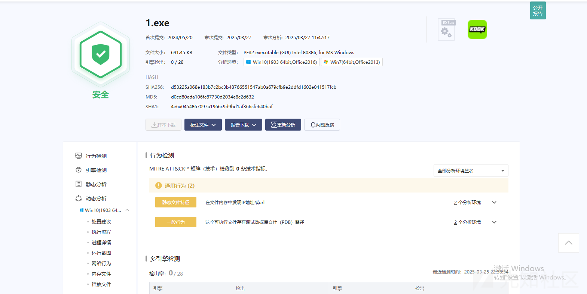

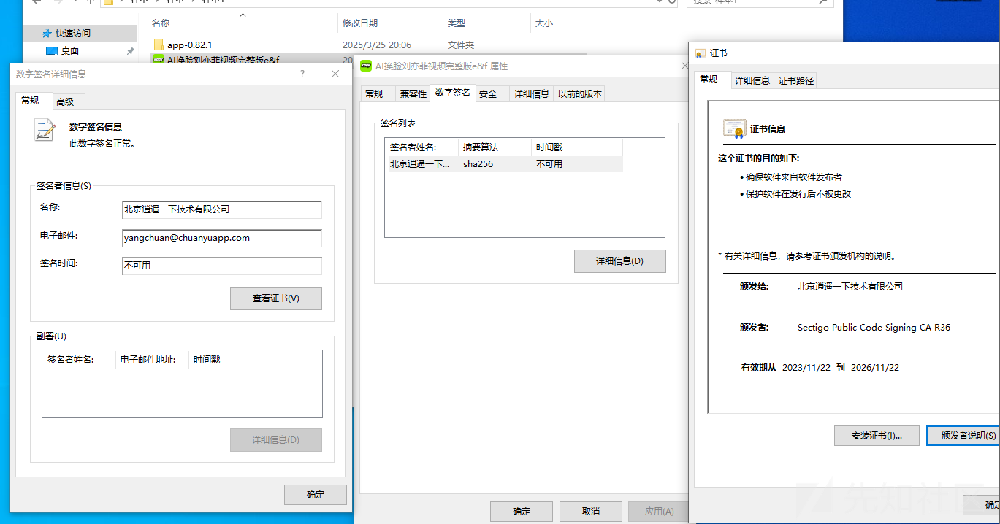

1. ida反编译 前面一堆字符串操作 不看 我们直接关注进程创建这里

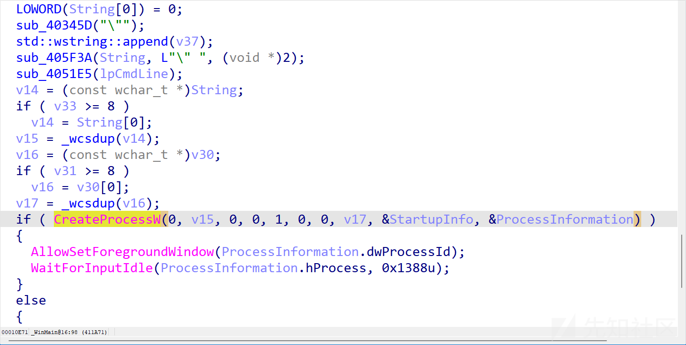

2. x32dbg下断 可以看出来是拼接了字符串 最终字符串为app子目录下同名exe

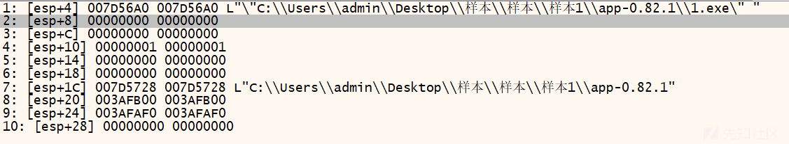

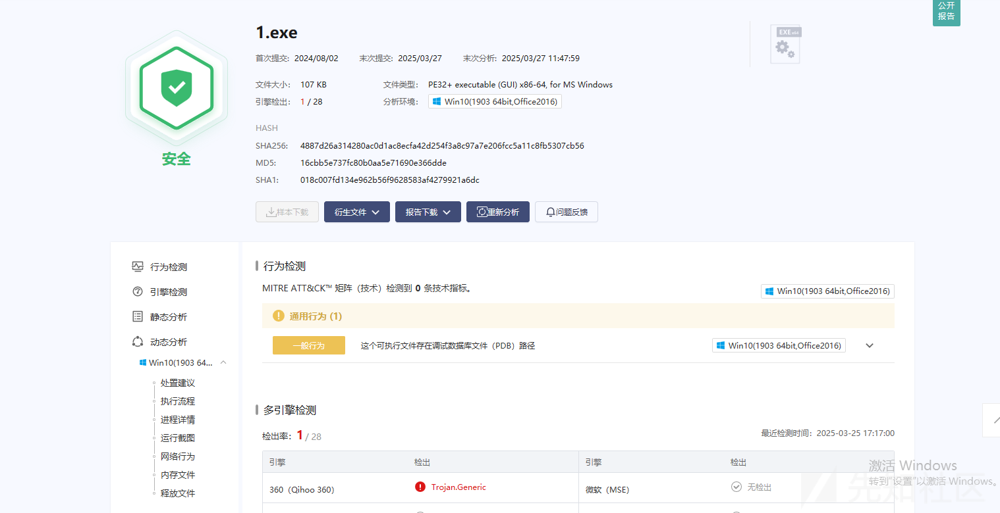

3. 静态分析pe文件 通过维吉尼亚算法进行解密

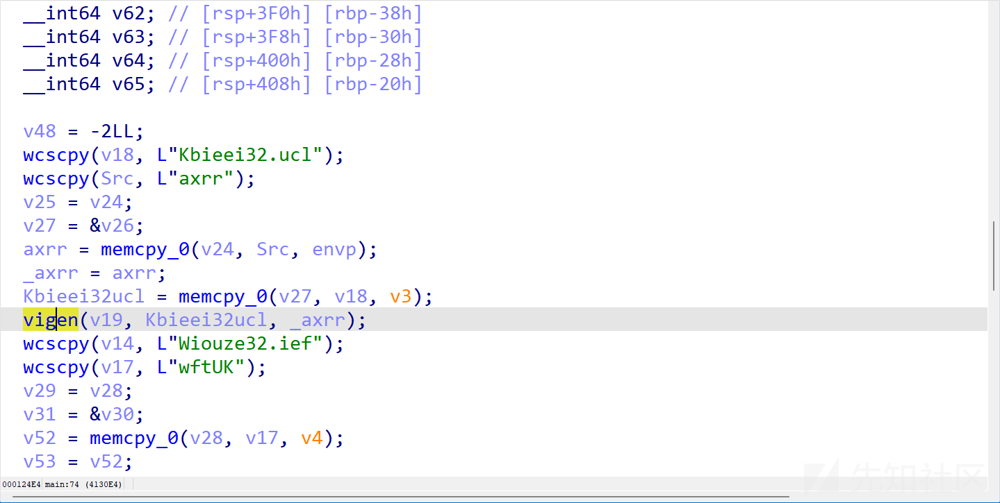

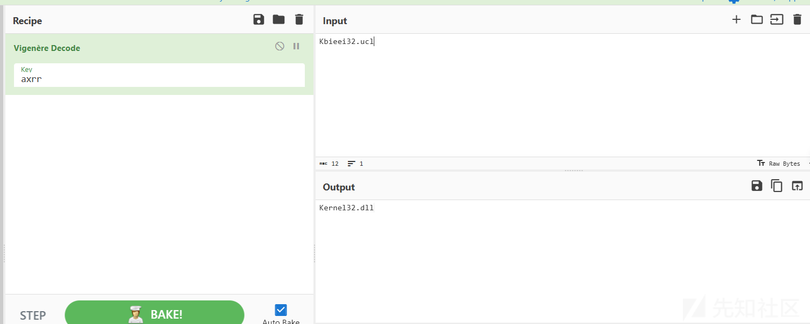

三个模块依次是

Kernel32.dll

Advapi32.dll

winhttp.dll

4. 通过GetCommandLineA 获取命令行参数 截断获取后续需要请求的文件名 如果没获取到的话就结束了

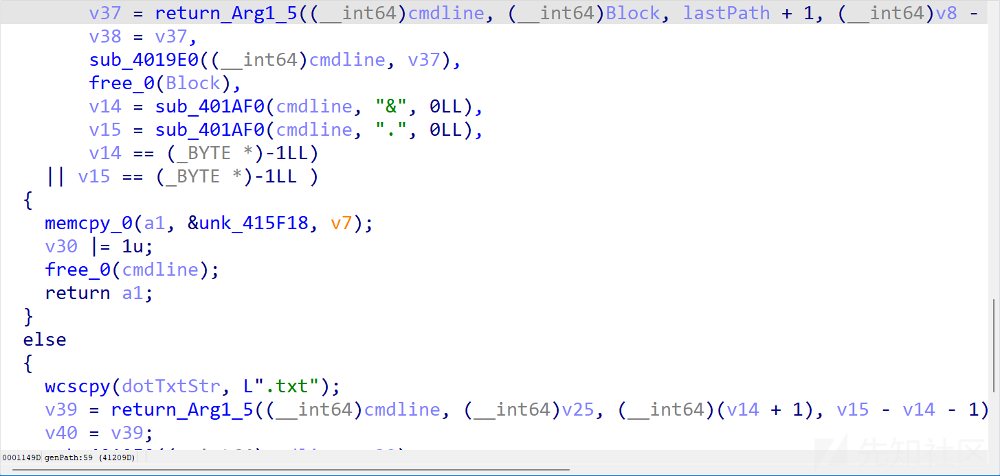

修改成原始名称则可以看见发起了网络连接

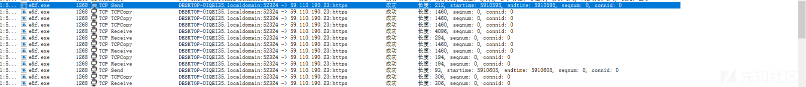

5. sub\_411CB0 通过 WinHttpOpen 初始化 WinHTTP

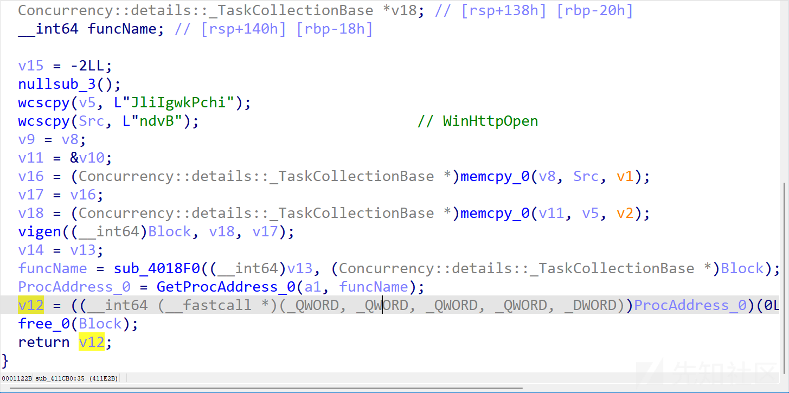

6. sub\_411A90 连接 240728ssfdsfdsfdsdffwmm.oss-cn-beijing.aliyuncs.com 443端口

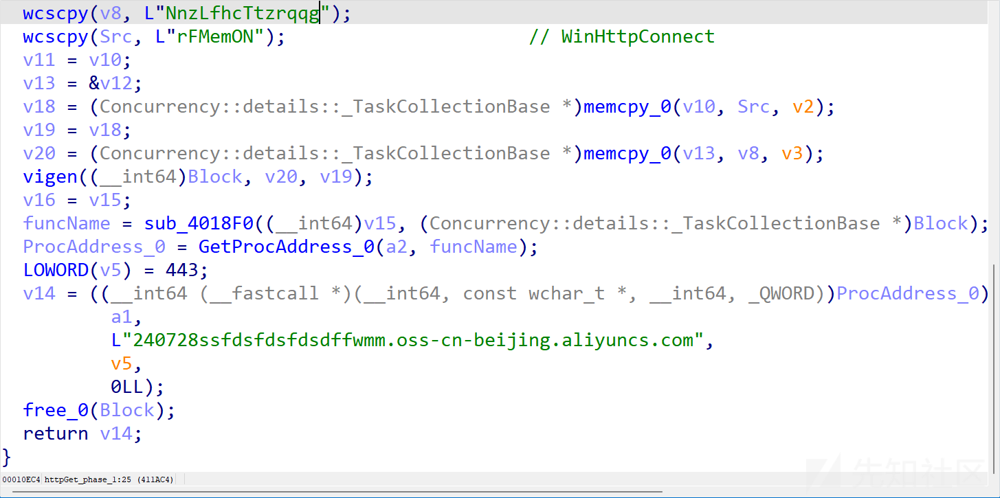

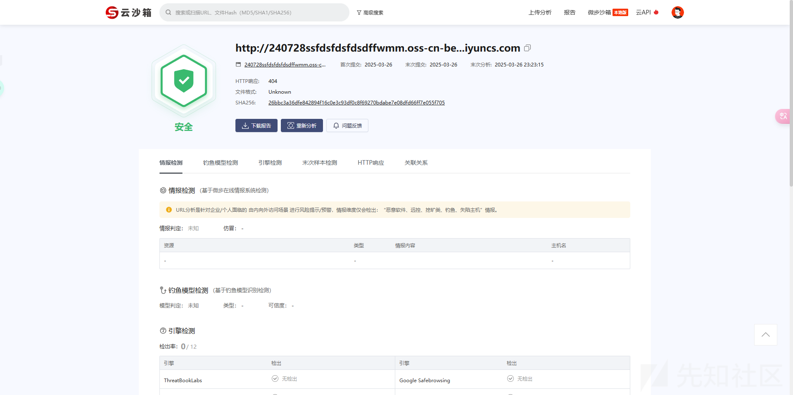

7. 调用WinHttpSendRequest 发送http请求

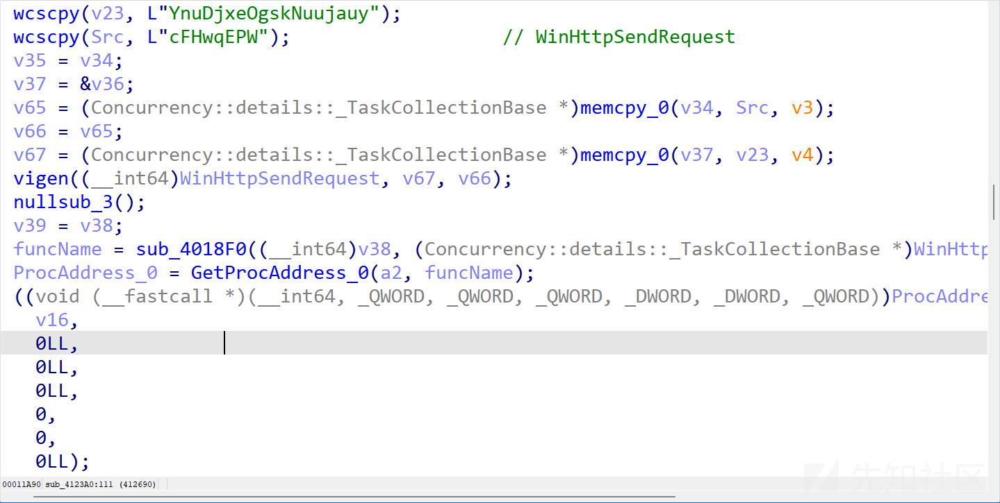

这里的txt为&与.中的字符 对应AI换脸刘亦菲视频供大家撸视频完整版e&f.exe 即f.txt

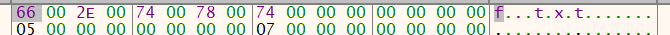

无了

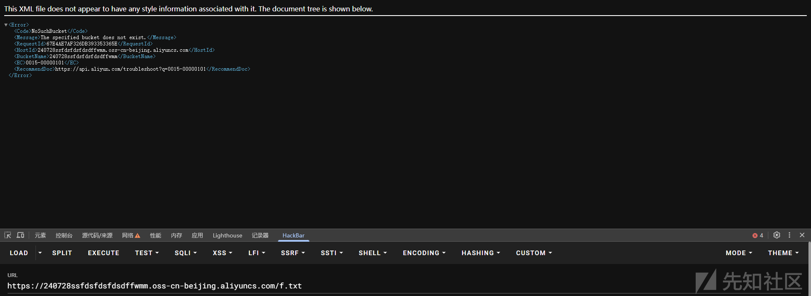

8. 读数据到outbuffer

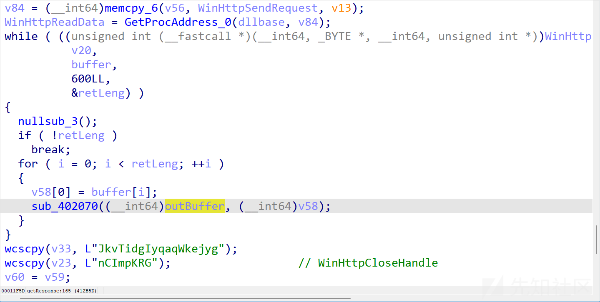

9. 往注册表HKCU\SOFTWARE\的lpdata项写outbuffer的地址和长度

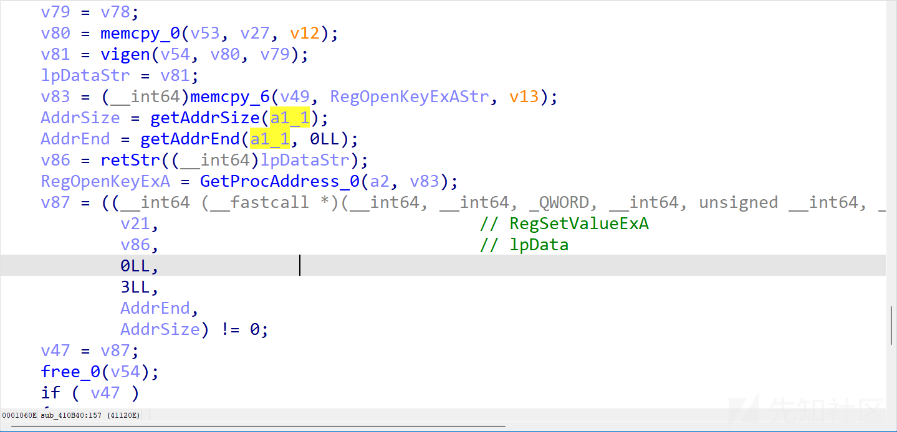

10. 修改权限为RWX
11. 指针执行

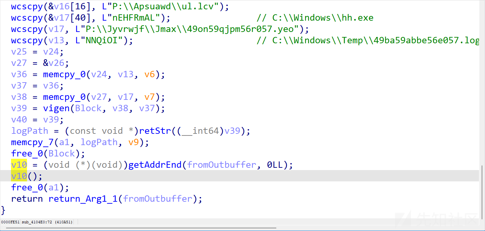

由于txt下载不到了后续分析不了

# IOC

240728ssfdsfdsfdsdffwmm.oss-cn-beijing.aliyuncs.com
