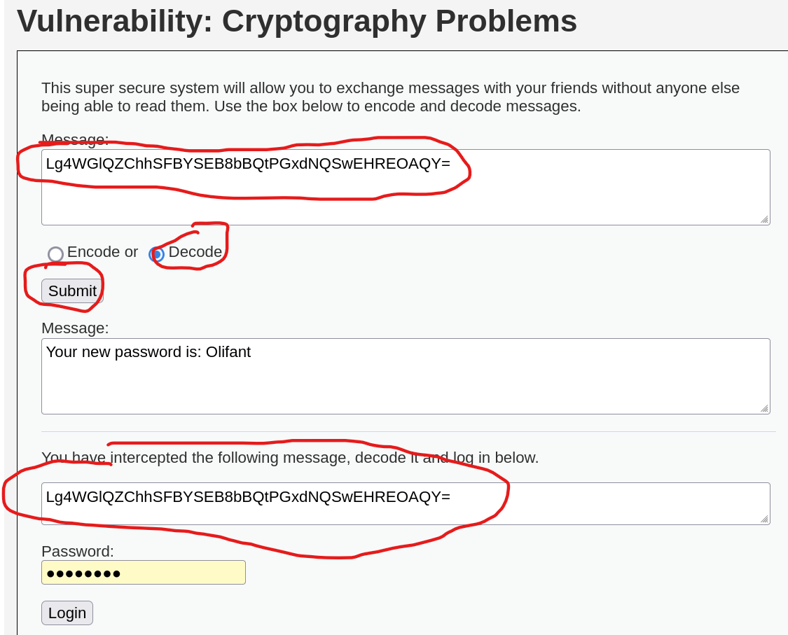
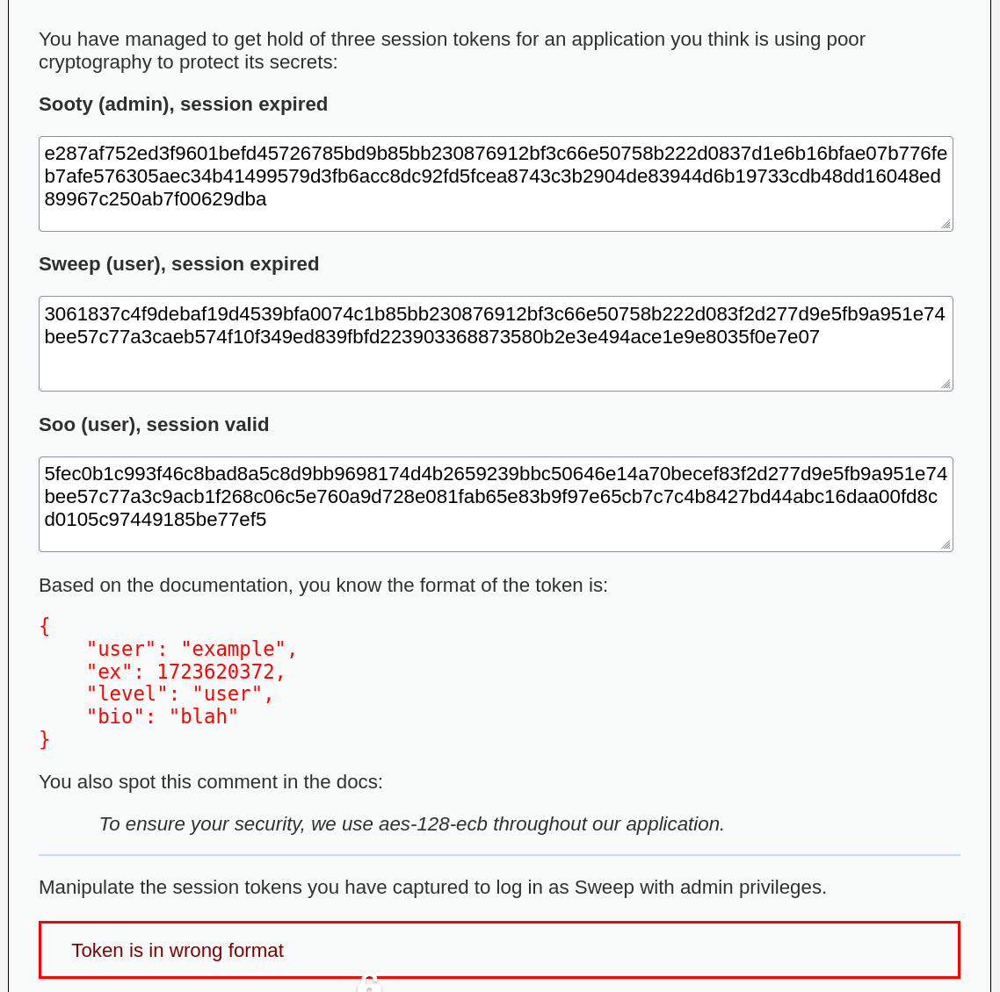
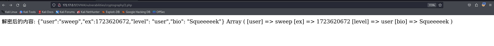
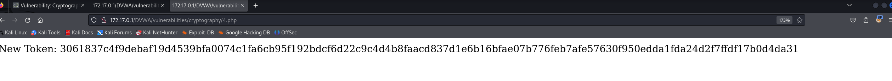
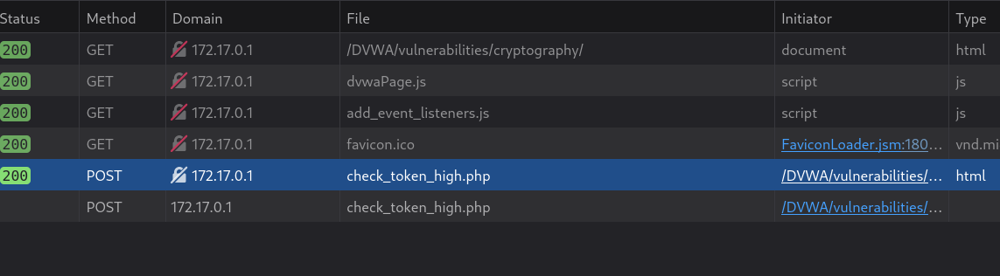
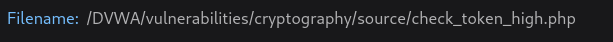
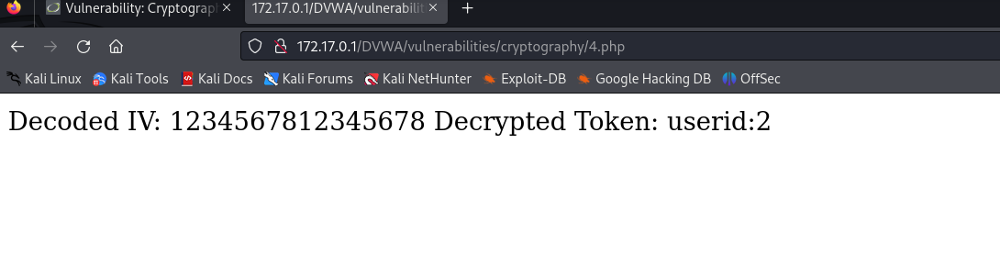
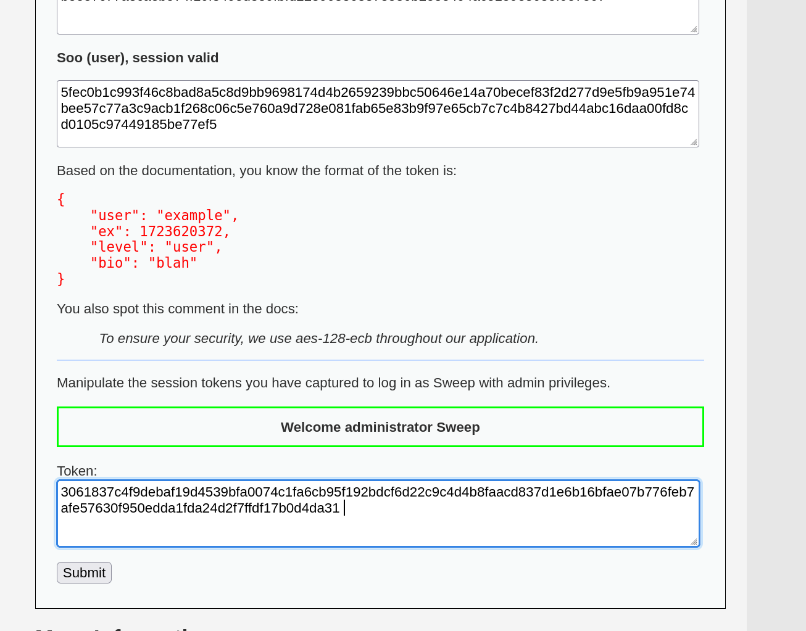

# DVWA Vulnerability: Cryptography Problems-先知社区

> **来源**: https://xz.aliyun.com/news/17493  
> **文章ID**: 17493

---

DVWA (Damn Vulnerable Web Application) 的 Cryptography 模块主要演示了与加密算法相关的安全漏洞，特别是在实现加密功能时常见的错误。

# Low：

核心加密函数

```
function xor_this($cleartext, $key) {
    $outText = '';
    for($i=0; $i<strlen($cleartext);) {
        for($j=0; ($j<strlen($key) && $i<strlen($cleartext)); $j++,$i++) {
            $outText .= $cleartext[$i] ^ $key[$j];
        }
    }
    return $outText;
}
```


* 该函数使用**循环遍历**明文 cleartext，并与 key 进行 **XOR（^）** 异或运算。

* 如果 key 的长度小于 cleartext，则 key 会循环使用。

* 最终输出的是**二进制数据**，并在后续可能经过 **Base64 编码**。

```
$encoded = base64_encode(xor_this ($message, $key));
```

**加密**：

1. **XOR 加密**：message 与 key 进行 XOR 处理，生成二进制数据。

2. **Base64 编码**：为了可读性，将二进制数据转换为 Base64 形式。

拦截的密文

```
<textarea readonly='readonly' id='encoded' name='encoded'>
Lg4WGlQZChhSFBYSEB8bBQtPGxdNQSwEHREOAQY=
</textarea>
```

我们需要解码这段 Base64 字符串，并使用 xor\_this() 与密钥 "wachtwoord" 进行解密。

本关主要考察**异或加密**（XOR encryption）的安全性问题，并结合 **Base64** 进行数据处理。我们需要解密一个拦截的消息，并使用它登录系统。

解密一下就行了

解密代码是这一行

```
$encoded = xor_this(base64_decode($message), $key);
```




# Medium：

```
<?php
function decrypt ($ciphertext, $key) {
    $e = openssl_decrypt($ciphertext, 'aes-128-ecb', $key, OPENSSL_PKCS1_PADDING);
    if ($e === false) {
        throw new Exception ("Decryption failed");
    }
    return $e;
}

$key = "ik ben een aardbei";

$errors = "";
$success = "";
$messages = "";

if ($_SERVER['REQUEST_METHOD'] == "POST") {
    try {
        if (!array_key_exists ('token', $_POST)) {
            throw new Exception ("No token passed");
        } else {
            $token = $_POST['token'];
            if (strlen($token) % 32 != 0) {
                throw new Exception ("Token is in wrong format");
            } else {
                $decrypted = decrypt(hex2bin ($token), $key);

                $user = json_decode ($decrypted);
                if ($user === null) {
                    throw new Exception ("Could not decode JSON object.");
                }

                if ($user->user == "sweep" && $user->ex > time() && $user->level == "admin") {
                    $success = "Welcome administrator Sweep";
                } else {
                    $messages = "Login successful but not as the right user.";
                }
            }
        }
    } catch(Exception $e) {
        $errors = $e->getMessage();
    }
}

$html = "
        <p>
        You have managed to get hold of three session tokens for an application you think is using poor cryptography to protect its secrets:
        </p>
        <p>
        <strong>Sooty (admin), session expired</strong>
        </p>
        <p>
<textarea style='width: 600px; height: 56px'>e287af752ed3f9601befd45726785bd9b85bb230876912bf3c66e50758b222d0837d1e6b16bfae07b776feb7afe576305aec34b41499579d3fb6acc8dc92fd5fcea8743c3b2904de83944d6b19733cdb48dd16048ed89967c250ab7f00629dba</textarea>
        </p>
        <p>
        <strong>Sweep (user), session expired</strong>
        </p>
        <p>
<textarea style='width: 600px; height: 56px'>3061837c4f9debaf19d4539bfa0074c1b85bb230876912bf3c66e50758b222d083f2d277d9e5fb9a951e74bee57c77a3caeb574f10f349ed839fbfd223903368873580b2e3e494ace1e9e8035f0e7e07</textarea>
        </p>
        <p>
        <strong>Soo (user), session valid</strong>
        </p>
        <p>
<textarea style='width: 600px; height: 56px'>5fec0b1c993f46c8bad8a5c8d9bb9698174d4b2659239bbc50646e14a70becef83f2d277d9e5fb9a951e74bee57c77a3c9acb1f268c06c5e760a9d728e081fab65e83b9f97e65cb7c7c4b8427bd44abc16daa00fd8cd0105c97449185be77ef5</textarea>
        </p>
        <p>
        Based on the documentation, you know the format of the token is:
        </p>
        <pre><code>{
    "user": "example",
    "ex": 1723620372,
    "level": "user",
    "bio": "blah"
}</code></pre>
<p>
You also spot this comment in the docs:
</p>
<blockquote><i>
To ensure your security, we use aes-128-ecb throughout our application.
</i></blockquote>

        <hr>
        <p>
        Manipulate the session tokens you have captured to log in as Sweep with admin privileges.
";

if ($errors != "") {
    echo '<div class="warning">' . $errors . '</div>';
}

if ($messages != "") {
    echo '<div class="nearly">' . $messages . '</div>';
}

if ($success != "") {
    echo '<div class="success">' . $success . '</div>';
}

echo "
        <form name="ecb" method='post' action="" . $_SERVER['PHP_SELF'] . "">
            <p>
                <label for='token'>Token:</lable><br />
<textarea style='width: 600px; height: 56px' id='token' name='token'></textarea>
            </p>
            <p>
                <input type="submit" value="Submit">
            </p>
        </form>
";
?>
```


**decrypt()** 方法使用 **AES-128-ECB** 解密：

```
function decrypt ($ciphertext, $key) {
    $e = openssl_decrypt($ciphertext, 'aes-128-ecb', $key, OPENSSL_PKCS1_PADDING);
    if ($e === false) {
        throw new Exception ("Decryption failed");
    }
    return $e;
}
```

* openssl\_decrypt() 用 **AES-128-ECB** 模式解密传入的 token
* hex2bin($token) 把十六进制的 token 转换成二进制数据
* 解密后的数据是 **JSON 格式**

**通关主要代码：**

```
if ($user->user == "sweep" && $user->ex > time() && $user->level == "admin") {
    $success = "Welcome administrator Sweep";
}
```


  
让以管理员的权限登录Sweep

源码中有解密密钥

$key = "ik ben een aardbei";

解密脚本

```
<?php
// 密文（示例：hex 编码的 token）
$hex_token = "3061837c4f9debaf19d4539bfa0074c1b85bb230876912bf3c66e50758b222d083f2d277d9e5fb9a951e74bee57c77a3caeb574f10f349ed839fbfd223903368873580b2e3e494ace1e9e8035f0e7e07";

// 解密密钥
$key = "ik ben een aardbei";

// 将 HEX 编码的 token 转换为二进制
$encrypted_token = hex2bin($hex_token);

// 解密
$decrypted_json = openssl_decrypt($encrypted_token, 'aes-128-ecb', $key, OPENSSL_PKCS1_PADDING);

// 输出解密后的 JSON 字符串
echo "解密后的内容: 
" . $decrypted_json . "
";

// 解析 JSON
$decoded_object = json_decode($decrypted_json, true);
print_r($decoded_object);
?>
```


解密一下sweep的session



也不用解密已经给你说了格式是什么样的

把user的值改成sweep

把ex时间戳的值改成soo用户有效的值或者直接9999999999

把level的值改成admin就行了

加密脚本

```
<?php
function encrypt($plaintext, $key) {
    return bin2hex(openssl_encrypt($plaintext, 'aes-128-ecb', $key, OPENSSL_RAW_DATA));
}

$key = "ik ben een aardbei"; // 这是密钥
$new_payload = json_encode([
    "user" => "sweep",
    "ex" => 9999999999,
    "level" => "admin",
    "bio" => "hacked"
]);

$encrypted_token = encrypt($new_payload, $key);
echo "New Token: " . $encrypted_token . "
";
?>
```




token：3061837c4f9debaf19d4539bfa0074c1fa6cb95f192bdcf6d22c9c4d4b8faacd837d1e6b16bfae07b776feb7afe57630f950edda1fda24d2f7ffdf17b0d4da31


# **High**

```
<?php

require ("token_library_high.php");

$message = "";

$token_data = create_token();

$html = "
    <script>
        function send_token() {

            const url = 'source/check_token_high.php';
            const data = document.getElementById ('token').value;

            console.log (data);
             
            fetch(url, { 
                    method: 'POST', 
                    headers: { 
                        'Content-Type': 'application/json' 
                    }, 
                    body: data
                }) 
                .then(response => { 
                    if (!response.ok) { 
                        throw new Error('Network response was not ok'); 
                } 
                return response.json(); 
                }) 
                .then(data => { 
                    console.log(data);
                    message_line = document.getElementById ('message');
                    if (data.status == 200) {
                        message_line.innerText = 'Welcome back ' + data.user + ' (' + data.level + ')';
                        message_line.setAttribute('class', 'success');
                    } else {
                        message_line.innerText = 'Error: ' + data.message;
                        message_line.setAttribute('class', 'warning');
                    }
                }) 
                .catch(error => { 
                    console.error('There was a problem with your fetch operation:', error); 
            }); 

        }
    </script>
        <p>
            You have managed to steal the following token from a user of the Prognostication application.
        </p>
        <p>
            <textarea style='width: 600px; height: 23px'>" . htmlentities ($token_data) . "</textarea>
        </p>
        <p>
            You can use the form below to provide the token to access the system. You have two challenges, first, decrypt the token to find out the secret it contains, and then create a new token to access the system as a other users. See if you can make yourself an administrator.
        </p>
        <hr>
        <form name="check_token" action="">
            <div id='message'></div>
            <p>
                <label for='token'>Token:</lable><br />
                <textarea id='token' name='token' style='width: 600px; height: 23px'>" . htmlentities ($token_data) . "</textarea>
            </p>
            <p>
                <input type="button" value="Submit" onclick='send_token();'>
            </p>
        </form>
";

?>
```


跟Medium步骤差不多，就是找key麻烦

submit一下，发现一个php文件





访问没法看到数据，只能去源代码里找了

```
<?php

require_once ("token_library_high.php");

$ret = "";

if ($_SERVER['REQUEST_METHOD'] == "POST") {
	if ($_SERVER['CONTENT_TYPE'] != "application/json") {
		$ret = json_encode (array (
						"status" => 527,
						"message" => "Content type must be application/json"
					));
	} else {
		$token = $jsonData = file_get_contents('php://input');
		$ret = check_token ($token);
	}
} else {
	$ret = json_encode (array (
					"status" => 405,
					"message" => "Method not supported"
				));
}

print $ret;
exit;
```


require\_once ("token\_library\_high.php");

引入了一个名为 token\_library\_high.php 的文件

在token\_library\_high.php找到了（希望各位指导一下有没有什么其它的办法）

```
define ("KEY", "rainbowclimbinghigh");
define ("ALGO", "aes-128-cbc");
define ("IV", "1234567812345678");
```

先解密一下

```
<?php
define("KEY", "rainbowclimbinghigh");
define("ALGO", "aes-128-cbc");

// 加密的 Token 和 IV
$encryptedToken = "PhQwGVA3q+T2mT+L3Pe5Vg==";
$ivBase64 = "MTIzNDU2NzgxMjM0NTY3OA==";

// 解码 IV
$iv = base64_decode($ivBase64);
echo "Decoded IV: " . $iv . "
"; // 输出: 1234567812345678

// 解码 Token
$encryptedToken = base64_decode($encryptedToken);

// 解密 Token
$decryptedToken = openssl_decrypt($encryptedToken, ALGO, KEY, OPENSSL_RAW_DATA, $iv);
if ($decryptedToken === false) {
    echo "Unable to decrypt token. Error: " . openssl_error_string() . "
";
} else {
    echo "Decrypted Token: " . $decryptedToken . "
"; // 输出: userid:2
}
?>
```


把userid改成1试一试

```
<?php
// 定义常量和变量
define("KEY", "rainbowclimbinghigh"); // 密钥
define("ALGO", "aes-128-cbc"); // 加密算法

// 加密的 Token 和 IV
$encryptedToken = "PhQwGVA3q+T2mT+L3Pe5Vg==";
$ivBase64 = "MTIzNDU2NzgxMjM0NTY3OA==";

// 解码 IV
$iv = base64_decode($ivBase64);
echo "Decoded IV: " . $iv . "
"; // 输出: 1234567812345678

// 解密函数
function decryptToken($encryptedToken, $iv) {
    $encryptedToken = base64_decode($encryptedToken);
    return openssl_decrypt($encryptedToken, ALGO, KEY, OPENSSL_RAW_DATA, $iv);
}

// 解密 Token
$decryptedToken = decryptToken($encryptedToken, $iv);
if ($decryptedToken === false) {
    echo "Unable to decrypt token. Error: " . openssl_error_string() . "
";
} else {
    echo "Decrypted Token: " . $decryptedToken . "
"; // 输出: userid:2
}

// 加密函数
function encryptToken($data, $iv) {
    $encrypted = openssl_encrypt($data, ALGO, KEY, OPENSSL_RAW_DATA, $iv);
    return base64_encode($encrypted);
}

// 修改后的数据
$newData = "userid:1"; // 修改为管理员 ID

// 重新加密
$newEncryptedToken = encryptToken($newData, $iv);
echo "New Encrypted Token: " . $newEncryptedToken . "
";

// 构造新的令牌
$result = [
    "token" => $newEncryptedToken,
    "iv" => $ivBase64
];
echo json_encode($result, JSON_PRETTY_PRINT);
?>
```


token：{"token":"uN4N+V73wdXa+qowB7cc3A==","iv": "MTIzNDU2NzgxMjM0NTY3OA=="}

运行一下就行了



**希望各位有什么好的方法能分享一下**

# **Impossible**

```
<?php

require ("token_library_impossible.php");

$message = "";

$token_data = create_token();

$html = "
    <script>
        function send_token() {

            const url = 'source/check_token_impossible.php';
            const data = document.getElementById ('token').value;

            console.log (data);
             
            fetch(url, { 
                    method: 'POST', 
                    headers: { 
                        'Content-Type': 'application/json' 
                    }, 
                    body: data
                }) 
                .then(response => { 
                    if (!response.ok) { 
                        throw new Error('Network response was not ok'); 
                } 
                return response.json(); 
                }) 
                .then(data => { 
                    console.log(data);
                    message_line = document.getElementById ('message');
                    if (data.status == 200) {
                        message_line.innerText = 'Welcome back ' + data.user + ' (' + data.level + ')';
                        message_line.setAttribute('class', 'success');
                    } else {
                        message_line.innerText = 'Error: ' + data.message;
                        message_line.setAttribute('class', 'warning');
                    }
                }) 
                .catch(error => { 
                    console.error('There was a problem with your fetch operation:', error); 
            }); 

        }
    </script>
        <p>
            You have managed to steal the following token from a user of the Impervious application.
        </p>
        <p>
            <textarea style='width: 600px; height: 23px'>" . htmlentities ($token_data) . "</textarea>
        </p>
        <p>
            This being the impossible level, you should not be able to mess with the token in any useful way but feel free to try below.
        </p>
        <hr>
        <form name="check_token" action="">
            <div id='message'></div>
            <p>
                <label for='token'>Token:</lable><br />
                <textarea id='token' name='token' style='width: 600px; height: 23px'>" . htmlentities ($token_data) . "</textarea>
            </p>
            <p>
                <input type="button" value="Submit" onclick='send_token();'>
            </p>
        </form>
";

?>
```


Impossible就没什么可说的的了

​
