# Qt免杀样本分析-先知社区

> **来源**: https://xz.aliyun.com/news/17498  
> **文章ID**: 17498

---

## 初步研判

SHA256：9090807bfc569bc8dd42941841e296745e8eb18b208942b3c826b42b97ea67ff

我们可以看到引擎0检出，是个免杀样本，不过通过微步云沙箱的行为分析，已经被判为恶意

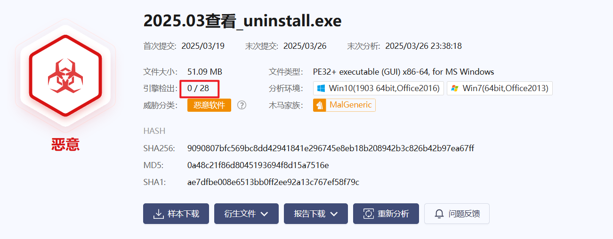

## 行为分析

### 进程行为

可以看到demo显示调用了winver获取了主机的基本信息，然后调起taskmgr，以其身份再次调用自己，可能是一个提权行为

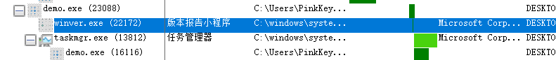

### 文件行为

没有文件被写入，但是原文件运行完就没了

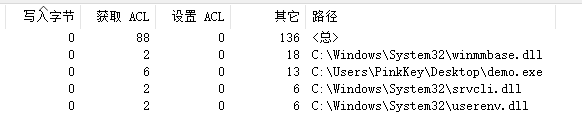

### 注册表行为

发现多了一个正常的文件的计划任务，启动权限还是SYSTEM，启动时间每两小时一次

文件还带dll，一看就是白加黑

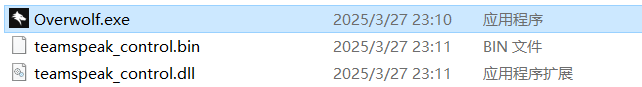

### 网络行为

未检出

## 详细分析

### 主程序逻辑

主文件是一个pe文件

直接对这个qt样本进行动态调试十分困难，不仅仅是因为采用了Qt框架，还有就是采用PoolParty timer模块，利用内置计时器线程池任务执行shellcode，所以想要一步一步走到shellcode是非常困难的，后续我们使用api断点的方式进行分析

[poolparty项目地址](https://github.com/SafeBreach-Labs/PoolParty)

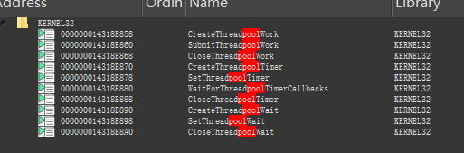

我们在virtualalloc下断就可以发现程序在内存中载入了一个pe文件

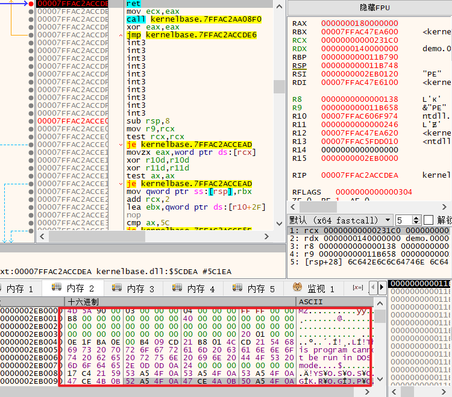

这个时候查看调用堆栈就会发现被破坏了，不知道主文件的逻辑哪里调用的shellcode，但是我么可以发现shellcode段的调用还是能看到的，这个时候我们就需要回溯一下了，第一次进入shellcode是什么时候，大概率也是第一个使用virtuallalloc的位置

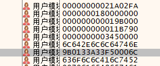

我们回溯一下，可以发现，第一次载入了一段shellcode，我们把它单独拿出来

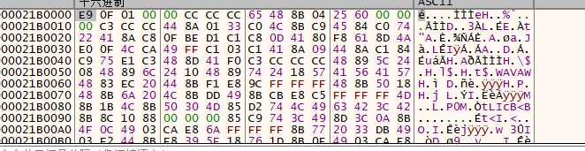

直接运行shellcode会连接如下ip，不过根据X情报社区的情报，不像是恶意的c2，暂时保留

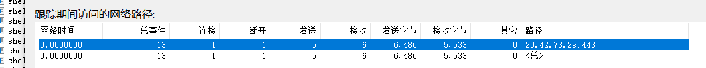

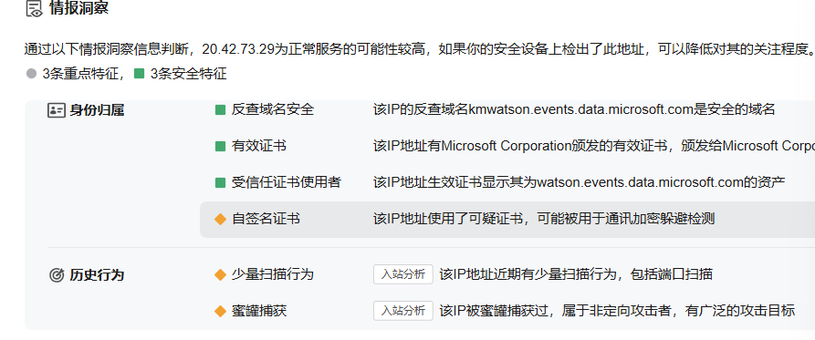

apihash的味道扑面而来

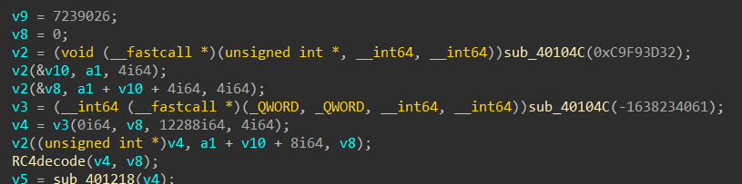

我们在主程序动调查看堆栈可以看到调用堆栈

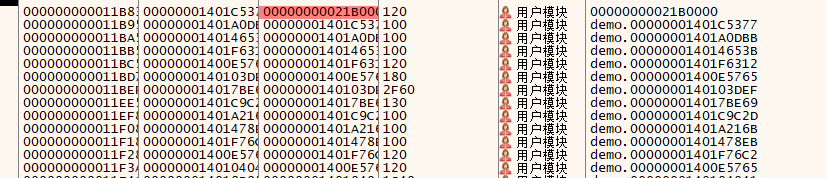

shellcode逻辑如图所示

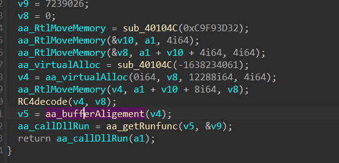

第一段shellcode中创建内存对一段数据的魔改RC4解密，key为数字12345

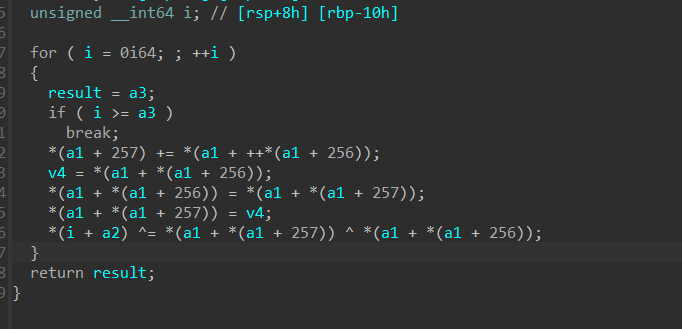

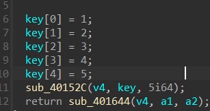

这里出来的就是上方的dll了

后续shellcode中进行内存对齐并跳转入口段做初始化

然后进入第二个函数

后续找到run函数

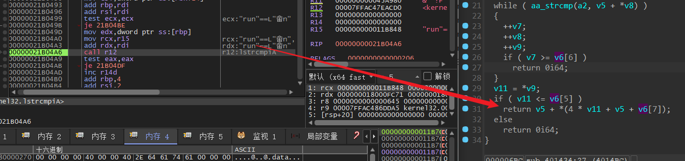最后调用执行dll中的run函数

​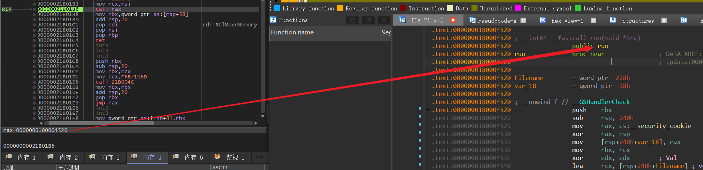

### dll逻辑

逻辑如图所示，获取了主程序的名称，如果不是winlogon就进进入if内，winlogon是用于登录相关的操作的，如果文件名包含winlogon.exe就进入sub\_18003c10，这里猜测内部应该是用于常规的权限维持，如果不包含就相当于是初始化，如果是管理员权限就进入sub\_180004240不是就进入sub\_180001000。

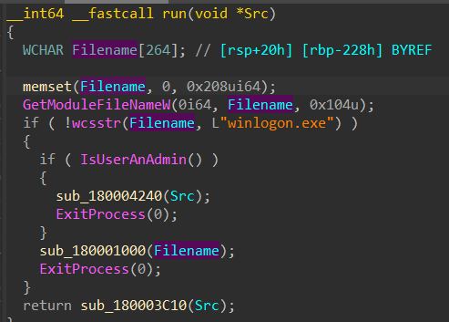

#### 非管理员下运行

因为sub\_180001000比较短，所以直接跳转看看这个

首先是拼接出了如下路径

C:\windows\system32\winver.exe

然后凑出了类似UUID的值，貌似是利用RPC通信去做提权操作

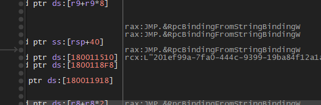

用RPCview可以看到是这样一个进程

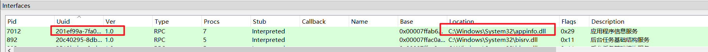

后续又调用taskmgr.exe

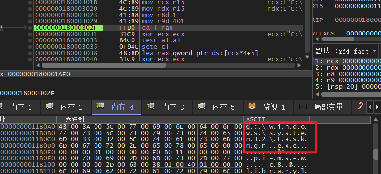利用taskmgr.exe身份使用CreateProcessAsUserW创建创建子线程，猜测是用于提权的  
 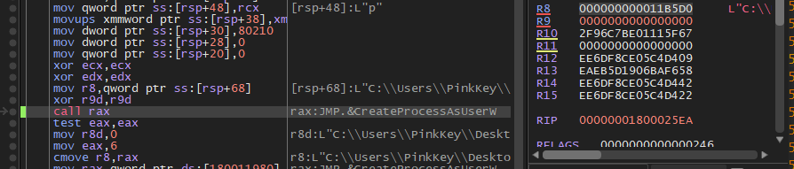这样就会有一个是管理员权限的程序，这时候我们回到dll调用位置，以admin身份进入

#### 管理员下运行

首先是赋值了两端code，一段是当前这段shellcode，另一段是RC4未解密的dll数据

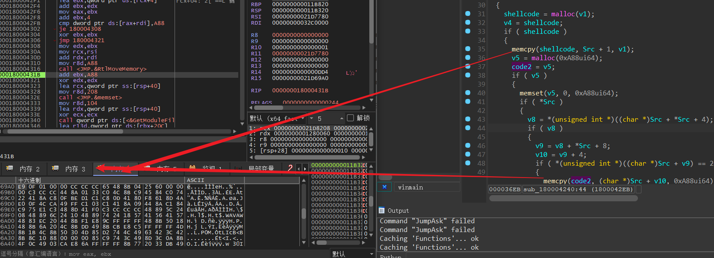

紧接着有复制了一段数据，看着有点像之前RC4解密前的dll

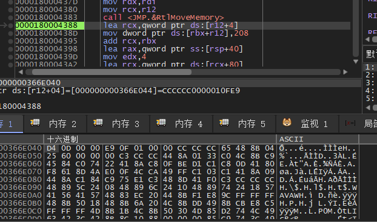

然后遍历进程查看是否有winlogon.exe，去获取他的进程号

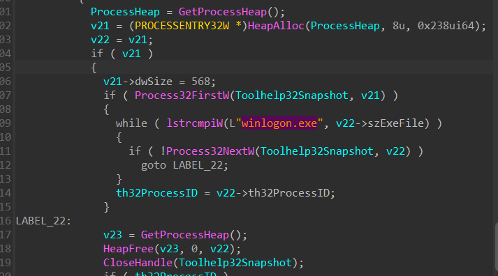

然后把shellcode写入进程

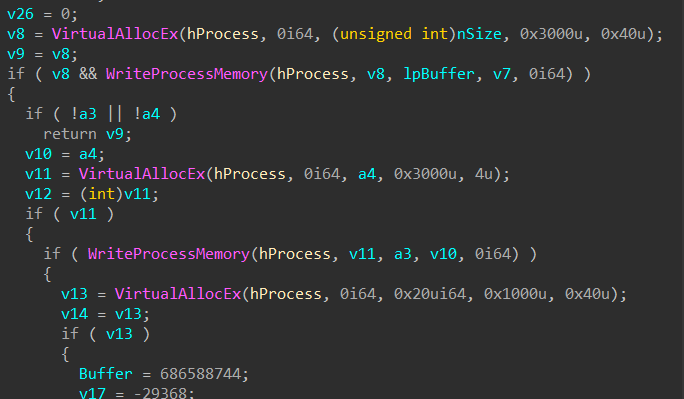

利用ALPC完成权限维持

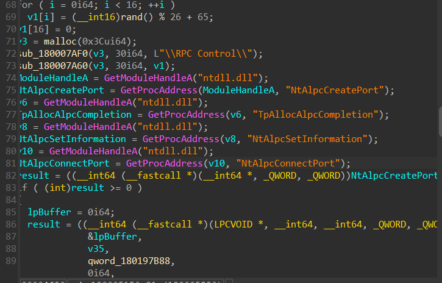

这个时候我们就能判断出该进程把shellcode和加密的dll全部写入了winlogon.exe中，然后让shellcode在winlogon中执行，实现行为隐藏。

这个时候我们再回到最初的位置

#### winlogon.exe内运行

进入后又是一段魔改RC4的解密，解密出的内容居然是一个IP？

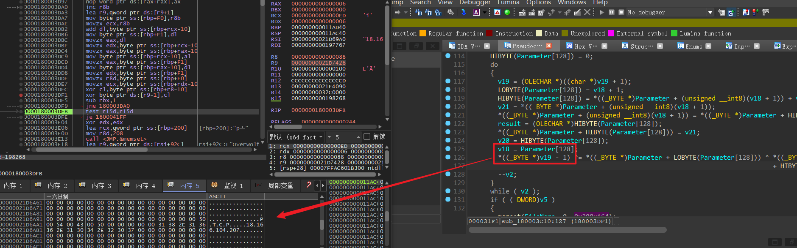非常可疑，这个ip曾经被用于银狐

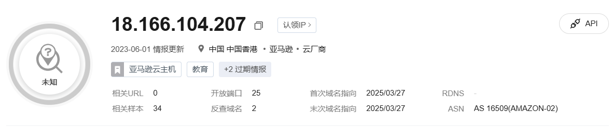之后打算创建如下exe并写入数据

C:\Program Files\Common Files\System\Overwolf.exe  
 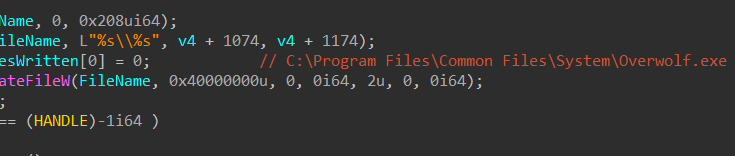

貌似是个白文件，可能是白加黑把，我们继续往下看看

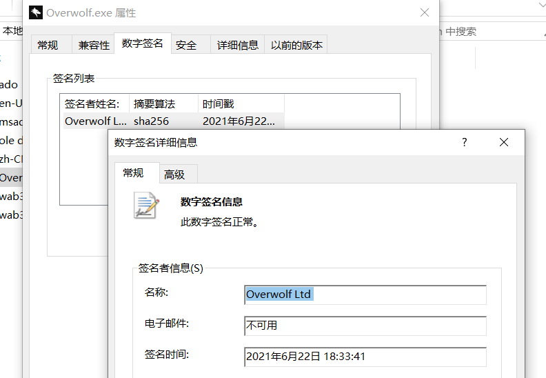

然后在同目录下创建"teamspeak\_control.dll"和teamspeak\_control.bin文件

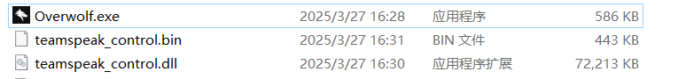

然后起了一个线程执行shellcode

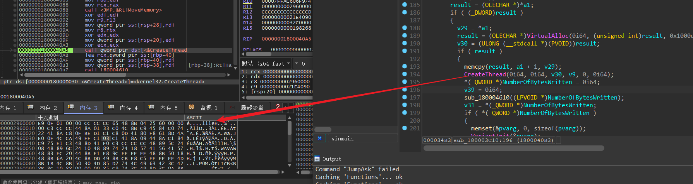

我们dump出来单独看看，发现就和上面一样的shellcode，执行dll中的run函数，这个放放

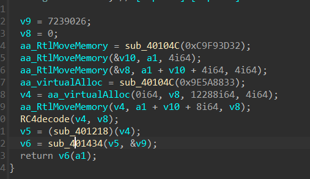

流程之后解密获取了计划任务的COM组件CLSID和riid并初始化

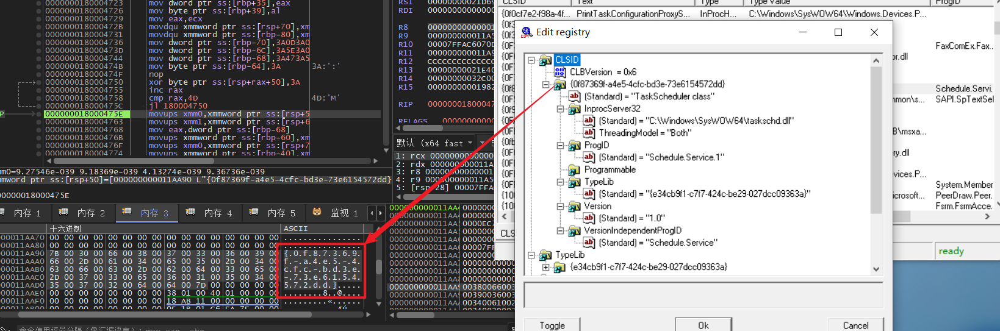

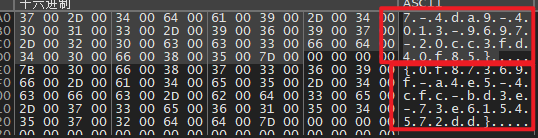

然后就是利用COM执行命令了

连接并获取\Microsoft\Windows目录

?Connect@?QITaskService@@TaskServiceImpl@@UEAAJUtagVARIANT@@000@Z

?GetFolder@?QITaskService@@TaskServiceImpl@@UEAAJPEAGPEAPEAUITaskFolder@@@Z

...

结果就是给白加黑创建了计划任务

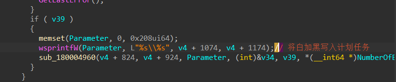

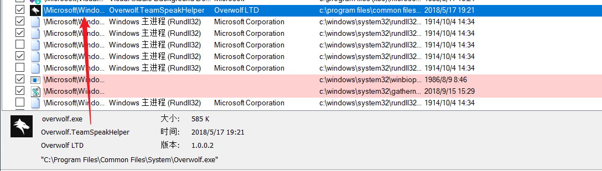

最后删除自己

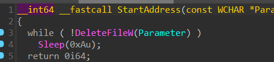

至此，关于Qt部分的逻辑就结束了

### 白加黑分析

经过简单diff，发现他把dll中所有的导出函数内容都设置为了同一个，所以只要随便调用一个就会触发黑行为。。

但是直接在函数下断点无法定位到，我们发现在运行代码后文件被删除了，所以我们可以对文件删除也就是DeleteFileW进行下断，然后回溯找源头

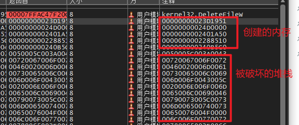

好像有点似曾相识，和我们之前调用dll一样

我们像之前一样在virtualAlloc位置下断，发现堆栈上的并非是导出函数，而是dllentry中创建的线程，不过这都不重要

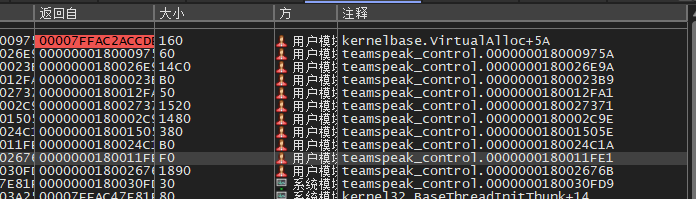

把同目录下的同名bin文件读取进来了

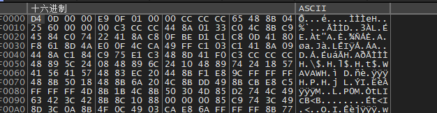

然后又是解密shellcode并执行dll中的逻辑了，这里就不过多赘述了

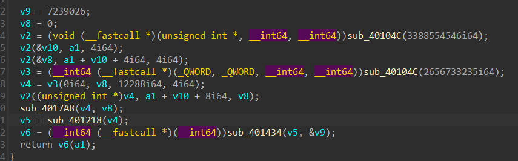

至此，逻辑基本成型

## 逻辑概述

主程序（Qt）利用poolparty timer创建并调用shellcode，shellcode调用dll run函数，run函数给dll提权重新加载，提权后把shellcode注入winlogon.exe，在winlogon.exe中生成白加黑文件并为其创建计划任务（每两小时执行一次），白加黑文件重复前面所有，不过在run时就不需要提权了，因为计划任务是以SYSTEM身份运行的

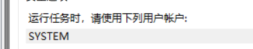

## C2

18.166.104.207

在x情报社区中查询c2可以找到很多同源的样本，而且非常新鲜

木马的类型也被检出，能够帮助我们在初步研判时建立起一个基本框架

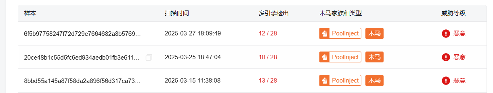
