# 银狐木马伪装投毒分析-先知社区

> **来源**: https://xz.aliyun.com/news/17499  
> **文章ID**: 17499

---

# 文件本体

样本本体为一个msi安装包，近年来通过msi进行攻击的样本数量相对较多。

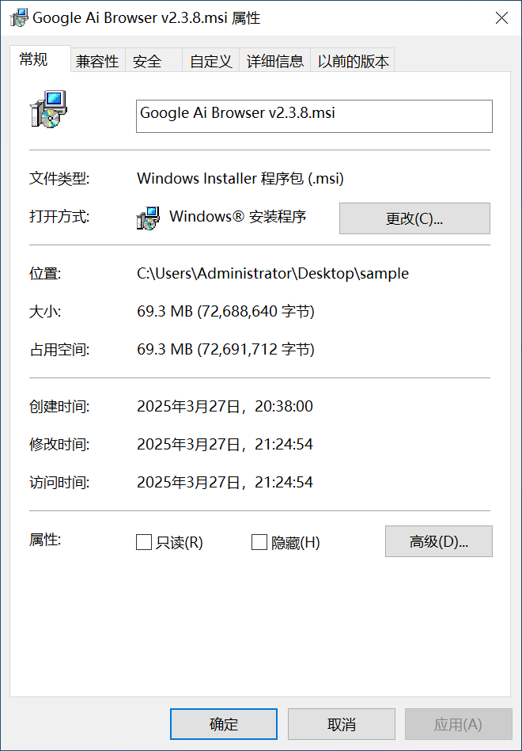

该msi会释放大量文件，其中包含许多合法应用，核心的恶意模块为11UCore.dll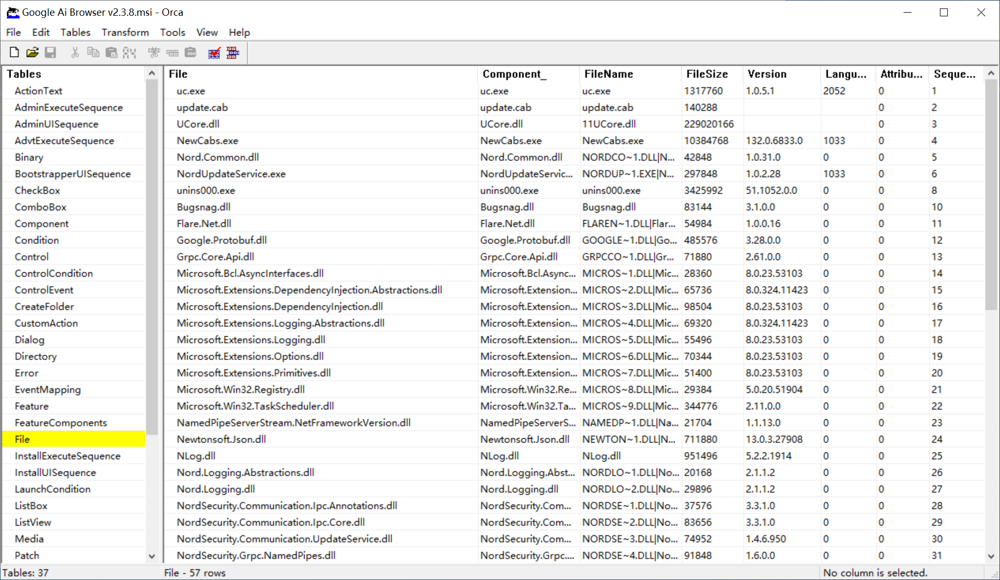

通过CustomAction来执行恶意模块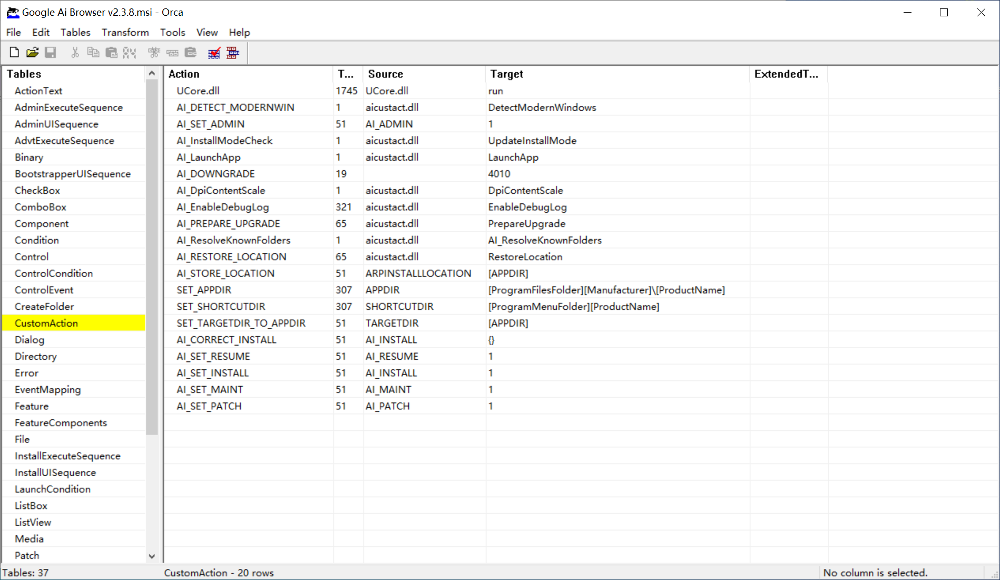

# 安装行为

安装时默认会安装到C:Program Files (x86)MancyagGoogle Ai Browser v2.3.8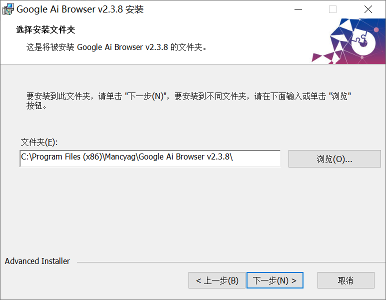

释放目录如下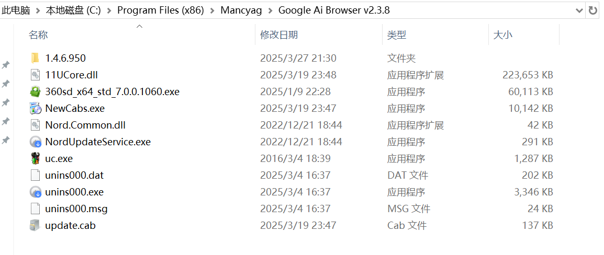

|  |  |
| --- | --- |
| 文件/目录名 | 描述 |
| 1.4.6.950 | 存放诺顿的一些依赖dll |
| 11UCore.dll | 核心恶意模块 |
| 360sd\_x64\_std\_7.0.0.1060.exe | 360杀毒安装包，实际并未运行 |
| NewCabs.exe | Chrome安装包 |
| Nord.Common.dll | 诺顿相关文件 |
| NordUpdateService.exe | 诺顿相关文件，实际并未运行 |
| uc.exe | 核心文件，用于加载11UCore.dll |
| unins000.dat | 安装包相关文件 |
| unins000.exe | 安装包相关文件 |
| unins000.msg | 安装包相关文件 |
| update.cab | 安装包相关文件 |

​

其中包含了诺顿相关应用，用来模拟一个软件程序的安装和卸载行为。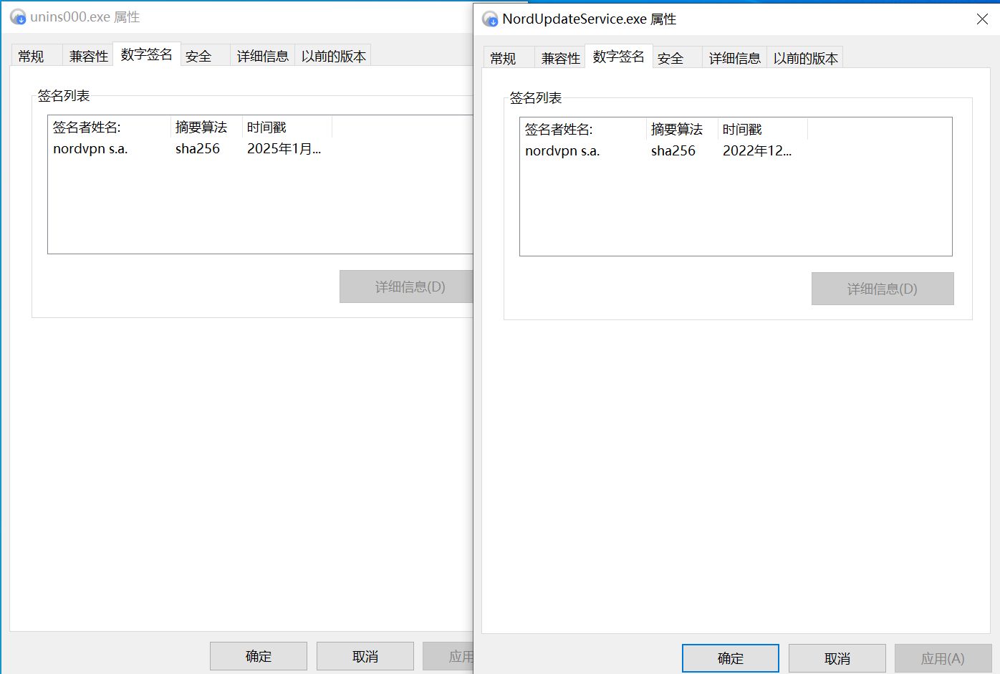

安装后会执行白加黑程序uc.exe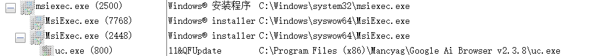

# 详细分析

运行uc.exe时，会调用11UCore.dll中的导出函数GetYYUCoreObj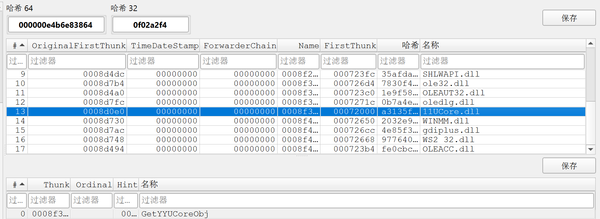

11UCore.dll编译时间为2025-03-19，推测系最近样本，文件大小超过200MB，该dll实际为一个shellcode loader，用来解密执行银狐木马的核心功能模块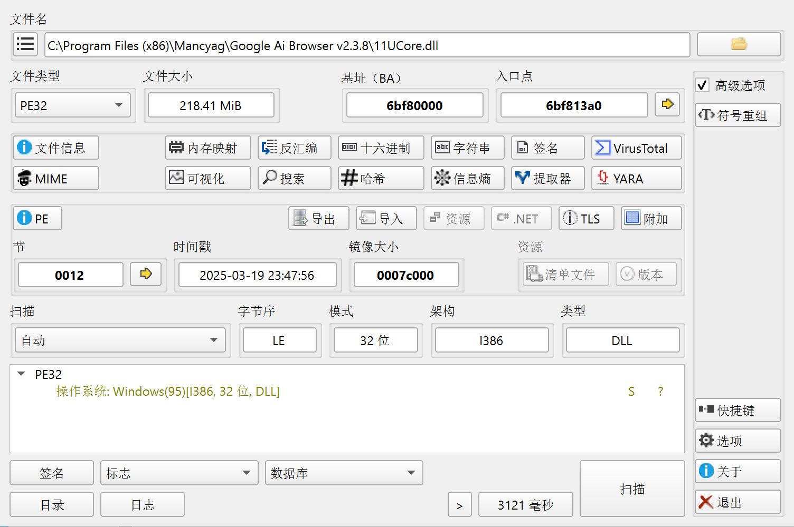

11UCore.dll使用了文件大小填充技术，添加了大量的附加数据，将文件大小膨胀到200MB，尝试绕过一些云查杀等技术。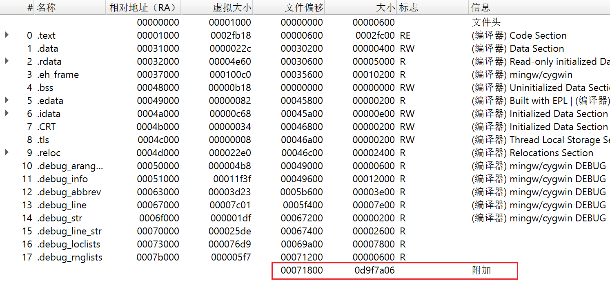

对其静态分析，通过powershell添加Windows Defender排除目录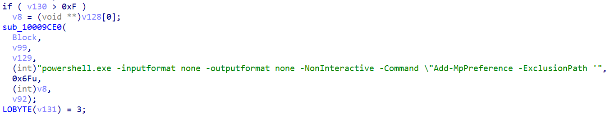

创建名为"Google TaskScheduled Manager 130.0.1.5"的计划任务，用于权限维持

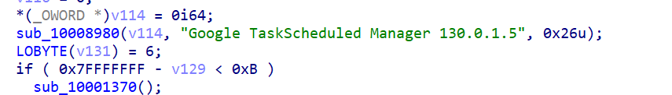

检测自身是否被调试，同时使用了字符串混淆技术并动态获取函数地址。读取存储在文件11UCore3.cpy中的加密shellcode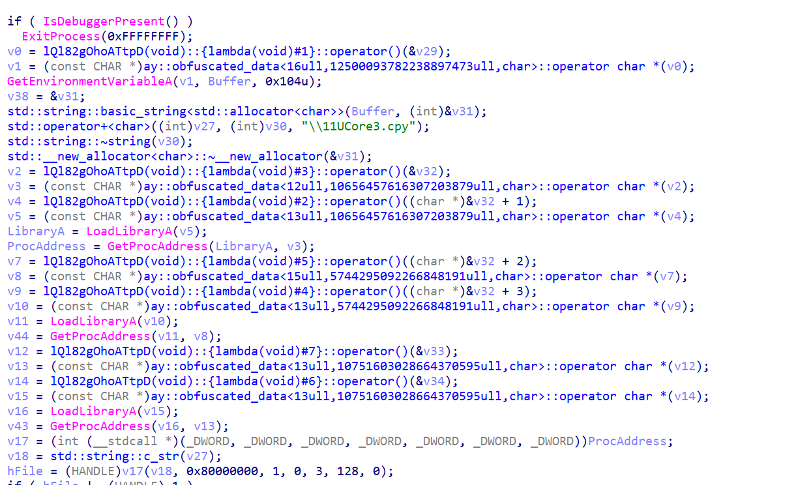

解密shellcode后通过回调函数EnumDesktopWindows执行shellcode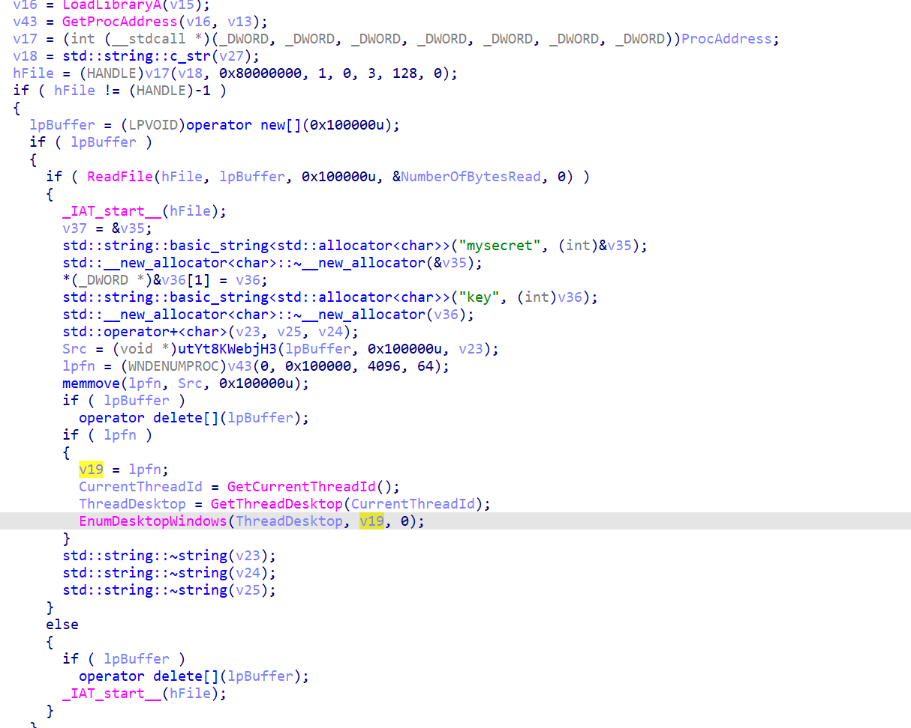

在内存中可以看加载了一个dll文件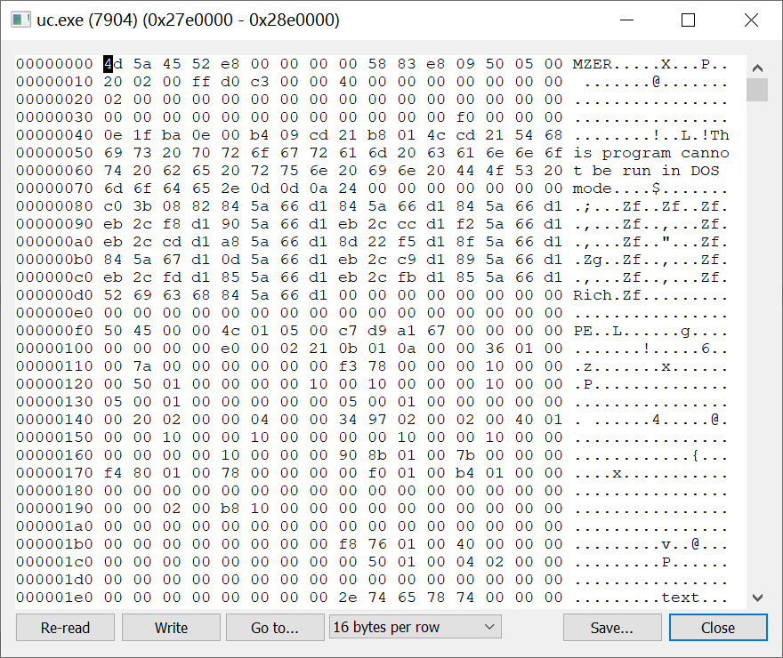

将其从内存中dump出来，该文件为银狐木马的上线模块，通过加载其中的导出函数执行恶意功能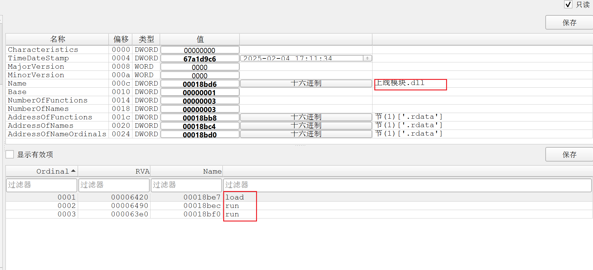

进行静态分析，发现为经典已知银狐系列木马，这里就不再重复进行分析了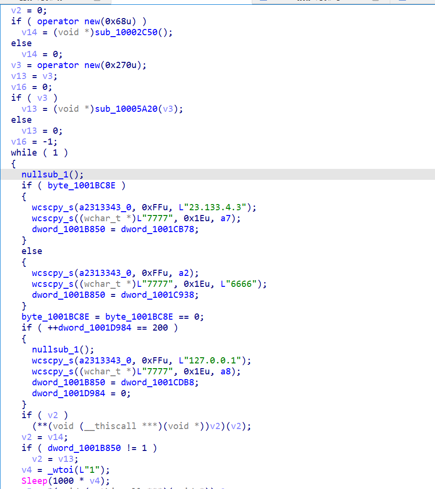

在内存中找到木马配置信息

|p1:23.133.4.3|o1:6666|t1:1|p2:23.133.4.3|o2:7777|t2:1|p3:127.0.0.1|o3:80|t3:1|dd:1|cl:1|fz:默认|bb:1.0|bz:2025. 2.28|jp:0|bh:0|ll:0|dl:1|sh:0|kl:0|bd:0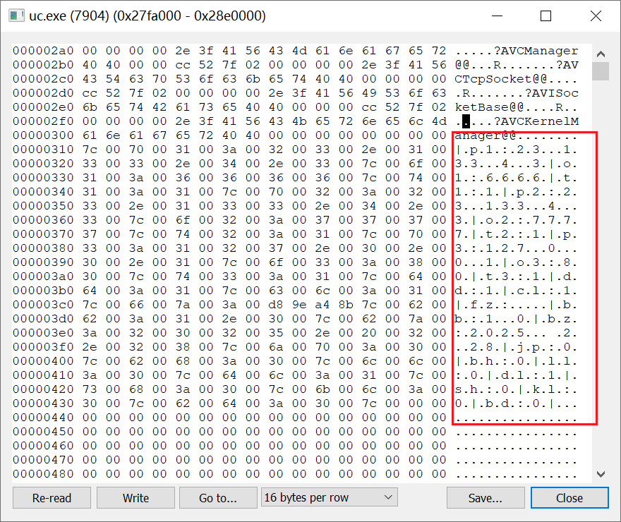

目前该ip已被标记为恶意

# IOC

23.133.4[.]3

|p1:23.133.4.3|o1:6666|t1:1|p2:23.133.4.3|o2:7777|t2:1|p3:127.0.0.1|o3:80|t3:1|dd:1|cl:1|fz:默认|bb:1.0|bz:2025. 2.28|jp:0|bh:0|ll:0|dl:1|sh:0|kl:0|bd:0
