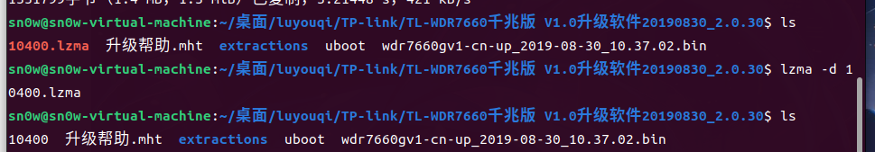
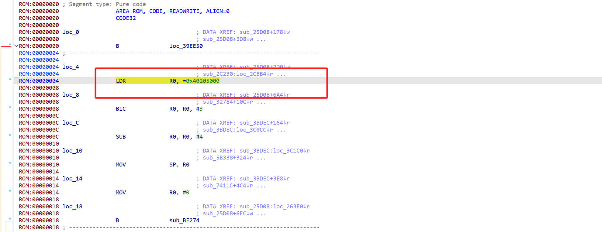
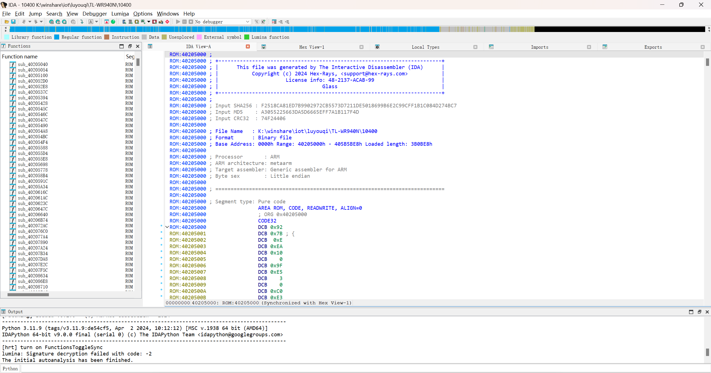
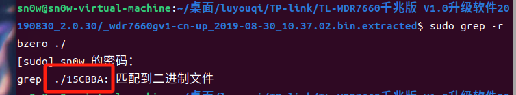
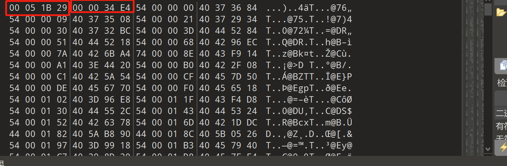
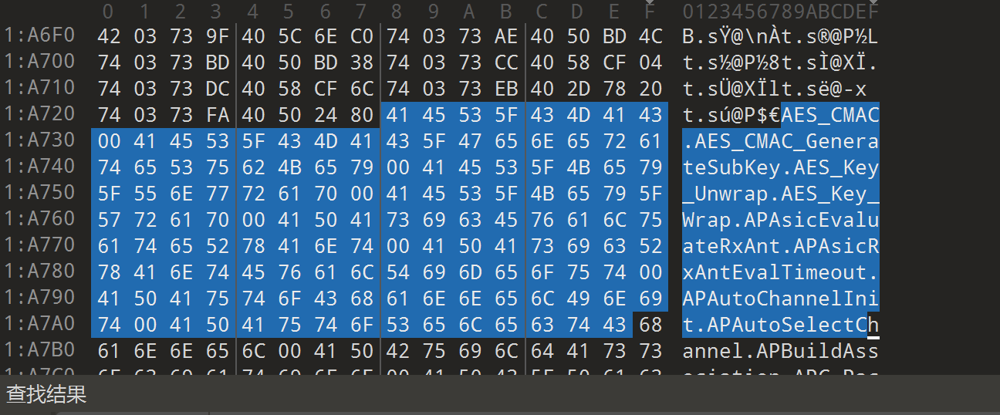
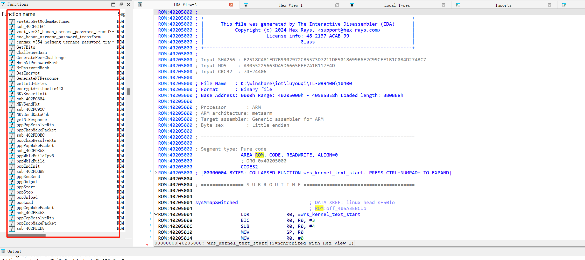

# 基于VxWorks的固件分析-修复篇-先知社区

> **来源**: https://xz.aliyun.com/news/17502  
> **文章ID**: 17502

---

## 版本信息

TP-link/TL-WDR7660千兆版 V1.0升级软件20190830\_2.0.30

附件地址

<https://smb.tp-link.com.cn/service/detail_download_7989.html>

```
--------------------------------------------------------------------------------------------------------
DECIMAL                            HEXADECIMAL                        DESCRIPTION
--------------------------------------------------------------------------------------------------------
512                                0x200                              uImage firmware image, header 
                                                                      size: 64 bytes, data size: 48928 
                                                                      bytes, compression: lzma, CPU: 
                                                                      ARM, OS: Firmware, image type: 
                                                                      Standalone Program, load address: 
                                                                      0x41C00000, entry point: 
                                                                      0x41C00000, creation time: 
                                                                      2018-09-05 07:32:57, image name: 
                                                                      "U-Boot 
                                                                      2014.04-rc1-gdbb6e75-dirt]"
66560                              0x10400                            LZMA compressed data, properties: 
                                                                      0x6E, dictionary size: 8388608 
                                                                      bytes, compressed size: 1351799 
                                                                      bytes, uncompressed size: 3869672 
                                                                      bytes
--------------------------------------------------------------------------------------------------------
```

uImage header size是64字节 ARM架构 载入uboot的地址0x41C00000

数据是lzma压缩的

我们依次进行提取

## 提取uboot

```
dd if=wdr7660gv1-cn-up_2019-08-30_10.37.02.bin of=uboot bs=1 skip=512 count=66048(66560-512)
```

放入010editor中分析 header data

```
27051956
0DEFB3DA
A5B8F86A
90000BF2
041C0000
41C00000
2A36A3AD
11020103
552D426F
6F742032
3031342E
30342D72
63312D67
64626236
6537352D
64697274
```

* **术字 (**`ih_magic`**)**: `0x27051956`，表明这是一个 `uImage` 镜像。
* **头部 CRC 校验 (**`ih_hcrc`**)**: `0x0DEFB3DA`，头部校验值。
* **时间戳 (**`ih_time`**)**: `0xA5B8F86A`，镜像生成的时间（需进一步转换为实际时间）。
* **镜像数据大小 (**`ih_size`**)**: `0x90000BF2`，即 2415916690 字节。
* **加载地址 (**`ih_load`**)**: `0x041C0000`，解压后的加载地址。
* **入口地址 (**`ih_ep`**)**: `0x41C00000`，解压后的执行入口地址。
* **数据 CRC 校验 (**`ih_dcrc`**)**: `0x2A36A3AD`，镜像数据的校验值。
* **操作系统类型 (**`ih_os`**)**: `0x11`，表示操作系统是 `U-Boot`。
* **架构类型 (**`ih_arch`**)**: `0x02`，表示镜像适用于 ARM 架构。
* **镜像类型 (**`ih_type`**)**: `0x01`，表示镜像类型是 `Standalone Program`。
* **压缩类型 (**`ih_comp`**)**: `0x03`，表示镜像使用 `LZMA` 压缩。
* **镜像名称 (**`ih_name`**)**: `"u-Boot 2014.04-rc1-gdb26e75-dir"`，这是镜像的名称。

## 提取主程序

```
dd if=wdr7660gv1-cn-up_2019-08-30_10.37.02.bin of=10400.lzma bs=1 skip=66560 count=1351799
```



解压后 没有问题成功解压

再进一步分析

```
binwalk 10400 
```

```
--------------------------------------------------------------------------------------------------------
DECIMAL                            HEXADECIMAL                        DESCRIPTION
--------------------------------------------------------------------------------------------------------
3174925                            0x30720D                           Copyright text: "Copyright (c) 
                                                                      1983, 1988, 1993 Regents of the 
                                                                      University of California. All 
                                                                      rights reserved. "
3178484                            0x307FF4                           Copyright text: "Copyright 
                                                                      1984-2002 Wind River Systems, 
                                                                      Inc. This program contains 
                                                                      confidential information of Wind 
                                                                      "
3566196                            0x366A74                           Copyright text: "Copyright(C) 
                                                                      2001-2011 by TP-LINK TECHNOLOGIES 
                                                                      CO., LTD."
3610436                            0x371744                           VxWorks WIND kernel version 2.6
3725480                            0x38D8A8                           AES S-Box
3726796                            0x38DDCC                           AES S-Box
3728344                            0x38E3D8                           SHA256 hash constants, little 
                                                                      endian
3784928                            0x39C0E0                           SHA256 hash constants, little 
                                                                      endian
3847576                            0x3AB598                           CRC32 polynomial table, little 
                                                                      endian
--------------------------------------------------------------------------------------------------------
```

解释一下上面的信息

* **版权文本**：这些文本代表固件中不同软件的版权信息。这些内存地址上的文本可能用于显示有关固件或作系统中使用的相应软件组件的法律信息。
* **VxWorks WIND 内核版本 2.6**：这是指系统中嵌入的 VxWorks作系统内核的版本。VxWorks 是嵌入式系统中经常使用的实时作系统。
* **AES S-Box**：这些是 AES 加密算法中使用的查找表，特别是在密钥扩展和加密/解密过程中。
* **SHA256 哈希常量**：这些常量是 SHA256 加密哈希算法的一部分，用于各种安全应用程序，如数字签名、消息完整性检查等。
* **CRC32 多项式表**：此表包含用于计算 CRC32 校验和的值，CRC32 校验和通常用于网络通信、文件存储等中的错误检查。

这里已经知道主程序的架构 arm 小端序 接下来要找到程序的入口点

可以通过直接ida设置正确架构默认打开 反编译最开始的几段可以看到



赋给r0 0x40205000 猜测这就是基地址 关掉重新设置发现



是基本没啥问题的 但是这里是没有符号表的 我们binwalk固件的时候也是无法直接解析出来的因此我们手动去查询

查看VxWorks手册 发现常用bzero这些函数 因此我们用grep -r bzero ./去查看 发现15CBBA可能存在符号表





放入010 editor后 发现格式确实很像符号表 最前面四字节是总size长度 后面四字节是总条目数

因此我们直接跟着 0x34E4\*8+8找到符号表的位置 也就是0x1a728



我们可以通过自动化工具vxhunter或者ida脚本进行加载

由于我用的是最新版的ida 9.x 而vxhunter 又已经有5年左右没有维护了 所以这里在网上找了个脚本 手动改了改 脚本如下

```
# encoding:utf-8
#symfile_path: 刚刚搜索到的符号文件的路径
#symbols_table_start : 符号表起始偏移，从16进制编辑器看出来是8（前8字节作用不清楚，也不重要）
#strings_table_start : 字符串起始偏移，也是从16进制编辑器看出来
import binascii
import idautils
import idc
import idaapi
import ida_funcs
 
symfile_path = r"K:\winshare\iot\luyouqi\TL-WR940N/15CBBA"
symbols_table_start = 8
strings_table_start = 0x1a728
 
with open(symfile_path, 'rb') as f:
    symfile_contents = f.read()
 
symbols_table = symfile_contents[symbols_table_start:strings_table_start]
strings_table = symfile_contents[strings_table_start:]
 
def get_string_by_offset(offset):
    index = 0
    while True:
        if strings_table[offset+index] != 0:
            index += 1
        else:
            break
    return strings_table[offset:offset+index]
 
 
def get_symbols_metadata():
    symbols = []
    for offset in range(0, len(symbols_table), 8):
        symbol_item = symbols_table[offset:offset + 8]
        flag = symbol_item[0]
        string_offset = int(binascii.b2a_hex((symbol_item[1:4])).decode("ascii"), 16)
        string_name = get_string_by_offset(string_offset)
        target_address = int(binascii.b2a_hex((symbol_item[-4:])).decode("ascii"), 16)
        
        # 添加调试输出
        print(f"Symbol: {flag}, {string_name}, {target_address}")
        
        symbols.append((flag, string_name, target_address))
    return symbols

 
def add_symbols(symbols_meta_data):
    for flag, string_name, target_address in symbols_meta_data:
        print(f"Adding symbol: {string_name.decode('utf8')} at {hex(target_address)}")
        idc.set_name(target_address, string_name.decode("utf8"))  #命令目标地址的数据，数据类型由flag而定
        if flag == 0x54:  # 类型T，表示是text段的符号，text段的符号一般是函数符号
            idc.create_insn(target_address)  # 确保target_address有指令
            ida_funcs.add_func(target_address)  # 将target_address定义为函数并自动寻找边界

if __name__ == "__main__":
    symbols_metadata = get_symbols_metadata()
    if symbols_metadata:
        print(f"Found {len(symbols_metadata)} symbols.")
        add_symbols(symbols_metadata)
    else:
        print("No symbols found.")
```


可以看到我们这里基本修复完成


