# springSecurity框架在 WebFlux 下的权限饶过-先知社区

> **来源**: https://xz.aliyun.com/news/17509  
> **文章ID**: 17509

---

# springSecurity框架在 WebFlux 下的权限饶过

springSecurity框架在 WebFlux 下的权限饶过

## 前言

前台的绕过往往是最有价值的，而在 spring 中的前台绕过往往都是路由解析差异造成的，下面分析分析基于 springSecurity 造成的权限绕过，感觉利用解析差异绕过也是非常巧妙的

## 环境搭建

这里环境搭建很简单，只需要选择漏洞版本

具体的搭建可以参考<https://www.dontpanicblog.co.uk/2023/12/09/cve-2023-34034-spring-security-authorization-bypass/>

首先是我们的路由配置，在 WebFlux 中使用 springSecurity 来鉴权

```
@Configuration
@EnableWebFluxSecurity
public class WebFluxSecurityConfig {

    @Bean
    public SecurityWebFilterChain springSecurityFilterChain(ServerHttpSecurity http) {
        http
                // disable CSRF
                .csrf().disable()

                // add AuthenticationWebFilter and set the handler
                .formLogin()
                .authenticationSuccessHandler(new WebFilterChainServerAuthenticationSuccessHandler())
                .authenticationFailureHandler(((webFilterExchange, exception) -> Mono.error(exception)))


                .and()
                .authorizeExchange()
                .pathMatchers("/admin/**")
                .hasRole("ADMIN")

                .and()
                .authorizeExchange()
                .anyExchange()
                .permitAll();
        return http.build();
    }
}

```

admin 路由如下

```
import org.springframework.web.bind.annotation.GetMapping;
import org.springframework.web.bind.annotation.RequestMapping;
import org.springframework.web.bind.annotation.RestController;
import reactor.core.publisher.Mono;

@RestController
@RequestMapping("admin")
public class AdminResourceController {

    @GetMapping("hello")
    public Mono<String> getPublicResource() {
        return Mono.just("hello admin!");
    }
}

```

普通的用户路由

```
@RestController
@RequestMapping("/public")
public class PublicResourceController {

    @GetMapping("/")
    public Mono<String> getPublicResource() {
        return Mono.just("hello!");
    }

}

```

## 漏洞复现

我们访问 public 路由，发现不需要鉴权就能访问

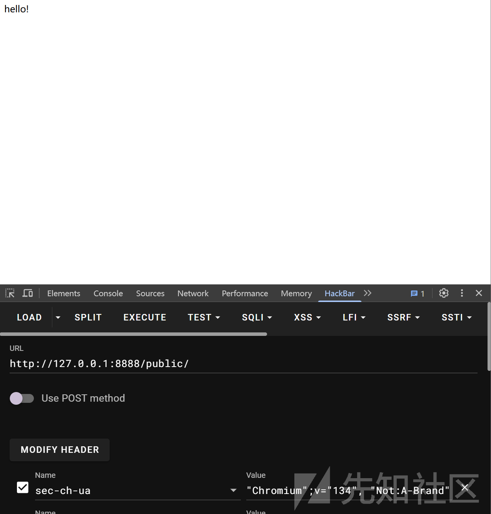

然后访问 admin 路由  
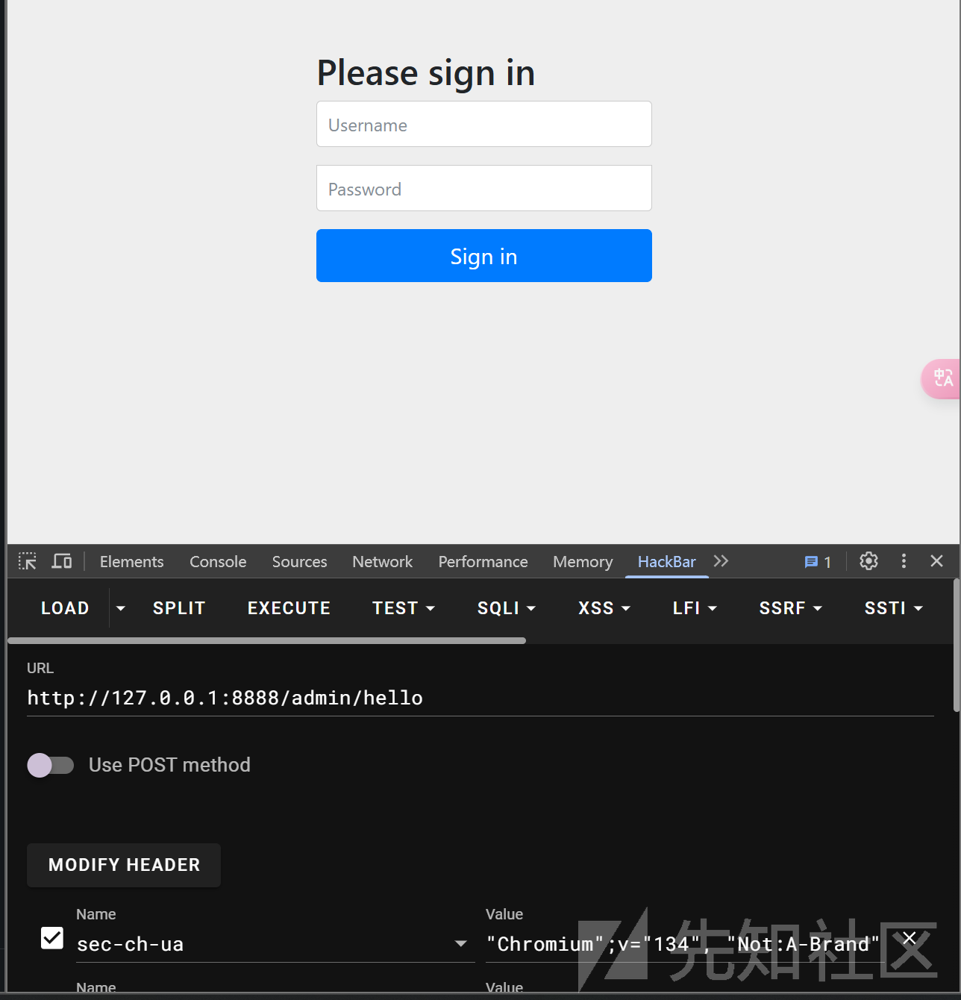

发现需要登录了

但是如果我们修改配置代码

如下

```
import org.springframework.context.annotation.Bean;
import org.springframework.context.annotation.Configuration;
import org.springframework.security.config.annotation.web.reactive.EnableWebFluxSecurity;
import org.springframework.security.config.web.server.ServerHttpSecurity;
import org.springframework.security.web.server.SecurityWebFilterChain;
import org.springframework.security.web.server.authentication.WebFilterChainServerAuthenticationSuccessHandler;
import reactor.core.publisher.Mono;

@Configuration
@EnableWebFluxSecurity
public class WebFluxSecurityConfig {

    @Bean
    public SecurityWebFilterChain springSecurityFilterChain(ServerHttpSecurity http) {
        http
                // disable CSRF
                .csrf().disable()

                // add AuthenticationWebFilter and set the handler
                .formLogin()
                .authenticationSuccessHandler(new WebFilterChainServerAuthenticationSuccessHandler())
                .authenticationFailureHandler(((webFilterExchange, exception) -> Mono.error(exception)))


                .and()
                .authorizeExchange()
                .pathMatchers("admin/**")
                .hasRole("ADMIN")

                .and()
                .authorizeExchange()
                .anyExchange()
                .permitAll();
        return http.build();
    }
}

```

重新启动环境再次访问 admin

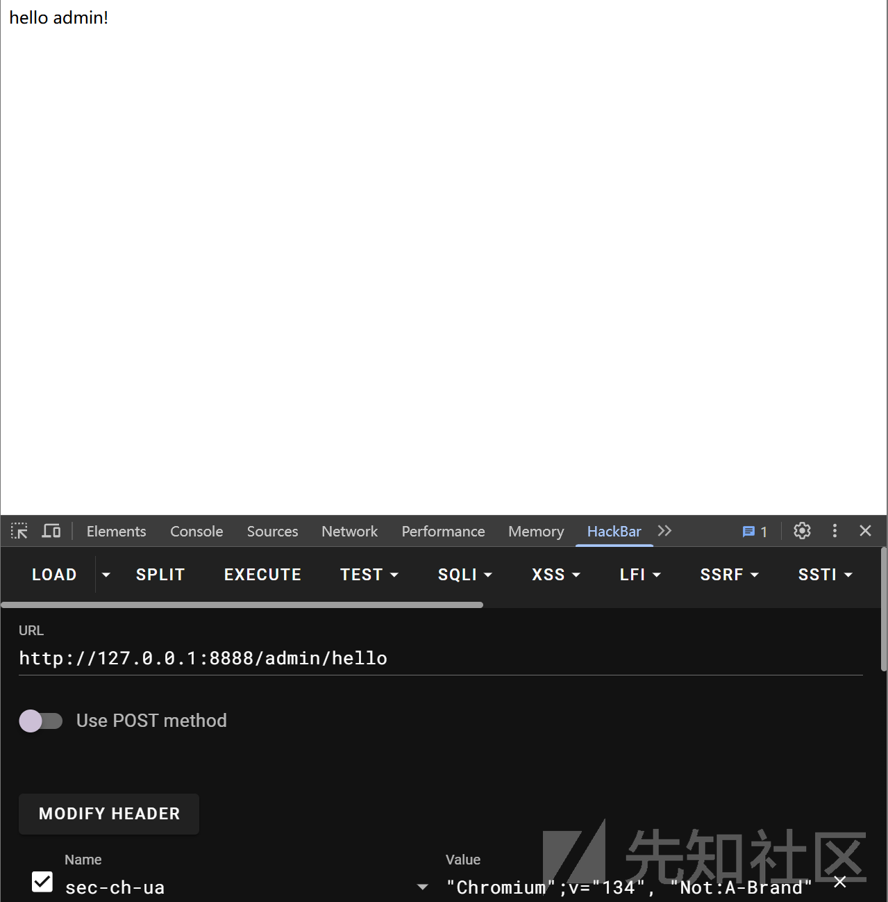

成功访问到 admin 界面

## 漏洞分析

上面两种区别其实就是在于对配置中 admin 界面的写法

### WebFlux 解析路径流程

首先是我们的 WebFlux 解析路径流程

在寻找对应的处理器的流程中会解析我们的 path  
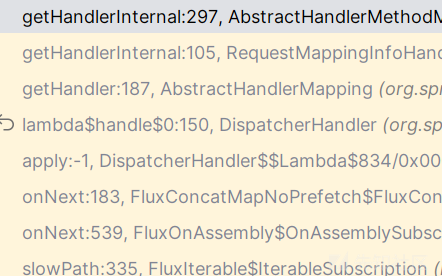

```
public Mono<HandlerMethod> getHandlerInternal(ServerWebExchange exchange) {
    this.mappingRegistry.acquireReadLock();

    try {
        HandlerMethod handlerMethod;
        try {
            handlerMethod = this.lookupHandlerMethod(exchange);
        } catch (Exception var8) {
            Mono var4 = Mono.error(var8);
            return var4;
        }

        if (handlerMethod != null) {
            handlerMethod = handlerMethod.createWithResolvedBean();
        }

        Mono var3 = Mono.justOrEmpty(handlerMethod);
        return var3;
    } finally {
        this.mappingRegistry.releaseReadLock();
    }
}
```

调用 lookupHandlerMethod 方法开始寻找处理器

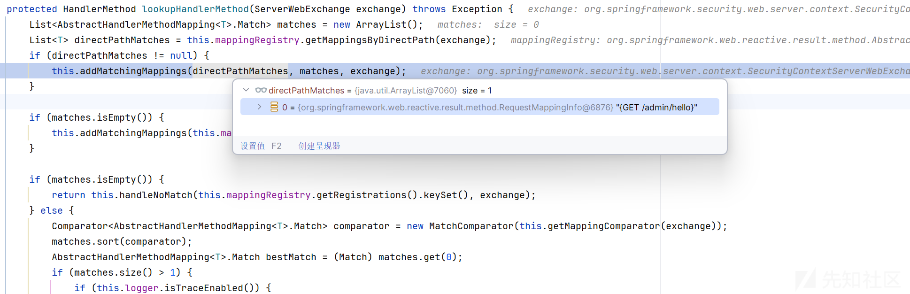

增加我们的路由到 MatchingMapping 中

在这个过程中会不断去获取

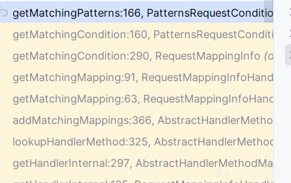

getMatchingPatterns 方法

```
private SortedSet<PathPattern> getMatchingPatterns(ServerWebExchange exchange) {
    PathContainer lookupPath = exchange.getRequest().getPath().pathWithinApplication();
    TreeSet<PathPattern> result = null;
    Iterator var4 = this.patterns.iterator();

    while(var4.hasNext()) {
        PathPattern pattern = (PathPattern)var4.next();
        if (pattern.matches(lookupPath)) {
            result = result != null ? result : new TreeSet();
            result.add(pattern);
        }
    }

    return result;
}
```

首先从请求中获取路径，然后通过 PathPattern 去匹配

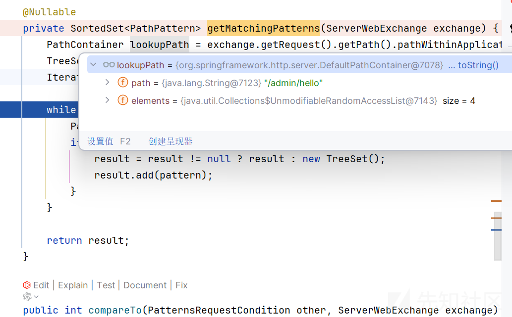

如果匹配成功会返回，而我们的匹配机制来源于 patterns

所以重点就是去寻找我们的 patterns

而 patterns 在于运行我们程序初始化的时候

首先初始化的时候会调用 getMappingForMethod 方法，首先获取我们全部的路由

根据我们的方法名称去寻找对应的路由

```
protected RequestMappingInfo getMappingForMethod(Method method, Class<?> handlerType) {
    RequestMappingInfo info = this.createRequestMappingInfo(method);
    if (info != null) {
        RequestMappingInfo typeInfo = this.createRequestMappingInfo(handlerType);
        if (typeInfo != null) {
            info = typeInfo.combine(info);
        }

        if (info.getPatternsCondition().isEmptyPathMapping()) {
            info = info.mutate().paths(new String[]{"", "/"}).options(this.config).build();
        }

        Iterator var5 = this.pathPrefixes.entrySet().iterator();

        while(var5.hasNext()) {
            Map.Entry<String, Predicate<Class<?>>> entry = (Map.Entry)var5.next();
            if (((Predicate)entry.getValue()).test(handlerType)) {
                String prefix = (String)entry.getKey();
                if (this.embeddedValueResolver != null) {
                    prefix = this.embeddedValueResolver.resolveStringValue(prefix);
                }

                info = RequestMappingInfo.paths(new String[]{prefix}).options(this.config).build().combine(info);
                break;
            }
        }
    }

    return info;
}
```

具体的逻辑是在 createRequestMappingInfo 方法内部

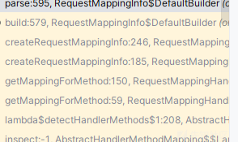

```
public RequestMappingInfo build() {
    PathPatternParser parser = this.options.getPatternParser() != null ? this.options.getPatternParser() : PathPatternParser.defaultInstance;
    RequestedContentTypeResolver contentTypeResolver = this.options.getContentTypeResolver();
    return new RequestMappingInfo(this.mappingName, isEmpty(this.paths) ? null : new PatternsRequestCondition(parse(this.paths, parser)), ObjectUtils.isEmpty(this.methods) ? null : new RequestMethodsRequestCondition(this.methods), ObjectUtils.isEmpty(this.params) ? null : new ParamsRequestCondition(this.params), ObjectUtils.isEmpty(this.headers) ? null : new HeadersRequestCondition(this.headers), ObjectUtils.isEmpty(this.consumes) && !this.hasContentType ? null : new ConsumesRequestCondition(this.consumes, this.headers), ObjectUtils.isEmpty(this.produces) && !this.hasAccept ? null : new ProducesRequestCondition(this.produces, this.headers, contentTypeResolver), this.customCondition, this.options);
}
```

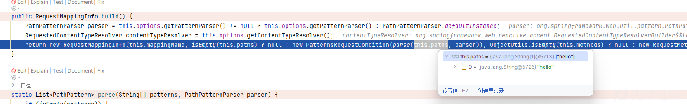

调用 parse 去处理我们的路由

重点也在于这个 parse 方法

```
static List<PathPattern> parse(String[] patterns, PathPatternParser parser) {
    if (isEmpty(patterns)) {
        return Collections.emptyList();
    } else {
        List<PathPattern> result = new ArrayList(patterns.length);
        String[] var3 = patterns;
        int var4 = patterns.length;

        for(int var5 = 0; var5 < var4; ++var5) {
            String pattern = var3[var5];
            pattern = parser.initFullPathPattern(pattern);
            result.add(parser.parse(pattern));
        }

        return result;
    }
}
```

会调用 initFullPathPattern 去处理 pattern

```
public String initFullPathPattern(String pattern) {
    return StringUtils.hasLength(pattern) && !pattern.startsWith("/") ? "/" + pattern : pattern;
}
```

会标准化我们的路由加上/

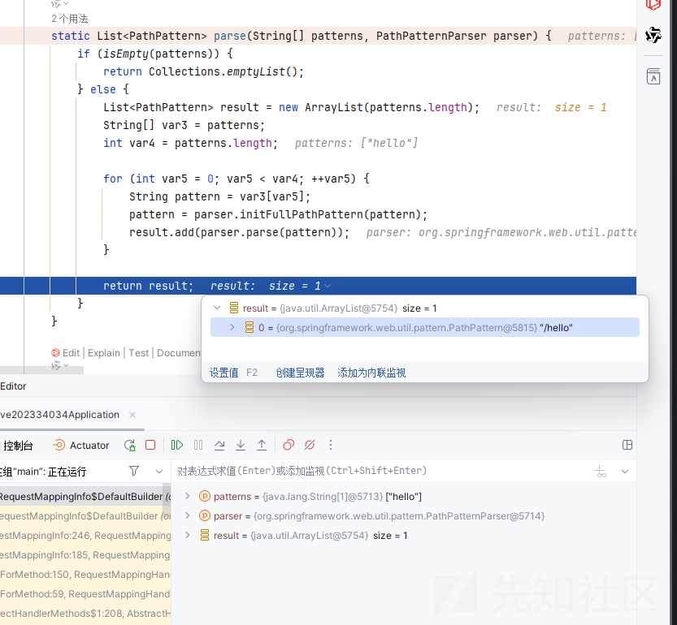

这就是为什么我们代码写的没有加上/也能够成功匹配到对应处理逻辑的原因

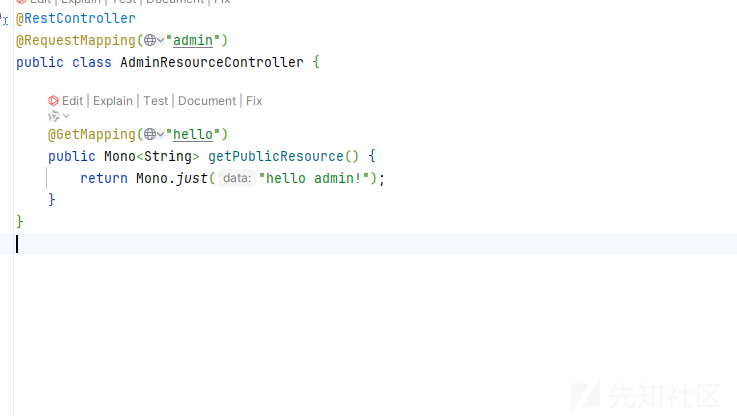

### Security 的 pathMatchers 匹配流程

在解析路由的时候会调用 matches:74, PathPatternParserServerWebExchangeMatcher (org.springframework.security.web.server.util.matcher)

```
public Mono<ServerWebExchangeMatcher.MatchResult> matches(ServerWebExchange exchange) {
    ServerHttpRequest request = exchange.getRequest();
    PathContainer path = request.getPath().pathWithinApplication();
    if (this.method != null && !this.method.equals(request.getMethod())) {
        return MatchResult.notMatch().doOnNext((result) -> {
            if (logger.isDebugEnabled()) {
                Log var10000 = logger;
                HttpMethod var10001 = request.getMethod();
                var10000.debug("Request '" + var10001 + " " + path + "' doesn't match '" + this.method + " " + this.pattern.getPatternString() + "'");
            }

        });
    } else {
        boolean match = this.pattern.matches(path);
        if (!match) {
            return MatchResult.notMatch().doOnNext((result) -> {
                if (logger.isDebugEnabled()) {
                    Log var10000 = logger;
                    HttpMethod var10001 = request.getMethod();
                    var10000.debug("Request '" + var10001 + " " + path + "' doesn't match '" + this.method + " " + this.pattern.getPatternString() + "'");
                }

            });
        } else {
            Map<String, String> pathVariables = this.pattern.matchAndExtract(path).getUriVariables();
            Map<String, Object> variables = new HashMap(pathVariables);
            if (logger.isDebugEnabled()) {
                logger.debug("Checking match of request : '" + path + "'; against '" + this.pattern.getPatternString() + "'");
            }

            return MatchResult.match(variables);
        }
    }
}
```

然后根据请求去获取我们的 path，获取了之后会进行 pattern 的匹配，只有匹配成功后才会将我们的路径放入 variables 中，以供后续权限检测的匹配，所以我们如果需要绕过那么需要实现，访问 admin 能够在 webflux 匹配成功，但是在这里匹配失败

而 pattern 是来源于我们的配置的，首先我们修改一下代码看看匹配成功的看看效果

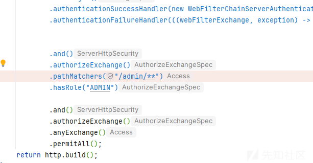

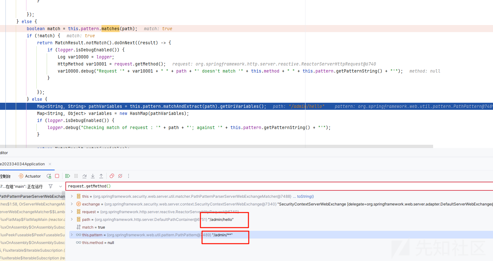

这是能够匹配成功然后放入我们的变量的

我们分析一下匹配逻辑

```
public boolean matches(PathContainer pathContainer) {
    if (this.head != null) {
        if (!this.hasLength(pathContainer)) {
            if (!(this.head instanceof WildcardTheRestPathElement) && !(this.head instanceof CaptureTheRestPathElement)) {
                return false;
            }

            pathContainer = EMPTY_PATH;
        }

        MatchingContext matchingContext = new MatchingContext(pathContainer, false);
        return this.head.matches(0, matchingContext);
    } else {
        return !this.hasLength(pathContainer) || this.matchOptionalTrailingSeparator && this.pathContainerIsJustSeparator(pathContainer);
    }
}
```

获取我们的 head 也就是匹配规则的第一个字符，然后再获取待匹配对象

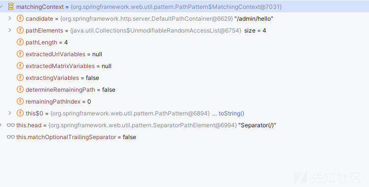

然后我们再次修改

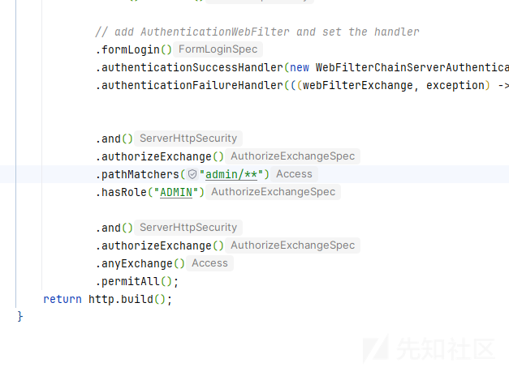

再次查看匹配结果  
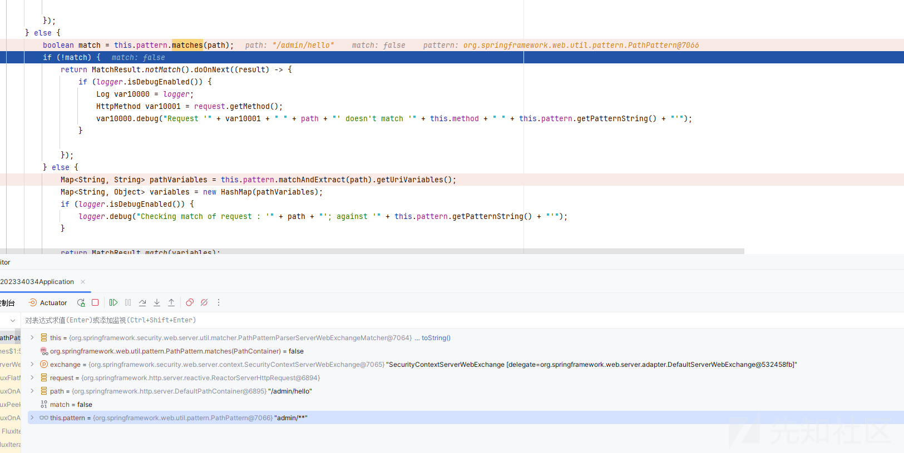

这里是匹配失败的

```
public boolean matches(PathContainer pathContainer) {
    if (this.head != null) {
        if (!this.hasLength(pathContainer)) {
            if (!(this.head instanceof WildcardTheRestPathElement) && !(this.head instanceof CaptureTheRestPathElement)) {
                return false;
            }

            pathContainer = EMPTY_PATH;
        }

        MatchingContext matchingContext = new MatchingContext(pathContainer, false);
        return this.head.matches(0, matchingContext);
    } else {
        return !this.hasLength(pathContainer) || this.matchOptionalTrailingSeparator && this.pathContainerIsJustSeparator(pathContainer);
    }
}
```

原因在于我们第一个是 admin，而待匹配是/  
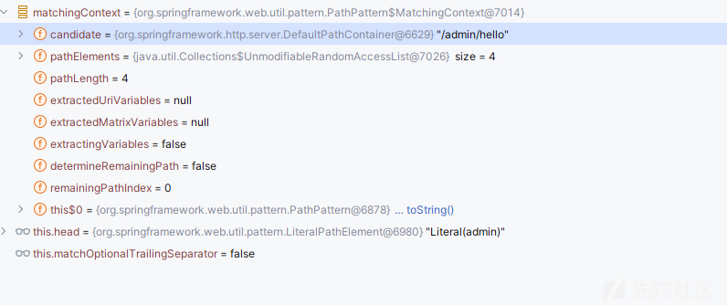

导致匹配失败，导致我们后续也不会进行安全检测

## 绕过原理总结

分析了两个路径解析过程后我们再次来总结

绕过的核心就是 webflux 能够对我们输入路径正常解析，但是 security 不能正常解析

而对于 admin 这样的配置路由，在 webflux 会标准化处理，但是对于 security 这样的配置并不会标准化处理，导致了绕过
