# 睡眠混淆技术分享(sleep obfuscation)-先知社区

> **来源**: https://xz.aliyun.com/news/17512  
> **文章ID**: 17512

---

睡眠混淆是用于对抗内存检测的一项技术 在特定的触发器触发或定时执行内存加解密 改变权限 来规避AV检测

下面通过几个开源项目学习这种技术

# sleep obfuscation

## EKKO

<https://github.com/Cracked5pider/Ekko>

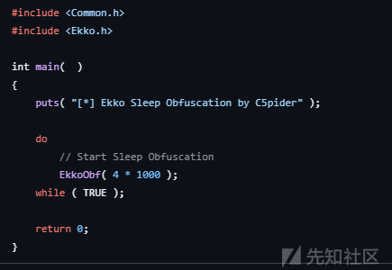

```
VOID EkkoObf( DWORD SleepTime )
 {
     CONTEXT CtxThread   = { 0 };
 
     CONTEXT RopProtRW   = { 0 };
     CONTEXT RopMemEnc   = { 0 };
     CONTEXT RopDelay    = { 0 };
     CONTEXT RopMemDec   = { 0 };
     CONTEXT RopProtRX   = { 0 };
     CONTEXT RopSetEvt   = { 0 };
 
     HANDLE  hTimerQueue = NULL;
     HANDLE  hNewTimer   = NULL;
     HANDLE  hEvent      = NULL;
     PVOID   ImageBase   = NULL;
     DWORD   ImageSize   = 0;
     DWORD   OldProtect  = 0;
 
     // Can be randomly generated
     CHAR    KeyBuf[ 16 ]= { 0x55, 0x55, 0x55, 0x55, 0x55, 0x55, 0x55, 0x55, 0x55, 0x55, 0x55, 0x55, 0x55, 0x55, 0x55, 0x55 };
     USTRING Key         = { 0 };
     USTRING Img         = { 0 };
 
     PVOID   NtContinue  = NULL;
     PVOID   SysFunc032  = NULL;
 
     hEvent      = CreateEventW( 0, 0, 0, 0 );
     hTimerQueue = CreateTimerQueue();
 
     NtContinue  = GetProcAddress( GetModuleHandleA( "Ntdll" ), "NtContinue" );
     SysFunc032  = GetProcAddress( LoadLibraryA( "Advapi32" ),  "SystemFunction032" );
 
     ImageBase   = GetModuleHandleA( NULL );
     ImageSize   = ( ( PIMAGE_NT_HEADERS ) ( ImageBase + ( ( PIMAGE_DOS_HEADER ) ImageBase )->e_lfanew ) )->OptionalHeader.SizeOfImage;
 
     Key.Buffer  = KeyBuf;
     Key.Length  = Key.MaximumLength = 16;
 
     Img.Buffer  = ImageBase;
     Img.Length  = Img.MaximumLength = ImageSize;
 
     if ( CreateTimerQueueTimer( &hNewTimer, hTimerQueue, RtlCaptureContext, &CtxThread, 0, 0, WT_EXECUTEINTIMERTHREAD ) )
     {
         WaitForSingleObject( hEvent, 0x32 );
 
         memcpy( &RopProtRW, &CtxThread, sizeof( CONTEXT ) );
         memcpy( &RopMemEnc, &CtxThread, sizeof( CONTEXT ) );
         memcpy( &RopDelay,  &CtxThread, sizeof( CONTEXT ) );
         memcpy( &RopMemDec, &CtxThread, sizeof( CONTEXT ) );
         memcpy( &RopProtRX, &CtxThread, sizeof( CONTEXT ) );
         memcpy( &RopSetEvt, &CtxThread, sizeof( CONTEXT ) );
 
         // VirtualProtect( ImageBase, ImageSize, PAGE_READWRITE, &OldProtect );
         RopProtRW.Rsp  -= 8;
         RopProtRW.Rip   = VirtualProtect;
         RopProtRW.Rcx   = ImageBase;
         RopProtRW.Rdx   = ImageSize;
         RopProtRW.R8    = PAGE_READWRITE;
         RopProtRW.R9    = &OldProtect;
 
         // SystemFunction032( &Key, &Img );
         RopMemEnc.Rsp  -= 8;
         RopMemEnc.Rip   = SysFunc032;
         RopMemEnc.Rcx   = &Img;
         RopMemEnc.Rdx   = &Key;
 
         // WaitForSingleObject( hTargetHdl, SleepTime );
         RopDelay.Rsp   -= 8;
         RopDelay.Rip    = WaitForSingleObject;
         RopDelay.Rcx    = NtCurrentProcess();
         RopDelay.Rdx    = SleepTime;
 
         // SystemFunction032( &Key, &Img );
         RopMemDec.Rsp  -= 8;
         RopMemDec.Rip   = SysFunc032;
         RopMemDec.Rcx   = &Img;
         RopMemDec.Rdx   = &Key;
 
         // VirtualProtect( ImageBase, ImageSize, PAGE_EXECUTE_READWRITE, &OldProtect );
         RopProtRX.Rsp  -= 8;
         RopProtRX.Rip   = VirtualProtect;
         RopProtRX.Rcx   = ImageBase;
         RopProtRX.Rdx   = ImageSize;
         RopProtRX.R8    = PAGE_EXECUTE_READWRITE;
         RopProtRX.R9    = &OldProtect;
 
         // SetEvent( hEvent );
         RopSetEvt.Rsp  -= 8;
         RopSetEvt.Rip   = SetEvent;
         RopSetEvt.Rcx   = hEvent;
 
         puts( "[INFO] Queue timers" );
 
         CreateTimerQueueTimer( &hNewTimer, hTimerQueue, NtContinue, &RopProtRW, 100, 0, WT_EXECUTEINTIMERTHREAD );
         CreateTimerQueueTimer( &hNewTimer, hTimerQueue, NtContinue, &RopMemEnc, 200, 0, WT_EXECUTEINTIMERTHREAD );
         CreateTimerQueueTimer( &hNewTimer, hTimerQueue, NtContinue, &RopDelay,  300, 0, WT_EXECUTEINTIMERTHREAD );
         CreateTimerQueueTimer( &hNewTimer, hTimerQueue, NtContinue, &RopMemDec, 400, 0, WT_EXECUTEINTIMERTHREAD );
         CreateTimerQueueTimer( &hNewTimer, hTimerQueue, NtContinue, &RopProtRX, 500, 0, WT_EXECUTEINTIMERTHREAD );
         CreateTimerQueueTimer( &hNewTimer, hTimerQueue, NtContinue, &RopSetEvt, 600, 0, WT_EXECUTEINTIMERTHREAD );
 
         puts( "[INFO] Wait for hEvent" );
 
         WaitForSingleObject( hEvent, INFINITE );
 
         puts( "[INFO] Finished waiting for event" );
     }
 
     DeleteTimerQueue( hTimerQueue );
 }
```

首先创建了一个事件 一个TimerQueue

然后获取NtContinue用于切换线程上下文 SystemFunction032 用于加密

CreateTimerQueueTimer的第三个参数是个回调RtlCaptureContext 用于获取线程上下文 填充到CtxThread

在if内进行ROP的初始化 利用NtContinue切换rip 依次执行修改内存属性 加密 sleep 解密 修改内存属性

对应的函数参数 作者给出了注释

以上这些事是工作线程做的 最终SetEvent 使控制流返回主线程

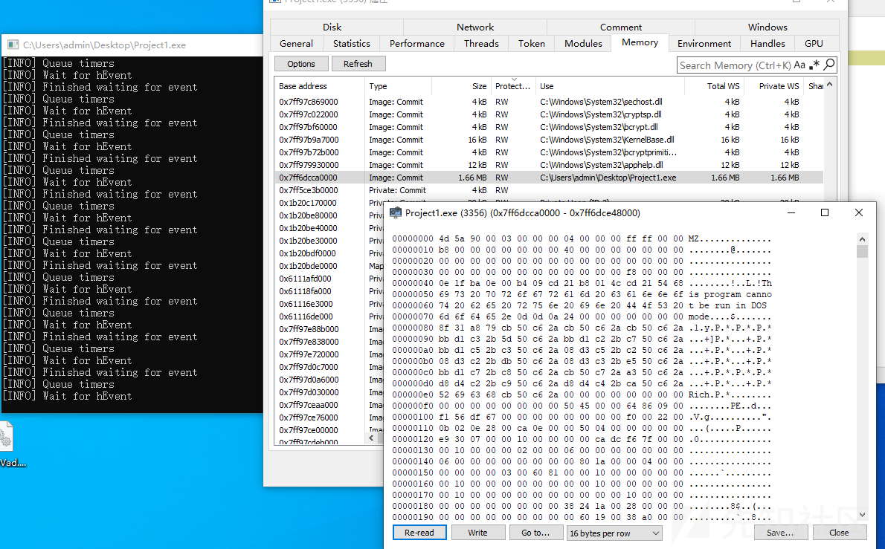

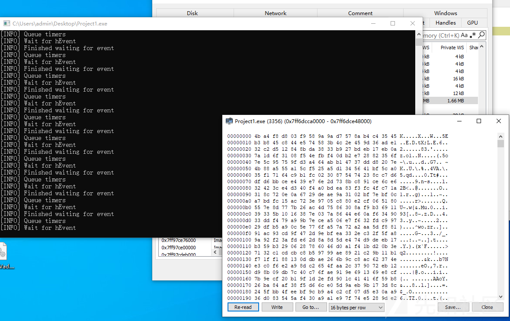

CreateTimerQueueTimer 底层调用ntdll!RtlCreateTimer 调用了ntdll!TpSetTimerEx 调用了ntdll!TppSetTimer

在TppSetTimer中调用TppETWTimerSet 最终会调用NtTraceEvent记录

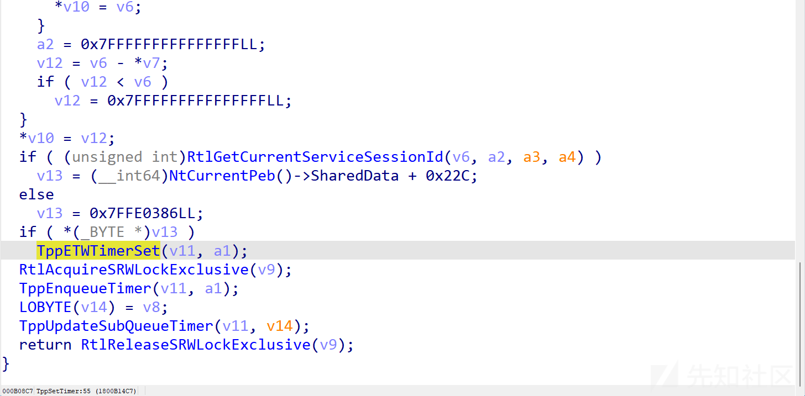

但是实际上在TppEtwTimerSet上下断并断不下来

SharedData是空的

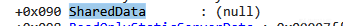

## Cronos

<https://github.com/Idov31/Cronos>

创建定时器 同样通过RtlCaptureContext 获取线程上下文

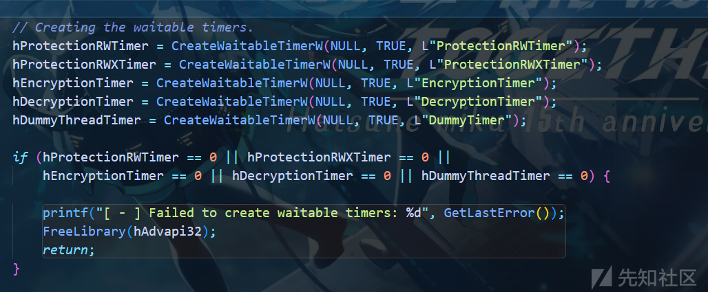

从加载的所有模块中搜特征码

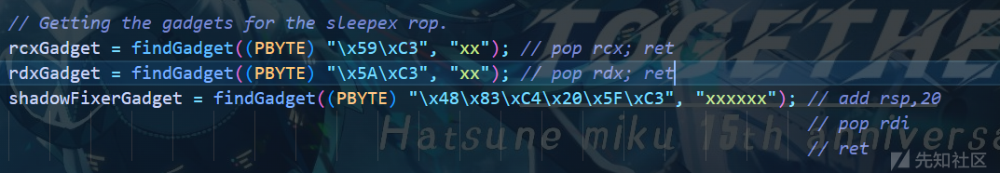

同样通过Ntcontinue切换上下文

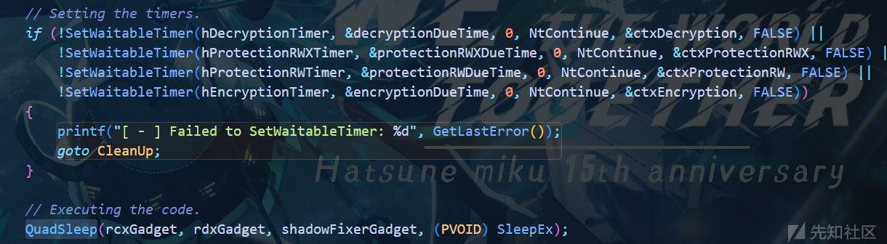

QuadSleep纯汇编实现

rcx: pop rcx; ret

rdx: pop rdx; ret

r8: add rsp,20; pop rdi; ret

r9: SleepEx

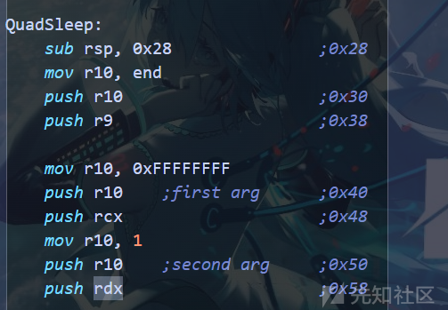

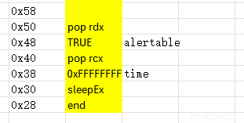

调用SleepEx从而APC

修改内存属性为RW -> 加密 -> 解密 -> 修改内存属性为RWX

# 检测

## Hunt-Sleeping-Beacons

具体WorkFactory相关知识可以参考

<https://urien.gitbook.io/diago-lima/a-deep-dive-into-exploiting-windows-thread-pools/attacking-worker-factories>

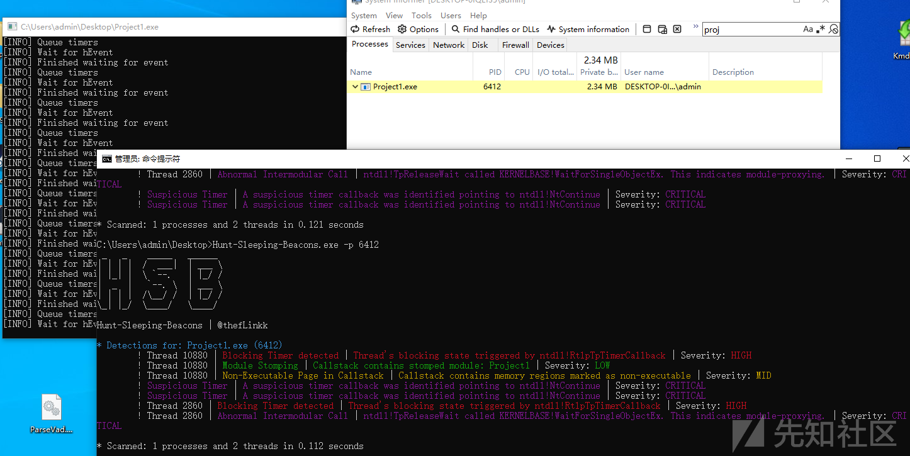

直接跟进process\_scanner::scan\_processes

对传进来的process数组进行扫描 具体的扫描行为定义在

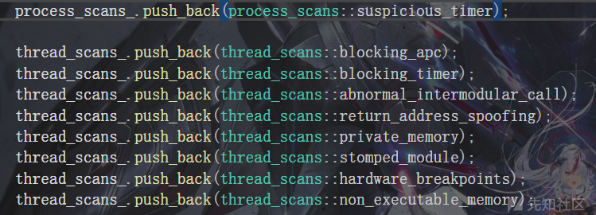

### suspicious\_timer

通过NtQuerySystemInformation 查询进程句柄信息 获取所有WorkerFactory

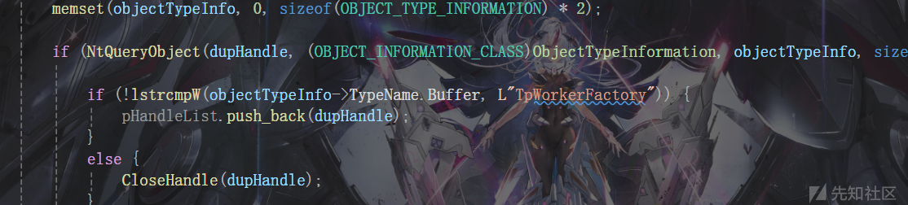

每个WorkerFactory都有对应的StartRoutine 由其创建的工作线程执行

通过NtQueryInformationWorkerFactory 可以查询StartRoutine

这里通过该API查询 获得StartParameter 一个指向 TP\_POOL的指针

TimerQueue就处于这个结构中

```
typedef struct _FULL_TP_POOL
 {
     struct _TPP_REFCOUNT Refcount;
     long Padding_239;
     union _TPP_POOL_QUEUE_STATE QueueState;
     struct _TPP_QUEUE* TaskQueue[3];
     struct _TPP_NUMA_NODE* NumaNode;
     struct _GROUP_AFFINITY* ProximityInfo;
     void* WorkerFactory;
     void* CompletionPort;
     struct _RTL_SRWLOCK Lock;
     struct _LIST_ENTRY PoolObjectList;
     struct _LIST_ENTRY WorkerList;
     struct _TPP_TIMER_QUEUE TimerQueue;
     struct _RTL_SRWLOCK ShutdownLock;
     UINT8 ShutdownInitiated;
     UINT8 Released;
     UINT16 PoolFlags;
     long Padding_240;
     struct _LIST_ENTRY PoolLinks;
     struct _TPP_CALLER AllocCaller;
     struct _TPP_CALLER ReleaseCaller;
     volatile INT32 AvailableWorkerCount;
     volatile INT32 LongRunningWorkerCount;
     UINT32 LastProcCount;
     volatile INT32 NodeStatus;
     volatile INT32 BindingCount;
     UINT32 CallbackChecksDisabled : 1;
     UINT32 TrimTarget : 11;
     UINT32 TrimmedThrdCount : 11;
     UINT32 SelectedCpuSetCount;
     long Padding_241;
     struct _RTL_CONDITION_VARIABLE TrimComplete;
     struct _LIST_ENTRY TrimmedWorkerList;
 } FULL_TP_POOL, * PFULL_TP_POOL;
```

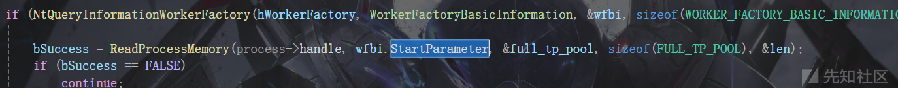

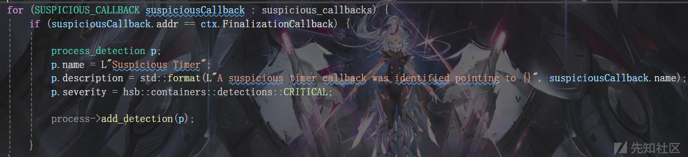

通过判断函数地址 以确认是否恶意

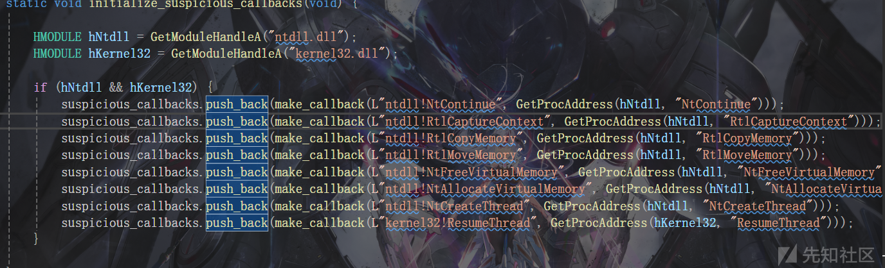

### blocking\_apc

遍历堆栈 检查是否调用了KiUserApcDispatcher

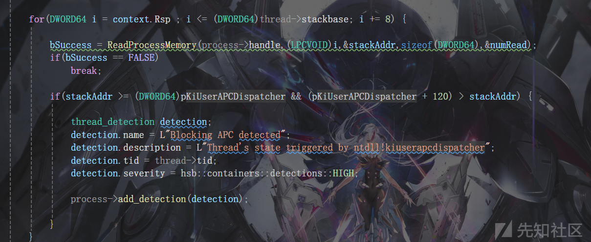

### blocking\_timer

遍历堆栈，检查是否调用了 RtlpTpTimerCallback

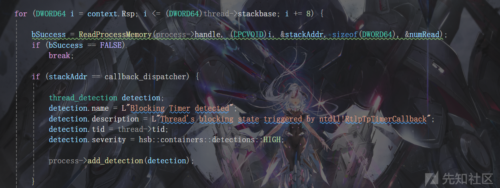

### abnormal\_intermodular\_call

检测异常调用堆栈 通过判断kernelbase或kernel32 是否是由ntdll调用过来的 以决定是否恶意

因为正常情况下是不存在这种调用的

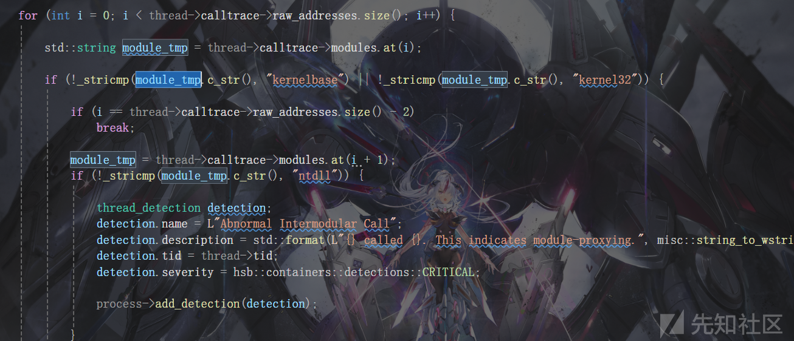

### return\_address\_spoofing

检测返回地址是否为 jmp rbx, jmp rbp等

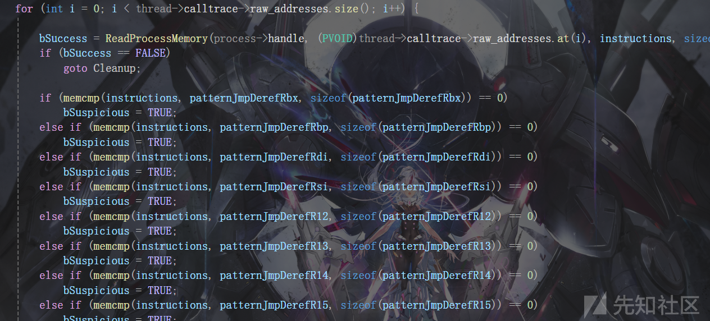

### stomped\_module

遍历调用堆栈 判断其返回地址的模块是否是原始共享模块(即未被修改) 来判断是否恶意 (一些关键dll不在此列)

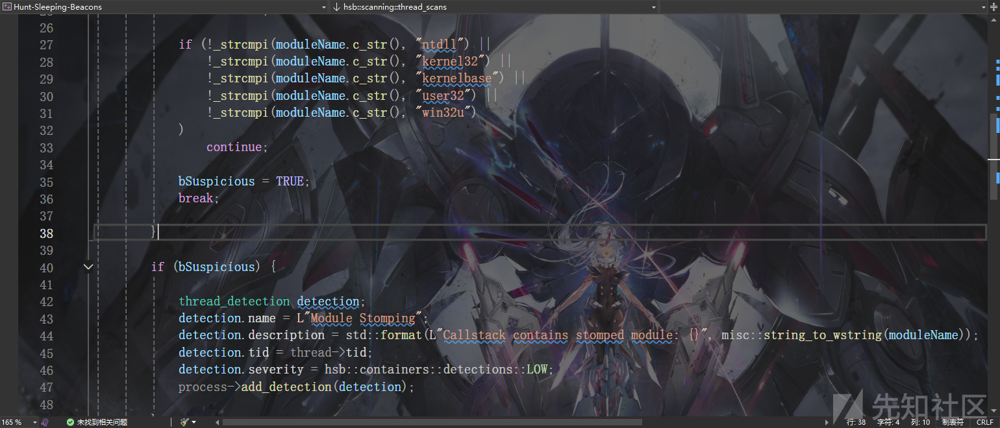

### hardware\_breakpoints

检测DR0-3 DR7 从而判断是否启用了硬件断点 以判断是否恶意

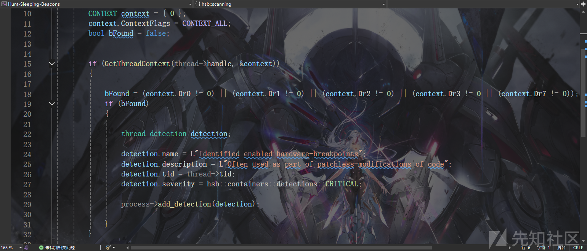

### non\_executable\_memory

判断地址是否没有任一 执行权限 PAGE\_EXECUTE | PAGE\_EXECUTE\_READ | PAGE\_EXECUTE\_READWRITE | PAGE\_EXECUTE\_WRITECOPY

调用堆栈中的地址没有执行权限 这是不正常的

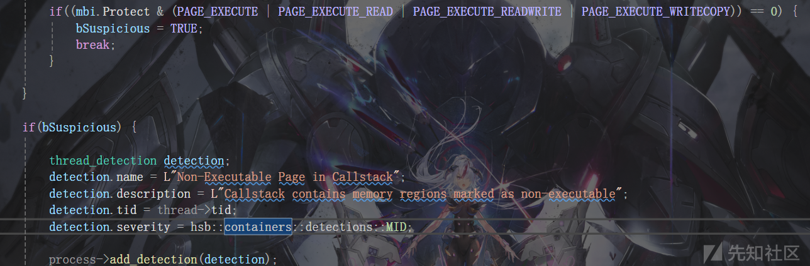

## EtwTi-FluctuationMonitor

<https://github.com/jdu2600/EtwTi-FluctuationMonitor>

Black hat ASIA 2023 You Can Run, but You Can't Hide - Finding the Footprints of Hidden Shellcode 提到

一块内存反复的修改权限 是不正常的 可以设置一个阈值 当该内存修改次数达到阈值时告警

通过订阅Microsoft-Windows-Threat-Intelligence的KERNEL\_THREATINT\_KEYWORD\_PROTECTVM\_LOCAL

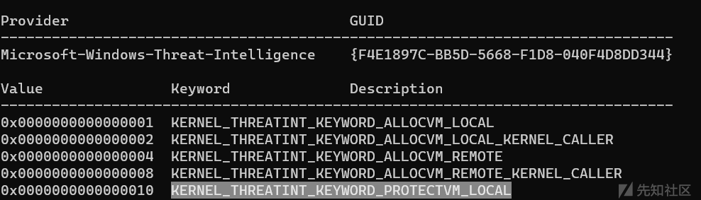

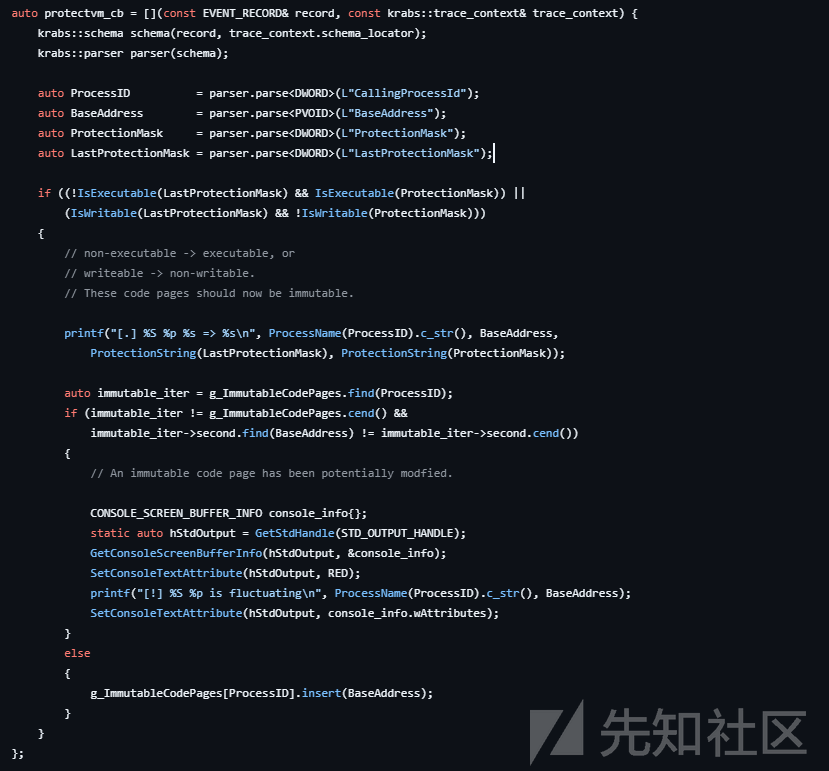

设置回调 判断是否是第一次发生权限变化

变化后插入g\_ImmutableCodePages 即标记为不可变

如果后续发生变化 且是不可变的 则输出...is fluctuating 也就是说这里的阈值是1
