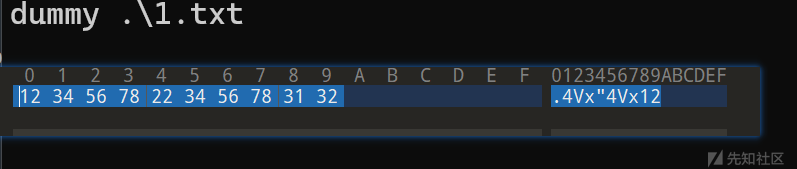
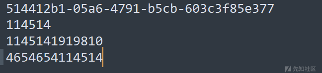
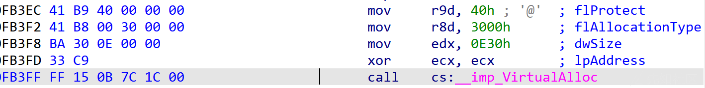
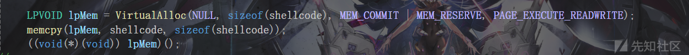
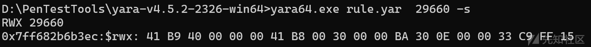
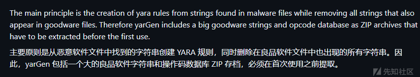
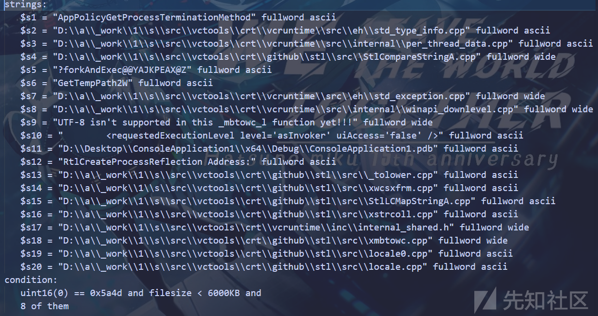

# YARA规则编写与实战-先知社区

> **来源**: https://xz.aliyun.com/news/17520  
> **文章ID**: 17520

---

# 从零到一掌握yara规则编写

YARA是一种恶意软件模式匹配的工具 可以根据二进制 文本进行模式匹配

<https://github.com/VirusTotal/yara>

## 规则

每条规则都必须有一个名称和条件

一个最简规则如下

```
rule dummy {
         condition: true
 }
```

条件condition 是一个关键字 条件部分必须包含一个布尔表达式 说明在何种情况下满足规则

在这里也就是无论如何 满足规则

运行YARA规则

yara rule.yar dir

常用参数如下

-r 递归

-s 输出匹配到的字符串

-X 输出xor key

-p 多线程

-c 只输出匹配数量

## Meta

元数据 一般用于标注作者、版本号、描述、哈希等附加信息，不会影响规则的匹配逻辑

```
rule dummy {
  
     meta:
         a = 123456
         b = 123
     condition: true
         
 }
```

## 字符串匹配

### string

我们感兴趣的字符串 文件或程序中搜索特定的文本或十六进制

每个字符串由一个 $和具体的值构成

$后可不跟具体名称

#### 文本字符串

大小写敏感的普通字符串 可以通过修饰符来调整匹配行为 比如大小写不敏感nocase

这里引入一些匿名字符串使用的规则

all of them 可以指代以上所有条件

1 of them 代表其中一个

none of them 一个也不

```
rule dummy {
  
     strings: 
         $ = "aaa"
         $ = "AAA"
 
     condition: all of them 
         
 }
```

和这个是一样的

```
rule dummy {
  
     strings: 
         $a = "aaa" nocase
         
     condition: $a 
         
 }
```

wide 修饰符用于匹配宽字符

xor 修饰符用于匹配进行1字节异或的字符串变体

base64 字面意思 自持自定义表 如 base64("ZYXABCDEFGHIJKLMNOPQRSTUVWzyxabcdefghijklmnopqrstuvw0123456789+/")

#### 十六进制

两种表示形式

```
$ = "\x12\x34"
 $ = {12 34}
```

支持通配符

```
rule dummy {
  
     strings: 
         $hex1 = {12 34 56}
         $hex2 = {12 ?4 ?6}
 
     condition: $hex1 and $hex2 
         
 }
```

支持非操作~ 在此代第二个字节不是0?

```
rule dummy {
  
     strings: 
         $hex1 = {12 ~0? 56}
 
     condition: $hex1
         
 }
```

支持变长匹配 可以使用[x-y]匹配 当x=y时 等效多个??

```
rule dummy {
  
     strings: 
         $hex1 = {12 34 [1-6] 31 32}
 
     condition: $hex1 
         
 }
```



支持条件字符串

```
rule dummy {
  
     strings: 
         $hex1 = {12 34 (11 | 45 14) 31 32}
 
     condition: $hex1 
         
 }
```

匹配 12 32 11 31 32 或 12 34 45 14 31 32

#### 正则

写在\ \之中

如下是一个匹配uuid的yara规则

```
rule dummy {
     strings:
         $uuid = /[0-9a-fA-F]{8}-[0-9a-fA-F]{4}-[0-9a-fA-F]{4}-[0-9a-fA-F]{4}-[0-9a-fA-F]{12}/
     
     condition: all of them
 }
```

## 条件

之前说条件部分必须包含一个布尔表达式 说明在何种情况下满足规则

也就是这里该支持的逻辑运算都支持 此外 yara还提供了一系列关键字

filesize 文件大小

entrypoint 入口点 高版本弃用 等价的是pe模块内的entry\_point

### of

至少满足n个 在指定的字符集中

```
rule dummy {
 
     strings:
         $a = "a"
         $b = "b"
         $c = "c"
 
     condition:
         2 of ($a,$b,$c)
 }
```

上文提到的匿名字符串 其中

them 等价 ($\*)

any 等价 1

none 等价 0

### for

for of 是针对字符串的

语法如下for 表达式 of 字符集: ( 逻辑表达式 )

any of them 的本质是 for any of ($\*) : ($)

for in 语法类似for each 针对数组使用

比如这个例子 这里利用自带的console库进行输出



```
import "console"
 
 rule a{
     strings:
         $a = "114514"
 
     condition:    
         for all i in (1..3) : ( console.log(@a[i]))
 
 
 }
```


### 取值

可以通过 intxx uintxx 来读取指定偏移的值 我们通过一个例子说明

```
rule pefile {
 
     condition: 
         uint16be(0) == 0x4d5a and uint32(uint32(0x3c)) == 0x4550 
                 
 }
```

xx代表位数 支持 8 16 32

be代表大端序 默认小段序

这里也可以是虚拟地址

```
rule testRule{
     condition:    uint16be(0x7ffe0006) == 0xa00f 
 }
```

### 举例

现在我们编写一个扫描申请了RWX内存的yara规则

首先编译一个申请RWX内存的程序 ida反编译



这里我们只关心flProtectPAGE\_EXECUTE\_READWRITE 0x40

对应yara规则如下

```
rule RWX {
 
     strings:
 // .text:00000001400FB3EC 41 B9 40 00 00 00                       mov     r9d, 40h ; '@'  ; flProtect        ;4
 // .text:00000001400FB3F2 41 B8 00 30 00 00                       mov     r8d, 3000h      ; flAllocationType ;4
 // .text:00000001400FB3F8 BA 30 0E 00 00                          mov     edx, 0E30h      ; dwSize           ;8
 // .text:00000001400FB3FD 33 C9                                   xor     ecx, ecx        ; lpAddress        ;8
 // .text:00000001400FB3FF FF 15 0B 7C 1C 00                       call    cs:__imp_VirtualAlloc        
         $rwx = {41b940000000 41b8 [4 - 24] ff15}
 
 
     condition:
         uint16be(0) == 0x4d5a and uint32(uint32(0x3c)) == 0x4550 and $rwx 
 }
```




这里只考虑了64位的情况 32位的话一样的流程改改就行

内存扫描的话把判断pe的条件去了就行



## 模块使用

yara提供了许多内置的模块 方便用户编写规则

这里直接提供几个案例来说明

是否利用了SystemFunction032 或 SystemFunction032 进行rc4加解密

```
import "pe"
 
 rule RC4 {
 
     condition:
         pe.imports("Advapi32.dll","SystemFunction032") or
         pe.imports("Advapi32.dll","SystemFunction033")
 
 }
```

任一段熵值过高

```
import "pe"
 import "math"
 
 rule entropy{
 
     condition:    
         for any section in pe.sections : ( 
             math.entropy(section.raw_data_offset,section.raw_data_size) >= 7.0
         )
 
 
 }
```

无签名

```
import "pe"
 
 rule signatures{
 
     condition:    
         pe.number_of_signatures == 0
 
 
 }
```

# yara-python

官方提供的库 用于python调用yara

通过yara.compile编译yara规则

通过yara.match匹配到具体的文件或进程

需要指定一个回调 当匹配上时 会调用回调

```
def cb(data):
   print(data)
   return yara.CALLBACK_CONTINUE
```

CALLBACK\_CONTINUE 表示继续搜索

CALLBACK\_ABORT 表示终止

下面我们编写一个脚本 扫描指定进程 如果存在申请rwx权限内存的 进行kill

```
rule RWX {
 
     strings:
 // .text:00000001400FB3EC 41 B9 40 00 00 00                       mov     r9d, 40h ; '@'  ; flProtect        ;4
 // .text:00000001400FB3F2 41 B8 00 30 00 00                       mov     r8d, 3000h      ; flAllocationType ;4
 // .text:00000001400FB3F8 BA 30 0E 00 00                          mov     edx, 0E30h      ; dwSize           ;8
 // .text:00000001400FB3FD 33 C9                                   xor     ecx, ecx        ; lpAddress        ;8
 // .text:00000001400FB3FF FF 15 0B 7C 1C 00                       call    cs:__imp_VirtualAlloc        
         $rwx = {41b940000000 41b8 [4 - 24] ff15}
 
 
     condition:
          $rwx 
 }
```

```
import yara
 import psutil
 
 def getPidbyName(target_name):
     for proc in psutil.process_iter(attrs=['pid', 'name']):
         try:
             if proc.info['name'] == target_name:
                 return proc.info['pid']
         except (psutil.NoSuchProcess, psutil.AccessDenied, psutil.ZombieProcess):
             continue
     return None
 
 pid = getPidbyName("ConsoleApplication1.exe")
 
 
 def cb(data):
     if data.get('matches'):
         print(f"rule match: {data['rule']}")
         
         try:
             proc = psutil.Process(pid)
             proc.terminate()
             print(f"terminate {pid}")
         except Exception:
             print("wrong!")
 
         
         return yara.CALLBACK_ABORT 
     return yara.CALLBACK_CONTINUE
 
 rules = yara.compile(filepath='./rule.yar')
 rules.match(pid=pid, callback=cb, which_callbacks=yara.CALLBACK_MATCHES)
```

这里只是举例说明 yara-python库的用法

# yarGen

yaraGen是一款用于生成yara规则的工具



简单的一个样例如下 排除良心字符串

python yarGen.py -m sus --excludegood -o rule.yar

这里随便找了一个样本



从生成的规则中我们可以看出一点规避方式

完全规避crt的使用 删pdb
