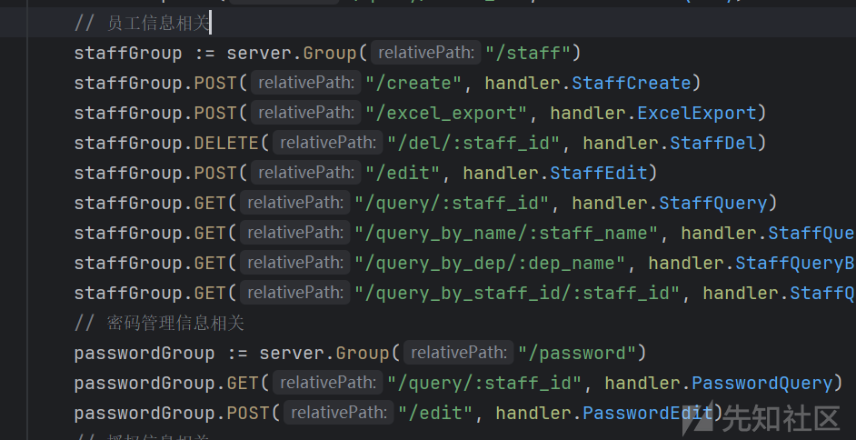
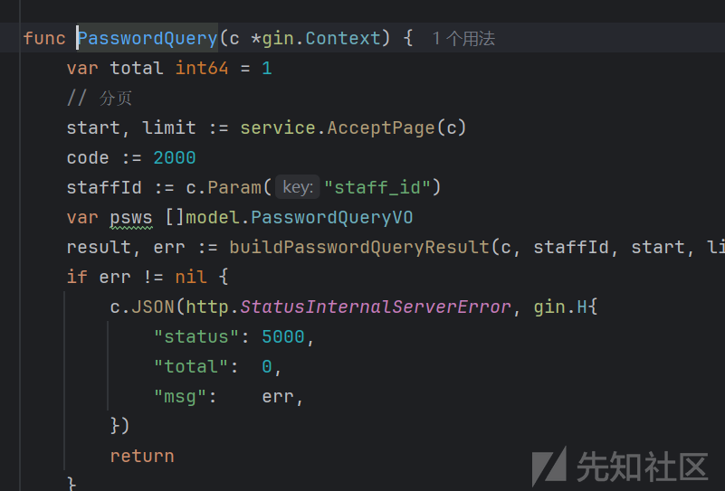
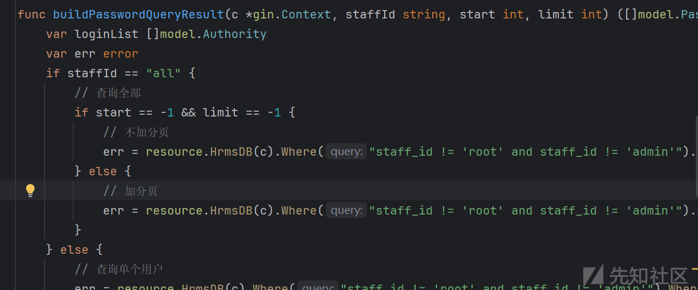
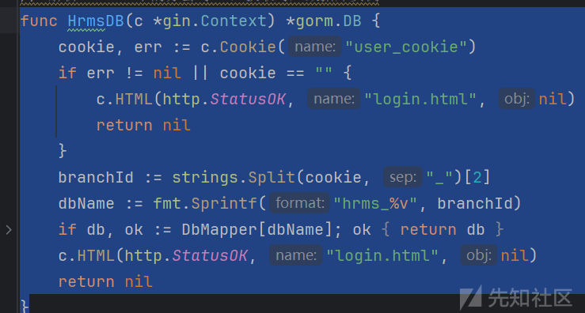
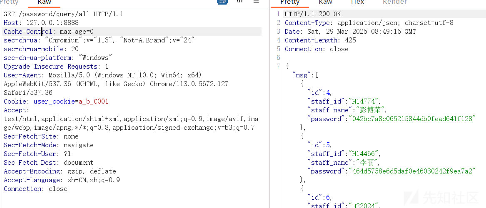
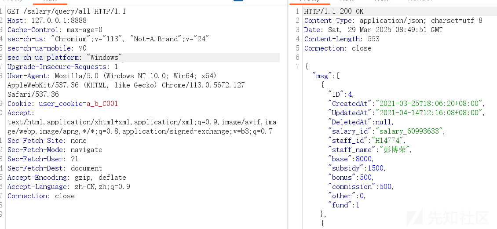
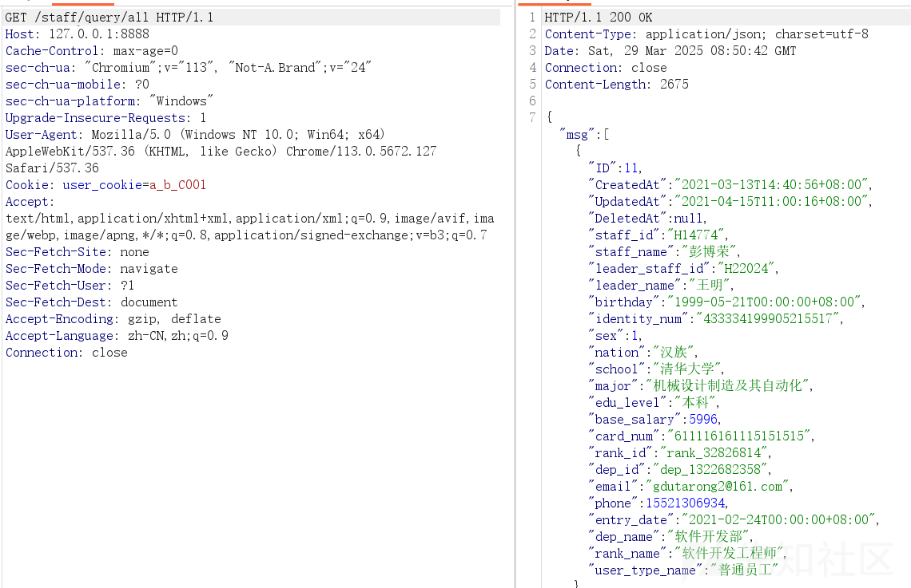
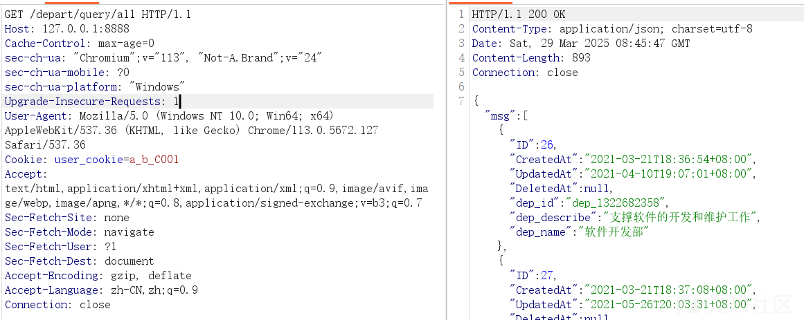

# go语言代码审计之hrms未授权漏洞分析-先知社区

> **来源**: https://xz.aliyun.com/news/17535  
> **文章ID**: 17535

---

# 漏洞介绍

hrms中存在未授权获取用户信息漏洞，该漏洞是由于系统在数据库查询时权限验证存在缺陷，攻击者通过构造 cookies 绕过权限验证，从而造成未经授权访问漏洞。

# 漏洞分析

首先在main.go中找到用户信息以及密码相关的路由，



这里主要看密码管理相关的查询路由，也就是`passwordGroup.GET("/query/:staff_id", handler.PasswordQuery)`这个路由，跟进到`handler.PasswordQuery`方法。



代码如下：

```
func PasswordQuery(c *gin.Context) {
    var total int64 = 1
    // 分页
    start, limit := service.AcceptPage(c)
    code := 2000
    staffId := c.Param("staff_id")
    var psws []model.PasswordQueryVO
    result, err := buildPasswordQueryResult(c, staffId, start, limit)
    if err != nil {
        c.JSON(http.StatusInternalServerError, gin.H{
            "status": 5000,
            "total":  0,
            "msg":    err,
        })
        return
    }
    // 总记录数
    resource.HrmsDB(c).Where("staff_id != 'root' and staff_id != 'admin'").Model(&model.Staff{}).Count(&total)
    psws = result
    c.JSON(http.StatusOK, gin.H{
        "status": code,
        "total":  total,
        "msg":    psws,
    })
}
```

可以看到其获取了staff\_id参数，并又使用了`buildPasswordQueryResult`方法对其进行了处理，并返回了一些数据，继续跟进到`buildPasswordQueryResult`方法中。



这个方法是一个数据库查询的方法，如果`staffId`为all，则通过用户验证后，直接获取非管理员用户的账号以及密码信息，并返回。

该漏洞的漏洞点主要位于HrmsDB方法里的cookie的验证中。



```
func HrmsDB(c *gin.Context) *gorm.DB {
    cookie, err := c.Cookie("user_cookie")
    if err != nil || cookie == "" {
        c.HTML(http.StatusOK, "login.html", nil)
        return nil
    }
    branchId := strings.Split(cookie, "_")[2]
    dbName := fmt.Sprintf("hrms_%v", branchId)
    if db, ok := DbMapper[dbName]; ok {
        return db
    }
    c.HTML(http.StatusOK, "login.html", nil)
    return nil
}
```

这段代码首先获取了`user_cookie`，再取出\_分割的第三个部分做为`branchId`，然后将`branchId`与`hrms_`相结合组成数据库名称，然后再判断该数据库是否存在，如果存在则返回数据库。

这段代码中只进行了cookie中的数据库信息的验证，并没有进行用户验证，因此导致漏洞的产生，并且只要使用了这个`HrmsDB`进行数据库验证的方法都存在该漏洞，比如员工信息查询，以及账户信息查询，和部门信息查询等都存在该漏洞。

# 漏洞验证

只需要构造一个由`_`分隔，并且第三个数组为数据库名称的的user\_cookie即可

例如`a_b_C001`与`a_b_C002`等

账号密码查询:



薪资查询:



员工信息查询：



部门信息查询：



以及其他使用该数据库查询方法的方法都会造成该漏洞。
