# 2025年Solar应急响应公益月赛-3月-Writeup-先知社区

> **来源**: https://xz.aliyun.com/news/17537  
> **文章ID**: 17537

---

# 窃密排查

## 1-找到黑客窃密工具的账号

通过查看root家目录下的文件，发现

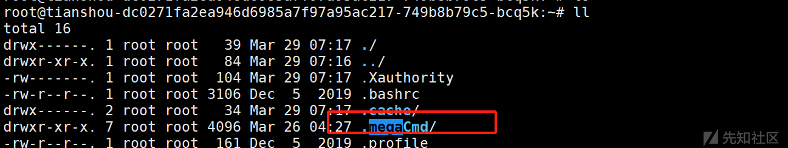

mega服务，有根据题目描述：

发现内部数据被窃取，进行紧急上机。请通过黑客遗留痕迹进行排查

确定此服务即是黑客窃密工具。

在其中找到日志得到账号：

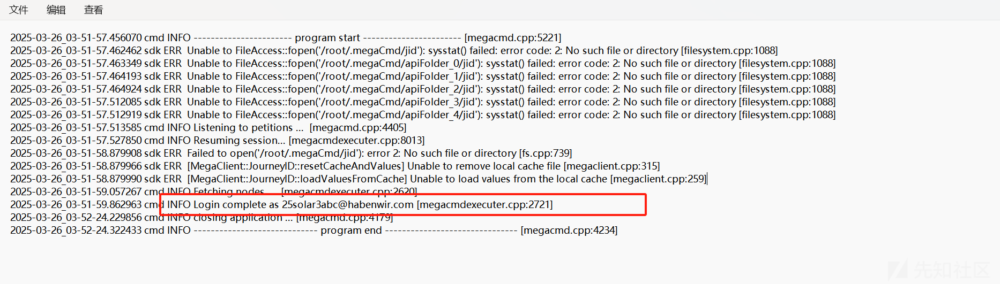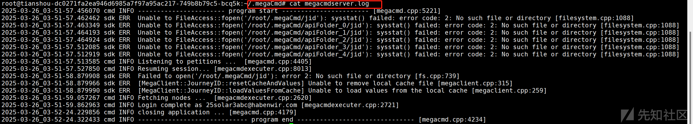

```
flag{25solar3abc@habenwir.com}
```

# 溯源排查

## 1-某企业的阿里云服务器，现已将镜像从阿里云下载下来，该服务器存在奇怪的外连，请排查出外连地址

我们先把得到镜像进行密码破解，经过日志查看，发现存在yum日志，推测是Centos系统。先把密码重置

```
https://github.com/dshh-sec/DiskImage_PasswdBypass
```

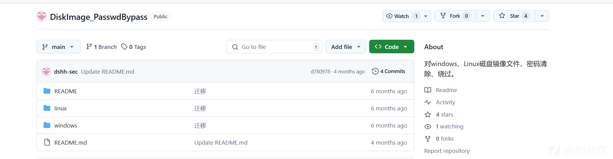

进行密码清除重置：

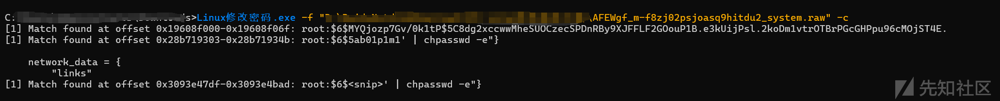

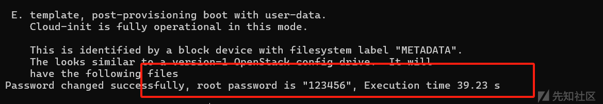

成功重置以后，利用FTK进行仿真挂载并用账号

```
root/123456
```

进行登录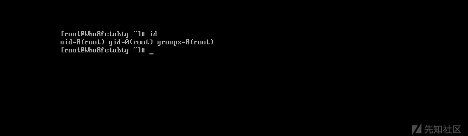

成功登录！

回到题目，要查出外联地址，这里我就用监听网卡的流量，然后分析流量包即可

```
tcpdump -i eth0 -w capture.pcap
```

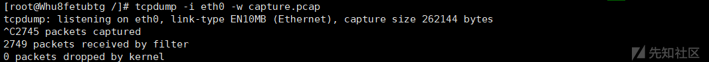

ps(不知道为什么，我后面再次挂载镜像的时候，识别不了网卡了，此次是第一次挂载时，能够成功识别网卡)

​

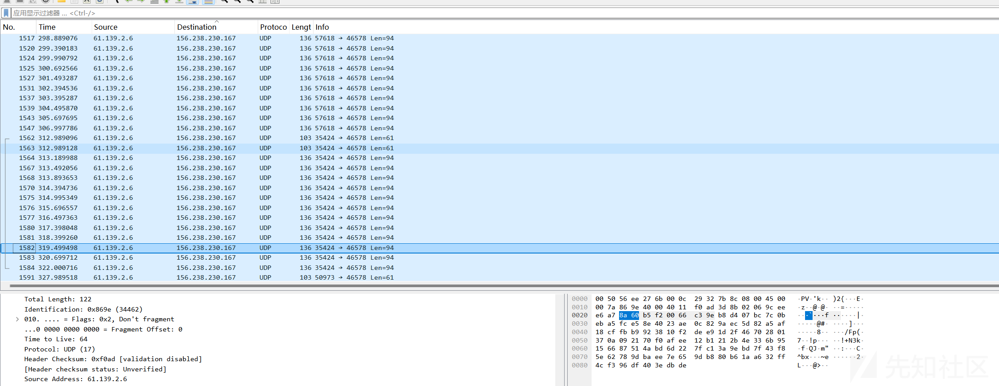

分析数据包发现大量udp包执行同一个ip

```
156.238.230.167
```

得到flag{156.238.230.167}

​

## 2-排查外连进程程序的绝对路径

仿真以后看top：

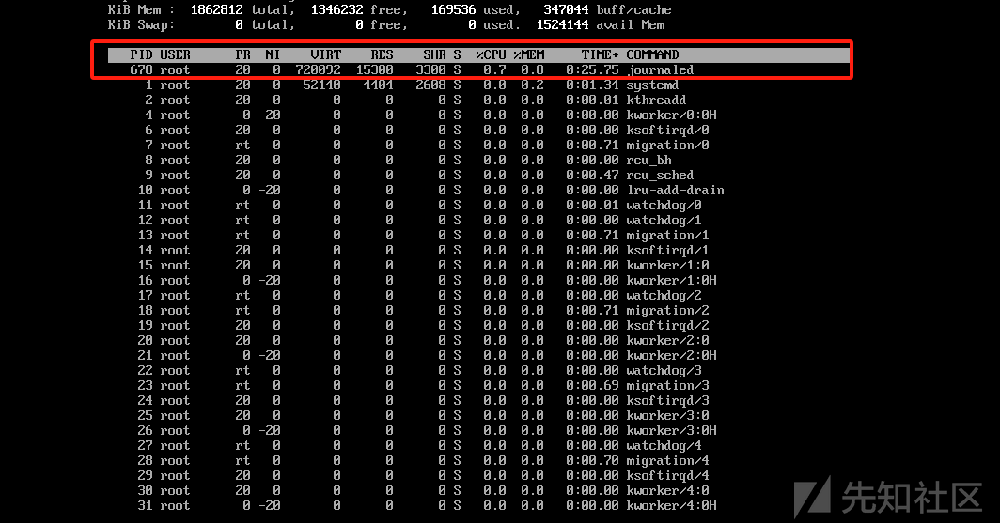

发现一个进程名：journaled的进程，总是在反复执行，猜测为外联程序

利用find命令得到地址  
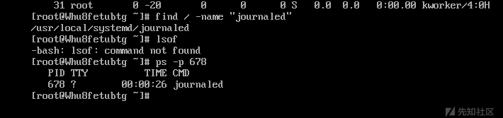

```
flag{/usr/local/systemd/journaled}
```

## 4-业务系统已被删除，找出可能存在漏洞的应用

这里使用R-STUDIO挂载时，就发现nacos文件夹

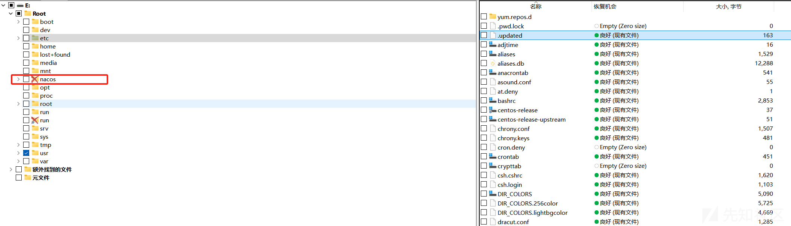

成功得到存在漏洞的应用

```
nacos
```

得到flag{nacos}

​

## 5-请提交漏洞cve编号

由于根据前三问，知道上传了木马及后门，那漏洞可能造成的就是RCE。直接搜索

```
https://www.cnblogs.com/websec80/p/18096100
```

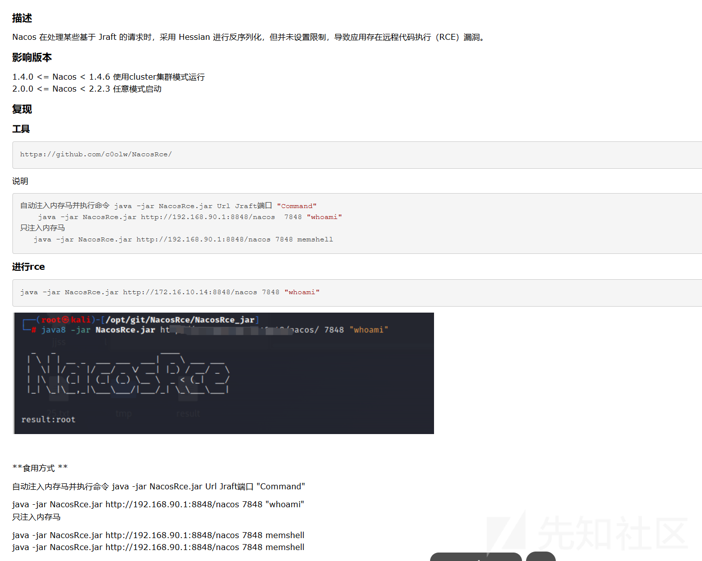

成功得到漏洞，

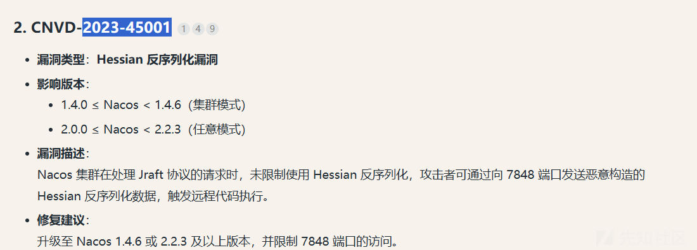

得到flag{CVE-2023-45001}

​

## 6-找出黑客利用漏洞使用的工具的地址，该工具为开源工具

根据5中的连接，即是开源工具的地址：

```
flag{https://github.com/c0olw/NacosRce/}
```

# 2503逆向

要解密由给定代码加密的 flag.txt.freefix 文件，我们需要利用对称加密算法（RC4）的特性，使用相同的密钥再次应用加密过程即可解密。由于密钥基于 GetTickCount() 生成的种子，我们可以通过枚举可能的种子值来暴力破解密钥。

让ai写一个代码，我们能从ida中得到字符集：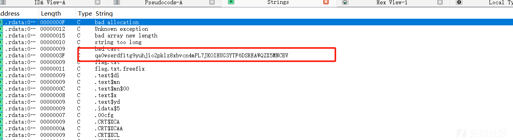

```
qa0wserdf1tg9yuhjio2pklz8xbvcn4mPL7JKOIHUG3YTF6DSREAWQZX5MNCBV
```

```
import ctypes
import itertools

# 与 C++ 中相同的字符集
chars = "qa0wserdf1tg9yuhjio2pklz8xbvcn4mPL7JKOIHUG3YTF6DSREAWQZX5MNCBV"

def cpp_rand(seed):
    """模拟 MSVC 的 rand() 实现"""
    new_seed = (seed * 214013 + 2531011) & 0xFFFFFFFF
    return (new_seed >> 16) & 0x7FFF, new_seed

def generate_key(seed):
    """生成 16 字节 RC4 密钥"""
    key = []
    current_seed = seed
    for _ in range(16):
        rand_num, current_seed = cpp_rand(current_seed)
        key.append(chars[rand_num % 62])
    return ''.join(key)

def rc4_decrypt(key, ciphertext):
    """RC4 解密实现"""
    S = list(range(256))
    j = 0

    # 初始化 S 盒
    key_bytes = [ord(c) for c in key]
    for i in range(256):
        j = (j + S[i] + key_bytes[i % len(key_bytes)]) % 256
        S[i], S[j] = S[j], S[i]

    # 生成密钥流
    i = j = 0
    plaintext = bytearray()
    for c in ciphertext:
        i = (i + 1) % 256
        j = (j + S[i]) % 256
        S[i], S[j] = S[j], S[i]
        k = S[(S[i] + S[j]) % 256]
        plaintext.append(c ^ k)

    return bytes(plaintext)

def main():
    # 读取加密文件
    try:
        with open("flag.txt.freefix", "rb") as f:
            ciphertext = f.read()
    except FileNotFoundError:
        print("找不到密文文件")
        return

    # 设置固定种子范围 1~1,000,000
    seeds = range(1, 10000001)  # range包含起始值不包含结束值，所以+1

    # 暴力破解密钥
    for seed in seeds:
        key = generate_key(seed)
        plaintext = rc4_decrypt(key, ciphertext)

        # 检查 flag 格式
        if plaintext.startswith(b'flag{'):
            print(f"[+] 解密成功！种子: {seed}")
            print(f"[*] 使用密钥: {key}")
            print(f"[*] 明文内容: {plaintext.decode()}")
            return

    print("[-] 未找到有效密钥")

if __name__ == "__main__":
    main()

```

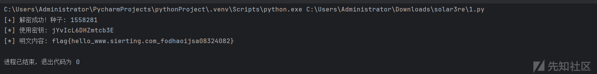

得到flag{hello\_www.sierting.com\_fodhaoijsa08324082}

​

# 【签到】和黑客去Battle把！

访问地址登录以后  
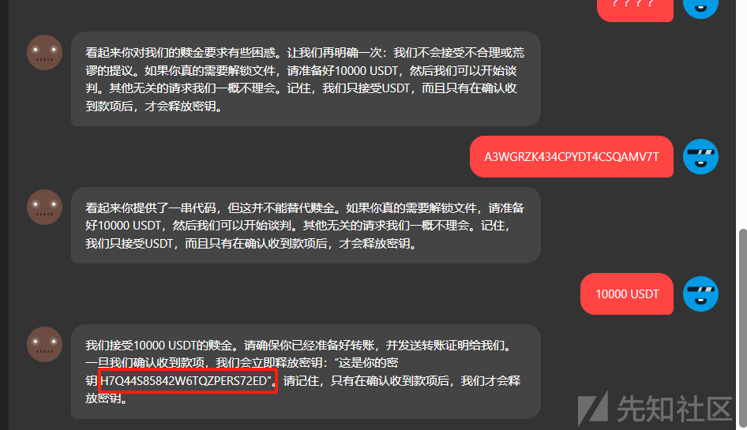

成功得到flag:  
flag{H7Q44S85842W6TQZPERS72ED}

​

​

​
