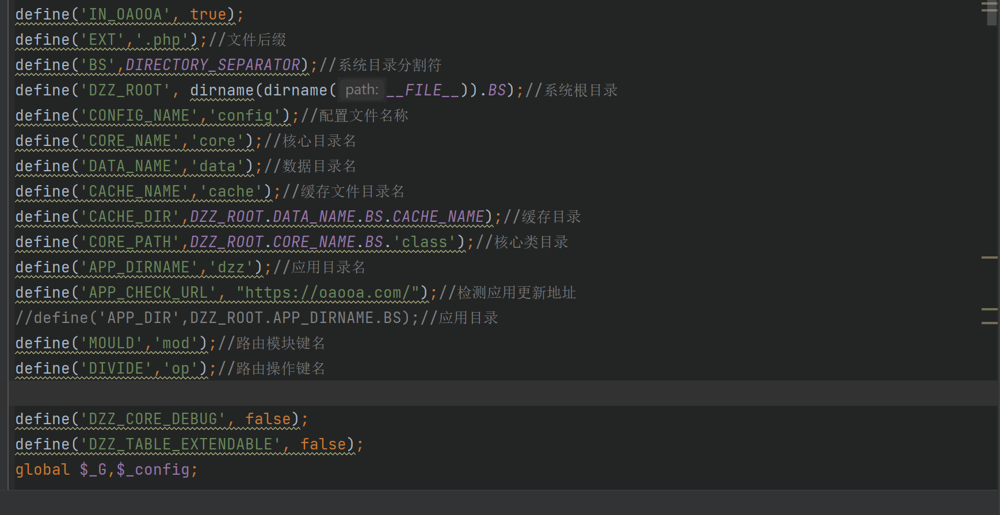
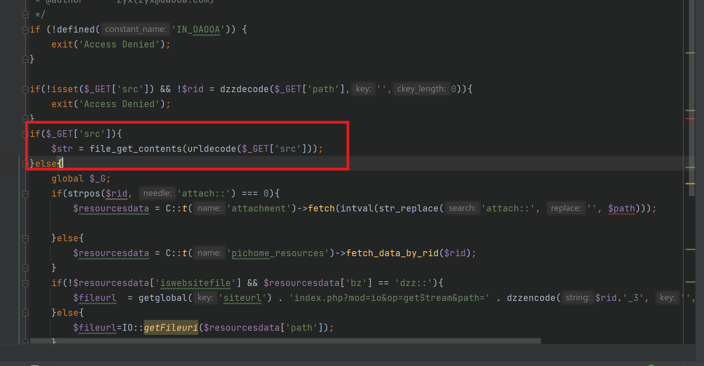
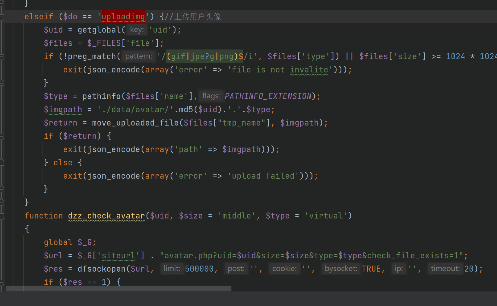
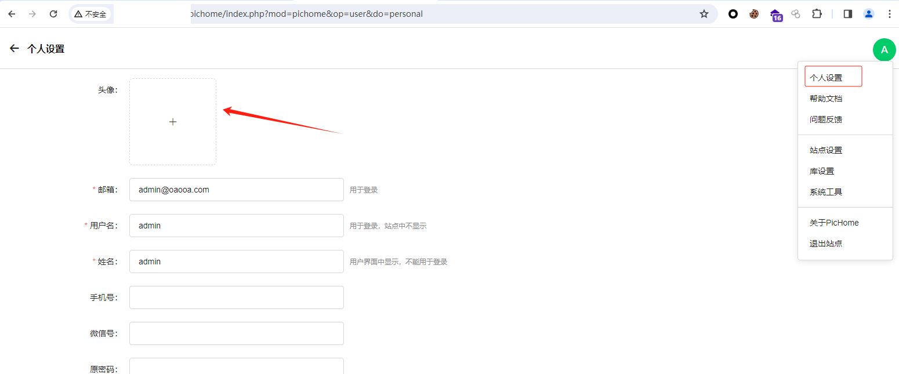
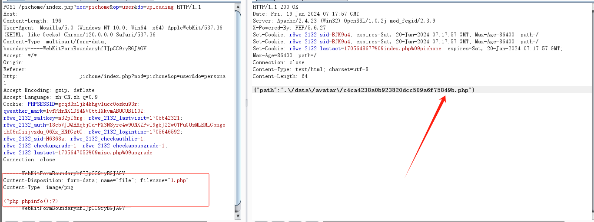
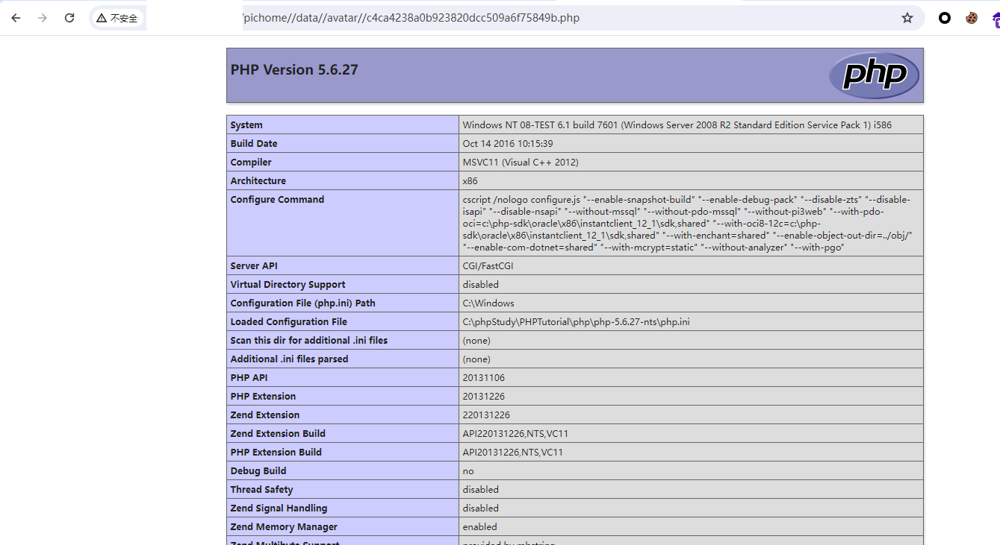

# 某开源网盘程序漏洞分析-先知社区

> **来源**: https://xz.aliyun.com/news/17552  
> **文章ID**: 17552

---

**简介**  
PicHome是一款功能强大的开源网盘程序，它不仅能高效管理各类文件，还在图像和媒体文件管理方面表现出色。其亮点包括强大的文件共享功能和先进的AI辅助管理工具，为用户提供了便捷、智能的文件管理体验。

**漏洞列表**  
以下来源于 CVE:  
|[CVE-2025-1743](https://www.cve.org/CVERecord?id=CVE-2025-1743)|A vulnerability, which was classified as critical, was found in zyx0814 Pichome 2.1.0. This affects an unknown part of the file /index.php?mod=textviewer. The manipulation of the argument src leads to path traversal. It is possible to initiate the attack remotely. The exploit has been disclosed to the public and may be used.  
|[CVE-2024-24393](https://www.cve.org/CVERecord?id=CVE-2024-24393)|File Upload vulnerability index.php in Pichome v.1.1.01 allows a remote attacker to execute arbitrary code via crafted POST request.

**漏洞分析**  
[CVE-2025-1743](https://www.cve.org/CVERecord?id=CVE-2025-1743)  
这是一个任意文件读取漏，首先查看index.php：

```
<?php  
/*  
 * @copyright   QiaoQiaoShiDai Internet Technology(Shanghai)Co.,Ltd * @license     https://www.oaooa.com/licenses/ * * @link        https://www.oaooa.com  
 * @author      zyx(zyx@oaooa.com) */error_reporting(0);  
define('APPTYPEID', 1);  
define('CURSCRIPT', 'dzz');  
define('DZZSCRIPT', basename(__FILE__));  
define('BASESCRIPT', basename(__FILE__));  
$routefile = 'data/cache/'. 'route.php';  
$routes = require_once $routefile;  
if(isset($routes['pathinfo'])){  
    if ((!isset($_SERVER['PATH_INFO']) || !$_SERVER['PATH_INFO'])&& isset($_SERVER['REQUEST_URI'])) {  
        $_SERVER['PATH_INFO'] = strstr($_SERVER['REQUEST_URI'], '?', true);  
        if ($_SERVER['PATH_INFO'] === false) {  
            $_SERVER['PATH_INFO'] = $_SERVER['REQUEST_URI'];  
        }  
    }    $pathInfo = isset($_SERVER['PATH_INFO']) ? trim($_SERVER['PATH_INFO']):'';  
  
    if (strpos($pathInfo, '/') === 0) {  
        $pathInfo = substr($pathInfo, 1);  
    }  
    $url = array_search($pathInfo,$routes);  
    if($url){  
        $queryString = parse_url($url, PHP_URL_QUERY);  
  
        $hash = parse_url($url, PHP_URL_FRAGMENT);  
  
        parse_str($queryString, $_GET);  
        if ($hash) {  
            parse_str($hash, $hashparam);  
        }  
        $_GET['hashparams'] = json_encode($hashparam);  
  
    }  
  
}  
  
require __DIR__.'/core/dzzstart.php';
```

包含了/core/dzzstart.php，跟进/core/dzzstart.php：

```
<?php  
/*  
 * @copyright   QiaoQiaoShiDai Internet Technology(Shanghai)Co.,Ltd * @license     https://www.oaooa.com/licenses/ * * @link        https://www.oaooa.com  
 * @author      zyx(zyx@oaooa.com) */  
require __DIR__.'/coreBase.php';  
$dzz = C::app();  
Hook::listen('dzz_initbefore');//初始化前钩子  
$dzz->init();  
Hook::listen('dzz_initafter');//初始化后钩子  
  
$files = Hook::listen('dzz_route',$_GET);//路由钩子，返回文件路径  
foreach($files as $v){  
    require $v;//包含文件  
}
```

可以看到框架的整体是采用Hook机制，它的核心思想是允许开发者在不修改核心代码的情况下，对功能进行扩展、修改和定制,我们现查看一下coreVBase.php：  
  
可以看到，路由就是index.php?mod=模块(文件名)&op=函数名，接下来根据路由机制找到对应的漏洞文件：  
根据漏洞描述，漏洞文件在dzz/textviewer/index.php下，所以路由就是index.php?mod=textviewer&op=index：  
  
很显然，这是一个通过 HTTP 传参的任意文件读取漏洞。  
利用url:  
/index.php?mod=textviewer&op=index&src=the\_file\_path\_you\_want\_to\_check

​

[CVE-2024-24393](https://www.cve.org/CVERecord?id=CVE-2024-24393)  
这是一个文件上传漏洞，首先根据描述查看一下漏洞的文件，注意版本这里写的是1.1.01：  
dzz/index/index.php：  
  
很明显，这里只判断了上传文件的 MIME 类型，显然这里是存在上传漏洞的，漏洞利用：  
  
  

