# 移动互联网（APP）安全积分争夺赛初赛writeup-先知社区

> **来源**: https://xz.aliyun.com/news/17556  
> **文章ID**: 17556

---

babyapk

# 题目考点

l 安卓逆向

l Xor

# 解题思路

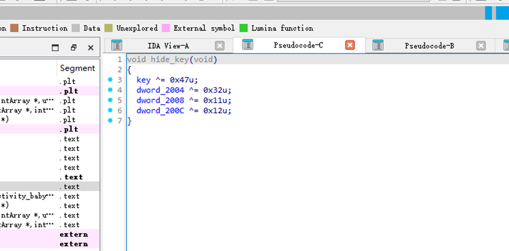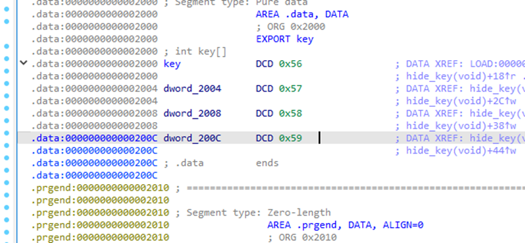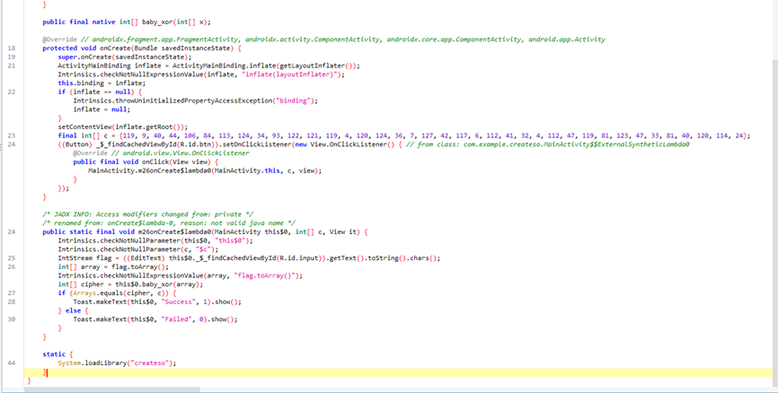从Android代码和补充的native库(反编译so文件)信息中，我们可以逆向推导出正确的flag

​

给出解题脚本：

```
c = [119, 9, 40, 44, 106, 84, 113, 124, 34, 93, 122, 121, 119, 4, 120, 124, 36, 7, 127, 42, 117, 6, 112, 41, 32, 4, 112, 47, 119, 81, 123, 47, 33, 81, 40, 120, 114, 24]

key = [0x11, 0x65, 0x49, 0x4B]
flag = []
for i in range(len(c)):
flag.append(c[i] ^ key[i % 4])

print(''.join([chr(x) for x in flag]))c = [119, 9, 40, 44, 106, 84, 113, 124, 34, 93, 122, 121, 119, 4, 120, 124, 36, 7, 127, 42, 117, 6, 112, 41, 32, 4, 112, 47, 119, 81, 123, 47, 33, 81, 40, 120, 114, 24]

key = [0x11, 0x65, 0x49, 0x4B]
flag = []
for i in range(len(c)):
flag.append(c[i] ^ key[i % 4])

print(''.join([chr(x) for x in flag]))
```

​

# FLAG

flag{1873832fa175b6adc9b1a9df42d04a3c}

​

Privacy Master（1）

# 题目考点

l 隐私合规

​

# 解题思路

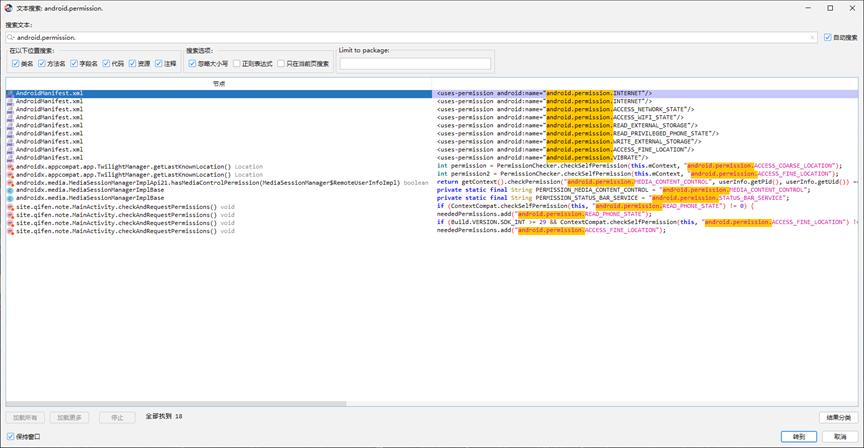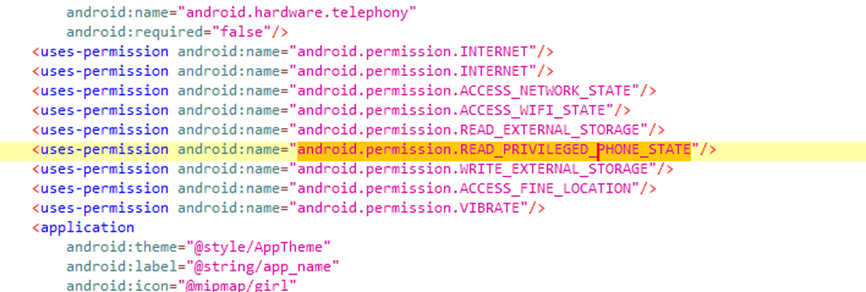根据提供的代码和最新Android版本（Android 13/API 33）的隐私合规要求，该APP存在以下非合规权限申请：

​

1. READ\_PHONE\_STATE

​- 在`MainActivity`的`checkAndRequestPermissions()`方法中直接请求，但未明确说明使用目的，且未提供替代方案（Android 10+限制该权限的访问）

​

2. ACCESS\_FINE\_LOCATION

​- 在`TwilightManager`中通过`getLastKnownLocation()`方法动态请求，但代码显示当定位权限未授予时会回退到硬编码时间（`hardcoded sunrise/sunset values`），说明定位功能非核心功能，但仍请求精确定位权限（Android 12+要求前台服务精确位置权限需单独声明）

​

3. POST\_NOTIFICATIONS

​- 在`checkSelfPermission()`方法中检测到该权限的特殊处理（`Build.VERSION.SDK\_INT < 33`的兼容性判断），但未遵循Android 13的通知权限运行时请求规范

​

按照请求顺序和代码逻辑，非合规权限为：

READ\_PHONE\_STATE, ACCESS\_FINE\_LOCATION

# FLAG

READ\_PHONE\_STATE, ACCESS\_FINE\_LOCATION

​

Goodluck

# 题目考点

l Md5

​

# 解题思路

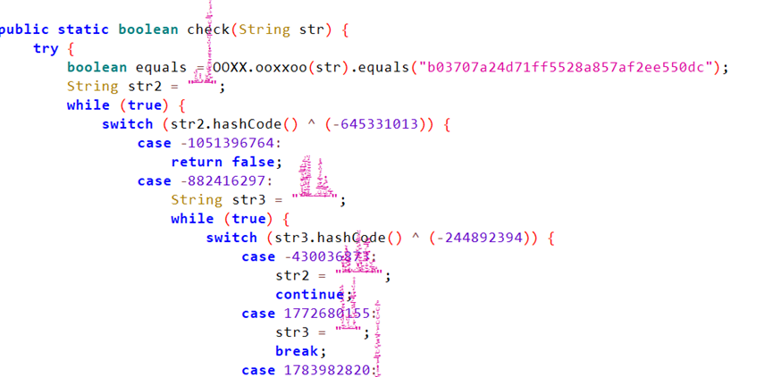看到是Hash值，猜测是md5加密，直接解密即可：

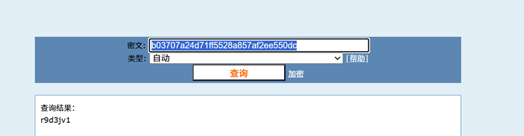

# FLAG

Flag{r9d3jv1}

​

Ezenc

# 题目考点

l 傅里叶变换

# 解题思路

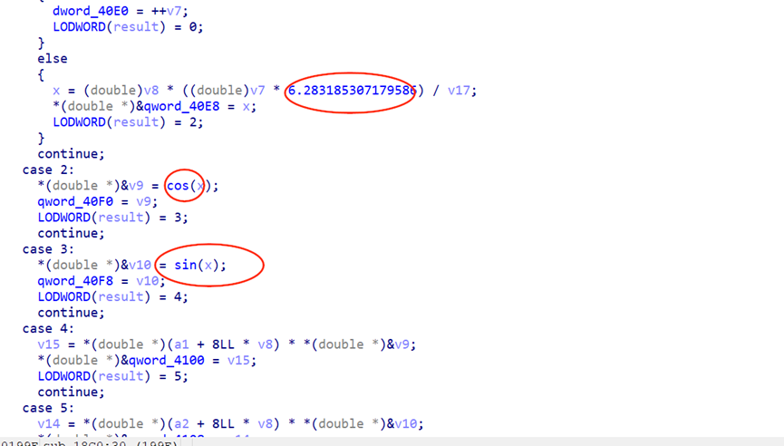主要是傅里叶变化：

```
import struct
import numpy as np
import math

enc = [
    0x00, 0x00, 0x00, 0x00, 0x00, 0x00, 0x00, 0x00, 0xEA, 0x5B,
    0xE6, 0x74, 0x59, 0x5A, 0x59, 0xC0, 0xF4, 0xDF, 0x83, 0xD7,
    0x2E, 0x5D, 0x13, 0x40, 0x68, 0xCC, 0x24, 0xEA, 0x05, 0x79,
    0x40, 0xC0, 0x40, 0xBD, 0x19, 0x35, 0x5F, 0x65, 0xF1, 0x3F,
    0xDB, 0xDF, 0xD9, 0x1E, 0xBD, 0x35, 0x4E, 0xC0, 0x57, 0x5E,
    0xF2, 0x3F, 0xF9, 0x8B, 0x38, 0xC0, 0x4A, 0x98, 0x69, 0xFB,
    0x57, 0x21, 0x63, 0x40, 0x54, 0x8C, 0xF3, 0x37, 0xA1, 0x1C,
    0x4B, 0x40, 0x35, 0xB3, 0x96, 0x02, 0xD2, 0x1E, 0x07, 0x40,
    0xFF, 0x3E, 0xE3, 0xC2, 0x01, 0x48, 0x64, 0x40, 0x00, 0x00,
    0x00, 0x00, 0x00, 0x00, 0x00, 0x80, 0xFF, 0x3E, 0xE3, 0xC2,
    0x01, 0x48, 0x64, 0xC0, 0x35, 0xB3, 0x96, 0x02, 0xD2, 0x1E,
    0x07, 0xC0, 0x54, 0x8C, 0xF3, 0x37, 0xA1, 0x1C, 0x4B, 0xC0,
    0x4A, 0x98, 0x69, 0xFB, 0x57, 0x21, 0x63, 0xC0, 0x57, 0x5E,
    0xF2, 0x3F, 0xF9, 0x8B, 0x38, 0x40, 0xDB, 0xDF, 0xD9, 0x1E,
    0xBD, 0x35, 0x4E, 0x40, 0x40, 0xBD, 0x19, 0x35, 0x5F, 0x65,
    0xF1, 0xBF, 0x68, 0xCC, 0x24, 0xEA, 0x05, 0x79, 0x40, 0x40,
    0xF4, 0xDF, 0x83, 0xD7, 0x2E, 0x5D, 0x13, 0xC0, 0xEA, 0x5B,
    0xE6, 0x74, 0x59, 0x5A, 0x59, 0x40
]

enc2 = [
    0x00, 0x00, 0x00, 0x00, 0x00, 0x8C, 0x9F, 0x40, 0x66, 0xC0,
    0x59, 0x4A, 0x16, 0x0F, 0x61, 0x40, 0xEE, 0xE8, 0x7F, 0xB9,
    0x16, 0x0D, 0x20, 0xC0, 0x4E, 0xD4, 0xD2, 0xDC, 0x0A, 0x99,
    0x59, 0xC0, 0xF5, 0xB8, 0x6F, 0xB5, 0x4E, 0xBA, 0x40, 0x40,
    0x6F, 0xF4, 0x31, 0x1F, 0x90, 0x16, 0x67, 0x40, 0x18, 0x3E,
    0x22, 0xA6, 0x44, 0xFE, 0x3D, 0x40, 0xDC, 0x9C, 0x4A, 0x06,
    0x80, 0xA5, 0x54, 0x40, 0x13, 0x7F, 0x14, 0x75, 0xE6, 0xFD,
    0x52, 0xC0, 0x12, 0xF8, 0xC3, 0xCF, 0x7F, 0x0F, 0xFA, 0x3F,
    0xB8, 0xAD, 0x2D, 0x3C, 0x2F, 0x5D, 0x5F, 0xC0, 0x00, 0x00,
    0x00, 0x00, 0x00, 0x40, 0x56, 0xC0, 0xB8, 0xAD, 0x2D, 0x3C,
    0x2F, 0x5D, 0x5F, 0xC0, 0x12, 0xF8, 0xC3, 0xCF, 0x7F, 0x0F,
    0xFA, 0x3F, 0x13, 0x7F, 0x14, 0x75, 0xE6, 0xFD, 0x52, 0xC0,
    0xDC, 0x9C, 0x4A, 0x06, 0x80, 0xA5, 0x54, 0x40, 0x18, 0x3E,
    0x22, 0xA6, 0x44, 0xFE, 0x3D, 0x40, 0x6F, 0xF4, 0x31, 0x1F,
    0x90, 0x16, 0x67, 0x40, 0xF5, 0xB8, 0x6F, 0xB5, 0x4E, 0xBA,
    0x40, 0x40, 0x4E, 0xD4, 0xD2, 0xDC, 0x0A, 0x99, 0x59, 0xC0,
    0xEE, 0xE8, 0x7F, 0xB9, 0x16, 0x0D, 0x20, 0xC0, 0x66, 0xC0,
    0x59, 0x4A, 0x16, 0x0F, 0x61, 0x40
]

def hex_to_float(enc):
    floats = []
    for i in range(0, len(enc), 8):
        byte_chunk = enc[i:i+8]
        packed = bytes(byte_chunk)
        float_value = struct.unpack('d', packed)[0]
        floats.append(float_value)
    return floats

def idct(x):
    result = []
    size = len(x)
    for i in range(size):
        sum = 0
        for j in range(size):
            v1 = math.cos((i + 0.5) * math.pi * j / size)
            if j == 0:
                v2 = math.sqrt(1 / size)
            else:
                v2 = math.sqrt(2 / size)
            v3 = x[j] * v2
            sum += v3 * v1
        result.append(sum)
    return result

float_values = hex_to_float(enc)
float_values2 = hex_to_float(enc2)
a3 = np.array(float_values)
a4 = np.array(float_values2)

def idft_from_real_imag(a3, a4):
    """
    从DFT的实部(a3)和虚部(a4)重构原始信号。
    :param a3: DFT输出的实部数组
    :param a4: DFT输出的虚部数组
    :return: 原始时域信号（实数部分，虚部应为0）
    """
    # 构造复数频域信号 X[k] = a3[k] + i*a4[k]
    X = np.array(a3) + 1j * np.array(a4)
    # 计算逆DFT
    x = np.fft.ifft(X)  # 使用快速傅里叶逆变换（IFFT）
    # IDFT结果可能有微小虚部（浮点误差），取实部
    x_real = np.real(x)
    return x_real

reconstructed_signal = idft_from_real_imag(a4, a3)
print(reconstructed_signal)
int_array = reconstructed_signal.astype(int)
print(int_array)
for i in int_array:
    print(chr(i), end='')

# 示例验证
original_signal = np.array([1.02, 2.03, 3.40, 4.60])
dft_result = np.fft.fft(original_signal)
print(dft_result)
a3 = np.real(dft_result)  # 实部
a4 = np.imag(dft_result)  # 虚部
reconstructed_signal = idft_from_real_imag(a3, a4)
print("原始信号:", original_signal)
print("重构信号:", reconstructed_signal)
```

最后的答案有点误差 筛选一下即可：

```
[101.99999982 108.00000004  96.99999992 102.99999987 123.00000003
 116.00000007 104.00000003  51.00000003  94.99999995  99.99999988
 102.00000015  55.          94.99999997  82.99999995  47.99999994
  95.00000005  51.00000003  97.00000006 115.00000008 121.00000007
  33.00000009 124.99999998]
[101 108  96 102 123 116 104  51  94  99 102  54  94  82  47  95  51  97
 115 121  33 124]
el`f{th3^cf6^R/_3asy!|[11.05+0.j   -2.38+2.57j -2.21+0.j   -2.38-2.57j] 
原始信号: [1.02 2.03 3.4  4.6 ]
重构信号: [1.02 2.03 3.4  4.6 ]
```

# FLAG

flag{th3\_df7\_S0\_3asy!}

​

​

偷天换日

# 题目考点

l 动态解密

l Rc4

​

​

# 解题思路 image.png

发现是动态解密cc.data 为dex 然后加载的

其中使用了rc4加密、

将cc.data解密后 用jadx分析

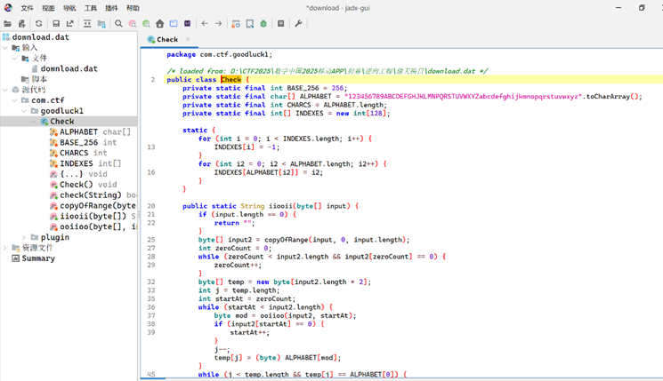  
Base58解密即可：  
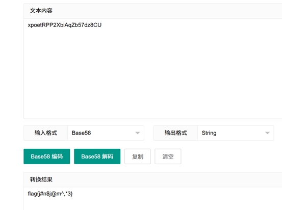

# FLAG

flag{j#n$j@m^,\*1}

​

Harmony

# 题目考点

l Abc反编译

l md5

​

​

# 解题思路

使用abc decompile逆向分析

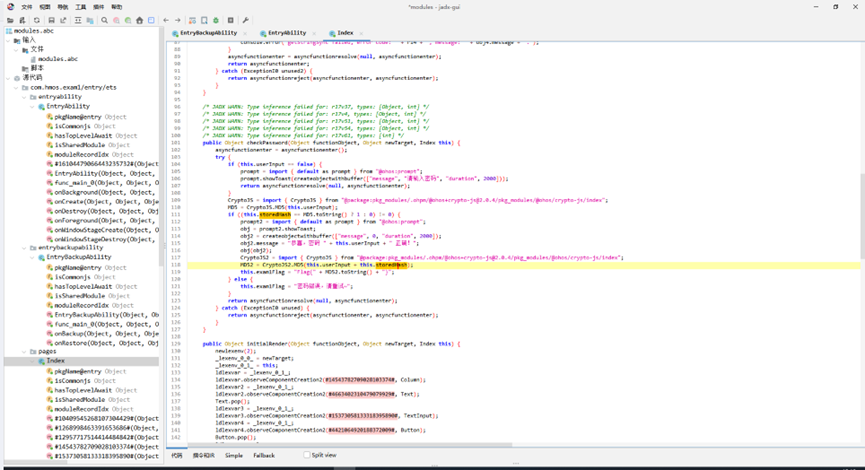

主要是从资源中获取hash值

然后与输入对比

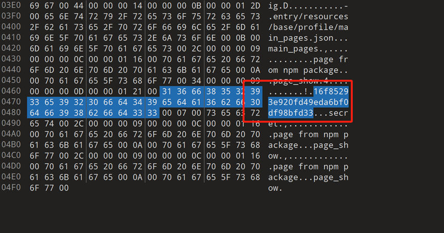

通过cmd5反查为goodgood

输入得到flag

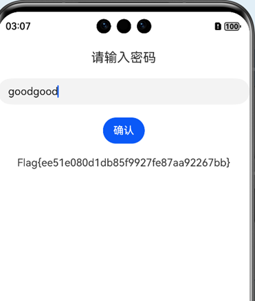

​

# FLAG

Flag{ee51e080d1db85f9927fe87aa92267bb}

​

​

这个木马在干啥

# 题目考点

l native

l AES

​

# 解题思路

写脚本 将native层其中的字符串解密

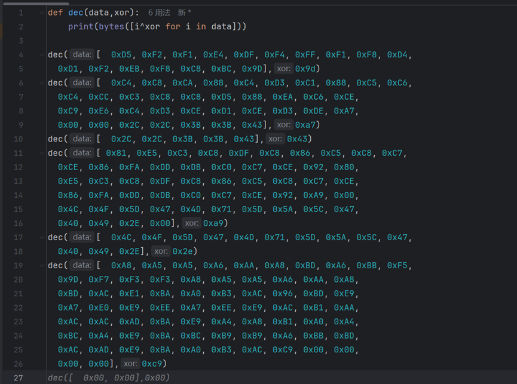

```
b'HolyBibleILoveU!\x00'
b'com/ctf/backdoor/MainActivity\x00\xa7\xa7\x8b\x8b\x9c\x9c\xe4'
b'ooxx\x00'
b'(Ljava/lang/String;)Ljava/lang/String;\x00\xa9\xe5\xe6\xf4\xee\xe4\xd8\xf4\xf3\xf5\xee\xe9\xe0\x87\xa9'
b'basic_string\x00'
b"allocator<T>::allocate(size_t n) 'n' exceeds maximum supported size\x00\xc9\xc9\xc9\xc9"
```

​

分析发现主要是采用了aes加密和base编码

解密即可

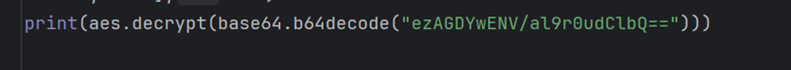

#返回的就是flag

```
b'HolyBibleILoveU!\x00'
b'com/ctf/backdoor/MainActivity\x00\xa7\xa7\x8b\x8b\x9c\x9c\xe4'
b'ooxx\x00'
b'(Ljava/lang/String;)Ljava/lang/String;\x00\xa9\xe5\xe6\xf4\xee\xe4\xd8\xf4\xf3\xf5\xee\xe9\xe0\x87\xa9'
b'basic_string\x00'
b"allocator<T>::allocate(size_t n) 'n' exceeds maximum supported size\x00\xc9\xc9\xc9\xc9"
b'flag{7$1%j&6gh2}'
b'flag{7$1%j&6gh4}'
```

​

​

IOSAPP

# 题目考点

l IOS

# 解题思路

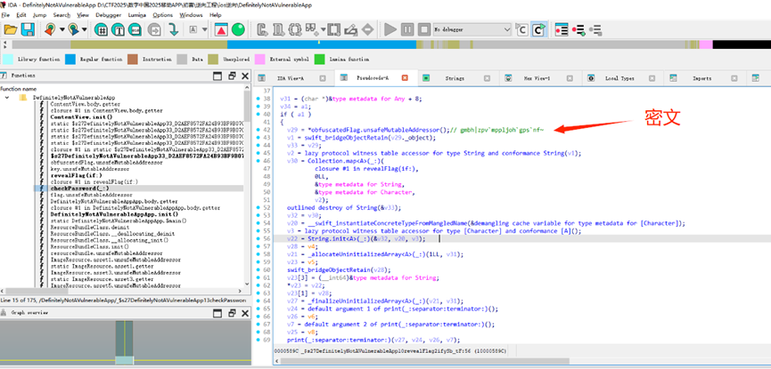-1即可：  
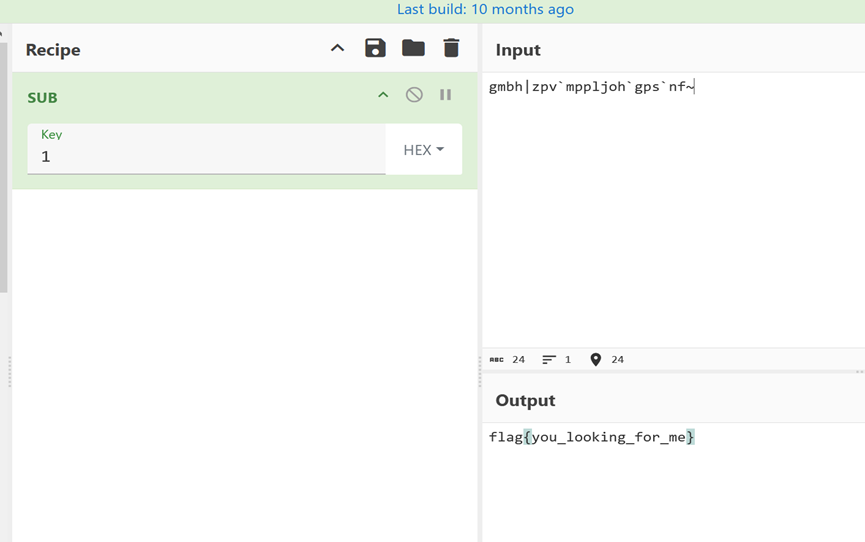

# FLAG

flag{you\_looking\_for\_me}

​
