# 深入Vite任意文件读取与分析复现-先知社区

> **来源**: https://xz.aliyun.com/news/17562  
> **文章ID**: 17562

---

# 环境搭建&漏洞复现

首先创建Vite项目

```
npm create vite@5.4.8 vitetest -- --template vue  
```

这次复现用的就是这个版本

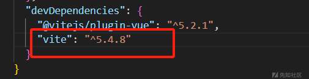

然后 进入项目

```
cd vitetest
```

安装相应环境

```
npm install
```

运行 即搭建成功

```
npm run dev
```

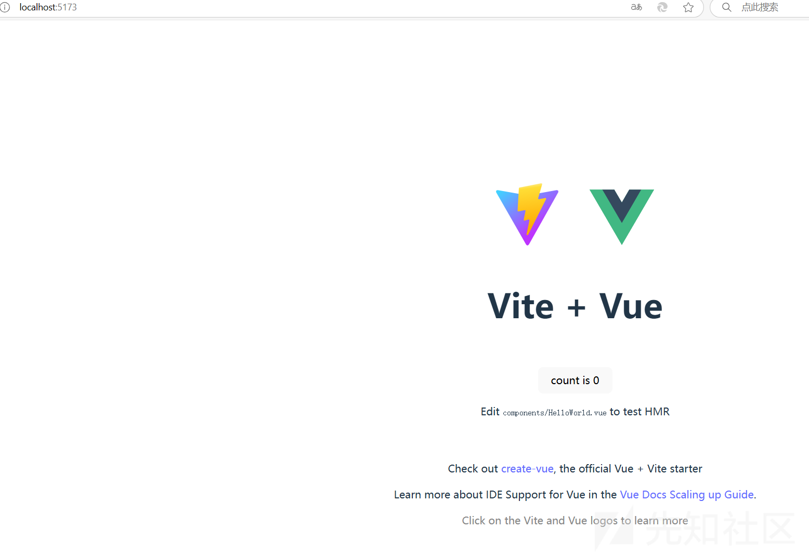

测试漏洞 两种payload都可

```
http://localhost:5173/C:/Windows/win.ini?import&raw??
```

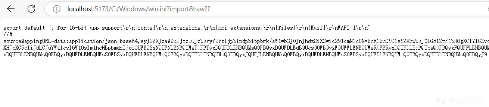

```
http://localhost:5173/@fs/C:/Windows/win.ini?import&raw??
```

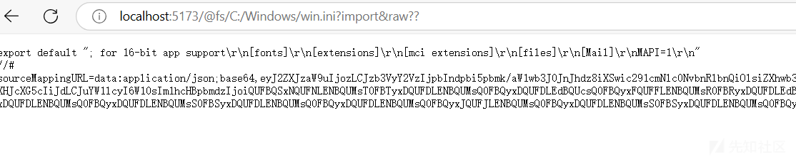

这两种都可以 因为处理的url的时候会自动删除 @fs所以这两个都可以

# 漏洞分析

在分析之前会讲解几个前置知识 以便大家更好的理解这个漏洞 并尝试站在发现者的角度来挖掘这个漏洞

​

我们要分析这个漏洞，首先要了解一下Vite的执行过程，要了解Vite执行过程就要找到Vite的入口，而cli.js就是Vite的入口，再具体一点createServer就是他的入口

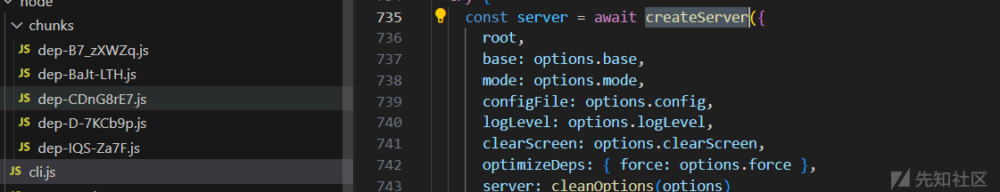

然后来分析一下createServer 在这个JS里面

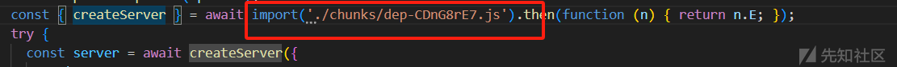

在这里定义 他调用了\_createServer

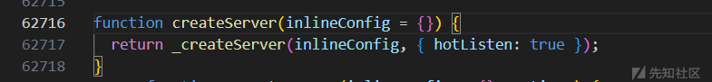

刚好在他的下面 这个函数很长 主要的功能就是 初始化服务器配置、注册中间件（Middleware）、处理热更新（HMR）、管理模块依赖图（Module Graph）等

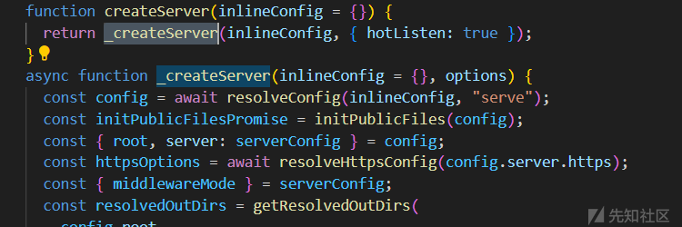

我们主要看的是注册中间件 这里注册了一个中间件集合

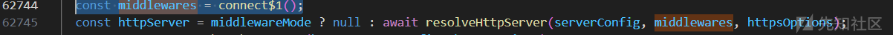

而这个集合是有顺序的 如下我们需要记住这个顺序

```
servePublicMiddleware->transformMiddleware->serveRawFsMiddleware->serveStaticMiddleware
```

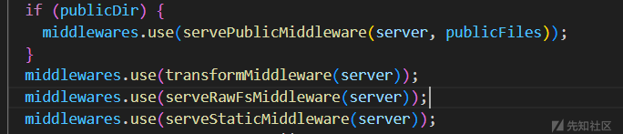

那么就先去servePublicMiddleware中间件看 我添加了这几个代码

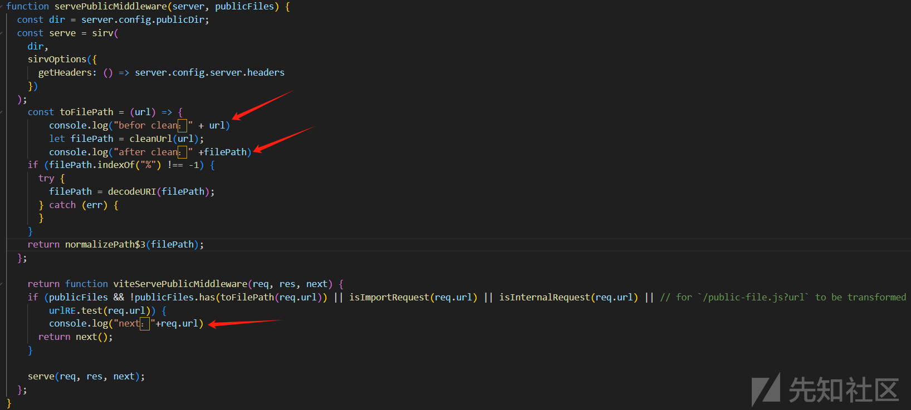

发现无论有没有cleanUrl 最终执行next的时候都是不变的 /C:/Windows/win.ini?import&raw?? 而这个next()其实就是去下一个中间件 所以刚刚记的顺序就有用了

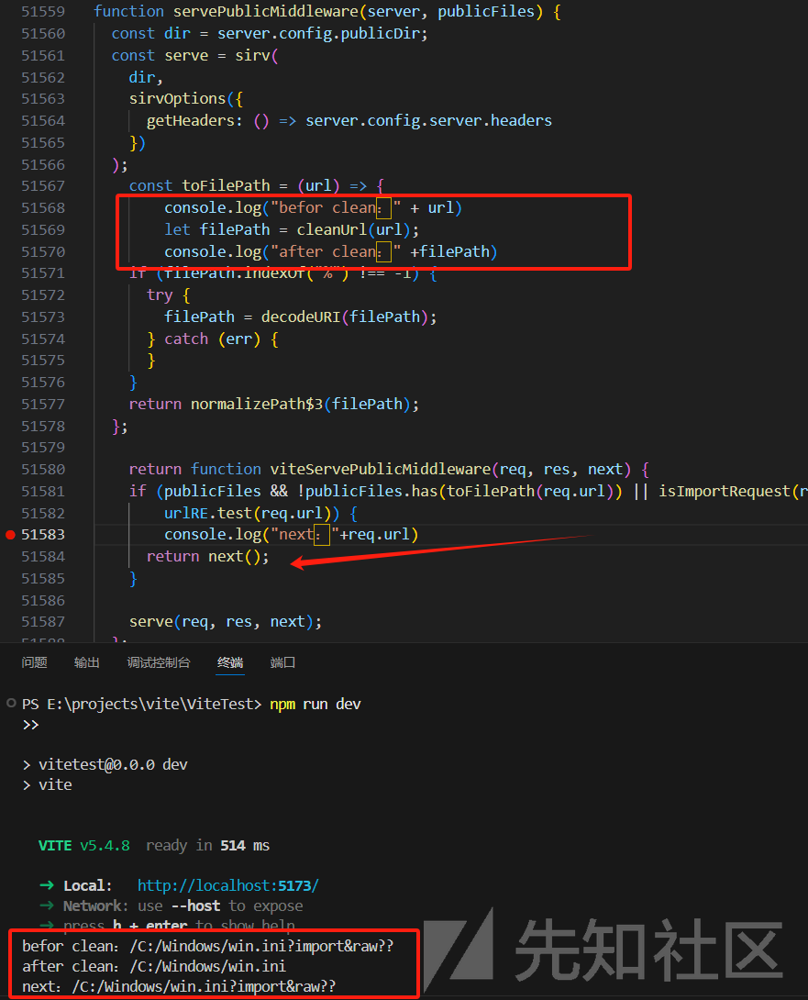

再执行以下错误的payload 发现也是去到了下一个中间件 说明servePublicMiddleware对于这个漏洞作用并不大

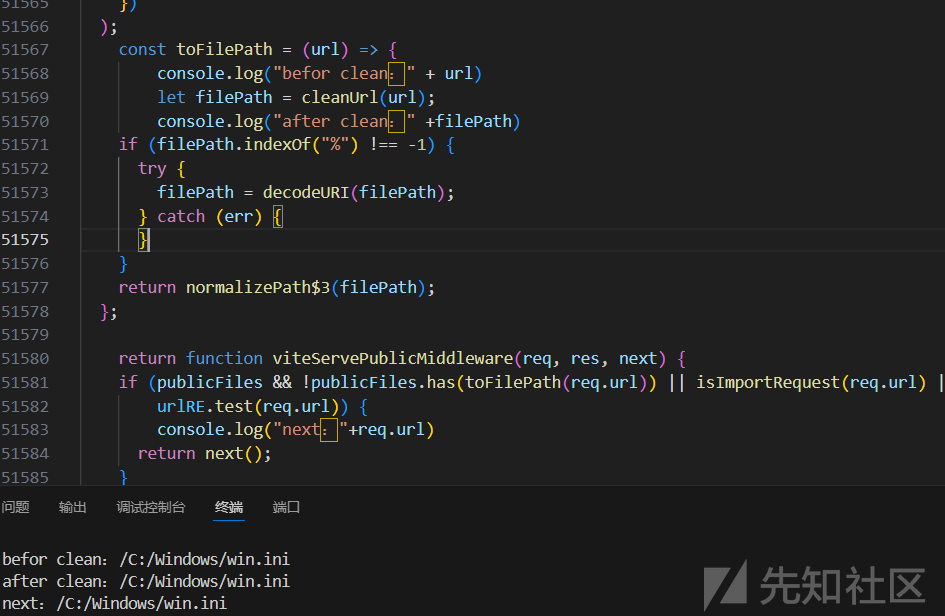

那么现在去看transformMiddleware 确实进入了这里

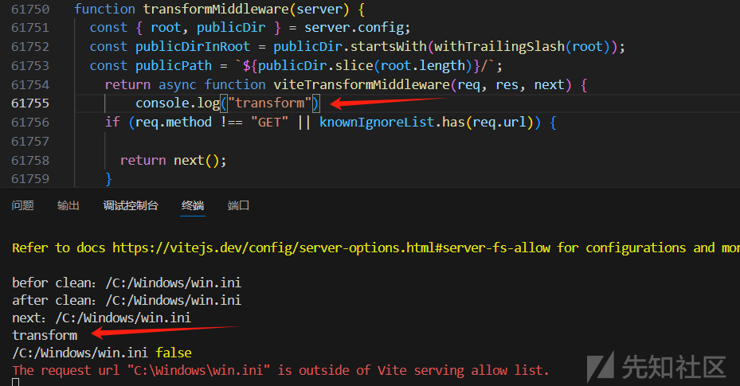我们来看这段代码

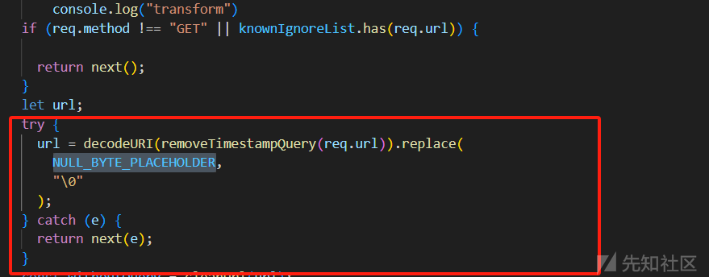

removeTimestampQuery顾名思义，从请求的 URL 中移除时间戳查询参数

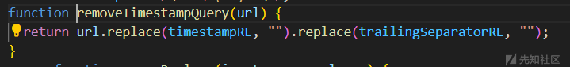

第一个replace即匹配形如t=1234567890123的字符串，后面可能跟着一个可选的&符号，也可能不跟

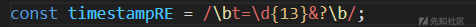

第二个replace即匹配结尾部分的&、? 有的则替换为空

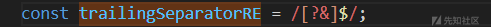

所以如果是http://example.com/path?t=1234567890123处理之后就只有http://example.com/path了，

如果是/C:/Windows/win.ini?import&raw??处理之后也就少了一个?变成了/C:/Windows/win.ini?import&raw?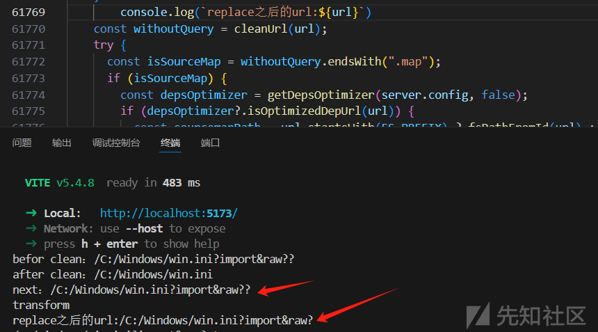

然后这部分就不用看了，他如果结尾是.map的话就无法造成任意文件读取了

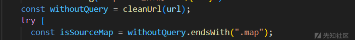

继续往下到上面那个try结束的位置 61816行 如果以public开头也就会进入warnAboutExplicitPublicPathInUrl

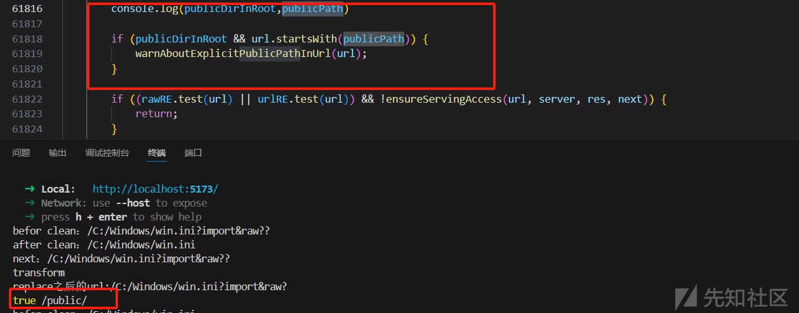

linux可能会有public文件夹，那么我们尝试一下进入这个函数

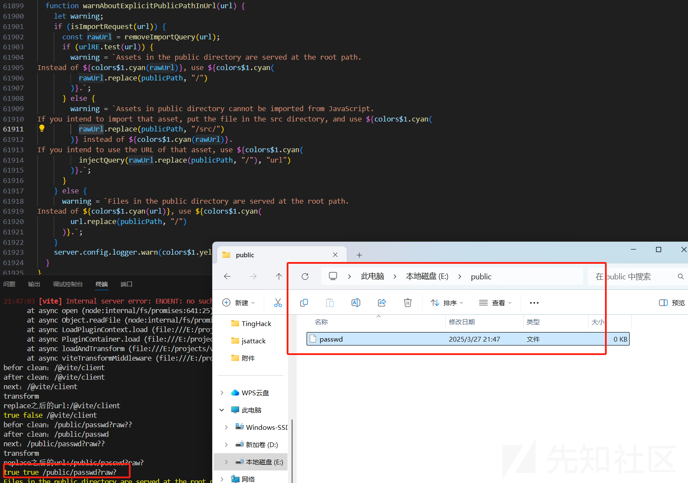

第一个判断 相关代码如下 也就是判断url里面是否有import有的话就会将“import=value&”清除掉 同时将url末尾的一个?、&也清理了

```
const isImportRequest = (url) => importQueryRE.test(url);
const importQueryRE = /(\?|&)import=?(?:&|$)/;
function removeImportQuery(url) {
  return url.replace(importQueryRE, "$1").replace(trailingSeparatorRE, "");
}
//前面讲过
const trailingSeparatorRE = /[?&]$/;
```

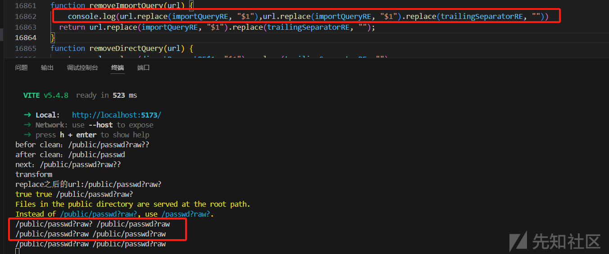

其他地方也没任何对url的实质性操作，也没用return赋值， 只是打印警告而已 ，也就不用看了所以warnAboutExplicitPublicPathInUrl也没啥作用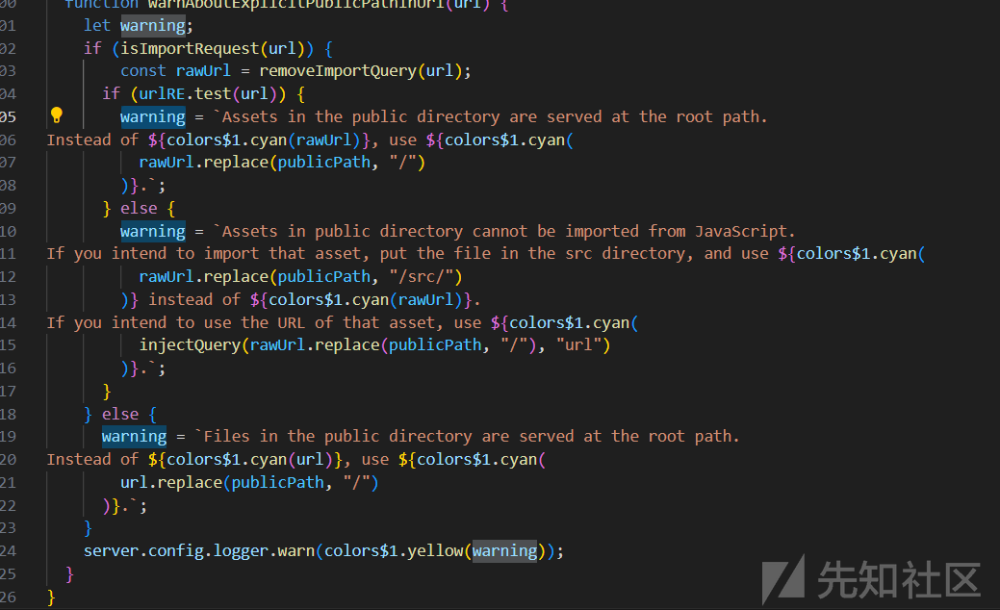

继续来看这部分

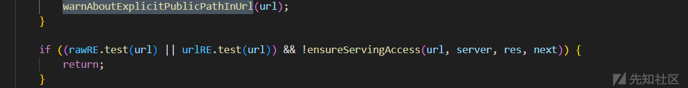

如果用错误的payload 也就直接return了 因为他没用raw也没用url

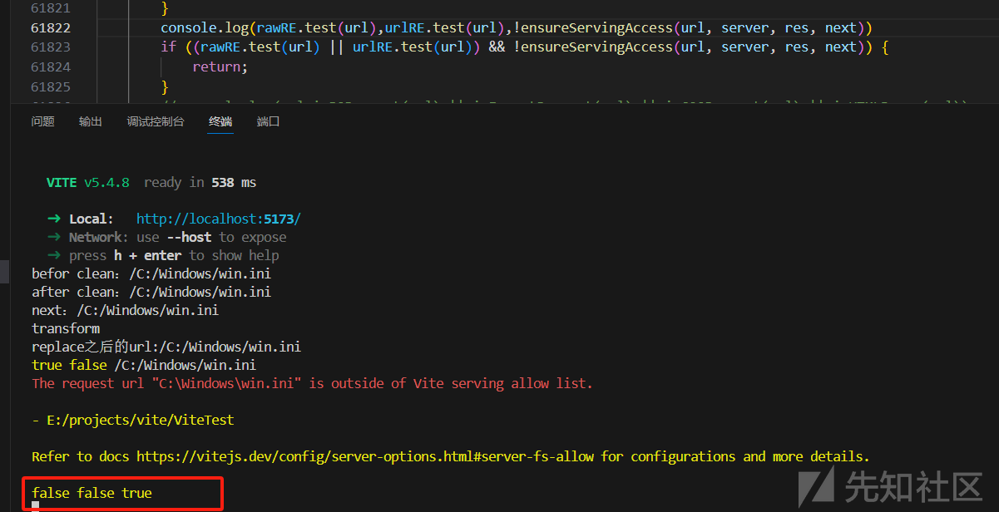

```

const urlRE = /(\?|&)url(?:&|$)/;
const rawRE = /(\?|&)raw(?:&|$)/;

function ensureServingAccess(url, server, res, next) {
  if (isFileServingAllowed(url, server)) {
    return true;
  }
    if (isFileReadable(cleanUrl(url))) {
    const urlMessage = `The request url "${url}" is outside of Vite serving allow list.`;
    const hintMessage = `
${server.config.server.fs.allow.map((i) => `- ${i}`).join("
")}

Refer to docs https://vitejs.dev/config/server-options.html#server-fs-allow for configurations and more details.`;
    server.config.logger.error(urlMessage);
    server.config.logger.warnOnce(hintMessage + "
");
    res.statusCode = 403;
    res.write(renderRestrictedErrorHTML(urlMessage + "
" + hintMessage));
    res.end();
    } else {
        
    next();
  }
  return false;
}

function isFileServingAllowed(url, server) {
  if (!server.config.server.fs.strict) return true;
  const file = fsPathFromUrl(url);
  if (server._fsDenyGlob(file)) return false;
  if (server.moduleGraph.safeModulesPath.has(file)) return true;
  if (server.config.server.fs.allow.some(
    (uri) => isSameFileUri(uri, file) || isParentDirectory(uri, file)
  ))
    return true;
  return false;
}

function isFileReadable(filename) {
  if (!tryStatSync(filename)) {
    return false;
  }
  try {
    fs__default.accessSync(filename, fs__default.constants.R_OK);
    return true;
  } catch {
    return false;
  }
}
```

前面我们有raw但是raw后面有?，不是直接接的&或者直接raw结束什么也没有导致(rawRE.test(url) || urlRE.test(url))为false，就压根不需要官ensureServingAccess了不会执行了。而只有后面payload有两个?或者更多?的时候才能满足括号为false,因为如果为没有?或者有一个?，这都会导致(rawRE.test(url) || urlRE.test(url))为true，就会执行ensureServingAccess。

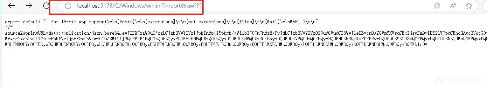

继续看 一个满足isJSRequest(url) 一个满足isImportRequest(url) 所以linux的没后缀就行这一步 windows的必须有import的

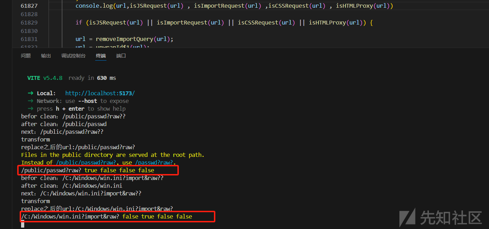

isJSRequest就是正常的请求或者有合法后缀的例如vue js 要么就是没有后缀且末尾没用/这个条件很容易满足isImportRequest前面也讲过了有import就可以了

```
const knownJsSrcRE = /\.(?:[jt]sx?|m[jt]s|vue|marko|svelte|astro|imba|mdx)(?:$|\?)/;


const isJSRequest = (url) => {
  url = cleanUrl(url);
  if (knownJsSrcRE.test(url)) {
    return true;
  }
  if (!path$n.extname(url) && url[url.length - 1] !== "/") {
    return true;
  }
  return false;
};
```

继续跟进 unwrapId也是没用的因为不是以那个开头的

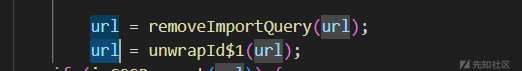

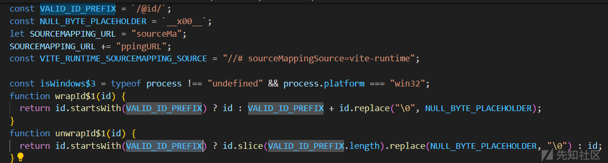

继续跟进到了这里

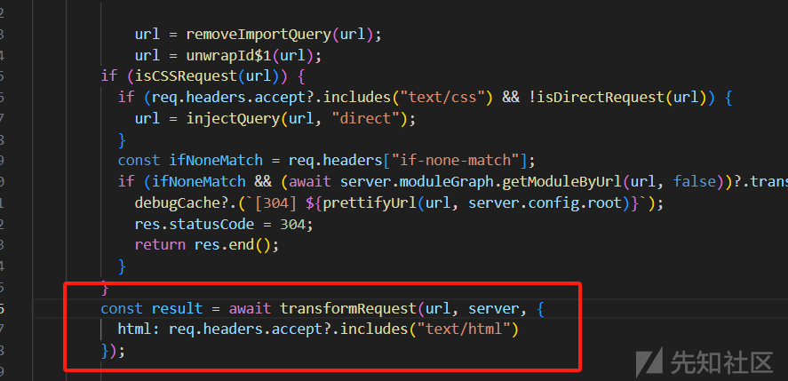

跟进去 直接看doTransform 因为前面的一看也没啥用

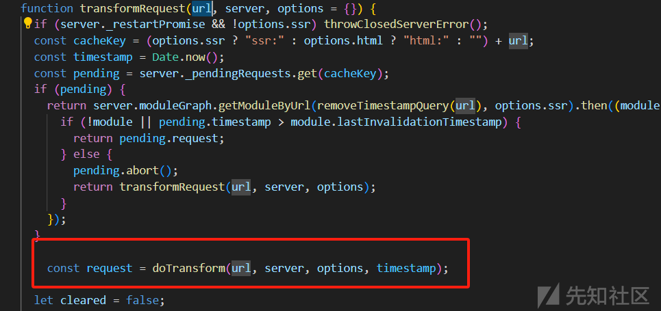

继续跟loadAndTransform

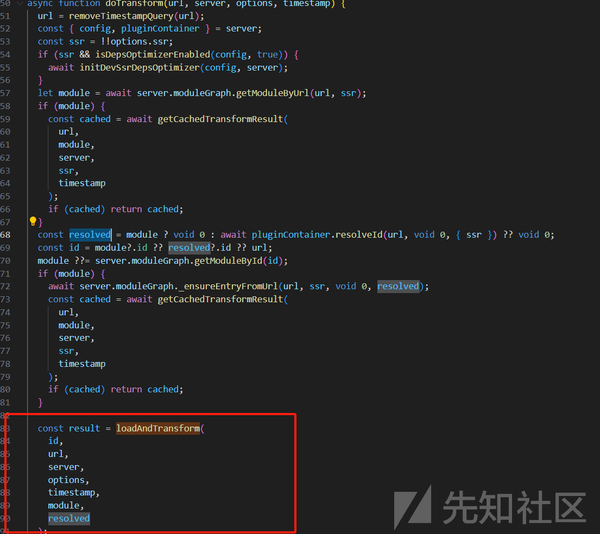

这里id其实就是C:/Windows/win.ini?raw

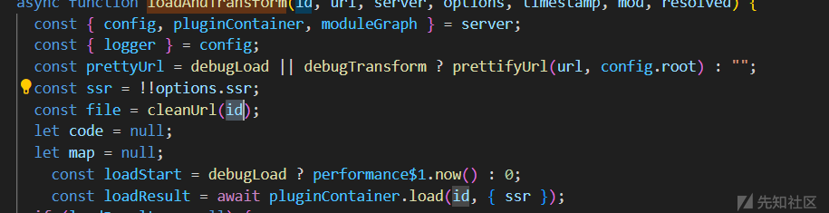

然后调用pluginContainer.load(id, { ssr })

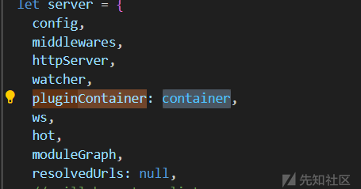

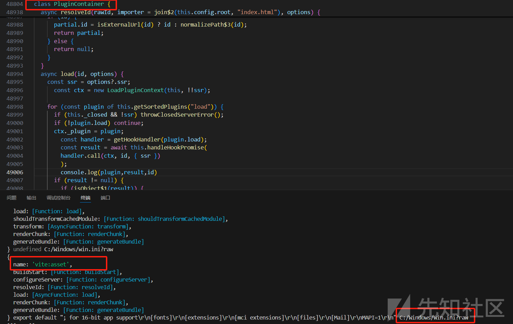

最终锁定是这个load

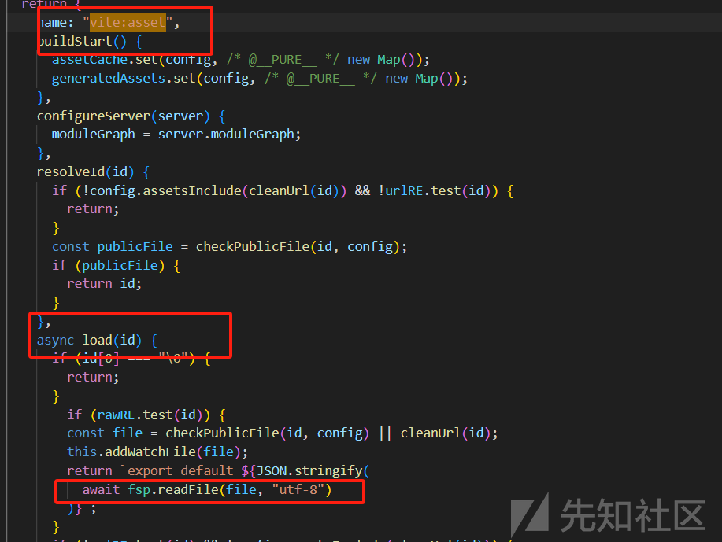

这里限制了payload必须要有raw

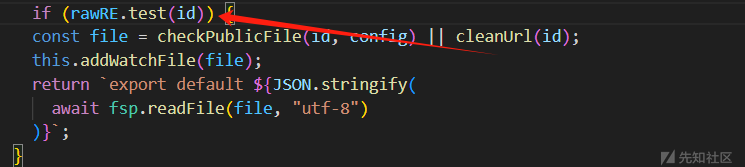

然后这里有进行一次clean 清洗之后就是C:/Windows/win.ini了

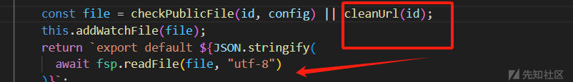
