# GG修改器的两种使用方式-先知社区

> **来源**: https://xz.aliyun.com/news/17565  
> **文章ID**: 17565

---

下载地址:<https://gameguardian.io/>

安装方式网上有很多就不在这里浪费时间了

这里主要想介绍两种方法

# 1.直接修改数据:

这一种方法有点像CE的查找方式;

比如地铁跑酷我们可以看到这里的金币数目是3150:

然后打开下载的gg修改器的这一个:

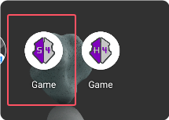

这两个的区别点进去我们就可以看到:

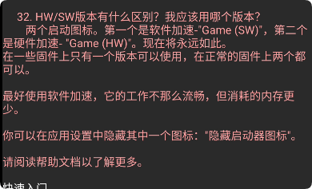

这里也建议我们使用HW

然后点击右下角的开始就会有悬浮窗出现,点击悬浮窗选择想要破解的软件:

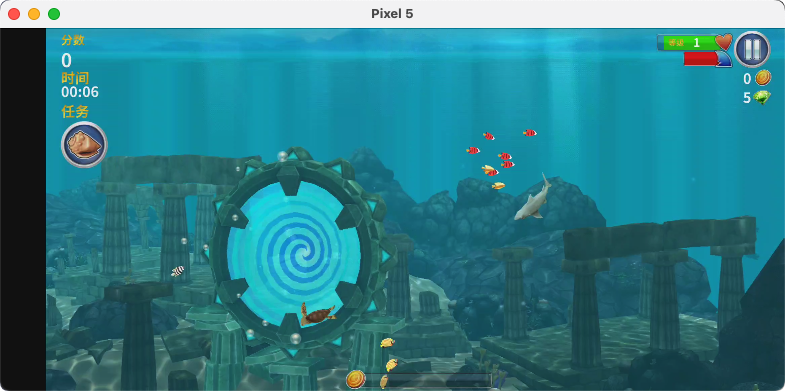

我们进去可以看到

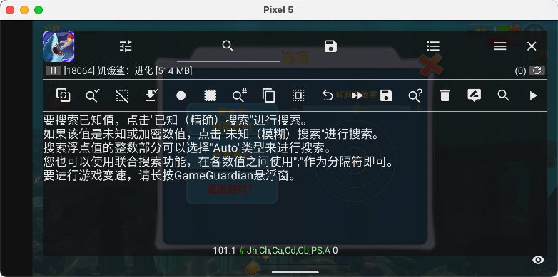

游玩一会发现金币是41

点击搜索:

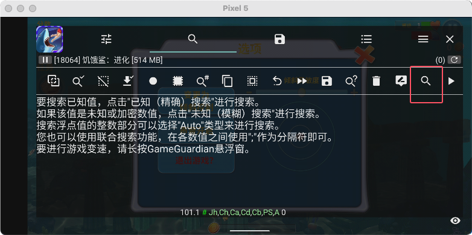

点击新搜索:

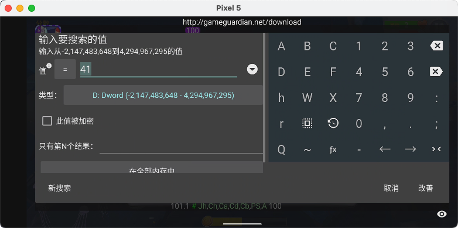

然后就可以看到这里帮我们找到了很多个数据,那么当我们金币数据更改了过后,再次搜索金币并点击改善:

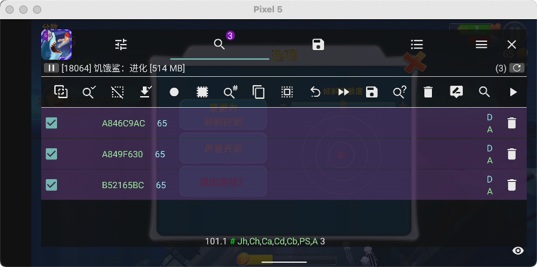

最后就是这三个数据一直在更具金币数目在变化,所以我们点击这几个数据一起改成超级大:

然后等再吃到金币的时候就会生效:

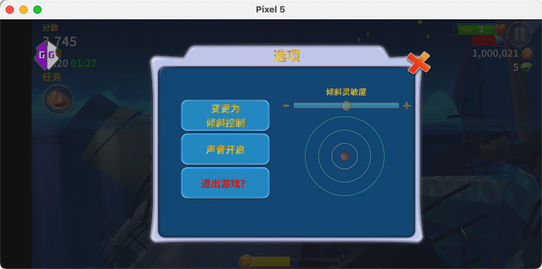

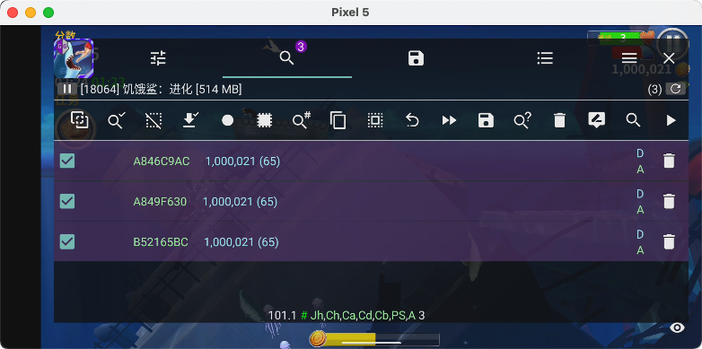

钻石也是差不多的原理

# 2.修改汇编代码:

## 对于题目的一些分析:

这一种方式我就以2023腾讯游戏安全的初赛Android题来介绍(这种修改方式是没有按照当时比赛的要求完成的):

游戏内容是要求我们得到1000个金币:

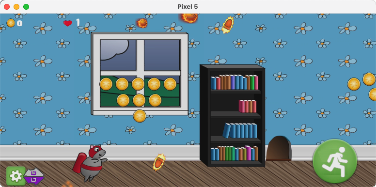

这一个游戏是一个unity写的,要完成对汇编指令的修改我们需要得到所需函数的偏移

### (1).对于程序的分析:通过frida dump下来

**下面的和gg修改器没什么关系,是对程序的分析过程,分析完再来使用gg修改器:**

针对unity游戏我们一般要去分析位于`\lib\armeabi-v8a\libil2cpp.so` 的这个文件和`\assets\bin\Data\Managed\Metadata\global-metadata.dat` 文件

但是这一道题我们的`libil2cpp.so`文件被加密了导致通过执行**IlCppDump**的时候报错

我们可以参考这一个大佬文章来使用frida将解密过后的so给hook下来

<https://oacia.dev/sec-2023/>

这里附上大佬的脚本:

```
function dump_so(so_name) {
    Java.perform(function () {
        var currentApplication = Java.use("android.app.ActivityThread").currentApplication();
        var dir = currentApplication.getApplicationContext().getFilesDir().getPath();
        var libso = Process.getModuleByName(so_name);
        console.log("[name]:", libso.name);
        console.log("[base]:", libso.base);
        console.log("[size]:", ptr(libso.size));
        console.log("[path]:", libso.path);
        var file_path = dir + "/" + libso.name + "_" + libso.base + "_" + ptr(libso.size) + ".so";
        var file_handle = new File(file_path, "wb");
        
        if (file_handle && file_handle != null) {
            Memory.protect(ptr(libso.base), libso.size, 'rwx');
            // 如果报错为 Error: access violation accessing, 那么可以尝试添加下面的这一行代码，libso.base 加上的值是通过 address (access violation accessing)-address (base) 计算出来的
            Memory.protect(ptr(libso.base.add(0x13b7000)), libso.size-0x13b7000, 'rwx');
            var libso_buffer = ptr(libso.base).readByteArray(libso.size);
            file_handle.write(libso_buffer);
            file_handle.flush();
            file_handle.close();
            console.log("[dump]:", file_path);
        }
    });
}

rpc.exports = {
    dump_so: dump_so
};
```

然后就能够使用**IlCppDump**得到dump.cs

使用hook过后的so用`libil2cpp.so` 在ida还原符号:

1. 使用ida打开解密过后的so
2. 在`Edit → Segments → Rebase program`选择ida\_with\_struct\_py3.py
3. 依次选择Il2CppDump的结果文件:`script.json` ,  `il2cpp.h`

然后这里就有我们需要修改的地方:

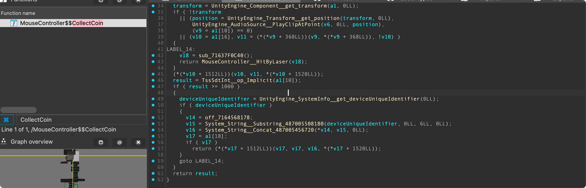

这一段的汇编码是:`CMP W0, #0x3E8`

如果改为`CMP W0, #0` 就直接能拿到flag了

### (2).通过**frida\_il2cppdump拿到dump.cs**

如果单纯想拿到dump.cs,还可以使用**frida\_il2cppdump**这个工具,阅读官方文档我们在使用之前要将\_agent.js文件里面的**exports.pkg\_name:**后面的内容替换成程序的包名如这里的`com.com.sec2023.rocketmouse.mouse`

```
./fr -l 0.0.0.0:1234  //改名改端口绕过frida检测
adb forward tcp:1234 tcp:1234 //转发端口
//启用
frida -H 127.0.0.1:1234 -l "D:\frida\frida-il2cppDumper-main\_agent.js" -f "com.com.sec2023.rocketmouse.mouse"
```

结果:

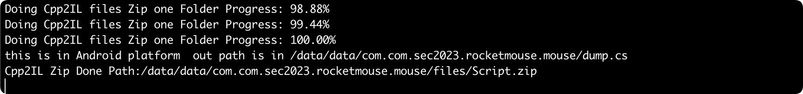

## 使用gg修改器:

上面已经分析过了,我们知道CollectCoin函数里面有我们需要修改的地方,所以我们打开dump.cs,然后搜索这个函数:

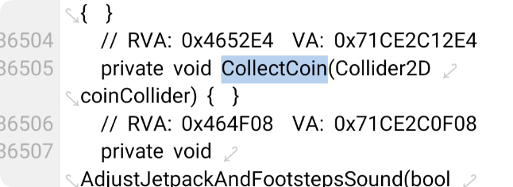

这里函数上的0x4652E4就是它的偏移,我们将其复制下来,然后在gg修改器上这样操作:

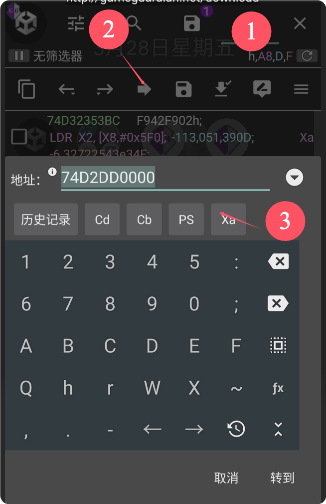

找到libil2cp.so的地方点击进去:

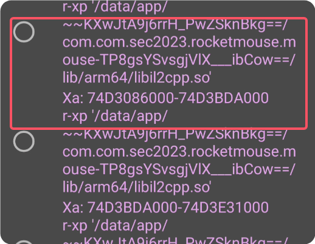

然后就跳转到了这里:

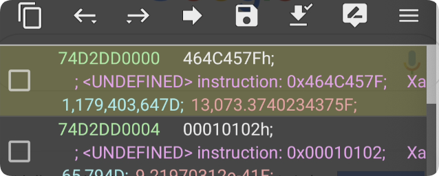

长按点击偏移计算器:

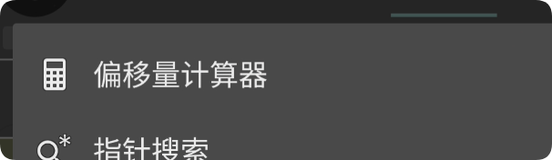

然后将我们复制的偏移粘贴进去: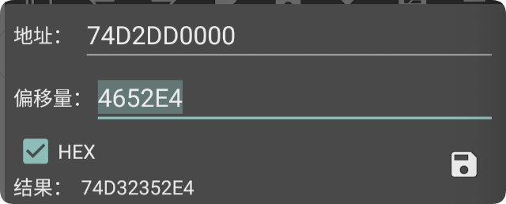

然后就进入到这个函数了:

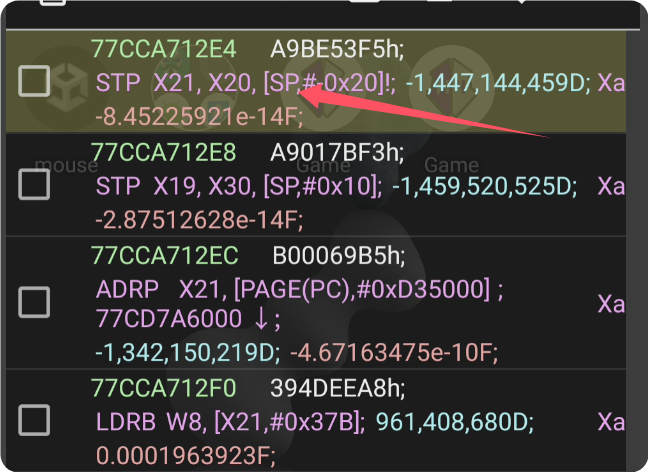

如果看不到汇编就在这里开启:

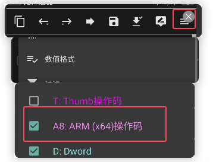

然后我们就往下翻找这一段:

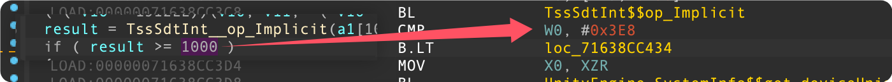

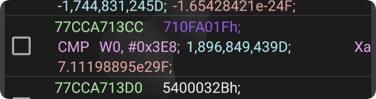

长按复制操作码:


然后点击更改类型:

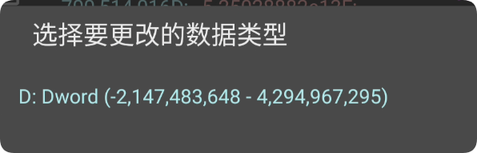

这样修改点击确定: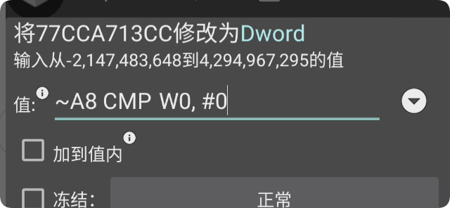

随便吃一个就能看到flag了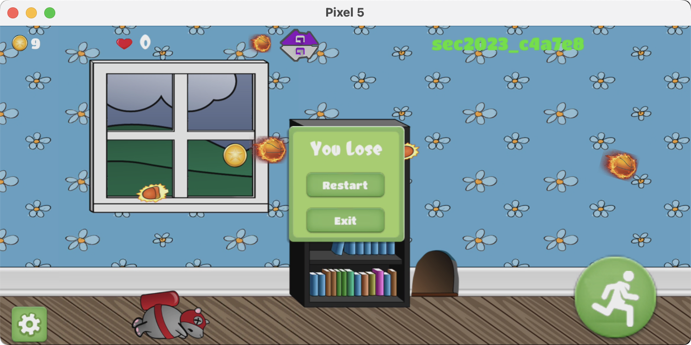

这种修改不是永久的,会在退出后复原

# 3.总结:

gg修改器对于单机游戏有的时候会有奇效,但是对于现在的联机游戏还是不要轻易尝试了,很容易被查到;还有一些高级用法待学习.
